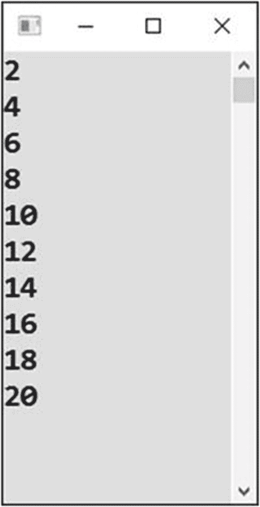
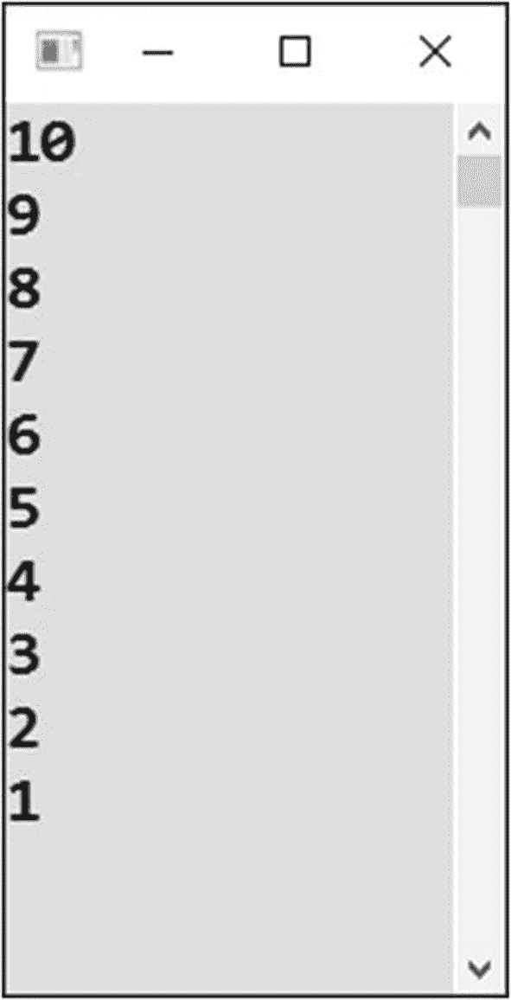
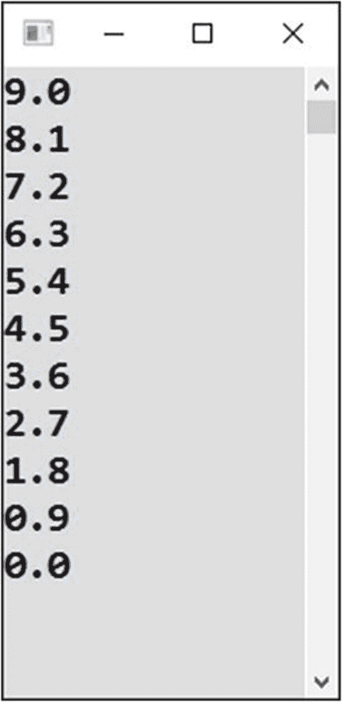
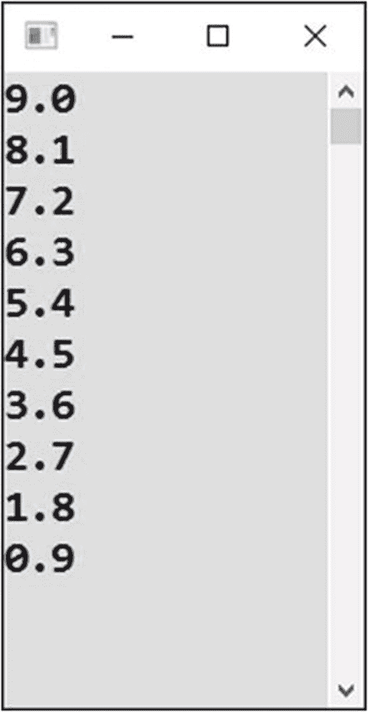
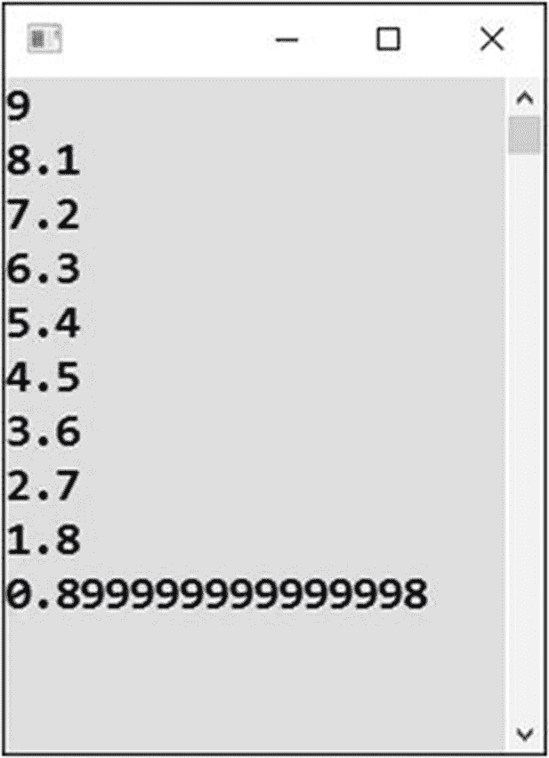
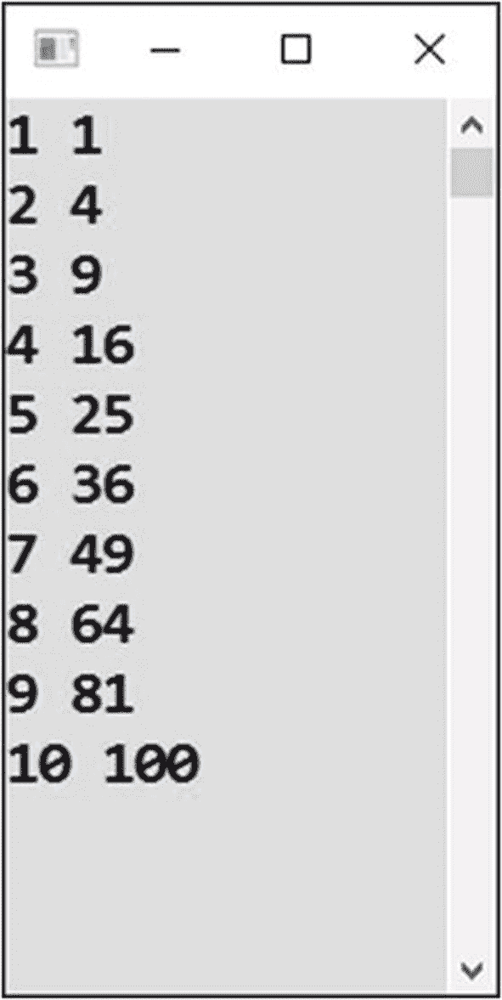
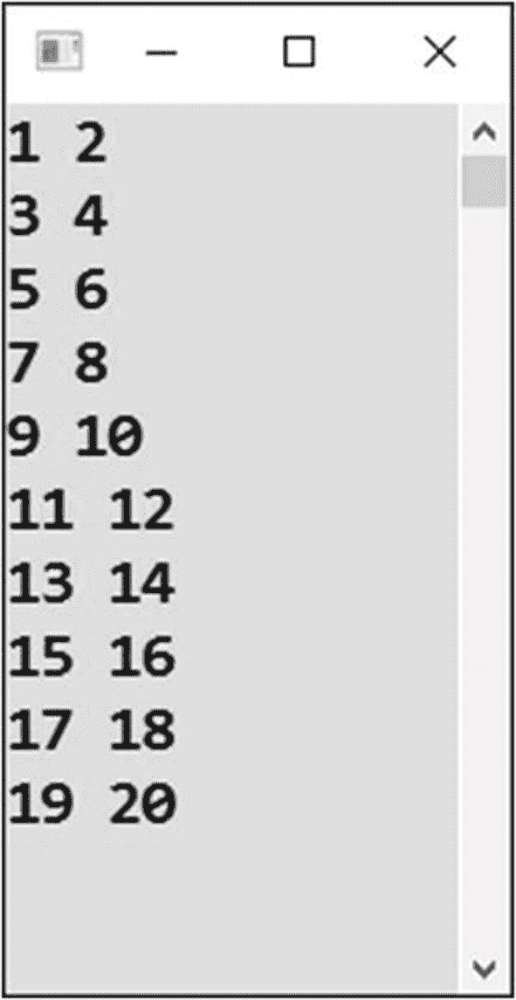
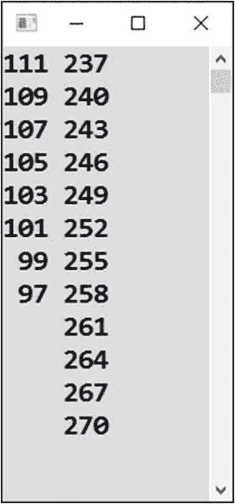

# 二十二、数字系列

一些编程任务简化为生成正则数列。这就是你本章要研究的内容。通过这种方式，您还可以更好地理解循环。

## 每隔一…

你已经能够生成一个简单的数列，比如从 1 到 10。现在，您将着手生成一个稍微复杂一点的序列。

### 工作

在该任务中，您将显示“每隔一个”的数字，直到 20(参见图 [22-1](#Fig1) )。



图 22-1

每隔一个数字显示一次

### 解决办法

代码如下:

```cs
static void Main(string[] args)
{
    // Output
    for (int number = 2; number <= 20; number += 2)
    {
        Console.WriteLine(number);
    }

    // Waiting for Enter
    Console.ReadLine();
}

```

### 讨论

练习的最大难点是实现如何编写`for`循环的*迭代器*。因为您想将变量`number`增加 2，相应的语句将是`number += 2`。

### 可选择的解决方案

用另一种方法解这道题很有趣。你可以有一个从 1 到 10 步进的普通循环，显示两倍的控制变量而不是变量本身。

```cs
static void Main(string[] args)
{
    // Output
    for (int line = 1; line <= 10; line++)
    {
        int displayedNumber = 2 * line;
        Console.WriteLine(displayedNumber);
    }

    // Waiting for Enter
    Console.ReadLine();
}

```

## 降级数

如果数列中的数字是递减的呢？那时很多事情都会改变。让我们来看看。

### 工作

在该任务中，您将显示从十到一的数字(参见图 [22-2](#Fig2) )。



图 22-2

数字在下降

### 解决办法

代码如下:

```cs
static void Main(string[] args)
{
    // Output
    for (int number = 10; number >= 1; number--)
    {
        Console.WriteLine(number);
    }

    // Waiting for Enter
    Console.ReadLine();
}

```

### 讨论

请注意以下几点:

*   循环的*初始化器*可能是最简单的。你从十点开始。

*   *迭代器*也不难；数字会变小，这就是为什么你在每一轮结束的时候减一。

*   最难的是*循环条件*。你必须以这样一种方式来制定它，只要你想让循环继续下去，它就成立，而当你想退出时，它就停止成立。正确的测试是`number`变量是否大于或等于 1。

## 十进制数字

带有十进制数字的序列可能会让您感到惊讶。

### 工作

在该任务中，您将生成一个从 9 到 0 的序列，数字在每一步中递减 0.9(见图 [22-3](#Fig3) )。



图 22-3

减少 0.9

### 看似正确的解决方案

使用上一个练习的样式，您可以编写以下内容:

```cs
static void Main(string[] args)
{
    // Output
    for (double number = 9; number >= 0; number -= 0.9)
    {
        Console.WriteLine(number.ToString("N1"));
    }

    // Waiting for Enter
    Console.ReadLine();
}

```

### 测试

然而，测试揭示了序列中缺失的最后一个成员:零(见图 [22-4](#Fig4) )。



图 22-4

缺少最后一个数字

这怎么可能呢？

### 错误的原因

这个练习展示了处理十进制数字是多么的棘手；你需要小心，因为十进制算术可能不精确！

当您忽略一个小数位(`.ToString("N1")`)的格式时，您可以感觉到原因。试试看(见图 [22-5](#Fig5) )。



图 22-5

省略格式

您可以看到，预期的倒数第二个系列成员比它应该的稍少。进一步减去 0.9 会得到略低于零的值，这就是为什么预期的最后一个零没有显示出来。

### 正确的解决方案

使用十进制数时，您需要指定一个循环的终值，并留有一点自由空间。

因此，该练习的正确答案如下所示:

```cs
static void Main(string[] args)
{
    // Output
    for (double number = 9; number >= -0.0001; number -= 0.9)
    {
        Console.WriteLine(number.ToString("N1"));
    }

    // Waiting for Enter
    Console.ReadLine();
}

```

检查结果！

## 第二权力

现在，在一行中显示两个相连的数字怎么样？

### 工作

除了 1 到 10 系列的数字外，您还可以在每一行输出中显示相应的二次幂(见图 [22-6](#Fig6) )。



图 22-6

显示第二功率

### 解决办法

代码如下:

```cs
static void Main(string[] args)
{
    // Output
    for (int number = 1; number <= 10; number++)
    {
        int secondPower = number * number;
        Console.WriteLine(number.ToString() + " " + secondPower.ToString());
    }

    // Waiting for Enter
    Console.ReadLine();
}

```

## 连续两次

让我们保持两个数在一条线上。

### 工作

在此任务中，您将生成一个 1–20 系列，每行输出中有几个数字(参见图 [22-7](#Fig7) )。



图 22-7

在一行上显示多个数字

### 解决办法

这个练习非常类似于上一章的交替循环任务。它也可以通过多种方式解决。我选其中一个:你在奇数后面加一个空格，偶数后面加一个换行符。

代码如下:

```cs
static void Main(string[] args)
{
    // Output
    for (int number = 1; number <= 20; number++)
    {
        Console.Write(number);

        // What goes after the number depends on the even/odd test
        if (number % 2 != 0)
        {
            // Odd number, displaying space
            Console.Write(" ");
        }
        else
        {
            // Even number, new line
            Console.WriteLine();
        }
    }

    // Waiting for Enter
    Console.ReadLine();
}

```

## 两个独立系列

另一个有趣的例子是两个独立的数列。

### 工作

你将会有两个，有点随意的，成员数不同的数列。第一个是每步递减 2(111，109，…，97)，第二个是每步递增 3(237，240，…，270)。

程序将在每一行显示第一个系列的数字和第二个系列的数字(见图 [22-8](#Fig8) )。



图 22-8

更复杂的交替

### 解决办法

代码如下:

```cs
static void Main(string[] args)
{
    // Preparation
    int first = 111;

    // Output
    for (int second = 237; second <= 270; second += 3)
    {
        // Preparing first text
        string firstText = first >= 97 ?
            first.ToString().PadLeft(3) : "   ";

        // Actual output
        Console.WriteLine(firstText + " " + second.ToString());

        // Changing x
        first -= 2;
    }

    // Waiting for Enter
    Console.ReadLine();
}

```

### 讨论

请注意以下几点:

*   使用循环的控制变量显示一个系列(较长的一个)。另一个用另一个自变量。

*   在每一步中，你都要检查较短的系列是否还在继续。

*   为了实现更好的格式化，您使用了`PadLeft`方法调用，该方法在参数的左边添加空格，以达到指定的字符总数。

## 摘要

在这一章中，你在生成各种数列的任务中练习了循环。具体来说，您学到了以下内容:

*   当级数为 2 步时，如何编写循环的迭代器？

*   如何在循环体中不直接显示控制变量，而是显示从中导出(计算)的值。

*   如何在一个循环的迭代器中使用`--`操作符生成一个降序序列，并使用`>=`操作符指定循环条件，这样只要你想进行循环，它就会被满足。

*   由于内存中十进制数的不精确表示，十进制数列需要特别小心。这意味着，例如，您需要在循环条件下提供额外的自由活动。

您还解决了在单个输出行中有两个数字的情况，以及两个独立系列的更困难的最终任务。