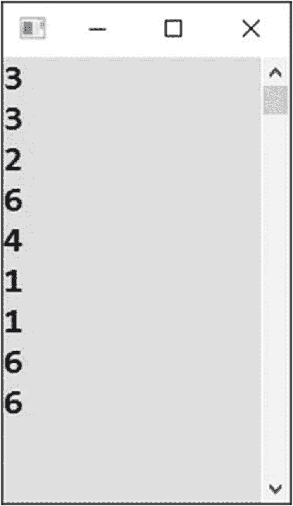

# 二十三、未知的重复次数

在所有你已经解决的循环中，你知道迭代的次数。有时候，当你写一个程序时，你并不知道它，仅仅是因为用户应该输入它。然而，在所有情况下，当一个循环开始时，已经确定了它将迭代多少次。

有时，在循环开始执行时，重复的次数是未知的。通常，您会关心循环应该继续还是终止的问题。

## 输入密码

第一项任务是登录。您事先不知道用户需要尝试多少次。

### 工作

您将反复要求用户输入密码，直到用户输入正确的密码(参见图 [23-1](#Fig1) )。正确的密码将是*的朋友*。


图 23-1

反复问一个问题

### 解决办法

代码如下:

```cs
static void Main(string[] args)
{
    string correctPassword = "friend";

    bool ok; // the variable must be declared outside of the loop!
    do
    {
        // Input
        Console.Write("Enter password: ");
        string enteredPassword = Console.ReadLine();

        // Evaluating
        ok = enteredPassword == correctPassword;
    } while (!ok); // loop repeats when the condition holds

    Console.WriteLine("Come inside, please...");

    // Waiting for Enter
    Console.ReadLine();
}

```

### 边做边施工

要编写循环，可以使用`do-while`构造。

计算机在单词`do`之后进入循环，执行它的语句，并询问“再来一次？”。如果在`while`字之后的条件成立，计算机返回到循环的开始，换句话说，在`do`字之后。等等。

当`while`字后的条件被评估为未实现(`false`)时，循环终止。

### 这个案子

在这种情况下，程序会在每次输入后评估输入的密码。评估结果随后存储在一个名为`ok`的`bool`类型变量中。

如果输入的密码不正确，您希望循环继续。这就是为什么在`while`条件中使用否定运算符(感叹号)的原因。

### 循环外的变量

C# 要求循环条件中使用的所有变量都在循环之外声明。当您在内部声明它们时，它们在指定条件时不可见。

### 小费

Visual Studio 可以帮助您处理`do-while`循环。只需输入`do`，按两下 Tab 键。

## 等待下降

想象一下，计算机观察某个在大多数时间增长的量，任务是检测它减少(下降)的(可能很少)时刻。

在挖掘存储在文件或数据库中的大量数据时，您通常会遇到这样的问题。但是，您将根据用户输入的数据来解决这个问题。

### 工作

你将制作一个反复要求用户输入的程序(见图 [23-2](#Fig2) )。每当用户输入一个小于前一个的数字时，程序将通知用户(并终止)。


图 23-2

当数字变小时终止

### 解决办法

解决方案的核心是记住以前的值，而不仅仅是当前输入的值。

代码如下:

```cs
static void Main(string[] args)
{
    // Preparations
    int previous = int.MinValue;
    bool ok;

    // Repeating until descend
    do
    {
        // Input
        Console.Write("Enter a value (number): ");
        string input = Console.ReadLine();
        int value = Convert.ToInt32(input);

        // Evaluating
        ok = value >= previous; // ok = still not descending

        // Storing for the next round of the loop
        previous = value;
    } while (ok);

    // Message to the user
    Console.WriteLine("Descend detected...");

    // Waiting for Enter
    Console.ReadLine();
}

```

### 讨论

第一个值有些特殊，因为它没有前任。它的缺失可以通过使用一些非常小的数字来模拟它来规避。C# 为您提供了`int.MinValue`，这是可以存储在`int`类型中的最小值，大约是负 20 亿。

## 直到年底的每个星期

让我们继续下一个练习，它与日期有关。

### 工作

任务是显示从今天开始到年底的日期，并以一周为单位进行(见图 [23-3](#Fig3) )。


图 23-3

一年中，每次一周

### 解决办法

代码如下:

```cs
static void Main(string[] args)
{
    // Today
    DateTime today = DateTime.Today;
    int thisYear = today.Year;

    // Repeating
    DateTime date = today;
    do
    {
        // Output
        Console.WriteLine(date.ToLongDateString());

        // Preparing next output (a week later)
        date = date.AddDays(7);
    } while (date.Year == thisYear);

    // Waiting for Enter
    Console.ReadLine();
}

```

## 只要 6 号被抛出

随机数可以为您提供不确定循环终止的其他好例子。

### 工作

你将掷出一个骰子，只要有一个六，你就一直掷出这个骰子(见图 [23-4](#Fig4) 和 [23-5](#Fig5) )。


图 23-5

只要你得到 6，就掷骰子


图 23-4

滚动一次骰子(没有六次，没有重复)

你可能知道一些使用这个原则的棋盘游戏。

### 解决办法

代码如下:

```cs
static void Main(string[] args)
{
    // Random number generator
    Random randomNumbers = new Random();

    // Throwing as long as we have six
    int thrown;
    do
    {
        thrown = randomNumbers.Next(1, 6 + 1);
        Console.WriteLine(thrown);
    } while (thrown == 6);

    // Waiting for Enter
    Console.ReadLine();
}

```

## 直到第二个六

这个任务是关于具有随机值的未知重复次数。

### 工作

你将编写一个程序，抛出一个骰子，直到第二次抛出 6(见图 [23-6](#Fig6) )。


图 23-6

一直等到 6 出现两次

### 解决办法

你只需数一数掷出六个骰子的次数。

代码如下:

```cs
static void Main(string[] args)
{
    // Random number generator
    Random randomNumbers = new Random();

    // Throwing until the second six is thrown
    int howManySixes = 0;
    do
    {
        // Actual throwing
        int thrown = randomNumbers.Next(1, 6 + 1);
        Console.WriteLine(thrown);

        // Counting sixes
        if (thrown == 6)
        {
            howManySixes++;
        }
    } while (howManySixes < 2);

    // Waiting for Enter
    Console.ReadLine();
}

```

## 直到连续两个六

你知道为什么扔骰子的例子那么多吗？我小时候喜欢玩桌游，能看出来吗？

### 工作

在这个程序中，你将掷出一个骰子，直到连续两次掷出 6(见图 [23-7](#Fig7) )。



图 23-7

连续两个六

### 解决办法

除了当前抛出的数字，您还需要跟踪前一个数字。这类似于“等待下降”部分中的程序。

如果当前和先前的数字都是 6，程序终止。

同样，第一个值是特定的，因为它没有前任。这就是为什么`previous`变量从零开始，这是一个永远不会出现在骰子上的值。

代码如下:

```cs
static void Main(string[] args)
{
    // Random number generator
    Random randomNumbers = new Random();

    // Preparations
    int previous = 0;
    bool ending;

    // Throwing until two sixes in a row
    do
    {
        // Actually throwing
        int thrown = randomNumbers.Next(1, 6 + 1);
        Console.WriteLine(thrown);

        // Evaluating
        ending = thrown == 6 && previous == 6;

        // Preparing for next round of the loop
        previous = thrown;
    } while (!ending);

    // Waiting for Enter
    Console.ReadLine();
}

```

## 摘要

在本章中，你学习了循环开始时不知道重复次数的循环。在 C# 中，这种循环可以使用`do-while`构造来编写。它的功能首先是执行身体的陈述，然后问，“再来一次？”评估条件，如果条件成立，就执行另一轮循环。

您还看到，要在`do-while`循环条件中使用某个变量，该变量必须在循环之外声明。

使用`do-while`循环时的一个常见错误是对其条件的错误表述。你必须小心，以这样的方式写，如果你想继续循环，条件应该评估为`true`。

在本章的几个任务中，你需要一些来自前一轮循环的值。为此，您使用了一个特殊的变量来存储值。当然，第一轮循环需要特殊处理。