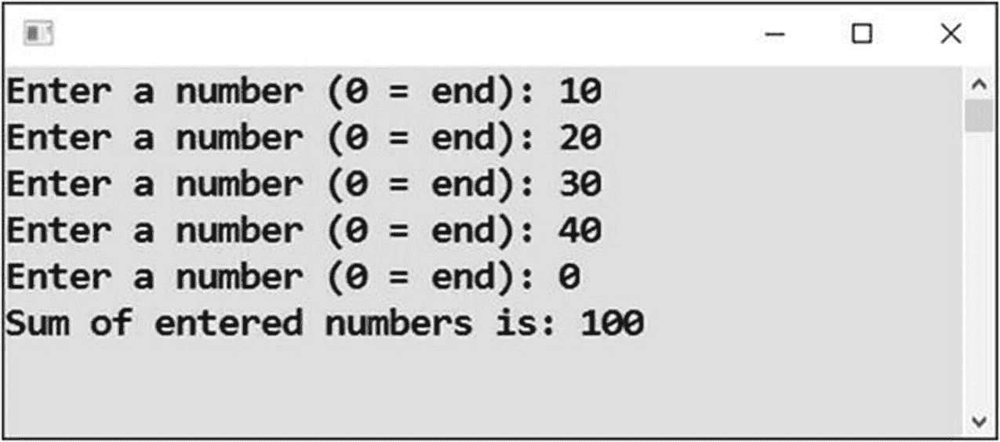
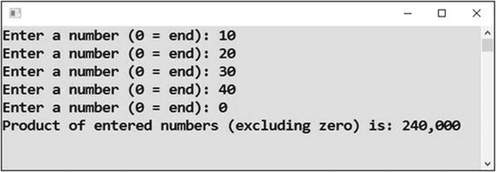
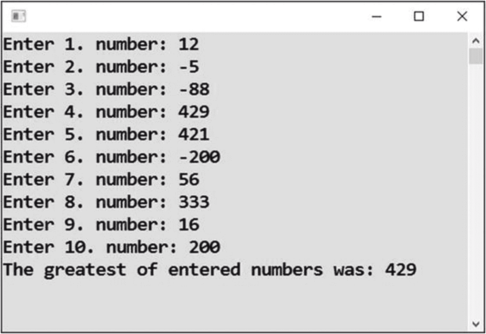
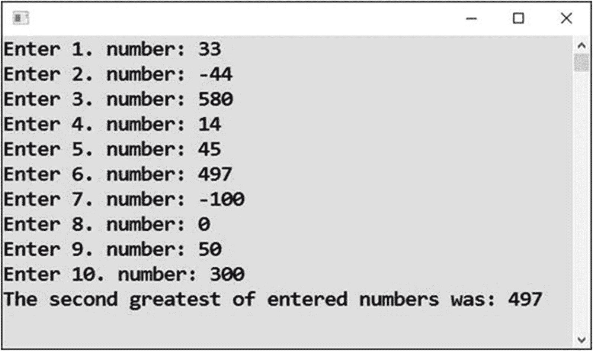
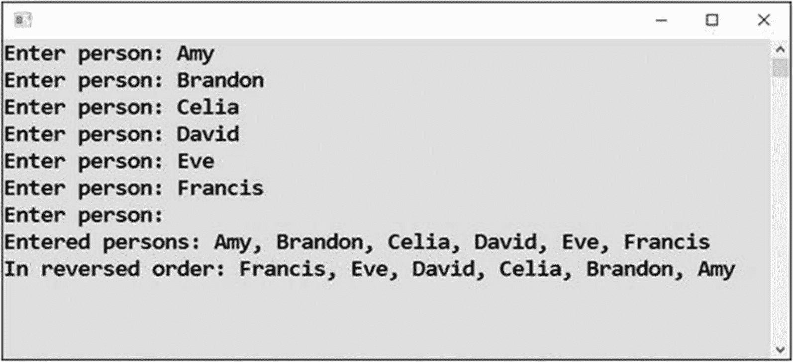

# 二十四、累积中间结果

在这一章中，你将学习使用循环处理大型数据集的重要案例。你会经常用一个循环去遍历大量的数据，去积累(聚合)一些中间结果，这些结果在循环终止后就成为最终结果。

## 输入数字的总和

此类别中的一个典型任务是对大量值求和。

### 工作

假设用户正在输入数字，最后一个数字是零。换句话说，用户通过输入零来表示他们完成了。然后程序显示所有输入数字的总和(见图 [24-1](#Fig1) )。



图 24-1

将所有数字相加直到零

### 解决办法

解决方案的核心是积累中间结果。你必须把它保存在一个变量中，并把每个输入的数字都加到这个变量中。一旦用户终止输入，变量将包含所有输入值的总和。

代码如下:

```cs
static void Main(string[] args)
{
    // Preparations
    int sum = 0;
    int number;

    // Entering numbers until zero
    do
    {
        // Input
        Console.Write("Enter a number (0 = end): ");
        string input = Console.ReadLine();
        number = Convert.ToInt32(input);

        // Adding to intermediate sum
        sum += number;
    } while (number != 0);

    // Output
    Console.WriteLine("Sum of entered numbers is: " + sum.ToString());

    // Waiting for Enter
    Console.ReadLine();
}

```

## 输入数字的乘积

把输入的数字相乘而不是求和怎么样？你认为任务是一样的吗？也不完全是。

### 工作

在该程序中，用户输入数字，最后一个数字为零(见图 [24-2](#Fig2) )。然后，程序显示所有输入数字的乘积，当然不包括最后的零，这将使所有数字为零。



图 24-2

将所有数字相乘

### 解决办法

代码如下:

```cs
static void Main(string[] args)
{
    // Preparations
    double product = 1;
    int number;

    // Entering numbers until zero
    do
    {
        // Input
        Console.Write("Enter a number (0 = end): ");
        string input = Console.ReadLine();
        number = Convert.ToInt32(input);

        // Accumulating in intermediate product (but not the last zero!)
        if (number != 0)
        {
            product *= number;
        }
    } while (number != 0);

    // Output
    Console.WriteLine("Product of entered numbers (excluding zero) is: " + product.ToString("N0"));

    // Waiting for Enter
    Console.ReadLine();
}

```

### 讨论

请注意以下几点:

*   `product`变量从一个与零相反的值开始，这是您在计算总和时使用的。

*   更新产品时，需要注意不要包括最后的零。

*   您在类型`double`中声明了`product`变量，以避免结果溢出。当你乘的时候，你很快得到大的数字。

## 最伟大的

处理大量数据时的另一个典型任务是搜索极值，换句话说，最大值或最小值。

### 工作

在这个程序中，用户输入十个数字。然后程序输出哪个最大(见图 [24-3](#Fig3) )。



图 24-3

输出最大的数字

### 解决办法

你又要累加中间结果了。这一次，它将是“迄今为止”最大的数字。你必须特别注意第一个值；`greatest`变量在开始时被设置为最小可能值，以确定第一个输入的数字总是较大。

因为您期望输入中正好有十个值，所以在这里使用`for`循环更方便。

代码如下:

```cs
static void Main(string[] args)
{
    // Preparation
    int greatest = int.MinValue;

    // Input of ten numbers
    for (int order = 1; order <= 10; order++)
    {
        // Input
        Console.Write("Enter " + order.ToString() + ". number: ");
        string input = Console.ReadLine();
        int number = Convert.ToInt32(input);

        // Is it greater than the greatest so far?
        if (number > greatest)
        {
            greatest = number;
        }
    }

    // Output
    Console.WriteLine("The greatest of entered numbers was: " + greatest.ToString());

    // Waiting for Enter
    Console.ReadLine();
}

```

## 第二伟大的

第二大价值呢？这是一个困难得多的练习。

### 工作

任务是从十个输入的数字中选择第二大的数字(见图 [24-4](#Fig4) )。



图 24-4

显示第二大的数字

### 解决办法

你需要记住并不断更新两个最大的数字。仅仅记住第二大奇迹是不够的。

这种情况类似于滑雪比赛，参赛者一个接一个地到达终点。在某个时刻，有人是第一；过了一会儿，又有人把第一名挤到了第二名。可能在以后的时间里，那个滑雪者甚至可能失去第二名，仅仅是因为有人会比他们更好，甚至比新的领先者更好。

代码如下:

```cs
static void Main(string[] args)
{
    // Preparation
    int greatest = int.MinValue;
    int secondGreatest = int.MinValue;

    // Input of ten numbers
    for (int order = 1; order <= 10; order++)
    {
        // Input
        Console.Write("Enter " + order.ToString() + ". number: ");
        string input = Console.ReadLine();
        int number = Convert.ToInt32(input);

        // Is it greater than the greatest so far?
        if (number > greatest)
        {
            // Moving so far greatest to the second place
            secondGreatest = greatest;

            // Entered number becomes the greatest so far
            greatest = number;
        }
        else
        {
            // We did not beat the greatest, will we beat the second greatest at least?
            if (number > secondGreatest)
            {
                secondGreatest = number;
            }
        }
    }

    // Output
    Console.WriteLine("The second greatest of entered numbers was: " + secondGreatest.ToString());

    // Waiting for Enter
    Console.ReadLine();
}

```

## 所有输入名称的输出

本章的最后一个练习与文本有关，特别是处理大量文本(见图 [24-5](#Fig5) )。



图 24-5

以原始顺序打印，然后反转

### 工作

您将编写一个程序，重复读取用户输入的名称。空输入表示终止。然后程序重复所有输入的名字，首先以相同的顺序，然后以相反的顺序。

### 解决办法

为了让你能够在最后重复所有的名字，你需要在某个地方记住它们。你需要*积累*它们。一个变量将在它的末端累积它们(相同顺序的输出)，另一个在它的开始累积它们(相反顺序的输出)。

代码如下:

```cs
static void Main(string[] args)
{
    // Preparation
    string inSameOrder = "";
    string inReversedOrder = "";
    bool terminating;

    // Repeating until blank input
    do
    {
        // Input
        Console.Write("Enter person: ");
        string person = Console.ReadLine();

        // Processing input
        terminating = person.Trim() == "";
        if (!terminating)
        {
            inSameOrder = inSameOrder + person + ", ";
            inReversedOrder = person + ", " + inReversedOrder;
        }
    } while (!terminating);

    // Removing trailing comma and space
    if (inSameOrder.EndsWith(", "))
    {
        int numberOfCharacters = inSameOrder.Length;
        inSameOrder = inSameOrder.Remove(numberOfCharacters - 2);
    }
    if (inReversedOrder.EndsWith(", "))
    {
        int numberOfCharacters = inReversedOrder.Length;
        inReversedOrder = inReversedOrder.Remove(numberOfCharacters - 2);
    }

    // Output
    Console.WriteLine("Entered persons: " + inSameOrder);
    Console.WriteLine("In reversed order: " + inReversedOrder);

    // Waiting for Enter
    Console.ReadLine();
}

```

### 讨论

请注意以下几点:

*   您使用`Trim`方法来切断输入文本可能的前导或尾随空格，以便允许终止任何空白输入，包括几个空格。

*   最后，你必须去掉两个累积文本中的最后两个字符。在此之前，您需要测试这两个字符(一个逗号和一个空格)是否出现在文本的末尾。如果用户通过输入空行立即终止程序，这些字符将不会出现。

*   要测试文本是否以某个东西结尾，可以使用`EndsWith`方法。

## 摘要

循环最常见的用途之一是处理大量数据，无论是数字、文本还是整个对象。在循环体中，您处理单个数据，而循环确定所有数据都得到处理。

您通过求和、相乘和求极值的例子练习了处理大量数据。

最困难的练习是找出第二大数字，这需要仔细考虑根据数据可能出现的情况。

上一个任务向你展示了几种处理文本的方法:`Trim`、`EndsWith`和`Remove`。