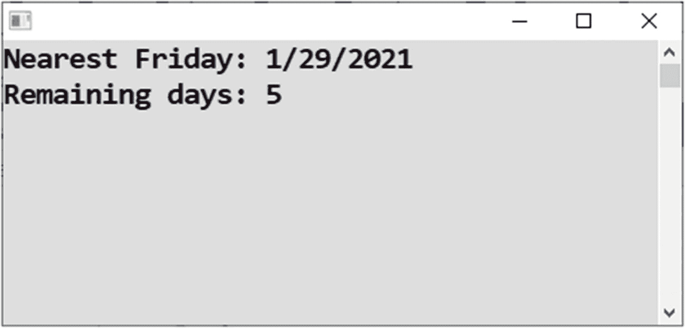
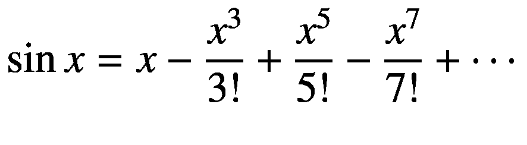
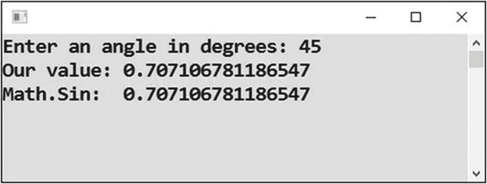
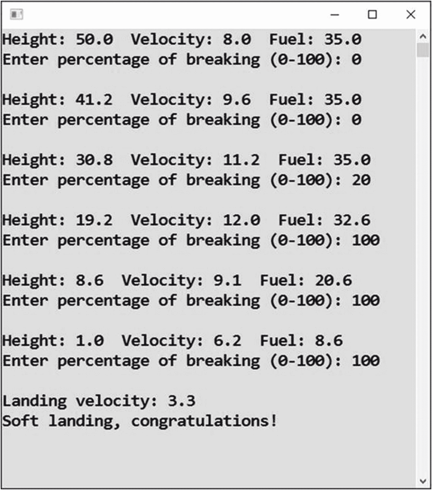

# 二十五、高级循环

在本章中，您将完成简单循环的主题。这在“不嵌套”的意义上是简单的，而不是“琐碎的”没有循环是微不足道的，尤其是本章中的循环。

这一章和整本书将以一个奖励结束:一个登月模拟游戏。如果你觉得本章的练习太难，就只玩游戏。

## 感谢上帝，今天是星期五

是时候熟悉一下`while`循环了，它是您已经熟悉的`do-while`循环的表亲。

### 工作

你将准备一个程序，显示最近的星期五的日期和剩余天数(见图 [25-1](#Fig1) )。



图 25-1

显示最近的星期五

### 解决办法

代码如下:

```cs
static void Main(string[] args)
{
    // Today's date
    DateTime today = DateTime.Today;

    // Moving day after day until hit on Friday
    DateTime date = today;
    while (date.DayOfWeek != DayOfWeek.Friday)
    {
        date = date.AddDays(1);
    }

    // Calculating remaining days
    TimeSpan dateDifference = date - today;
    int daysRemaining = dateDifference.Days;

    // Outputs
    Console.WriteLine("Nearest Friday: " + date.ToShortDateString());
    Console.WriteLine("Remaining days: " + daysRemaining.ToString());
    if (daysRemaining == 0)
    {
        Console.WriteLine("Thanks God!");
    }

    // Waiting for Enter
    Console.ReadLine();
}

```

### 讨论

让我们更仔细地看看这个程序。

#### While 循环

要编写循环，您可以使用`while`构造，它在功能上类似于`do-while`，除了它的条件是在开始。因此，在进入循环之前，第一次对条件*进行评估，如果条件不成立，循环体一次也不执行！*

#### 这个案子

在进入循环之前测试条件正是你需要做的。如果今天是星期五，您想让它保持原样。否则，你就是在加一天。

#### TimeSpan 对象

当你减去两个日期时，产生的结果总是一个`TimeSpan`对象。它的`Days`属性表示这两个日期之间的“时间跨度”已经过去了多少天。

## 力量

循环是数学练习中经常用到的。

### 工作

您将编写一个程序，在给定小数 *x* 和正整数 *n* 的情况下，计算数字 *x* 的 *n* 次方(参见图 [25-2](#Fig2) )。


图 25-2

计算 n 次方

只是提醒一下，2<sup>10</sup>= 2×2×2×2×2×2×2×2 = 1024，这是最终产品中重复 10 次的数字 2。

### 解决办法

该任务可以通过重复乘以 *x* 来解决。这意味着你使用你已经学会的中间结果累积方法。

原则上，该解决方案与第 [24](24.html) 章“输入数字的乘积”一节中的解决方案非常接近:

```cs
static void Main(string[] args)
{
    // Inputs
    Console.Write("Enter x (number to be raised): ");
    string inputX = Console.ReadLine();
    double x = Convert.ToDouble(inputX);

    Console.Write("Enter n (power): ");
    string inputN = Console.ReadLine();
    int n = Convert.ToInt32(inputN);

    // Calculating
    double result = 1;
    for (int count = 0; count < n; count++)
    {
        result *= x;
    }

    // Output
    Console.WriteLine("x^n=" + result.ToString());

    // Waiting for Enter
    Console.ReadLine();
}

```

## 正弦

继续数学，你知道计算机实际上是如何进行计算的吗，例如，正弦函数？如果你对数学感兴趣，你可能会对它感兴趣。

为了完成这个任务，你可以使用所谓的泰勒展开式。有聪明人发现正弦函数在给定点 *x* ( *x* 是以弧度为单位的角度)的值可以计算成无穷级数的和:



### 工作

现在的任务是编写一个程序，计算这个数列的和，并将结果与现成方法`Math.Sin`的值进行比较(见图 [25-3](#Fig3) )。



图 25-3

计算正弦

如果您对如何计算正弦函数的值不感兴趣，请将此任务作为编写更难的循环的挑战。

### 分析

首先，你要分析计算。

#### 无穷级数

要求和的级数是无穷的，但是你可能想知道如何对无穷多个数求和。

当然，你不能这样做。诀窍在于，您实际上不需要对该系列的无限个成员求和。在某一点上，它们变得如此之小，以至于它们的贡献远远落后于小数点。

出于实际原因，你只需要一个确定的精度，比如说 15 位小数；`double`型反正容纳不下更多的地方。因此，只要系列成员在小数点后第 15 位大于 1，就可以计算总和。

#### 系列成员

所有的系列成员都是相似的。他们有一个奇数幂，奇数阶乘，和一个变化的符号。

提醒你一下，7！= 1 × 2 × 3 × … × 7.换句话说，阶乘是从 1 到给定数字的所有数字的乘积。

#### 阶乘

可以用类似于本章前面计算幂的方法来计算阶乘，换句话说，就是在一个循环中逐步将所有的数相乘。

然而，你可以用更聪明的方法来做。你不需要从头开始计算每个阶乘。你总是可以从之前计算的结果中更快地得到它。

比如 7！= 7 × 6 × 5!。7 的阶乘可以通过 5 的阶乘乘以“缺失数”6 和 7 来计算。

#### 力量

可以使用类似的技巧来计算每个串联成员的“功率部分”。功率不必从头开始计算。下一次幂就是上一次幂乘以 *x* 的平方。

比如 x<sup>7</sup>= x<sup>5</sup>×x<sup>2</sup>。

### 解决办法

解决方案如下:

```cs
static void Main(string[] args)
{
    // Input
    Console.Write("Enter an angle in degrees: ");
    string input = Console.ReadLine();
    double angle = Convert.ToInt32(input);

    // Converting to radians
    double x = Math.PI / 180 * angle;

    // Preparations
    double member;
    double sum = 0;
    double tinyValue = 1e-15;

    double sign = 1;
    double power = x;
    double factorial = 1;
    double multiplier = 1;

    // Sum of the series
    do
    {
        // Calculating current member of the series
        member = sign * power / factorial;

        // Appending to sum
        sum += member;

        // Preparing next step
        sign *= -1;
        multiplier++;
        factorial *= multiplier;
        multiplier++;
        factorial *= multiplier;

        power *= x * x;

    } while (Math.Abs(member) > tinyValue);
    // Output

    Console.WriteLine("Our value: " + sum.ToString());
    Console.WriteLine("Math.Sin:  " + Math.Sin(x).ToString());

    // Waiting for Enter
    Console.ReadLine();
}

```

### 提高

您可以利用这个事实使计算更好，即对于 0 附近的 *x* 的值，级数收敛最快。使用正弦函数对称性，对大值 *x* 的计算可以转换成小值 *x* 的计算。

我会认为微软在`Math.Sin`的代码里有这一招。

## 月球登陆

自从阿波罗 11 号登月以来，创建登月舱着陆的模拟已经在各种编程平台上流行起来。所以，你要写一个类似的模拟作为本书的总结任务。

### 工作

你将编写一个模拟登月的程序。它将跟踪模块的高度 *h* ，月球表面，模块的速度 *v* ，以及着陆剩余燃料的质量 *m* <sub>*F*</sub> 。

用户的任务是软着陆(以尽可能小的速度)。在每一步中，代表着陆动作的一秒钟，用户根据百分比输入应该施加多少制动。百分比越高，速度越低，但同时消耗的燃料越多，如图 [25-4](#Fig4) 所示。



图 25-4

登月计划

一旦高度降到零度以下，登月舱就着陆了。程序通知用户着陆速度，并根据下表进行评估:

<colgroup><col class="tcol1 align-left"> <col class="tcol2 align-left"></colgroup> 
| 

着陆速度

 | 

估价

 |
| --- | --- |
| 小于 4 米/秒 | “软着陆” |
| 4-8 米/秒 | 硬着陆 |
| 大于 8 米/秒 | † |

如果在着陆结束前所有的燃油都消耗完了，程序开始忽略输入的刹车值，制动力设置为零。

### 物理模型

该计划将基于这里讨论的现实模型。

以下是初始值:

*   *h* = 50(米)

*   *v* = 8(米/秒)

*   *m*<sub>T3】FT5】= 35(公斤)</sub>

在代表着陆机动的一秒钟的每一步中，被跟踪的物理量的值将根据以下关系变化(意味着相应量的变化，如物理学中通常的那样):

*h*=–*v*–*a*/2

*v* = *a*

*m*<sub>T3】FT5】=–*F*/3000</sub>

在哪里

*   制动力为制动百分比的 *F* = 360 × *。*

*   朝向表面的加速度为*a*= 1.62-*F*/8000。

### 解决办法

代码如下:

```cs
static void Main(string[] args)
{
    // Initial values
    double h = 50, v = 8, mF = 35;

    // Preparation
    bool malfunction = false;

    // Repeating individual landing steps
    while (h >= 0)
    {
        // Displaying current values
        string height   = "Height: " + h.ToString("N1");
        string velocity = "Velocity: " + v.ToString("N1");
        string fuel     = "Fuel: " + mF.ToString("N1");
        Console.WriteLine(height + "  " + velocity + "  " + fuel);

        // Input
        Console.Write("Enter percentage of breaking (0-100): ");
        string input = Console.ReadLine();
        double percents = 0;
        try
        {
            percents = Convert.ToDouble(input);
            if (percents < 0 || percents > 100)
            {
                malfunction = true;
            }
        }
        catch (Exception)
        {
            malfunction = true;
        }
        if (malfunction)
        {
            percents = 0;
            Console.WriteLine("CONTROL MALFUNCTION!");
        }

        // Fuel check
        if (mF <= 0)
        {
            percents = 0;
            Console.WriteLine("NO FUEL!");
        }

        // Calculating new values
        double F = 360 * percents;
        double a = 1.62 - F / 8000;
        h -= v + a / 2;
        v += a;
        mF -= F / 3000;
        if (mF <= 0)
        {
            mF = 0;
        }

        // Output of an empty line
        Console.WriteLine();

    } // End of a single landing step

    // Output
    Console.WriteLine("Landing velocity: " + v.ToString("N1"));
    string evaluation = v < 4 ?
        "Soft landing, congratulations!" :
        (v <= 8 ? "Hard landing." : "Houston, crew is lost...");
    Console.WriteLine(evaluation);

    // Waiting for Enter
    Console.ReadLine();
}

```

## 摘要

本章以几个可能被认为是高级循环的例子来结束本书。

第一个练习可能是最容易的。它让你熟悉了`while`循环，这是你已经熟悉的`do-while`循环的近亲。唯一的区别是`while`循环在开始时就有它的条件，这意味着在第一次进入循环之前，它已经被求值了。随后，如果条件在开始时不评估为`true`，循环体将永远不会被执行。

这正是你所需要的。如果今天是星期五，你一次也不想执行循环体(多移动一天)；你想和星期五在一起。

下一个任务把你转移到数学领域。您练习了重复乘法和渐进结果累加，以获得指定数字的 *n* 次方。

正弦任务可能是整本书中最难的一个。我在这里把它作为对有数学头脑的读者的奖励。你看到了计算机如何计算所谓的*超越数学函数*的值。

正弦值可以使用无限泰勒级数来计算。考虑到计算机中十进制数的有限精度，技巧是在有限个成员变得太小而无法给最终结果添加任何内容时截断序列。

该解决方案还向您展示了一些加快计算速度的技巧。您使用以前的系列成员来有效地计算下一个系列成员。

最终的登月任务结合了你在整本书中学到的许多东西，是一个你可以享受的轻松游戏！

## 个人笔记

既然这本书已经接近尾声，请允许我说几句个人的话。编程不仅仅是关于计算机、关键词和算法思维。对我来说，这是一生的激情和个人。

### 骰子

我已经注意到这本书里有很多模拟掷骰子的练习，因为我小时候玩过很多棋盘游戏。这些不仅仅是从商店购买的游戏。那时我发明了许多自己的游戏，其中大部分都是模拟体育赛事的。短跑、长跑、跳跃、自行车赛、足球等等都有不同的规则。这可能是成为一名程序员的良好准备。

### 正弦任务

我承认这一章的正弦任务大大超出了初学者的水平。我把它包括在内，是为了让你对你在编程这个奇妙的领域中可能的未来有所了解。

对我来说，这项任务也与个人有关。在我上学的某个时候，我想知道计算器是如何计算正弦的。我在想，函数值在计算器中被制成表格(“硬连线”)并进一步插值。后来我才发现另一条路，你看到的那条。

### 月球登陆

登月任务的简化版其实是我第一次接触编程。不，我没有编程；我是它的电脑。

当我年轻的时候，我读过一本杂志的特刊，向像我这样的年轻人解释编程。这期杂志里有一台纸电脑。那是一张写有代表变量的窗口的纸。在这些窗口中，你可以拉出纸条，在上面写下变量的值。给变量赋值？您只需拉动纸条隐藏旧值，并用铅笔在同一纸条上写下新值。

我用电子计算器完成了所有的计算。我正在执行程序的语句，我是计算机的 CPU，以 0.5 赫兹的惊人速度运行(是的，G 是故意省略的)，使用巧克力棒可以提高到 0.6 赫兹。

那时，也就是 1982 年在捷克斯洛伐克，我登陆了那个登月舱可能有几百次，后来还在一个可编程计算器上使用了我的软件。也许我是当时最有经验的宇航员。不管怎样，这是一条非常激励人的编程之路。

## 最后的愿望

从宇宙的角度来看，我希望我已经把你带入了你自己的编程轨道。有时，我讲得有点深，所以也许你会喜欢回到练习题上来，把书看几遍。这是给你的宇宙站补充补给的一种方式。

我祝你在未来的编程中获得更多快乐和成功！