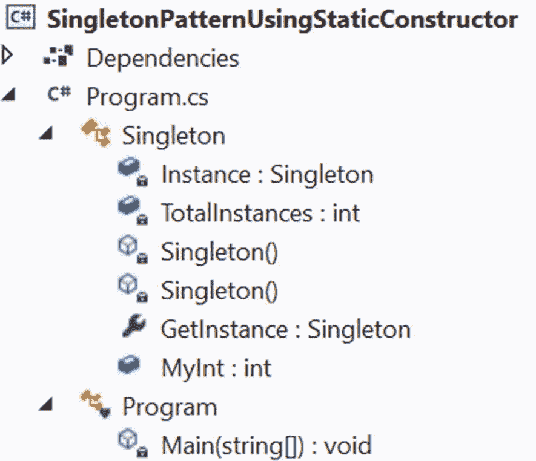
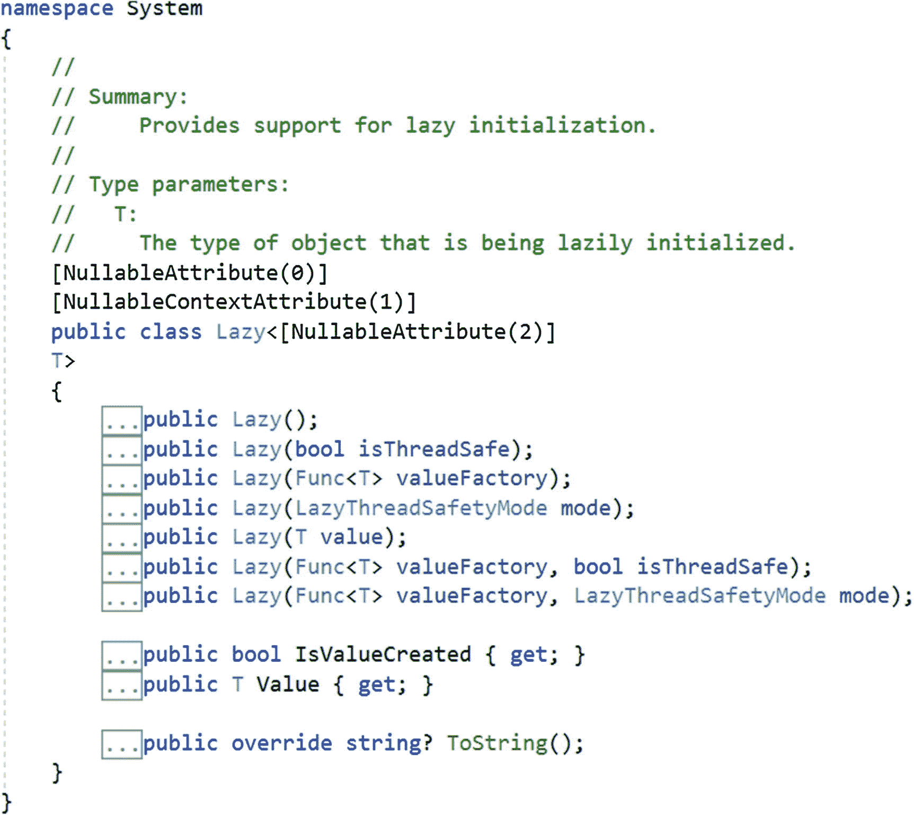

# 一、单例模式

这一章涵盖了单例模式。

## GoF 定义

确保一个类只有一个实例，并提供对它的全局访问点。

## 概念

让我们假设您有一个名为`A,`的类，您需要从它创建一个对象。一般情况下，你会怎么做？您可以简单地使用这一行代码:`A obA=new A();`

但是让我们仔细看看。如果你使用关键字`new`十次以上，你将有十个以上的对象，对吗？但是在真实的场景中，不必要的对象创建是一个大问题(特别是当构造函数调用非常昂贵时)，所以您需要限制它。在这种情况下，单例模式就派上了用场。它限制了`new`的使用，并确保您没有一个以上的类实例。

简而言之，这种模式认为一个类应该只有一个实例。如果实例不可用，您可以创建一个；否则，您应该使用现有的实例来满足您的需求。通过遵循这种方法，您可以避免创建不必要的对象。

## 真实世界的例子

让我们假设你有一个参加比赛的运动队。您的团队需要在整个锦标赛中与多个对手比赛。在每场比赛开始时，按照比赛规则，两队队长必须掷硬币。如果你的球队没有队长，你需要选举一个人在比赛期间担任队长。在每场比赛和每一次掷硬币之前，如果你已经选举了队长，你就不能重复这个过程。

## 计算机世界的例子

在一些软件系统中，您可能决定只维护一个文件系统，以便可以使用它来集中管理资源。这种方法可以帮助您有效地实现缓存机制。考虑另一个例子。您还可以使用这种模式在多线程环境中维护线程池。

## 履行

单例模式可以通过多种方式实现。每种方法都有自己的优点和缺点。在下面的演示中，我将向您展示一种简单的方法。这里，这个类被命名为`Singleton,`，它具有以下特征。在继续之前，您必须仔细阅读它们。

*   在这个例子中，我使用了一个私有的无参数构造函数。因此，您不能以正常的方式实例化该类型(使用`new`)。

*   这门课是密封的。(对于我们即将进行的演示，这不是必需的，但是如果您对这个 Singleton 类进行特定的修改，这可能是有益的。这个在问答环节讨论)。

*   既然`new`被阻塞了，怎么获取实例呢？在这种情况下，您可以选择实用方法或属性。在这个例子中，我选择了一个属性，在我的 Singleton 类中，您会看到下面的代码:

    ```cs
    public static Singleton GetInstance
    {
         get
             {
                return Instance;
              }
     }

    ```

*   如果您喜欢使用表达式体的只读属性(在 C# v6 中提供)，您可以用下面的代码行替换该代码段:

*   我在 Singleton 类中使用了一个静态构造函数。静态构造函数必须是无参数的。按照微软的说法，在 C# 中，它初始化静态数据，并且只执行一次特定的操作。此外，在创建第一个实例或引用任何静态类成员之前，会自动调用静态构造函数。您可以放心地假设我已经充分利用了这些规范。

*   在`Main()`方法中，我使用一个简单的检查来确保我使用的是同一个且唯一可用的实例。

*   您会在 Singleton 类中看到以下代码行:

```cs
public static Singleton GetInstance => Instance;

```

```cs
private static readonly Singleton Instance;

```

**公共静态**成员确保了一个全局访问点。它确认实例化过程不会开始，直到您调用类的`Instance`属性(换句话说，它支持惰性实例化)，并且`readonly`确保赋值过程只发生在静态构造函数中。一旦退出构造函数，就不能给`readonly`字段赋值。如果您错误地反复尝试分配这个`static readonly`字段，您将会遇到`CS0198`编译时错误`which says that a static readonly field cannot be assigned (except in a static constructor or a variable initializer)`。

*   Singleton 类也用 sealed 关键字标记，以防止类的进一步派生(这样它的子类就不能误用它)。

Note

我保留了重要的注释，以帮助您更好地理解。我将对本书中的大多数程序做同样的事情；例如，当您从 Apress 网站下载代码时，您可以在注释行中看到表达式体的只读属性的用法。

### 类图

图 [1-1](#Fig1) 是说明单例模式的类图。


图 1-1

类图

### 解决方案资源管理器视图

图 [1-2](#Fig2) 显示了程序的高层结构。



图 1-2

解决方案资源管理器视图

### 演示 1

浏览下面的实现，并使用支持性的注释来帮助您更好地理解。

```cs
using System;

namespace SingletonPatternUsingStaticConstructor
{
    public sealed class Singleton
    {
        #region Singleton implementation using static constructor

        private static readonly Singleton Instance;
        private static int TotalInstances;
        /*
         * Private constructor is used to prevent
         * creation of instances with the 'new' keyword
         * outside this class.
         */
        private Singleton()
        {
            Console.WriteLine("--Private constructor is called.");
            Console.WriteLine("--Exit now from private constructor.");
        }

        /*
         * A static constructor is used for the following purposes:
         * 1\. To initialize any static data
         * 2\. To perform a specific action only once
         *
         * The static constructor will be called automatically before:
         * i. You create the first instance; or
         * ii.You refer to any static members in your code.
         *
         */

        // Here is the static constructor
        static Singleton()
        {
            // Printing some messages before you create the instance
            Console.WriteLine("-Static constructor is called.");
            Instance = new Singleton();
            TotalInstances++;
            Console.WriteLine($"-Singleton instance is created.Number of instances:{ TotalInstances}");
            Console.WriteLine("-Exit from static constructor.");
        }
        public static Singleton GetInstance
        {
            get
            {
                return Instance;
            }
        }
     /*
      * If you like to use expression-bodied read-only
      * property, you can use the following line (C# v6.0 onwards).
      */
        // public static Singleton GetInstance => Instance;
        #endregion
        /* The following line is used to discuss
        the drawback of the approach. */
        public static int MyInt = 25;
    }
    class Program
    {
        static void Main(string[] args)
        {
            Console.WriteLine("***Singleton Pattern Demonstration.***\n");
            /* The following line is used to discuss
              the drawback of the approach. */
            //Console.WriteLine($"The value of MyInt is :{Singleton.MyInt}");
            // Private Constructor.So, you cannot use the 'new' keyword.
            //Singleton s = new Singleton(); // error
            Console.WriteLine("Trying to get a Singleton instance, called firstInstance.");
            Singleton firstInstance = Singleton.GetInstance;
            Console.WriteLine("Trying to get another Singleton instance, called secondInstance.");
            Singleton secondInstance = Singleton.GetInstance;
            if (firstInstance.Equals(secondInstance))
            {
                Console.WriteLine("The firstInstance and secondInstance are the same.");
            }
            else
            {
                Console.WriteLine("Different instances exist.");
            }
            Console.Read();
        }
    }
}

```

### 输出

下面是这个例子的输出。

```cs
***Singleton Pattern Demonstration.***

Trying to get a Singleton instance, called firstInstance.
-Static constructor is called.
--Private constructor is called.
--Exit now from private constructor.
-Singleton instance is created.Number of instances:1
-Exit from static constructor.
Trying to get another Singleton instance, called secondInstance.
The firstInstance and secondInstance are the same.

```

Note

Microsoft 建议静态字段使用 Pascal 命名约定。我在前面的演示中遵循了这一点。

### 分析

在这一节中，我将讨论与前面的演示相关的两个要点。首先，我向您展示了如何缩短代码长度，然后我讨论了我刚刚采用的方法的一个潜在缺点。我们开始吧。

从相关的注释中，您会发现如果您喜欢使用表达式体的只读属性，您可以替换下面的代码段

```cs
public static Singleton GetInstance
        {
            get
            {
                return Instance;
            }
        }

```

使用下面的代码行。

```cs
public static Singleton GetInstance => Instance;

```

保留现有代码，在`Singleton`类中添加以下代码段。

```cs
        /* The following line is used to discuss
        the drawback of the approach.*/
        public static int MyInt = 25;

```

添加之后，`Singleton`类如下。

```cs
public sealed class Singleton
    {
        #region Singleton implementation using static constructor
        // Keeping all existing code shown in the previous demonstration
        #endregion
        /* The following line is used to discuss
        the drawback of the approach.*/
        public static int MyInt = 25;
    }

```

现在假设您使用下面的`Main()`方法。

```cs
static void Main(string[] args)
        {
            Console.WriteLine("***Singleton Pattern Demonstration.***\n");
            Console.WriteLine($"The value of MyInt is :{Singleton.MyInt}");
            Console.Read();
        }

```

如果您现在执行该程序，您会看到以下输出。

```cs
***Singleton Pattern Demonstration.***

-Static constructor is called.
--Private constructor is called.
--Exit now from private constructor.
-Singleton instance is created.Number of instances:1
-Exit from static constructor.
The value of MyInt is :25

```

虽然您应该只看到输出的最后一行，但是您得到了`Singleton`类的所有实例化细节，这说明了这种方法的缺点。具体来说，在`Main()`方法中，您试图使用`MyInt`静态变量，但是您的应用仍然创建了 Singleton 类的一个实例。因此，当您使用这种方法时，您对实例化过程的控制较少*。*

然而，除了这个问题之外，没有与之相关的显著缺点。您只需承认这是一次性活动，初始化过程不会重复。如果你能容忍这个缺点，你就可以宣称你已经实现了一个简单、漂亮的单例模式。在这里我要重复的是，每种方法都有自己的优点和缺点；没有一种方法是 100%完美的。根据您的需求，您可能会选择其中一个。

接下来，我将介绍这种实现的另一种常见变体。我可以直接使用下面的代码行

```cs
private static readonly Singleton Instance = new Singleton();

```

并避免使用静态构造函数在控制台中打印特殊消息。下面的代码段也演示了单例模式。

```cs
public sealed class Singleton
    {
        #region Using static initialization
        private static readonly Singleton Instance = new Singleton();

        private static int TotalInstances;
        /*
         * Private constructor is used to prevent
         * creation of instances with 'new' keyword
         * outside this class.
         */
        private Singleton()
        {
            Console.WriteLine("--Private constructor is called.");
            Console.WriteLine("--Exit now from private constructor.");
        }
        public static Singleton GetInstance
        {
            get
            {
                return Instance;
            }
        }

        #endregion
    }

```

这种编码通常被称为*静态初始化*。我想在控制台中打印定制消息，所以我的首选方法如演示 1 所示。

## 问答环节

你为什么要把事情复杂化？你可以简单地编写你的 **单例类** **如下。**

```cs
public class Singleton
    {
        private static Singleton instance;
        private Singleton() { }
        public static Singleton Instance
        {
            get
            {
                if (instance == null)
                {
                    instance = new Singleton();
                }
                return instance;
            }
        }
    }

```

是的，这种方法可以在单线程环境中工作，但是考虑一个多线程环境，其中两个(或更多)线程可能试图同时评估下面的代码。

```cs
if (instance == null)

```

如果实例尚未创建，每个线程将尝试创建一个新的实例。因此，您可能会得到该类的多个实例。

你能展示一种替代的方法来建模 **单例设计模式吗？**

有许多方法。每一种都有利弊。

以下代码显示了*双重检查锁定*。下面的代码段概述了这种方法。

```cs
    // Singleton implementation using double checked locking.
    public sealed class Singleton
    {
        /*
         * We are using volatile to ensure
         * that assignment to the instance variable finishes
         * before it's accessed.
        */
        private static volatile Singleton Instance;
        private static object lockObject = new Object();

        private Singleton() { }

        public static Singleton GetInstance
        {
            get
            {
                // First Check
                if (Instance == null)
                {
                    lock (lockObject)
                    {
                        // Second(Double) Check
                        if (Instance == null)
                            Instance = new Singleton();
                    }
                }
                return Instance;
            }
        }
    }

```

这种方法可以帮助您在需要时创建实例。但你必须记住，一般来说，锁定机制是昂贵的。

除了使用双锁，您还可以使用单锁，如下所示。

```cs
//Singleton implementation using single lock
    public sealed class Singleton
    {
        /*
         * We are using volatile to ensure
         * that assignment to the instance variable finishes
         * before it's access.
         */
        private static volatile Singleton Instance;
        private static object lockObject = new Object();

        private Singleton() { }

        public static Singleton GetInstance
        {
            get
            {
                // Locking it first
                lock (lockObject)
                {
                    // Single check
                    if (Instance == null)
                    {
                        Instance = new Singleton();
                    }
                }
                return Instance;
            }
        }
    }

```

尽管这种方法看起来更简单，但它并不被认为是更好的方法，因为每次请求`Singleton`实例的一个实例时，您都要获取锁，这会降低应用的性能。

在本章的最后，你会看到另一种使用 C# 内置结构实现单例模式的方法。

Note

当您保持客户端代码不变时，您可以使用您喜欢的方法简单地替换 Singleton 类。我提供了这方面的完整演示，您可以从 Apress 的网站下载。

**1.3 为什么在** **双重检查锁定** **示例中将实例标记为 volatile？**

许多开发商认为这是不必要的。NET 2.0 及以上，但有争论。为了简单起见，让我们看看 C# 规范是怎么表述的:“volatile 关键字表示一个字段可能会被同时执行的多个线程修改。出于性能原因，编译器、运行时系统甚至硬件可能会重新安排对内存位置的读写。声明为 volatile 的字段不受这些优化的影响。添加 volatile 修饰符可确保所有线程都将按照执行顺序观察任何其他线程执行的易失性写入。这仅仅意味着`volatile`关键字有助于提供一种序列化的访问机制，因此所有线程都可以按照它们的执行顺序观察到任何其他线程的变化。*它确保最新的值总是出现在字段中。*因此，使用 volatile 修饰符使 *s* 你的代码更加安全。

在这个上下文中*，y* ou 应该记住`volatile`关键字不能应用于所有类型，并且有一定的限制。例如，您可以将它应用于类或结构字段，但不能应用于局部变量。

**1.4 为什么多重** **物体创作** **是一个大问题？**

这里有两点需要记住。

*   如果您正在处理资源密集型对象，则对象创建的成本会很高。

*   在某些应用中，您可能需要将一个公共对象传递到多个位置。

1.5 什么时候应该使用单例模式？

看情况。这里有一些这种模式有用的常见用例。

*   当使用集中式系统(例如数据库)时

*   维护公共日志文件时

*   当在多线程环境中维护线程池时

*   当实现缓存机制或设备驱动程序时，等等

**1.6 为什么使用** `sealed` **关键字** **？Singleton 类有一个私有构造函数，足以停止派生过程。**

接得好。这不是强制性的，但最好清楚地表明你的意图。我用它来保护一种特殊的情况:当你试图使用一个派生的嵌套类，并且你喜欢在私有构造函数内部初始化。为了更好地理解这一点，我们假设您有下面这个类，它不是密封的。在这个类中，不使用静态构造函数；相反，您使用私有构造函数来跟踪实例的数量。我用粗体显示了关键的变化。

```cs
public class Singleton
{
private static readonly Singleton Instance = new Singleton();
private static int TotalInstances;
/*
 * Private constructor is used to prevent
 * creation of instances with 'new' keyword
 * outside this class.
 */
private Singleton()
{
    Console.WriteLine("--Private constructor is called.");
    TotalInstances++;
    Console.WriteLine($"-Singleton instance is created. Number of instances:{ TotalInstances}");
    Console.WriteLine("--Exit now from private constructor.");
}

public static Singleton GetInstance
{
    get
    {
     return Instance;
    }
}

// The keyword "sealed" can guard this scenario.
// public class NestedDerived : Singleton { }

}

```

在`Main() method` `,`中，让我们对控制台消息的第一行做一点小小的修改，以区别于原始的输出，但让我们保持其余部分不变。它现在看起来如下。

```cs
class Program
    {
        static void Main(string[] args)
        {
            Console.WriteLine("***Singleton Pattern Q&A***\n");
            Console.WriteLine("Trying to get a Singleton instance, called firstInstance.");
            Singleton firstInstance = Singleton.GetInstance;
            Console.WriteLine("Trying to get another Singleton instance, called secondInstance.");
            Singleton secondInstance = Singleton.GetInstance;
            if (firstInstance.Equals(secondInstance))
            {
                Console.WriteLine("The firstInstance and secondInstance are same.");
            }
            else
            {
                Console.WriteLine("Different instances exist.");
            }
            //Singleton.NestedDerived nestedClassObject1 = new Singleton.NestedDerived();
            //Singleton.NestedDerived nestedClassObject2 = new Singleton.NestedDerived();
            Console.Read();
        }
}

```

如果您运行该程序，您将得到以下输出。

```cs
***Singleton Pattern Q&A***

```

`Trying to get a Singleton instance, called firstInstance`。

```cs
--Private constructor is called.
-Singleton instance is created. Number of instances:1
--Exit now from private constructor.

```

`Trying to get another Singleton instance, called secondInstance`。

`The firstInstance and`T1。这很简单，类似于我们最初演示的输出。

现在取消 Singleton 类中下面一行的注释。

```cs
//public class NestedDerived : Singleton { }

```

然后在`Main()`方法中取消下面两行代码的注释。

```cs
//Singleton.NestedDerived nestedClassObject1 = new Singleton.NestedDerived();
//Singleton.NestedDerived nestedClassObject2 = new Singleton.NestedDerived();

```

再次运行应用。这一次，您将获得以下输出。

```cs
***Singleton Pattern Q&A***

Trying to get a Singleton instance, called firstInstance.
--Private constructor is called.
-Singleton instance is created.Number of instances:1
--Exit now from private constructor.
Trying to get another Singleton instance, called secondInstance.
The firstInstance and secondInstance are same.
--Private constructor is called.
-Singleton instance is created.Number of instances:2
--Exit now from private constructor.
--Private constructor is called.
-Singleton instance is created.Number of instances:3
--Exit now from private constructor.

```

您是否注意到实例的总数正在增加？虽然在我最初的演示中，我可以排除使用`sealed`，但我保留了它来防范这种情况，这种情况可能是由于修改了 Singleton 类的原始实现而出现的。

## 替代实现

现在我将向您展示另一种使用 C# 内置结构的方法。在本书的前一版本中，我跳过了这一点，因为要理解这段代码，您需要熟悉泛型、委托和 lambda 表达式。如果您不熟悉委托，可以暂时跳过这一部分；否则，我们继续。

在这个例子中，我将向您展示有效使用代码的三种不同方式(使用自定义委托、使用内置`Func`委托，以及最后使用 lambda 表达式)。让我们看看带有相关注释的 Singleton 类的核心代码段，然后进行分析。

```cs
    // Singleton implementation using Lazy<T>
    public sealed class Singleton
    {
        // Custom delegate
        delegate Singleton SingletonDelegateWithNoParameter();
        static SingletonDelegateWithNoParameter myDel = MakeSingletonInstance;

        // Using built-in Func<out TResult> delegate
        static Func<Singleton> myFuncDelegate= MakeSingletonInstance;

        private static readonly Lazy<Singleton> Instance = new Lazy<Singleton>(
            //myDel()  // Also ok. Using a custom delegate
            myFuncDelegate()
            //() => new Singleton() // Using lambda expression
            );

        private static Singleton MakeSingletonInstance()
        {
            return new Singleton();
        }
        private Singleton() { }

        public static Singleton GetInstance
        {
            get
            {
                return Instance.Value;
            }
        }
    }

```

### 分析

这段代码最重要的部分是

```cs
private static readonly Lazy<Singleton> Instance = new Lazy<Singleton>(
            //myDel()  // Also ok. Using a custom delegate
            myFuncDelegate()
            //() => new Singleton()  // Using lambda expression
     );

```

这里`myDel()`被注释掉；当您使用自定义委托时，可以使用它。在使用内置的`Func`委托的地方`myFuncDelegate()`已经被执行。如果您想使用 lambda 表达式而不是委托，可以使用最后一行注释。简而言之，当您尝试这些方法中的任何一种时，其他两行应该被注释掉。

如果将鼠标悬停在`Lazy<Singleton>`上，会看到`Lazy<T>`支持惰性初始化；在撰写本文时，它有七个重载版本的构造函数，其中一些可以接受一个`Func`委托实例作为方法参数。现在你知道我为什么在这个例子中使用了`Func`委托了。图 [1-3](#Fig3) 是 Visual Studio 截图。



图 1-3

懒惰<t>类的 Visual Studio 截图</t>

在这个例子中，我使用了下面的版本。

```cs
public Lazy(Func<T> valueFactory);

```

虽然`Func`委托有很多重载版本，但是在这种情况下，你只能使用下面的版本。

```cs
public delegate TResult Func<[NullableAttribute(2)] out TResult>();

```

这个`Func`版本可以指向一个不接受任何参数但返回一个由`TResult`参数指定的类型的值的方法，这就是为什么它可以正确地指向下面的方法。

```cs
private static Singleton MakeSingletonInstance()
        {
            return new Singleton();
        }

```

如果您想使用自己的委托，您可以这样做。以下代码段可用于此目的。

```cs
// Custom delegate
delegate Singleton SingletonDelegateWithNoParameter();
static SingletonDelegateWithNoParameter myDel = MakeSingletonInstance;

```

在这种情况下，你需要使用`myDel()`而不是`myFuncDelegate()`。

最后，如果选择 lambda 表达式，就不需要`MakeSingletonInstance()`方法，可以直接使用下面这段代码*。*

```cs
private static readonly Lazy<Singleton> Instance = new Lazy<Singleton>(

            () => new Singleton()  // Using lambda expression
     );

```

Note

在所有实现单例模式的方法中，`Main()`方法本质上是相同的。因此，为了简洁起见，我没有在讨论中包括这一点。

## 问答环节

**1.7 你用了术语******。这是什么意思？****

 **这是一种用来延迟对象创建过程的技术。基本思想是，只有在真正需要时，才应该创建对象。当创建对象是一项开销很大的操作时，此方法很有用。

希望您对单例设计模式有更好的理解。在这种模式中，性能与懒惰总是一个问题，一些开发人员总是质疑这些方面。但事实是，这种模式以各种形式出现在许多应用中。让我们引用 Erich Gamma(瑞士计算机科学家和 GoF 作者之一)在 2009 年的一次采访来结束这一章:“当讨论放弃哪些模式时，我们发现我们仍然热爱它们。不尽然——我赞成放弃辛格尔顿。它的用途几乎总是一种设计气味。”有兴趣看本次面试详情的可以关注链接:`https://www.informit.com/articles/article.aspx?p=1404056`。**