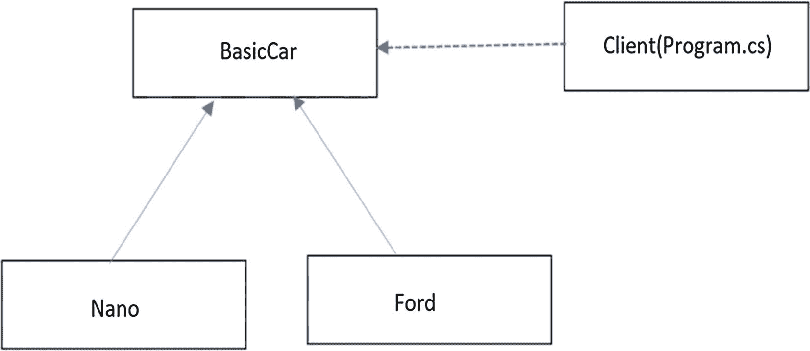
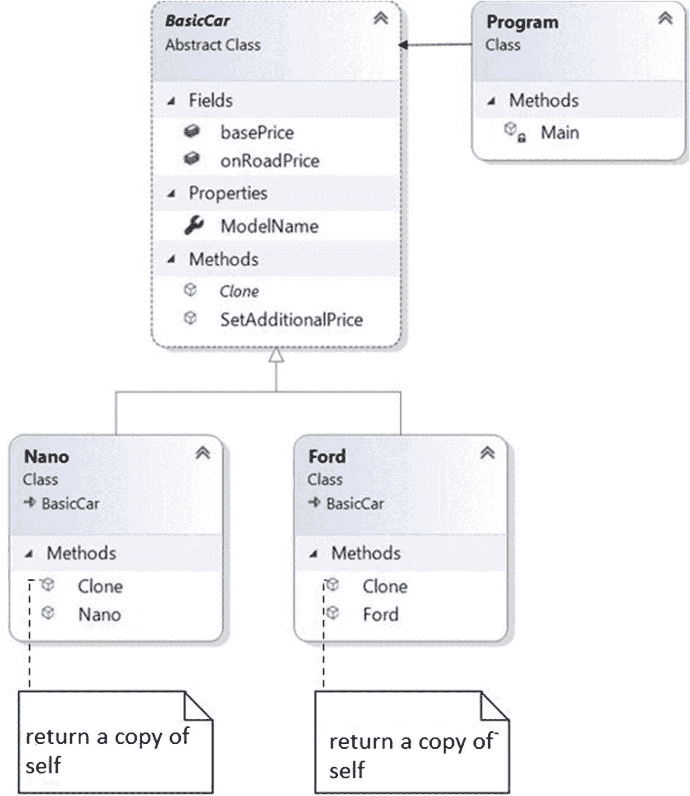
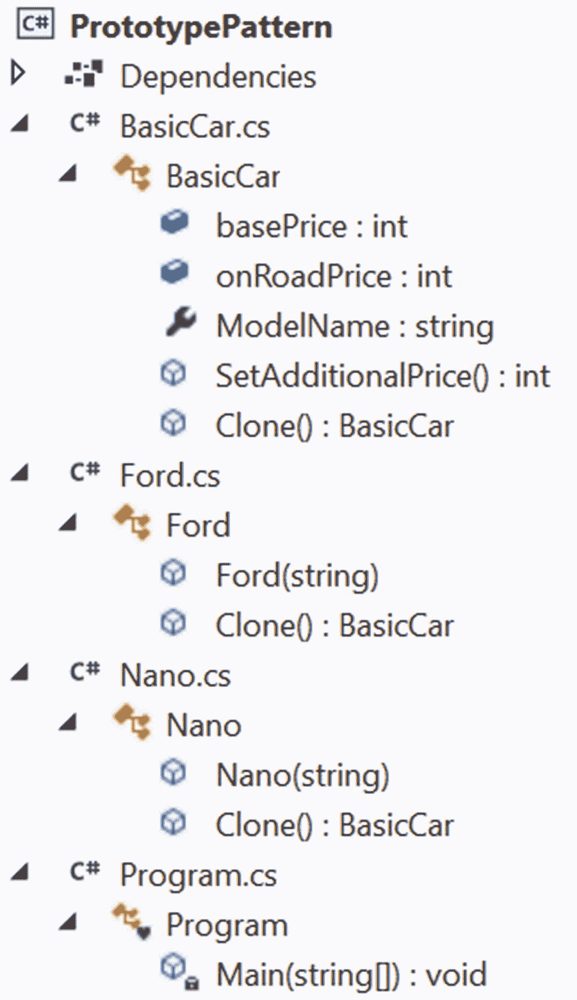
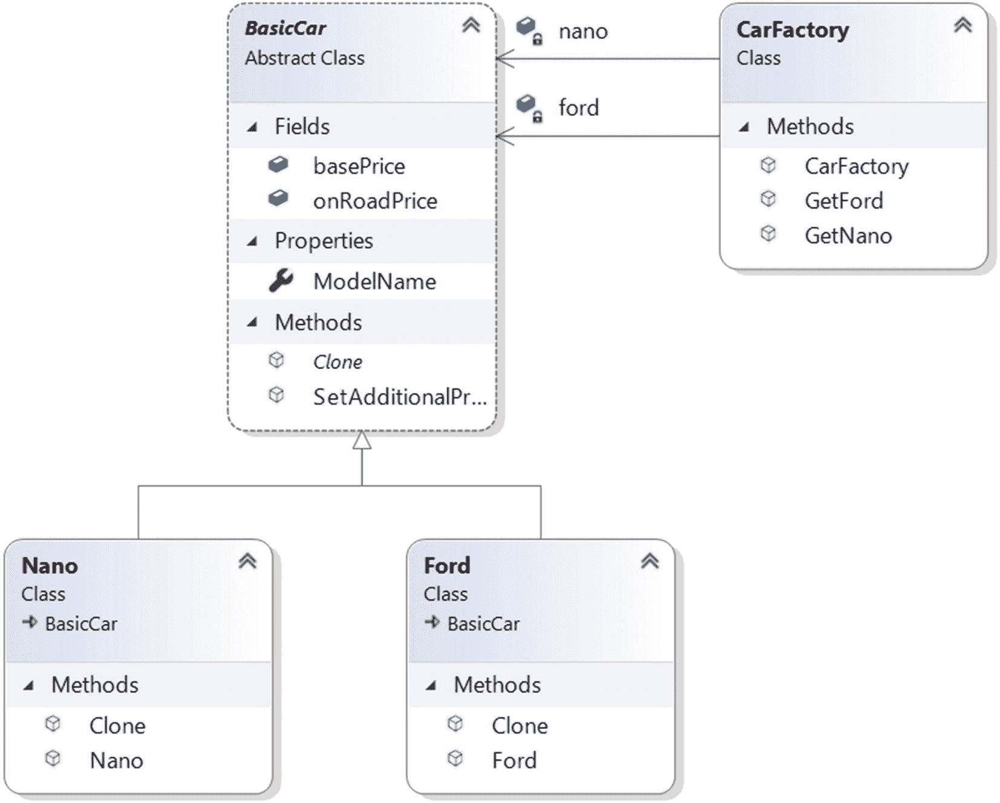
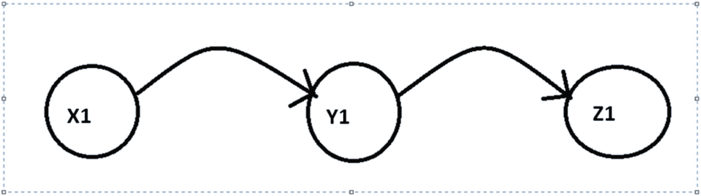
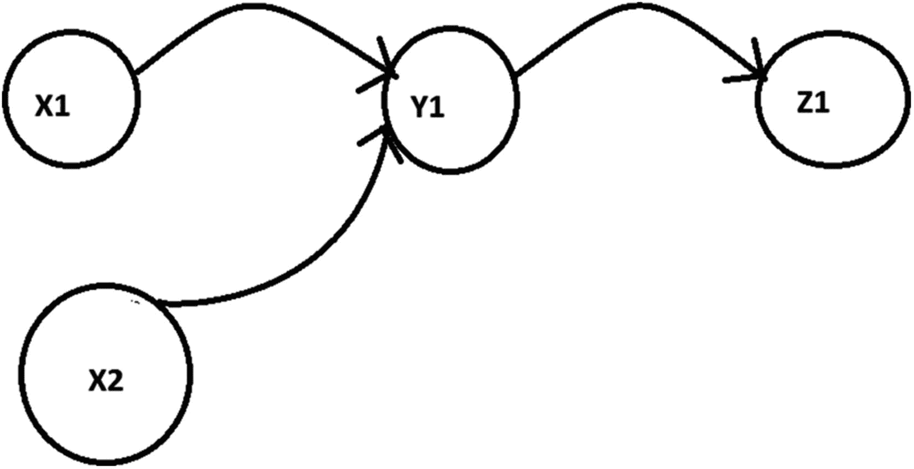
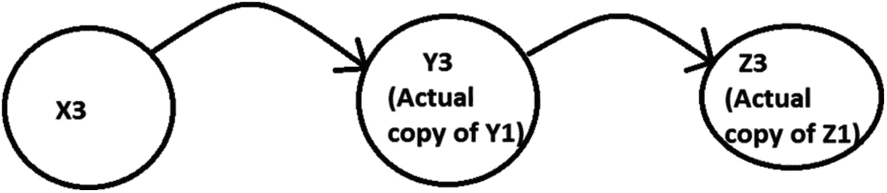
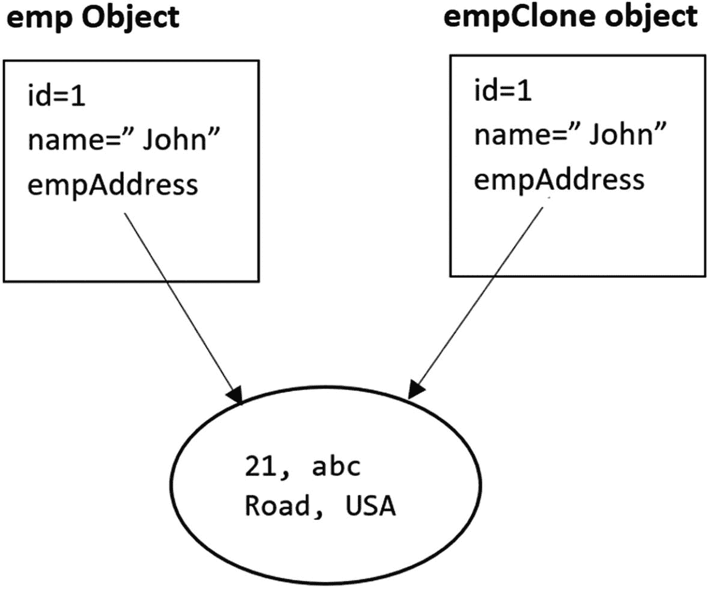
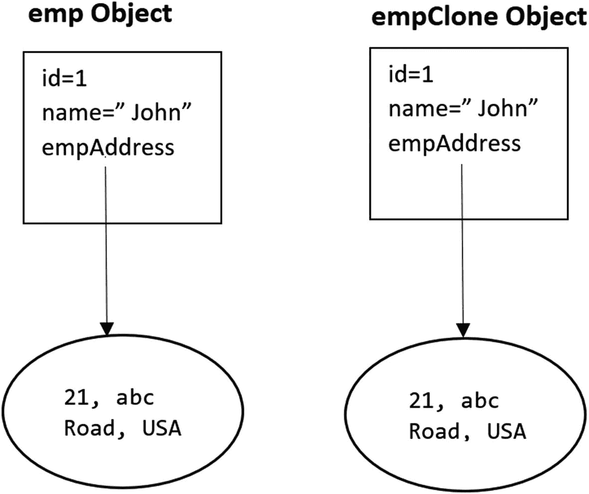

# 二、原型模式

本章涵盖了原型模式。

## GoF 定义

使用原型实例指定要创建的对象种类，并通过复制该原型来创建新对象。

## 概念

原型模式提供了另一种方法，通过复制或克隆现有对象的实例来实例化新对象。使用这个概念可以避免创建新实例的开销。如果你观察模式的意图(GoF 定义)，你会发现这个模式的核心思想是创建一个基于另一个对象的对象。这个现有对象充当新对象的模板。

当你为这种模式编写代码时，一般来说，你会看到有一个抽象类或接口扮演着抽象原型的角色。这个抽象原型包含一个由具体原型实现的克隆方法。客户可以通过要求原型克隆自己来创建一个新对象。在本章的下一个程序(演示 1)中，我遵循同样的方法。

## 真实世界的例子

假设你有一份有价值文件的主拷贝。您需要对其进行一些更改，以分析更改的效果。在这种情况下，您可以复印原始文档，并在复印的文档中编辑更改。

## 计算机世界的例子

让我们假设您已经有了一个稳定的应用。将来，您可能希望对应用进行一些小的修改。您必须从原始应用的副本开始，进行更改，然后进一步分析它。你不想仅仅为了改变而从头开始；这会耗费你的时间和金钱。

英寸 NET 中，`ICloneable`接口包含一个`Clone()`方法。在 Visual Studio IDE 中，您可以很容易地找到以下详细信息。

```cs
namespace System
{
    //
    // Summary:
    //     Supports cloning, which creates a new instance of a class with     //     the same value
 as an existing instance.
    [NullableContextAttribute(1)]
    public interface ICloneable
    {
        //
        // Summary:
        //     Creates a new object that is a copy of the current instance.
        //
        // Returns:
        //     A new object that is a copy of this instance.
        object Clone();
    }
}

```

您可以在实现原型模式时使用这个内置的构造，但是在这个例子中，我使用了自己的`Clone()`方法。

## 履行

在这个例子中，我遵循图 [2-1](#Fig1) 所示的结构。



图 2-1

原型示例

这里`BasicCar`是原型。它是一个抽象类，有一个名为`Clone()`的抽象方法。`Nano`和`Ford`是具体的类(即具体的原型)，它们继承自`BasicCar`。两个具体的类都实现了`Clone()`方法。在这个例子中，最初，我用默认价格创建了一个`BasicCar`对象。后来，我修改了每个型号的价格。`Program.cs`是实现中的客户端。

在`BasicCar`类内部，有一个名为`SetAdditionalPrice()`的方法。它生成一个介于 200，000(含)和 500，000(不含)之间的随机值。在我计算汽车的最终`onRoad`价格之前，这个值被加到基础价格中。在这个例子中，我用印度货币(卢比)提到了这些汽车的价格。

汽车模型的基本价格是由具体原型的建造者设定的。因此，您会看到如下代码段，其中具体的原型(Nano)初始化基本价格。同样，这个类也覆盖了`BasicCar`中的`Clone()`方法。

```cs
public class Nano : BasicCar
    {
        public Nano(string m)
        {
            ModelName = m;
            // Setting a basic price for Nano.
            basePrice = 100000;
        }
        public override BasicCar Clone()
        {
            // Creating a shallow copy and returning it.
            return this.MemberwiseClone() as Nano;
        }
    }

```

`Ford`，另一个混凝土原型，也有类似的结构。在这个例子中，我使用了两个具体的原型(`Ford`和`Nano`)。为了更好地理解原型模式，一个具体的原型就足够了。因此，如果您愿意，您可以简单地删除这些具体的原型来减少代码大小。

最后也是最重要的，在接下来的例子中您会看到`MemberwiseClone()`方法。它在`Object`类中定义，有如下描述。

```cs
// Summary:
//     Creates a shallow copy of the current System.Object.
//
// Returns:
//     A shallow copy of the current System.Object.
[NullableContextAttribute(1)]
protected Object MemberwiseClone();

```

Note

你可能对术语*浅薄*感到疑惑。实际上，克隆有两种类型:浅层克隆和深层克隆。这一章包括一个讨论和一个完整的程序来帮助你理解他们的区别。现在，您只需要知道在浅层复制中，类的简单类型字段被复制到克隆的实例中；但是对于引用类型字段，只复制引用。因此，在这种类型的克隆中，原始实例和克隆实例都指向同一个引用，这在某些情况下可能会导致问题。为了克服这一点，您可能需要使用深层拷贝。

### 类图

图 [2-2](#Fig2) 显示了类图。



图 2-2

类图

### 解决方案资源管理器视图

图 [2-3](#Fig3) 显示了程序各部分的高层结构。



图 2-3

解决方案资源管理器视图

### 演示 1

下面是实现。

```cs
// BasicCar.cs

using System;

namespace PrototypePattern
{
    public abstract class BasicCar
    {
        public int basePrice = 0, onRoadPrice=0;
        public string ModelName { get; set; }

        /*
            We'll add this price before
            the final calculation of onRoadPrice.
        */
        public static int SetAdditionalPrice()
        {
            Random random = new Random();
            int additionalPrice = random.Next(200000, 500000);
            return additionalPrice;
        }
        public abstract BasicCar Clone();
    }
}

// Nano.cs

namespace PrototypePattern
{
    public class Nano : BasicCar
    {
        public Nano(string m)
        {
            ModelName = m;
            // Setting a base price for Nano.
            basePrice = 100000;
        }
        public override BasicCar Clone()
        {
            // Creating a shallow copy and returning it.
            return this.MemberwiseClone() as Nano;
        }
    }
}
// Ford.cs

namespace PrototypePattern
{
    public class Ford : BasicCar
    {
        public Ford(string m)
        {
            ModelName = m;
            // Setting a basic price for Ford.
            basePrice = 500000;
        }

        public override BasicCar Clone()
        {
            // Creating a shallow copy and returning it.
            return this.MemberwiseClone() as Ford;
        }
    }
}
// Client

using System;

namespace PrototypePattern
{
    class Program
    {
        static void Main(string[] args)
        {
            Console.WriteLine("***Prototype Pattern Demo***\n");
            // Base or Original Copy
            BasicCar nano = new Nano("Green Nano");
            BasicCar ford = new Ford("Ford Yellow");
            BasicCar basicCar;
            // Nano
            basicCar = nano.Clone();
            // Working on cloned copy
            basicCar.onRoadPrice = basicCar.basePrice + BasicCar.SetAdditionalPrice();
            Console.WriteLine($"Car is: {basicCar.ModelName}, and it's price is Rs. {basicCar.onRoadPrice}");

            // Ford
            basicCar = ford.Clone();
            // Working on cloned copy
            basicCar.onRoadPrice = basicCar.basePrice + BasicCar.SetAdditionalPrice();
            Console.WriteLine($"Car is: {basicCar.ModelName}, and it's price is Rs. {basicCar.onRoadPrice}");

            Console.ReadLine();
        }
    }
}

```

### 输出

下面是一个可能的输出。

```cs
***Prototype Pattern Demo***

Car is: Green Nano, and it's price is Rs. 368104
Car is: Ford Yellow, and it's price is Rs. 878072

```

Note

您可能会在系统中看到不同的价格，因为我在`BasicCar`类的`SetAdditionalPrice()`方法中生成了一个随机价格。但是我保证了`Ford`的价格大于`Nano`。

## 修改的实现

在演示 1 中，在制作克隆之前，客户端按如下方式实例化对象。

```cs
BasicCar nano = new Nano("Green Nano");
BasicCar ford = new Ford("Ford Yellow");

```

这很好，但是在原型模式的一些例子中，您可能会注意到一个额外的参与者创建原型并将它们提供给客户。专家通常喜欢这种方法，因为它向客户端隐藏了创建新实例的复杂性。让我们在演示 2 中看看如何实现这一点。

### 类图

图 [2-4](#Fig4) 显示了修改后的类图中的关键变化。



图 2-4

演示 2 的类图中的主要变化

### 演示 2

为了演示这一点，我在前面的演示中添加了下面这个名为`CarFactory`的类。

```cs
class CarFactory
    {
        private readonly BasicCar nano, ford;

        public CarFactory()
        {
            nano = new Nano("Green Nano");
            ford = new Ford("Ford Yellow");
        }
        public BasicCar GetNano()
        {
           return  nano.Clone();
        }
        public BasicCar GetFord()
        {
            return ford.Clone();
        }
    }

```

使用这个类，您的客户端代码可以修改如下。

```cs
class Program
    {
        static void Main(string[] args)
        {
            Console.WriteLine("***Prototype Pattern Demo2.***\n");
            CarFactory carFactory = new CarFactory();
            // Get a Nano
            BasicCar basicCar = carFactory.GetNano();
            //Working on cloned copy
            basicCar.onRoadPrice = basicCar.basePrice + BasicCar.SetAdditionalPrice();
            Console.WriteLine($"Car is: {basicCar.ModelName}, and it's price is Rs. {basicCar.onRoadPrice}");

            // Get a Ford now
            basicCar = carFactory.GetFord();
            // Working on cloned copy
            basicCar.onRoadPrice = basicCar.basePrice + BasicCar.SetAdditionalPrice();
            Console.WriteLine($"Car is: {basicCar.ModelName}, and it's price is Rs. {basicCar.onRoadPrice}");

            Console.ReadLine();
        }
    }

```

### 输出

下面是一个可能的输出。

```cs
***Prototype Pattern Demo2.***

Car is: Green Nano, and it's price is Rs. 546365
Car is: Ford Yellow, and it's price is Rs. 828518

```

### 分析

这个输出就和之前的输出一样，没有什么魔力。类满足了我们的需求，但是它有一个潜在的缺点。我在`CarFactory`的构造函数中初始化了汽车。因此，在初始化该类时，它总是创建这两种汽车类型的实例。因此，如果您想实现一个惰性初始化，您可以修改`CarFactory`类中的`GetNano()`方法，如下所示。

```cs
public BasicCar GetNano()
        {
           if (nano!=null)
            {
                // Nano was created earlier.
                // Returning a clone of it.
                return nano.Clone();
            }
            else
            {
                /*
                  Create a nano for the first
                  time and return it.
                */
                nano = new Nano("Green Nano");
                return nano;
            }
        }

```

你可以用同样的方法修改`GetFord()`方法。

Note

当您实现这些更改时，不要忘记移除只读修饰符以避免编译时错误。

下面是修改后的类。

```cs
class CarFactory
    {
        private BasicCar nano,ford;
        public BasicCar GetNano()
        {
           if (nano!=null)
            {
                // Nano was created earlier.
                // Returning a clone of it.
                return nano.Clone();
            }
            else
            {
                /*
                  Create a nano for the first
                  time and return it.
                */
                nano = new Nano("Green Nano");
                return nano;
            }
        }
        public BasicCar GetFord()
        {
           if (ford != null)
            {
                // Ford was created earlier.
                // Returning a clone of it.
                return ford.Clone();
            }
            else
            {
                /*
                  Create a nano for the first
                  time and return it.
                */
                ford = new Ford("Ford Yellow");
                return ford;
            }
        }
    }

```

最后，这不是最终的修改。在第 [1](01.html) 章中，你了解到在多线程环境中，当你检查 if 条件时，可能会产生额外的对象。由于你在第 [1](01.html) 章中学习了可能的解决方案，所以我不会在这次讨论或接下来的讨论中关注它们。我相信您现在应该对这种模式的意图有了清晰的认识。

## 问答环节

**2.1 使用原型设计模式的** **优势** **有哪些？**

以下是一些重要的用法。

*   您不希望修改现有对象并在其上进行实验。

*   您可以在运行时包含或丢弃产品。

*   在某些情况下，您可以以更低的成本创建新的实例。

*   您可以专注于关键活动，而不是复杂的实例创建过程。例如，一旦您忽略了复杂的对象创建过程，您就可以简单地从克隆或复制对象开始，并实现其余部分。

*   您希望在完全实现新对象之前，先感受一下它的行为。

**2.2 与使用原型设计模式相关的** **挑战** **有哪些？**

以下是一些挑战。

*   每个子类都需要实现克隆或复制机制。

*   如果所考虑的对象不支持复制或者存在循环引用，那么实现克隆机制可能会很有挑战性。

在这个例子中，我使用了`MemberwiseClone()`成员方法，它提供了一个浅层拷贝。这是一个非常简单的技术，可以满足你的基本需求。但是，如果您需要为一个复杂的对象提供深度复制实现，这可能会很昂贵，因为您不仅需要复制对象，还需要处理所有的引用，这可能会形成一个非常复杂的图。

**2.3 能否详细说明一下 C# 中浅拷贝和深拷贝的区别？**

下一节解释了它们的区别。

## 浅层拷贝与深层拷贝

浅层复制创建一个新对象，然后将非静态字段从原始对象复制到新对象。如果原始对象中存在值类型字段，则执行逐位复制。但是如果该字段是引用类型，则该方法复制引用，而不是实际的对象。让我们试着用一个简单的图表来理解这个机制(见图 [2-5](#Fig5) )。假设您有一个对象`X1`，它有一个对另一个对象`Y1`的引用。此外，假设对象`Y1`具有对对象`Z1`的引用。



图 2-5

在引用的浅拷贝之前

通过对`X1`的浅层复制，一个新的对象(比如说`X2`)被创建，它也引用了`Y1`(见图 [2-6](#Fig6) )。



图 2-6

在引用的浅拷贝之后

我在实现中使用了`MemberwiseClone()`。它执行浅层复制。

对于`X1`的深层副本，创建一个新对象(比如说，`X3`),并且`X3`具有对新对象`Y3`的引用，该新对象是`Y1`的副本。此外，`Y3`又引用了另一个新对象`Z3`，它是`Z1`的副本(见图 [2-7](#Fig7) )。



图 2-7

在引用的深层副本之后

现在考虑下面的演示，以便更好地理解。

### 演示 3

这个简单的演示向您展示了浅层拷贝和深层拷贝之间的区别。它还向您展示了为什么深层副本在某些情况下很重要。以下是该计划的主要特点。

*   有两类:`Employee`和`EmpAddress`。

*   `EmpAddress`只有一个读写属性，叫做`Address`。它设置一个雇员的地址，但是`Employee`类有三个读写属性:`Id, Name,`和`EmpAddress.`

*   要形成一个`Employee`对象，需要传递一个 ID 和员工的名字，同时还需要传递地址。因此，您会看到如下代码段。

    ```cs
    EmpAddress initialAddress = new EmpAddress("21, abc Road, USA");
    Employee emp = new Employee(1, "John", initialAddress);

    ```

*   在客户端代码中，首先创建一个`Employee`对象(`emp`)，然后通过克隆创建另一个对象`empClone`。您会看到下面几行代码。

    ```cs
    Console.WriteLine("Making a clone of emp1 now.");
    Employee empClone = (Employee)emp.Clone();

    ```

*   稍后，您更改`empClone`中的值。

当使用浅层拷贝时，这种变化的副作用是`emp`对象的地址也发生了变化，这是不希望的。(原型模式很简单；在处理对象的克隆副本时，不应更改原始对象)。

在下面的示例中，深层副本的代码最初是注释的，因此您只能看到浅层副本的效果。

现在来看一下演示。

```cs
using System;

namespace ShallowVsDeepCopy
{
    class EmpAddress
    {
        public string Address { get; set; }

        public EmpAddress(string address)
        {
            this.Address = address;
        }

        public override string ToString()
        {
            return this.Address;
        }

        public object CloneAddress()
        {
            // Shallow Copy
            return this.MemberwiseClone();
        }
    }
    class Employee
    {
        public int Id { get; set; }
        public string Name { get; set; }
        public EmpAddress EmpAddress { get; set; }

        public Employee(int id, string name, EmpAddress empAddress)

        {
            this.Id = id;
            this.Name = name;
            this.EmpAddress = empAddress;
        }

        public override string ToString()
        {
            return string.Format("Employee Id is : {0},Employee Name is : {1}, Employee Address is : {2}", this.Id,this.Name,this.EmpAddress);
        }

        public object Clone()
        {
            // Shallow Copy
            return this.MemberwiseClone();

            #region For deep copy

            //Employee employee = (Employee)this.MemberwiseClone();
            //employee.EmpAddress = (EmpAddress)this.EmpAddress.//CloneAddress();

            /*
             * NOTE:
             * Error: MemberwiseClone() is protected, you cannot access it via a qualifier of type EmpAddress. The qualifier must be Employee or its derived type.
             */
            //employee.EmpAddress = (EmpAddress)this.EmpAddress.MemberwiseClone(); // error

            // return employee;
            #endregion

        }

    }

    class Program
    {
        static void Main(string[] args)
        {
            Console.WriteLine("***Shallow vs Deep Copy Demo.***\n");
            EmpAddress initialAddress = new EmpAddress("21, abc Road, USA");
            Employee emp = new Employee(1, "John", initialAddress);

            Console.WriteLine("The original object is emp1 which is as follows:");
            Console.WriteLine(emp);

            Console.WriteLine("Making a clone of emp1 now.");
            Employee empClone = (Employee)emp.Clone();
            Console.WriteLine("empClone object is as follows:");
            Console.WriteLine(empClone);

            Console.WriteLine("\n Now changing the name, id and address of the cloned object ");
            empClone.Id=10;
            empClone.Name="Sam";
            empClone.EmpAddress.Address= "221, xyz Road, Canada";

            Console.WriteLine("Now emp1 object is as follows:");
            Console.WriteLine(emp);
            Console.WriteLine("And emp1Clone object is as follows:");
            Console.WriteLine(empClone);
        }

    }
}

```

### 浅层拷贝的输出

以下是程序的输出。

```cs
***Shallow vs Deep Copy Demo.***

The original object is emp1 which is as follows:
Employee Id is : 1,Employee Name is : John, Employee Address is : 21, abc Road, USA
Making a clone of emp1 now.
empClone object is as follows:
Employee Id is : 1,Employee Name is : John, Employee Address is : 21, abc Road, USA

 Now changing the name, id and address of the cloned object
Now emp1 object is as follows:
Employee Id is : 1,Employee Name is : John, Employee Address is : 221, xyz Road, Canada
And emp1Clone object is as follows:
Employee Id is : 10,Employee Name is : Sam, Employee Address is : 221, xyz Road, Canada

```

### 分析

有一个不想要的副作用。在前面的输出中，原始对象(`emp`)的地址由于修改克隆对象(`empClone`)而被修改。发生这种情况是因为原始对象和克隆对象指向同一个地址，并且它们不是 100%分离的。图 [2-8](#Fig8) 描述了该场景。



图 2-8

浅拷贝

现在让我们用深度复制实现来做实验。让我们修改`Employee`类的`Clone`方法如下。(我取消了深层副本的代码注释，并注释掉了浅层副本中的代码。)

```cs
public Object Clone()
        {
            // Shallow Copy
            //return this.MemberwiseClone();

            #region For deep copy

            Employee employee = (Employee)this.MemberwiseClone();
            employee.EmpAddress = (EmpAddress)this.EmpAddress.CloneAddress();

            /*
             * NOTE:
             Error: MemberwiseClone() is protected, you cannot access it via a qualifier of type EmpAddress.The qualifier must be Employee or its derived type.
            */
            //employee.EmpAddress = (EmpAddress)this.EmpAddress.MemberwiseClone();//error

            return employee;
            #endregion

        }

```

### 深层拷贝的输出

下面是修改后的输出。

```cs
***Shallow vs Deep Copy Demo***

The original object is emp1 which is as follows:
Employee Id is : 1,Employee Name is : John, Employee Address is : 21, abc Road, USA
Making a clone of emp1 now.
empClone object is as follows:
Employee Id is : 1,Employee Name is : John, Employee Address is : 21, abc Road, USA

Now changing the name, id and address of the cloned object
Now emp1 object is as follows:
Employee Id is : 1,Employee Name is : John, Employee Address is : 21, abc Road, USA
And emp1Clone object is as follows:
Employee Id is : 10,Employee Name is : Sam, Employee Address is : 221, xyz Road, Canada

```

### 分析

这一次，您不会看到由于修改`empClone`对象而产生的不必要的副作用。这是因为原始对象和克隆对象彼此不同且相互独立。图 [2-9](#Fig9) 描述了这个场景。



图 2-9

深层拷贝

## 问答环节

**2.4 什么时候你应该选择浅层拷贝而不是** **深层拷贝** **(反之亦然)？**

以下是主要原因。

*   浅层拷贝速度更快，成本更低。如果您的目标对象只有基本字段，那么使用总是更好。

*   深层拷贝开销大，速度慢，但是如果目标对象包含许多引用其他对象的字段，它就很有用。

**2.5 在 C# 中，如果我需要复制一个对象，我需要使用** `MemberwiseClone()` **方法** **。这是正确的吗？**

不，还有其他选择。例如，在实现深度复制时，可以选择序列化机制，或者可以编写自己的复制构造函数，等等。每种方法都有其优点和缺点。因此，最终，开发人员有权决定哪种方法最适合他的需求。许多对象非常简单，它们不包含对其他对象的引用。因此，要从这些对象复制，一个简单的浅层复制机制就足够了。

你能给我举个例子演示一下 **复制构造器** **的用法吗？**

由于 C# 不支持默认的复制构造函数，您可能需要编写自己的复制构造函数。演示 4 供您参考。

### 演示 4

在这个例子中，`Employee`和`EmpAddress`类都有与演示 3 几乎相同的描述。唯一的不同是，这一次，你注意到在`Employee`类中出现了一个复制构造函数，而不是`Clone()`方法。我们继续吧。

这一次，使用下面的实例构造函数，

```cs
// Instance Constructor
public Employee(int id, string name, EmpAddress empAddress)
{
        this.Id = id;
        this.Name = name;
        this.EmpAddress = empAddress;
}

```

你可以如下创建一个`Employee`的对象。

```cs
EmpAddress initialAddress = new EmpAddress("21, abc Road, USA");
Employee emp = new Employee(1, "John",initialAddress);

```

在这个`Employee`类中，还有一个用户自定义的复制构造函数，如下。

```cs
// Copy Constructor
public Employee(Employee originalEmployee)
{
    this.Id = originalEmployee.Id;
    this.Name = originalEmployee.Name;
    //this.EmpAddress = (EmpAddress)this.EmpAddress.CloneAddress(); // ok
    this.EmpAddress = originalEmployee.EmpAddress.CloneAddress() as EmpAddress; // also ok
}

```

您可以看到，通过使用复制构造函数，我复制了简单类型(`Id, Name`)和引用类型(`EmpAddress`)。因此，一旦创建了像`emp`这样的`Employee`对象，就可以使用下面的代码从它创建另一个`empClone`对象。

```cs
Employee empClone= new Employee(emp);

```

和前面的演示一样，一旦我从现有的对象(`emp`)创建了一个副本(`empClone`)，我就为了验证的目的对复制的对象进行了修改，使其更容易理解。这是完整的代码。

```cs
using System;

namespace UserdefinedCopyConstructorDemo
{
    class EmpAddress
    {
        public string Address { get; set; }

        public EmpAddress(string address)
        {
            this.Address = address;
        }

        public override string ToString()
        {
            return this.Address;
        }

        public object CloneAddress()
        {
            // Shallow Copy
            return this.MemberwiseClone();
        }
    }
    class Employee
    {
        public int Id { get; set; }
        public string Name { get; set; }
        public EmpAddress EmpAddress { get; set; }

        // Instance Constructor
        public Employee(int id, string name, EmpAddress empAddress)
        {
            this.Id = id;
            this.Name = name;
            this.EmpAddress = empAddress;
        }
        // Copy Constructor

        public Employee(Employee originalEmployee)

        {
            this.Id = originalEmployee.Id;
            this.Name = originalEmployee.Name;
            //this.EmpAddress = (EmpAddress)this.EmpAddress.CloneAddress(); // ok
            this.EmpAddress = originalEmployee.EmpAddress.CloneAddress() as EmpAddress; // Also ok
        }
        public override string ToString()
        {
            return string.Format("Employee Id is : {0},Employee Name is : {1}, Employee Address is : {2}", this.Id, this.Name, this.EmpAddress);
        }
    }
    class Program
    {
        static void Main(string[] args)
        {
            Console.WriteLine("***A simple copy constructor demo***\n");
            EmpAddress initialAddress = new EmpAddress("21, abc Road, USA");
            Employee emp = new Employee(1, "John",initialAddress);
            Console.WriteLine("The details of emp is as follows:");
            Console.WriteLine(emp);
            Console.WriteLine("\n Copying from emp1 to empClone now.");
            Employee empClone= new Employee(emp);
            Console.WriteLine("The details of empClone is as follows:");
            Console.WriteLine(empClone);
            Console.WriteLine("\nNow changing the id,name and address of empClone.");
            empClone.Name = "Sam";
            empClone.Id = 2;
            empClone.EmpAddress.Address= "221, xyz Road, Canada";
            Console.WriteLine("The details of emp is as follows:");
            Console.WriteLine(emp);
            Console.WriteLine("The details of empClone is as follows:");
            Console.WriteLine(empClone);
            Console.ReadKey();
        }
    }
}

```

### 输出

这是示例输出。

```cs
***A simple copy constructor demo***

The details of emp is as follows:
Employee Id is : 1,Employee Name is : John, Employee Address is : 21, abc Road, USA

 Copying from emp1 to empClone now.
The details of empClone is as follows:
Employee Id is : 1,Employee Name is : John, Employee Address is : 21, abc Road, USA

Now changing the id,name and address of empClone.
The details of emp is as follows:
Employee Id is : 1,Employee Name is : John, Employee Address is : 21, abc Road, USA
The details of empClone is as follows:
Employee Id is : 2,Employee Name is : Sam, Employee Address is : 221, xyz Road, Canada

```

### 分析

请注意输出的最后部分。它反映出只对复制的对象进行了适当的更改。

本章向您展示了原型设计模式的多种实现，并讨论了浅拷贝和深拷贝之间的区别。您还了解了用户定义的复制构造函数。现在你可以进入下一章，学习构建器模式。