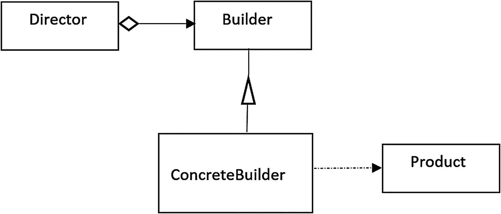
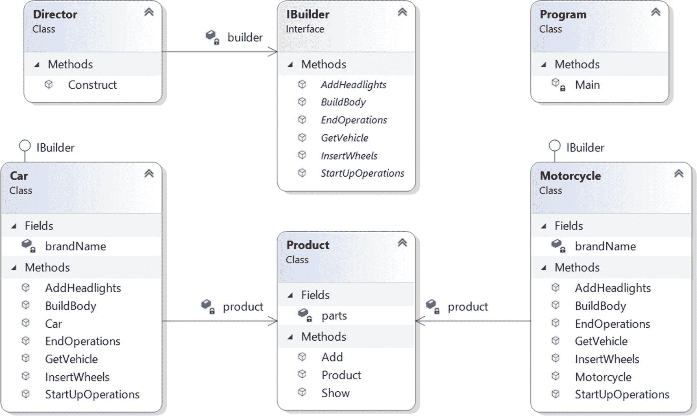
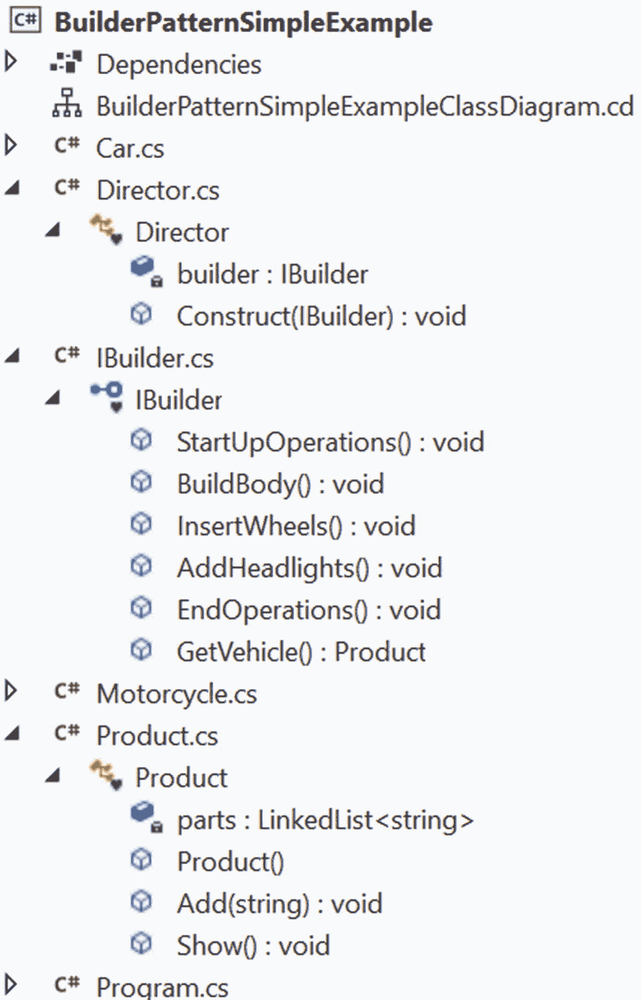
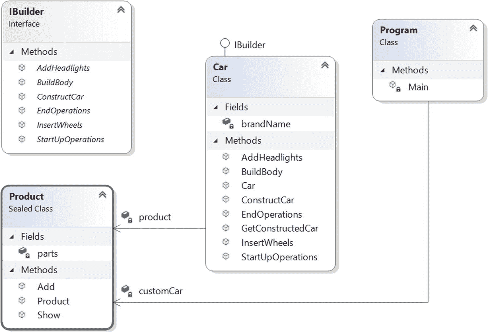
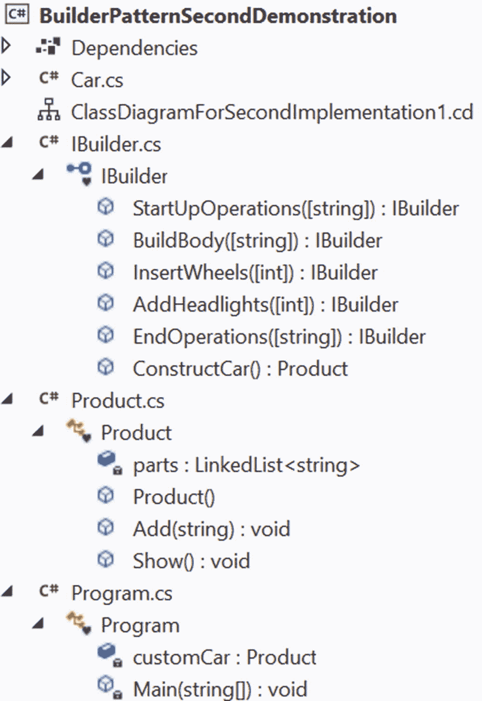

# 三、构建器模式

本章涵盖了构建器模式。

## GoF 定义

将复杂对象的构造与其表示分离，以便相同的构造过程可以创建不同的表示。

## 概念

构建器模式对于创建包含多个部分的复杂对象非常有用。对象创建过程应该独立于这些部分；换句话说，构建过程并不关心这些部分是如何组装的。此外，根据定义，您应该能够使用相同的构造过程来创建对象的不同表示。

根据 GoF，这种模式涉及四个不同的玩家，他们的关系如图 [3-1](#Fig1) 所示。



图 3-1

构建器模式示例

这里，`Product`是考虑中的复杂对象，是最终输出。`Builder`是一个接口，包含构建最终产品部件的方法。`ConcreteBuilder`实现了`Builder`接口，并组装了一个`Product`对象的不同部分。`ConcreteBuilder`对象构建了`Product`实例的内部表示，它有一个方法可以被调用来获得这个`Product`实例。`Director`负责使用`Builder`接口创建最终对象。值得注意的是`Director`是决定构建产品的步骤顺序的类/对象。所以，你可以放心地假设一个`Director`对象可以用来改变生产不同产品的顺序。

在演示 1 中，`IBuilder`表示`Builder`接口；`Car`和`Motorcycle`分别是`ConcreteBuilder` s. `Product`和`Director`类有它们通常的含义。

## 真实世界的例子

订购计算机时，会根据客户的喜好组装不同的硬件部件。例如，一个客户可以选择采用英特尔处理器的 500 GB 硬盘，另一个客户可以选择采用 AMD 处理器的 250 GB 硬盘。这里计算机是最终产品，客户扮演导演的角色，销售人员/组装人员扮演具体建造者的角色`.`

## 计算机世界的例子

当您想要将一种文本格式转换为另一种文本格式时，例如从 RTF 转换为 ASCII，可以使用这种模式。

## 履行

这个例子有以下几个部分:`IBuilder`*`Car`*`MotorCycle`*`Product`*`Director`。`IBuilder`创建`Product`对象的一部分，其中`Product`代表正在构建的复杂对象。`Car`和`MotorCycle`是`IBuilder`接口的具体实现。(是的，`IVehicle`可能是比`IBuilder,`更好的命名，但我选择了后者，以强调它是一个构建器接口。)它们实现了`IBuilder`接口，其表示如下。****

```cs
   interface IBuilder
    {
        void StartUpOperations();
        void BuildBody();
        void InsertWheels();
        void AddHeadlights();
        void EndOperations();
        Product GetVehicle();
    }

```

这就是为什么`Car`和`Motorcycle`需要为以下方法供应身体:`StartUpOperations()`、`BuildBody()`、`InsertWheels()`、`AddHeadlights()`、`EndOperations()`、`GetVehicle()`。前五种方法很简单；他们在开始时执行各种操作，构建车辆的车身，添加车轮和大灯，并在结束时执行一项操作。(比方说，制造商想要添加一个标志或打磨车辆，等等。在接下来的例子中，我通过为摩托车画一条简单的线，为汽车画一条虚线，使操作变得非常简单。)方法`GetVehicle()`返回最终的乘积。`Product`类非常容易理解，虽然我在其中使用了 LinkedList 数据结构，但是您可以出于类似的目的使用任何您喜欢的数据结构。

最后，`Director`类负责使用`IBuilder`接口构建这些产品的最终部分。(参见图 [3-1](#Fig1) 中 GoF 定义的结构。)因此，在我们的代码中，`Director`类如下所示。

```cs
class Director
    {
        IBuilder builder;
        /*
         * A series of steps.In real life, these steps
         * can be much more complex.
         */
        public void Construct(IBuilder builder)
        {
            this.builder = builder;
            builder.StartUpOperations();
            builder.BuildBody();
            builder.InsertWheels();
            builder.AddHeadlights();
            builder.EndOperations();
        }
    }

```

一个`Director`对象调用这个`Construct()`方法来创建不同类型的车辆。

现在让我们浏览一下代码，看看不同的部分是如何组装成这个模式的。

### 类图

图 [3-2](#Fig2) 显示了类图。



图 3-2

类图

### 解决方案资源管理器视图

图 [3-3](#Fig3) 显示了程序的高层结构。



图 3-3

解决方案资源管理器视图

Note

长话短说，我没有扩展汽车和摩托车类。这些类实现了`IBuilder`，很容易理解。如果需要的话也可以参考类图(见图 [3-2](#Fig2) )。对于这本书的其他一些截图，我遵循了相同的机制；就是当一个截图真的很大的时候，我只显示重要的部分。

### 演示 1

在这个例子中，我为所有不同的玩家使用不同的文件。下面是完整的实现。

```cs
// IBuilder.cs

namespace BuilderPatternSimpleExample
{
    // The common interface
    interface IBuilder
    {
        void StartUpOperations();
        void BuildBody();
        void InsertWheels();
        void AddHeadlights();
        void EndOperations();
        Product GetVehicle();
    }
}

// Car.cs

namespace BuilderPatternSimpleExample
{
    // Car is a ConcreteBuilder
    class Car : IBuilder
    {
        private string brandName;
        private Product product;
        public Car(string brand)
        {
            product = new Product();
            this.brandName = brand;
        }
        public void StartUpOperations()
        {   // Starting with brandname
            product.Add("-----------");
            product.Add($"Car model name :{this.brandName}");
        }
        public void BuildBody()
        {
            product.Add("This is a body of a Car");
        }
        public void InsertWheels()
        {
            product.Add("4 wheels are added");
        }

        public void AddHeadlights()
        {
            product.Add("2 Headlights are added");
        }
        public void EndOperations()
        {
            product.Add("-----------");
        }
        public Product GetVehicle()
        {
            return product;
        }
    }
}

// Motorcycle.cs

namespace BuilderPatternSimpleExample
{
    // Motorcycle is another ConcreteBuilder
    class Motorcycle : IBuilder
    {
        private string brandName;
        private Product product;
        public Motorcycle(string brand)
        {
            product = new Product();
            this.brandName = brand;
        }
        public void StartUpOperations()
        {
            product.Add("_________________");
        }

        public void BuildBody()
        {
            product.Add("This is a body of a Motorcycle");
        }

        public void InsertWheels()
        {
            product.Add("2 wheels are added");
        }

        public void AddHeadlights()
        {
            product.Add("1 Headlights are added");
        }
        public void EndOperations()
        {
            // Finishing up with brandname
            product.Add($"Motorcycle model name :{this.brandName}");
            product.Add("_________________");
        }
        public Product GetVehicle()
        {
            return product;
        }
    }
}

// Product.cs

using System;
using System.Collections.Generic; // For LinkedList

namespace BuilderPatternSimpleExample
{
    // "Product"
    class Product
    {
        /*
        You can use any data structure that you prefer     e.g.List<string> etc.
        */
        private LinkedList<string> parts;
        public Product()
        {
            parts = new LinkedList<string>();
        }

        public void Add(string part)
        {
            // Adding parts
            parts.AddLast(part);
        }

        public void Show()
        {
            Console.WriteLine("\nProduct completed as below :");
            foreach (string part in parts)
                Console.WriteLine(part);
        }
    }
}

// Director.cs

namespace BuilderPatternSimpleExample
{
    // "Director"
    class Director
    {
        private IBuilder builder;
        /*
         * A series of steps.In real life, these steps
         * can be much more complex.
         */
        public void Construct(IBuilder builder)
        {
            this.builder = builder;
            builder.StartUpOperations();
            builder.BuildBody();
            builder.InsertWheels();
            builder.AddHeadlights();
            builder.EndOperations();
        }
    }
}

// Client (Program.cs)

using System;
namespace BuilderPatternSimpleExample
{
   class Program
    {
        static void Main(string[] args)
        {
            Console.WriteLine("***Builder Pattern Demo.***");
            Director director = new Director();

            IBuilder b1 = new Car("Ford");
            IBuilder b2 = new Motorcycle("Honda");
            // Making Car
            director.Construct(b1);
            Product p1 = b1.GetVehicle();
            p1.Show();

            // Making Motorcycle
            director.Construct(b2);
            Product p2 = b2.GetVehicle();
            p2.Show();

            Console.ReadLine();
        }
    }
}

```

### 输出

这是输出。

```cs
***Builder Pattern Demo.***

Product completed as below :
-----------
Car model name :Ford
This is a body of a Car
4 wheels are added
2 Headlights are added
-----------

Product completed as below :
_________________
This is a body of a Motorcycle
2 wheels are added
1 Headlights are added
Motorcycle model name :Honda
_________________

```

### 分析

在`Main(),`内部，一个`Director`实例创建了两个不同的产品，因为我在`Construct()`方法中传递了两个不同的构建器，该方法只是依次调用了`StartUpOperations(), BuildBody(), InsertWheels(), AddHeadlights()`和`EndOperations()`方法。此外，不同的构建者对这些方法有不同的实现。

## 问答环节

**3.1 使用构建器模式的** **优势** **有哪些？**

以下是一些优点。

*   您指导构建器一步一步地构建对象，并且通过隐藏复杂的构建过程的细节来促进封装。当整个建造过程结束时，导演可以从建造者那里取回最终产品。一般来说，在一个高层次上，你似乎只有一个方法来制作完整的产品，但是其他的内部方法也参与了创建过程。因此，你可以更好地控制施工过程。

*   使用这种模式，相同的构建过程可以产生不同的产品。

*   您还可以改变产品的内部表示。

**3.2 与构建器模式相关的** **和** **有哪些缺点？**

以下是一些缺点。

*   如果你想处理易变的对象(可以在以后修改)，它是不合适的。

*   您可能需要复制部分代码。这些重复在某些情况下可能会产生重大影响。

*   要创建不同类型的产品，您需要创建不同类型的混凝土建筑商。

3.3 在这个模式的例子中，你可以用一个 **抽象类** **来代替接口吗？**

是的。在这个例子中，你可以使用一个抽象类来代替接口。

**3.4 如何决定在应用中使用抽象类还是接口？**

如果你想要集中的或者默认的行为，抽象类是更好的选择。在这些情况下，您可以提供一些默认的实现。另一方面，接口实现从零开始，并指示规则/契约，如要做什么，但它不会将“如何做”的部分强加于您。此外，当您试图实现多重继承的概念时，最好使用接口。

请记住，如果您需要在一个接口中添加一个新方法，那么您需要跟踪该接口的所有实现，并且您需要将该方法的具体实现放在所有这些地方。在这种情况下，抽象类是更好的选择，因为您可以在具有默认实现的抽象类中添加新方法，并且现有代码可以顺利运行。但是 C# v8 在。NET Core 3.0 也引入了默认接口方法的概念。因此，如果您使用的是 C# v8.0 以上的遗留版本，建议的最后几行是最好的。

以下是 MSDN 社区的一些重要建议。

*   当你有多个版本的组件时，使用一个抽象类。一旦更新了基类，所有派生类都会自动更新。另一方面，接口一旦创建就不应该更改。

*   当功能分布在不同的/不相关的对象中时，使用接口。抽象类应该用于共享公共功能的紧密相关的对象。

*   抽象类允许您部分实现您的类，而接口不包含任何成员的实现(忽略 C# v8.0 中的默认接口方法)。

**3.5 在汽车示例中，型号名称添加在开头，但对于摩托车，型号名称添加在结尾。这是故意的吗？**

是的。我这样做是为了证明这样一个事实，即每个混凝土建造者都可以决定如何生产最终产品的各个部分。他们有这种自由。

**3.6 你为什么为导演** **使用单独的班级？您可以使用客户端代码来扮演导演的角色。**

没有人强迫你这样做。在前面的实现中，我想在实现中将这个角色与客户端代码分开。但是在接下来的演示中，我使用客户端作为导演。

**3.7 什么叫** ***客户代码*** **？**

包含`Main()`方法的类是客户端代码。

你几次提到不同的步骤。你能演示一个用不同的变化和步骤创建最终产品的实现吗？

接得好。您是在要求我展示构建器模式的真正威力。让我们考虑下一个例子。

## 一种替代实施方式

让我们考虑一个替代实现。它给你更多的灵活性。下面是修改后的实现的主要特征。

*   为了关注核心设计，在这个实现中，让我们把汽车看作最终产品。

*   在这个实现中，客户机代码本身扮演着一个指挥者的角色。

*   和前面的例子一样，`IBuilder`表示构建器接口，但是这次，我没有使用`GetVehicle()`方法，而是将其重命名为`ConstructCar()`。

*   如演示 1 所示，`Car`类已经实现了接口中定义的所有方法，定义如下:

    ```cs
    interface IBuilder
        {
            /*
             * All these methods return type is IBuilder.
             * This will help us to apply method chaining.
             * I'm also providing values for default arguments.
             */
            IBuilder StartUpOperations(string optionalStartUpMessage = " Making a car for you.");
            IBuilder BuildBody(string optionalBodyType = "Steel");
            IBuilder InsertWheels(int optionalNoOfWheels = 4);
            IBuilder AddHeadlights(int optionalNoOfHeadLights = 2);
            IBuilder EndOperations(string optionalEndMessage = "Car construction is completed.");
            /*Combine the parts and make the final product.*/
            Product ConstructCar();
        }

    ```

请注意，这些方法与前面演示中的方法相似，但是有两个主要的变化:它们的返回类型是`IBuilder`，并且它们接受可选参数。这为您提供了灵活性——您可以向它们传递参数，也可以简单地忽略它们。但最重要的是，由于返回类型是`IBuilder`，现在您可以应用*方法链接*，这就是为什么您会在`Main()`中看到如下代码段。

*   在前面的部分中，我没有向`EndOperations`方法传递任何参数。同样，在我调用`StartUpOperations`方法之前，我调用了`InsertWheels`和`AddHeadlights`方法。这给了客户对象(在这种情况下是导演)自由，他想如何创建最终产品。

*   最后，`Product`类如下。

    ```cs
    sealed class Product
        {
            /*
             * You can use any data structure that you prefer
             * e.g. List<string> etc.
             */
            private LinkedList<string> parts;
            public Product()
            {
              parts = new LinkedList<string>();
            }

            public void Add(string part)
            {
              // Adding parts
              parts.AddLast(part);
            }

            public void Show()
            {
              Console.WriteLine("\nProduct completed as below :");
              foreach (string part in parts)
                    Console.WriteLine(part);
            }
        }

    ```

*   这次我做了`Product`类`sealed`，因为我想防止继承。像前面的演示一样，parts 属性是`private,`，并且在类中没有 setter 方法。所有这些构造都可以帮助您提高不变性(这在接下来的演示中是可选的)，这在您使用构建器模式时是经常需要的。您甚至可以从部件声明中排除`private`修饰符，因为默认情况下类成员拥有私有访问权。

*   你可以注意到另一点。在客户端代码内部，我使用了`customCar and CustomCar2`来制造汽车。这些是`Product`类实例。第一个是静态场，第二个是非静态场。我保留了这两个来给你展示`Main()`中`Product`类的用法变化。

```cs
Product customCar2 = new Car("Sedan")
.InsertWheels(7)
.AddHeadlights(6)
.StartUpOperations("Sedan creation in progress")
.BuildBody()
.EndOperations()//will take default end message
.ConstructCar();
customCar2.Show();

```

### 类图

图 [3-4](#Fig4) 显示了演示 2 中替代实现的修改后的类图。



图 3-4

备选实现的类图

### 解决方案资源管理器视图

图 [3-5](#Fig5) 显示了新的解决方案浏览器视图。



图 3-5

解决方案资源管理器视图

### 演示 2

下面是构建器模式的另一个实现。

```cs
using System;
using System.Collections.Generic;

namespace BuilderPatternSecondDemonstration
{
    // The common interface
    interface IBuilder
    {
        /*
         * All these methods return types are IBuilder.
         * This will help us to apply method chaining.
         * I'm also providing values for default arguments.
         */
        IBuilder StartUpOperations(string optionalStartUpMessage = "Making a car for you.");
        IBuilder BuildBody(string optionalBodyType = "Steel");
        IBuilder InsertWheels(int optionalNoOfWheels = 4);
        IBuilder AddHeadlights(int optionalNoOfHeadLights = 2);
        IBuilder EndOperations(string optionalEndMessage = "Car construction is complete.");
        // Combine the parts and make the final product.
        Product ConstructCar();
    }

    // Car class
    class Car : IBuilder
    {
        Product product;

        private string brandName;
        public Car(string brand)
        {
            product = new Product();
            this.brandName = brand;
        }
        public IBuilder StartUpOperations(string optionalStartUpMessage = " Making a car for you.")
        {   // Starting with brandname
            product.Add(optionalStartUpMessage);
            product.Add($"Car model name :{this.brandName}");
            return this;
        }
        public IBuilder BuildBody(string optionalBodyType = "Steel")
        {

            product.Add(($"Body type:{optionalBodyType}"));
            return this;
        }

        public IBuilder InsertWheels(int optionalNoOfWheels = 4)
        {

            product.Add(($"Wheels:{optionalNoOfWheels.ToString()}"));
            return this;
        }

        public IBuilder AddHeadlights(int optionalNoOfHeadLights = 2)
        {

            product.Add(($"Headlights:{optionalNoOfHeadLights.ToString()}"));
            return this;
        }

        public IBuilder EndOperations(string optionalEndMessage = "Car construction is completed.")
        {
            product.Add(optionalEndMessage);
            return this;
        }
        public Product ConstructCar()
        {
            return product;
        }

    }

    // Product class
    /*
     * Making the class sealed. The attributes are also private and
     * there is no setter methods. These are used to promote immutability.
     */

    sealed class Product
    {
        /* You can use any data structure that you prefer e.g.List<string> etc.*/
        private LinkedList<string> parts;
        public Product()
        {
            parts = new LinkedList<string>();
        }

        public void Add(string part)
        {
            // Adding parts
            parts.AddLast(part);
        }

        public void Show()
        {
            Console.WriteLine("\nProduct completed as below :");
            foreach (string part in parts)
                Console.WriteLine(part);

        }

    }
    // Director class (Client Code)
    class Program
    {
        static Product customCar;
        static void Main(string[] args)
        {
            Console.WriteLine("***Builder Pattern alternative implementation.***");
            /* Making a custom car (through builder)
               Note the steps:
               Step1:Get a builder object with required parameters
               Step2:Setter like methods are used.They will set the optional fields also.
               Step3:Invoke the ConstructCar() method to get the final car.
             */
            customCar = new Car("Suzuki Swift").StartUpOperations()//will take default message
                    .AddHeadlights(6)
                    .InsertWheels()//Will consider default value
                    .BuildBody("Plastic")
                    .EndOperations("Suzuki construction Completed.")
                    .ConstructCar();

            customCar.Show();
             /*
             Making another custom car (through builder) with a different sequence and steps.
             */
            // Directly using the Product class now.
            // (Just for a variation of usage)
            Product customCar2 = new Car("Sedan")
                     .InsertWheels(7)
                     .AddHeadlights(6)
                     .StartUpOperations("Sedan creation in progress")
                     .BuildBody()
                     .EndOperations() // will take default end message
                     .ConstructCar();
            customCar2.Show();
        }
    }

}

```

### 输出

这是新的输出。粗体行是为了让您注意输出中的差异。

```cs
***Builder Pattern alternative implementation.***

Product completed as below :
Making a car for you.
Car model name :Suzuki Swift
Headlights:6
Wheels:4
Body type:Plastic
Suzuki construction Completed.

Product completed as below :
Wheels:7
Headlights:6
Sedan creation in progress
Car model name :Sedan
Body type:Steel
Car construction is completed.

```

### 分析

仔细看一下`Main()`方法。您可以看到，主管(客户)可以使用构建器创建两个不同的产品，并且每次都遵循不同的步骤序列。这使得您的应用非常灵活。

## 问答环节

你在试图推广不变性。与 **不可变对象** **相关的关键好处是什么？**

一旦构造好，就可以安全地共享它们，最重要的是，它们是线程安全的，并且在多线程环境中可以节省同步成本。

3.10 什么时候我应该考虑使用构建器模式？

如果您需要制作一个复杂的对象，它涉及到构建过程的各个步骤，同时，产品需要是不可变的，那么 Builder 模式是一个不错的选择。***