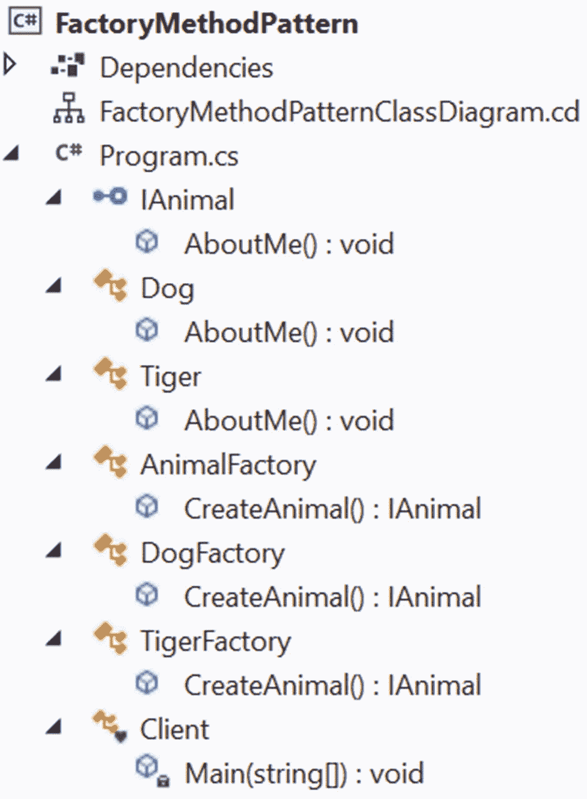

# 四、工厂方法模式

本章涵盖了工厂方法模式。

Note

为了更好地理解这种模式，我建议你首先阅读第 24 章，它涵盖了简单工厂模式。简单工厂模式没有直接落入四人组设计模式，所以它出现在本书的第二部分；然而，如果您首先理解简单工厂模式的优点和缺点，工厂方法模式会更有意义。

## GoF 定义

定义一个创建对象的接口，但是让子类决定实例化哪个类。工厂方法让一个类将实例化推迟到子类。

## 概念

这里，您从定义应用基本结构的抽象 creator 类开始，子类(从这个抽象类派生)负责执行实际的实例化过程。当你分析下面的例子时，这个概念就会对你有意义。

## 真实世界的例子

简单工厂模式的例子也适用于此。例如，在餐馆中，根据顾客的喜好，厨师可以在最终产品的准备过程中添加更多(或更少)的香料、油等。

让我们看另一个例子。假设一家汽车制造公司每年生产不同型号的汽车。根据他们的市场调查，他们决定一个模型，并开始生产。基于汽车的模型，不同的零件被制造和组装。一家公司应该随时准备好应对客户未来可能选择更好模式的变化。如果公司需要为只需要几个新功能的新模型创建一个全新的设置，这可能会极大地影响公司的利润率。因此，该公司应该以这样一种方式建立工厂，它可以很容易地为即将到来的模型生产零件。

## 计算机世界的例子

在数据库编程中，您可能需要支持不同的数据库用户。例如，一个用户可能使用 SQL Server，而另一个用户可能选择 Oracle。当你需要向你的数据库中插入数据时，你首先要创建一个连接对象，比如`SqlConnection`或者`OracleConnection`，然后才能继续。如果您将代码放入一个`if-else`块(或`switch`语句)，您可能需要重复许多相似的代码，这不容易维护。此外，每当您决定开始支持一种新的连接类型时，您需要重新打开代码并进行一些修改。使用工厂方法模式可以解决这类问题。

## 履行

接下来的例子提供了一个名为`AnimalFactory`的抽象 creator 类来定义基本结构。根据定义，实例化过程是通过从这个抽象类派生的子类来执行的。这个例子里有很多小类。我可以为每个类创建单独的文件，这种方法经常被许多开发人员所鼓励。但是这些类非常简短、简单和直接。所以，我把它们放在一个文件里。对于本书中类似的例子，我遵循同样的原则。

### 类图

图 [4-1](#Fig1) 为类图。


图 4-1

类图

### 解决方案资源管理器视图

图 [4-2](#Fig2) 显示了程序的高层结构。



图 4-2

解决方案资源管理器视图

### 演示 1

下面是实现。类似于第 [24 章](24.html)中的简单工厂模式，我使用相同的继承层次结构；也就是说，这一次，您看到`Dog`和`Tiger`类都实现了它们的父接口`IAnimal`的`AboutMe()`方法。因此，您会在示例的开头看到下面的代码段。

```cs
public interface IAnimal
    {
        void AboutMe();
    }
    public class Dog : IAnimal
    {
        public void AboutMe()
        {
            Console.WriteLine("The dog says: Bow-Wow. I prefer barking.");
        }
    }
    public class Tiger : IAnimal
    {
        public void AboutMe()
        {
            Console.WriteLine("The tiger says: Halum. I prefer hunting.");
        }
    }

```

您可以看到另一个继承层次结构，其中两个具体的类——称为`DogFactory`和`TigerFactory`—创建了 dog 和 tiger 对象。它们中的每一个都继承自一个抽象类`AnimalFactory`。这两个具体的类推迟了实例化过程。我加入了支持性的评论来帮助你更好地理解。下面的代码段描述了它。

```cs
public abstract class AnimalFactory
    {
        /*
        Remember the GoF definition which says
        "....Factory method lets a class defer instantiation
        to subclasses." The following method will create a tiger or a dog object, but at this point it does not know whether it will get a dog or a tiger. It will be decided by
        the subclasses i.e. DogFactory or TigerFactory.
        So, the following method is acting like a factory
        (of creation).
        */
        public abstract IAnimal CreateAnimal();
    }
    // DogFactory is used to create dog
    public class DogFactory : AnimalFactory
    {
        public override IAnimal CreateAnimal()
        {
            // Creating a Dog
            return new Dog();
        }
    }
    // TigerFactory is used to create tigers
    public class TigerFactory : AnimalFactory
    {
        public override IAnimal CreateAnimal()
        {
            // Creating a Tiger
            return new Tiger();
        }
    }

```

这是完整的演示。

```cs
using System;

namespace FactoryMethodPattern
{
    #region Animal Hierarchy
    /*
     * Both the Dog and Tiger classes will
     * implement the IAnimal interface method.
     */
    public interface IAnimal
    {
        void AboutMe();
    }
    // Dog class
    public class Dog : IAnimal
    {
        public void AboutMe()
        {
            Console.WriteLine("The dog says: Bow-Wow. I prefer barking.");
        }
    }
    //Tiger class
    public class Tiger : IAnimal
    {
        public void AboutMe()
        {
            Console.WriteLine("The tiger says: Halum. I prefer hunting.");
        }
    }
    #endregion

    #region Factory Hierarchy

    // Both DogFactory and TigerFactory will use this.
    public abstract class AnimalFactory
    {
        /*
        Remember the GoF definition which says
        "....Factory method lets a class defer instantiation
        to subclasses." The following method will create a Tiger
        or a Dog, but at this point it does not know whether
        it will get a dog or a tiger. It will be decided by
        the subclasses i.e. DogFactory or TigerFactory.
        So, the following method is acting like a factory
        (of creation).
        */
        public abstract IAnimal CreateAnimal();
    }
    // DogFactory is used to create dog
    public class DogFactory : AnimalFactory
    {
        public override IAnimal CreateAnimal()
        {
            // Creating a Dog
            return new Dog();
        }
    }
    // TigerFactory is used to create tigers
    public class TigerFactory : AnimalFactory
    {
        public override IAnimal CreateAnimal()
        {
            // Creating a Tiger
            return new Tiger();
        }
    }
    #endregion
    class Client
    {
        static void Main(string[] args)
        {
            Console.WriteLine("***Factory Pattern Demo.***\n");
            // Creating a Tiger Factory
            AnimalFactory tigerFactory = new TigerFactory();
            // Creating a tiger using the Factory Method
            IAnimal tiger = tigerFactory.CreateAnimal();
            tiger.AboutMe();

            // Creating a DogFactory
            AnimalFactory dogFactory = new DogFactory();
            // Creating a dog using the Factory Method
            IAnimal dog = dogFactory.CreateAnimal();
            dog.AboutMe();

            Console.ReadKey();
        }
    }
}

```

### 输出

以下是运行该程序的输出。

```cs
***Factory Pattern Demo.***

The tiger says: Halum. I prefer hunting.
The dog says: Bow-Wow. I prefer barking.

```

## 修改后的实现 1

现在让我们来看看您可以对演示 1 进行的两个重要修改。

在第一个修改的实现中，更多的灵活性被添加到我们先前的实现中。注意，`AnimalFactory`类是一个抽象类，所以你可以利用它。假设您希望一个子类遵循一个可以从其父类(或基类)强加的规则。为简单起见，让我们通过控制台消息来实施该规则，如下面的演示所示。

### 部分演示 1

在修改后的实现中，我在`AnimalFactory class`中引入了一个叫做`MakeAnimal()`的新方法。

```cs
// Modifying the AnimalFactory class.
public abstract class AnimalFactory
    {
      public IAnimal MakeAnimal()
            {
                 Console.WriteLine("AnimalFactory.MakeAnimal()-You cannot ignore parent rules.");
                 IAnimal animal = CreateAnimal();
                 animal.AboutMe();
                 return animal;
            }
        /*
        Remember the GoF definition which says
        "....Factory method lets a class defer instantiation
        to subclasses." Following method will create a Tiger
        or a Dog class, but at this point it does not know whether
        it will get a dog or a tiger. It will be decided by
        the subclasses i.e.DogFactory or TigerFactory.
        So, the following method is acting like a factory
        (of creation).
        */
        public abstract IAnimal CreateAnimal();
    }

```

客户端代码采用了这些更改；也就是说，不是先调用`CreateAnimal()`再使用`AboutMe()`。我只是在下面的代码段中调用了`MakeAnimal()`。旧代码被注释以供参考，并与新代码进行比较。

```cs
class Client
    {
        static void Main(string[] args)
        {
            Console.WriteLine("***Factory Pattern Modified Demo.***\n");
            // Creating a Tiger Factory
            AnimalFactory tigerFactory = new TigerFactory();
            // Creating a tiger using the Factory Method
            //IAnimal tiger = tigerFactory.CreateAnimal();
            //tiger.AboutMe();
            IAnimal tiger = tigerFactory.MakeAnimal();

            // Creating a DogFactory
            AnimalFactory dogFactory = new DogFactory();
            // Creating a dog using the Factory Method
            //IAnimal dog = dogFactory.CreateAnimal();
            //dog.AboutMe();
            IAnimal dog = dogFactory.MakeAnimal();

            Console.ReadKey();
        }
    }

```

### 输出

下面是修改后的输出。

```cs
***Factory Pattern Modified Demo.***

AnimalFactory.MakeAnimal()-You cannot ignore parent rules.
The tiger says: Halum. I prefer hunting.

AnimalFactory.MakeAnimal()-You cannot ignore parent rules.
The dog says: Bow-Wow. I prefer barking.

```

### 分析

现在，在每种情况下，您都会看到以下警告:“…您不能忽略父规则。”这是对演示 1 的增强。

## 问答环节

**4.1 为什么将** `CreateAnimal()` **方法** **从客户端代码中分离出来？**

我做这件事只有一个目的。我想让子类创建专门化的对象。如果你仔细观察，你会发现只有这个“创造性部分”在不同的产品中有所不同。我在第 24 章的“问答环节”中详细讨论了这一点。

使用这样的工厂有哪些 **优势** **？**

以下是一些关键优势。

*   您将变化的代码与不变化的代码分开(换句话说，使用简单工厂模式的优势仍然存在)，这有助于您轻松地维护代码。

*   代码不是紧密耦合的，所以您可以在系统中随时添加新的类，如`Lion`、`Bear`等，而无需修改现有的架构。换句话说，我遵循了“修改时封闭，扩展时开放”的原则。

**4.3 使用这样的工厂有哪些** **挑战** **？**

如果您需要处理许多不同类型的对象，那么系统的整体性能会受到影响。

4.4 工厂方法模式支持两个平行的层次结构。这是正确的吗？

接得好。是的，从类图来看，很明显这种模式支持并行的类层次结构(见图 [4-3](#Fig3) )。


图 4-3

本例中的两个类层次结构

在这个例子中，`AnimalFactory`、`DogFactory`和`TigerFactory`被放置在一个层次中，而`IAnimal`、`Dog`和`Tiger`被放置在另一个层次中。因此，你可以看到创作者和他们的创作/产品是并行运行的两个层次。

你应该总是用一个抽象的关键字来标记工厂方法，这样子类就可以完成它们。这是正确的吗？

不。当创建者没有子类时，您可能会对默认的工厂方法感兴趣。在这种情况下，不能用关键字`abstract`标记工厂方法。

然而，要看到工厂方法模式的真正威力，您可能需要遵循这里在大多数情况下实现的设计。

看来工厂方法模式与简单工厂模式没有太大的不同。这是正确的吗？

如果你看看这两章的例子中的子类，你可能会发现一些相似之处。但是你不应该忘记工厂方法模式的主要目的；它为你提供了一个框架，通过这个框架，不同的子类可以生产不同的产品。在简单工厂模式中，您不能以类似的方式改变产品。您可以将简单的工厂模式视为一次性交易，但最重要的是，您的创造性部分不会因为修改而关闭。每当您想要添加新的东西时，您需要在简单工厂模式的工厂类中添加一个`if-else`块或一个`switch`语句。

在这种情况下，永远记住 GoF 定义，它说，“工厂方法模式让一个类延迟实例化到子类。”仔细看看修改后的实现。你可以看到`CreateAnimal()`通过`AnimalFactory`的适当子类创建了一只狗或一只老虎。所以，`CreateAnimal()`是这个设计中抽象的工厂方法。当`MakeAnimal()`在其体内使用`CreateAnimal()`时，它不知道是对狗还是对老虎有效。`AnimalFactory`的子类只知道为这个应用创建具体的实现(一只狗或一只老虎)。

Note

在`System.Web.WebRequest`类中，你可以看到`Create`方法，它有两个重载。在这个方法中，您可以传递一个统一资源标识符(URI)。此方法为请求确定适当的协议并返回适当的子类，例如，HttpWebRequest(如果 URI 以 http://或 https://开头)、FtpWebRequest(如果 URI 以 ftp://开头)等等。如果 URI 从 HTTP 更改为 FTP，底层代码不需要更改，调用者也不需要担心协议的细节。这种架构促进了工厂模式的使用，但是对于新的开发不推荐使用 HttpWebRequest。微软建议你使用系统。请改用. Net.Http.HttpClient 类。

## 修改后的实现 2

本章以对我们的初始实现的额外更新结束。现在让我们通过使用方法参数来更新演示 1。我们继续吧。当您从 Apress 网站下载代码时，您可以获得完整的实现。为了简洁起见，这里只展示了部分演示。

### 部分演示 2

这段代码表明，如果在`CreateAnimal()` `.`中使用方法参数，可以使原来的实现变得更好，这种方法提供了一个好处。您可以只创建一个具体的工厂类，而不是创建`DogFactory, TigerFactory`等等，如下所示。

```cs
#region Factory Hierarchy

    // Both DogFactory and TigerFactory will use this.
    public abstract class AnimalFactory
    {
        /*
        Remember the GoF definition which says
        "....Factory method lets a class defer instantiation
        to subclasses." Following method will create a Tiger
        or a Dog, but at this point it does not know whether
        it will get a dog or a tiger. It will be decided by
        the subclasses i.e.DogFactory or TigerFactory.
        So, the following method is acting like a factory
        (of creation).
        */
        public abstract IAnimal CreateAnimal(string animalType);
    }
    /*
     * ConcreteAnimalFactory is used to create dogs or tigers
     * based on method parameter of CreateAnimal() method.
     */
    public class ConcreteAnimalFactory : AnimalFactory
    {
        public override IAnimal CreateAnimal(string animalType)
        {
            if (animalType.Contains("dog"))
            {
                // Creating a Dog
                return new Dog();
            }
            else
            if (animalType.Contains("tiger"))
            {
                // Creating a Dog
                return new Tiger();
            }
            else
            {
                throw new ArgumentException("You need to pass either a dog or a tiger as an argument.");
            }
        }
    }

    #endregion

```

现在你可以在`CreateAnimal(...)`方法中传递一个“狗”字符串或一个“老虎”字符串来创建一个`Dog`或一个`Tiger`实例。为了适应这些变化，您可以按如下方式更新客户端代码。(这一次，`animalFactory`创建了`Dog`和`Tiger`实例。每个人都知道“编程到接口”有这种好处。)

```cs
class Client
    {
        static void Main(string[] args)
        {
            Console.WriteLine("***Factory Pattern Demo.***");
            Console.WriteLine("***It's a modified version using method parameter(s).***\n");
            // Creating a factory that can produce animals
            AnimalFactory animalFactory = new ConcreteAnimalFactory();
            // Creating a tiger using the Factory Method
            IAnimal tiger = animalFactory.CreateAnimal("tiger");
            tiger.AboutMe();
            // Now creating a dog.
            IAnimal dog = animalFactory.CreateAnimal("dog");
            dog.AboutMe();

            Console.ReadKey();
        }
    }

```

### 输出

现在，如果您执行这个程序，您可以得到以下输出。

```cs
***Factory Pattern Demo.***
***It's a modified version using method parameter(s).***

The tiger says: Halum. I prefer hunting.
The dog says: Bow-Wow. I prefer barking.

```

我希望您现在对如何实现工厂方法模式有了更好的理解。提供两个修改的实现作为参考。(Apress 网站上提供了完整的实现。).您可以决定是否要在您的程序中使用这些修改中的一个(或两个)。但是您应该记住，工厂方法应该在幕后为客户机创建适当的对象，这是该模式的终极座右铭。