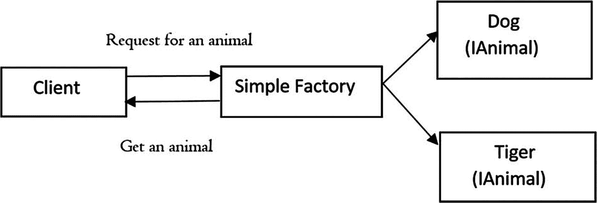

# 五、抽象工厂模式

本章涵盖了抽象工厂模式。

## GoF 定义

提供创建相关或依赖对象系列的接口，而无需指定它们的具体类。

Note

如果你理解简单工厂模式(第[章第 24](24.html) 节)和工厂方法模式(第[章第 4](04.html) 节)，抽象工厂模式对你来说会更有意义。简单工厂模式并不直接属于四人组设计模式，所以对该模式的讨论出现在本书的第二部分。我建议你先阅读第 4 章[和第 24 章](04.html)，然后再开始阅读这一章。

## 概念

抽象工厂通常被称为工厂中的*工厂。这种模式提供了一种封装一组具有共同主题的单个工厂的方法。在这个过程中，你不直接实例化一个类；相反，您实例化一个具体的工厂，然后使用该工厂创建产品。*

在我们接下来的例子中，实例化了一个工厂实例(`animalFactory`)。通过使用这个工厂实例，我创建了狗和老虎实例(狗和老虎是最终产品)，这就是为什么您会在客户端代码中看到下面的代码段。

```cs
// Making a wild dog and wild tiger through WildAnimalFactory
IAnimalFactory animalFactory = FactoryProvider.GetAnimalFactory("wild");
IDog dog = animalFactory.GetDog();
ITiger tiger = animalFactory.GetTiger();
dog.AboutMe();
tiger.AboutMe();

```

当产品相似，但产品系列不同时，这种模式最适合(例如，家养的狗和野生的狗很不一样)。这种模式有助于您交换特定的实现，而无需更改使用它们的代码，甚至在运行时也是如此。但是，这可能会导致不必要的复杂性和额外的工作。在某些情况下，甚至调试也变得很困难。

## 真实世界的例子

假设你用两种不同类型的桌子装饰你的房间；一个是木制的，另一个是钢制的。对于木制的，你需要拜访一个木匠，对于其他类型的，你可能需要去一个金属商店。所有这些都是桌子工厂。所以，基于需求，你决定你需要什么样的工厂。

## 计算机世界的例子

ADO.NET 实现了类似的概念来建立到数据库的连接。

## 履行

维基百科描述了这种模式的典型结构，类似于图 [5-1](#Fig1) (见 [`https://en.wikipedia.org/wiki/Abstract_factory_pattern`](https://en.wikipedia.org/wiki/Abstract_factory_pattern) )所示。


图 5-1

抽象工厂模式

在本章的实现中，我遵循类似的结构。在这个例子中，有两种动物:宠物和野生动物。`Program.cs`客户正在寻找一些动物(在本例中是野狗、宠物狗、野生老虎和宠物老虎)。在这个实现中，您将探索宠物和野生动物的构造过程。

`IAnimalFactory`是一个抽象工厂。名为`WildAnimalFactory`和`PetAnimalFactory`的两个具体工厂继承自这个抽象工厂。你可以看到这些混凝土工厂负责创造狗和老虎的混凝土产品。顾名思义，`WildAnimalFactory`创造野生动物(野狗、野虎)，而`PetAnimalFactory`创造宠物(宠物狗、宠物虎)。下面总结了参与者及其角色。

*   `IAnimalFactory`:抽象工厂

*   `WildAnimalFactory`:实现`IAnimalFactory`的混凝土工厂；它创造了野狗和野生老虎

*   `PetAnimalFactory`:实现`IAnimalFactory,`的混凝土工厂，但是这个工厂制造宠物狗和宠物老虎

*   `ITiger`和`IDog`:抽象产品

*   `PetTiger`、`PetDog`、`WildTiger`、`WildDog`:混凝土制品。`PetTiger`和`WildTiger`实现`ITiger`接口。`PetDog`和`WildDog`实现`IDog`接口。`IDog`和`ITiger`接口只有一个方法`AboutMe()`，在简单工厂模式和工厂方法模式中都使用。

*   客户端代码中使用了一个名为`FactoryProvider`的静态类，如下所示:

    ```cs
    // Making a wild dog and wild tiger through
    // WildAnimalFactory
    IAnimalFactory animalFactory = FactoryProvider.GetAnimalFactory("wild");
    IDog dog = animalFactory.GetDog();
    ITiger tiger = animalFactory.GetTiger();
    dog.AboutMe();
    tiger.AboutMe();

    ```

*   从前面代码段中的粗线可以看出，我是*而不是*直接实例化工厂实例；相反，我使用`FactoryProvider`静态类来获取工厂实例。(这个类的结构类似于在工厂方法模式中使用具体工厂时的结构。)`FactoryProvider`根据在`GetAnimalFactory(...)`方法中传递的参数提供合适的工厂。

### 类图

图 [5-2](#Fig2) 显示了类图。


图 5-2

类图

### 解决方案资源管理器视图

图 [5-3](#Fig3) 显示了程序的高层结构。


图 5-3

解决方案资源管理器视图

### 演示 1

这是完整的程序。

```cs
using System;

namespace AbstractFactoryPattern
{
    // Abstract Factory
    public interface IAnimalFactory
    {
        IDog GetDog();
        ITiger GetTiger();
    }

    // Abstract Product-1
    public interface ITiger
    {
        void AboutMe();
    }
    // Abstract Product-2
    public interface IDog
    {
        void AboutMe();
    }

    // Concrete product-A1(WildTiger)
    class WildTiger : ITiger
    {
        public void AboutMe()
        {
            Console.WriteLine("Wild tiger says: I prefer hunting in jungles. Halum.");
        }
    }
    // Concrete product-B1(WildDog)
    class WildDog : IDog
    {
        public void AboutMe()
        {
            Console.WriteLine("Wild dog says: I prefer to roam freely in jungles. Bow-Wow.");
        }
    }

    // Concrete product-A2(PetTiger)
    class PetTiger : ITiger
    {
        public void AboutMe()
        {
            Console.WriteLine("Pet tiger says: Halum. I play in an animal circus.");
        }
    }

    // Concrete product-B2(PetDog)
    class PetDog : IDog
    {
        public void AboutMe()
        {
            Console.WriteLine("Pet dog says: Bow-Wow. I prefer to stay at home.");
        }
    }
    // Concrete Factory 1-Wild Animal Factory
    public class WildAnimalFactory : IAnimalFactory
    {

        public ITiger GetTiger()
        {
            return new WildTiger();
        }
        public IDog GetDog()
        {
            return new WildDog();
        }
    }
    // Concrete Factory 2-Pet Animal Factory
    public class PetAnimalFactory : IAnimalFactory
    {
        public IDog GetDog()
        {
            return new PetDog();
        }

        public ITiger GetTiger()
        {
            return new PetTiger();
        }
    }
    // Factory provider
    class FactoryProvider
    {
        public static IAnimalFactory GetAnimalFactory(string factoryType)
        {
            if (factoryType.Contains("wild"))
            {
                // Returning a WildAnimalFactory
                return new WildAnimalFactory();
            }
            else
           if (factoryType.Contains("pet"))
            {
                // Returning a PetAnimalFactory
                return new PetAnimalFactory();
            }
            else
            {
                throw new ArgumentException("You need to pass either wild or pet as argument.");
            }
        }
    }

    // Client
    class Program
    {
        static void Main(string[] args)
        {
            Console.WriteLine("***Abstract Factory Pattern Demo.***\n");            // Making a wild dog and wild tiger through WildAnimalFactory
            IAnimalFactory animalFactory = FactoryProvider.GetAnimalFactory("wild");
            IDog dog = animalFactory.GetDog();
            ITiger tiger = animalFactory.GetTiger();
            dog.AboutMe();
            tiger.AboutMe();

            Console.WriteLine("******************");

            // Making a pet dog and pet tiger through PetAnimalFactory now.
            animalFactory = FactoryProvider.GetAnimalFactory("pet");
            dog = animalFactory.GetDog();
            tiger = animalFactory.GetTiger();
            dog.AboutMe();
            tiger.AboutMe();

            Console.ReadLine();
        }
    }
}

```

### 输出

这是输出。

```cs
***Abstract Factory Pattern Demo.***

Wild dog says: I prefer to roam freely in jungles. Bow-Wow.
Wild tiger says: I prefer hunting in jungles. Halum.
******************
Pet dog says: Bow-Wow.I prefer to stay at home.
Pet tiger says: Halum.I play in an animal circus.

```

## 问答环节

**5.1**`IDog`**和** `ITiger` **接口** **都包含同名的方法。例如，两个接口都包含** `AboutMe()` **方法** **。这是强制性的吗？**

不，你可以为你的方法使用不同的名字。此外，这些接口中方法的数量可以不同。然而，在第 [24](24.html) 章中，我介绍了简单工厂模式，在第 [4](04.html) 章中，我介绍了工厂方法模式。在这一章中，我继续例子，这就是为什么我保持同样的方法。

使用这样一个抽象工厂有哪些挑战****？****

 **抽象工厂中的任何变化都会迫使您将修改传播到具体工厂。标准设计理念建议你对接口编程，而不是对实现编程。这是开发人员应该始终牢记的关键原则之一。在大多数情况下，开发人员不想改变他们的抽象工厂。

此外，整体架构很复杂，这就是为什么在某些情况下调试非常具有挑战性。

如何区分简单工厂模式 **和工厂方法模式或者抽象工厂模式？**

我将在第 4 章的“问答”部分讨论简单工厂模式和工厂方法模式的区别。

让我们修改一下客户端代码如何使用这些工厂，如下图所示。下面是简单工厂模式的代码片段。

```cs
IAnimal preferredType = null;
SimpleFactory simpleFactory = new SimpleFactory();
#region The code region that can vary based on users preference
/*
* Since this part may vary, we're moving the
* part to CreateAnimal() in SimpleFactory class.
*/
preferredType = simpleFactory.CreateAnimal();
#endregion

#region The codes that do not change frequently.
preferredType.AboutMe();
#endregion

```

图 [5-4](#Fig4) 显示了简单的工厂模式。



图 5-4

简单工厂模式

下面是工厂方法模式的代码片段。

```cs
// Creating a Tiger Factory
AnimalFactory tigerFactory = new TigerFactory();
// Creating a tiger using the Factory Method
IAnimal tiger = tigerFactory.CreateAnimal();
tiger.AboutMe();

// Creating a DogFactory
AnimalFactory dogFactory = new DogFactory();
// Creating a dog using the Factory Method
IAnimal dog = dogFactory.CreateAnimal();
dog.AboutMe();

```

图 [5-5](#Fig5) 显示了工厂方法模式。


图 5-5

工厂方法模式

下面是抽象工厂模式的代码片段。

```cs
// Making a wild dog and wild tiger through WildAnimalFactory
IAnimalFactory animalFactory = FactoryProvider.GetAnimalFactory("wild");
IDog dog = animalFactory.GetDog();
ITiger tiger = animalFactory.GetTiger();
dog.AboutMe();
tiger.AboutMe();

Console.WriteLine("******************");

// Making a pet dog and pet tiger through PetAnimalFactory now.
animalFactory = FactoryProvider.GetAnimalFactory("pet");
dog = animalFactory.GetDog();
tiger = animalFactory.GetTiger();
dog.AboutMe();
tiger.AboutMe();

```

图 [5-6](#Fig6) 显示了抽象工厂模式。


图 5-6

抽象工厂模式

简而言之，使用简单工厂模式，您可以将不同于其他代码的代码分离出来(基本上，您可以将客户端代码解耦)。这种方法有助于您更轻松地管理代码。这种方法的另一个主要优点是客户端不知道对象是如何创建的。因此，它同时促进了安全性和抽象性。

但是，这种方法会违反开闭原则。使用工厂方法模式可以克服这个缺点，工厂方法模式允许子类决定如何完成实例化过程。简而言之，您将对象创建委托给实现工厂方法来创建对象的子类。

抽象工厂基本上是工厂的工厂。它创建了一系列相关的对象，但是它不依赖于具体的类。在这个模式中，您封装了一组具有共同主题的独立工厂。在这个过程中，你不直接实例化一个类；取而代之的是，您得到一个具体的工厂(我为此使用了一个提供者)，然后，使用该工厂创建产品。

最后，我试图保持例子简单。工厂方法促进继承，它的子类需要实现工厂方法来创建对象。抽象工厂模式可以通过使用工厂接口中公开的方法创建相关对象来促进对象组合。最后，所有的工厂都通过减少对具体类的依赖来促进松散耦合。**