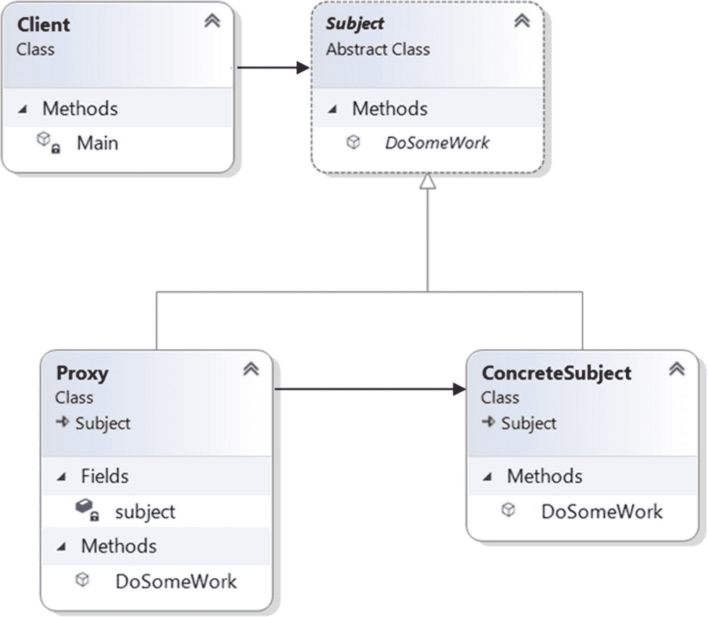
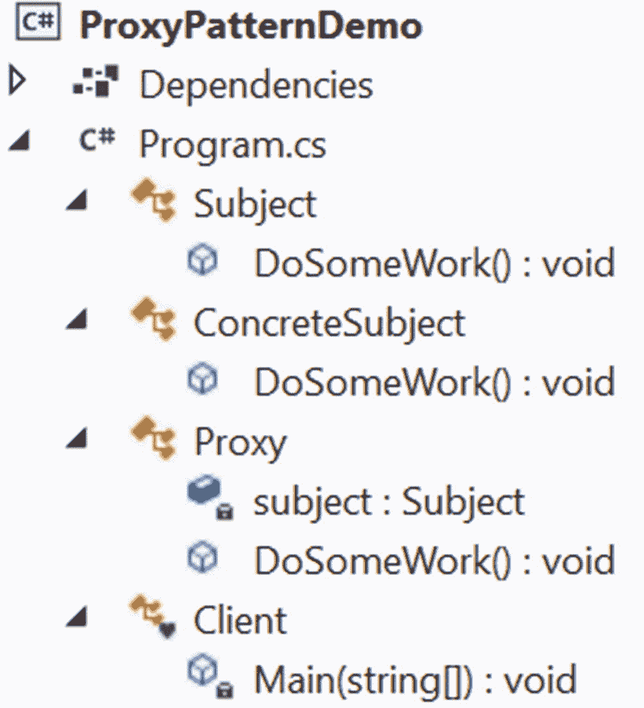
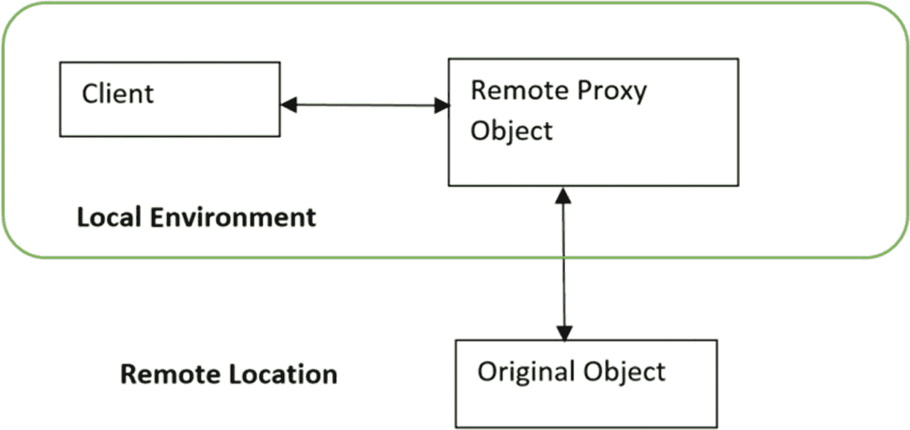

# 六、代理模式

本章介绍代理模式。

## GoF 定义

为另一个对象提供代理或占位符，以控制对它的访问。

## 概念

您需要支持这种设计，因为在许多情况下，与原始对象的直接通信并不总是可能的。这是由许多因素造成的，包括安全性和性能问题、资源限制、最终产品处于开发阶段等等。代理可以是不同的类型，但从根本上说，它是原始对象的替代物(或占位符)。因此，当客户端与代理对象交互时，看起来它是在直接与实际对象对话。因此，使用这种模式，您可能希望使用一个可以作为原始类的接口的类。

## 真实世界的例子

在教室里，当一个学生缺席时，他最好的朋友可能会在点名时试图模仿他的声音，让老师认为他的朋友在那里。除了这个例子，您还可以考虑另一个领域的例子，例如，ATM。ATM 实现可以保存远程服务器上的银行信息的代理对象。

## 计算机世界的例子

在真实的编程世界中，创建一个复杂对象的多个实例可能成本很高，因为您可能需要不容易获得或分配的资源。在这种情况下，您可以创建多个可以指向原始对象的代理对象。这种机制可以帮助您节省计算机/系统内存并提高应用的性能。

代理的另一个常见用途是当用户不想公开他/她的机器的真实 IP 地址并使其匿名时。

在 WCF 应用中，您可能会注意到 WCF 客户端代理，客户端应用使用它与服务进行通信。您还可以配置一个 REST API 在代理服务器后面工作，以促进授权的通信。

## 履行

在这个程序中，`Subject`是一个抽象类，它有一个名为`DoSomeWork()` `.`的抽象方法，如下所示。

```cs
public abstract class Subject
    {
        public abstract void DoSomeWork();
    }

```

`ConcreteSubject`是一个继承自`Subject`的具体类，完成了`DoSomeWork()`方法。所以，看起来是这样的。

```cs
public class ConcreteSubject : Subject
    {
        public override void DoSomeWork()
        {
            Console.WriteLine("I've processed your request.");
        }
    }

```

让我们假设您想要限制客户端直接调用`ConcreteSubject`中的方法。(考虑一下计算机世界例子中讨论的案例，这背后有一些原因。)所以，你做了一个名为`Proxy`的代理类。在我们的实现中，`Proxy`类还包含一个名为`DoSomeWork()`的方法，客户端可以通过一个`Proxy`实例来使用这个方法。当客户端调用代理对象的`DoSomeWork()`方法时，这个调用又被传播到`ConcreteSubject`对象中的`DoSomeWork()`方法。这让客户感觉好像他们直接调用了来自`ConcreteSubject`的方法，这就是为什么`Proxy`类看起来像下面这样。

```cs
public class Proxy : Subject
    {
        Subject subject;

        public override void DoSomeWork()
        {
            Console.WriteLine("Welcome, my client.");
            /*
            Lazy initialization:We'll not instantiate until
            the method is called.
            */
            if (subject == null)
            {
                subject = new ConcreteSubject();
            }
            subject.DoSomeWork();
        }
    }

```

### 类图

图 [6-1](#Fig1) 为类图。



图 6-1

类图

### 解决方案资源管理器视图

图 [6-2](#Fig2) 显示了程序的高层结构。(注意，您可以将代理类分离到一个不同的文件中，但是由于本例中的各个部分都很小，所以我将所有内容都放在一个文件中。同样的评论也适用于本书中的其他程序。)



图 6-2

解决方案资源管理器视图

### 演示 1

下面是完整的实现。

```cs
using System;

namespace ProxyPatternDemo
{
    /// <summary>
    /// Abstract class Subject
    /// </summary>
    public abstract class Subject
    {
        public abstract void DoSomeWork();
    }
    /// <summary>
    /// ConcreteSubject class
    /// </summary>
    public class ConcreteSubject : Subject
    {
        public override void DoSomeWork()
        {
            Console.WriteLine("I've processed your request.");
        }
    }
    /// <summary>
    /// Proxy class
    /// </summary>
    public class Proxy : Subject
    {
        Subject subject;

        public override void DoSomeWork()
        {
            Console.WriteLine("Welcome, my client.");
            /*
             Lazy initialization:We'll not instantiate the object until the method is called.
            */
            if (subject == null)
            {
                subject = new ConcreteSubject();
            }
            subject.DoSomeWork();
        }
    }
    /// <summary>
    /// Client class
    /// </summary>

    class Client
    {
        static void Main(string[] args)
        {
            Console.WriteLine("***Proxy Pattern Demo.***\n");
            Subject proxy = new Proxy();
            proxy.DoSomeWork();
            Console.ReadKey();
        }
    }
}

```

### 输出

这是输出。

```cs
***Proxy Pattern Demo.***

Welcome, my client.
I've processed your request.

```

## 问答环节

**6.1 有哪些不同类型的代理人** **？**

这些是代理的常见类型。

*   远程代理:这些代理可以隐藏位于不同地址空间的对象。

*   虚拟代理:这些代理执行优化技术，比如按需创建一个重对象。

*   *保护代理*:这些代理一般处理不同的访问权限。

*   *智能引用*:当客户端访问对象时执行额外的内务处理。典型的操作可以包括计算在某一时刻对对象的引用次数。

**6.2 您可以在代理类构造函数中创建** `ConcreteSubject` **实例** **，如下所示。**

```cs
/// <summary>
/// Proxy class
/// </summary>
public class Proxy : Subject
        {
        Subject subject;
        public Proxy()
        {
                // Instantiating inside the constructor
                subject = new ConcreteSubject();
        }
        public override void DoSomeWork()
        {
                Console.WriteLine("Proxy call happening now..");
                cs.DoSomeWork();
        }
}

```

这是正确的吗？

是的，你可以这样做。但是不要忘记代理类可以有不依赖于`ConcreteSubject`的额外方法。因此，如果您需要来自代理类的这些方法，并且遵循您提出的设计，无论何时您实例化一个代理对象，您也实例化了一个`ConcreteSubject`类的对象。因此，这最终可能会创建不必要的对象。

**6.3 使用这个** **惰性实例化过程** **，你可能会在多线程应用中创建不必要的对象。这是正确的吗？**

是的。这是一个简单的插图，让您了解实际模式背后的核心思想。在第 [1](01.html) 章对单例模式的讨论中，我们分析了一些告诉你如何在多线程环境中工作的替代方法。在这种情况下，你可以参考这些讨论。(例如，在这种情况下，您可以实现一个智能代理，以确保在授予对象访问权限之前锁定该对象)。

**6.4 能否举一个** **远程代理** **的例子？**

假设您想要调用一个对象的方法，但是该对象正在不同的地址空间中运行(例如，在不同的位置或不同的计算机上)。你是如何进行的？在远程代理的帮助下，您可以调用代理对象上的方法，该方法又将调用转发给远程计算机上运行的实际对象。(如果实际的方法存在于不同的计算机上，并且您通过网络上的代理对象连接到它，那么演示 1 就是这种情况下的一个例子。)这种类型的需求可以通过不同的公知机制来实现，例如 ASP.NET、CORBA、COM/DCOM 或 Java 的 RMI。在 C# 应用中，您可以使用 WCF(.NET Framework 版及更高版本)或。NET web 服务/remoting(主要用于早期版本)。值得注意的是。NET remoting 不被支持。NET Core，微软未来也不打算增加这种支持(见 [`https://docs.microsoft.com/en-us/dotnet/core/porting/net-framework-tech-unavailable#:~:text=NET%20Remoting%20isn't%20supported`](https://docs.microsoft.com/en-us/dotnet/core/porting/net-framework-tech-unavailable%2523:%257E:text%253DNET%2520Remoting%2520isn%2527t%2520supported) 、IO)。

图 [6-3](#Fig3) 显示了一个简单的远程代理结构。



图 6-3

一个简单的远程代理图

**6.5 你什么时候使用** **虚拟代理** **？**

虚拟代理保护内存不被分配给对象。如果实际的对象创建是一个昂贵的操作，您可以创建一个包含最重要细节的目标对象的简单副本，并将其提供给用户。昂贵的对象只有在真正需要的时候才会被创建。例如，您可以使用这个概念来避免加载不必要的超大图像，以获得更好的应用性能。

**6.6 什么时候使用** **保护代理** **？**

在组织中，安全团队可以实施保护代理来阻止对特定网站的 Internet 访问。

考虑下面的例子，它是前面描述的代理模式实现的修改版本。为了简单起见，让我们假设只有三个注册用户可以使用`DoSomeWork()`代理方法。如果一个不需要的用户(名为 Robin)试图调用该方法，系统会拒绝他的访问请求。当系统拒绝这种不需要的访问时，创建代理对象就没有意义了。在接下来的例子中，这些注册用户在代理类构造函数中初始化，但是我避免了在其中实例化一个`ConcreteSubject`对象。它帮助我避免为未授权用户创建不必要的对象。

现在让我们来看一下修改后的实现。

### 演示 2

下面是修改后的实现。

```cs
using System;
using System.Linq; // For Contains() method below

namespace ProxyPatternQAs
{
    /// <summary>
    /// Abstract class Subject
    /// </summary>
    public abstract class Subject
    {
        public abstract void DoSomeWork();
    }
    /// <summary>
    /// ConcreteSubject class
    /// </summary>
    public class ConcreteSubject : Subject
    {
        public override void DoSomeWork()
        {
            Console.WriteLine("I've processed your request.\n");
        }
    }
    /// <summary>
    /// Proxy class
    /// </summary>
    public class Proxy : Subject
    {
        Subject subject;
        string[] registeredUsers;
        string currentUser;
        public Proxy(string currentUser)
        {
            /*
             * Avoiding to instantiate ConcreteSubject
             * inside the Proxy class constructor.
             */
            //subject = new ConcreteSubject();

            // Registered users
            registeredUsers = new string[] { "Admin", "Rohit", "Sam" };
            this.currentUser = currentUser;
        }
        public override void DoSomeWork()
        {
            Console.WriteLine($"{currentUser} wants to access into the system.");
            if (registeredUsers.Contains(currentUser))
            {
                Console.WriteLine($"Welcome, {currentUser}.");
                /* Lazy initialization: We'll not instantiate until the method is called through an authorized user. *.
                if (subject == null)

                {
                    subject = new ConcreteSubject();
                }
                subject.DoSomeWork();
            }
            else
            {
                Console.WriteLine($"Sorry {currentUser}, you do not have access into the system.");
            }
        }
    }
    /// <summary>
    /// Client
    /// </summary>

    class Client
    {
        static void Main(string[] args)
        {
            Console.WriteLine("***Proxy Pattern Demo2.***\n");
            // Authorized user-Admin
            Subject proxy = new Proxy("Admin");
            proxy.DoSomeWork();
            // Authorized user-Sam
            proxy = new Proxy("Sam");
            proxy.DoSomeWork();
            // Unauthorized User-Robin
            proxy = new Proxy("Robin");
            proxy.DoSomeWork();
            Console.ReadKey();
        }
    }
}

```

### 输出

这是修改后的输出。

```cs
***Proxy Pattern Demo2.***

Admin wants to access into the system.
Welcome, Admin.
I've processed your request.

Sam wants to access into the system.
Welcome, Sam.
I've processed your request.

Robin wants to access into the system.
Sorry Robin, you do not have access into the system.

```

看起来代理人就像装饰者一样(见第七章**)。这是正确的吗？**

有时候代理实现和装饰器有一些相似之处，但是你不应该忘记代理的真正意图。装饰者专注于增加职责，而代理者专注于控制对对象的访问。所以，如果你记得它们的用途，在大多数情况下，你可以区分代理和装饰者。

什么时候我应该考虑设计一个代理？

下面是代理可以帮助您的一些重要用例。

*   您正在为一个仍处于开发阶段或很难重现的场景编写测试用例。例如，当您想要评估应用中只能在客户环境中看到的行为，但您也认识到当应用正在运行时，获得该行为的概率非常低。在这种情况下，您可以在您的代理对象中模拟客户环境行为，并执行您的测试用例来评估该行为的正确性。您不希望您的客户端直接与目标对象对话。

*   你想隐藏复杂性，增强系统的安全性。

**6.9 与代理相关的** **缺点有哪些？**

使用这种模式时，您应该记住以下一些因素。

*   总的响应时间可能是一个问题，因为您没有直接与实际的对象对话。

*   您需要为代理维护额外的层。

*   代理可以隐藏对象的实际响应，这在某些情况下可能会造成混乱。