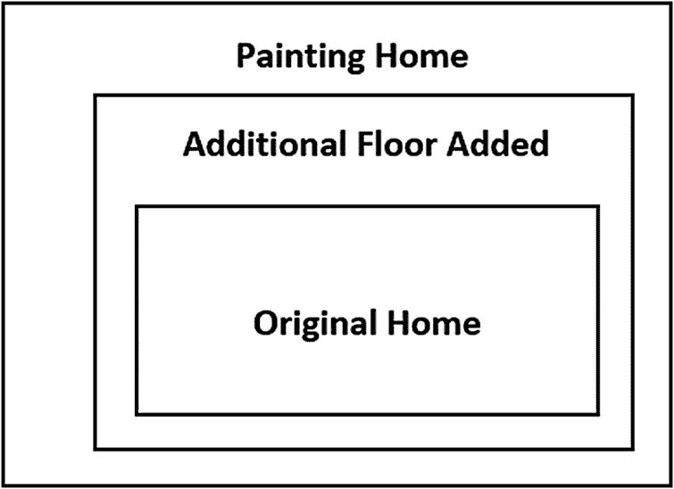
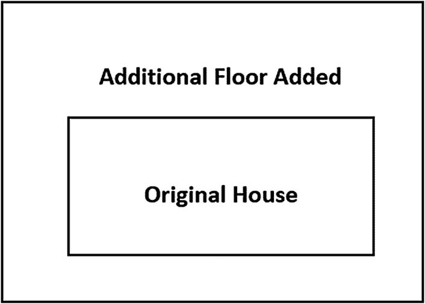
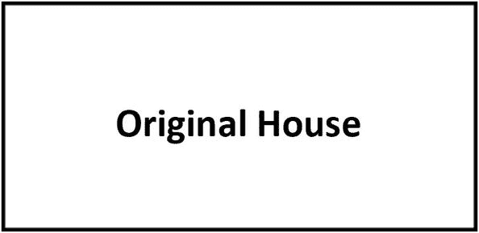
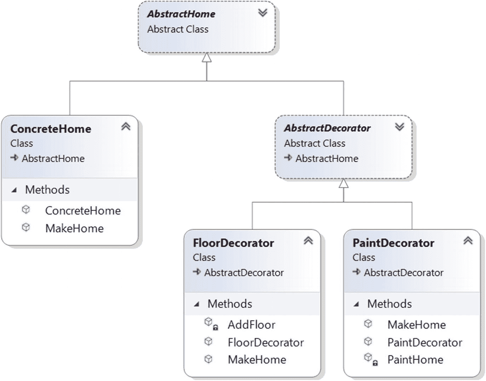
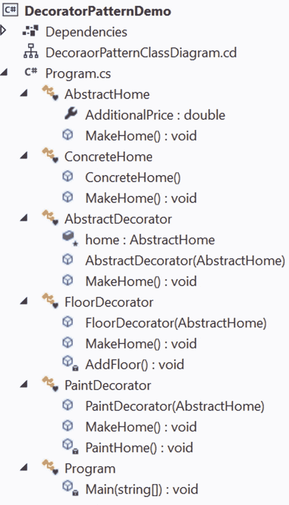
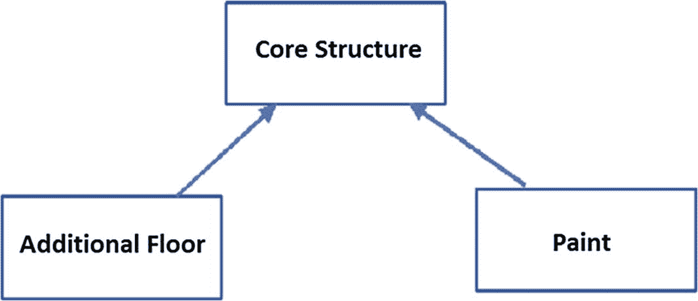
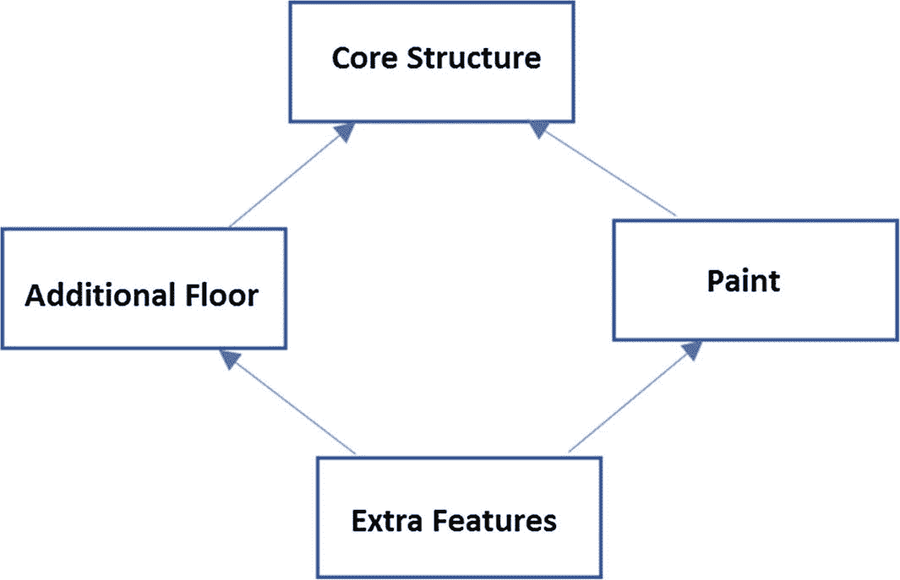
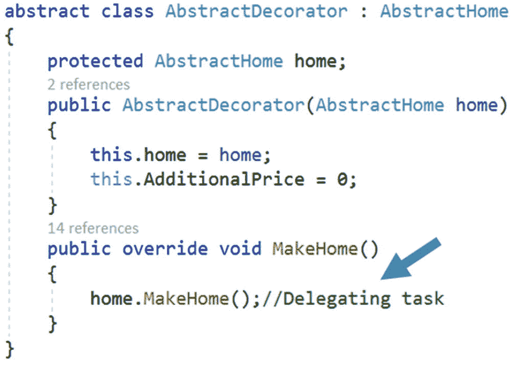

# 七、装饰模式

本章涵盖了装饰模式。

## GoF 定义

动态地将附加责任附加到对象上。Decorators 为扩展功能提供了子类化的灵活替代方案。

## 概念

从 GoF 定义来看，很明显这种模式使用了子类化的替代方法(即继承)。如果不允许继承，怎么进行？是的，你猜对了。它规定你用合成代替继承。

通过遵循 SOLID 原则，这种模式推广了这样一个概念，即类对修改是封闭的，但对扩展是开放的。(如果你想了解更多坚实的原理，去 [`https://en.wikipedia.org/wiki/SOLID_(object-oriented_design)`](https://en.wikipedia.org/wiki/SOLID_%2528object-oriented_design%2529) 。)使用这种模式，您可以在不改变底层类的情况下向特定对象添加特殊功能。

装饰器就像一个包装器(或顶层),包裹着原始对象，并为其添加额外的功能。这就是装饰模式也被称为包装模式的原因。当您动态添加装饰者时，这种模式是最有效的。由于 decorators 通常是动态添加的，所以如果您不希望在开发的后期阶段使用它们，这完全没问题，因为原始对象仍然可以工作。

## 真实世界的例子

假设你有一栋单层的房子，你决定在上面加建一层。您可能不希望更改底层的架构，但是您可能希望为新添加的楼层采用一种新的设计，以适合现有架构的顶部。

图 [7-1](#Fig1) 、 [7-2](#Fig2) 和 [7-3](#Fig3) 说明了这个概念。



图 7-3

在已有装饰者的基础上再加一个装饰者，并修改房子(现在粉刷房子)



图 7-2

有装修工的原始房屋(附加楼层建在原始结构的顶部)



图 7-1

原始房屋

Note

图 [7-3](#Fig3) 所示的情况是可选的。您可以使用现有的 decorator 对象来增强行为，或者您可以创建一个新的 decorator 对象并将新的行为添加到其中。在第二步中，你也可以直接油漆原来的房子。一旦添加了新地板，您就不需要开始粉刷了。

## 计算机世界的例子

假设您想在基于 GUI 的工具包中添加边框属性。您可以使用继承来做到这一点，但这不能被视为最终的解决方案，因为您可能无法从一开始就对所有事情拥有绝对的控制权。因此，这种技术本质上是静态的。

在这种情况下，装饰者可以为你提供一种灵活的方法。他们推广动态选择的概念。例如，您可以将组件包装在另一个对象中(类似于图 [7-2](#Fig2) 和 [7-3](#Fig3) )。封闭对象被称为装饰器，它必须符合它所装饰的组件的接口。它将请求转发给原始组件，并可以在这些请求之前或之后执行附加操作。事实上，这个概念允许您添加无限数量的责任。

## 履行

在这个例子中，涉及五个玩家:`AbstractHome, ConcreteHome, AbstractDecorator, FloorDecorator`和`PaintDecorator`。

`AbstractHome`定义如下。

```cs
    abstract class AbstractHome
    {
        public double AdditionalPrice { get; set; }
        public abstract void MakeHome();
    }

```

`AbstractHome`的具体实现者必须实现`MakeHome()`方法。除此之外，您可以通过使用`AdditionalPrice`属性来设置价格。这就是为什么从`AbstractHome,`继承的一个叫`ConcreteHome`的具体类完成了原来的结构，看起来像下面这样(我假设家一旦建好，不需要立即修改；所以，`AdditionalPrice`初始设置为 0)。

```cs
    class ConcreteHome : AbstractHome
    {
        public ConcreteHome()
        {
            AdditionalPrice = 0;
        }
        public override void MakeHome()
        {
            Console.WriteLine($"Original House is constructed.Price for this 10000$");
        }
    }

```

此时，你可以选择在现有的房屋上加建一层，或者你可以粉刷房屋，或者两者兼而有之。于是，`FloorDecorator`和`PaintDecorator` `both`出现了。虽然并不严格要求共享公共代码，但是两个装饰器都继承了`AbstractDecorator`，它具有以下结构。

```cs
abstract class AbstractDecorator : AbstractHome
    {
        protected AbstractHome home;
        public AbstractDecorator(AbstractHome home)
        {
            this.home = home;
            this.AdditionalPrice = 0;
        }
        public override void MakeHome()
        {
            home.MakeHome();
        }
    }

```

请注意，`AbstractDecorator`保存了对`AbstractHome`的引用。因此，具体的装饰者(本例中的`FloorDecorator`或`PaintDecorator`)正在装饰`AbstractHome`的一个实例。

现在我们来看一个混凝土装饰工的结构，`FloorDecorator`，如下。

```cs
    // Floor Decorator used to add a floor
    class FloorDecorator : AbstractDecorator
    {
        public FloorDecorator(AbstractHome home) : base(home)
        {

            this.AdditionalPrice = 2500;
        }
        public override void MakeHome()
        {
            base.MakeHome();
            // Adding a floor on top of original house.
            AddFloor();
        }
        private void AddFloor()
        {
            Console.WriteLine($"-Additional Floor added.Pay additional {AdditionalPrice}$ for it .");
        }
    }

```

你可以看到`FloorDecorator`可以加一层楼(使用`AddFloor()`的方法)，使用的时候必须额外支付 2500 美元的额外建设费用。更重要的是，在添加楼层之前，它调用了`AbstractHome`类的`MakeHome()`方法，后者又从`AbstractHome`(即`ConcreteHome`)的一个具体实现中调用了`MakeHome()`方法。

类似的行为，但你要为此付出更多。(是的，我假设你正在为你的家使用奢华的油漆。)

### 类图

图 7-4 显示了类图中最重要的部分。



图 7-4

类图。这里没有显示客户端类。

### 解决方案资源管理器视图

图 [7-5](#Fig5) 显示了程序的高层结构。



图 7-5

解决方案资源管理器视图

### 示范

下面是完整的实现，它测试了两个场景(用#region 标记)。在场景 1 中，我在现有房屋上添加了一层，然后对其进行了粉刷。在场景 2 中，我粉刷了原来的家，然后在现有建筑的顶部添加了两层。

```cs
using System;

namespace DecoratorPatternDemo
{
    abstract class AbstractHome
    {
        public double AdditionalPrice { get; set; }
        public abstract void MakeHome();
    }
    class ConcreteHome : AbstractHome
    {
        public ConcreteHome()
        {
            AdditionalPrice = 0;
        }
        public override void MakeHome()
        {
            Console.WriteLine($"Original House is constructed.Price for this $10000");
        }
    }
    abstract class AbstractDecorator : AbstractHome
    {
        protected AbstractHome home;
        public AbstractDecorator(AbstractHome home)
        {
            this.home = home;
            this.AdditionalPrice = 0;
        }
        public override void MakeHome()
        {
            home.MakeHome();//Delegating task
        }
    }

    // Floor Decorator is used to add a floor

    class FloorDecorator : AbstractDecorator
    {

        public FloorDecorator(AbstractHome home) : base(home)
        {
            //this.home = home;
            this.AdditionalPrice = 2500;
        }
        public override void MakeHome()
        {
            base.MakeHome();
            // Adding a floor on top of original house.
            AddFloor();
        }
        private void AddFloor()
        {
            Console.WriteLine($"-Additional Floor added.Pay additional ${AdditionalPrice} for it .");
        }
    }

    // Paint Decorator used to paint the home.

    class PaintDecorator : AbstractDecorator
    {

        public PaintDecorator(AbstractHome home):base(home)
        {
            //this.home = home;
            this.AdditionalPrice = 5000;
        }
        public override void MakeHome()
        {
            base.MakeHome();
            // Painting home.
            PaintHome();
        }
        private void PaintHome()
        {
            Console.WriteLine($"--Painting done.Pay additional ${AdditionalPrice} for it .");
        }
    }
    class Program
    {
        static void Main(string[] args)
        {
            Console.WriteLine("***Decorator pattern Demo***\n");

            #region Scenario-1
            Console.WriteLine("\n**Scenario-1:");
            Console.WriteLine("**Building home.Adding floor and then painting it.**");

            AbstractHome home = new ConcreteHome();
            Console.WriteLine("Current bill breakups are as follows:");
            home.MakeHome();

            // Applying a decorator
            // Adding a floor
            home = new FloorDecorator(home);
            Console.WriteLine("\nFloor added.Current bill breakups are as follows:");
            home.MakeHome();

            // Working on top of the previous decorator.
            // Painting the home
            home = new PaintDecorator(home);
            Console.WriteLine("\nPaint applied.Current bill breakups are as follows:");
            home.MakeHome();
            #endregion

            #region Scenario-2
            Console.WriteLine("\n**Scenario-2:");
            Console.WriteLine("**Building home,painting it and then adding two additional floors on top of it.**");
            // Fresh start once again.
            home = new ConcreteHome();
            Console.WriteLine("\nGoing back to original home.Current bill breakups are as follows:");
            home.MakeHome();

            // Applying paint on original home.
            home = new PaintDecorator(home);
            Console.WriteLine("\nPaint applied.Current bill breakups are as follows:");
            home.MakeHome();

            // Adding a floor on the painted home.
            home = new FloorDecorator(home);
            Console.WriteLine("\nFloor added.Current bill breakups are as follows:");
            home.MakeHome();

            // Adding another floor on the current home.
            home = new FloorDecorator(home);
            Console.WriteLine("\nFloor added.Current bill breakups are as follows:");
            home.MakeHome();
            #endregion

            Console.ReadKey();
        }
    }
}

```

### 输出

```cs
***Decorator pattern Demo***

**Scenario-1:
**Building home. Adding floor and then painting it.**
Current bill breakups are as follows:
Original House is constructed. Price for this $10000

Floor added. Current bill breakups are as follows:
Original House is constructed.Price for this $10000
-Additional Floor added.Pay additional $2500 for it.

Paint applied. Current bill breakups are as follows:
Original House is constructed.Price for this $10000
-Additional Floor added. Pay additional $2500 for it.
--Painting done. Pay additional $5000 for it.

**Scenario-2:
**Building home, painting it and then adding two additional floors on top of it.**

Going back to original home. Current bill breakups are as follows:
Original House is constructed. Price for this $10000

Paint applied. Current bill breakups are as follows:
Original House is constructed. Price for this $10000
--Painting done. Pay additional $5000 for it.

Floor added.Current bill breakups are as follows:
Original House is constructed.Price for this $10000
--Painting done.Pay additional $5000 for it.
-Additional Floor added. Pay additional $2500 for it.

Floor added.Current bill breakups are as follows:
Original House is constructed. Price for this $10000
--Painting done.Pay additional $5000 for it.
-Additional Floor added.Pay additional $2500 for it.
-Additional Floor added.Pay additional $2500 for it.

```

## 问答环节

**7.1 你能解释一下合成是如何促进一种继承所不能的动态行为的吗？**

当派生类从基类继承时，它只继承基类当时的行为。尽管不同的子类可以以不同的方式扩展基类或父类，但这种类型的绑定在编译时是已知的。所以这个方法是静态的。但是通过使用组合的概念，就像前面的例子一样，您可以获得动态行为。

当你设计一个父类时，你可能没有足够的洞察力去了解你的客户在以后的某个阶段可能需要什么样的额外职责。由于约束是您不能修改现有的代码，在这种情况下，对象组合不仅远远超过继承，而且还确保您不会在旧的架构中引入错误。

最后，在这种情况下，你必须记住一个关键的设计原则，即*类应该对扩展开放，但对修改*关闭。

使用装潢师的关键 **优势** **是什么？**

以下是一些关键优势。

*   现有的结构是原封不动的，所以你不能在那里引入错误。

*   新的功能可以很容易地添加到现有的对象。

*   你不仅可以在界面上添加行为，还可以改变行为。

*   您不需要立即预测/实现所有支持的功能(例如，在初始设计阶段)。你可以增量开发。例如，您可以逐个添加装饰器对象来支持您的需求。你必须承认，如果你先创建一个复杂的类，然后想扩展它的功能，这将是一个乏味的过程。

**7.3 整体设计模式与** **传承** **有何不同？**

您可以通过简单地附加或分离 decorators 来添加、改变或删除职责。但是使用简单的继承技术，您需要为新的职责创建新的类。所以，你最终可能会得到一个复杂的系统。

再次考虑这个例子。假设你想加一层新地板，粉刷房子，做一些额外的工作。为了满足这一需求，您可以从`FloorDecorator`开始，因为它已经提供了添加地板的支持，然后使用`PaintDecorator`来粉刷房子。然后，您需要添加一个简单的包装器来完成这些额外的职责。

但是如果你从继承开始，然后你可能有多个子类；比如一个加层，一个粉刷房子，如图 [7-6](#Fig6) (一个层次继承)。



图 7-6

等级继承

因此，如果你需要一个带有额外功能的额外油漆地板，你可能需要最终得到如图 [7-7](#Fig7) 所示的设计。



图 7-7

一个类(额外特性)需要从多个基类继承

现在你感受到了“钻石效应”的热度，因为在许多编程语言中，包括 C#，多个基类是不允许的。

您还会发现，与装饰模式相比，继承机制不仅更具挑战性和耗时，而且可能会在应用中产生重复代码。最后，不要忘记继承只促进编译时绑定(不是动态绑定)。

7.4 你为什么要创建一个职责单一的类？你可以创建一个子类，简单地添加一个地板，然后进行绘画。在这种情况下，您可能会得到更少的子类。这是正确的吗？

如果你熟悉固体原理，你就知道有一个原理叫*单责*。这个原则背后的思想是，每个类应该对软件中提供的功能的一个部分负责。当您使用单一责任原则时，装饰模式是有效的，因为您可以简单地动态添加或删除责任。

**7.5 与此模式相关的** **缺点** **有哪些？**

我相信如果你小心的话，没有显著的缺点。但是如果你在系统中创建了太多的装饰器，那么维护和调试将会很困难。所以，在这种情况下，他们会制造不必要的混乱。

**7.6 例子中的** **AbstractDecorator 类** **是抽象的，但是里面没有抽象方法。这怎么可能？**

在 C# 中，一个类可以是抽象的，而不包含抽象方法，但反之则不然。换句话说，如果一个类包含至少一个抽象方法，就意味着这个类是不完整的，你被迫用`abstract`关键字来标记它。

同样，如果你阅读了图 [7-8](#Fig8) 中的注释，你正在将任务委托给一个具体的装饰者，在这种情况下，因为你只想使用和实例化具体的装饰者。



图 7-8

抽象类:AbstractDecorator

因此，在这个例子中，您不能简单地实例化一个`AbstractDecorator`实例，因为它用`abstract`关键字标记。

下面一行创建了一个编译错误。

```cs
AbstractDecorator abstractDecorator = new AbstractDecorator();
saying “CS0144    Cannot create an instance of the abstract class or interface 'AbstractDecorator'”

```

**7.7 装饰器是否只用于** **动态绑定** **？**

不。您可以将这个概念用于静态和动态绑定。但是动态绑定是它的强项，所以我在这里集中讨论这一点。GoF 定义也只关注动态绑定。

Note

中的 I/O 流实现。NET 框架，。NET 核心，Java 使用装饰模式。例如，`BufferedStream`类继承自`Stream`类。注意这个类中存在两个重载的构造函数；它们每个都以一个`Stream`(父类)作为参数(就像演示 1 一样)。当您看到这种结构时，您可能会看到装饰模式的一个例子。`BufferedStream`在. NET 中表现得像个装潢师。