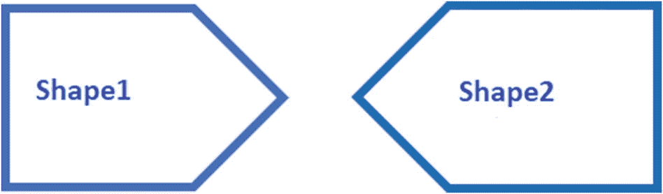
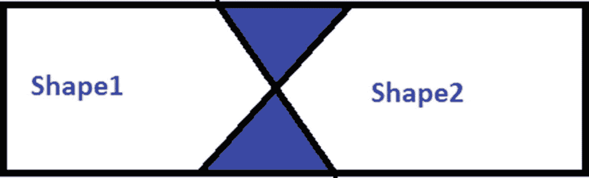
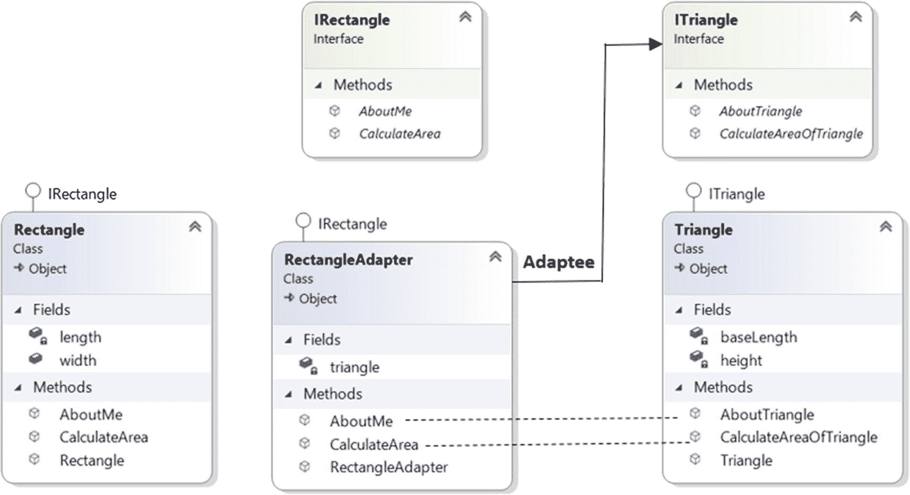
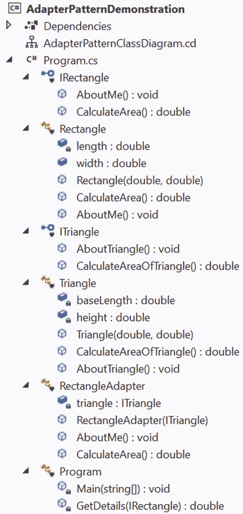
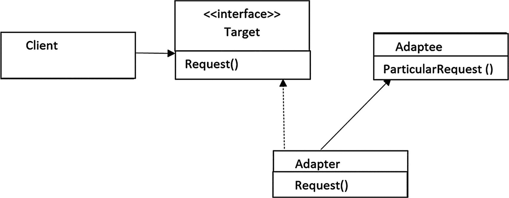
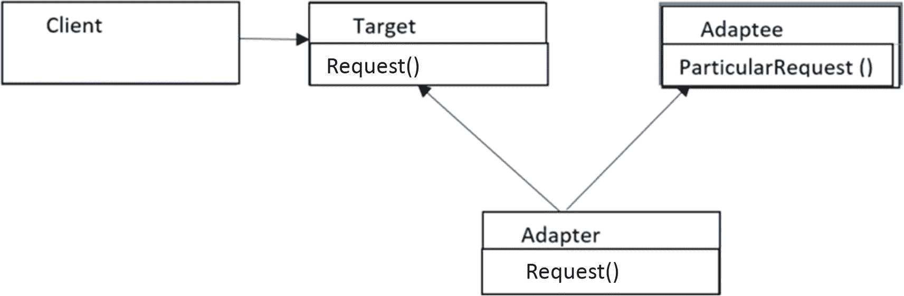

# 八、适配器模式

本章介绍适配器模式。

## GoF 定义

将一个类的接口转换成另一个客户期望的接口。适配器允许类一起工作，否则由于不兼容的接口而不能。

## 概念

从 GoF 定义中，您可以猜测这种模式处理至少两个不兼容的继承层次结构。在特定领域的系统中，客户习惯于如何调用软件中的方法。这些方法可以遵循继承层次结构。现在假设您需要升级系统，并且需要实现一个新的继承层次结构。当你这样做的时候，你不想强迫你的客户学习访问软件的新方法。那么，你能做什么？解决方案很简单:编写一个适配器，接受客户机请求，并以新层次结构中的方法可以理解的形式翻译这些请求。因此，客户可以享受更新的软件，没有任何麻烦。

下面的例子也可以帮助你更好地理解这些模式。

## 真实世界的例子

这种模式的一个常见应用是在国际旅行中使用电源插座适配器/交流电源适配器。这些适配器可以充当中间人，以便电子设备(如接受美国电源的笔记本电脑)可以插入欧洲电源插座。

考虑另一个例子。假设你需要给手机充电。但是你看到电源插座和你的充电器不兼容。在这种情况下，您可能需要使用适配器。即使是一个将一种语言转换成另一种语言的译者在现实生活中也遵循这种模式。

让我们考虑这样一种情况，您有两个不同的形状(例如，形状 1 和形状 2)，它们都不是矩形，它们看起来像图 [8-1](#Fig1) 。



图 8-1

在使用适配器之前

让我们进一步假设，将这两种不同的形状结合起来，你需要形成一个矩形。你是如何进行的？一个简单的解决方法是再带一个有界的 X 形图形(填充颜色)，如图 [8-2](#Fig2) 所示。


图 8-2

电源适配器

然后贴上三个形状，如图 [8-3](#Fig3) 所示。



图 8-3

使用适配器后

在编程中，你可以把 Shape1 和 Shape2 想象成两个不同的接口，除非你用这个 X 形的图形把它们组合起来形成一个矩形，否则它们是不能一起工作的。在这个场景中，X 形图形扮演着适配器的角色。

## 计算机世界的例子

假设您有一个应用，可以大致分为两部分:用户界面(UI 或前端)和数据库(后端)。通过用户界面，客户端可以传递一些特定类型的数据或对象。您的数据库与那些对象兼容，可以顺利地存储它们。随着时间的推移，你可能会意识到你需要升级你的软件来让你的客户满意。因此，您可能希望允许一些其他类型的对象也通过 UI。但是在这种情况下，第一个问题来自您的数据库，因为它不能存储这些新类型的对象。在这种情况下，可以使用适配器将这些新对象转换成现有数据库可以接受和存储的兼容形式。

## 履行

在接下来的例子中，有两个层次结构:一个用于`Rectangle`，一个用于`Triangle`。`IRectangle`接口有两个方法叫做`CalculateArea()`和`AboutMe()`。`Rectangle`类实现了`IRectangle`接口，并形成了第一个层次，如下所示。

```cs
class Rectangle : IRectangle
    {
        double length;
        public double width;
        public Rectangle(double length, double width)
        {
            this.length = length;
            this.width = width;
        }

        public double CalculateArea()
        {
            return length * width;
        }

        public void AboutMe()
        {
            Console.WriteLine("Actually, I am a Rectangle");
        }
    }

```

`ITriangle`接口有两个方法:`CalculateAreaOfTriangle()`和`AboutTriangle()`。`Triangle`类实现了`ITriangle`接口并形成了另一个层次结构，如下所示。

```cs
class Triangle : ITriangle
    {
        double baseLength; // base
        double height; // height
        public Triangle(double length, double height)
        {
            this.baseLength = length;
            this.height = height;
        }
        public double CalculateAreaOfTriangle()
        {
            return 0.5 * baseLength * height;
        }
        public void AboutTriangle()
        {
            Console.WriteLine("Actually, I am a Triangle.");
        }
    }

```

这两个层次很容易理解。现在，让我们来看一个问题，在这个问题中，您需要使用矩形层次结构来计算三角形的面积。

你是如何进行的？您可以使用适配器来解决这个问题，如下例所示。

```cs
/*
 * RectangleAdapter is implementing IRectangle.
 * So, it needs to implement all the methods
 * defined in the target interface.
 */
class RectangleAdapter : IRectangle
{
        ITriangle triangle;
        public RectangleAdapter(ITriangle triangle)
        {
                this.triangle = triangle;
        }

        public void AboutMe()
        {
                triangle.AboutTriangle();
        }

        public double CalculateArea()
        {
                return triangle.CalculateAreaOfTriangle();
        }
}

```

注意使用适配器的好处。您没有对任何层次结构进行任何更改，从高层次上看，似乎通过使用`IRectangle`方法，您可以计算一个三角形的面积。这是因为您在高层使用了`IRectangle`接口的`AboutMe()`和`CalculateArea()`方法，但是在这些方法内部，您调用了`ITriangle`方法。

除了这个优点，您还可以扩展使用适配器的好处。例如，假设您需要在一个应用中有大量的矩形，但是对您创建的矩形的数量有一个限制。(为了简单起见，让我们假设在一个应用中，您最多可以创建五个矩形和十个三角形，但是当应用运行时，在某些情况下，您可能需要提供十个矩形。)在这些情况下，使用这种模式，您可以使用一些行为类似矩形对象的三角形对象。怎么会？嗯，当使用适配器时，你调用的是`CalculateArea(),`，但它调用的是`CalculateAreaOfTriangle()` `.`，所以你可以根据需要修改方法体。例如，在您的应用中，假设每个矩形对象的长度为 20 个单位，宽度为 10 个单位，而每个三角形对象的底边为 20 个单位，高度为 10 个单位。因此，每个矩形对象的面积为 20*10=200 平方单位，每个三角形对象的面积为 0.5*20*10=100 平方单位。因此，您可以简单地将每个三角形面积乘以 2，以获得一个等效的矩形面积，并在需要矩形面积的地方替换(或使用)它。我希望这对你有意义。

最后，您需要记住，当您处理不完全相同但非常相似的对象时，这种技术最适合。

Note

在前一点的上下文中，您不应该尝试将圆形区域转换为矩形区域(或进行类似类型的转换)，因为它们是不同的形状。在这个例子中，我谈论三角形和矩形是因为它们有相似之处。

### 类图

图 [8-4](#Fig4) 显示了程序重要部分的类图。



图 8-4

类图。这里没有显示客户端类。

### 解决方案资源管理器视图

图 [8-5](#Fig5) 显示了程序的高层结构。



图 8-5

解决方案资源管理器视图

### 演示 1

下面是实现。

```cs
using System;

namespace AdapterPatternDemonstration
{
    interface IRectangle
    {
        void AboutMe();
        double CalculateArea();
    }
    class Rectangle : IRectangle
    {
        double length;
        public double width;
        public Rectangle(double length, double width)
        {
            this.length = length;
            this.width = width;
        }

        public double CalculateArea()
        {
            return length * width;
        }

        public void AboutMe()
        {
            Console.WriteLine("Actually, I am a Rectangle");
        }
    }

    interface ITriangle
    {
        void AboutTriangle();
        double CalculateAreaOfTriangle();
    }
    class Triangle : ITriangle
    {
        double baseLength; // base
        double height; // height
        public Triangle(double length, double height)
        {
            this.baseLength = length;
            this.height = height;
        }
        public double CalculateAreaOfTriangle()
        {
            return 0.5 * baseLength * height;
        }
        public void AboutTriangle()
        {
            Console.WriteLine("Actually, I am a Triangle.");
        }
    }

    /*
     * RectangleAdapter is implementing IRectangle.
     * So, it needs to implement all the methods
     * defined in the target interface.
     */
    class RectangleAdapter : IRectangle
    {
        ITriangle triangle;
        public RectangleAdapter(ITriangle triangle)
        {
            this.triangle = triangle;
        }

        public void AboutMe()
        {
            triangle.AboutTriangle();
        }

        public double CalculateArea()
        {
            return triangle.CalculateAreaOfTriangle();
        }
    }

    class Program
    {
        static void Main(string[] args)
        {
            Console.WriteLine("***Adapter Pattern  Demo***\n");
            IRectangle rectangle = new Rectangle(20, 10);
            Console.WriteLine("For initial verification purposes, printing the areas of both shapes.");
            Console.WriteLine("Rectangle area is:{0} Square unit", rectangle.CalculateArea());
            ITriangle triangle = new Triangle(20, 10);
            Console.WriteLine("Triangle area is:{0} Square unit", triangle.CalculateAreaOfTriangle());

            Console.WriteLine("\nNow using the adapter.");
            IRectangle adapter = new RectangleAdapter(triangle);
            Console.Write("True fact : ");
            adapter.AboutMe();
            Console.WriteLine($" and my area is : {adapter.CalculateArea()} square unit.");

            // Alternative way:
            Console.WriteLine("\nUsing the adapter in a different way now.");
            // Passing a Triangle instead of a Rectangle
            Console.WriteLine($"Area of the triangle using the adapter is :{GetDetails(adapter)} square unit.");
            Console.ReadKey();
        }
        /*
         * The following method does not know
         * that through the adapter, it can
         * actually process a
         * Triangle instead of a Rectangle.
         */
        static double GetDetails(IRectangle rectangle)
        {
            rectangle.AboutMe();
            return rectangle.CalculateArea();
        }
    }
}

```

### 输出

这是输出。

```cs
***Adapter Pattern  Demo***

For initial verification purposes, printing the areas of both shapes.
Rectangle area is:200 Square unit
Triangle area is:100 Square unit

Now using the adapter.
True fact : Actually, I am a Triangle.
 and my area is : 100 square unit.

Using the adapter in a different way now.
Actually, I am a Triangle.
Area of the triangle using the adapter is :100 square unit.

```

### 分析

注意下面的代码段，在`Main()`方法中有注释，如下所示。

```cs
/*
 * The following method does not know
 * that through the adapter, it can
 * actually process a
 * Triangle instead of a Rectangle.
 */
static double GetDetails(IRectangle rectangle)
{
        rectangle.AboutMe();
        return rectangle.CalculateArea();
}

```

此部分是可选的。我保留它是为了向您展示在哪里可以在一次调用中调用这两个 adaptee 方法。

## 适配器的类型

GoF 描述了两种适配器:类适配器和对象适配器。

### 对象适配器

对象适配器通过对象组合进行适配，如图 [8-6](#Fig6) 所示。因此，到目前为止讨论的适配器是对象适配器的一个例子。



图 8-6

对象适配器

在我们的例子中，`RectangleAdapter`是实现`IRectangle (Target interface). ITriangle`的适配器，它是`Adaptee`接口。适配器保存被适配器实例。

### 类别适配器

类适配器通过子类化来适应，并支持多重继承。但是你知道在 C# 中，不支持通过类的多重继承。(你需要接口来实现多重继承的概念。)

图 8-7 显示了支持多重继承的类适配器的典型类图。



图 8-7

类别适配器

## 问答环节

**8.1 如何在 C# 中实现一个** **类适配器设计模式** **？**

您可以子类化现有的类并实现所需的接口。演示 2 向您展示了一个完整的输出示例。

### 演示 2

这个演示展示了一个类适配器。为了使这个例子简单明了，我只用一种方法制作了`IRectangle`和`ITriangle`接口。`IRectangle`只有`AboutMe()`方法`, and the Rectangle`类实现了`IRectangle`接口，这样就形成了下面的层次结构。

```cs
interface IRectangle
    {
        void AboutMe();
    }
    class Rectangle : IRectangle
    {
        public void AboutMe()
        {
            Console.WriteLine("Actually, I am a Rectangle");
        }
    }

```

`ITriangle`有了`AboutTriangle()`方法`.``Triangle`类实现了这个接口，下面的层次结构就形成了。

```cs
interface ITriangle
    {
        void AboutTriangle();
    }
    class Triangle : ITriangle
    {
        public void AboutTriangle()
        {
            Console.WriteLine("Actually, I am a Triangle");
        }
    }

```

现在是我们的类适配器，它使用了多重继承的概念，使用了一个具体的类和一个接口。附加的注释有助于您更好地理解代码。

```cs
    /*
     * RectangleAdapter is implementing IRectangle.
     * So, it needs to implement all the methods
     * defined in the target interface.
     */
    class RectangleAdapter : Triangle, IRectangle
    {
        public void AboutMe()
        {
            // Invoking the adaptee method
            AboutTriangle();
        }
    }

```

现在您可以进行完整的演示，如下所示。

```cs
using System;

namespace AdapterPatternAlternativeImplementationDemo
{
    interface IRectangle
    {
        void AboutMe();
    }
    class Rectangle : IRectangle
    {
        public void AboutMe()
        {
            Console.WriteLine("Actually, I am a Rectangle");
        }
    }

    interface ITriangle
    {
        void AboutTriangle();
    }
    class Triangle : ITriangle
    {
        public void AboutTriangle()
        {
            Console.WriteLine("Actually, I am a Triangle");
        }
    }

    /*
     * RectangleAdapter is implementing IRectangle.
     * So, it needs to implement all the methods
     * defined in the target interface.
     */
    class RectangleAdapter : Triangle, IRectangle
    {
        public void AboutMe()
        {
            // Invoking the adaptee method
            AboutTriangle();
        }
    }

    class Program
    {
        static void Main(string[] args)
        {
            Console.WriteLine("***Adapter Pattern Alternative Implementation Technique Demo.***\n");
            IRectangle rectangle = new Rectangle();
            Console.WriteLine("For initial verification purposes, printing the details from of both shapes.");
            Console.WriteLine("The rectangle.AboutMe() says:");
            rectangle.AboutMe();
            ITriangle triangle = new Triangle();
            Console.WriteLine("The triangle.AboutTriangle() says:");
            triangle.AboutTriangle();

            Console.WriteLine("\nNow using the adapter.");
            IRectangle adapter = new RectangleAdapter();
            Console.Write("True fact : ");
            adapter.AboutMe();
        }
    }
}

```

### 输出

这是输出。

```cs
***Adapter Pattern Alternative Implementation Technique Demo.***

For initial verification purposes, printing the details from of both shapes.
The rectangle.AboutTriangle() says:
Actually, I am a Rectangle.
The triangle.AboutTriangle() says:
Actually, I am a Triangle.

Now using the adapter.
True fact : Actually, I am a Triangle.

```

### 分析

这种方法可能不适用于所有情况。例如，您可能需要采用 C# 接口中没有指定的方法。在这些情况下，对象适配器更好。

## 问答环节

**8.2 你更喜欢哪个——****类适配器** **还是** **对象适配器** **？**

在大多数情况下，我更喜欢组合而不是继承。对象适配器使用组合，更加灵活。在许多情况下，当您需要从 adaptee 接口修改特定方法时，实现真正的类适配器是一项挑战，但是在目标接口中没有与之非常匹配的方法。除此之外，如果 adaptee 类(在我们的例子中是 Triangle)是密封的，那么您不能从它继承。

8.3 你说过，“……当你需要从一个被适配者接口适配一个特定的方法时，实现一个真正的类适配器是具有挑战性的，但是在目标接口中没有与之非常匹配的方法。”你能详细说明一下吗？

在我的例子中，目标接口方法和适配器接口方法是相似的。比如在`IRectangle`里有`AboutMe()`法，在`ITriangle`里有`AboutTriangle()`法。他们是做什么的？他们指出它是矩形还是三角形。

现在假设在`IRectangle,`中没有这个叫做`AboutMe()`的方法，但是在`ITriangle`中仍然存在`AboutTriangle()`。所以，在这种情况下，如果你需要采用`AboutTriangle()`方法，你需要分析如何进行。在我们的例子中，`AboutTriangle()`是一个简单的方法，但是在现实世界的编程中，这个方法要复杂得多，并且可能存在与之相关的依赖关系。因此，当您没有相应的目标方法时，您可能会发现从一个被适应者那里适应该方法是一个挑战。

我明白客户不应该知道他们正在使用适配器。这是正确的吗？

没错。我做这个实现是为了向您展示，客户机*不需要知道它们的请求通过适配器被转换到被适配器。如果您希望它们显示任何消息，您只需在演示 2 中的适配器中添加一个控制台消息，如下所示。*

```cs
class RectangleAdapter : Triangle, IRectangle
{
        public void AboutMe()
        {
                // Invoking the adaptee method
                // For Q&A
                Console.WriteLine("You are using an adapter now.");
                AboutTriangle();
        }
}

```

**8.5 如果** **目标接口** **和** **adaptee 接口方法** **签名不同会怎样？**

一点问题都没有。如果一个适配器方法有几个参数，您可以用一些额外的伪参数调用 adaptee 方法。在构建器模式中(第 [3](03.html) 章中的演示 2)，您看到了可选参数。您可以在这里使用相同的概念。

在相反的情况下(如果适配器方法比 adaptee 方法有更多的参数)，通过使用这些额外的参数，您可以在将调用转移到 adaptee 方法之前添加功能。

最后，如果方法参数不兼容，您可能需要进行转换(如果可能的话)。

**8.6 与此模式相关的** **弊端** **有哪些？**

我看不出有什么重大挑战。我认为适配器的工作简单明了，但是您需要编写一些额外的代码。然而，回报是巨大的，特别是对于那些不能改变的遗留系统，但是您仍然希望使用它们的稳定性和简单性。