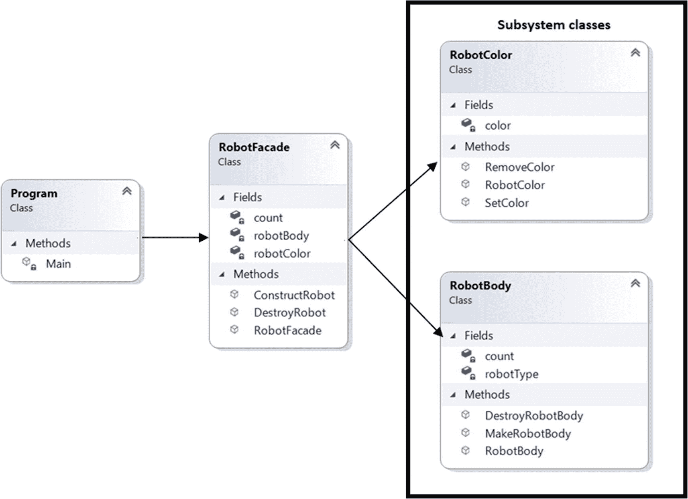
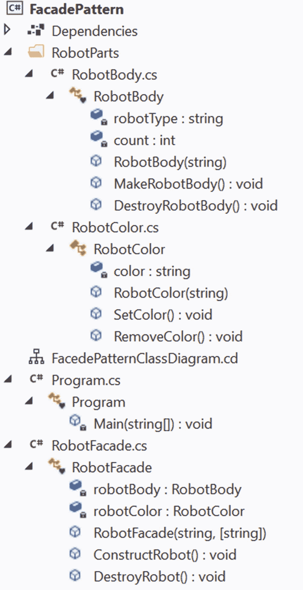

# 九、外观模式

本章涵盖了外观模式。

## GoF 定义

为子系统中的一组接口提供统一的接口。Facade 定义了一个更高级的接口，使得子系统更容易使用。

## 概念

这种模式支持松耦合。使用这种模式，您可以通过公开一个简单的接口来强调抽象并隐藏复杂的细节。

考虑一个简单的例子。假设在一个应用中，有多个类，每个类由多个方法组成。客户可以使用这些类中的方法组合来制作产品，但是他需要记住选择哪些类，哪些方法用于这些构造的调用序列。这没什么，但是如果这些产品之间有很多差异，客户的日子就不好过了。

为了克服这一点，Facade 模式很有用。它为客户提供了一个用户友好的界面，因为所有内在的复杂性都被隐藏起来了。因此，客户可以简单地专注于他需要做的事情。

## 真实世界的例子

假设你要举办一个有 300 名客人的生日聚会。现在，你可以雇佣一个聚会组织者，让他们知道聚会的类型、日期和时间、参加人数等关键信息。组织者会为您完成剩下的工作。你不需要考虑他们如何装饰聚会房间，他们如何管理食物，等等。

考虑另一个例子。假设客户向银行申请贷款。在这种情况下，客户只对贷款能不能批下来感兴趣；他不关心在后端进行的内部背景验证过程。

## 计算机世界的例子

想想当你使用一个库中的方法时(在编程语言的上下文中)。该方法在库中是如何实现的并不重要，您只需调用该方法以便于使用。下面的例子更清楚地说明了这一点。

## 履行

在这个例子中，一个客户可以请求得到不同种类的机器人和他喜欢的颜色。为了达到这个目的，只有两个类。第一个是`RobotBody`，制作机器人的身体。第二类是`RobotColor`，给机器人上色。

`RobotBody`有一个参数化的构造函数，有两个方法叫做`MakeRobotBody`和`DestroyRobotBody`。这些方法负责制造一个机器人和摧毁一个机器人。我用一个计数器来记录机器人的数量。如果系统中没有机器人，销毁请求将被忽略。如果您愿意，可以忽略计数器，将注意力完全集中在描述该模式重要方面的部分。现在我们来看看`RobotBody`级。

```cs
  class RobotBody
    {
        string robotType;
        /*
        * To keep a count of number of robots.
        * This operation is optional for you.
       */
        static int count = 0;
        public RobotBody(string robotType)
        {
            this.robotType = robotType;
        }
        public void MakeRobotBody()
        {
          Console.WriteLine($"Constructing one {robotType} robot.");
          Console.WriteLine("Robot creation finished.");
          Console.WriteLine($"Total number of robot created at this moment={++count}");
        }
        public void DestroyRobotBody()
        {
            if (count > 0)
            {
                --count;
                Console.WriteLine("Robot's destruction process is over.");
            }
            else
            {
                Console.WriteLine("All robots are destroyed.");
                Console.WriteLine("Color removal operation will not continue.");
            }
        }
    }

```

`RobotColor`很容易理解。它有一个参数化的构造函数和两个方法——`SetColor()`和`RemoveColor()`——来给机器人上色或从机器人身上移除颜料。下面的代码段是针对`RobotColor`的。

```cs
    public class RobotColor
    {
        string color;
        public RobotColor(string color)
        {
            this.color = color;
        }
        public void SetColor()
        {
            if (color == "steel")
            {
                Console.WriteLine($"The default color {color} is set for the robot.");
            }
            else
            {
                Console.WriteLine($"Painting the robot with your favourite {color} color.");
            }
        }
        public void RemoveColor()
        {
            Console.WriteLine("Attempting to remove the colors from the robot.");
        }
    }

```

现在是最重要的部分。您可以看到，客户端可以通过向对象`RobotBody`提供所需的字符串参数来创建机器人，调用`MakeRobotBody()` `,`，然后使用`RobotColor`类的`SetColor()`来绘制机器人。因此，可以使用下面几行。

```cs
// Without Facade pattern
RobotBody robotBody = new RobotBody("Milano");
robotBody.MakeRobotBody();
RobotColor robotColor = new RobotColor("green");
robotColor.SetColor();

```

但是，如果一个客户端有一个名为`RobotFacade`的类，并且像下面这样调用，会发生什么呢？

```cs
RobotFacade facade = new RobotFacade("Milano","green");
facade.ConstructRobot();

```

或者，你允许他像下面这样打电话(通过提供默认颜色)？

```cs
// Making a robonaut robot with default steel color.
facade = new RobotFacade("Robonaut");
facade.ConstructRobot();

```

你知道答案:客户会很高兴；在这些情况下，他不需要记住创建机器人的步骤。为了简单起见，示例中只使用了两个类，但是在现实世界中，您可能需要使用大量的类和方法来制作这样的产品。在这种情况下，Facade 模式更加强大。你可以告诉你的客户使用`RobotFacade`类来创建和销毁机器人，而不是像`RobotBody`和`RobotColor`那样调用每个类。

现在我们来看看`RobotFacade`。当我使用这个类的`ConstructRobot()`和`DestroyRobot()`方法时，我将`RobotBody`和`RobotColor`组合到其中，并将任务委托给相应的组件。从现在开始，`RobotBody`和`RobotColor`在这个例子中可以称为*子系统类*。

这里是门面类。

```cs
class RobotFacade
    {
        RobotBody robotBody;
        RobotColor robotColor;
        public RobotFacade(string robotType, string color = "steel")
        {
            robotBody = new RobotBody(robotType);
            robotColor = new RobotColor(color);
        }
        public void ConstructRobot()
        {
            Console.WriteLine("Robot creation through facade starts...");
            robotBody.MakeRobotBody();
            robotColor.SetColor();
            Console.WriteLine();
        }

        public void DestroyRobot()
        {
            Console.WriteLine("Making an attempt to destroy one robot using  the facade now.");
            robotColor.RemoveColor();
            robotBody.DestroyRobotBody();
            Console.WriteLine();
        }
    }

```

### 类图

图 [9-1](#Fig1) 显示了类图。



图 9-1

类图

### 解决方案资源管理器视图

图 [9-2](#Fig2) 显示了程序的高层结构。从 Solution Explorer 中，您可以看到，在较高的层次上，我将子系统类与外观类和客户端代码分离开来。子系统类放在 RobotParts 文件夹中。



图 9-2

解决方案资源管理器视图

### 示范

下面是完整的实现。

```cs
// RobotBody.cs

using System;

namespace FacadePattern.RobotParts
{
    class RobotBody
    {
        string robotType;
        /*
        * To keep a count of number of robots.
        * This operation is optional for you.
       */
        static int count = 0;
        public RobotBody(string robotType)
        {
            this.robotType = robotType;
        }
        public void MakeRobotBody()
        {
          Console.WriteLine($"Constructing one {robotType} robot.");
          Console.WriteLine("Robot creation finished.");
          Console.WriteLine($"Total number of robot created at this moment={++count}");
        }
        public void DestroyRobotBody()
        {
            if (count > 0)
            {
                --count;
                Console.WriteLine("Robot's destruction process is over.");
            }
            else
            {
                Console.WriteLine("All robots are destroyed.");
                Console.WriteLine("Color removal operation will not continue.");
            }
        }
    }
}

// RobotColor.cs

using System;

namespace FacadePattern.RobotParts
{
    public class RobotColor
    {
        string color;
        public RobotColor(string color)
        {
            this.color = color;
        }
        public void SetColor()
        {
            if (color == "steel")
            {
                Console.WriteLine($"The default color {color} is set for the robot.");
            }
            else
            {
                Console.WriteLine($"Painting the robot with your favourite {color} color.");
            }
        }
        public void RemoveColor()
        {
            Console.WriteLine("Attempting to remove the colors from the robot.");
        }
    }
}

 // RobotFacade.cs

using System;

namespace FacadePattern.RobotParts
{
    class RobotFacade
    {
        RobotBody robotBody;
        RobotColor robotColor;
        public RobotFacade(string robotType, string color = "steel")
        {
            robotBody = new RobotBody(robotType);
            robotColor = new RobotColor(color);
        }
        public void ConstructRobot()
        {
            Console.WriteLine("Robot creation through facade starts...");
            robotBody.MakeRobotBody();
            robotColor.SetColor();
            Console.WriteLine();
        }

        public void DestroyRobot()
        {
            Console.WriteLine("Making an attempt to destroy one robot using the facade now.");
            robotColor.RemoveColor();
            robotBody.DestroyRobotBody();
            Console.WriteLine();
        }
    }
}

 // Program.cs

using System;
using FacadePattern.RobotParts;

namespace FacadePattern
{
    class Program
    {
        static void Main(string[] args)
        {
            Console.WriteLine("***Facade Pattern Demo.***\n");
            // Making a Milano robot with green color.
            RobotFacade facade = new RobotFacade("Milano","green");
            facade.ConstructRobot();
            // Making a robonaut robot with default steel color.
            facade = new RobotFacade("Robonaut");
            facade.ConstructRobot();
            // Destroying one robot
            facade.DestroyRobot();
            // Destroying another robot
            facade.DestroyRobot();
            // This destrcution attempt should fail.
            facade.DestroyRobot();
            Console.ReadLine();

        }
    }
}

```

### 输出

这是输出。

```cs
***Facade Pattern Demo.***

Robot creation through facade starts...
Constructing one Milano robot.
Robot creation finished.
Total number of robot created at this moment=1
Painting the robot with your favourite green color.

Robot creation through facade starts...
Constructing one Robonaut robot.
Robot creation finished.
Total number of robot created at this moment=2
The default color steel is set for the robot.

Making an attempt to destroy one robot using the facade now.
Attempting to remove the colors from the robot.
Robot's destruction process is over.

Making an attempt to destroy one robot using the facade now.
Attempting to remove the colors from the robot.
Robot's destruction process is over.

Making an attempt to destroy one robot using the facade now.
Attempting to remove the colors from the robot.
All robots are destroyed.
Color removal operation will not continue.

```

## 问答环节

**9.1 使用 Facade 模式的关键** **优势** **有哪些？**

以下是一些优点。

*   如果您的系统由许多子系统组成，那么管理这些子系统就变得很困难，并且客户端发现很难与这些子系统中的每一个单独通信。在这种情况下，外观模式非常方便。您向客户呈现了一个简化的界面，而不是复杂的子系统。这种方法还通过将客户端代码与子系统分离来支持弱耦合。

*   它还可以帮助减少客户端需要处理的对象数量。

在这个例子中，facade 类使用了 **组合** **。有这个必要吗？**

是的。使用这种方法，您可以访问每个子系统中的预期方法。当我使用这个类的`ConstructRobot()`和`DestroyRobot()`方法时，我将任务委托给了相应的组件。

9.3 您现在可以直接访问每个子系统了吗？

是的，你可以。Facade 模式并不限制您这样做。在介绍 facade 类之前，我已经向您展示了这一点。但是在这种情况下，代码可能看起来很脏，并且您可能会失去与 Facade 模式相关的好处。在这个上下文中，您可以注意到，由于客户端可以直接访问子系统，所以它被称为透明外观。但是，当您限制这种使用并强制他们只能通过 RobotFacade 创建机器人时，您可以将 Facade 称为不透明 facade。

**9.4 Facade 与适配器设计模式** **有何不同？**

在适配器模式中，您试图改变一个接口，以便您的客户机看不到接口之间的任何差异。相比之下，Facade 模式简化了界面。它为客户端提供了一个简单的交互界面(而不是复杂的子系统)。

**9.5 一个** **复杂子系统** **应该只有一个门面。这是正确的吗？**

一点也不。您可以为特定子系统创建任意数量的外观。

**9.6 可以用 facade 添加新的东西或者附加代码吗？**

是的，你可以。您可以看到，在将调用委托给实际组件之前，我在`RobotFacade`类的`ConstructRobot()`中使用了下面一行代码。

```cs
Console.WriteLine("Robot creation through facade starts...");

```

同样的，`DestroyRobot()`在试图摧毁一个机器人之前，有如下一行。

```cs
Console.WriteLine("Making an attempt to destroy one robot using  the facade now.");

```

**9.7 与门面格局相关的** **挑战** **有哪些？**

这里有一些挑战。

*   子系统连接到外观层。因此，您需要关注额外的编码层(增加您的代码库)。

*   当子系统的内部结构发生变化时，您也需要将变化合并到外观层中。

*   一些开发人员可能需要了解这个新层，但是他们中的一些人知道如何有效地使用子系统/API。

9.8 我能让 facade 类成为静态的吗？

在许多例子中，只有一个 facade，您可能不需要初始化 facade 类。在这些情况下，如果让 facade 类成为静态的，就很有意义。