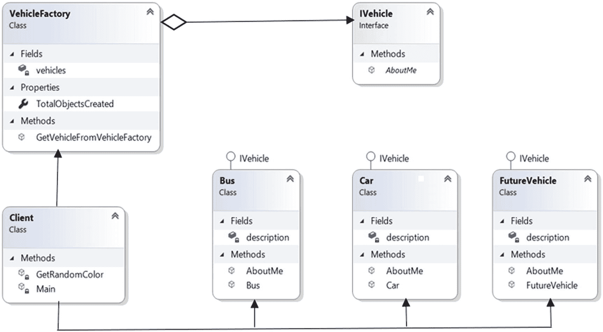
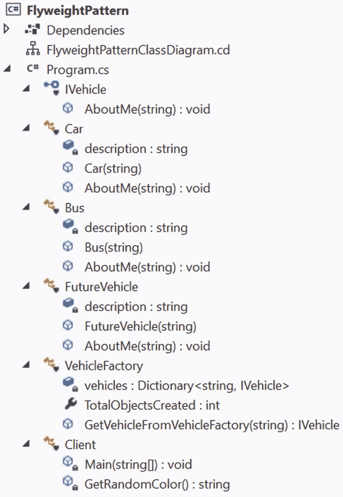
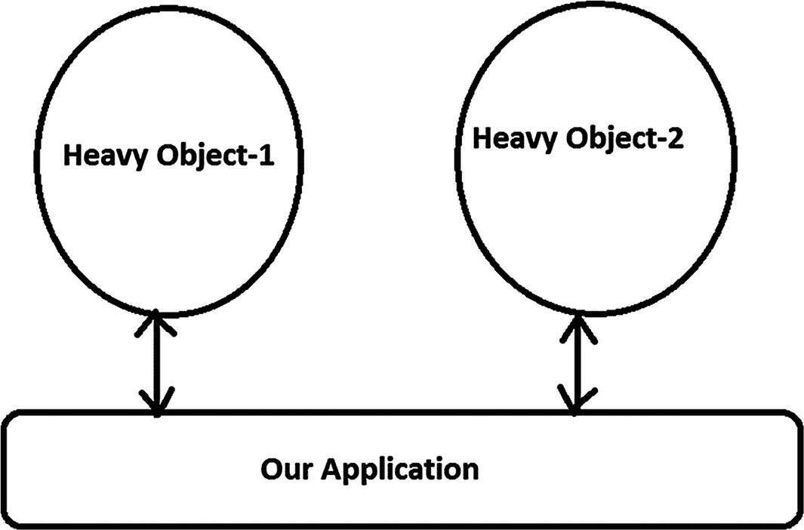
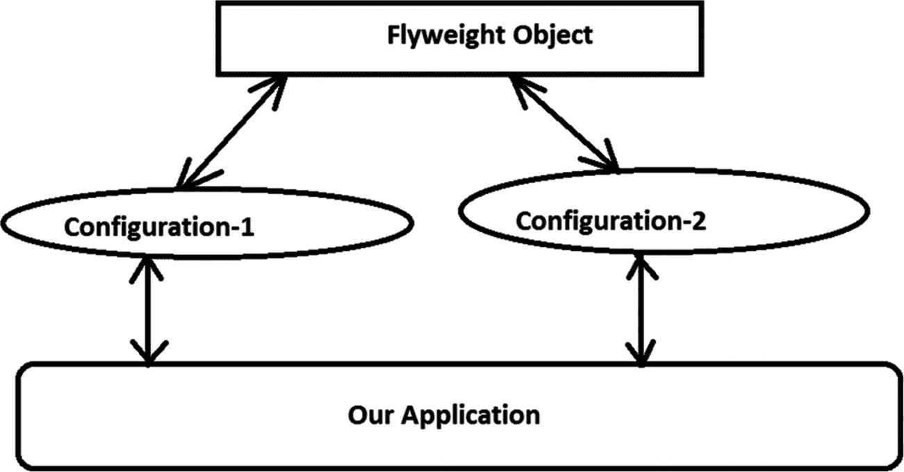

# 十、享元模式

这一章涵盖了 Flyweight 模式。

## GoF 定义

使用共享来有效地支持大量细粒度的对象。

## 概念

这种模式可能看起来很简单，但是如果您没有确定核心概念，实现可能会显得很复杂。在实现这个模式之前，让我们从一个基本但详细的解释开始。

有时你需要处理许多非常相似但又不完全相同的对象。限制是您不能创建所有的文件来减少资源和内存的使用。Flyweight 模式就是用来处理这些场景的。

现在的问题是如何去做？为了理解这一点，让我们快速回顾一下面向对象编程的基础。一个类是一个模板或蓝图，一个对象是它的一个实例。一个对象可以有状态和行为。例如，如果你熟悉足球(或在美国被称为*足球*，你可以说 Ronaldo 或 Beckham 是`Footballer`类的对象。您可能会注意到，它们有“播放状态”或“非播放状态”这样的状态在玩耍状态下，他们可以展示不同的技能(或行为)——他们可以跑，可以踢，可以传球，等等。从面向对象编程开始，您可以提出以下问题。

*   我的对象可能有哪些状态？

*   在这些状态下，它们可以执行哪些不同的功能(行为)？

一旦你得到了这些问题的答案，你就可以继续了。现在回到享元模式。在这里你的工作是识别。

*   我的对象的状态是什么？

*   这些状态的哪一部分是可以改变的？

一旦你确定了答案，你就把状态分成两部分，称为内在的(不变的)和外在的(会变的)。现在你明白了，如果你制造的对象具有所有对象都可以共享的内在状态。对于外在部分，用户或客户需要传递信息。所以，无论何时你需要一个对象，你都可以得到具有内在状态的对象，然后你可以通过传递外在状态来动态地配置对象。遵循这种技术，您可以减少不必要的对象创建和内存使用。

现在让我们在下面的段落中验证你的知识，这是极其重要的。让我们看看 GoF 对享元是怎么说的。

> *flyweight 是一个可以同时在多个上下文中使用的共享对象。在每个上下文中，flyweight 充当一个独立的对象——它与未共享的对象实例没有区别。Flyweights 不能对它们运行的环境做出假设。这里的关键概念是内在和外在状态之间的区别。内在状态存储在 flyweight 中；它由独立于 flyweight 上下文的信息组成，因此可以共享。外在状态依赖于 flyweight 的上下文并随其变化，因此不能共享。客户端对象负责在需要时将外部状态传递给 flyweight。*

## 真实世界的例子

假设你有一支笔。你可以用不同的墨水笔芯写不同的颜色。因此，在这个例子中，没有笔芯的笔可以被认为是具有内在数据的享元，而笔芯可以被认为是外在数据。

## 计算机世界的例子

假设在一个电脑游戏中，你有大量的参与者，他们的核心结构是相同的，但他们的外观各不相同(例如，他们可能有不同的状态、颜色、武器等等)。因此，如果你想存储所有具有所有变化/状态的对象，内存需求将是巨大的。因此，不需要存储所有的对象，您可以用这样一种方式设计应用，即您创建这些实例中的一个，这些实例的状态在对象之间没有变化，并且您的客户端可以维护剩余的变化/状态。如果您能够在设计阶段成功地实现这个概念，那么您已经在应用中遵循了 Flyweight 模式。

考虑另一个例子。假设一家公司需要为员工打印名片。在这种情况下，出发点是什么？企业可以创建一个通用模板，在该模板上已经打印了公司徽标、地址等(内部)，然后公司将特定员工的信息(外部)放在卡片上。

这种模式的另一个常见用途是在文字处理程序中用图形表示字符，或者在应用中处理字符串时使用。

## 履行

下面的例子展示了三种不同类型车辆的用法:`Car`、`Bus,`、`FutureVehicle`(我假设 2050 年使用)。在这个应用中，我假设客户可能想要使用这些类中的大量对象，这些对象具有他们喜欢的不同颜色。我还假设汽车(或公共汽车等)的基本结构。)不变。

当客户端请求特定的车辆时，如果应用先前创建了该类型车辆的实例，则它不会从头开始创建对象；相反，它会准备好现有的(没有`color`)来满足他的需求。就在交付产品之前，它会给车辆涂上客户喜欢的`color`。现在让我们看看实现策略。

首先，为 flyweights 创建一个接口。这个接口提供了接受 flyweights 的外部状态的通用方法。在我们的例子中，`color`是由客户提供的；因此，这被视为一种外在状态，这就是为什么你会看到下面的代码段。

```cs
/// <summary>
/// The 'Flyweight' interface
/// </summary>
interface IVehicle
    {
        /*
         * Client will supply the color.
         * It is extrinsic state.
         */
        void AboutMe(string color);
    }

```

最常见的情况是，你看到一个工厂为客户提供飞锤。这个工厂缓存 flyweights 并提供获取它们的方法。在一个共享的 flyweight 对象中，如果需要的话，可以添加内部状态并实现方法。你也可以有不共享的飞锤。在这些情况下，您可以忽略客户端传递的外部状态。

在接下来的例子中，`VehicleFactory`是为 flyweights 提供内在状态的工厂。一个`Dictionary`对象存储`key/value`对以存储特定类型的车辆。最初，工厂内部没有对象，但是一旦它开始接收车辆请求，它就创建车辆并缓存这些车辆以备将来使用。请注意，“创建一辆汽车”、“创建一辆公共汽车”和“创建 2050 辆汽车”是在对象创建阶段由工厂在 flyweight 对象中提供的。这些是这些车辆的固有状态，不会因产品而异。下面的代码段显示了这个工厂类。

```cs
/// <summary>
/// The factory class for flyweights.
/// </summary>
class VehicleFactory
{
    private Dictionary<string, IVehicle> vehicles = new Dictionary<string, IVehicle>();
    public int TotalObjectsCreated
    {
        get { return vehicles.Count; }
    }

    public IVehicle GetVehicleFromVehicleFactory(string vehicleType)
    {
        IVehicle vehicleCategory = null;
        if (vehicles.ContainsKey(vehicleType))
        {
               vehicleCategory = vehicles[vehicleType];

            }
            else
            {
                switch (vehicleType)
                {
                    case "car":
                        vehicleCategory = new Car("One car is created");
                        vehicles.Add("car", vehicleCategory);
                        break;
                    case "bus":
                        vehicleCategory = new Bus("One bus is created");
                        vehicles.Add("bus", vehicleCategory);
                        break;
                    case "future":
                        vehicleCategory = new FutureVehicle("Vehicle 2050 is created");
                        vehicles.Add("future", vehicleCategory);
                        break;
                    default:
                        throw new Exception("Vehicle Factory can give you cars and buses only.");
                }

            }
            return vehicleCategory;
        }
    }

```

现在让我们来看一个具体的享元类。下面是其中的一个类(其他的都差不多)。相关注释帮助您理解`AboutMe()`方法如何包含车辆的内在状态和外在状态。

```cs
    /// <summary>
    /// A 'ConcreteFlyweight' class called Car
    /// </summary>
    class Car : IVehicle
    {
        /*
         * It is intrinsic state and
         * it is independent of flyweight context.
         * this can be shared.So, our factory method will supply
         * this value inside the flyweight object.
         */
        private string description;
        /*
         * Flyweight factory will supply this
         * inside the flyweight object.
         */
        public Car(string description)
        {
            this.description = description;
        }
        // Client will supply the color
        public void AboutMe(string color)
        {
            Console.WriteLine($"{description} with {color} color.");
        }
    }

```

从这段代码中，您可以看到,`description`是在对象创建过程中提供的(Flyweight 工厂会这样做),但是`color`是由客户端提供的。在这个例子中，我使用一种叫做`GetRandomColor()`的方法随机绘制颜色。因此，在`Main()`中，您会看到下面的代码:

```cs
vehicle.AboutMe(GetRandomColor());

```

只读属性`TotalObjectsCreated`计算任意给定时刻不同类型的车辆；在工厂类中理解下面的代码是非常容易的。

```cs
public int TotalObjectsCreated
{
        get
        {
            return vehicles.Count;
        }
}

```

最后，在这个例子中，`FutureVehicle`被认为是一个非共享的 flyweight。所以，在这个类中，`AboutMe(...)`方法忽略了`string`参数。因此，它总是生产蓝色的车辆，并忽略客户的喜好。

```cs
// Client cannot choose color for FutureVehicle
//since it's unshared flyweight,ignoring client's input
     public void AboutMe(string color)
     {
         Console.WriteLine($"{description} with blue color.");
     }

```

### 类图

图 [10-1](#Fig1) 为类图。



图 10-1

类图

### 解决方案资源管理器视图

图 [10-2](#Fig2) 显示了程序各部分的高层结构。



图 10-2

解决方案资源管理器视图

### 演示 1

下面是完整的实现。参考评论帮助你更好的理解。

```cs
using System;
using System.Collections.Generic;//Dictionary is used here

namespace FlyweightPattern
{
    /// <summary>
    /// The 'Flyweight' interface
    /// </summary>
    interface IVehicle
    {
        /*
         * Client will supply the color.
         * It is extrinsic state.
         */
        void AboutMe(string color);
    }
    /// <summary>
    /// A 'ConcreteFlyweight' class called Car
    /// </summary>
    class Car : IVehicle
    {
        /*
         * It is intrinsic state and
         * it is independent of flyweight context.
         * this can be shared.So, our factory method will supply
         * this value inside the flyweight object.
         */
        private string description;
        /*
         * Flyweight factory will supply this
         * inside the flyweight object.
         */
        public Car(string description)
        {
            this.description = description;
        }
        // Client will supply the color
        public void AboutMe(string color)
        {
            Console.WriteLine($"{description} with {color} color.");
        }
    }
    /// <summary>
    /// A 'ConcreteFlyweight' class called Bus
    /// </summary>
    class Bus : IVehicle
    {
        /*
         * It is intrinsic state and
         * it is independent of flyweight context.
         * this can be shared.So, our factory method will supply
         * this value inside the flyweight object.
         */
        private string description;
        public Bus(string description)
        {
            this.description = description;
        }
        // Client will supply the color
        public void AboutMe(string color)
        {
            Console.WriteLine($"{description} with {color} color.");
        }
    }
    /// <summary>
    /// A 'ConcreteFlyweight' class called FutureVehicle
    /// </summary>
    class FutureVehicle : IVehicle
    {
        /*
         * It is intrinsic state and
         * it is independent of flyweight context.
         * this can be shared.So, our factory method will supply
         * this value inside the flyweight object.
         */
        private string description;
        public FutureVehicle(string description)
        {
            this.description = description;
        }
        // Client cannot choose color for FutureVehicle
        // since it's unshared flyweight,ignoring client's input
        public void AboutMe(string color)
        {
            Console.WriteLine($"{description} with blue color.");
        }
    }

    /// <summary>
    /// The factory class for flyweights.
    /// </summary>
    class VehicleFactory
    {
        private Dictionary<string, IVehicle> vehicles = new Dictionary<string, IVehicle>();
         /*
          * To count different types of vehicles
          * in a given moment.
          */
        public int TotalObjectsCreated
        {
            get
            {
                return vehicles.Count;
            }
        }
        public IVehicle GetVehicleFromVehicleFactory(string vehicleType)
        {
            IVehicle vehicleCategory = null;
            if (vehicles.ContainsKey(vehicleType))
            {
                vehicleCategory = vehicles[vehicleType];
            }
            else
            {
                switch (vehicleType)
                {
                    case "car":
                        vehicleCategory = new Car("One car is created");
                        vehicles.Add("car", vehicleCategory);
                        break;
                    case "bus":
                        vehicleCategory = new Bus("One bus is created");
                        vehicles.Add("bus", vehicleCategory);
                        break;
                    case "future":
                        vehicleCategory = new FutureVehicle("Vehicle 2050 is created");
                        vehicles.Add("future", vehicleCategory);
                        break;
                    default:
                        throw new Exception("Vehicle Factory can give you cars and buses only.");
                }
            }
            return vehicleCategory;
        }
    }

    class Client
    {
        static void Main(string[] args)
        {
            Console.WriteLine("***Flyweight Pattern Demo.***\n");
            VehicleFactory vehiclefactory = new VehicleFactory();
            IVehicle vehicle;
            /*
            * Now we are trying to get the 3 cars. Note that:we need not create additional cars if we have already created one of this category.
            */
            for (int i = 0; i < 3; i++)
            {
                vehicle = vehiclefactory.GetVehicleFromVehicleFactory("car");
                vehicle.AboutMe(GetRandomColor());
            }
            int numOfDistinctRobots = vehiclefactory.TotalObjectsCreated;
            Console.WriteLine($"\n Now, total numbers of distinct vehicle object(s) is = {numOfDistinctRobots}\n");
            /*
            Here we are trying to get the 5 more buses.Note that: we need not create additional buses if we have already created one of this category.
            */

            for (int i = 0; i < 5; i++)
            {
                vehicle = vehiclefactory.GetVehicleFromVehicleFactory("bus");
                vehicle.AboutMe(GetRandomColor());
            }
            numOfDistinctRobots = vehiclefactory.TotalObjectsCreated;
            Console.WriteLine($"\n Now, total numbers of distinct vehicle object(s) is = {numOfDistinctRobots}\n");
            /*
             Here we are trying to get the 2 future vehicles.Note that: we need not create additional future vehicle if we have already created one of this category.
             */
            for (int i = 0; i < 2; i++)
            {
                vehicle = vehiclefactory.GetVehicleFromVehicleFactory("future");
                vehicle.AboutMe(GetRandomColor());
            }
            numOfDistinctRobots = vehiclefactory.TotalObjectsCreated;
            Console.WriteLine($"\n Now, total numbers of distinct vehicle object(s) is = {numOfDistinctRobots}\n");
            Console.ReadKey();
        }

        private static string GetRandomColor()
        {
            Random r = new Random();
            /*
             You can supply any number of your choice in nextInt argument.we are simply checking the random number generated is an even number or an odd number. And based on that we are choosing the color. For simplicity, we'll use only two colors-red and green.
             */
            int random = r.Next(100);
            if (random % 2 == 0)
            {
                return "red";
            }
            else
            {
                return "green";
            }
        }
    }
}

```

### 输出

下面是一个可能的输出(因为`color`是随机生成的)。这是在我的机器上第一次运行的时候。

```cs
***Flyweight Pattern Demo.***

One car is created with green color.
One car is created with red color.
One car is created with green color.

 Now, total numbers of distinct vehicle object(s) is = 1

One bus is created with green color.
One bus is created with red color.
One bus is created with green color.
One bus is created with red color.
One bus is created with red color.

 Now, total numbers of distinct vehicle object(s) is = 2

Vehicle 2050 is created with blue color.
Vehicle 2050 is created with blue color.

 Now, total numbers of distinct vehicle object(s) is = 3

```

这是另一个可能的输出。这是我的机器第二次运行的结果。

```cs
***Flyweight Pattern Demo.***

One car is created with red color.
One car is created with red color.
One car is created with red color.

 Now, total numbers of distinct vehicle object(s) is = 1

One bus is created with red color.
One bus is created with green color.
One bus is created with red color.
One bus is created with green color.
One bus is created with red color.

 Now, total numbers of distinct vehicle object(s) is = 2

Vehicle 2050 is created with blue color.
Vehicle 2050 is created with blue color.

 Now, total numbers of distinct vehicle object(s) is = 3

```

Note

输出会有变化，因为在这个例子中我随机选择了颜色。

### 分析

当且仅当对象当时不可用时，应用才创建对象。此后，它将缓存该对象以供将来重用。

## 问答环节

你能指出单例模式 **和享元模式的主要区别吗？**

Singleton 帮助你最多维护一个系统中需要的对象。换句话说，一旦创建了所需的对象，就不能再创建更多的对象了。您需要重用现有的对象。

Flyweight 模式通常与重但相似的对象(其中状态不相同)有关，因为它们可能会占用大量内存。因此，您尝试创建一个较小的模板对象集，可以动态地配置这些模板对象来制作这些重对象。这些更小的可配置对象被称为享元对象。当您处理许多大型对象时，可以在应用中重用它们。这种方法有助于减少大块内存的消耗。基本上，flyweight 使一个*看起来像许多*，这就是为什么 GoF 声明:“一个 flyweight 是一个共享对象，可以同时在多个上下文中使用。flyweight 在每个上下文中都是一个独立的对象——它与未共享的对象实例没有什么区别。”

图 [10-3](#Fig3) 向你展示了在使用 Flyweight 之前，如何可视化 Flyweight 模式的核心概念。



图 10-3

在使用飞锤之前

图 [10-4](#Fig4) 显示了使用飞锤后的设计。



图 10-4

使用飞锤后

因此，从图 [10-4](#Fig4) 中，你可以看到当我们将配置-1 应用于 Flyweight 对象时，创建了 Heavy-Object1，同样，当我们将配置-2 应用于 Flyweight 对象时，创建了 Heavy-Object2。您可以看到，特定于实例的内容(如我们的演示 1 中的颜色)可以传递给 flyweights 来生成这些重对象。在这个例子中，flyweight 对象就像一个公共模板，可以根据需要进行配置。

**10.2****多线程** **有什么影响？**

如果在多线程环境中使用 new 运算符创建对象，最终可能会创建多个不需要的对象。这类似于单例模式，补救措施也类似。

**10.3 使用 Flyweight 设计模式有什么好处？**

以下是一些优点。

*   您可以减少可同等控制的重物的内存消耗。

*   您可以减少系统中的对象总数。

*   您可以维护许多“虚拟”对象的集中状态。

**10.4 使用 Flyweight 设计模式的相关挑战是什么？**

这里有一些挑战。

*   在这种模式中，您需要花一些时间来配置这些 flyweights。这些配置时间会影响应用的整体性能。

*   要创建 flyweights，您需要从现有对象中提取一个公共模板类。这个额外的编程层可能很棘手，有时很难调试和维护。

**10.5 能不能有一个** **不可共享的 flyweight 接口** **？**

是的，flyweight 接口并不强制要求它总是可共享的。因此，在某些情况下，您可能有不可共享的 flyweight，具体的 flyweight 对象作为子对象。在演示 1 中，FutureVehicle 就是为此而生的。你可以看到它总是由蓝色组成，对于这辆车，无论客户提供什么颜色(红色或绿色)作为外在状态都没有关系。

**10.6 既然 flyweights 的** **内在数据** **相同，可以试着分享一下。这是正确的吗？**

是的。请注意，“创建一辆汽车”、“创建一辆公共汽车”和“创建 2050 辆汽车”是由工厂在 flyweight(具有内在状态)对象创建阶段在 flyweight 内部提供的。

**10.7 客户如何处理这些蝇量级的** **外来数据** **？**

当他们需要使用这个概念时，他们需要将这些信息(状态)传递给 flyweights。

**10.8 外部数据不可共享。这是正确的吗？**

是的。在实现这个模式之前，理解它是非常重要的。

**10.9****车辆厂** **在此次实施中的作用是什么？**

它缓存了 flyweights，并提供了获取它们的方法。在本例中，有多个具有内在状态的对象可以共享。因此，将它们存放在一个中心位置总是一个好主意。

10.10 我可以将工厂类作为单例实现吗？

是的，你可以。事实上，在很多应用中，你可能会看到这一点。演示 2 描述了它。

### 演示 2

在这个例子中，`VehicleFactory`工厂类是作为单例实现的。因此，您可以用下面的代码替换演示 1 中的工厂类。

```cs
/// <summary>
/// The factory class for flyweights implemented as singleton.
/// </summary>
class VehicleFactory
{
    private static readonly VehicleFactory Instance = new VehicleFactory();
        private Dictionary<string, IVehicle> vehicles = new Dictionary<string, IVehicle>();

        private VehicleFactory()
        {
          vehicles.Add("car", new Car("One car is created"));
          vehicles.Add("bus", new Bus("One bus is created"));
          vehicles.Add("future", new FutureVehicle("Vehicle 2050 is created"));
        }
        public static VehicleFactory GetInstance
        {
            get
            {
                return Instance;
            }
        }
        /*
        * To count different types of vehicles
        * in a given moment.
        */
        public int TotalObjectsCreated
        {
            get
            {
                return vehicles.Count;
            }
        }

        public IVehicle GetVehicleFromVehicleFactory(string vehicleType)
        {
            IVehicle vehicleCategory = null;
            if (vehicles.ContainsKey(vehicleType))
            {
                vehicleCategory = vehicles[vehicleType];
                return vehicleCategory;
            }
            else
            {
               throw new Exception("Currently, the vehicle factory can have cars and buses only.");
            }
        }
    }

```

现在，在客户端代码中，您需要使用新的代码行来适应前面的更改，而不是使用下面的代码行(它被注释掉了)。

```cs
//VehicleFactory vehiclefactory = new VehicleFactory();
VehicleFactory vehiclefactory = VehicleFactory.GetInstance;

```

### 输出

当您使用这些新代码段运行应用时，您可能会得到(因为颜色是随机生成的)如下所示的输出。

```cs
***Flyweight Pattern Demo.***

One car is created with red color.
One car is created  with red color.
One car is created with red color.

 Now, total numbers of distinct vehicle object(s) is = 3

One bus is created with green color.
One bus is created with green color.
One bus is created with green color.
One bus is created with red color.
One bus is created with red color.

 Now, total numbers of distinct vehicle object(s) is = 3

Vehicle 2050 is created with blue color.
Vehicle 2050 is created with blue color.

 Now, total numbers of distinct vehicle object(s) is = 3

```

### 分析

注意，在这个实现中，我在开始时在构造函数中初始化了所有不同类型的车辆。因此，我一开始就使用了三个不同的车辆对象。因此，如果 2050 年我不需要任何公共汽车、汽车或交通工具，我就为这些对象浪费了内存。相反，在演示 1 中，如果这些对象中有任何一个不可用，那么工厂类会创建它并缓存它以备将来使用。所以，我投票支持演示 1，除非你修改演示 2，记住这个潜在的缺点。简而言之，无论何时使用这种模式，都要创建一个对象，填充所有必需的状态信息，并将其提供给客户机。每次客户端请求一个对象时，你的应用应该检查它是否可以重用一个现有的对象(填充了所需的状态);从而减少不必要的对象创建并节省内存消耗。

微软表示， [`Intern`](https://docs.microsoft.com/en-us/dotnet/api/system.string.intern%253Fview%253Dnetframework-4.8) 方法使用 intern 池来搜索与字符串值相等的字符串。如果存在这样的字符串，则返回它在实习生池中的引用；否则，将对该字符串的引用添加到实习生池，然后返回该引用。英寸 NET Core 3.1，我执行下面这段代码的时候，`firstString`和`thirdString`都是指同一个字符串。结果，这段代码的最后一行返回 True，而当您比较`firstString`和`secondString`时，情况并非如此，因为它们引用的是不同的对象。

```cs
#region test for in-built flyweight pattern
string firstString = "A simple string";
string secondString = new StringBuilder().Append("A").Append(" simple").Append(" string").ToString();
string thirdString = String.Intern(secondString);
// Different references.
Console.WriteLine((Object)secondString == (Object)firstString);
// Same reference.
Console.WriteLine((Object)thirdString == (Object)firstString);
#endregion

```

所以，你可以说。NET Core 3.1 遵循 Flyweight 模式。