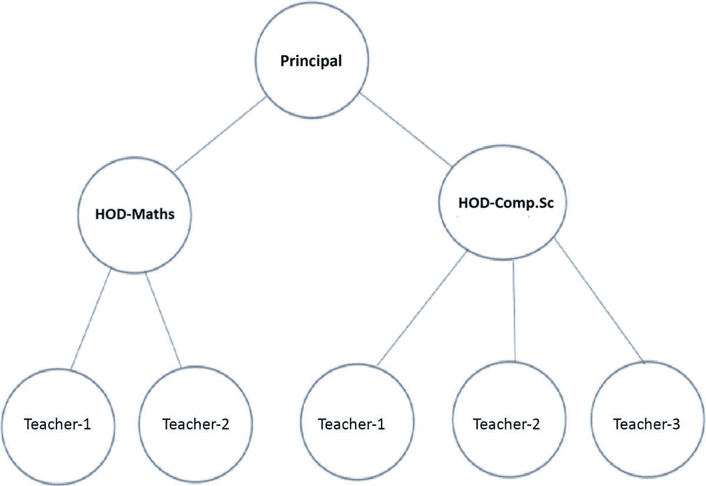
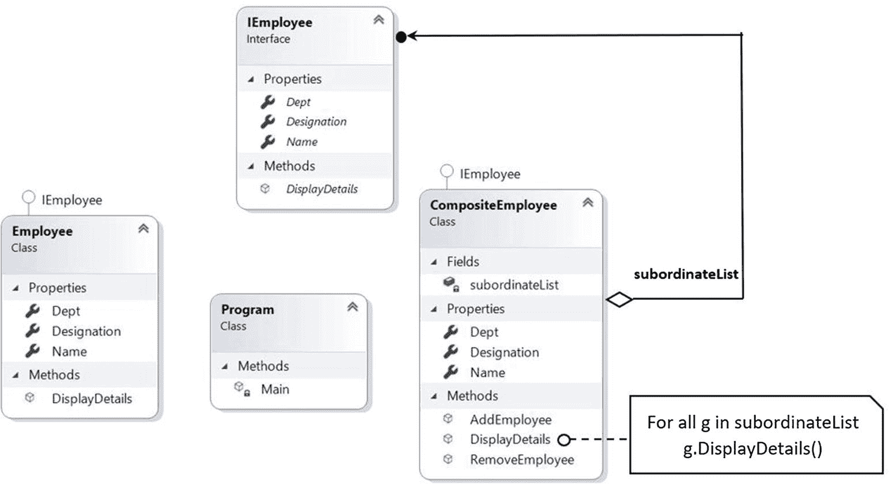
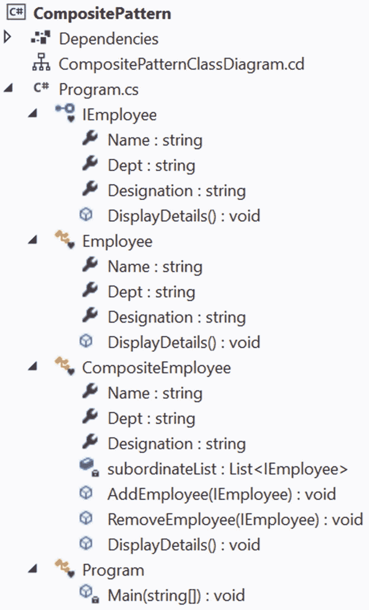

# 十一、组合模式

本章涵盖了组合模式。

## GoF 定义

将对象组成树结构来表示部分-整体层次结构。Composite 允许客户端统一处理单个对象和对象的组合。

## 概念

考虑一家出售不同种类干果的商店，如腰果、枣和核桃。这些物品都有一定的价格。让我们假设你可以购买这些单独的物品中的任何一种，或者你可以购买由不同的干果物品组成的“礼品包”(或盒装物品)。在这种情况下，数据包的开销是其组成部分的总和。组合模式在类似的情况下很有用，在这种情况下，您以相同的方式处理单个部分和部分的组合，以便可以统一处理它们。

这种模式对于表示对象的部分-整体层次结构很有用。在面向对象编程中，组合对象是由一个或多个相似对象组成的对象，其中每个对象都具有相似的功能。(这也称为对象之间的“有-有”关系。)这种模式在树结构数据中很常见，当您在这样的数据结构中实现这种模式时，您不需要区分树的分支和叶节点。因此，您可以使用该模式实现这两个关键目标。

*   您可以将对象组合成一个树形结构，以代表部分整体层次结构。

*   您可以统一访问组合对象(分支)和单个对象(叶节点)。因此，您可以降低代码的复杂性，并使应用不容易出错。

## 真实世界的例子

除了我们前面的例子，你还可以想到一个由许多部门组成的组织。一般来说，一个组织有很多员工。这些雇员中的一些被分组以形成一个部门，这些部门可以被进一步分组以构建组织的高层结构。

## 计算机世界的例子

我提到过树数据结构可以遵循这个概念，其中客户端可以以相同的方式处理树叶和非树叶(或树枝)。所以，当你看到一个分层的数据时，你可以得到一个线索，组合模式可能是有用的。XML 文件是这种树结构的常见例子。

Note

当你遍历树时，你经常会用到迭代器设计模式的概念，这将在第 [18](18.html) 章中介绍。

## 履行

在这个例子中，我代表一个大学组织。假设有一个校长和两个系主任(hod)，一个是计算机科学与工程(CSE)，一个是数学(Math)。假设在数学系，目前有两个讲师(或老师)，在计算机科学与工程系，有三个讲师(老师)。该组织的树形结构如图 [11-1](#Fig1) 所示。



图 11-1

一个大学组织，有一名校长、两名主任和五名讲师/教师

我们还假设在年底，CSE 部门的一名讲师提交了辞呈。以下示例考虑了提到的所有场景。

### 类图

图 [11-2](#Fig2) 显示了类图。



图 11-2

类图

### 解决方案资源管理器视图

图 [11-3](#Fig3) 显示了程序的高层结构。



图 11-3

解决方案资源管理器视图

### 示范

该演示以树形结构为特色。`IEmployee`是一个接口，有三个读写属性和一个叫做`DisplayDetails()`的方法。看起来是这样的。

```cs
interface IEmployee
    {
        // To set an employee name
        string Name { get; set; }
        // To set an employee department
        string Dept { get; set; }
        // To set an employee designation
        string Designation { get; set; }
        // To display an employee details
        void DisplayDetails();
    }

```

从相关的注释中，很容易理解这三个属性设置了雇员的姓名、对应的部门和职务。`Employee`和`CompositeEmployee`具体类实现了这个接口。`Employee`班级(讲师)充当一个叶节点，另一个是非叶节点。一个或多个员工可以向一个部门主管报告。因此，它被视为非叶(或分支)节点。同样，所有的 hod 都向校长报告。所以，`Principal`是另一个非叶节点。

数学讲师名叫 m .乔伊和 m .鲁尼。CSE 的老师被命名为 c .萨姆，c .琼斯和 c .马里乌姆。这些讲师不监督任何人，所以他们被视为叶节点。

`CompositeEmployee`类维护一个列表和另外两个名为`AddEmployee(...)`和`RemoveEmployee(...)`的方法。这些方法向列表中添加雇员或从列表中删除雇员。

现在浏览完整的实现，并参考支持性的评论。

```cs
using System;
/* For List<Employee> using
 * the following namespace.
 */
using System.Collections.Generic;

namespace CompositePattern
{
    interface IEmployee
    {
        // To set an employee name
        string Name { get; set; }
        // To set an employee department
        string Dept { get; set; }
        // To set an employee designation
        string Designation { get; set; }
        // To display an employee details
        void DisplayDetails();
    }
    // Leaf node
    class Employee : IEmployee
    {
        public string Name { get; set; }
        public string Dept { get; set; }
        public string Designation { get; set; }
        // Details of a leaf node
        public void DisplayDetails()
        {
            Console.WriteLine($"\t{Name} works in { Dept} department.Designation:{Designation}");
        }
    }
    // Non-leaf node
    class CompositeEmployee : IEmployee
    {
        public string Name { get; set; }
        public string Dept { get; set; }
        public string Designation { get; set; }

        // The container for child objects
        private List<IEmployee> subordinateList = new List<IEmployee>();

        // To add an employee
        public void AddEmployee(IEmployee e)
        {
            subordinateList.Add(e);
        }

        // To remove an employee
        public void RemoveEmployee(IEmployee e)
        {
            subordinateList.Remove(e);
        }

        // Details of a composite node
        public void DisplayDetails()
        {
            Console.WriteLine($"\n{Name} works in {Dept} department.Designation:{Designation}");
            foreach (IEmployee e in subordinateList)
            {
                e.DisplayDetails();
            }
        }
    }

    class Program
    {
        static void Main(string[] args)
        {
            Console.WriteLine("***Composite Pattern Demo. ***");

            #region Mathematics department
            // 2 lecturers work in Mathematics department
            Employee mathTeacher1 = new Employee { Name = "M.Joy", Dept = "Mathematic", Designation = "Lecturer" };
            Employee mathTeacher2 = new Employee { Name = "M.Roony", Dept = "Mathematics", Designation = "Lecturer" };

            // The college has a Head of Department in Mathematics
            CompositeEmployee hodMaths = new CompositeEmployee { Name = "Mrs.S.Das", Dept = "Maths", Designation = "HOD-Maths" };

            // Lecturers of Mathematics directly reports to HOD-Maths
            hodMaths.AddEmployee(mathTeacher1);
            hodMaths.AddEmployee(mathTeacher2);
            #endregion

            #region Computer Science department
            // 3 lecturers work in Computer Sc. department
            Employee cseTeacher1 = new Employee { Name = "C.Sam", Dept = "Computer Science", Designation = "Lecturer" };
            Employee cseTeacher2 = new Employee { Name = "C.Jones", Dept = "Computer Science.", Designation = "Lecturer" };
            Employee cseTeacher3 = new Employee { Name = "C.Marium", Dept = "Computer Science", Designation = "Lecturer" };

            // The college has a Head of Department in Computer science
            CompositeEmployee hodCompSc = new CompositeEmployee { Name = "Mr. V.Sarcar", Dept = "Computer Sc.", Designation = "HOD-Computer Sc." };

            /* Lecturers of Computer Sc. directly reports to HOD-CSE */
            hodCompSc.AddEmployee(cseTeacher1);
            hodCompSc.AddEmployee(cseTeacher2);
            hodCompSc.AddEmployee(cseTeacher3);
            #endregion

            #region Top level management
            // The college also has a Principal
            CompositeEmployee principal = new CompositeEmployee { Name = "Dr.S.Som", Dept = "Planning-Supervising-Managing", Designation = "Principal" };

            /* Head of Departments's of Maths and Computer Science directly reports to Principal.*/
            principal.AddEmployee(hodMaths);
            principal.AddEmployee(hodCompSc);
            #endregion

            /*
             * Printing the leaf-nodes and branches in the same way. i.e. in each case, we are calling DisplayDetails() method.
             */
            Console.WriteLine("\nDetails of a Principal object is as follows:");
            // Prints the complete structure
            principal.DisplayDetails();

            Console.WriteLine("\nDetails of a HOD object is as follows:");
            /* Prints the details of Computer Science department */
            hodCompSc.DisplayDetails();

            // Leaf node
            Console.WriteLine("\nDetails of an individual employee(leaf node) is as follows:");
            mathTeacher1.DisplayDetails();

            /*
             * Suppose, one Computer Science lecturer(C.Jones)
             * is leaving now from the organization.
             */
            hodCompSc.RemoveEmployee(cseTeacher2);
            Console.WriteLine("\nAfter the resignation of C.Jones, the organization has the following members:");
            principal.DisplayDetails();
            // Wait for user
            Console.ReadKey();
        }
    }
}

```

### 输出

这是输出。

```cs
***Composite Pattern Demo. ***

Details of a Principal object is as follows:

Dr. S.Som works in Planning-Supervising-Managing department.Designation:Principal

Mrs. S.Das works in Maths department.Designation:HOD-Maths
        M.Joy works in Mathematic department.Designation:Lecturer
        M.Roony works in Mathematics department.Designation:Lecturer

Mr. V.Sarcar works in Computer Sc. department.Designation:HOD-Computer Sc.
        C.Sam works in Computer Science department.Designation:Lecturer
        C.Jones works in Computer Science. department.Designation:Lecturer
        C.Marium works in Computer Science department.Designation:Lecturer

Details of a HOD object is as follows:

Mr. V.Sarcar works in Computer Sc. department.Designation:HOD-Computer Sc.
        C.Sam works in Computer Science department.Designation:Lecturer
        C.Jones works in Computer Science. department.Designation:Lecturer
        C.Marium works in Computer Science department.Designation:Lecturer

Details of an individual employee(leaf node) is as follows:
        M.Joy works in Mathematic department.Designation:Lecturer

After the resignation of C.Jones, the organization has the following members:

Dr. S.Som works in Planning-Supervising-Managing department.Designation:Principal

Mrs. S.Das works in Maths department.Designation:HOD-Maths
        M.Joy works in Mathematic department.Designation:Lecturer
        M.Roony works in Mathematics department.Designation:Lecturer

Mr. V.Sarcar works in Computer Sc. department.Designation:HOD-Computer Sc.
        C.Sam works in Computer Science department.Designation:Lecturer
        C.Marium works in Computer Science department.Designation:Lecturer

```

## 问答环节

11.1 使用组合设计模式的优势是什么？

以下是一些优点。

*   在树状结构中，您可以统一处理组合对象(分支节点)和单个对象(叶节点)。在这个例子中，我使用了一个名为`DisplayDetails`的常用方法来打印组合对象结构(校长或部门领导)和单个对象(讲师)。

*   使用这种设计模式实现部分-整体层次结构是很常见的。

*   您可以轻松地向架构中添加新的组件，或者从架构中删除现有的组件。

11.2 使用组合设计模式有哪些挑战？

以下是一些缺点。

*   如果您想要保持子节点的顺序(例如，如果解析树被表示为组件)，您可能需要特别小心。

*   如果您正在处理不可变的对象，您不能删除它们。

*   您可以轻松地添加新组件，但是经过一段时间后，维护可能会很困难。有时，您可能想要处理具有特殊组件的组合材料。这种约束可能会导致额外的开发成本，因为您可能需要实现一个动态检查机制来支持这个概念。

**11.3 在这个例子中，你使用了一个列表** **数据结构** **。其他数据结构可以用吗？**

绝对的。没有放之四海而皆准的规则。您可以自由使用您喜欢的数据结构。GoF 还确认了没有必要使用通用数据结构。

如何将 **迭代器设计模式** **连接到组合设计模式？**

在这个例子中，如果您想要检查一个组合对象架构，您可能需要迭代对象。此外，如果您想对一些分支执行一些特殊的活动，您可能需要迭代它的叶节点和非叶节点。

**11.5 在你的实现中，在这个界面中，你只定义了一个方法，** `DisplayDetails` **。但是您使用了附加的方法来添加和移除组合类中的对象(** `CompositeEmployee` **)。为什么不把这些方法放在接口中？**

不错的观察。甚至 GoF 也讨论过这个问题。让我们看看如果在接口中放入`AddEmployee(...)`和`RemoveEmployee(...)`方法会发生什么。在这种情况下，叶节点需要实现这些添加和删除操作。但是这种情况下会有意义吗？答案是否定的，在这种情况下，可能会显得你失去了透明性，但我相信你更安全，因为我在叶子节点中屏蔽了无意义的操作。这就是为什么 GoF 提到这种决定涉及到安全性和透明度之间的权衡。

我想用一个抽象类来代替接口。这是允许的吗？

在大多数情况下，简单的答案是肯定的，但是您需要理解抽象类和接口之间的区别。在典型的场景中，您可能会发现其中一个比另一个更有用。在整本书中，我只给出简单易懂的例子，所以你可能看不出它们之间有什么区别。

Note

在第 3 章的“问答”部分，我讨论了如何在抽象类和接口之间做出选择。