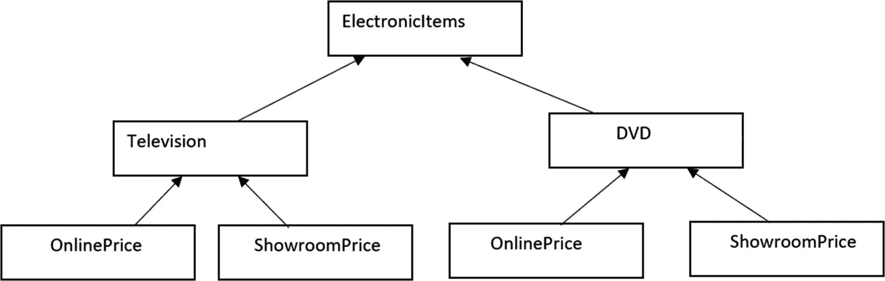
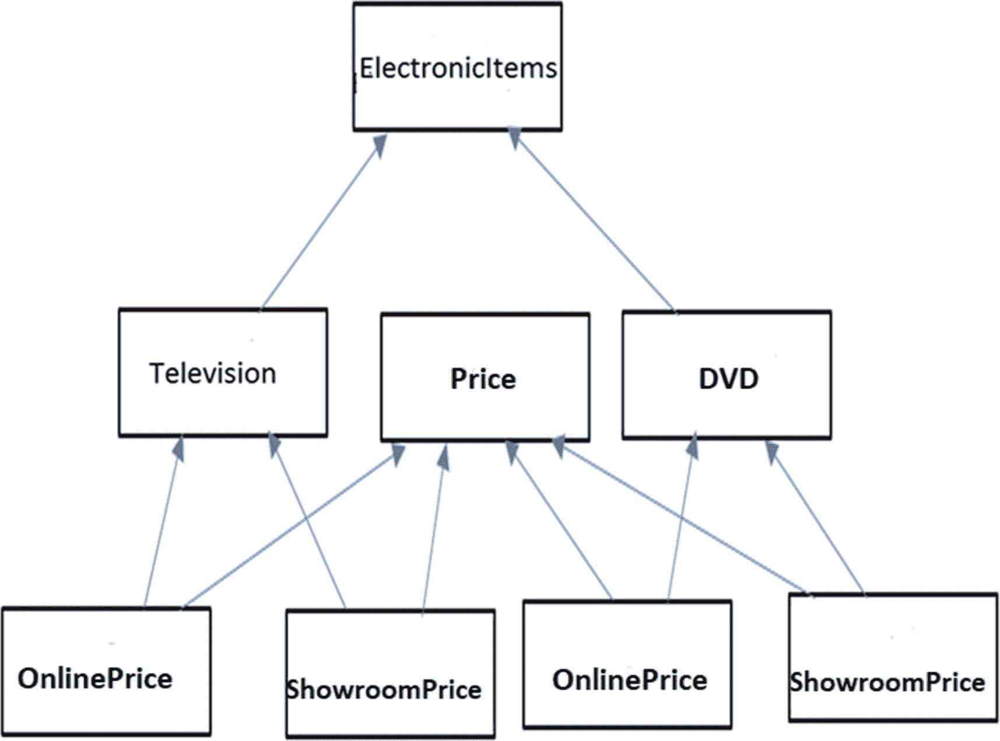
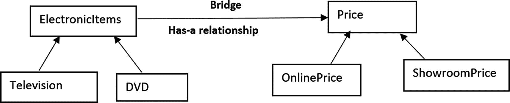
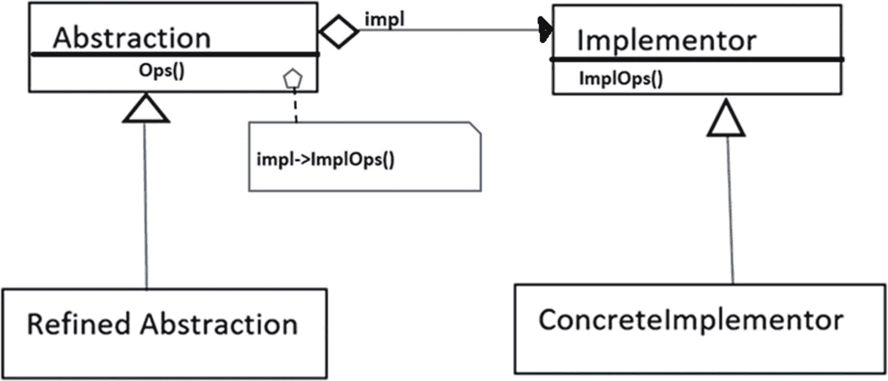
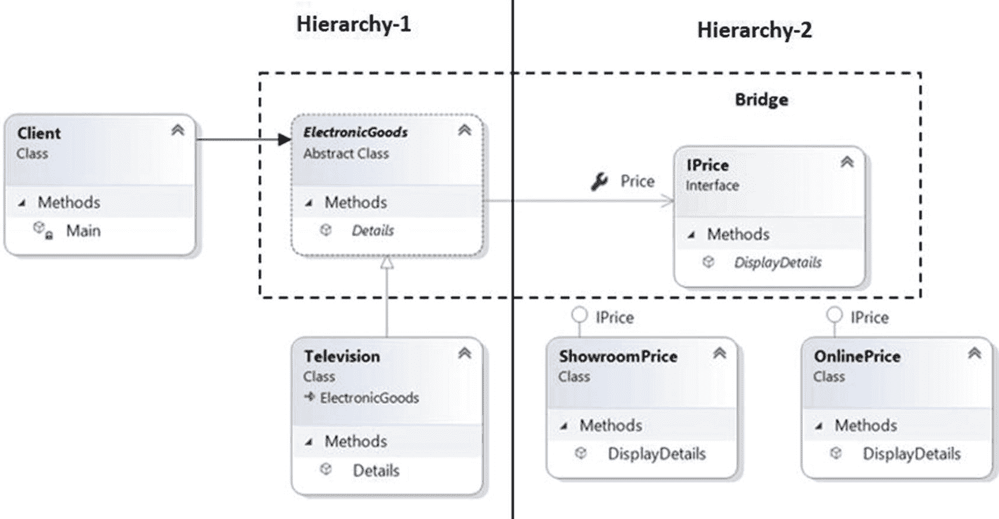
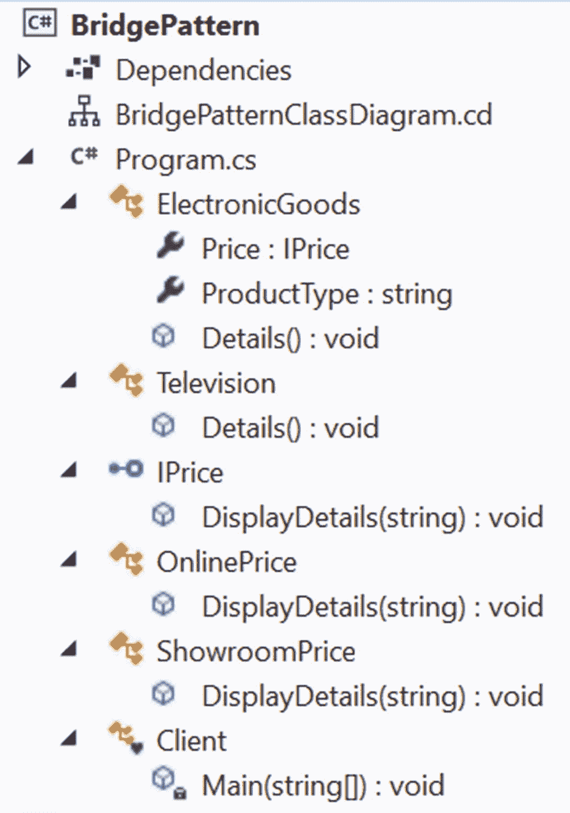
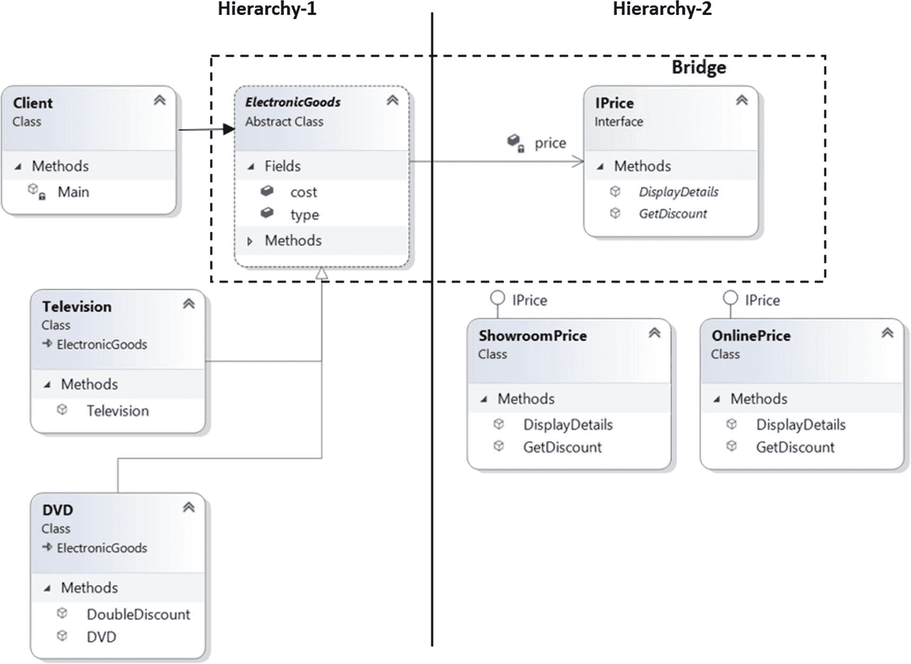

# 十二、桥接模式

本章涵盖了桥接模式。

## GoF 定义

将抽象与其实现解耦，这样两者可以独立变化。

## 概念

这种模式也称为手柄/主体模式。使用它，您可以通过在实现类和抽象类之间提供一个桥梁来将它们解耦。

这个桥接口使得具体类的功能独立于接口实现者类。您可以在结构上改变不同种类的类，而不会相互影响。这种模式最初可能看起来很复杂，这就是为什么在这一章中，有两种不同的实现并有很多解释。当你浏览这些例子时，这个概念会更清楚。

## 真实世界的例子

在软件产品开发公司中，开发团队和营销团队都扮演着至关重要的角色。营销团队做市场调查，收集客户需求。开发团队在产品中实现这些需求，以满足客户需求。一个团队中的任何变化(如运营策略)都不应对另一个团队产生直接影响。在这种情况下，营销团队在产品的客户和软件公司的开发团队之间扮演着桥梁的角色。

## 计算机世界的例子

GUI 框架可以使用桥模式将抽象从平台特定的实现中分离出来。例如，使用这种模式，您可以从 Linux 或 macOS 的窗口实现中分离出一个窗口抽象。

## 履行

假设你需要为销售不同电子产品的卖家设计一个软件。为简单起见，我们假设卖家目前在销售电视机和 DVD 播放器，他以线上和线下(在不同的展厅)两种模式销售。

在这种情况下，您可以从图 [12-1](#Fig1) 或图 [12-2](#Fig2) 所示的设计开始。



图 12-2

方法 2



图 12-1

方法 1

经过进一步分析，您发现方法 1 很混乱，很难维护。

首先，方法 2 看起来更清晰，但是如果您想要包含新的价格(例如，`ThirdPartyPrice`、`FestiveTimePrice`等)。)，或者如果您想要包含新的电子产品(例如，空调、冰箱等)。)，您面临着新的挑战，因为在这种设计中，各种元素紧密耦合。但是在真实的场景中，这种增强是经常需要的。

因此，为了将来的增强，您需要从一个松散耦合的系统开始，这样这两个层次(电子产品及其价格)中的任何一个都可以独立增长。桥接模式非常适合这种情况。因此，当您使用桥接模式时，结构可能看起来如图 [12-3](#Fig3) 所示。



图 12-3

使用桥接模式维护两个独立的层次结构

现在让我们从一个桥模式最常见的类图开始(见图 [12-4](#Fig4) )。



图 12-4

经典的桥梁模式

在这个类图中，

*   `Abstraction`定义抽象接口，维护`Implementor`引用。在我的例子中，它是一个抽象类，但是非常重要的是要注意，你不应该假设你需要一个抽象类或接口来定义一个抽象。重要的是要知道这里的单词 *abstraction* 关于去除复杂性的方法说了什么。这些方法只是对客户端代码隐藏了它们工作的内部细节。

*   `RefinedAbstraction`(一个具体类)扩展了`Abstraction`定义的接口。这是客户在演示 1 中使用的。

*   定义实现类的接口。这个接口方法不必与抽象方法完全对应。通常，它包括原语操作，抽象定义了基于这些原语的高级操作。还要注意，抽象类方法和实现者方法之间不需要一对一的映射。您可以在抽象类方法中使用实现者方法的组合。演示 2 说明了这一点，也可以参考 Q & A 12.5。

*   `ConcreteImplementor`(一个具体的类)实现了`Implementor`接口。

在即将到来的演示中，我遵循类似的设计。供您参考，我用注释指出了实现中的所有参与者。

### 类图

图 [12-5](#Fig5) 显示了类图。



图 12-5

类图

### 解决方案资源管理器视图

图 [12-6](#Fig6) 显示了程序的高层结构。



图 12-6

解决方案资源管理器视图

### 演示 1

在这个例子中，`ElectronicGoods`是我们的抽象类。它被放置在层级 1 中。该类定义如下。

```cs
// Abstraction
    public abstract class ElectronicGoods
    {
        public IPrice Price { get; set; }
        public string ProductType { get; set; }
        public abstract void Details();
    }

```

`IPrice`接口是我们的实现者接口。它维护第二个层次结构，定义如下。

```cs
// Implementor
    public interface IPrice
    {
        void DisplayDetails(string product);
    }

```

`Television`是覆盖`Details()`方法的具体抽象类，如下所示。

```cs
// Refined Abstraction
    public class Television : ElectronicGoods
    {
        /*
         * Implementation specific:
         * Delegating the task
         * to the Implementor object.
         */

        public override void Details()
        {
            Price.DisplayDetails(ProductType);
        }
    }

```

通过支持注释，您可以看到在`Details()`方法中，我从另一个层次结构中调用了`DisplayDetails()`方法，并传递了关于产品类型的信息。

具体的实现者(`OnlinePrice, ShowroomPrice`)捕获这些信息并在`DisplayDetails(...)`中使用它们。两个具体的实现是相似的。下面展示了其中的一个，供您参考。

```cs
    // This is ConcreteImplementor-1
    // OnlinePrice class
    public class OnlinePrice : IPrice
    {
        public void DisplayDetails(string productType)
        {
            Console.Write($"\n{productType} price at online is : 2000$");
        }
    }

```

为了简单起见，我没有改变演示 1 中的价格，但是在演示 2 中，您会注意到使用这种模式的灵活性，我也改变了价格。现在进行完整的演示，如下所示。

```cs
using System;

namespace BridgePattern
{
    // Abstraction
    public abstract class ElectronicGoods
    {
        public IPrice Price { get; set; }
        public string ProductType { get; set; }
        public abstract void Details();

    }
    // Refined Abstraction
    public class Television : ElectronicGoods
    {
        /*
         * Implementation specific:
         * Delegating the task
         * to the Implementor object.
         */

        public override void Details()
        {
            Price.DisplayDetails(ProductType);
        }
    }

    // Implementor
    public interface IPrice
    {
        void DisplayDetails(string product);
    }
    // This is ConcreteImplementor-1
    // OnlinePrice class
    public class OnlinePrice : IPrice
    {
        public void DisplayDetails(string productType)
        {
            Console.Write($"\n{productType} price at online is : 2000$");
        }
    }
    // This is ConcreteImplementor-2
    // ShowroomPrice class
    public class ShowroomPrice : IPrice
    {
        public void DisplayDetails(string productType)
        {
            Console.Write($"\n{productType} price at showroom is : 3000$");
        }
    }
    // Client code
    class Client
    {
        static void Main(string[] args)

        {
            Console.WriteLine("***Bridge Pattern Demo.***");
            Console.WriteLine("Verifying the market price of a television.");
            ElectronicGoods eItem = new Television();
            eItem.ProductType = "Sony Television";
            // Verifying online  price
            IPrice price = new OnlinePrice();
            eItem.Price = price;
            eItem.Details();
            // Verifying showroom price
            price = new ShowroomPrice();
            eItem.Price = price;
            eItem.Details();
        }
    }
}

```

### 输出

这是输出。

```cs
***Bridge Pattern Demo.***
Verifying the market price of a television.

Sony Television price at online is : 2000$
Sony Television price at showroom is : 3000$

```

## 附加实现

我在这一章中包含了一个额外的实现，以帮助您了解使用这一模式的灵活性。在这个例子中，我使用了构造函数，而不是属性。但是在我向您展示灵活性之前，让我们假设卖方对出售的产品提供折扣。

为了适应这一点，在这个实现中，让我们在抽象类中添加下面的方法(`ElectronicGoods`)。

```cs
// Additional method
public void Discount(int percentage)
{
     price.GetDiscount(percentage);
}

```

以及实现接口中的以下方法(`IPrice`)。

```cs
void GetDiscount(int percentage);

```

因为`Discount`方法是*而不是*抽象的，所以`Television`类或者`ElectronicGoods`的任何派生类继承了这个方法。但是由于在`IPrice`接口中添加了`GetDiscount(int percentage)`方法，具体的实现者需要实现这个方法。下面是来自`OnlinePrice`类实现者的这样一个实现。

```cs
public void GetDiscount(int percentage)
{
    Console.Write($"\nAt online, you can get upto {percentage}% discount.");
}

```

Note

同样，这些修改只是为了提供对折扣方法的支持。你应该感觉不到原来的桥模式受到改变的影响。为了保持演示 1 简短，我没有包括这个方法。

现在是灵活性部分。让我们假设卖家想卖叫做 DVD 的电子产品。卖家有时会对所有产品打折，但在节日期间，只对 DVD 提供额外折扣。

因此，DVD 类现在需要包含另一种方法来提供双重折扣(正常折扣+附加折扣)。你不能在`ElectronicGoods`抽象类中添加这个方法，因为在那种情况下，Television 类也会有你不想要的这个方法。最重要的是，尽管包含了 DVD 类，但是旧的代码结构不能改变。

桥接模式解决了这个问题。类图给了你一个线索。除此之外，请注意我是如何在 DVD 类中实现以下方法的。

```cs
        // Specific method in DVD
        public void DoubleDiscount()
        {
            // Normal discount(10%)
            Discount(10);
            // Festive season additional discount(5%)
            Discount(5);
        }

```

Note

你可以看到在`DoubleDiscount()`方法内部，使用了`ElectronicGoods`的`Discount(...)`方法，所以我是按照*超类抽象*来编码的，它允许抽象和实现独立变化。

因为我使用了构造函数而不是属性，所以让我们先来看看变化。以下是用`Details(...)`和`Discount(...)`方法进行的抽象。

```cs
    // Abstraction
    public abstract class ElectronicGoods
    {
       //public IPrice Price { get; set; }
        private IPrice price;
        public string type;
        public double cost;
        public ElectronicGoods(IPrice price)
        {
            this.price = price;
        }
        public void Details()
        {
            price.DisplayDetails(type, cost);
        }
        // Additional method
        public void Discount(int percentage)
        {
           price.GetDiscount(percentage);
        }
    }

```

现在，这是第一个精炼的抽象(`Television`类)。在这个类中，没有定义新的方法，这仅仅意味着`Television`类准备使用它的父类方法，并且不希望提供任何新的行为。

```cs
    // Refined Abstraction-1
    // Television class uses the default discount method.
    public class Television : ElectronicGoods
    {
        public Television(IPrice price):base(price)
        {
            this.type = "Television";
            this.cost = 2000;
        }
        // No additional method exists for Television

    }

```

下面是我们第二个精炼抽象(`DVD`类)，是新加入的。在这个类中，定义了一个名为`DoubleDiscount(...)`的新方法，这仅仅意味着客户端可以使用这个特定于 DVD 类的方法。这个方法是在超类抽象中编码的，其他层次结构不会因为这个 DVD 类的添加而受到影响。(我的意思是，由于在层级 1 中添加了 DVD 类(或任何其他类似的类)，您不需要更改位于层级 2 中的`ShowroomPrice`、`OnlinePrice`等。即使您向抽象类添加了一些额外的方法，您也不需要对层次结构 2 进行更改。类似地，如果您在 implementor 中添加一个方法，您不需要在 hierarchy 1 中进行更改。)

Note

简而言之，这里您将“客户端使用的方法”与“这些方法是如何实现的”分开

```cs
    // Refined Abstraction-2
    // DVD class can give additional discount.
    public class DVD : ElectronicGoods
    {
        public DVD(IPrice price) : base(price)
        {
            this.type = "DVD";
            this.cost = 3000;
        }

        // Specic method in DVD
        public void DoubleDiscount()
        {
            // Normal discount(10%)
            Discount(10);
            // Festive season additional discount(5%)
            Discount(5);
        }
}

```

对照图 [12-7](#Fig7) 所示的类图。然后直接按照完整的演示输出。对于这个修改后的实现，我没有显示 Solution Explorer 视图，因为根据前面的讨论和下面的类图，它很容易理解。



图 12-7

演示 2 的类图

### 类图

图 [12-7](#Fig7) 显示了修改后的类图。

### 演示 2

下面是完整的实现。

```cs
using System;

namespace BridgePatternDemo2
{
    // Abstraction
    public abstract class ElectronicGoods
    {
       //public IPrice Price { get; set; }
        private IPrice price;
        public string type;
        public double cost;
        public ElectronicGoods(IPrice price)
        {
            this.price = price;
        }
        public void Details()
        {
            price.DisplayDetails(type,cost);
        }
        // additional method
        public void Discount(int percentage)
        {
           price.GetDiscount(percentage);
        }

    }
    // Refined Abstraction-1
    // Television class uses the default discount method.
    public class Television : ElectronicGoods
    {
        public Television(IPrice price):base(price)
        {
            this.type = "Television";
            this.cost = 2000;
        }
        // No additional method exists for Television

    }
    // Refined Abstraction-2
    // DVD class can give additional discount.
    public class DVD : ElectronicGoods
    {
        public DVD(IPrice price) : base(price)
        {
            this.type = "DVD";
            this.cost = 3000;
        }

        // Specic method in DVD
        public void DoubleDiscount()
        {
            // Normal discount(10%)
            Discount(10);
            // Festive season additional discount
            Discount(5);
        }
    }

    // Implementor
    public interface IPrice
    {
        void DisplayDetails(string product, double price);
        // additional method
        void GetDiscount(int percentage);
    }
    // This is ConcreteImplementor-1
    // OnlinePrice class
    public class OnlinePrice : IPrice
    {
        public void DisplayDetails(string productType, double price)
        {
            Console.Write($"\n{productType} price at online is : {price}$");
        }
        public void GetDiscount(int percentage)
        {
            Console.Write($"\nAt online, you can get upto {percentage}% discount.");
        }
    }
    // This is ConcreteImplementor-2
    // ShowroomPrice class
    public class ShowroomPrice : IPrice
    {
        public virtual void DisplayDetails(string productType, double price)
        {
            // Showroom price is 300$ more
            Console.Write($"\n{productType} price at showroom is : {price + 300}$");
        }
        public void GetDiscount(int percentage)
        {
            Console.Write($"\nAt showroom, additional {percentage}% discount can be approved.");
        }
    }
    // Client code
    class Client
    {
        static void Main(string[] args)
        {
            Console.WriteLine("***Alternative Implementation of Bridge Pattern.***");
            #region Television details
            Console.WriteLine("Verifying the market price of a television.");
             ElectronicGoods eItem = new Television(new OnlinePrice());
            // Verifying online price details
            eItem.Details();
            // Giving 10% discount
            eItem.Discount(10);
            // Verifying showroom price
            eItem = new Television(new ShowroomPrice());
            eItem.Details();
            // Giving 10% discount
            eItem.Discount(10);
            #endregion

            #region DVD details
            Console.WriteLine("\n\nNow checking the DVD details.");
            // Verifying online  price
            eItem = new DVD(new OnlinePrice());
            eItem.Details();
            // Giving 10% discount
            eItem.Discount(10);
            // Verifying showroom price
            eItem = new DVD(new ShowroomPrice());
            eItem.Details();
            Console.WriteLine("\nIn showroom, you want to give double discounts at festive season.");
            Console.WriteLine("For DVD, you can get double discounts using the DoubleDiscount() method.");
            //eItem.Discount();
            Console.WriteLine("For example, in festive season:");
            ((DVD)eItem).DoubleDiscount();
            #endregion
        }
    }
}

```

### 输出

```cs
***Alternative Implementation of Bridge Pattern.***
Verifying the market price of a television.

Television price at online is : 2000$
At online, you can get upto 10% discount.
Television price at showroom is : 2300$
At showroom, additional 10% discount can be approved.

Now checking the DVD details.

DVD price at online is : 3000$
At online, you can get upto 10% discount.
DVD price at showroom is : 3300$
In showroom, you want to give double discounts at festive season.
For DVD , you can get double discounts using the DoubleDiscount() method.
For example, in festive season:

At showroom, additional 10% discount can be approved.
At showroom, additional 5% discount can be approved.

```

## 问答环节

**12.1 这种模式如何让我的** **编程** **生活更轻松？**

本章介绍了两个具有以下主要意图的示例。

*   避免项目及其相应价格之间的紧密耦合

*   维护两个不同的层次结构，在这两个层次结构中，两者都可以扩展而不会相互影响

*   处理实现在它们之间共享的多个对象

你可以使用简单的子类化来代替这种设计。这是正确的吗？

不。通过简单的子类化，你的实现不能动态变化。您的实现可能看起来行为不同，但是它们在编译时被绑定到抽象。

12.3 我可以在抽象类中使用构造函数而不是属性吗？

是的。有些开发人员更喜欢构造函数而不是属性(或者 getter-setter 方法)。因此，我在两个演示中向您展示了这两种用法。

使用桥梁设计模式的主要优势是什么？

以下是一些优点。

*   实现不局限于抽象。

*   抽象和实现都可以独立发展。

*   具体类独立于接口实现者类。换句话说，其中一个的变化不会影响另一个。因此，您也可以用不同的方式改变抽象和实现层次。

**12.5 与此模式相关的** **挑战** **有哪些？**

整体结构可能变得复杂。这里你不直接调用一个方法。相反，抽象层将工作委托给实现层。因此，在执行操作时，您可能会注意到轻微的性能影响。

有时，桥接模式与适配器模式相混淆。(请记住，适配器模式的主要目的是只处理不兼容的接口。)

当你使用抽象类方法时，你可以结合使用实现者方法。在演示 2 中，您会看到这一点。”你能详细说明一下吗？

演示 2 中的`DoubleDiscount()`方法显示了这一点，其中您调用了两次`Discount()`方法。再举一个例子，假设实现者有下面的`GiveThanks()`方法。

```cs
public interface IPrice
    {
        void DisplayDetails(string product, double price);
        // Additional method
        void GetDiscount(int percentage);
        // Added for Q&A session
        void GiveThanks();
    }

```

具体实现者实现了该方法。假设`OnlinePrice`如下实现了这个方法。

```cs
public void GiveThanks()
 {
  Console.Write("Thank you, please visit the site again.");
 }

```

另一个具体的实现者`ShowroomPrice`如下实现这个方法。

```cs
public void GiveThanks()
{
Console.Write("Thank you for coming. please visit the shop again.");
 }

```

现在，在抽象内部，您可以添加这个方法(如果您愿意)。例如，您更新后的`Discount`可能如下所示。

```cs
// Additional method
public void Discount(int percentage)
{
 price.GetDiscount(percentage);
 // Added for Q&A session
 price.GiveThanks();
}

```

当您使用这些更改运行程序(演示 2)时，您会看到以下修改后的输出。

```cs
***Alternative Implementation of Bridge Pattern.***
Verifying the market price of a television.

Television price at online is : 2000$
At online, you can get upto 10% discount.Thank you, please visit the site again.
Television price at showroom is : 2300$
At showroom, additional 10% discount can be approved. Thank you for coming. Please visit the shop again.

Now checking the DVD details.

DVD price at online is : 3000$
At online, you can get upto 10% discount. Thank you, please visit the site again.
DVD price at showroom is : 3300$
In showroom, you want to give double discounts at festive season.
For DVD , you can get double discounts using the DoubleDiscount() method.
For example, in festive season:

At showroom, additional 10% discount can be approved. Thank you for coming. Please visit the shop again.
At showroom, additional 5% discount can be approved. Thank you for coming. Please visit the shop again.

```

Note

一个高级抽象方法可以包含多个实现者方法，但是客户可能不知道这一点。