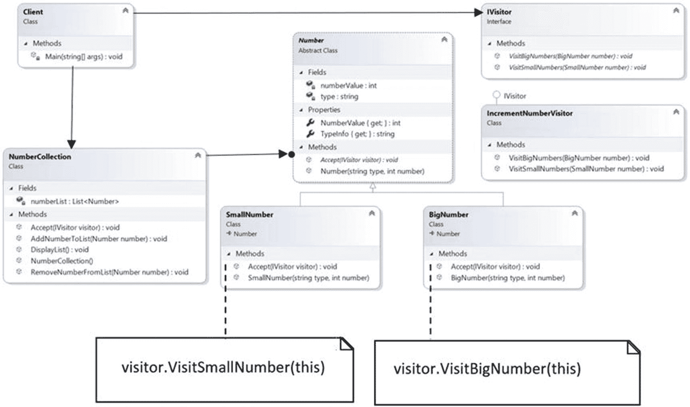
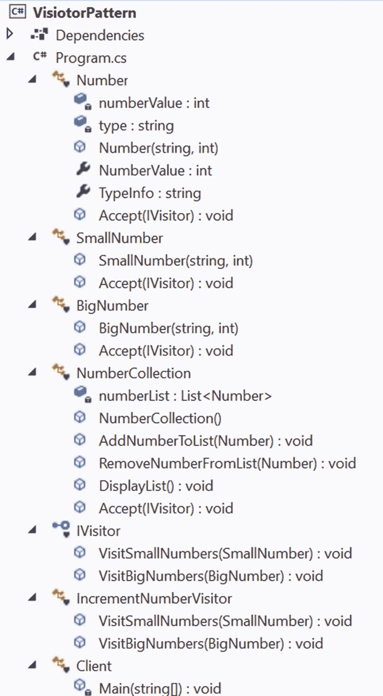
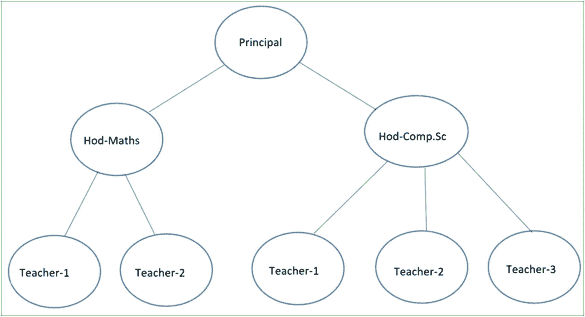
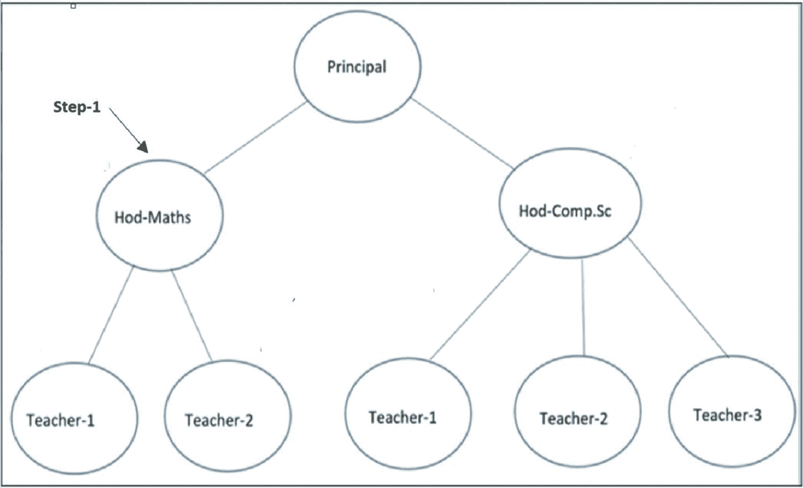
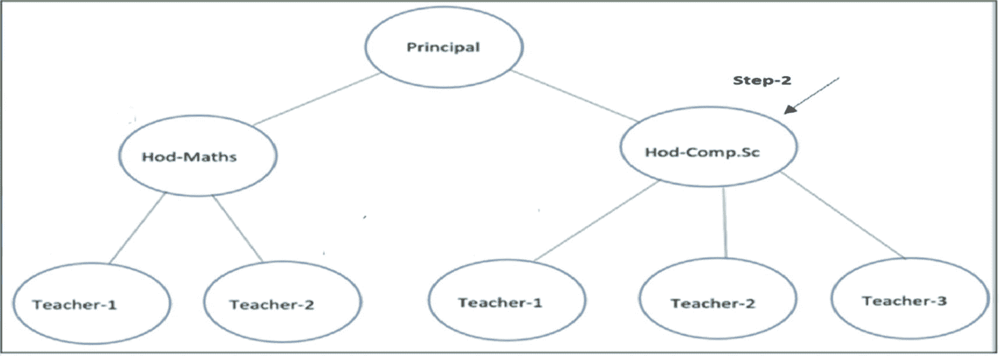
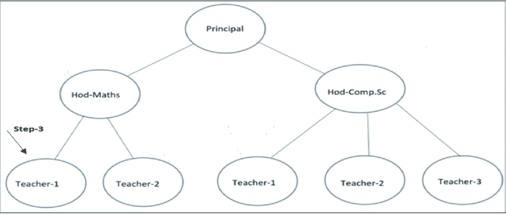
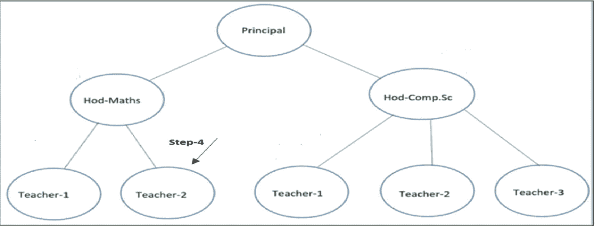
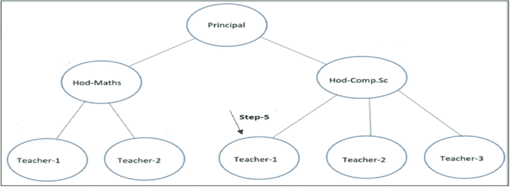

# 十三、访问者模式

本章介绍访问者模式。

## GoF 定义

表示要在对象结构的元素上执行的操作。Visitor 允许您定义一个新的操作，而不改变它所操作的元素的类。

## 概念

在这个模式中，您将算法从对象结构中分离出来。因此，您可以在对象上添加新的操作，而无需修改它们现有的体系结构。该模式支持打开/关闭原则(即允许扩展，但不允许修改实体，如类、函数等)。

Note

当您将这种设计模式与组合模式相结合时，您可以体验到这种设计模式的真正威力，如本章后面的实现所示。

为了理解这种模式，让我们考虑一个场景，其中有一个名为`Number`的抽象类，如下所示。

```cs
    /// <summary>
    /// Abstract class- Number
    /// </summary>
    abstract class Number
    {
        private int numberValue;
        private string type;
        public Number(string type, int number)
        {
            this.type = type;
            this.numberValue = number;
        }
        // I want to restrict the change in original data
        // So, no setter is present here.
        public int NumberValue
        {
            get
            {
                return numberValue;
            }
        }
        public string TypeInfo
        {
            get
            {
                return type;
            }
        }
        public abstract void SomeMethod();
    }

```

从`Number`派生出两个具体的类`SmallNumber`和`BigNumber`，定义如下。

```cs
    /// <summary>
    /// Concrete class-SmallNumber
    /// </summary>

    class SmallNumber : Number
    {
        public SmallNumber(string type, int number) : base(type, number)
        { }

        public override void SomeMethod()
        {
            // Some code
        }
    }
    /// <summary>
    /// Concrete class-BigNumber
    /// </summary>
    class BigNumber : Number
    {
        public BigNumber(string type, int number) : base(type, number)
        { }

        public override void SomeMethod
        {
            // Some code
        }
    }

```

这种继承层次很容易理解。现在让我们来看一段你和顾客之间的假想对话。

客户:我希望您创建一个设计，其中每个具体的类都有一个增加数值的方法。

你:那容易。我将在 Number 类中引入一个公共方法，结果是每个具体的类都可以获得该方法。

顾客:等等。我希望您使用一个递增数字的方法，但是在每次调用`SmallNumber`类中的方法时，它应该将数字递增 1，对于`BigNumber`类，它应该将数字递增 10。

你:那不成问题。我可以在`Number`类中定义一个抽象方法，在每个派生类中，你可以不同地实现它。

顾客:我没问题。

您可以一次性接受这个客户请求，但是如果您的客户经常要求类似的请求，您是否有可能在每个类中引入这样的方法，特别是当整个代码结构非常复杂的时候？还有，在一个树形结构中，如果只是一个分支节点，你能想象这些变化对其他节点的影响吗？

这一次你可能会明白问题所在，可能会想出一些办法来对付你那些善变的顾客。访问者模式可以在这种情况下帮助你。您可以在演示 1 中看到这样的实现。

## 真实世界的例子

想象一个出租车预订的场景。当出租车到达你家门口，你进入车内，出租车司机控制交通。他可以通过一条你不熟悉的路线带你去目的地，最糟糕的情况下，还可以更改目的地(由于访客模式使用不当而产生)。

## 计算机世界的例子

当公共 API 需要支持*插件*操作时，这种模式非常有用。然后，客户端可以在不修改源代码的情况下对一个类(使用访问类)执行它们想要的操作。

## 履行

让我们继续讨论访问者模式。你可以看到图 [13-1](#Fig1) 中的类图。它向您提示了我在接下来的演示中是如何实现它的。我引入了一个新的层次结构，其中，在顶层，有一个名为`IVisitor`的接口，带有两个名为`VisitBigNumbers(..)`和`VisitSmallNumbers(..)`的方法。看起来是这样的。

```cs
    interface IVisitor
    {
        // A visit operation for SmallNumber class
        void VisitSmallNumbers(SmallNumber number);

        // A visit operation for BigNumber class
        void VisitBigNumbers(BigNumber number);
    }

```

Note

代替使用不同的名称(VisitSmallNumbers(..)，VisitBigNumbers(...))对于这些方法，您可以使用相同的方法(例如，VisitNumbers(...))通过使用方法重载。在问答环节，我讨论了在这个例子中使用不同名称的原因。

`IncrementNumberVisitor`实现这个接口方法，如下所示。

```cs
    class IncrementNumberVisitor : IVisitor
    {
        public void VisitSmallNumbers(SmallNumber number)
        {
            Number currentNumber = number as Number;
            /*
             I do not want (infact I can't change because it's readonly now) to modify the original data. So, I'm making a copy of it before I use it.
            */
            int temp = currentNumber.NumberValue;
            // For SmallNumber's incrementing by 1
            Console.WriteLine($"{currentNumber.TypeInfo} is {currentNumber.NumberValue}; I use it as:{++temp} for rest of my code.");
            // Remaining code, if any
        }

        public void VisitBigNumbers(BigNumber number)
        {
            Number currentNumber = number as Number;
            /*
              * I do not want (infact I can't change because it's readonly now)
             * to modify the original data.
             * So, I'm making a copy of it before I use it.
             */
            int temp = currentNumber.NumberValue;
            // For BigNumber's incrementing by 10
            Console.WriteLine($"{currentNumber.TypeInfo} is {currentNumber.NumberValue}; I convert it as:{temp+10} for rest of my code.");
            // Remaining code, if any
        }
    }

```

值得注意的一点是，我不想修改原始数据。因此，在`Number`类中，您只能看到 getter 方法。这是因为我假设一旦你从具体的`Number`类中获得数据，你可以用不同的方式使用它，但是你不允许改变原始数据。(这是一个更好的做法，但这是可选的)。

在这个例子中，我维护了一个名为`numberList`的`List`数据结构，它用不同类型的数字初始化一个对象结构。因此，在演示 1 中，您会得到以下代码段。

```cs
    class NumberCollection
    {
        List<Number> numberList = new List<Number>();
        // List contains both SmallNumber's and BigNumber's
        public NumberCollection()
        {
            numberList.Add(new SmallNumber("small-1", 10));
            numberList.Add(new SmallNumber("small-2", 20));
            numberList.Add(new SmallNumber("small-3", 30));
            numberList.Add(new BigNumber("big-1", 200));
            numberList.Add(new BigNumber("big-2", 150));
            numberList.Add(new BigNumber("big-3", 70));
        }
            // remaining code

```

同样，您可以用这种方式初始化列表，或者一旦您初始化了一个空列表，您可以使用`AddNumberToList(...)`方法在客户端代码中提供列表的元素。类似地，您可以使用`RemoveNumberFromList(...)`方法从列表中删除一个元素。在演示 1 中，我没有使用这些方法，但是我保留了它们供您参考。所以，注意以下方法。

```cs
        public void AddNumberToList(Number number)
        {
            numberList.Add(number);
        }
        public void RemoveNumberFromList(Number number)
        {
            numberList.Remove(number);
        }

```

现在我们来看最重要的部分。在`Number`类中，您会看到下面一行。

```cs
public abstract void Accept(IVisitor visitor);

```

来自`Number`的具体派生类根据需要覆盖它。例如，`SmallNumber`会按如下方式覆盖它。

```cs
      public override void Accept(IVisitor visitor)
      {
        visitor.VisitSmallNumbers(this);
      }

```

并且`BigNumber`实现如下。

```cs
      public override void Accept(IVisitor visitor)
      {
        visitor.VisitBigNumbers(this);
      }

```

您可以看到，在`Accept`方法中，您可以传递一个“特定的访问者对象”，它反过来可以跨类调用适当的方法。`SmallNumber`和`BigNumber`类都通过这种方法暴露自己(这里封装受到了损害)。现在客户机与访问者进行交互，您可以在访问者层次结构中添加新方法。因此，在客户端代码中，您会注意到如下代码段。

```cs
NumberCollection numberCollection = new NumberCollection();
// some other code
// ....
IncrementNumberVisitor incrVisitor = new IncrementNumberVisitor();
// Visitor is visiting the list
Console.WriteLine("IncrementNumberVisitor is about to visit the list:");
numberCollection.Accept(incrVisitor);

```

### 类图

图 [13-1](#Fig1) 为类图。这一次，我希望您在类图中显示完整的方法签名，因此，为了在一个公共位置容纳所有内容，参与者的大小变得比通常要小。



图 13-1

类图

### 解决方案资源管理器视图

图 [13-2](#Fig2) 显示了程序的高层结构。



图 13-2

解决方案资源管理器视图

### 演示 1

这是完整的代码。

```cs
using System;
using System.Collections.Generic;

namespace VisitorPattern
{
    /// <summary>
    /// Abstract class- Number
    /// </summary>
    abstract class Number
    {
        private int numberValue;
        private string type;
        public Number(string type, int number)
        {
            this.type = type;
            this.numberValue = number;
        }
        //I want to restrict the change in original data
        //So, no setter is present here.
        public int NumberValue
        {
            get
            {
                return numberValue;
            }
        }
        public string TypeInfo
        {
            get
            {
                return type;
            }
        }
        public abstract void Accept(IVisitor visitor);
    }
    /// <summary>
    /// Concrete class-SmallNumber
    /// </summary>

    class SmallNumber : Number
    {
        public SmallNumber(string type, int number) : base(type, number)
        { }

        public override void Accept(IVisitor visitor)
        {
            visitor.VisitSmallNumbers(this);
        }
    }
    /// <summary>
    /// Concrete class-BigNumber
    /// </summary>
    class BigNumber : Number
    {
        public BigNumber(string type, int number) : base(type, number)
        { }

        public override void Accept(IVisitor visitor)
        {
            visitor.VisitBigNumbers(this);
        }
    }
    class NumberCollection
    {
        List<Number> numberList = new List<Number>();
        //List contains both SmallNumber's and BigNumber's
        public NumberCollection()
        {
            numberList.Add(new SmallNumber("small-1", 10));
            numberList.Add(new SmallNumber("small-2", 20));
            numberList.Add(new SmallNumber("small-3", 30));
            numberList.Add(new BigNumber("big-1", 200));
            numberList.Add(new BigNumber("big-2", 150));
            numberList.Add(new BigNumber("big-3", 70));
        }
        public void AddNumberToList(Number number)
        {
            numberList.Add(number);
        }
        public void RemoveNumberFromList(Number number)
        {
            numberList.Remove(number);
        }
        public void DisplayList()
        {
            Console.WriteLine("Current list is as follows:");
            foreach (Number number in numberList)
            {
                Console.Write(number.NumberValue+"\t");
            }
            Console.WriteLine();
        }
        public void Accept(IVisitor visitor)
        {
            foreach (Number n in numberList)
            {
                n.Accept(visitor);
            }
        }
    }
    /// <summary>
    /// The Visitor interface.
    /// GoF suggests to make visit opearation for each concrete class of /// ConcreteElement (in our example,SmallNumber and BigNumber) in the /// object structure
    /// </summary>
    interface IVisitor
    {
        //A visit operation for SmallNumber class
        void VisitSmallNumbers(SmallNumber number);

        //A visit operation for BigNumber class
        void VisitBigNumbers(BigNumber number);
    }
    /// <summary>
    /// A concrete visitor-IncrementNumberVisitor
    /// </summary>
    class IncrementNumberVisitor : IVisitor
    {
         public void VisitSmallNumbers(SmallNumber number)
        {
            Number currentNumber = number as Number;
            /*
             I do not want( infact I can't change because it's readonly now) to modify the original data. So, I'm making a copy of it before I use it.
            */
            int temp = currentNumber.NumberValue;
            //For SmallNumber's incrementing by 1
            Console.WriteLine($"{currentNumber.TypeInfo} is {currentNumber.NumberValue}; I use it as:{++temp} for rest of my code.");
            //Remaining code, if any
        }

        public void VisitBigNumbers(BigNumber number)
        {
            Number currentNumber = number as Number;
            /*
             I do not want( infact I can't change because it's readonly now) to modify the original data. So, I'm making a copy of it before I use it.
            */
            int temp = currentNumber.NumberValue;
            //For BigNumber's incrementing by 10
            Console.WriteLine($"{currentNumber.TypeInfo} is {currentNumber.NumberValue}; I convert it as:{temp+10} for rest of my code.");
            //Remaining code, if any
        }
    }
    class Client
    {
        static void Main(string[] args)
        {
            Console.WriteLine("***Visitor Pattern Demo***\n");
            NumberCollection numberCollection = new NumberCollection();
            //Showing the current list
            numberCollection.DisplayList();
            IncrementNumberVisitor incrVisitor = new IncrementNumberVisitor();
            //Visitor is visiting the list
            Console.WriteLine("IncrementNumberVisitor is about to visit the list:");
            numberCollection.Accept(incrVisitor);
            //Showing the current list
            numberCollection.DisplayList();

            Console.ReadLine();
        }
    }
}

```

### 输出

这是输出。

```cs
***Visitor Pattern Demo***

Current list is as follows:
10      20      30      200     150     70
IncrementNumberVisitor is about to visit the list:
small-1 is 10; I use it as:11 for rest of my code.
small-2 is 20; I use it as:21 for rest of my code.
small-3 is 30; I use it as:31 for rest of my code.
big-1 is 200; I convert it as:210 for rest of my code.
big-2 is 150; I convert it as:160 for rest of my code.
big-3 is 70; I convert it as:80 for rest of my code.
Current list is as follows:
10      20      30      200     150     70

```

### 问答环节

13.1 什么时候应该考虑实现访问者设计模式？

这里有一些要考虑的用例。

*   您需要向一组对象添加新的操作，而不改变它们对应的类。这是实现访问者模式的主要目的。当运营经常变化时，这种方法可以成为你的救星。

*   如果需要更改各种操作的逻辑，只需通过访问者实现即可。

这种模式有什么缺点吗？

这种模式有一些缺点。

*   我前面提到过，封装不是它的主要关注点。因此，您可以使用访问者来打破封装的力量。

*   如果您需要频繁地向现有架构添加新的具体类，那么访问者层次结构将变得难以维护。例如，假设您想在原来的层次结构中添加另一个具体的类。在这种情况下，您需要相应地修改 visitor 类的层次结构。

**13.3 你为什么说一个 visitor 类会违反** **封装** **？**

请注意，在`Accept`方法中，您可以传递一个“特定的访问者对象”，它反过来可以跨类调用适当的方法。`SmallNumber`和`BigNumber`类都通过这种方法暴露自己，这里封装性受到了损害。

此外，在许多情况下，您可能会看到访问者需要在一个复合结构中四处移动，以从其中收集信息，然后它可以使用这些信息进行修改。(尽管在演示 1 中，我不允许这种修改)。所以，当你提供这种支持时，你违背了封装的核心目标。

**13.4 为什么这种模式会损害封装？**

在这里，您对一组也可能是异构的对象执行一些操作。但是您的约束是您不能改变它们对应的类。因此，您的访问者需要一种方法来访问这些对象的成员。为了满足这一要求，您需要向访问者公开信息。

**13.5 在演示 1 中，我看到在 visitor 接口中，你是** ***而不是*** **使用方法重载** **的概念。例如，您编写了如下的接口方法。**

```cs
        // A visit operation for SmallNumber class
        void VisitSmallNumbers(SmallNumber number);

        // A visit operation for BigNumber class
        void VisitBigNumbers(BigNumber number);

```

在我看来，你可以使用类似下面这样的东西。

```cs
        // A visit operation for SmallNumber class
        void VisitNumbers(SmallNumber number);

        // A visit operation for BigNumber class
        void VisitNumbers(BigNumber number);

```

这是正确的吗？

接得好。是的，你可以这样做，但是我想让你注意到这些方法在做不同的工作(一个是将 int 增加 1，另一个是增加 10)。通过使用不同的名称，当你浏览代码时，我试图在`Number`类层次结构中区分它们。

在《Java 设计模式*(a press，2018)一书中，我使用了你提到的方法。你只需要记住这些接口方法应该只针对特定的类，比如`SmallNumber`或者`BigNumber`。*

在演示 2 中，我将访问者模式与组合模式相结合，使用了重载方法。

**13.6 假设在演示 1 中，我增加了** `Number` **的另一个具体子类叫做** `UndefinedNumber` **。我应该如何进行？我应该在访问者界面中使用另一个特定的方法吗？**

没错。您需要定义一个特定于这个新类的新方法。因此，您的接口可能如下所示(这里使用了方法重载)。

```cs
   interface IVisitor
    {
        // A visit operation for SmallNumber class
        void VisitNumbers(SmallNumber number);
        // A visit operation for BigNumber class
        void VisitNumbers(BigNumber number);
        // A visit operation for UndefinedNumber class
        void VisitNumbers(UndefinedNumber number);
    }

```

然后，您需要在具体的 visitor 类中实现这个新方法。

假设，我需要在现有架构中支持新的操作。我应该如何处理访问者模式？

对于每个新操作，创建一个新的 Visitor 子类，并在其中实现操作。然后，按照我在前面的例子中向您展示的方式访问您现有的结构。例如，如果您想要调查`SmallNumber`类实例的`int`值是否大于 10，以及对于`BigNumber`类，它们是否大于 100 的方法。对于这个需求，您可以添加一个新的具体类，`InvestigateNumberVisitor,`，它继承自`IVisitor`，定义如下。

```cs
    /// <summary>
    /// Another concrete visitor-InvestigateNumberVisitor
    /// </summary>
    class InvestigateNumberVisitor : IVisitor
    {
        public void VisitSmallNumbers(SmallNumber number)
        {
            Number currentNumber = number as Number;
            int temp = currentNumber.NumberValue;
            // Checking whether the number is greater than 10 or not
            string isTrue = temp > 10 ? "Yes" : "No";
            Console.WriteLine($"Is {currentNumber.TypeInfo} greater than 10 ? {isTrue}");
        }
        public void VisitBigNumbers(BigNumber number)
        {
            Number currentNumber = number as Number;
            int temp = currentNumber.NumberValue;
            // Checking whether the number is greater than 100 or not
            string isTrue = temp > 100 ? "Yes" : "No";
            Console.WriteLine($"Is {currentNumber.TypeInfo} greater than 100 ? {isTrue}");
        }
    }

```

现在，在客户端代码中，您可以添加下面的代码段来检查它是否正常工作。

```cs
// Visitor-2
InvestigateNumberVisitor investigateVisitor = new InvestigateNumberVisitor();
// Visitor is visiting the list
Console.WriteLine("InvestigateNumberVisitor is about to visit the list:");
numberCollection.Accept(investigateVisitor);

```

一旦你在`demonstration 1,`中添加了这些段，使用如下的客户端代码。

```cs
  class Client
    {
        static void Main(string[] args)
        {
            Console.WriteLine("***Visitor Pattern Demo2.***\n");
            NumberCollection numberCollection = new NumberCollection();
            // Showing the current list
            numberCollection.DisplayList();
            // Visitor-1
            IncrementNumberVisitor incrVisitor = new IncrementNumberVisitor();
            // Visitor is visiting the list
            Console.WriteLine("IncrementNumberVisitor is about to visit the list:");
            numberCollection.Accept(incrVisitor);
            // Visitor-2
            InvestigateNumberVisitor investigateVisitor = new InvestigateNumberVisitor();
            // Visitor is visiting the list
            Console.WriteLine("InvestigateNumberVisitor is about to visit the list:");
            numberCollection.Accept(investigateVisitor);

            Console.ReadLine();
        }
    }

```

运行该程序时，您可以获得以下输出。

```cs
***Visitor Pattern Demo2.***

Current list is as follows:
10      20      30      200     150     70
IncrementNumberVisitor is about to visit the list:
Original data:10; I use it as:11
Original data:20; I use it as:21
Original data:30; I use it as:31
Original data:200; I use it as:210
Original data:150; I use it as:160
Original data:70; I use it as:80
InvestigateNumberVisitor is about to visit the list:
Is small-1 greater than 10 ? No
Is small-2 greater than 10 ? Yes
Is small-3 greater than 10 ? Yes
Is big-1 greater than 100 ? Yes
Is big-2 greater than 100 ? Yes
Is big-3 greater than 100 ? No

```

您可以从 Apress 网站下载这个修改示例的完整代码。我将它合并到名为 VisitorPatternDemo2 的名称空间中。

我看到你正在用 SmallNumber 和 BigNumber 的对象初始化 numberList。创建这样的结构是强制性的吗？

不。我做了一个容器，帮助客户一次就能顺利访问。在另一个不同的版本中，您可以看到，在遍历列表之前，您首先初始化一个空列表，然后在客户端代码中添加(或移除)元素。

要理解前一行，您可以参考演示 2，在演示 2 中，我只在客户端代码中创建了容器类。

## 一起使用访问者模式和组合模式

在演示 1 中，您看到了访问者设计模式的一个示例，并且在问答会话中，您经历了它的一个扩展版本。现在我将向您展示另一个实现，但是这一次，我将它与组合模式结合起来。

让我们考虑一下第 11 章中的复合设计模式的例子。在这个例子中，有一个学院有两个不同的系。每个系都有一名系主任和多名教授/讲师。所有的 hod 都向学院的校长报告。

图 [13-3](#Fig3) 显示了本例的树形结构。学院的结构和第 11 章[中描述的一样。数学讲师/教师是 M. Joy 和 M. Roony，CSE 教师是 C. Sam、C. Jones 和 C. Marium。这些讲师不监管任何人，所以在树形图中被当作叶节点。S. Som 博士是校长，职位最高。两个 HOD(s . Das 夫人(HOD-Math)和 V. Sarcar 先生(HOD-Comp。Sc)向负责人报告。hod 和 principal 是非叶节点。](11.html)



图 13-3

复合设计示例的树结构

现在假设学院的校长想提升一些员工。假设教学经验是晋升的唯一标准，但高级教师(分支节点)和初级教师(叶节点)之间的标准有所不同，具体如下:对于初级教师，晋升的最低标准是 12 年，高级教师是 15 年。

如果您理解示范 1，您会意识到晋升标准在将来可能会改变，并且可能会有来自上级的额外要求。因此，访问者模式非常适合满足当前的需求。这就是为什么在接下来的例子中，你会看到一个新的属性和一个新的方法被添加到了`Employee`接口；支持性的评论应该很容易理解。

```cs
// Newly added for this example
// To set years of Experience
double Experience { get; set; }
// Newly added for this example
void Accept(IVisitor visitor);

```

按照演示 1 中的设计，让我们用名为`VisitEmployee(...)`的方法制作一个名为`IVisitor`的访问者接口，它有两个重载版本。这是访问者的层次结构。

```cs
    /// <summary>
    /// Visitor interface
    /// </summary>
    interface IVisitor
    {
        // To visit leaf nodes
        void VisitEmployees(Employee employee);

        // To visit composite nodes
        void VisitEmployees(CompositeEmployee employee);
    }
    /// <summary>
    /// Concrete visitor class-PromotionCheckerVisitor
    /// </summary>
    class PromotionCheckerVisitor : IVisitor
    {
        string eligibleForPromotion = String.Empty;
        public void VisitEmployees(CompositeEmployee employee)
        {
            //We'll promote them if experience is greater than 15 years
            eligibleForPromotion = employee.Experience > 15 ? "Yes" : "No";
            Console.WriteLine($"\t{ employee.Name } from {employee.Dept} is eligible for promotion? :{eligibleForPromotion}");

        }

        public void VisitEmployees(Employee employee)
        {
            //We'll promote them if experience is greater than 12 years
            eligibleForPromotion = employee.Experience > 12 ? "Yes" : "No";
            Console.WriteLine($"\t{ employee.Name } from {employee.Dept} is eligible for promotion? :{eligibleForPromotion}");
        }
}

```

这一次，我在客户机代码中制作容器(一个列表数据结构，称为参与者)。当访问者从这个学院结构中收集必要的详细信息时，它可以显示符合晋升条件的候选人，这就是包含以下代码段的原因。

```cs
Console.WriteLine("\n***Visitor starts visiting our composite structure***\n");
IVisitor visitor = new PromotionCheckerVisitor();
//Visitor is traversing the participant list
foreach ( IEmployee  emp in participants)
   {
      emp.Accept(visitor);
   }

```

访问者从原始的学院结构中一次一个地收集数据，而不对其进行任何修改。一旦收集过程结束，访问者分析数据以显示预期的结果。为了直观地理解这一点，你可以跟随图 [13-4](#Fig4) 到 [13-8](#Fig8) 中的箭头。*校长在组织的最高层，所以你可以假设他没有得到提升。*

### 第一步

图 [13-4](#Fig4) 为步骤 1。



图 13-4

第一步

### 第二步

图 [13-5](#Fig5) 为步骤 2。



图 13-5

第二步

### 第三步

图 [13-6](#Fig6) 为步骤 3。



图 13-6

第三步

### 第四步

图 [13-7](#Fig7) 为步骤 4。



图 13-7

第四步

### 第五步

图 [13-8](#Fig8) 为步骤 5。



图 13-8

第五步

等等...

我在演示 1 中遵循了类似的设计，代码示例建立在第 [11](11.html) 章中唯一的演示之上。为了简洁起见，我在这个例子中没有包括类图和解决方案浏览器视图。所以，直接通过下面的实现。

### 演示 2

下面是实现。

```cs
using System;
using System.Collections.Generic;

namespace VisitorWithCompositePattern
{
    interface IEmployee
    {
        //To set an employee name
        string Name { get; set; }
        //To set an employee department
        string Dept { get; set; }
        //To set an employee designation
        string Designation { get; set; }

        //To display an employee details
        void DisplayDetails();

        //Newly added for this example
        //To set years of Experience
        double Experience { get; set; }
        //Newly added for this example
        void Accept(IVisitor visitor);
    }
    //Leaf node
    class Employee : IEmployee
    {
        public string Name { get; set; }
        public string Dept { get; set; }
        public string Designation { get; set; }
        public double Experience { get; set; }
        //Details of a leaf node
        public void DisplayDetails()
        {
            Console.WriteLine($"{Name} works in { Dept} department.Designation:{Designation}.Experience : {Experience} years.");
        }
        public void Accept(IVisitor visitor)
        {
            visitor.VisitEmployees(this);
        }

    }
    //Non-leaf node
    class CompositeEmployee : IEmployee
    {
        public string Name { get; set; }
        public string Dept { get; set; }
        public string Designation { get; set; }
        public double Experience { get; set; }

        //The container for child objects
        //private List<IEmployee> subordinateList = new List<IEmployee>();
        //Making it public now
        public List<IEmployee> subordinateList = new List<IEmployee>();

        //To add an employee
        public void AddEmployee(IEmployee e)
        {
            subordinateList.Add(e);
        }

        //To remove an employee
        public void RemoveEmployee(IEmployee e)
        {
            subordinateList.Remove(e);
        }

        //Details of a composite node
        public void DisplayDetails()
        {
            Console.WriteLine($"\n{Name} works in {Dept} department.Designation:{Designation}.Experience : {Experience} years.");
            foreach (IEmployee e in subordinateList)
            {
                e.DisplayDetails();
            }
        }

        public void Accept(IVisitor visitor)
        {
            visitor.VisitEmployees(this);
        }
    }
    /// <summary>
    /// Visitor interface
    /// </summary>
    interface IVisitor
    {
        //To visit leaf nodes
        void VisitEmployees(Employee employee);

        //To visit composite nodes
        void VisitEmployees(CompositeEmployee employee);
    }
    /// <summary>
    /// Concrete visitor class-PromotionCheckerVisitor
    /// </summary>
    class PromotionCheckerVisitor : IVisitor
    {
        string eligibleForPromotion = String.Empty;
        public void VisitEmployees(CompositeEmployee employee)
        {
           /*
            We'll promote them if experience is greater than 15 years.
            */
            eligibleForPromotion = employee.Experience > 15 ? "Yes" : "No";
            Console.WriteLine($"{ employee.Name } from {employee.Dept} is eligible for promotion? :{eligibleForPromotion}");

        }

        public void VisitEmployees(Employee employee)
        {
           /*
            We'll promote them if experience is greater
            than 12 years.
            */
            eligibleForPromotion = employee.Experience > 12 ? "Yes" : "No";
            Console.WriteLine($"{ employee.Name } from {employee.Dept} is eligible for promotion? :{eligibleForPromotion}");
        }
    }

    class Program
    {
        static void Main(string[] args)
        {
            Console.WriteLine("***Visitor Pattern with Composite Pattern Demo. ***");

            #region Mathematics department
            //2 lecturers work in Mathematics department
            Employee mathTeacher1 = new Employee { Name = "M.Joy", Dept = "Mathematic", Designation = "Lecturer" ,Experience=13.7};
            Employee mathTeacher2 = new Employee { Name = "M.Roony", Dept = "Mathematics", Designation = "Lecturer", Experience = 6.5 };

      //The college has a Head of Department in Mathematics
            CompositeEmployee hodMaths = new CompositeEmployee { Name = "Mrs.S.Das", Dept = "Maths", Designation = "HOD-Maths", Experience = 14 };

      //Lecturers of Mathematics directly reports to HOD-Maths
            hodMaths.AddEmployee(mathTeacher1);
            hodMaths.AddEmployee(mathTeacher2);
            #endregion

            #region Computer Science department
            //3 lecturers work in Computer Sc. department
            Employee cseTeacher1 = new Employee { Name = "C.Sam", Dept = "Computer Science", Designation = "Lecturer", Experience = 10.2 };
            Employee cseTeacher2 = new Employee { Name = "C.Jones", Dept = "Computer Science.", Designation = "Lecturer", Experience = 13.5 };
            Employee cseTeacher3 = new Employee { Name = "C.Marium", Dept = "Computer Science", Designation = "Lecturer", Experience = 7.3 };

    //The college has a Head of Department in Computer science
            CompositeEmployee hodCompSc = new CompositeEmployee { Name = "Mr. V.Sarcar", Dept = "Computer Sc.", Designation = "HOD-Computer Sc.", Experience = 16.5 };

    //Lecturers of Computer Sc. directly reports to HOD-CSE
            hodCompSc.AddEmployee(cseTeacher1);
            hodCompSc.AddEmployee(cseTeacher2);
            hodCompSc.AddEmployee(cseTeacher3);
            #endregion

            #region Top level management
            //The college also has a Principal
            CompositeEmployee principal = new CompositeEmployee { Name = "Dr.S.Som", Dept = "Planning-Supervising-Managing", Designation = "Principal", Experience = 21 };

           /*
            Head of Departments's of Maths and Computer Science directly reports to Principal.
            */
            principal.AddEmployee(hodMaths);
            principal.AddEmployee(hodCompSc);
            #endregion

           /*
           Printing the leaf-nodes and branches in the same way i.e. in each case, we are calling DisplayDetails() method.
           */
            Console.WriteLine("\nDetails of a college structure is as follows:");
            //Prints the complete structure
            principal.DisplayDetails();

            List<IEmployee> participants = new List<IEmployee>();

            //For employees who directly reports to Principal
            foreach (IEmployee e in principal.subordinateList)
            {
                participants.Add(e);
            }
            //For employees who directly reports to HOD-Maths
            foreach (IEmployee e in hodMaths.subordinateList)
            {
                participants.Add(e);
            }
           //For employees who directly reports to HOD-Comp.Sc
            foreach (IEmployee e in hodCompSc.subordinateList)
            {
                participants.Add(e);
            }
            Console.WriteLine("\n***Visitor starts visiting our composite structure***\n");
            IVisitor visitor = new PromotionCheckerVisitor();
           /*
           Principal is already holding the highest position.
           We are not checking whether he is eligible
           for promotion or not.
           */
            //principal.Accept(visitor);
            //Visitor is traversing the participant list
            foreach ( IEmployee  emp in participants)
            {
                emp.Accept(visitor);
            }

            //Wait for user
            Console.ReadKey();
        }
    }
}

```

### 输出

这是输出。有些部分以粗体显示，表明访问者能够成功完成其工作。

```cs
***Visitor Pattern with Composite Pattern Demo. ***

Details of a college structure is as follows:

Dr.S.Som works in Planning-Supervising-Managing department.Designation:Principal.Experience : 21 years.

Mrs.S.Das works in Maths department.Designation:HOD-Maths.Experience : 14 years.
M.Joy works in Mathematic department.Designation:Lecturer.Experience : 13.7 years.
M.Roony works in Mathematics department.Designation:Lecturer.Experience : 6.5 years.

Mr. V.Sarcar works in Computer Sc. department.Designation:HOD-Computer Sc..Experience : 16.5 years.
C.Sam works in Computer Science department.Designation:Lecturer.Experience : 10.2 years.
C.Jones works in Computer Science. department.Designation:Lecturer.Experience : 13.5 years.
C.Marium works in Computer Science department.Designation:Lecturer.Experience : 7.3 years.

***Visitor starts visiting our composite structure***

Mrs.S.Das from Maths is eligible for promotion? :No
Mr. V.Sarcar from Computer Sc. is eligible for promotion? :Yes
M.Joy from Mathematic is eligible for promotion? :Yes
M.Roony from Mathematics is eligible for promotion? :No
C.Sam from Computer Science is eligible for promotion? :No
C.Jones from Computer Science. is eligible for promotion? :Yes
C.Marium from Computer Science is eligible for promotion? :No

```