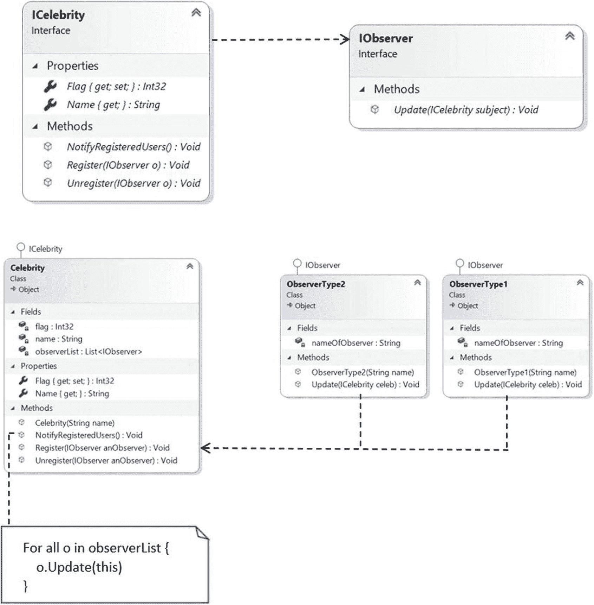

# 十四、观察者模式

本章涵盖了观察者模式。

## GoF 定义

定义对象之间的一对多依赖关系，这样当一个对象改变状态时，它的所有依赖对象都会得到通知并自动更新。

## 概念

在这个模式中，有许多观察者(对象)在观察一个特定的主体(也是一个对象)。观察者希望在对象内部发生变化时得到通知。所以，他们注册了这个科目。当他们对该主题失去兴趣时，他们就从该主题中注销。有时这种模型被称为发布者-订阅者(发布-订阅)模型。整个想法可以总结如下:使用这个模式，一个对象(subject)可以同时向多个观察者(一组对象)发送通知。观察者可以决定如何响应通知，并且可以根据通知执行特定的操作。

您可以用下面的图表来可视化这些场景。

在步骤 1 中，三个观察者请求从一个对象那里得到通知(见图 [14-1](#Fig1) )。


图 14-1

第一步

在步骤 2 中，主体可以同意请求；换句话说，连接建立(见图 [14-2](#Fig2) )。


图 14-2

第二步

在步骤 3 中，主题向注册用户发送通知(参见图 [14-3](#Fig3) )。


图 14-3

第三步

在步骤 4(可选)中，observer2 不希望获得进一步的通知并请求注销自己(或者主题由于某些特定原因不希望将 observer2 保留在其通知列表中，并且他注销了 observer2)。因此，受试者和观察者 2 之间的连接已经断开(见图 [14-4](#Fig4) )。


图 14-4

第四步

在第 5 步中，从现在开始，只有观察器 1 和观察器 3 从对象那里得到通知(见图 [14-5](#Fig5) )。


图 14-5

第五步

## 真实世界的例子

想想一个在社交媒体上有很多粉丝的名人。这些追随者中的每一个都想从他们最喜爱的名人那里获得所有最新的更新。所以，他们追随名人直到兴趣减退。当他们失去兴趣时，他们就不再追随那个名人了。把这些粉丝或追随者想象成观察者，把名人想象成主体。

## 计算机世界的例子

让我们考虑计算机科学中一个简单的基于 UI 的例子。此用户界面连接到某个数据库。用户可以通过 UI 执行查询，在搜索数据库后，返回结果。使用这种模式，您可以将 UI 与数据库隔离开来。如果数据库发生变化，应该通知 UI，以便它可以相应地更新它的显示。

为了简化这个场景，假设您是组织中负责维护数据库的人。每当数据库发生更改时，您都希望收到通知，以便在必要时采取措施。在这种情况下，您可以注意以下几点。

*   您可以在任何 eventdriven 软件中看到这种模式的存在。像 C# 这样的现代语言有按照这种模式处理这些事件的内置支持。这些构造让你的生活更轻松。

*   如果你熟悉。NET 框架，你看到在 C# 中，你有泛型`System.IObservable<T>`和`System.IObserver<T>`接口，其中泛型类型参数提供通知。

## 履行

对于这个例子，我创建了四个观察者(`Roy, Kevin, Bose`和`Jacklin)`以及两个主题(`Celebrity-1 and Celebrity-2)`)。一个 subject(在我们的例子中是`Celebrity`)维护一个所有注册用户的列表。当主题中的标志值发生变化时，观察者会收到通知。

最初，三个观察者(Roy、Kevin 和 Bose)注册自己以获得来自名人 1 的通知。所以，在最初阶段，他们都收到了通知。但后来，凯文对名人 1 失去了兴趣。当名人 1 号意识到这一点时，他将凯文从他的观察名单中移除。此时，只有 Roy 和 Bose 在接收通知(当标志值为 50 时)。但是凯文后来改变了主意，想要再次获得通知，所以名人 1 再次注册了他。这就是为什么当名人-1 将标志值设置为 100 时，三个观察者都收到了他的通知。

后来你看到了一个名人，名字叫名人-2。罗伊和杰克林登记在他的观察名单上。因此，当名人-2 将标志值设置为 500 时，罗伊和杰克林都收到了通知。

让我们看看代码。下面是`IObserver`接口，它有一个`Update(...)`方法。

```cs
    interface IObserver
    {
        void Update(ICelebrity subject);
    }

```

两个具体的类——`ObserverType1`和`ObserverType2`——向您展示了您可以拥有不同类型的观察者。这些类如下实现了`IObserver`接口。

```cs
    // ObserverType1
    class ObserverType1 : IObserver
    {
        string nameOfObserver;
        public ObserverType1(String name)
        {
            this.nameOfObserver = name;
        }
        public void Update(ICelebrity celeb)
        {
            Console.WriteLine($"{nameOfObserver} has received an alert from {celeb.Name}.Updated value is: {celeb.Flag}");
        }
    }

    // ObserverType2
    class ObserverType2 : IObserver
    {
        string nameOfObserver;
        public ObserverType2(String name)
        {
            this.nameOfObserver = name;
        }
        public void Update(ICelebrity celeb)
        {
            Console.WriteLine($"{nameOfObserver} notified.Inside {celeb.Name}, the updated value is: {celeb.Flag}");
        }
    }

```

主题接口(`ICelebrity`)包含三个方法，分别叫做`Register(...), Unregister(...)`、`NotifyRegisteredUsers()`，很容易理解。这些方法分别注册一个观察器、注销一个观察器和通知所有已注册的观察器。下面是`ICelebrity`界面。

```cs
    interface ICelebrity
    {
        // Name of Subject
        string Name { get; }
        int Flag { get; set; }
        // To register
        void Register(IObserver o);
        // To Unregister
        void Unregister(IObserver o);
        // To notify registered users
        void NotifyRegisteredUsers();
    }

```

`Celebrity`具体类实现了`ICelebrity`接口。重要的一点是，这个具体的类维护一个注册用户列表。您可以在这个类中看到下面一行代码。

```cs
List<IObserver> observerList = new List<IObserver>();

```

Note

在这种模式的一些例子中，您可能会看到一个细微的变化，其中使用了一个抽象类来代替接口(`ICelebrity`)，并且列表(`observerList`)在抽象类中维护。两种变化都可以。您可以实现您喜欢的方法。

我在`Celebrity`类中使用了一个构造函数。构造函数如下。

```cs
        public Celebrity(string name)
        {
            this.name = name;
        }

```

我对不同的名人使用这个构造函数。因此，在客户端代码中，您会看到以下带有注释的行。

```cs
Console.WriteLine("Working with first celebrity now.");
ICelebrity celebrity = new Celebrity("Celebrity-1");
// some other code
// Creating another celebrity

```

ICelebrity celebrity2 =新名人("名人-2 ")；

最后，我在`Celebrity`类中使用了一个表达式体属性。你可以在这段代码中看到。

```cs
        //public string Name
        //{
        //    get
        //    {
        //        return name;
        //    }
        //}
        // Or, simply use expression bodied
        // properties(C# v6.0 onwards)
        public string Name => name;

```

Note

如果您的 C# 版本早于 6.0，那么您可以使用注释代码块。同样的评论也适用于本书中类似的代码。

剩下的代码很容易理解。如果你想的话，跟随支持的评论。

### 类图

图 [14-6](#Fig6) 显示了类图。



图 14-6

类图

### 解决方案资源管理器视图

图 [14-7](#Fig7) 显示了程序的高层结构。


图 14-7

解决方案资源管理器视图

### 示范

这是完整的演示。

```cs
using System;
// We have used List<Observer> here
using System.Collections.Generic;
namespace ObserverPattern
{
    interface IObserver
    {
        void Update(ICelebrity subject);
    }
    class ObserverType1 : IObserver
    {
        string nameOfObserver;
        public ObserverType1(String name)
        {
            this.nameOfObserver = name;
        }
        public void Update(ICelebrity celeb)
        {
            Console.WriteLine($"{nameOfObserver} has received an alert from {celeb.Name}. Updated value is: {celeb.Flag}");
        }
    }
    class ObserverType2 : IObserver
    {
        string nameOfObserver;
        public ObserverType2(String name)
        {
            this.nameOfObserver = name;
        }
        public void Update(ICelebrity celeb)
        {
            Console.WriteLine($"{nameOfObserver} notified.Inside {celeb.Name}, the updated value is: {celeb.Flag}");
        }
    }

    interface ICelebrity
    {
        // Name of Subject
        string Name { get; }
        int Flag { get; set; }
        // To register
        void Register(IObserver o);
        // To Unregister
        void Unregister(IObserver o);
        // To notify registered users
        void NotifyRegisteredUsers();

    }
    class Celebrity : ICelebrity
    {
        List<IObserver> observerList = new List<IObserver>();
        private int flag;
        public int Flag
        {
            get
            {
                return flag;
            }
            set
            {
                flag = value;
                // Flag value changed. So notify observer(s).
                NotifyRegisteredUsers();
            }
        }
        private string name;
        public Celebrity(string name)
        {
            this.name = name;
        }
        //public string Name
        //{
        //    get
        //    {
        //        return name;
        //    }
        //}
        // Or, simply use expression bodied
        // properties(C#6.0 onwards)
        public string Name => name;

        // To register an observer.
        public void Register(IObserver anObserver)
        {
            observerList.Add(anObserver);
        }
        // To unregister an observer.
        public void Unregister(IObserver anObserver)
        {
            observerList.Remove(anObserver);
        }
        // Notify all registered observers.
        public void NotifyRegisteredUsers()
        {
            foreach (IObserver observer in observerList)
            {
                observer.Update(this);
            }
        }
    }
    class Program
    {
        static void Main(string[] args)
        {
            Console.WriteLine("***Observer Pattern Demonstration.***\n");
            // We have 4 observers - 2 of them are ObserverType1, 1 is of // ObserverType2
            IObserver myObserver1 = new ObserverType1("Roy");
            IObserver myObserver2 = new ObserverType1("Kevin");
            IObserver myObserver3 = new ObserverType2("Bose");
            IObserver myObserver4 = new ObserverType2("Jacklin");
            Console.WriteLine("Working with first celebrity now.");
            ICelebrity celebrity = new Celebrity("Celebrity-1");
            // Registering the observers - Roy, Kevin, Bose
            celebrity.Register(myObserver1);
            celebrity.Register(myObserver2);
            celebrity.Register(myObserver3);
            Console.WriteLine(" Celebrity-1 is setting Flag = 5.");
            celebrity.Flag = 5;
            /*
            Kevin doesn't want to get further notification.
            So, unregistering the observer(Kevin)).
            */
            Console.WriteLine("\nCelebrity-1 is removing Kevin from the observer list now.");
            celebrity.Unregister(myObserver2);
            // No notification is sent to Kevin this time. He has // unregistered.
            Console.WriteLine("\n Celebrity-1 is setting Flag = 50.");
            celebrity.Flag = 50;
            // Kevin is registering himself again
            celebrity.Register(myObserver2);
            Console.WriteLine("\n Celebrity-1 is setting Flag = 100.");
            celebrity.Flag = 100;

            Console.WriteLine("\n Working with another celebrity now.");
            // Creating another celebrity
            ICelebrity celebrity2 = new Celebrity("Celebrity-2");
            // Registering the observers-Roy and Jacklin
            celebrity2.Register(myObserver1);
            celebrity2.Register(myObserver4);
            Console.WriteLine("\n --Celebrity-2 is setting Flag value as 500.--");
            celebrity2.Flag = 500;

            Console.ReadKey();
        }
    }
}

```

### 输出

这是输出。

```cs
***Observer Pattern Demonstration.***

Working with first celebrity now.
 Celebrity-1 is setting Flag = 5.
Roy has received an alert from Celebrity-1\. Updated value is: 5
Kevin has received an alert from Celebrity-1\. Updated value is: 5
Bose notified.Inside Celebrity-1, the updated value is: 5

Celebrity-1 is removing Kevin from the observer list now.

 Celebrity-1 is setting Flag = 50.
Roy has received an alert from Celebrity-1\. Updated value is: 50
Bose notified.Inside Celebrity-1, the updated value is: 50

 Celebrity-1 is setting Flag = 100.
Roy has received an alert from Celebrity-1\. Updated value is: 100
Bose notified.Inside Celebrity-1, the updated value is: 100
Kevin has received an alert from Celebrity-1\. Updated value is: 100

 Working with another celebrity now.

 --Celebrity-2 is setting Flag value as 500.--
Roy has received an alert from Celebrity-2\. Updated value is: 500
Jacklin notified.Inside Celebrity-2, the updated value is: 500

```

## 问答环节

**14.1 如果只有一个观察者，那么我不需要设置界面。这是正确的吗？**

是的。但是如果你想遵循纯面向对象的编程准则，你可能总是更喜欢接口(或者抽象类)而不是具体的类。除了这一点之外，通常有多个观察者，您在契约之后实现它们。这就是你从这种设计中受益的地方。

**14.2 你能有不同类型的观察者吗？**

是的。在真实世界的场景中思考这个问题。当任何人对组织的数据库进行重要更改时，来自不同部门的多组人员可能希望了解该更改(例如您的老板和数据库的所有者，他们在不同的级别工作)并相应地采取行动。因此，您可能需要在应用中为不同类型的观察器提供支持。这就是为什么在这一章中，我向你展示了一个例子，涉及多名观察员和多名名人。

14.3 你能在运行时添加或删除观察者吗？

是的。请注意，在程序开始时，为了获得通知，Kevin 注册了自己。后来，他注销，然后重新注册。

在我看来，观察者模式和责任链模式有相似之处(见第 [**章第 22**](22.html) **)。这是正确的吗？**

在观察者模式中，所有注册用户同时收到通知；但是在责任链模式中，链中的对象被一个接一个地通知，直到一个对象完全处理通知(或者，到达链的末端)。图 [14-8](#Fig8) 和图 [14-9](#Fig9) 总结了不同之处。


图 14-9

责任链模式


图 14-8

观察者模式

在图 [14-9](#Fig9) 中，我假设观察者 3 能够完全处理通知。所以，它是链条的末端节点。在这种情况下，您还需要记住，如果通知到达了链的末端，但是没有人正确地处理它，您可能需要采取特殊的操作。

**14.5 该模型是否支持** **一对多关系** **？**

是的，GoF 定义证实了这一点。由于一个主题可以向多个观察者发送通知，这种依赖关系描述了一对多的关系。

**14.6 有现成的构造可用(例如，** `System.IObservable<T>` **)。你为什么不使用它们，而是自己写代码呢？**

你不能改变现成的功能，但我相信当你尝试自己实现这个概念时，你会更好地理解现成的结构。

另一个需要注意的要点是，当你使用[系统时。可观测的<T>T1】和](https://docs.microsoft.com/en-us/dotnet/api/system.iobservable-1)[系统。iob server<T>T3】接口，需要熟悉泛型编程。不仅如此，如果仔细观察这些接口，您会看到以下内容。](https://docs.microsoft.com/en-us/dotnet/api/system.iobserver-1)

`public interface IObservable<out T>`

`public interface IObserver<in T>`

这仅仅意味着你也需要熟悉 C# 中的协方差和逆变。起初，这些概念似乎很难。在我的书《高级 C# 入门》(Apress，2020)中，我用代码示例详细讨论了这些概念。

**14.7 观察者模式的主要优势是什么？**

以下是一些关键优势。

*   主体(我们例子中的名人)和他们的注册用户(观察者)组成了一个松散耦合的系统。他们不需要明确地相互了解。

*   在通知列表中添加或删除观察者时，不需要对主题进行更改。

*   此外，您可以在运行时独立地添加或删除观察器。

**14.8 观察者模式的主要挑战是什么？**

当您实现(或使用)这个模式时，这里有一些关键的挑战。

*   毫无疑问，在 C# 中处理事件时，内存泄漏是最大的问题(也称为*失效监听器问题*)。在这种情况下，自动垃圾收集器可能并不总是对您有所帮助。

*   通知的顺序不可靠。