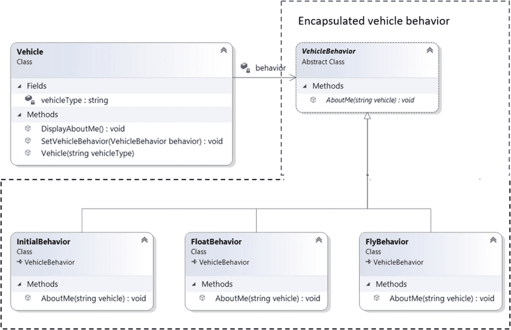
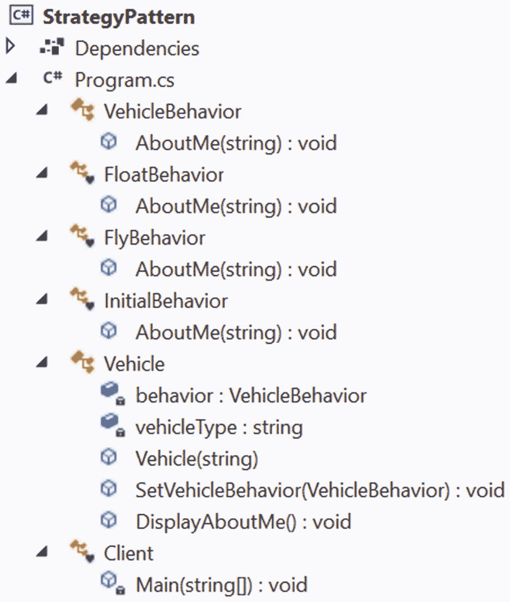

# 十五、策略模式

本章涵盖了策略模式。它也被称为策略模式。

## GoF 定义

定义一系列算法，封装每一个算法，并使它们可以互换。策略让算法独立于使用它的客户端而变化。

## 概念

客户端可以在运行时从一组算法中动态选择一个算法。这种模式还提供了一种使用所选算法的简单方法。

你知道一个对象可以有状态和行为。其中一些行为可能会因类的对象而异。这种模式侧重于在特定时间与对象相关联的变化行为。

在我们的例子中，您会看到一个`Vehicle`类。您可以使用该类创建一个车辆对象。创建车辆对象后，可以向该对象添加和设置行为。在客户端代码中，您也可以用新行为替换当前行为。最有趣的是，您会看到，由于行为是可以改变的，定义行为的是*而不是*；它只是将任务委托给车辆引用的对象。整体实现可以让你概念更清晰。

## 真实世界的例子

在一场足球比赛中，如果 A 队在比赛快结束时以 1 比 0 领先 B 队，A 队不会进攻，而是防守以保持领先。与此同时，B 队全力以赴去扳平比分。

## 计算机世界的例子

假设您有一个备份内存插槽。如果您的主内存已满，但您需要存储更多数据，您可以使用备份内存插槽。如果您没有这个备份内存插槽，并且您试图将额外的数据存储到您的主内存中，这些数据将被丢弃(当主内存已满时)。在这些情况下，您可能会得到异常，或者您可能会遇到一些特殊的行为(基于程序的架构)。因此，在存储数据之前，运行时检查是必要的。然后你就可以继续了。

## 履行

在这个实现中，我只关注车辆行为的变化。在实现中，您可以看到，一旦创建了一个车辆对象，它就与一个`InitialBehavior,`相关联，这个`InitialBehavior,`简单地声明在这种状态下，车辆不能做任何特殊的事情。但是一旦你设置了一个`FlyBehavior`，车辆就能飞起来。当你设定`FloatBehavior`时，它可以浮动。所有*变化的*行为都在一个单独的层级中维护。

```cs
    /// <summary>
    /// Abstract Behavior
    /// </summary>
    public abstract class VehicleBehavior
    {
        public abstract void AboutMe(string vehicle);
    }
    /// <summary>
    /// Floating capability
    /// </summary>
    class FloatBehavior : VehicleBehavior
    {
        public override void AboutMe(string vehicle)
        {
            Console.WriteLine($"My {vehicle} can float now.");
        }
    }
    /// <summary>
    /// Flying capability
    /// </summary>
    class FlyBehavior : VehicleBehavior
    {
        public override void AboutMe(string vehicle)
        {
            Console.WriteLine($"My {vehicle} can fly now.");
        }
    }
    /// <summary>
    /// Initial behavior. Cannot do anything special.
    /// </summary>
    class InitialBehavior : VehicleBehavior
    {
        public override void AboutMe(string vehicle)
        {
            Console.WriteLine($"My {vehicle} is just born.It cannot do anything special.");
        }
    }

```

在许多例子中，你会看到一个叫做*上下文类*的术语。`Vehicle`是本演示中的上下文类。该类定义如下。

```cs
    /// <summary>
    /// Context class-Vehicle
    /// </summary>
    public class Vehicle
    {
        VehicleBehavior behavior;
        string vehicleType;
        public Vehicle(string vehicleType)
        {
            this.vehicleType = vehicleType;
            // Setting the initial behavior
            this.behavior = new InitialBehavior();
        }
        /*
         * It's your choice. You may prefer to use a setter
         * method instead of using a constructor.
         * You can call this method whenever we want
         * to change the "vehicle behavior" on the fly.
         */
        public void SetVehicleBehavior(VehicleBehavior behavior)
        {
            this.behavior = behavior;
        }
        /*
        This method will help us to delegate the behavior to
the object referenced by vehicle.You do not know about the object type, but you simply know that this object can tell something about it, i.e. "AboutMe()" method
        */
        public void DisplayAboutMe()
        {
            behavior.AboutMe(vehicleType);
        }
    }

```

您可以看到，在构造函数内部，我设置了初始行为，稍后可以使用`SetVehicleBehavior(...)`方法对其进行修改。`DisplayAboutMe()`将任务委托给特定的对象。

### 类图

图 [15-1](#Fig1) 显示了类图的重要部分。



图 15-1

类图

### 解决方案资源管理器视图

图 [15-2](#Fig2) 显示了程序的高层结构。



图 15-2

解决方案资源管理器视图

### 示范

下面是实现。

```cs
using System;

namespace StrategyPattern
{
    /// <summary>
    /// Abstract Behavior
    /// </summary>
    public abstract class VehicleBehavior
    {
        public abstract void AboutMe(string vehicle);
    }
    /// <summary>
    /// Floating capability
    /// </summary>
    class FloatBehavior : VehicleBehavior
    {
        public override void AboutMe(string vehicle)
        {
            Console.WriteLine($"My {vehicle} can float now.");
        }
    }
    /// <summary>
    /// Flying capability
    /// </summary>
    class FlyBehavior : VehicleBehavior
    {
        public override void AboutMe(string vehicle)
        {
            Console.WriteLine($"My {vehicle} can fly now.");
        }
    }
    /// <summary>
    /// Initial behavior.Cannot do anything special.
    /// </summary>
    class InitialBehavior : VehicleBehavior
    {
        public override void AboutMe(string vehicle)
        {
            Console.WriteLine($"My {vehicle} is just born.It cannot do anything special.");
        }
    }
    /// <summary>
    /// Context class-Vehicle
    /// </summary>
    public class Vehicle
    {
        VehicleBehavior behavior;
        string vehicleType;
        public Vehicle(string vehicleType)
        {
            this.vehicleType = vehicleType;
            //Setting the initial behavior
            this.behavior = new InitialBehavior();
        }
        /*
         * It's your choice. You may prefer to use a setter
         * method instead of using a constructor.
         * You can call this method whenever we want
         * to change the "vehicle behavior" on the fly.
         */
        public void SetVehicleBehavior(VehicleBehavior behavior)
        {
            this.behavior = behavior;
        }
        /*
        This method will help us to delegate the behavior to
the object referenced by vehicle.You do not know about the object type, but you simply know that this object can tell something about it, i.e. "AboutMe()" method
        */
        public void DisplayAboutMe()
        {
            behavior.AboutMe(vehicleType);
        }
    }
    /// <summary>
    /// Client code
    /// </summary>
    class Client
    {
        static void Main(string[] args)
        {
            Console.WriteLine("***Strategy Pattern Demo.***\n");
            Vehicle context = new Vehicle("Aeroplane");
            context.DisplayAboutMe();
            Console.WriteLine("Setting flying capability to vehicle.");
            context.SetVehicleBehavior(new FlyBehavior());
            context.DisplayAboutMe();

            Console.WriteLine("Changing the vehicle behavior again.");
            context.SetVehicleBehavior(new FloatBehavior());
            context.DisplayAboutMe();

            Console.ReadKey();
        }
    }
}

```

### 输出

这是输出。

```cs
***Strategy Pattern Demo.***

My Aeroplane is just born.It cannot do anything special.
Setting flying capability to vehicle.
My Aeroplane can fly now.
Changing the vehicle behavior again.
My Aeroplane can float now.

```

## 问答环节

在我看来，你专注于改变行为让一切都变得复杂了。此外，我不明白为什么我需要上下文类。您可以简单地使用继承机制并继续。你能解决这些问题吗？

如果一个行为对于所有子类型都是通用的，那么使用继承是没问题的，例如，你可以创建一个抽象类，将通用行为放入其中，这样所有的子类都可以获得通用行为。但是，当行为可以在对象之间变化，并且使用继承来维护它们很困难时，策略的真正力量就显现出来了。

例如，假设你从不同的行为开始，你把它们放在一个抽象类中，如下所示。

```cs
    public abstract class Vehicle
    {
        public abstract void AboutMe();
        public abstract void FloatBehavior();
        public abstract void FlyBehavior();

        public virtual void DefaultJob()
        {
            Console.WriteLine("By default, I float.");
        }
    }

```

现在假设`Boat`和`Aeroplane`是从它继承的两个具体类。您知道一个`Boat`对象不应该飞行，所以在`Boat`类中，您可以简单地如下重写`FlyBehavior`。

```cs
    public override void FlyBehavior()
    {
        throw new NotImplementedException();
    }

```

同样的，`Aeroplane`物体也不应该浮在水中(正常情况下)。所以，在`Aeroplane`类中，你可以如下重写`FloatBehavior`。

```cs
    public override void FloatBehavior()
    {
     throw new NotImplementedException();
    }

```

现在考虑一下，像这样的对象有很多变化的行为。这种维护可能是开销。

除此之外，让我们考虑一种具有特殊功能的特殊车辆。如果你只是把这些特殊的特性放在抽象类中，所有其他的 vehicle 对象都会继承这些特性并需要实现它们。但这还没有结束。进一步，假设在`Boat`类上有一个约束，简单地说它不能有任何这样的特殊行为。现在您遇到了一个死锁情况。如果实现这个特殊的方法，就违反了约束。如果您不实现它，系统架构就会崩溃，因为语言构造要求您实现该行为。(或者，您需要用`abstract`关键字标记该类，但同时，请记住您不能从抽象类创建实例。)

为了克服这一点，我可以创建一个单独的继承层次结构，用一个接口来保存所有的专用特性，如果需要的话，我的类可以实现这个接口。但是，这可能部分解决了问题，因为接口可能包含多个方法，而您的类可能只需要实现其中的一个。最后，在任何一种情况下，整体维护都变得很困难。除此之外，特殊的行为可能会改变，在这种情况下，您需要跟踪实现这些行为的所有类。

在这种情况下，上下文类充当了救世主的角色。比如对于`Boat`类对象，客户端*不*设置 fly 行为，或者对于`Aeroplane`类对象，客户端*不*设置 float 行为；他仅仅知道特定车辆的预期行为。所以，如果你愿意，你可以防止客户错误地给车辆设置不正确的行为。

为了简化这一点，context 类为变化的行为保存一个引用变量，并将任务委托给适当的行为类。这就是为什么您会在我们的`Vehicle`上下文类中看到下面的片段。

```cs
    public class Vehicle
    {
        VehicleBehavior behavior;
        //Some other code
        /*
         * It's your choice. You may prefer to use a setter
         * method instead of using a constructor.
         * You can call this method whenever we want
         * to change the "vehicle behavior" on the fly.
         */
        public void SetVehicleBehavior(VehicleBehavior behavior)
        {
            this.behavior = behavior;
        }
       //Some other code
    }

```

对于这个例子,“has-a”关系比“is-a”关系更合适，这也是大多数设计模式鼓励复合而不是继承的主要原因之一。

15.2 使用策略设计模式的主要优势是什么？

以下是一些关键优势。

*   这种设计模式使你的类独立于算法。在这里，一个类在运行时动态地将算法委托给策略对象(封装了算法)。因此，算法的选择在编译时不受限制。

*   维护您的代码库更容易。

*   它很容易扩展。

这方面可以参考问答 15.1 的回答。

**15.3 与策略设计模式相关的主要挑战是什么？**

缺点可以总结如下。

*   添加上下文类会导致应用中存在更多的对象。

*   应用的用户必须了解不同的策略；否则，输出可能会让他们大吃一惊。