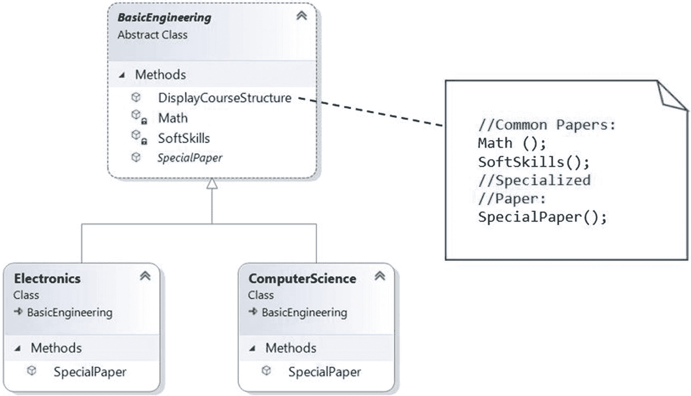
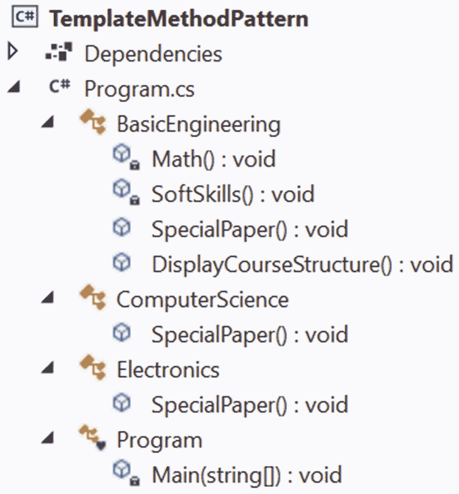

# 十六、模板方法模式

本章涵盖了模板方法模式。

## GoF 定义

在操作中定义算法的框架，将一些步骤推迟到子类。模板方法允许子类在不改变算法结构的情况下重新定义算法的某些步骤。

## 概念

使用这种模式，您可以从算法的最小或基本结构开始。然后你将一些责任委托给子类。因此，派生类可以在不改变算法流程的情况下重新定义算法的某些步骤。

简单地说，这种设计模式在实现多步算法但允许通过子类定制时非常有用。

## 真实世界的例子

当你点比萨饼时，餐馆的厨师可以使用基本的机制来准备比萨饼，但他可能允许你选择最终的材料。例如，顾客可以选择不同的配料，如培根、洋葱、额外的奶酪、蘑菇等。因此，就在送披萨之前，厨师可以包括这些选择。

## 计算机世界的例子

假设你被雇佣来设计一个在线工程学位课程。你知道，一般来说，课程的第一学期对所有课程都是一样的。对于随后的学期，你需要根据学生选择的课程在申请中添加新的论文或科目。

当您希望避免应用中的重复代码，但允许子类更改基类工作流的某些特定细节，以便为应用带来不同的行为时，模板方法模式是有意义的。(但是，您可能不希望完全覆盖基方法来对子类进行彻底的更改。这样，模式不同于简单的多态。)

## 履行

假设每个工科学生需要在最初几个学期通过数学考试并展示软技能(如沟通技能、人员管理技能等等)才能获得学位。后来，你根据他们选择的道路(计算机科学或电子)在他们的课程中添加特殊的论文。

为此，在抽象类`BasicEngineering,`中定义了一个模板方法`DisplayCourseStructure()`，如下所示。

```cs
    /// <summary>
    /// Basic skeleton of actions/steps
    /// </summary>
    public abstract class BasicEngineering
    {

        //The following method(step) will NOT vary
        private void Math()
        {
            Console.WriteLine("1.Mathematics");
        }
        //The following method(step) will NOT vary
        private  void SoftSkills()
        {
            Console.WriteLine("2.SoftSkills");
        }
        /*
        The following method will vary.It will be
        overridden by derived classes.
        */

        public abstract void SpecialPaper();

        //The "Template Method"
        public void DisplayCourseStructure()
        {
            //Common Papers:
            Math();
            SoftSkills();
            //Specialized Paper:
            SpecialPaper();
        }
    }

```

注意，`BasicEngineering`的子类不能改变`DisplayCourseStructure()`方法的流程，但是它们可以覆盖`SpecialPaper()`方法以包含特定于课程的细节，并使最终的课程列表彼此不同。

名为`ComputerScience`和`Electronics`的具体类是`BasicEngineering,`的子类，它们借此机会覆盖了`SpecialPaper()`方法。下面的代码段展示了来自`ComputerScience`类的这样一个例子。

```cs
//The concrete derived class-ComputerScience
public class ComputerScience : BasicEngineering
{
  public override void SpecialPaper()
  {
        Console.WriteLine("3.Object-Oriented Programming");
  }
}

```

### 类图

图 [16-1](#Fig1) 显示了类图的重要部分。



图 16-1

类图

### 解决方案资源管理器视图

图 [16-2](#Fig2) 显示了程序的高层结构。



图 16-2

解决方案资源管理器视图

### 演示 1

下面是实现。

```cs
using System;

namespace TemplateMethodPattern
{
    /// <summary>
    /// Basic skeleton of actions/steps
    /// </summary>
    public abstract class BasicEngineering
    {

        //The following method(step) will NOT vary
        private void Math()
        {
            Console.WriteLine("1.Mathematics");
        }
        //The following method(step) will NOT vary
        private  void SoftSkills()
        {
            Console.WriteLine("2.SoftSkills");
        }
        /*
        The following method will vary.It will be
        overridden by derived classes.
        */

        public abstract void SpecialPaper();

        //The "Template Method"
        public void DisplayCourseStructure()
        {
            //Common Papers:
            Math();
            SoftSkills();
            //Specialized Paper:
            SpecialPaper();
        }
    }

    //The concrete derived class-ComputerScience
    public class ComputerScience : BasicEngineering
    {
        public override void SpecialPaper()
        {
            Console.WriteLine("3.Object-Oriented Programming");
        }
    }

    //The concrete derived class-Electronics
    public class Electronics : BasicEngineering
    {
        public override void SpecialPaper()
        {
            Console.WriteLine("3.Digital Logic and Circuit Theory");
        }
    }

    //Client code
    class Program
    {
        static void Main(string[] args)
        {

            Console.WriteLine("***Template Method Pattern Demonstration-1.***\n");
            BasicEngineering bs = new ComputerScience();
            Console.WriteLine("Computer Science course includes the following subjects:");
            bs.DisplayCourseStructure();
            Console.WriteLine();
            bs = new Electronics();
            Console.WriteLine("Electronics course includes the following subjects:");
            bs.DisplayCourseStructure();
            Console.ReadLine();
        }
    }
}

```

### 输出

这是输出。

```cs
***Template Method Pattern Demonstration-1.***

Computer Science course includes the following subjects:
1.Mathematics
2.SoftSkills
3.Object-Oriented Programming

Electronics course includes the following subjects:
1.Mathematics
2.SoftSkills
3.Digital Logic and Circuit Theory

```

## 问答环节

在这种模式中，子类可以根据他们的需要简单地重新定义方法。这是正确的吗？

是的。

**16.2 抽象类** `BasicEngineering` **中，只有一个方法是抽象的，其他两个方法都是具体的方法。这背后的原因是什么？**

这是一个只有三个方法的简单例子，您希望子类只覆盖这里的`SpecialPaper()`方法。其他方法是两个课程共有的，它们不需要被子类覆盖。

**16.3 假设你想在** `BasicEngineering` **类中添加更多的方法，但是当且仅当你的子类需要这些方法时，你才想使用它们；否则，你忽略它们。这种情况在一些博士项目中很常见，在这些项目中有些课程是必修的，但是如果一个学生有一定的资格，他可能不需要参加这些课程的讲座。可以用模板方法模式设计这种情况吗？**

是的，你可以。基本上，你想使用一个钩子，这是一个可以帮助你控制算法流程的方法。

为了展示这种设计的一个例子，现在我在`BasicEngineering`中增加了一个叫做`IncludeAdditionalPaper()`的方法。我们假设，默认情况下，这门学科包含在课程列表中，但电子专业的学生可以选择退出这门课程。

修改后的`BasicEngineering`类现在看起来像下面这样(注意指出重要变化的粗线)。

```cs
    /// <summary>
    /// Basic skeleton of actions/steps
    /// </summary>
    public abstract class BasicEngineering
    {
        //The following method(step) will NOT vary
        private void Math()
        {
            Console.WriteLine("1.Mathematics");
        }
        //The following method(step) will NOT vary
        private void SoftSkills()
        {
            Console.WriteLine("2.SoftSkills");
        }
        /*
        The following method will vary.It will be
        overridden by derived classes.
        */

        public abstract void SpecialPaper();

        //The "Template Method"
        public void DisplayCourseStructure()
        {
            //Common Papers:
            Math();
            SoftSkills();
            //Specialized Paper:
            SpecialPaper();
            //Include an additional subject if required.
            if (IsAdditionalPaperNeeded())
            {
                IncludeAdditionalPaper();
            }
        }

        private void IncludeAdditionalPaper()
        {
            Console.WriteLine("4.Compiler Design.");
        }
        //A hook method.
        //By default,an additional subject is needed
        public virtual bool IsAdditionalPaperNeeded()
        {
            return true;
        }
    }

```

由于电子类不需要包含附加方法，因此定义如下:

```cs
    //The concrete derived class-Electronics
    public class Electronics : BasicEngineering
    {
        public override void SpecialPaper()
        {
            Console.WriteLine("3.Digital Logic and Circuit Theory");
        }
        //Using the hook method now.
        //Additional paper is not needed for Electronics.
        public override bool IsAdditionalPaperNeeded()
        {
            return false;
        }

    }

```

现在让我们来看一下程序和输出。

### 演示 2

下面是修改后的实现。关键变化以粗体显示。

```cs
using System;

namespace TemplateMethodPattern
{
    /// <summary>
    /// Basic skeleton of actions/steps
    /// </summary>
    public abstract class BasicEngineering
    {
        //The following method(step) will NOT vary
        private void Math()
        {
            Console.WriteLine("1.Mathematics");
        }
        //The following method(step) will NOT vary
        private void SoftSkills()
        {
            Console.WriteLine("2.SoftSkills");
        }
        /*
        The following method will vary.It will be
        overridden by derived classes.
        */

        public abstract void SpecialPaper();

        //The "Template Method"
        public void DisplayCourseStructure()
        {
            //Common Papers:
            Math();
            SoftSkills();
            //Specialized Paper:
            SpecialPaper();
            //Include an additional subject if required.
            if (IsAdditionalPaperNeeded())
            {
                IncludeAdditionalPaper();
            }
        }

        private void IncludeAdditionalPaper()
        {
            Console.WriteLine("4.Compiler Design.");
        }
        //A hook method.
        //By default,an additional subject is needed.
        public virtual bool IsAdditionalPaperNeeded()
        {
            return true;
        }
    }

    //The concrete derived class-ComputerScience
    public class ComputerScience : BasicEngineering
    {
        public override void SpecialPaper()
        {
            Console.WriteLine("3.Object-Oriented Programming");
        }
        //Not tested the hook method.
        //An additional subject is needed
    }

    //The concrete derived class-Electronics
    public class Electronics : BasicEngineering
    {
        public override void SpecialPaper()
        {
            Console.WriteLine("3.Digital Logic and Circuit Theory");
        }
        //Using the hook method now.
        //Additional paper is not needed for Electronics.
        public override bool IsAdditionalPaperNeeded()
        {
            return false;
        }

    }

    //Client code
    class Program
    {
        static void Main(string[] args)
        {

            Console.WriteLine("***Template Method Pattern Demonstration-2.***\n");
            BasicEngineering bs = new ComputerScience();
            Console.WriteLine("Computer Science course includes the following subjects:");
            bs.DisplayCourseStructure();
            Console.WriteLine();
            bs = new Electronics();
            Console.WriteLine("Electronics course includes the following subjects:");
            bs.DisplayCourseStructure();
            Console.ReadLine();
        }
    }
}

```

### 输出

这是修改后的输出。

```cs
***Template Method Pattern Demonstration-2.***

Computer Science course includes the following subjects:
1.Mathematics
2.SoftSkills
3.Object-Oriented Programming
4.Compiler Design.

Electronics course includes the following subjects:
1.Mathematics
2.SoftSkills
3.Digital Logic and Circuit Theory

```

Note

你可能更喜欢另一种方法。例如，您可以在`BasicEngineering`中直接包含名为`IncludeAdditionalPaper()`的默认方法。之后，您可以覆盖`Electronics`类中的方法，并使方法体为空。但是这种方法与前面的方法相比并没有看起来更好。

看起来这个模式类似于 Builder 模式。这是正确的吗？

不。不要忘记核心意图；模板方法模式是一种行为设计模式，而构建器是一种创造设计模式。在构建者模式中，客户/顾客是老板。他们可以控制算法的顺序。在模板方法模式中，您(或开发人员)是老板。您将代码放在一个中心位置(例如，本例中的抽象类`BasicEngineering.cs`),并且您对执行流程拥有绝对的控制权，这是客户端无法更改的。例如，您可以看到数学和软技能总是出现在顶部，遵循模板方法`DisplayCourseStructure()`中的执行顺序。客户端需要遵守这个流程。

如果您改变了模板方法中的流程，其他参与者也将遵循新的流程。

使用模板方法设计模式的主要优势是什么？

以下是一些关键优势。

*   你可以控制算法的流程。客户端无法更改它们。

*   常见操作集中在一个位置。例如，在一个抽象类中，子类可以只重定义变化的部分，这样就可以避免多余的代码。

16.6 与模板方法设计模式相关的主要挑战是什么？

缺点可以总结如下。

*   客户端代码不能指导步骤的顺序。如果您想要这种类型的功能，请使用构建器模式。

*   子类可以覆盖父类中定义的方法

    (换句话说，在父类中隐藏原始定义)，这可能违反 Liskov 替换原则，该原则基本上说，如果 S 是 T 的子类型，那么 T 类型的对象可以用 S 类型的对象替换。

*   子类越多，意味着代码越分散，维护越困难。

16.7 如果一个子类试图覆盖基础工程中的其他父方法，会发生什么？

这种模式建议不要这样做。当您使用这种模式时，您不应该完全覆盖所有的父方法来给子类带来根本性的改变。这样，它不同于简单的多态。

**16.8 这种模式与策略模式** **有何不同？**

你找到了一个好的切入点。是的，策略和模板方法模式有相似之处。在策略中，您可以使用委托来改变整个算法；然而，模板方法模式建议您使用继承来改变算法中的某些步骤，但是算法的整体流程是不变的。