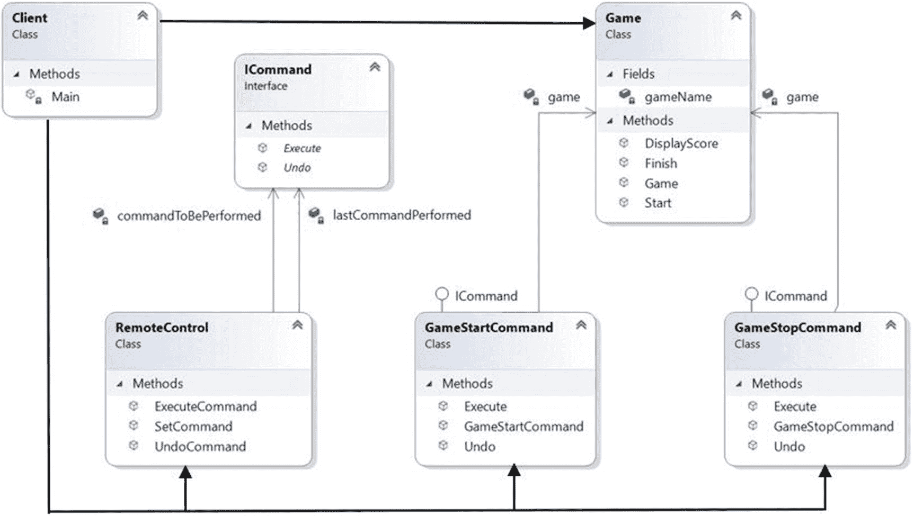
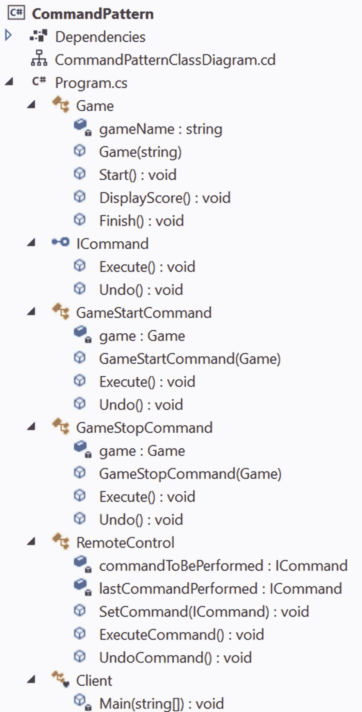

# 十七、命令模式

本章介绍了命令模式。

## GoF 定义

将请求封装为一个对象，从而允许您用不同的请求、队列或日志请求参数化客户端，并支持可撤销的操作。

## 概念

使用这种模式，您可以封装一个方法调用过程。这里，一个对象可以通过某种明确的方法调用一个操作，而不用担心如何执行这个操作。这种模式是那些仅仅通过阅读描述通常很难理解的模式之一。当您看到实现时，这个概念会变得更加清晰。所以，请跟我一起继续阅读，直到看到演示 1。

一般来说，这里有四个术语很重要:*调用方*、*客户端*、*命令方*和*接收方*，具体如下。

*   命令对象由接收者执行的动作组成。

*   一个*命令*对象可以以特定于接收者的类的方式调用接收者的方法。然后*接收器*开始处理作业(或动作)。

*   命令对象被单独传递给*调用者*对象来调用命令。invoker 对象包含具体化的方法，通过这些方法，客户端可以执行工作，而不用担心目标接收者如何执行实际的工作。

*   *客户端*对象保存调用程序对象和命令对象。客户端只作出决定(即执行哪些命令)，然后将命令传递给调用程序对象来执行。

## 真实世界的例子

当你在画一幅画的时候，你可能需要重画(撤销)它的一些部分来使它变得更好。

## 计算机世界的例子

通常，您可以在编辑器或集成开发环境(IDE)的菜单系统中观察到这种模式。例如，您可以使用命令模式来支持撤销、多次撤销或软件应用中的类似操作。

微软在 Windows 演示基础(WPF)中使用了这种模式。出现在 *Visual Studio 杂志* ( [`https://visualstudiomagazine.com/articles/2012/04/10/command-pattern-in-net.aspx`](https://visualstudiomagazine.com/articles/2012/04/10/command-pattern-in-%25C2%25ADnet.aspx) )上的一篇 2012 年的文章详细描述了它。命令模式非常适合处理 GUI 交互。它工作得非常好，微软已经将其紧密集成到 Windows 演示基础(WPF)堆栈中。最重要的部分是来自 `System.Windows.Input` *名称空间的* `ICommand` *接口。任何实现了* `ICommand` *接口的类都可以通过通用的* `WPF` *控件来处理键盘或鼠标事件。这种链接既可以在* `XAML` *中完成，也可以在代码隐藏中完成。*

另外，如果你熟悉 Java 或者 Swing，你看到`Action`也是一个命令对象。

## 履行

在这个例子中，`RemoteControl`是 Invoker 类。`GameStartCommand`和`GameStartCommand`是表示命令的具体类。这两个类实现了公共接口`ICommand` `,`，如下所示(相关注释说明了每个方法的用途)。

```cs
  public interface ICommand
  {
        // To execute a command
        void Execute();
        // To undo last command execution
        void Undo();
    }

```

`Game`是接收器类，其定义如下。

```cs
public class Game
{
  string gameName;
  public Game(string name)
   {
     this.gameName = name;
   }
  public void Start()
   {
     Console.WriteLine($"{gameName} is on.");
   }
  public void DisplayScore()
   {
     Console.WriteLine("The score is changing time to time.");
   }
  public void Finish()
   {
     Console.WriteLine($"---The game of {gameName} is over.---");
   }
}

```

当客户端使用一个`GameStopCommand`命令并对一个`Invoker`对象调用`ExecuteCommand`方法时，如下所示。

```cs
invoker.ExecuteCommand();

```

目标接收者(本例中的`Game`类对象)只执行以下动作。

```cs
game.Finish();

```

但是当客户端使用一个`GameStartCommand`命令并使用如下代码调用一个`Invoker`对象上的`ExecuteCommand`方法时。

```cs
invoker.ExecuteCommand();

```

目标接收者(本例中的`Game`类对象)执行以下一组动作。

```cs
game.Start();
game.DisplayScore();

```

所以，你可以看到一个命令不需要只执行一个动作；相反，根据您的需要，您可以在目标接收者上执行一系列操作，并将它们封装在一个命令对象中。

Points to Note

本章中的例子展示了撤销操作的简单演示。撤消的实现取决于规范，在某些情况下可能很复杂。对于演示 1，我简单地假设撤销调用只是撤销上一个成功执行的命令。`GameStartCommand`和`GameStopCommand`类的`Execute()`和`Undo()`方法正在做相反的事情。也就是说，当客户端使用`GameStopCommand`调用撤销操作时，游戏重启并显示分数(在本例中是一个简单的控制台消息)。但是如果客户端使用`GameStartCommand`调用撤销操作，游戏会立即停止。这类似于打开一盏灯，关掉同样的灯；或者将一个数加到一个目标数上，作为相反的情况，再次从结果数中减去相同的数。

最后，看看下面的代码段，这是我如何创建一个命令对象的。

```cs
Game gameName = new Game("Golf");
// Command to start the game
GameStartCommand gameStartCommand = new GameStartCommand(gameName);

```

我将命令设置为调用程序，并使用它的`ExecuteCommand()`方法来执行命令。后来，我又撤销了这个。我保留了控制台消息以帮助您理解。

```cs
Console.WriteLine("**Starting the game and performing undo immediately.**");
invoker.SetCommand(gameStartCommand);
invoker.ExecuteCommand();
// Performing undo operation
Console.WriteLine("\nUndoing the previous command now.");
invoker.UndoCommand();

```

### 类图

图 [17-1](#Fig1) 为类图。



图 17-1

类图

### 解决方案资源管理器视图

图 [17-2](#Fig2) 显示了程序的高层结构。



图 17-2

解决方案资源管理器视图

### 演示 1

这是完整的程序。

```cs
using System;

namespace CommandPattern
{
    /// <summary>
    ///  Receiver Class
    /// </summary>
    public class Game
    {
        string gameName;
        public Game(string name)
        {
            this.gameName = name;
        }
        public void Start()
        {
            Console.WriteLine($"{gameName} is on.");
        }
        public void DisplayScore()
        {
            Console.WriteLine("The score is changing time to time.");
        }
        public void Finish()
        {
            Console.WriteLine($"---The game of {gameName} is over.---");
        }

    }
    /// <summary>
    /// The command interface
    /// </summary>
    public interface ICommand
    {
        // To execute a command
        void Execute();
        // To undo last command execution
        void Undo();

    }
    /// <summary>
    /// GameStartCommand
    /// </summary>
    public class GameStartCommand : ICommand
    {
        private Game game;
        public GameStartCommand(Game game)
        {
            this.game = game;
        }
        public void Execute()
        {
            game.Start();
            game.DisplayScore();
        }

        public void Undo()
        {
            Console.WriteLine("Undoing start command.");
            game.Finish();
        }
    }
    /// <summary>
    /// GameStopCommand
    /// </summary>

    public class GameStopCommand : ICommand
    {
        private Game game;
        public GameStopCommand(Game game)
        {
            this.game = game;
        }
        public void Execute()
        {
            Console.WriteLine("Finishing the game.");
            game.Finish();
        }

        public void Undo()
        {
            Console.WriteLine("Undoing stop command.");
            game.Start();
            game.DisplayScore();
        }
    }

    /// <summary>
    /// Invoker class
    /// </summary>
    public class RemoteControl
    {
        ICommand commandToBePerformed, lastCommandPerformed;
        public void SetCommand(ICommand command)
        {
            this.commandToBePerformed = command;
        }
        public void ExecuteCommand()
        {
            commandToBePerformed.Execute();
            lastCommandPerformed = commandToBePerformed;
        }

        public void UndoCommand()
        {
            // Undo the last command executed
            lastCommandPerformed.Undo();
        }
    }
    /// <summary>
    /// Client code
    /// </summary>
    class Client
    {
        static void Main(string[] args)
        {
            Console.WriteLine("***Command Pattern Demonstration***\n");

            /* Client holds both the Invoker and Command Objects */
            RemoteControl invoker = new RemoteControl();

            Game gameName = new Game("Golf");
            // Command to start the game
            GameStartCommand gameStartCommand = new GameStartCommand(gameName);
            // Command to stop the game
            GameStopCommand gameStopCommand = new GameStopCommand(gameName);

            Console.WriteLine("**Starting the game and performing undo immediately.**");
            invoker.SetCommand(gameStartCommand);
            invoker.ExecuteCommand();
            // Performing undo operation
            Console.WriteLine("\nUndoing the previous command now.");
            invoker.UndoCommand();

            Console.WriteLine("\n**Starting the game again.Then stopping it and undoing the stop operation.**");
            invoker.SetCommand(gameStartCommand);
            invoker.ExecuteCommand();
            // Stop command to finish the game
            invoker.SetCommand(gameStopCommand);
            invoker.ExecuteCommand();
            // Performing undo operation
            Console.WriteLine("\nUndoing the previous command now.");
            invoker.UndoCommand();

            Console.ReadKey();
        }
    }
}

```

### 输出

这是输出。

```cs
***Command Pattern Demonstration***

**Starting the game and performing undo immediately.**
Golf is on.
The score is changing time to time.

Undoing the previous command now.
Undoing start command.
---The game of Golf is over.---

**Starting the game again.Then stopping it and undoing the stop operation.**
Golf is on.
The score is changing time to time.
Finishing the game.
---The game of Golf is over.---

Undoing the previous command now.
Undoing stop command.
Golf is on.
The score is changing time to time.

```

## 问答环节

17.1 GoF 定义从“封装请求”开始在演示 1 中，你是如何实现 **封装** **的？**

命令对象包含一组针对特定接收器的操作。当您设置命令并在 invoker 对象上调用`ExecuteCommand()`时，预期的动作在接收者端执行。从外面看，没有其他物体知道这是如何发生的；他们只知道如果他们调用`ExecuteCommand()`，他们的请求就会被处理。

遵循 GoF 定义，你如何参数化其他有不同请求的对象？

注意，我首先在 invoker 中设置了`GameStartCommand`，后来，我用`GameStopCommand.Invoker`对象替换了它，在两种情况下都简单地调用了`ExecuteCommand()`。

在这个例子中，你只和一个接收者打交道。你如何处理多个接收者？

在这个例子中，Game 是 receiver 类，但是没有人限制您创建一个新的类，并遵循演示 1 中所示的实现。另外，请注意，您使用下面的代码行创建了一个`Game`类对象。

```cs
Game gameName = new Game("Golf");

```

由于`Game`类构造函数接受一个字符串参数，您也可以传递一个不同的值并创建一个不同的对象。以下代码段是一个示例。

```cs
Console.WriteLine("\nPlaying another game now.(Optional for you)");

gameName = new Game("Soccer");
// Command to start the game
gameStartCommand = new GameStartCommand(gameName);
// Command to stop the game
gameStopCommand = new GameStopCommand(gameName);

// Starting the game
invoker.SetCommand(gameStartCommand);
invoker.ExecuteCommand();

// Stopping the game
invoker.SetCommand(gameStopCommand);
invoker.ExecuteCommand();

The previous code segment can generate the following output as expected:
Playing another game now.(Optional for you)
Soccer is on.
The score is changing time to time.
Finishing the game.
---The game of Soccer is over.---

```

**17.4 我可以忽略 invoker 对象吗？**

很多时候，程序员试图在面向对象编程(OOP)中封装数据和相应的方法。但是你发现在命令模式中，你在尝试封装命令对象。换句话说，您正在从不同的角度实现封装。

我之前告诉过你，当调用 invoker 对象的`ExecuteCommand()`时，预期的动作在接收者端执行。从外面看，没有其他物体知道它是如何发生的；他们只知道如果他们调用`ExecuteCommand(),`，他们的请求就会被处理。因此，简单地说，一个调用程序包含一些明确的方法，通过这些方法，客户端可以执行一项工作，而不用担心实际的工作在接收端是如何执行的。

当您需要处理一组复杂的命令时，这种方法很有意义。

让我们再看一遍条款。您创建命令对象，并将其传递给一些接收者来访问它们，然后通过调用命令对象的方法的调用者来执行这些命令(例如，本例中的`ExecuteCommand`)。对于一个简单的用例，这个 invoker 类不是强制性的。例如，考虑这样一种情况，其中一个命令对象只有一个方法要执行，并且您正试图免除调用程序来调用该方法。但是，当您想要跟踪日志文件(或队列)中的一系列命令时，调用程序可能会发挥重要作用。

你为什么要跟踪这些日志？

您可能希望创建撤消或重做操作。

**17.6 指挥模式的主要优势是什么？**

以下是一些优点。

*   创建和最终执行的请求是分离的。客户端可能不知道调用者如何执行操作。

*   您可以创建宏命令(这些是多个命令的序列，可以一起调用。例如，对于宏命令，您可以创建一个类，该类具有一个接受命令列表的构造函数。在它的`Execute()`方法中，您可以使用`for`循环/ `foreach`循环依次调用这些命令中的`Execute()`。

*   可以在不影响现有系统的情况下添加新命令。

*   最重要的是，您可以支持急需的撤销(和重做)操作。

*   应该注意的是，一旦您简单地创建了一个命令对象，并不意味着计算会立即开始。您可以将它安排在以后，或者将它们放在作业队列中，以后再执行。此外，通过使用线程池，您可以在多线程环境中异步执行它们。(异步编程在本书第 [27](27.html) 章讨论。)

**17.7 指挥模式面临哪些挑战？**

以下是一些缺点。

*   为了支持更多的命令，您需要创建更多的类。因此，随着时间的推移，维护可能会很困难。

*   当出现错误情况时，如何处理错误或决定如何处理返回值变得很棘手。客户可能想知道这些。但是这里您将命令与客户端代码解耦，所以这些情况很难处理。在调用者可以在不同的线程中运行的多线程环境中，这一挑战变得非常重要。

17.8 在演示 1 中，您只撤销了最后一个命令？有什么方法可以实现“撤销全部”吗？此外，您如何记录请求？

问得好。您可以简单地维护一个可以存储命令的堆栈，然后您可以简单地从堆栈中弹出项目并调用它的`undo()`方法。在第 [19 章](19.html)(在 Memento 模式上，类似于这个模式)，我进一步讨论了撤销和各种实现。现在，让我向您展示一个简单的例子，在这个例子中，您可以撤销所有以前的命令。演示 2 就是为此而做的。它是对演示 1 的简单修改，因此省略了类图和解决方案资源管理器视图；可以直接跳转到实现中。

你问了另一个关于如何记录请求的问题。在演示 2 中，当我维护列表来存储执行的命令时，我使用这个列表来支持使用单个方法调用“撤销所有命令”。同一个列表可以作为您可以在控制台中打印的命令历史。或者，您可以创建一个单独的文件来保存每次命令执行时的详细信息。如有必要，稍后您可以检索该文件进行详细查看。

## 修改的实现

这个例子向你展示了一种调用多个撤销操作的方法。对 invoker 类做了一些小的修改。我维护一个列表来存储所有执行的命令。每当一个命令被执行时，它都会被添加到列表中，稍后当我调用`UndoAll()`时，我可以简单地迭代这个列表并调用相应的撤销操作。调用者以粗体显示主要变化，如下所示。

```cs
/// <summary>
/// Invoker class
/// </summary>
public class RemoteControl
{
 ICommand commandToBePerformed, lastCommandPerformed;
 List<ICommand> savedCommands = new List<ICommand>();
 public void SetCommand(ICommand command)
 {
   this.commandToBePerformed = command;
 }
 public void ExecuteCommand()
 {
   commandToBePerformed.Execute();
   lastCommandPerformed = commandToBePerformed;
   savedCommands.Add(commandToBePerformed);
  }
 public void UndoCommand()
  {
    // Undo the last command executed
    lastCommandPerformed.Undo();
   }
 public void UndoAll()
  {
    for (int i = savedCommands.Count; i > 0; i--)
     {
       // Get a restore point and call Undo()
       savedCommands[i - 1].Undo();
      }
   }
}

```

`Game`类现在没有`Start()`方法；相反，它有两个新方法叫做`UpLevel()`和`DownLevel()`，如下所示。

```cs
public void UpLevel()
{
 ++level;
 Console.WriteLine("Level upgraded.");
}
public void DownLevel()
{
 --level;
 Console.WriteLine("Level downgraded.");
}

```

`UpLevel()`方法升级游戏等级。`DownLevel()`方法做相反的事情，所以它被用在`GameStartCommand`类的`Undo`操作中。为了达到我的主要目的(向您展示“撤销全部”)，我不需要这个例子中的`GameStopCommand`类，所以为了使这个例子简短，我也省略了那个类。最后，我做了一个简单的假设，当游戏等级设置为 0 时(即处于出生状态)，如果你执行`Undo()`，游戏就会停止。剩下的代码很容易理解，现在可以开始演示 2 了。

### 演示 2

这是完整的程序。

```cs
using System;
using System.Collections.Generic;

```

```cs
namespace CommandPatternDemonstration2
{
    // Receiver Class
    public class Game
    {
        string gameName;
        public int level;
        public Game(string name)
        {
            this.gameName = name;
            level = -1;
            Console.WriteLine($"Game started.");
        }
        public void DisplayLevel()
        {
            Console.WriteLine($"Current level is set to {level}.");
        }
        public void UpLevel()
        {
            ++level;
            Console.WriteLine("Level upgraded.");
        }
        public void DownLevel()
        {
            --level;
            Console.WriteLine("Level downgraded.");
        }
        public void Finish()
        {
            Console.WriteLine($"---The game of {gameName} is over.---");
        }

    }
    public interface ICommand
    {
        void Execute();
        void Undo();

    }
    /// <summary>
    /// GameStartCommand
    /// </summary>
    public class GameStartCommand : ICommand
    {
        private Game game;
        public GameStartCommand(Game game)
        {
            this.game = game;
        }
        public void Execute()
        {
            game.UpLevel();
            game.DisplayLevel();
        }

        public void Undo()
        {
            if (game.level > 0)
            {
                game.DownLevel();
                game.DisplayLevel();
            }
            else
            {
                game.Finish();
            }
        }
    }

    /// <summary>
    /// Invoker class
    /// </summary>
    public class RemoteControl
    {
        ICommand commandToBePerformed, lastCommandPerformed;
        List<ICommand> savedCommands = new List<ICommand>();
        public void SetCommand(ICommand command)
        {
            this.commandToBePerformed = command;
        }
        public void ExecuteCommand()
        {
            commandToBePerformed.Execute();
            lastCommandPerformed = commandToBePerformed;
            savedCommands.Add(commandToBePerformed);
        }

        public void UndoCommand()
        {
            // Undo the last command executed
            lastCommandPerformed.Undo();
        }
        public void UndoAll()
        {
            for (int i = savedCommands.Count; i > 0; i--)
            {
                // Get a restore point and call Undo()
                savedCommands[i - 1].Undo();
            }
        }
    }
    /// <summary>
    /// Client code
    /// </summary>
    class Client
    {
        static void Main(string[] args)
        {
            Console.WriteLine("***Command Pattern Demonstration2***\n");

            // Client holds both the Invoker and Command Objects
            RemoteControl invoker = new RemoteControl();

            Game gameName = new Game("Golf");
            // Command to start the game
            GameStartCommand gameStartCommand = new GameStartCommand(gameName);

            Console.WriteLine("**Starting the game and upgrading the level 3 times.**");
            invoker.SetCommand(gameStartCommand);
            invoker.ExecuteCommand();
            invoker.ExecuteCommand();
            invoker.ExecuteCommand();

            // Performing undo operation(s) one at a time
            //invoker.UndoCommand();
            //invoker.UndoCommand();
            //invoker.UndoCommand();

            Console.WriteLine("\nUndoing all the previous commands at one shot.");
            invoker.UndoAll();
            Console.ReadKey();
        }
    }
}

```

### 输出

这是新的输出。

```cs
***Command Pattern Demonstration2***

Game started.
**Starting the game and upgrading level 3 times.**
Level upgraded.
Current level is set to 0.
Level upgraded.
Current level is set to 1.
Level upgraded.
Current level is set to 2.

Undoing all the previous commands at one shot.
Level downgraded.
Current level is set to 1.
Level downgraded.
Current level is set to 0.
---The game of Golf is over.---

```