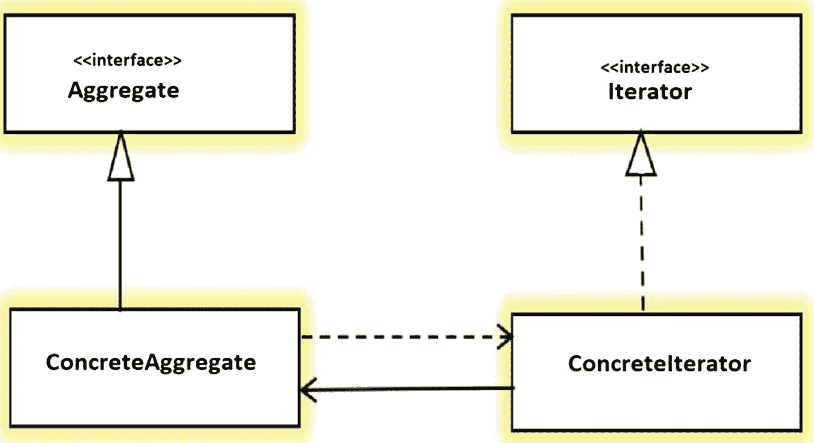
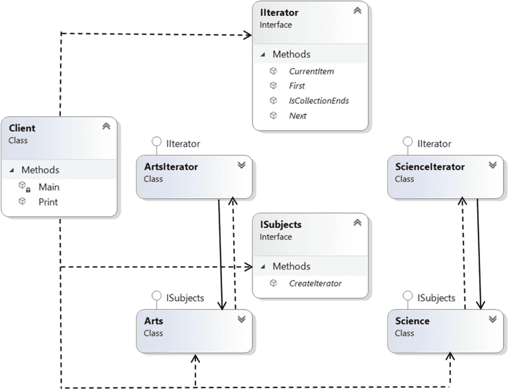
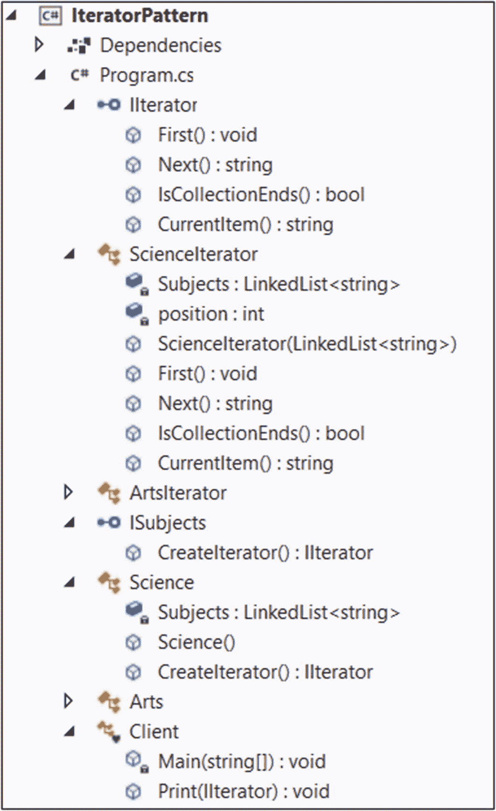

# 十八、迭代器模式

本章涵盖了迭代器模式。

## GoF 定义

提供一种方法来顺序访问聚合对象的元素，而不暴露其底层表示。

## 概念

迭代器通常用于遍历容器(或对象集合)以访问其元素，而不知道数据在内部是如何存储的。当您需要以标准和统一的方式遍历不同种类的集合对象时，它非常有用。图 [18-1](#Fig1) 显示了一个迭代器模式的示例和最常见的图表。



图 18-1

迭代器模式的示例图

参与者描述如下。

*   **迭代器**是访问或遍历元素的接口。

*   **具体迭代器**实现了`Iterator`接口方法。它还可以跟踪聚合遍历中的当前位置。

*   **聚合**定义了一个可以创建`Iterator`对象的接口。

*   **混凝土骨料**实现了`Aggregate`接口。它返回一个`ConcreteIterator`的实例。

Points to Note

*   它经常用于遍历树状结构的节点。在许多例子中，您可能会注意到迭代器模式和组合模式。

*   迭代器的作用不仅限于遍历。这个角色可以改变以支持各种需求。例如，您可以用各种方式过滤元素。

*   客户端看不到实际的遍历机制。客户端程序只使用公共迭代器方法。

*   迭代器和枚举器的概念已经存在很久了。枚举器根据一个标准产生下一个元素，而使用迭代器，你从起点到终点循环一个序列。

*   将 foreach 迭代器应用于由枚举器生成的集合是一种常见的做法。然后，您可以获取该值并将其应用到循环体中。

## 真实世界的例子

假设有两家公司:A 公司和 b 公司。A 公司存储其员工记录(即每个员工的姓名、地址、工资明细等。)在链表数据结构中。B 公司将其员工数据存储在一个数组中。一天，两家公司决定合并成一家大公司。迭代器模式在这种情况下非常方便，因为您不需要从头开始编写代码。在这种情况下，您可以使用一个公共接口来访问两家公司的数据。因此，您可以简单地调用这些方法，而无需重写代码。

考虑另一个例子。假设你的公司决定根据员工的表现提升他们。所以，所有的经理聚在一起，为晋升制定一个共同的标准。然后，他们一个接一个地遍历员工的记录，以标记潜在的晋升候选人。

你也可以考虑不同领域的例子。例如，当您将歌曲存储在您喜欢的音频设备(例如，MP3 播放器)或移动设备中时，您可以通过各种按钮按压或滑动动作来迭代它们。基本思想是为您提供一种机制，以便您可以平滑地迭代您的列表。

## 计算机世界的例子

浏览以下两个要点。这些是迭代器模式的常见例子。

*   C# 拥有在 Visual Studio 2005 中引入的迭代器。在这个上下文中经常使用`foreach`语句。要了解关于这些内置功能的更多信息，请参考 [`https://docs.microsoft.com/en-us/dotnet/csharp/iterators`](https://docs.microsoft.com/en-us/dotnet/csharp/iterators) 。

*   如果你熟悉 Java，可能用过 Java 内置的`Iterator`接口，`java.util.Iterator`。这种模式用于像`java.util.Iterator`或`java.util.Enumeration`这样的接口。

## 履行

类似于我们现实世界的例子，让我们假设有一个学院有两个部门:科学和艺术。艺术系使用数组数据结构来维护其课程细节，但科学系使用链表数据结构来保持不变。行政部门不干涉一个部门如何维护这些细节。它只是对从每个部门获取数据感兴趣，并希望统一访问这些数据。现在假设您是行政部门的成员，在一个新的会话开始时，您想使用迭代器来宣传课程表。让我们看看如何在接下来的演示中实现它。

让我们假设您有一个名为`IIterator` `,`的迭代器，它在接下来的例子中充当公共接口，它目前支持四个基本方法:`First(), Next(), CurrentItem()`和`IsCollectionEnds()`，如下所示。

*   在开始遍历数据结构之前，`First()`方法将指针重置为指向第一个元素。

*   `Next()`方法返回容器中的下一个元素。

*   `CurrentItem()`方法返回迭代器在特定时间指向的容器的当前元素。

*   `IsCollectionEnds()`验证下一个元素是否可用于进一步处理。所以，这个方法帮助你决定你是否已经到达了你的容器的末端。

这些方法在每个`ScienceIterator`和`ArtsIterator`类中实现。您将看到`CurrentItem()`方法在`ScienceIterator`和`ArtIterator`类中有不同的定义。同样，为了打印课程表，我只使用了其中的两种方法:`IsCollectionEnds()`和`Next()`。如果您愿意，可以尝试剩下的两种方法，`First()`和`currentItem()`。我提到了这四种方法，并为它们提供了一些示例实现，因为它们在迭代器模式实现中非常常见。这些示例实现也可以帮助您理解这些示例。

Point to Note

如果你只考虑理科或文科，程序的代码长度可以减半。但是我保留了它们，向您展示迭代器模式可以帮助您在不知道数据在内部是如何存储的情况下进行遍历。对于科学，主题存储在一个链表中，但是对于艺术，主题存储在一个数组中。不过，通过使用这种模式，您可以以统一的方式遍历和打印主题。

### 类图

图 [18-2](#Fig2) 显示了类图。



图 18-2

类图

### 解决方案资源管理器视图

图 [18-3](#Fig3) 显示了程序的高层结构。这是一个很大的程序，很难在一个屏幕截图中容纳所有的内容，所以我只扩展了科学部门的细节。



图 18-3

解决方案资源管理器视图

### 演示 1

下面是实现。

```cs
using System;
using System.Collections.Generic;
using System.Linq;

namespace IteratorPattern
{
    #region Iterator
    public interface IIterator
    {
        // Reset to first element
        void First();
        // Get next element
        string Next();
        // End of collection check
        bool IsCollectionEnds();
        // Retrieve Current Item
        string CurrentItem();
    }

    /// <summary>
    ///  ScienceIterator
    /// </summary>
    public class ScienceIterator : IIterator
    {
        private LinkedList<string> Subjects;
        private int position;

        public ScienceIterator(LinkedList<string> subjects)
        {
            this.Subjects = subjects;
            position = 0;
        }

        public void First()
        {
            position = 0;
        }

        public string Next()
        {
            return Subjects.ElementAt(position++);
        }

        public bool IsCollectionEnds()
        {
            if (position < Subjects.Count)
            {
                return false;
            }
            else
            {
                return true;
            }
        }

        public string CurrentItem()
        {
            return Subjects.ElementAt(position);
        }
    }
    /// <summary>
    ///  ArtsIterator
    /// </summary>
    public class ArtsIterator : IIterator
    {
        private string[] Subjects;
        private int position;
        public ArtsIterator(string[] subjects)
        {
            this.Subjects = subjects;
            position = 0;
        }
        public void First()
        {
            position = 0;
        }

        public string Next()
        {
            //Console.WriteLine("Currently pointing to the subject: "+ this.CurrentItem());
            return Subjects[position++];
        }

        public bool IsCollectionEnds()
        {
            if (position >= Subjects.Length)
            {
                return true;
            }
            else
            {
                return false;
            }
        }

        public string CurrentItem()
        {
            return Subjects[position];
        }
    }
    #endregion

    #region Aggregate

    public interface ISubjects
    {
        IIterator CreateIterator();
    }
    public class Science : ISubjects
    {
        private LinkedList<string> Subjects;

        public Science()
        {
            Subjects = new LinkedList<string>();
            Subjects.AddFirst("Mathematics");
            Subjects.AddFirst("Computer Science");
            Subjects.AddFirst("Physics");
            Subjects.AddFirst("Electronics");
        }

        public IIterator CreateIterator()
        {
            return new ScienceIterator(Subjects);
        }
    }
    public class Arts : ISubjects
    {
        private string[] Subjects;

        public Arts()
        {
            Subjects = new[] { "English", "History", "Geography", "Psychology" };
        }

        public IIterator CreateIterator()
        {
            return new ArtsIterator(Subjects);
        }
    }
    #endregion

    /// <summary>
    /// Client code
    /// </summary>
    class Client
    {
        static void Main(string[] args)
        {

            Console.WriteLine("***Iterator Pattern Demonstration.***");
            // For Science
            ISubjects subjects= new Science();
            IIterator iterator = subjects.CreateIterator();
            Console.WriteLine("\nScience subjects :");
            Print(iterator);

            // For Arts
            subjects = new Arts();
            iterator = subjects.CreateIterator();
            Console.WriteLine("\nArts subjects :");
            Print(iterator);

            Console.ReadLine();
        }
        public static void Print(IIterator iterator)
        {
            while (!iterator.IsCollectionEnds())
            {
                Console.WriteLine(iterator.Next());
            }
        }
    }

}

```

### 输出

这是输出。

```cs
***Iterator Pattern Demonstration.***

Science subjects :
Electronics
Physics
Computer Science
Mathematics

Arts subjects :
English
History
Geography
Psychology

```

Note

您可以在一个实现中使用两种或多种不同的数据结构来展示这种模式的强大功能。您已经看到，在前面的演示中，我将`First (), Next(), IsCollectionEnds(), and CurrentItem()`方法用于不同的实现，这些实现因其内部数据结构而异。

注释代码中还显示了`CurrentItem()`的一种用法。如果您想测试它，您可以取消注释该行。

### 演示 2

现在让我们看看另一个实现，它使用了`C#`对迭代器模式的内置支持。我使用了`IEnumerable`接口，所以不需要定义自定义迭代器。但是要使用这个接口，你需要在程序的开头包含下面一行。

```cs
using System.Collections;

```

如果您看到 Visual Studio 中的定义，它描述了以下内容。

```cs
//
// Summary:
//     Exposes an enumerator, which supports a simple iteration over a //     non-generic collection.
[NullableContextAttribute(1)]
public interface IEnumerable
{
 //
 // Summary:
 //     Returns an enumerator that iterates through a collection.
 //
 // Returns:
 //  An System.Collections.IEnumerator object that can be used to iterate
 //  through the collection.
 IEnumerator GetEnumerator();
 }

```

因此，您可以很容易地预测每个具体的迭代器需要实现`GetEnumerator()`方法。在下面的实现(演示 2)中，两个具体的迭代器都将其定义如下。

```cs
public IEnumerator GetEnumerator()
{
 foreach( string subject in Subjects)
  {
    yield return subject;
  }
}

```

你可能会对`yield return`感到好奇。微软在 [`https://docs.microsoft.com/en-us/dotnet/csharp/language-reference/keywords/yield`](https://docs.microsoft.com/en-us/dotnet/csharp/language-reference/keywords/yield) 讨论。

> *在语句中使用 yield 上下文关键字时，表示出现该关键字的方法、操作符或 get 访问器是迭代器。当您为自定义集合类型实现*[*IEnumerable*](https://docs.microsoft.com/en-us/dotnet/api/system.collections.ienumerable)*和*[*IEnumerator*](https://docs.microsoft.com/en-us/dotnet/api/system.collections.ienumerator)*模式时，使用 yield 定义迭代器可以消除对显式额外类(保存枚举状态的类，例如参见*[*IEnumerator<T>*](https://docs.microsoft.com/en-us/dotnet/api/system.collections.generic.ienumerator-1)*)的需求。*

> *使用 yield return 语句一次返回一个元素。迭代器方法返回的序列可以通过使用*[*foreach*](https://docs.microsoft.com/en-us/dotnet/csharp/language-reference/keywords/foreach-in)*语句或 LINQ 查询来消耗。foreach 循环的每次迭代都调用 iterator 方法。当在迭代器方法中到达 yield return 语句时，返回 expression，并保留代码中的当前位置。下次调用迭代器函数时，从该位置重新开始执行。*T38

这些评论不言自明。简而言之，`GetEnumerator`的`foreach`可以记住上一个`yield return`之后的位置，并可以给你下一个值。在接下来的演示中，剩余的代码很容易理解。由于整体概念和意图与演示 1 相似，现在可以直接跳到演示 2。下面是完整的实现。

```cs
using System;
using System.Collections;
using System.Collections.Generic;

namespace SimpleIterator
{
    public class Arts : IEnumerable
    {
        private string[] Subjects;

        public Arts()
        {
            Subjects = new[] { "English", "History", "Geography", "Psychology" };
        }

        public IEnumerator GetEnumerator()
        {
            foreach (string subject in Subjects)
            {
                yield return subject;
            }
        }
    }

    public class Science : IEnumerable
    {
        private LinkedList<string> Subjects;

        public Science()
        {
            Subjects = new LinkedList<string>();
            Subjects.AddFirst("Mathematics");
            Subjects.AddFirst("Computer Science");
            Subjects.AddFirst("Physics");
            Subjects.AddFirst("Electronics");
        }

        public IEnumerator GetEnumerator()
        {
            foreach (string subject in Subjects)
            {
                yield return subject;
            }
        }
    }
    class Program
    {
        static void Main(string[] args)
        {
            Console.WriteLine("***Iterator Pattern.A simple demonstration using built-in constructs.***");
            Arts artsPapers = new Arts();
            Console.WriteLine("\nArts subjects are as follows:");
            /*
              Consume values from the
              collection's GetEnumerator()
             */
            foreach (string subject in artsPapers)
            {
                Console.WriteLine(subject);
            }

            Science sciencePapers = new Science();
            Console.WriteLine("\nScience subjects are as follows:");
            /*
              Consume values from the
              collection's GetEnumerator()
             */
            foreach (string subject in sciencePapers)
            {
                Console.WriteLine(subject);
            }

        }
    }
}

```

### 输出

这是输出。

```cs
***Iterator Pattern.A simple demonstration using built-in constructs.***

Arts subjects are as follows:
English
History
Geography
Psychology

Science subjects are as follows:
Electronics
Physics
Computer Science
Mathematics

```

## 问答环节

18.1 迭代器模式是用来做什么的？

下面讨论它的一些用法。

*   你可以遍历一个对象结构而不知道它的内部细节。因此，如果您有一个不同子集合的集合(例如，您的容器混合了数组、列表、链表等等)，您仍然可以遍历整个集合，并以一种通用的方式处理元素，而不需要知道它们之间的内部细节或差异。

*   您可以用不同的方式遍历集合。如果设计得当，多个遍历也可以并行进行。

**18.2 与此模式相关的关键** **挑战** **有哪些？**

您必须确保在遍历过程中没有发生意外的修改。

但是要应对前面提到的挑战，你可以简单地做个备份，然后继续。我说得对吗？

进行备份并在以后重新检查是一项成本高昂的操作。

**18.4 在代码中，我看到一个区域名为** `Aggregate` **。这个名字背后有什么原因吗？**

一个集合定义了一个接口来创建一个`Iterator`对象。我采用了 GoF 书里的名字。

在整个讨论中，你都谈到了收藏。什么是收藏？

在 C# 中，当您管理(或创建)一组相关的对象时，您有以下选择。

*   可以考虑数组。

*   可以考虑收藏。

在许多情况下，集合是首选，因为它们可以动态增长或收缩。在某些集合中，您甚至可以为对象分配键，以便在以后的阶段使用这些键更有效地检索它们。(例如，字典就是这样一个集合，通常用于快速查找。)最后，集合是一个类，所以在向它添加元素之前，需要创建实例。这里有一个例子。

```cs
LinkedList<string> Subjects = new LinkedList<string>();
Subjects.AddLast("Maths");
Subjects.AddLast("Comp. Sc.");
Subjects.AddLast("Physics");

```

在这个例子中，我没有使用`AddFirst()`方法，而是使用了`AddLast()`方法作为变体。这两种方法都可用，并且内置在 C# 中。`AddLast()`方法在`LinkedList<T>,`的末尾添加节点，而`AddFirst()`方法在`LinkedList<T>.`的开头添加节点

在这个实现中，你可以简单地考虑使用科学或艺术科目来演示迭代器模式的实现，并减少代码大小。这是正确的吗？

是的，我之前提到过。但是当您使用两种不同的数据结构时，您可能会看到迭代器设计模式的真正威力。所以，我把它们都留在了这里。