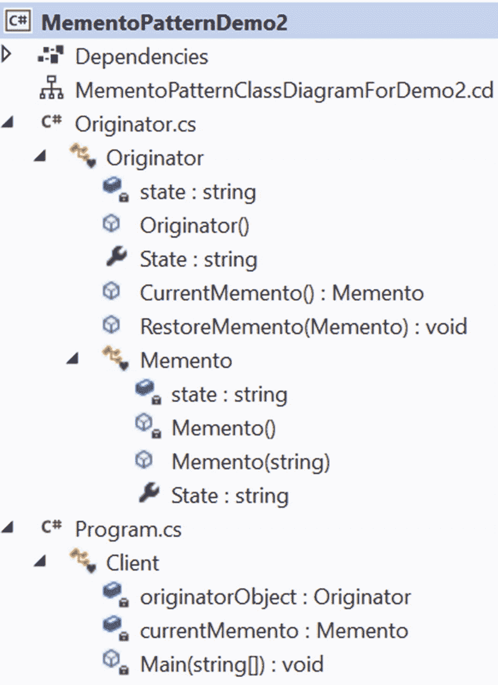

# 十九、备忘录模式

这一章涵盖了备忘录模式。

## GoF 定义

在不违反封装的情况下，捕获并具体化一个对象的内部状态，以便该对象可以在以后恢复到这个状态。

## 概念

单词 memento 是对过去事件的提醒。通过遵循面向对象的方法，您还可以跟踪(或保存)对象的状态。因此，每当您想要将对象恢复到它以前的状态时，您可以考虑使用这种模式。

在这种模式中，您通常会看到三个参与者:备忘录、发起人和看管人(通常用作客户)。工作流程可以概括如下:发起者对象有一个内部状态，客户端可以在其中设置一个状态。为了保存发起者的当前内部状态，客户(或看护者)向其请求备忘录。客户端还可以将备忘录(它持有的)传递回发起者以恢复先前的状态。通过遵循正确的方法，这些保存和恢复操作不会违反封装。

## 真实世界的例子

您可以在有限状态机的状态中看到 Memento 模式的经典示例。这是一个数学模型，但它最简单的应用之一是十字转门。一个十字转门有一些旋转臂，最初是锁定的。当你穿过它的时候(比如放一些硬币进去)，锁是开着的，手臂可以转动。一旦你通过，手臂回到锁定状态。

## 计算机世界的例子

在绘图应用中，您可能需要恢复到较旧的状态。此外，在数据库事务中，您可能需要回滚一些特定的事务。备忘录模式可以用在这些场景中。

## 履行

以下是 GoF 的一些重要建议。

*   备忘录保存了发起者的内部状态。

*   只有发起者应该创建备忘录。稍后，它可以使用备忘录来恢复先前的内部状态。

*   看守类是备忘录的容器。这个类用于保存备忘录，但是它从不操作或检查备忘录的内容。管理员可以从发起者那里得到备忘录。

Note

在这种模式中，发起者看到的是宽接口，而管理者看到的是窄接口。管理员不允许对备忘录做任何改动。因此，memento 对象应该用作不透明对象。

memento 设计模式可以使用不同的技术实现不同的实现。在本章中，您将看到两个演示。演示 1 相对简单易懂。但是在演示 2 中有所改进。在这两个实现中，我没有使用单独的看守类；相反，我使用客户机代码来扮演看管者的角色。

在演示 1 中，看护者拿着一个`Originator`物体，并向其索要备忘录。它将备忘录保存在一个列表中。因此，您会在客户端中看到下面几行代码。

```cs
Originator originatorObject = new Originator();
Memento currentMemento;
IList<Memento> savedStates = new List<Memento>();
/*
Adding a memento the list. This memento stores
the current state of the Originator.
*/
savedStates.Add(originatorObject.CurrentMemento());

```

memento 类非常简单，它有一个简单的 getter-setter 来获取或设置发起者的`state`。类如下。

```cs
class Memento
    {
        private string state;
        public string State
        {
            get
            {
                return state;
            }
            set
            {
                state = value;
            }
        }
    }

```

Note

从 C# 3.0 开始，您可以通过使用自动属性(如公共字符串状态{ get 设置；}.

除了状态之外，`Originator`类还有一个构造函数和两个名为`CurrentMemento()`和`RestoreMemento(...)`的方法。第一种是响应看管人的请求提供备忘录，定义如下。

```cs
       public Memento CurrentMemento()
        {
            myMemento = new Memento();
            myMemento.State = state;
            return myMemento;
        }

```

第二种方法将发起者恢复到以前的状态。这种状态包含在来自管理员的备忘录(作为方法参数出现)中。管理员可以发送它之前保存的备忘录。该方法定义如下。

```cs
        public void RestoreMemento(Memento restoreMemento)
        {
          this.state = restoreMemento.State;
          Console.WriteLine($"Restored to state : {state}");
        }

```

剩下的代码很简单，但是请参考注释以获得更好的理解。

### 类图

图 [19-1](#Fig1) 为类图。


图 19-1

类图

### 解决方案资源管理器视图

图 [19-2](#Fig2) 显示了程序的高层结构。


图 19-2

解决方案资源管理器视图

### 演示 1

下面是实现。

```cs
using System;
using System.Collections.Generic;

namespace MementoPattern
{
/// <summary>
/// Memento class
/// As per GoF:
/// 1.A Memento object stores the snapshot of Originator's  /// internal state.
/// 2.Ideally,only the originator that created a memento is /// allowed to access it.
/// </summary>
    class Memento
    {
        private string state;
        public string State
        {
            get
            {
                return state;
            }
            set
            {
                state = value;
            }
        }
        /*
        C#3.0 onwards, you can use
        automatic properties as follows:
        public string State { get; set; }
        */

    }

///  <summary>
///  Originator class
///  As per GoF:
///  1.It creates a memento that contains a snapshot of
///  its current internal state.
///  2.It uses a memento to restore its internal state.
///  </summary>
    class Originator
    {
        private string state;
        Memento myMemento;
        public Originator()
        {
            //Creating a memento with born state.
            state = "Snapshot #0.(Born state)";
            Console.WriteLine($"Originator's current state is: {state}");

        }
        public string State
        {
            get { return state; }
            set
            {
                state = value;
                Console.WriteLine($"Originator's current state is: {state}");
            }
        }

        /*
        Originator will supply the memento
        (which contains it's current state)
        in respond to caretaker's request.
        */
        public Memento CurrentMemento()
        {
            myMemento = new Memento();
            myMemento.State = state;
            return myMemento;
        }

        // Back to an old state (Restore)
        public void RestoreMemento(Memento restoreMemento)
        {
            this.state = restoreMemento.State;
            Console.WriteLine($"Restored to state : {state}");
        }
    }

/// <summary>
/// The 'Caretaker' class.
/// As per GoF:
/// 1.This class is responsible for memento's safe-keeping.
/// 2.Never operates or Examines the content of a Memento.

/// Additional notes( for your reference):
/// The originator object has an internal state, and a client can set a /// state in it.A client(or, caretaker) requests a memento from the /// originator to save the current internal state of the originator). /// It can also pass a memento back to the originator to restore it /// to a previous state that the memento holds in it.This enables to save /// and restore the internal state of an originator without violating its /// encapsulation.
/// </summary>

    class Client
    {
        static Originator originatorObject;
        static Memento currentMemento;
        static void Main(string[] args)
        {
            Console.WriteLine("***Memento Pattern Demonstration-1.***\n");
            //Originator is initialized.The constructor will create a born state.
            originatorObject = new Originator();
            //Memento currentMemento;
            IList<Memento> savedStates = new List<Memento>();
            /*
             Adding a memento the list.This memento stores
             the current state of the Origintor.
            */
            savedStates.Add(originatorObject.CurrentMemento());

            //Snapshot #1.
            originatorObject.State = "Snapshot #1";
            //Adding this memento as a  restore point
             savedStates.Add(originatorObject.CurrentMemento());

            //Snapshot #2.
            originatorObject.State = "Snapshot #2";
            //Adding this memento as a  restore point
            savedStates.Add(originatorObject.CurrentMemento());

            //Snapshot #3.
            originatorObject.State = "Snapshot #3";
            //Adding this memento as a  restore point
            savedStates.Add(originatorObject.CurrentMemento());

            //Snapshot #4\. It is not added as a restore point.
            originatorObject.State = "Snapshot #4";

            //Available restore points
            Console.WriteLine("\nCurrently available restore points are :");
            foreach (Memento m in savedStates)
            {
                Console.WriteLine(m.State);
            }

            //Undo's
            //Roll back starts...
            Console.WriteLine("\nPerforming undo's now.");
            for (int i = savedStates.Count; i > 0; i--)
            {
                //Get a restore point
                currentMemento = savedStates[i - 1];
                originatorObject.RestoreMemento(currentMemento);
            }
            //Redo's
            Console.WriteLine("\nPerforming redo's now.");
            for (int i = 1; i < savedStates.Count; i++)
            {
                currentMemento = savedStates[i];
                originatorObject.RestoreMemento(currentMemento);
            }
            // Wait for user
            Console.ReadKey();
        }
    }
}

```

### 输出

这是输出。

```cs
***Memento Pattern Demonstration-1.***

Originator's current state is: Snapshot #0.(Born state)
Originator's current state is: Snapshot #1
Originator's current state is: Snapshot #2
Originator's current state is: Snapshot #3
Originator's current state is: Snapshot #4

Currently available restore points are :
Snapshot #0.(Born state)
Snapshot #1
Snapshot #2
Snapshot #3

Performing undo's now.
Restored to state : Snapshot #3
Restored to state : Snapshot #2
Restored to state : Snapshot #1
Restored to state : Snapshot #0.(Born state)

Performing redo's now.
Restored to state : Snapshot #1
Restored to state : Snapshot #2
Restored to state : Snapshot #3

```

### 分析

使用这个程序的概念，您可以使用三种不同的撤销操作，如下所示。

*   您可以回到上一个还原点。

*   您可以返回到指定的还原点(直接使用 index 属性)。例如，要直接返回到快照#2，可以使用下面几行代码:

    ```cs
    //Directly going back to Snapshot #2
     currentMemento = savedStates[2];
     originatorObject.RestoreMemento(currentMemento);

    ```

*   您可以恢复所有还原点(使用一个`for`循环和一个索引属性显示)

Note

如果应用使用 Memento 模式，并且有一个可变引用类型的状态，您可能会看到深度复制技术的实现将状态存储在 Memento 对象中。你在第 [2](02.html) 章学到了深度复制。

## 问答环节

在前面的例子中，你能使用一个非泛型版本吗，比如 ArrayList？

我喜欢听从专家的建议，他们通常更喜欢通用版本而不是非通用版本。这就是为什么我喜欢数据结构，比如`List`、`Dictionary`等等，而不是它们的对应物，比如`ArrayList`和`HashTable`。我在我早期的两本书里详细讨论了泛型:*交互式 C#* (Apress，2017)和*高级 C#* 入门(Apress，2020)。

使用 Memento 设计模式的主要优势是什么？

以下是一些优点。

*   最大的优点是您可以随时丢弃不需要的更改，并将它们恢复到预期的或稳定的状态。

*   您不会损害与参与此模型的关键对象相关联的封装。

*   你可以保持很高的凝聚力。

*   它提供了一种简单的恢复技术。

19.3 备忘录设计模式的主要挑战是什么？

以下是一些缺点。

*   拥有更多备忘录需要更多的存储空间。此外，它们给看护者增加了额外的负担。

*   前一点增加了维护成本。

*   您不能忽略保存这些状态所花费的时间，这会降低应用的整体性能。

请注意，在 C# 或 Java 等语言中，开发人员可能更喜欢使用序列化/反序列化技术，而不是直接实现 Memento 设计模式。这些技术各有利弊，但是您可以在应用中结合使用这两种技术。

我很困惑。为了支持 **撤销操作** **，我应该使用哪种模式——Memento 还是 Command？**

GoF 说这些是相关的模式。这主要取决于你想如何处理这种情况。假设你正在给一个整数加 25。在此添加操作之后，您可以通过执行反向操作来撤消它。简单来说，50 + 25 = 75，所以 75–25 = 50。在这种类型的操作中，您不需要存储以前的状态。

但是考虑一种情况，您需要在操作之前存储对象的状态。在这种情况下，您使用 Memento。例如，在绘画应用中，通过在执行命令之前存储对象列表，可以避免撤销某些绘画操作的成本。这个存储的列表可以作为备忘录，您可以将这个列表与相关的命令一起保存。类似的概念也适用于一个长期运行的游戏应用，它有多个级别，您可以在其中保存您最后的性能级别。因此，应用可以使用这两种模式来支持撤销操作。

最后，您必须记住，在 memento 模式中存储 Memento 对象是强制性的，这样您就可以恢复到以前的状态。在命令模式中，没有必要存储命令。一旦你执行一个命令，它的工作就完成了。如果您不支持“撤销”操作，您可能根本不会对存储这些命令感兴趣。

我明白管理员不应该在备忘录上做手术。所以，演示 1 没问题。但是我看到在客户端代码中，我可以使用下面几行代码创建一个 Memento 对象并设置一个状态，没有人阻止我。这是正确的吗？

```cs
//For Q&A session only(Shouldn't be used)
currentMemento = new Memento();
currentMemento.State = "Arbitrary state set by caretaker";

```

接得好。这是演示 1 的潜在缺点。对于管理员类，试着记住 GoF 中的以下几点。

*   这个班负责备忘录的保管。

*   它从不操作或检查备忘录的内容。

在演示 2 中，我注意到了这几点。所以，穿过它；这是一个相对复杂的例子。

## 修改的实现

在这个例子中，我试图阻止从客户端代码直接访问备忘录。以下是一些重要的变化。

*   `Memento`类有一个私有构造函数。因此，这个类不能使用外部的`new`操作符初始化。

*   `Memento`类嵌套在`Originator`类中，放在一个单独的文件中(`Originator.cs`)。我还制作了`Memento`级`internal`。

*   为了适应这些变化，`CurrentMemento()`方法修改如下:

    ```cs
    public Memento CurrentMemento()
    {
            //Code segment used in Demonstration-1
            //myMemento = new Memento();//error now
            //myMemento.State = state;
            //return myMemento;

            //Modified code for Demonstration-2
            return new Memento(this.State);
    }

    ```

看守者(客户端)与演示 1 非常相似，除了这一次，您需要使用**发起者。备忘录**而不是`Memento`。现在我们来看演示 2。

### 类图

图 [19-3](#Fig3) 显示了修改后的类图。(请注意，关联线可以连接到最外面的形状，但不能连接到 Visual Studio 类图中的嵌套类型。)


图 19-3

演示 2 的类图

### 解决方案资源管理器视图

图 [19-4](#Fig4) 显示了修改后的程序高层结构。



图 19-4

演示 2 的解决方案浏览器视图

### 演示 2

下面是修改后的实现。

```cs
//Originator.cs
using System;

namespace MementoPatternDemo2
{
    /// <summary>
    ///  Originator class
    ///  As per GoF:
    ///  1.It creates a memento that contains a snapshot of its current ///  internal state.
    ///  2.It uses a memento to restore its internal state.
    /// </summary>
    class Originator
    {
        private string state;
        //Memento myMemento;//not needed now
        public Originator()
        {
            //Creating a memento with born state.
            state = "Snapshot #0.(Born state)";
            Console.WriteLine($"Originator's current state is: {state}");

        }
        public string State
        {
            get { return state; }
            set
            {
                state = value;
                Console.WriteLine($"Originator's current state is: {state}");
            }
        }

        /*
        Originator will supply the memento
        (which contains it's current state)
        in respond to caretaker's request.
        */
        public Memento CurrentMemento()
        {
            //Code segment used in Demonstration-1
            //myMemento = new Memento();//error now, because of private constructor
            //myMemento.State = state;
            //return myMemento;

            //Modified code for Demonstration-2
            return new Memento(this.State);
        }

        // Back to an old state (Restore)
        public void RestoreMemento(Memento restoreMemento)
        {
            this.state = restoreMemento.State;
            Console.WriteLine($"Restored to state : {state}");
        }
        /// <summary>
        /// Memento class
        /// As per GoF:
        /// 1.A Memento object stores the snapshot of Originator's internal /// state.
        /// 2.Ideally,only the originator that created a memento is allowed /// to access it.
        /// </summary>
        internal class Memento
        {
            private string state;
            //Now Memento class cannot be initialized outside
            private Memento() { }
            public Memento(string state)
            {
                this.state = state;
            }
            public string State
            {
                get
                {
                    return state;
                }
                set
                {
                    state = value;
                }
            }
        }

    }
}
//Client.cs
using System;
using System.Collections.Generic;

namespace MementoPatternDemo2
{
    class Client
    {
        static Originator originatorObject;
        static Originator.Memento currentMemento;
        static void Main(string[] args)
        {
            Console.WriteLine("***Memento Pattern Demonstration-2.***");
            Console.WriteLine("Originator (with nested internal class 'Memento') is maintained in a separate file.\n");
            //Originator is initialized.The constructor will create a //born state.
            originatorObject = new Originator();
            //Cannot create memento inside client code now
            //currentMemento = new Originator.Memento();//error:inaccessible
            //currentMemento.State = "test";//Also error, because previous line cannot be used

            IList<Originator.Memento> savedStates = new List<Originator.Memento>();
            /*
             Adding a memento the list.This memento stores
             the current state of the Origintor.
            */
            savedStates.Add(originatorObject.CurrentMemento());

            //Snapshot #1.
            originatorObject.State = "Snapshot #1";
            //Adding this memento as a  restore point
            savedStates.Add(originatorObject.CurrentMemento());

            //Snapshot #2.
            originatorObject.State = "Snapshot #2";
            //Adding this memento as a  restore point
            savedStates.Add(originatorObject.CurrentMemento());

            //Snapshot #3.
            originatorObject.State = "Snapshot #3";
            //Adding this memento as a  restore point
            savedStates.Add(originatorObject.CurrentMemento());

            //Snapshot #4\. It is not added as a restore point.
            originatorObject.State = "Snapshot #4";

            //Available restore points
            Console.WriteLine("\nCurrently available restore points are :");
            foreach (Originator.Memento m in savedStates)
            {
                Console.WriteLine(m.State);
            }

            //Undo's
            //Roll back starts...
            Console.WriteLine("\nPerforming undo's now.");
            for (int i = savedStates.Count; i > 0; i--)
            {
                //Get a restore point
                currentMemento = savedStates[i - 1];
                originatorObject.RestoreMemento(currentMemento);
            }
            //Redo's
            Console.WriteLine("\nPerforming redo's now.");
            for (int i = 1; i < savedStates.Count; i++)
            {
                currentMemento = savedStates[i];
                originatorObject.RestoreMemento(currentMemento);
            }
            // Wait for user
            Console.ReadKey();
        }
    }
}

```

### 输出

这是输出。您可以看到，除了最初的控制台消息之外，演示 1 和演示 2 的输出是相同的，但是从程序上来说，我在这个示例中加入了更多的约束。

```cs
***Memento Pattern Demonstration-2.***
Originator (with nested internal class 'Memento') is maintained in a separate file.

Originator's current state is: Snapshot #0.(Born state)
Originator's current state is: Snapshot #1
Originator's current state is: Snapshot #2
Originator's current state is: Snapshot #3
Originator's current state is: Snapshot #4

Currently available restore points are :
Snapshot #0.(Born state)
Snapshot #1
Snapshot #2
Snapshot #3

Performing undo's now.
Restored to state : Snapshot #3
Restored to state : Snapshot #2
Restored to state : Snapshot #1
Restored to state : Snapshot #0.(Born state)

Performing redo's now.
Restored to state : Snapshot #1
Restored to state : Snapshot #2
Restored to state : Snapshot #3

```