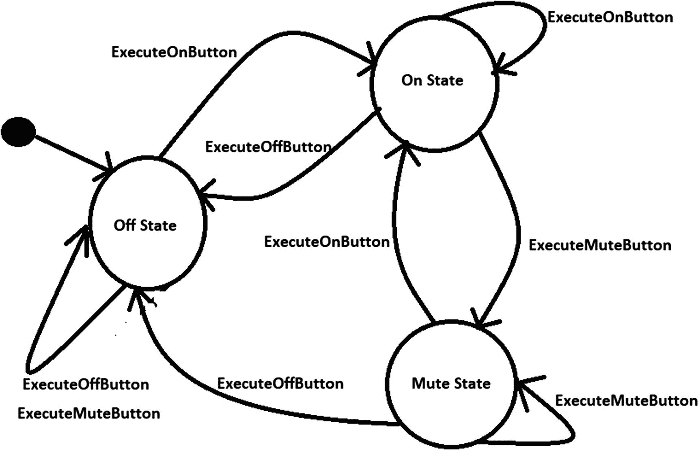
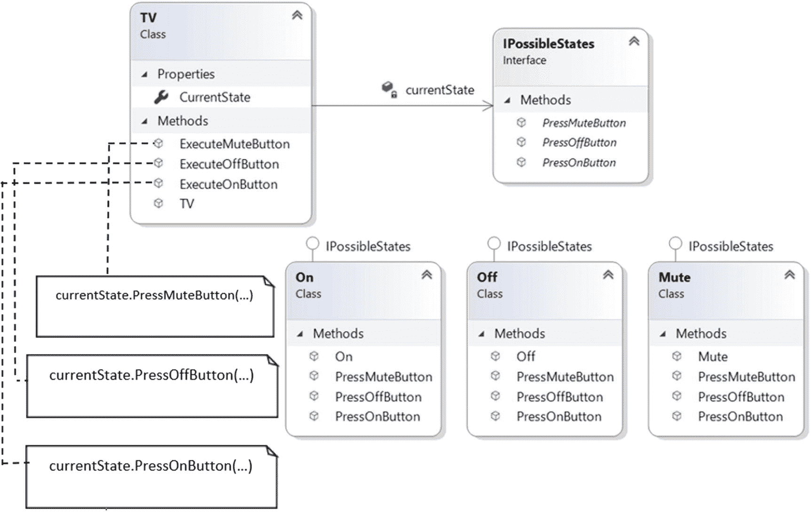
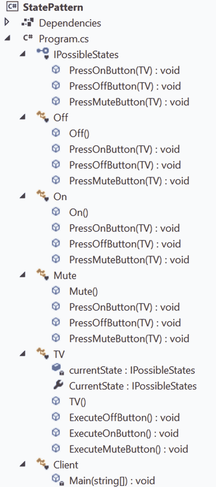

# 二十、状态模式

本章介绍了状态模式。

## GoF 定义

允许对象在其内部状态改变时改变其行为。该对象看起来会改变它的类。

## 概念

GoF 的定义很容易理解。它简单地说明了一个对象可以根据它的当前状态改变它的行为。

假设您正在处理一个代码库快速增长的大规模应用。结果，情况变得复杂，您可能需要引入许多 if-else 块/switch 语句来保护各种条件。状态模式适合这样的环境。它允许您的对象基于它们的当前状态表现出不同的行为，并且您可以用不同的类定义特定于状态的行为。

在这种模式中，您根据应用的可能状态进行思考，并相应地分离代码。理想情况下，每个状态都独立于其他状态。您跟踪这些状态，并且您的代码根据当前状态的行为做出响应。例如，假设您正在电视机(TV)上观看一个节目。现在，如果您按下电视遥控器上的静音按钮，电视的状态会发生变化。但是如果电视已经处于关闭模式，则没有变化。

因此，基本思想是，如果您的代码可以跟踪应用的当前状态，您就可以集中任务，分离您的代码，并相应地做出响应。

## 真实世界的例子

考虑一个网络连接的场景，比如 TCP 连接。一个对象可以处于各种状态；例如，连接可能刚刚建立，连接可能已关闭，或者对象正在通过连接进行侦听。当这个连接收到来自其他对象的请求时，它会根据其当前状态做出响应。

交通信号或电视的功能是状态模式的其他例子。例如，如果电视已经处于开机模式，您可以更换频道。如果它处于关闭模式，它不响应频道改变请求。

## 计算机世界的例子

TCP 连接的例子就属于这一类。考虑另一个例子。假设您有一个作业处理系统，可以一次处理一定数量的作业。当一个新的作业出现时，系统要么处理该作业，要么发出信号表明它正忙于处理当时能够处理的最大数量的作业。这个忙信号仅仅表明它的作业处理能力总数已经达到，新的作业请求不能立即完成。

## 履行

这个例子模拟了与电视相关的功能，它有一个控制面板来支持开、关和静音操作。为简单起见，假设在任何给定时间，电视处于以下三种状态中的任何一种:开、关或静音。下面显示了一个名为 IPossibleStates 的接口。

```cs
   interface IPossibleStates
    {
        //Users can press any of these buttons-On, Off or Mute
        void PressOnButton(TV context);
        void PressOffButton(TV context);
        void PressMuteButton(TV context);
    }

```

三个具体的类——`On`、`Off`和`Mute`——实现了这个接口。基本功能可以描述如下。最初，电视处于关闭状态。因此，当您按下控制面板上的“开”按钮时，电视将进入“开”状态，如果您按下“静音”按钮，电视将进入静音状态。

假设您在电视处于关闭状态时按下关闭按钮；如果您在电视处于打开状态时按下 On 按钮；或者，如果您在电视处于静音模式时按下静音按钮，电视的状态不会改变。电视可以从打开状态或静音状态进入关闭状态(当您按下关闭按钮时)。图 [20-1](#Fig1) 是反映所有可能场景的状态图。



图 20-1

电视的不同状态

Points to Remember

*   在该图中，我没有将任何状态标记为最终状态，尽管在图 [20-1](#Fig1) 中，我切换到关闭电视。

*   为了使设计更简单，假设如果在电视处于关闭状态时按下关闭(或静音)键；或者如果您在电视处于打开状态时按下 On 按钮；或者，如果您在电视处于静音模式时按下静音按钮，电视的状态不会改变。但在现实世界中，遥控器的工作方式可能会有所不同。例如，如果电视当前处于打开状态，您按下静音按钮，电视将进入静音模式；如果再次按下静音按钮，电视可能会返回到打开状态。因此，您可能需要相应地更新您的程序逻辑。

电视有一个控制面板，支持开、关和静音操作。所以，在 TV 类内部，有三种方法:`ExecuteOffButton()` `,` `ExecuteOnButton()`，和`ExecuteMuteButton()`如下。

```cs
       public void ExecuteOffButton()
        {
           Console.WriteLine("You pressed Off button.");
            //Delegating the state behavior
            currentState.PressOffButton(this);
        }
        public void ExecuteOnButton()
        {
            Console.WriteLine("You pressed On button.");
            //Delegating the state behavior
            currentState.PressOnButton(this);
        }
        public void ExecuteMuteButton()
        {
            Console.WriteLine("You pressed Mute button.");
            //Delegating the state behavior
            currentState.PressMuteButton(this);
        }

```

我授权国家行为。例如，当您按下`ExecuteMuteButton()`时，控件会根据电视机的当前状态调用`PressMuteButton(...)`。

现在让我们跟随类图。

### 类图

图 [20-2](#Fig2) 显示了类图的重要部分。



图 20-2

类图

### 解决方案资源管理器视图

图 [20-3](#Fig3) 显示了程序的高层结构。



图 20-3

解决方案资源管理器视图

### 示范

下面是完整的实现。

```cs
using System;
namespace StatePattern
{
    interface IPossibleStates
    {
        //Users can press any of these buttons-On, Off or Mute
        void PressOnButton(TV context);
        void PressOffButton(TV context);
        void PressMuteButton(TV context);
    }
    //Subclasses does not contain any local state.
    //Only one unique instance of IPossibleStates is required.
    /// <summary>
    /// Off state behavior
    /// </summary>
    class Off : IPossibleStates
    {
        public Off()
        {
            Console.WriteLine("---TV is Off now.---\n");
        }

        //TV is Off now, user is pressing On button
        public void PressOnButton(TV context)
        {
            Console.WriteLine("TV was Off.Going from Off to On state.");
            context.CurrentState = new On();
        }
        //TV is Off already, user is pressing Off button again
        public void PressOffButton(TV context)
        {
            Console.WriteLine("TV was already in Off state.So, ignoring this opeation.");
        }
        //TV is Off now, user is pressing Mute button
        public void PressMuteButton(TV context)
        {
            Console.WriteLine("TV was already off.So, ignoring this operation.");
        }
    }
    /// <summary>
    /// On state behavior
    /// </summary>
    class On : IPossibleStates
    {
       public On()
        {
            Console.WriteLine("---TV is On now.---\n");
        }
        //TV is On already, user is pressing On button again
        public void PressOnButton(TV context)
        {
            Console.WriteLine("TV is already in On state.Ignoring repeated on button press operation.");
        }
        //TV is On now, user is pressing Off button
        public void PressOffButton(TV context)
        {
            Console.WriteLine("TV was on.So,switching off the TV.");
            context.CurrentState = new Off();
        }
        //TV is On now, user is pressing Mute button
        public void PressMuteButton(TV context)
        {
            Console.WriteLine("TV was on.So,moving to silent mode.");
            context.CurrentState = new Mute();
        }
    }
    /// <summary>
    /// Mute state behavior
    /// </summary>
    class Mute : IPossibleStates
    {

        public Mute()
        {
            Console.WriteLine("---TV is in Mute mode now.---\n");
        }
        /*
        Users can press any of these buttons at this state-On, Off or Mute.TV is in mute, user is pressing On button.
        */
        public void PressOnButton(TV context)
        {
            Console.WriteLine("TV was in mute mode.So, moving to normal state.");
            context.CurrentState = new On();
        }
        //TV is in mute, user is pressing Off button
        public void PressOffButton(TV context)
        {
            Console.WriteLine("TV was in mute mode. So, switching off the TV.");
            context.CurrentState = new Off();
        }
        //TV is in mute already, user is pressing mute button again
        public void PressMuteButton(TV context)
        {
            Console.WriteLine(" TV is already in Mute mode, so, ignoring this operation.");
        }
    }
    /// <summary>
    /// TV is the context class
    /// </summary>
    class TV
    {
        private IPossibleStates currentState;
        public IPossibleStates CurrentState
        {
            get
            {
                return currentState;
            }
           /*
           Usually this value will be set by the class that implements the interface "IPossibleStates"
           */
            set
            {
                currentState = value;
            }
        }
        public TV()
        {
            //Starting with Off state
            this.currentState = new Off();
        }
        public void ExecuteOffButton()
        {
           Console.WriteLine("You pressed Off button.");
            //Delegating the state behavior
            currentState.PressOffButton(this);
        }
        public void ExecuteOnButton()
        {
            Console.WriteLine("You pressed On button.");
            //Delegating the state behavior
            currentState.PressOnButton(this);
        }
        public void ExecuteMuteButton()
        {
            Console.WriteLine("You pressed Mute button.");
            //Delegating the state behavior
            currentState.PressMuteButton(this);
        }
    }
    /// <summary>
    /// Client code
    /// </summary>
    class Client
    {
        static void Main(string[] args)
        {
            Console.WriteLine("***State Pattern Demo***\n");
            //TV is initialized with Off state.
            TV tv = new TV();
            Console.WriteLine("User is pressing buttons in the following sequence:");
            Console.WriteLine("Off->Mute->On->On->Mute->Mute->Off\n");
            //TV is already in Off state
            tv.ExecuteOffButton();
  //TV is already in Off state, still pressing the Mute button
            tv.ExecuteMuteButton();
            //Making the TV on
            tv.ExecuteOnButton();
  //TV is already in On state, pressing On button again
            tv.ExecuteOnButton();
            //Putting the TV in Mute mode
            tv.ExecuteMuteButton();
     //TV is already in Mute, pressing Mute button again
            tv.ExecuteMuteButton();
            //Making the TV off
            tv.ExecuteOffButton();
            // Wait for user
            Console.Read();
        }
    }
}

```

### 输出

这是输出。

```cs
***State Pattern Demo***

---TV is Off now.---

User is pressing buttons in the following sequence:
Off->Mute->On->On->Mute->Mute->Off

You pressed Off button.
TV was already in Off state.So, ignoring this opeation.
You pressed Mute button.
TV was already off.So, ignoring this operation.
You pressed On button.
TV was Off.Going from Off to On state.
---TV is On now.---

You pressed On button.
TV is already in On state.Ignoring repeated on button press operation.
You pressed Mute button.
TV was on.So,moving to silent mode.
---TV is in Mute mode now.---

You pressed Mute button.
 TV is already in Mute mode, so, ignoring this operation.
You pressed Off button.
TV was in mute mode. So, switching off the TV.
---TV is Off now.---

```

## 问答环节

你能详细说明这种模式在现实世界中是如何工作的吗？

心理学家已经多次证明了这样一个事实，即人类在放松的心情下可以发挥出最佳水平。然而，在相反的情况下，当他们的头脑充满紧张时，他们不能产生伟大的结果。这就是为什么他们总是建议你在放松的心情下工作。所以，同样的工作，可以是享受的，也可以是无聊的，看你现在的心情。

你可以再想想我们的演示例子。假设你想看你最喜欢的球队获胜时刻的电视直播。要观看和享受这一时刻，您需要先打开电视。如果此时电视无法正常工作，无法处于打开状态，您就无法享受这一时刻。所以，如果你想通过你的电视享受这一刻，首要的标准就是电视要把它的状态从关变成开。当对象的内部状态改变时，如果您想在对象中设计类似的行为改变，状态模式是很有帮助的。

在这个例子中，你只考虑了电视 **的三种状态:开、关和静音。可以有许多其他状态；例如，可能存在处理连接问题或不同显示条件的状态。你为什么忽略了这些问题？**

直截了当的回答是，为了简单起见，我忽略了这些状态。如果系统中状态的数量显著增加，那么维护系统就变得很困难(这是与这种设计模式相关的关键挑战之一)。但是如果你理解这个实现，你可以很容易地添加任何你想要的状态。

我注意到 GoF 在他们著名的著作中为国家模式和策略模式 **描绘了一个相似的结构。我对此感到困惑。**

是的，结构是相似的，但是你需要记住他们的意图是不同的。当你使用策略模式时，你得到了一个子类化的更好的选择。在状态设计模式中，不同类型的行为可以封装在一个状态对象中，并且上下文被委托给这些状态中的任何一个。当上下文的内部状态改变时，它的行为也会改变。因此，状态模式可以被认为是策略模式的动态版本。

在某些情况下，状态模式还可以帮助您避免许多`if`条件。例如，如果电视处于关闭状态，它就不能进入静音状态。从这个状态，它只能进入 On 状态。因此，如果您不喜欢状态设计模式，您可能需要像这样编写代码。

```cs
class TV
{
//Some code before
public void ExecuteOnButton()
{
if(currentState==Off )
{
Console.WriteLine("You pressed On button. Going from Off to OnState");
//Some code after
}
if(currentState==On )
{
Console.WriteLine("You pressed On button. TV is already in on state. So, ignoring this opeation.");
//Some code after
}
else
{
Console.WriteLine("TV was on. Moving into mute mode now.");
}
//Some code after
}

```

您需要对不同种类的按钮按压重复这些检查(例如，对于`ExecuteOffButton()`和`ExecuteMuteButton()`方法，您需要重复这些检查并相应地编程)。所以，如果你不从状态的角度考虑，随着时间的推移，用大量的`if-else`处理不同的条件是非常具有挑战性的，当代码库持续增长时，这可能会很困难。

在你的例子中，你是如何实现 **开/关原理** **的？**

这些 TV 状态中的每一个都被关闭进行修改，但是您可以向 TV 类添加一个新的状态。

**20.5 策略模式和状态模式有什么共同特征？**

状态模式可以被认为是一种动态策略模式。这两种模式都促进了组合和委托。

在我看来，这些状态对象就像单态对象一样。这是正确的吗？

是的，这是一个很好的观察。在这个例子中，IPossibleStates 的具体子类不包含任何本地状态，因此，在这个应用中，只有一个 state 实例在工作。大多数时候，这种模式的行为是相似的。

20.7 为什么使用上下文作为方法参数？你能在这样的陈述中避免它们吗？

```cs
void PressOnButton(TV context);

```

利用上下文，我在保存状态。此外，IPossibleStates 的具体子类不包含任何本地状态。因此，在这个应用中，只有一个状态实例在工作。所以，这个结构帮助你评估你是在不同的状态之间变化，还是已经处于相同的状态。注意输出。这些上下文帮助您获得如下输出。

```cs
"You pressed Mute button.
TV was already off.So, ignoring this operation."

```

**20.8 状态设计模式有哪些利弊？**

优点如下。

*   您已经看到，通过遵循打开/关闭原则，您可以轻松地添加新状态和扩展状态的行为。此外，状态行为可以毫无争议地扩展。例如，在这个实现中，您可以为 TV 类添加新的状态和新的行为，而无需更改 TV 类本身。

*   它减少了`if-else`语句。换句话说，条件复杂性降低了。(参见对问题 20.3 的回答。)

使用这种模式有一个缺点。

*   状态模式也被称为状态的对象，因此您可以假设更多的状态需要更多的代码，并且明显的副作用是维护更加困难。

在这些实现中，TV 是一个具体的类。在这种情况下，你为什么不编程接口？

我假设 TV 类不会改变，所以忽略了这一部分以减少程序的代码量。但是是的，你总是可以从一个界面开始，例如，`ITv,`，你可以在其中定义合同。

**20.10 在 TV 类的构造函数中，你正在用一个关闭的状态初始化电视。所以，状态和上下文类都可以触发状态转换？**

是的。