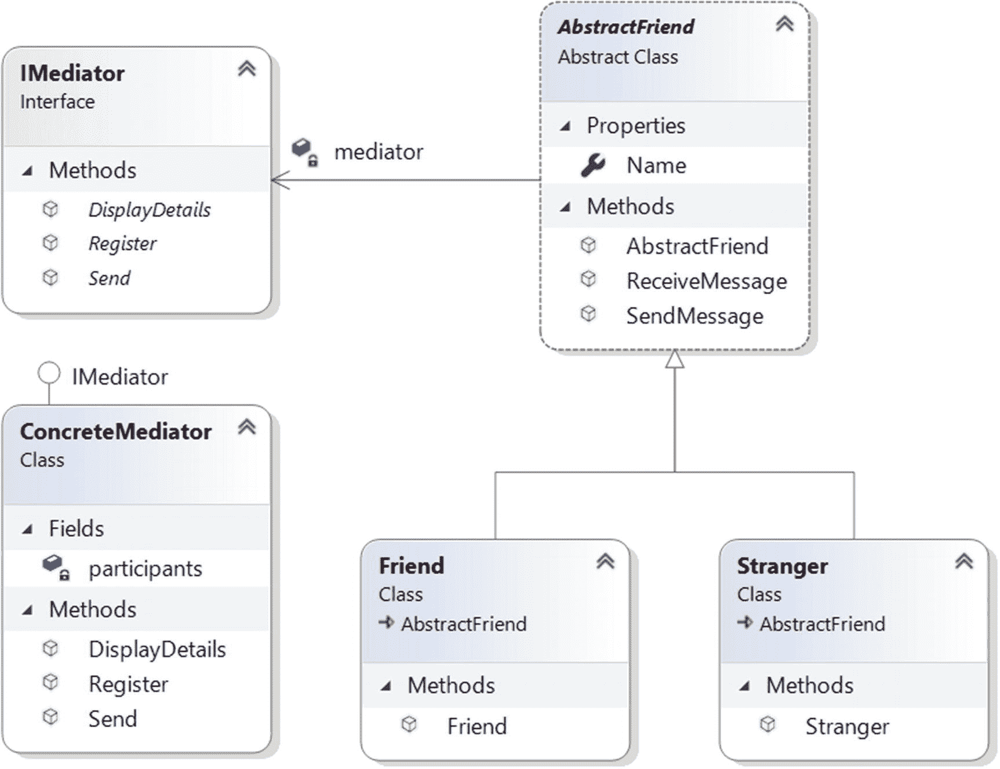

# 二十一、中介模式

本章涵盖了中介模式。

## GoF 定义

定义一个封装一组对象如何交互的对象。Mediator 通过防止对象显式地相互引用来促进松散耦合，并允许您独立地改变它们的交互。

## 概念

中介是一组对象通过其进行通信的中介，但它们不能直接相互引用。中介负责控制和协调它们之间的交互。因此，您可以减少不同对象之间的直接互连数量。因此，使用这种模式，您可以减少应用中的耦合。

## 真实世界的例子

当飞机需要起飞时，会进行一系列的验证。这些类型的验证确认所有组件和单个零件(可能相互依赖)都处于完美状态。

另一个例子是当不同飞机的飞行员(他们正在接近或离开终端区域)与机场塔台通信时。他们不明确地与不同航空公司的其他飞行员交流。他们只是把他们的状态发送给控制塔。这些塔发送信号来确认谁可以起飞(或降落)。你必须注意，这些塔并不控制整个飞行。它们仅在端子区域实施约束。

## 计算机世界的例子

当客户端处理业务应用时，您可能需要实现一些约束。例如，假设您有一个表单，客户需要提供他们的用户 id 和密码来访问他们的帐户。在同一表单中，您可能需要提供其他必填字段，如电子邮件 ID、通信地址、年龄等。让我们假设您正在应用如下的约束。

首先，检查用户提供的用户 ID 是否有效。如果是有效的 id，则仅启用密码字段。提供这两个字段后，您可能需要检查用户是否提供了电子邮件 ID。让我们进一步假设，在提供了所有这些信息(有效的用户 id、密码、格式正确的电子邮件 ID 等等)之后，您的 Submit 按钮被启用。换句话说，如果用户提供了有效的用户 id、密码、有效的电子邮件 ID 和其他必需的详细信息，则 Submit 按钮被启用。您还可以确保用户 ID 是一个整数，因此如果用户错误地在该字段中提供了任何字符，提交按钮将保持禁用模式。在这种情况下，中介模式变得非常方便。

简而言之，当一个程序由许多类组成，并且逻辑分布在它们之间时，代码变得更难阅读和维护。在这些场景中，如果您想要对系统的行为进行新的更改，这可能会很困难，除非您使用中介模式。

## 履行

维基百科描述了 Mediator 模式，如图 [21-1](#Fig1) (摘自 GoF)。


图 21-1

中介模式示例

参与者描述如下。

*   `Mediator`:定义了提供`Colleague`对象间通信的接口。

*   `ConcreteMediator`:它知道并维护`Colleague`对象的列表。它实现了`Mediator`接口，并协调了`Colleague`对象之间的通信。

*   `Colleague`:定义与其他同事沟通的接口。

*   `ConcreteColleague(s)`:一个具体的同事必须实现`Colleague`接口。这些对象通过中介相互通信。

在演示 1 中，我用 `AbstractFriend`和`Friend` *代替了`Colleague`和`ConcreteColleague(s)` *。*(是的，你可以假设是友好的环境。)在这个例子中，有三个参与者，分别是 Amit、Sohel 和 Joseph，他们通过聊天服务器相互通信。在这种情况下，聊天服务器扮演中介者的角色。*

在下面的例子中，`IMediator`是接口，用易于理解的注释定义。

```cs
interface IMediator
{
    // To register a friend
    void Register(AbstractFriend friend);
    // To send a message from one friend to another friend
    void Send(AbstractFriend fromFriend, AbstractFriend toFriend,string msg);
    // To display currently registered objects/friends.
    void DisplayDetails();
}

```

`ConcreteMediator`类实现了这个接口，这个类维护注册参与者的列表。所以，在这个类中，你还会看到下面几行代码。

```cs
// List of friends
List<AbstractFriend> participants = new List<AbstractFriend>();

```

除此之外，中介只允许注册用户相互通信并成功发布消息。因此，`ConcreteMediator class`中的`Send()`方法检查发送者和接收者是否都是注册用户。该方法定义如下。

```cs
public void Send(AbstractFriend fromFriend, AbstractFriend toFriend,string msg)
{
    // Verifying whether the sender is a registered user or not.
    if (participants.Contains(fromFriend))
    {
            // Verifying whether the receiver is a registered user or not.
                if (participants.Contains(toFriend))
                {
                    Console.WriteLine($"\n[{fromFriend.Name}] posts: {msg}Last message posted {DateTime.Now}");
                    System.Threading.Thread.Sleep(1000);
                    // Target receiver will receive this message.
                    toFriend.ReceiveMessage(fromFriend, msg);
                }
                // Target receiver is NOT a registered user
                else
                {
                    Console.WriteLine($"\n{fromFriend.Name}, you cannot send message to {toFriend.Name} because he is NOT a registered user.");
                }
            }
            // Message sender is NOT a registered user
            else
            {
                Console.WriteLine($"\nAn outsider named {fromFriend.Name} of [{fromFriend.GetType()}] is trying to send a message to {toFriend.Name}.");
            }
        }

```

在这个例子中，有另一个继承层次，其中我使用了`AbstractFriend`作为一个抽象类，这样你就不能直接实例化它。相反，你可以从继承自`AbstractFriend`的具体类`Friend`或`Stranger,`中实例化对象。这个继承层次结构如下。

```cs
/// <summary>
/// AbstractFriend class
/// Making it an abstract class, so that you cannot instantiate it directly.
/// </summary>
    abstract class AbstractFriend
    {
        IMediator mediator;

        // Using auto property
        public string Name { get; set; }

        // Constructor
        public AbstractFriend(IMediator mediator)
        {
            this.mediator = mediator;
        }
        public void SendMessage(AbstractFriend toFriend,string msg)
        {
            mediator.Send(this,toFriend, msg);
        }
        public void ReceiveMessage(AbstractFriend fromFriend, string msg)
        {
            Console.WriteLine($"{this.Name} has received a message from {fromFriend.Name} saying: {msg} ");
        }
    }
    /// <summary>
    /// Friend class
    /// </summary>

    class Friend : AbstractFriend
    {
        // Constructor
        public Friend(IMediator mediator)
            : base(mediator)
        {

        }
    }
    /// <summary>
    /// Another class called Stranger
    /// </summary>
    class Stranger : AbstractFriend
    {
        // Constructor
        public Stranger(IMediator mediator)
            : base(mediator)
        {

        }
    }

```

Note

遵循基本中介模式的核心架构，我使用了两个不同的具体类来演示这样一个事实，即您应该*而不是*假设通信对象应该只来自同一个类。

在客户端代码中，您会看到以下参与者:两个来自`Friend`类，一个来自`Stranger`类。

```cs
// 3 persons-Amit,Sohel,Joseph
// Amit and Sohel from Friend class
Friend friend1 = new Friend(mediator);
friend1.Name = "Amit";
Friend friend2 = new Friend(mediator);
friend2.Name = "Sohel";
// Joseph is from Stranger class
Stranger stranger1 = new Stranger(mediator);
stranger1.Name = "Joseph";

```

这些人可以通过聊天服务器进行交流。因此，在传递消息之前，他们首先向聊天服务器注册，如下所示。

```cs
// Registering the participants
mediator.Register(friend1);
mediator.Register(friend2);
mediator.Register(stranger1);

```

在节目的最后，我介绍了两个人:托德和杰克。托德是一个`Friend`类对象，杰克是一个`Stranger`类对象。但是它们都没有向中介对象注册；所以中介不允许他们向期望的对象发送消息。

如果 Jack 在发送消息之前向中介注册，就可以正确地发送消息，如下所示。

```cs
mediator.Register(stranger1); // Disabled in Demonstration1
stranger1.SendMessage(friend3,"Hello friend...");

```

同样的评论也适用于`Todd`。

### 类图

图 [21-2](#Fig2) 显示了类图的重要部分。



图 21-2

类图

### 解决方案资源管理器视图

图 [21-3](#Fig3) 显示了程序的高层结构。


图 21-3

解决方案资源管理器视图

### 演示 1

这是完整的演示。

```cs
using System;
using System.Collections.Generic;

namespace MediatorPattern
{
    interface IMediator
    {
        // To register a friend
        void Register(AbstractFriend friend);
        // To send a message from one friend to another friend
        void Send(AbstractFriend fromFriend, AbstractFriend toFriend, string msg);
        // To display currently registered objects/friends.
        void DisplayDetails();
    }
    // ConcreteMediator
    class ConcreteMediator : IMediator
    {
        // List of friends
        List<AbstractFriend> participants = new List<AbstractFriend>();
        public void Register(AbstractFriend friend)
        {
            participants.Add(friend);
        }
        public void DisplayDetails()
        {
            Console.WriteLine("Current list of registered participants is as follows:");
            foreach (AbstractFriend friend in participants)
            {

                Console.WriteLine($"{friend.Name}");
            }
        }
        /*
         The mediator allows only registered users
         to communicate each other and post messages
         successfully. So, the following method
         checks whether both the sender and receiver
         are registered users or not.
         */
        public void Send(AbstractFriend fromFriend, AbstractFriend toFriend, string msg)
        {
            // Verifying whether the sender is a registered user or not
            if (participants.Contains(fromFriend))

            {
                /* Verifying whether the receiver is a registered user or not */
                if (participants.Contains(toFriend))
                {
                    Console.WriteLine($"\n[{fromFriend.Name}] posts: {msg}Last message posted {DateTime.Now}");
                    System.Threading.Thread.Sleep(1000);
                    /* Target receiver will receive this message.*/
                    toFriend.ReceiveMessage(fromFriend, msg);
                }
                else
                {
                    Console.WriteLine($"\n{fromFriend.Name}, you cannot send message to {toFriend.Name} because he is NOT a registered user.");
                }
            }
            // Message sender is NOT a registered user.
            else
            {
                Console.WriteLine($"\nAn outsider named {fromFriend.Name} of [{fromFriend.GetType()}] is trying to send a message to {toFriend.Name}.");
            }
        }
    }
    /// <summary>
    /// AbstractFriend class
    /// Making it an abstract class, so that you cannot instantiate it directly.
    /// </summary>
    abstract class AbstractFriend
    {
        IMediator mediator;

        // Using auto property
        public string Name { get; set; }

        // Constructor
        public AbstractFriend(IMediator mediator)
        {
            this.mediator = mediator;
        }
        public void SendMessage(AbstractFriend toFriend, string msg)
        {
            mediator.Send(this, toFriend, msg);
        }
        public void ReceiveMessage(AbstractFriend fromFriend, string msg)
        {
            Console.WriteLine($"{this.Name} has received a message from {fromFriend.Name} saying: {msg} ");
        }
    }
    /// <summary>
    /// Friend class
    /// </summary>

    class Friend : AbstractFriend
    {
        // Constructor
        public Friend(IMediator mediator)
            : base(mediator)
        {

        }
    }
    /// <summary>
    /// Another class called Stranger
    /// </summary>
    class Stranger : AbstractFriend
    {
        // Constructor
        public Stranger(IMediator mediator)
            : base(mediator)
        {

        }
    }

    class Program
    {
        static void Main(string[] args)
        {
            Console.WriteLine("***Mediator Pattern Demonstration.***\n");

            IMediator mediator = new ConcreteMediator();
            //AbstractFriend afriend = new AbstractFriend(mediator);//error

            // 3 persons-Amit, Sohel, Joseph
            // Amit and Sohel from Friend class
            Friend friend1 = new Friend(mediator);
            friend1.Name = "Amit";
            Friend friend2 = new Friend(mediator);
            friend2.Name = "Sohel";
            // Joseph is from Stranger class
            Stranger stranger1 = new Stranger(mediator);
            stranger1.Name = "Joseph";

            // Registering the participants
            mediator.Register(friend1);
            mediator.Register(friend2);
            mediator.Register(stranger1);

            // Displaying the participant's list
            mediator.DisplayDetails();

            Console.WriteLine("Communication starts among participants...");
            friend1.SendMessage(friend2, "Hi Sohel, can we discuss the mediator pattern?");
            friend2.SendMessage(friend1, "Hi Amit, Yup, we can discuss now.");
            stranger1.SendMessage(friend1, " How are you?");

            // Another friend who does not register to the mediator
            Friend friend4 = new Friend(mediator);
            friend4.Name = "Todd";
            /*
            Todd is NOT a registered user.
            So,he cannot send this message to Joseph.
            */
            friend4.SendMessage(stranger1, "Hello Joseph...");
            /*
            Todd is NOT a registered user.
            So,he cannot receive this message from Amit.
            */
            friend1.SendMessage(friend4, "Hello Todd...");

            // An outsider person tries to participate
            Stranger stranger2 = new Stranger(mediator);
            stranger2.Name = "Jack";
            //mediator.Register(stranger1);
            // This message cannot reach Joseph, because Jack
            // is not the registered user.
            stranger2.SendMessage(stranger1, "Hello friend...");

            // Wait for user
            Console.Read();
        }
    }
}

```

### 输出

这是输出。

```cs
***Mediator Pattern Demonstration.***

Current list of registered participants is as follows:
Amit
Sohel
Joseph
Communication starts among participants...

[Amit] posts: Hi Sohel, can we discuss the mediator pattern?Last message posted 15-05-2020 11:13:08
Sohel has received a message from Amit saying: Hi Sohel, can we discuss the mediator pattern?

[Sohel] posts: Hi Amit, Yup, we can discuss now. Last message posted 15-05-2020 11:13:09
Amit has received a message from Sohel saying: Hi Amit, Yup, we can discuss now.

[Joseph] posts:  How are you? Last message posted 15-05-2020 11:13:10
Amit has received a message from Joseph saying:  How are you?

An outsider named Todd of [MediatorPattern.Friend] is trying to send a message to Joseph.

Amit, you cannot send message to Todd because he is NOT a registered user.

An outsider named Jack of [MediatorPattern.Stranger] is trying to send a message to Joseph.

```

### 分析

请注意，只有注册用户才能相互通信并成功发布消息。调解人不允许任何外人进入系统。(注意输出的最后几行)。

Point to Remember

你不应该假设总是应该有一对一的沟通。这是因为 GoF 声明中介用一对多交互代替了多对多交互。但在这一章中，我假设所有的消息都是私有的，不应该广播给所有人；因此，我举了一个例子，其中中介只将消息发送给预期的接收者。只有当外人试图在聊天服务器中发布消息时，中介才会广播消息以警告其他人。

## 问答环节

你为什么要把事情复杂化？在前面的例子中，每个参与者都可以彼此直接对话，而您可以绕过中介。这是正确的吗？

在这个例子中，您只有三个*注册的*参与者，中介只允许他们互相通信。因此，似乎只有三个参与者，他们可以直接相互交流。但是考虑一个更复杂的场景，让我们给这个应用添加另一个约束，它声明当且仅当目标参与者仅处于在线模式(这是聊天服务器的常见场景)时，参与者才可以向目标参与者发送消息。如果不使用中介者模式，仅仅检查参与者是否是有效用户是不够的；除此之外，您还需要在发布消息之前检查目标收件人的在线状态。而如果参与人数不断增长，你能想象系统的复杂程度吗？因此，中介可以将您从这种场景中解救出来，因为您可以将所有验证标准放在中介中。图 [21-4](#Fig4) 和 [21-5](#Fig5) 更好地描绘了这一场景。


图 21-5

案例 2:有调解人


图 21-4

情况 1:不使用调解器

## 修改的实现

在修改后的示例中，如果一个参与者和另一个参与者都是注册用户，并且接收者仅在线，则他们可以向另一个参与者发送消息。中介负责将消息发送到正确的目的地，但是在它发送消息之前，参与者的在线状态是已知的。

图 [21-5](#Fig5) 暗示在类似的场景中，中介可以检查所有对象的状态并维护发送消息的逻辑。所以，我们来修改一下程序。请注意，我为每个参与者添加了一个州。因此，您可以在`AbstractFriend`类中看到这个新的代码段。

```cs
// New property for Demonstration 2
public string Status { get; set; }

```

### 演示 2

下面是修改后的实现。

```cs
using System;
using System.Collections.Generic;

namespace MediatorPatternModifiedDemo
{
    interface IMediator
    {
        // To register a friend
        void Register(AbstractFriend friend);
        // To send a message from one friend to another friend
        void Send(AbstractFriend fromFriend, AbstractFriend toFriend, string msg);
        // To display currently registered objects/friends.
        void DisplayDetails();
    }
    // ConcreteMediator
    class ConcreteMediator : IMediator
    {
        // List of friends
        List<AbstractFriend> participants = new List<AbstractFriend>();
        public void Register(AbstractFriend friend)
        {
            participants.Add(friend);
        }
        public void DisplayDetails()
        {
            Console.WriteLine("Current list of registered participants is as follows:");
            foreach (AbstractFriend friend in participants)
            {

                Console.WriteLine($"{friend.Name}");
            }
        }
        /*
         The mediator allows only registered users
         to communicate with each other and post messages
         successfully. So, the following method
         checks whether both the sender and receiver
         are registered users or not.
         */
        public void Send(AbstractFriend fromFriend, AbstractFriend toFriend, string msg)
        {
            // Verifying whether the sender is a registered user or not.
            if (participants.Contains(fromFriend))

            {
                /* Verifying whether the receiver is a registered user and he is online.*/
                if (participants.Contains(toFriend) && toFriend.Status=="On")
                {
                    Console.WriteLine($"\n[{fromFriend.Name}] posts: {msg}Last message posted {DateTime.Now}");
                    System.Threading.Thread.Sleep(1000);
                    //Target receiver will receive this message.
                    toFriend.ReceiveMessage(fromFriend, msg);
                }
                else
                {
                    Console.WriteLine($"\n{fromFriend.Name},at this moment, you cannot send message to {toFriend.Name} because he is either not a registered user or he is currently offline.");
                }
            }
            //Message sender is NOT a registered user.
            else
            {
                Console.WriteLine($"\nAn outsider named {fromFriend.Name} of [{fromFriend.GetType()}] is trying to send a message to {toFriend.Name}.");
            }
        }
    }
    /// <summary>
    /// AbstractFriend class
    /// Making it an abstract class, so that you cannot instantiate it /// directly.
    /// </summary>
    abstract class AbstractFriend
    {
        IMediator mediator;

        // Using auto property
        public string Name { get; set; }
        // New property for Demonstration 2
        public string Status { get; set; }

        // Constructor
        public AbstractFriend(IMediator mediator)
        {
            this.mediator = mediator;
        }
        public void SendMessage(AbstractFriend toFriend, string msg)
        {
            mediator.Send(this, toFriend, msg);
        }
        public void ReceiveMessage(AbstractFriend fromFriend, string msg)
        {
            Console.WriteLine($"{this.Name} has received a message from {fromFriend.Name} saying: {msg} ");
        }
    }
    /// <summary>
    /// Friend class
    /// </summary>
    class Friend : AbstractFriend
    {
  // Constructor
        public Friend(IMediator mediator)
            : base(mediator)
        {

        }
    }
    /// <summary>
    /// Another class called Stranger
    /// </summary>
    class Stranger : AbstractFriend
    {
        // Constructor
        public Stranger(IMediator mediator)
            : base(mediator)
        {

        }
    }

    class Program
    {
        static void Main(string[] args)
        {
            Console.WriteLine("***Mediator Pattern Modified Demonstration.***\n");

            IMediator mediator = new ConcreteMediator();
            //AbstractFriend afriend = new AbstractFriend(mediator);//error

            // 3 persons-Amit, Sohel, Joseph
            // Amit and Sohel from Friend class
            Friend friend1 = new Friend(mediator);
            friend1.Name = "Amit";
            friend1.Status = "On";
            Friend friend2 = new Friend(mediator);
            friend2.Name = "Sohel";
            friend2.Status = "On";
            // Joseph is from Stranger class
            Stranger stranger1 = new Stranger(mediator);
            stranger1.Name = "Joseph";
            stranger1.Status = "On";

            // Registering the participants
            mediator.Register(friend1);
            mediator.Register(friend2);
            mediator.Register(stranger1);

            // Displaying the participant's list
            mediator.DisplayDetails();

            Console.WriteLine("Communication starts among participants...");
            friend1.SendMessage(friend2, "Hi Sohel,can we discuss the mediator pattern?");
            friend2.SendMessage(friend1, "Hi Amit,Yup, we can discuss now.");
            stranger1.SendMessage(friend1, " How are you?");

            // Another friend who does not register to the mediator
            Friend friend4 = new Friend(mediator);
            friend4.Name = "Todd";
            // This message cannot reach Joseph, because Todd
            // is not the registered user.
            friend4.SendMessage(stranger1, "Hello Joseph...");

            // This message will NOT reach Todd because he
            // is not a registered user.
            friend1.SendMessage(friend4, "Hello Todd...");

            // An outsider tries to participate
            Stranger stranger2 = new Stranger(mediator);
            stranger2.Name = "Jack";
            //mediator.Register(stranger1);
            // This message cannot reach Joseph, because Jack
            // is not the registered user.
            stranger2.SendMessage(stranger1, "Hello friend...");

            Console.WriteLine("Sohel is going to offline now.");
            friend2.Status = "Off";
            /*
             Since Sohel is offline, he will NOT receive
             this message.
             */
            friend1.SendMessage(friend2, "Hi Sohel, I have a gift for you.");
            Console.WriteLine("Sohel is online again.");
            friend2.Status = "On";
            stranger1.SendMessage(friend2, "Hi Sohel, Amit was looking for you.");

            // Wait for user
            Console.Read();
        }
    }
}

```

### 输出

这是修改后的输出。

```cs
***Mediator Pattern Modified Demonstration.***

Current list of registered participants is as follows:
Amit
Sohel
Joseph
Communication starts among participants...

[Amit] posts: Hi Sohel,can we discuss the mediator pattern?Last message posted 15-05-2020 11:30:50
Sohel has received a message from Amit saying: Hi Sohel,can we discuss the mediator pattern?

[Sohel] posts: Hi Amit,Yup, we can discuss now.Last message posted 15-05-2020 11:30:51
Amit has received a message from Sohel saying: Hi Amit,Yup, we can discuss now.

[Joseph] posts:  How are you?Last message posted 15-05-2020 11:30:52
Amit has received a message from Joseph saying:  How are you?

An outsider named Todd of [MediatorPatternModifiedDemo.Friend] is trying to send a message to Joseph.

Amit,at this moment, you cannot send message to Todd because he is either not a registered user or he is currently offline.

An outsider named Jack of [MediatorPatternModifiedDemo.Stranger] is trying to send a message to Joseph.
Sohel is going to offline now.

Amit,at this moment, you cannot send message to Sohel because he is either not a registered user or he is currently offline.
Sohel is online again.

[Joseph] posts: Hi Sohel, Amit was looking for you.Last message posted 15-05-2020 11:30:53
Sohel has received a message from Joseph saying: Hi Sohel, Amit was looking for you.

```

Note

前面输出中的一些行被加粗，以展示修改后的程序的影响(演示 2)。

现在您可以看到，当且仅当一个参与者在线时，他才可以向另一个参与者发送消息。中介负责将消息发送到正确的目的地，在发送消息之前，它确保两个参与者都是注册用户。

21.2 使用中介模式有什么好处？

以下是一些优点。

*   您可以降低系统中对象通信的复杂性。

*   该模式促进了松散耦合。因此，对象可以重用。

*   该模式减少了系统中子类的数量。

*   您用一对多关系替换了多对多关系，因此代码更容易阅读和理解。这样做的一个明显效果是，维护变得更加容易。

*   您可以使用这种模式提供集中控制。

*   简而言之，从代码中去除紧密耦合总是一个好的目标，在这种情况下，中介模式得分很高。

21.3 使用中介模式的缺点是什么？

以下几点应对这些挑战。

*   在某些情况下，实现适当的封装变得棘手，中介对象的架构变得复杂。

*   有时维护一个复杂的中介会成为一个大问题。

**21.4 如果您需要添加一个新的规则或逻辑，您可以直接将其添加到中介器中。这是正确的吗？**

是的。

我在门面模式 **和中介模式之间找到了一些相似之处。这是正确的吗？**

是的。Steve Holzner 在他的书*中提到了相似性，他将中介模式描述为一个复用的门面模式。在 Mediator 模式中，不是使用单个对象的接口，而是在多个对象之间创建一个多路复用的接口来实现平滑过渡。*

在这个模式中，你减少了不同对象之间的相互联系。由于这一缩减，您获得了哪些主要好处？

对象之间更多的互连会创建一个难以改变的整体系统(因为行为分布在许多对象中)。另一个副作用是，您可能需要创建许多子类来将这些更改引入系统。

**21.7 在这两个实现中，你都在使用** `Thread.Sleep(1000)` **。这是什么原因呢？**

你可以忽略它。我用这个来模拟现实生活中的场景。我假设参与者在正确阅读消息后发布消息，此活动至少需要 1 秒钟。