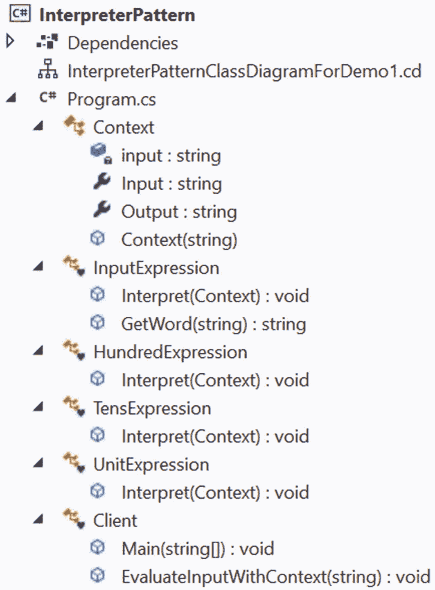
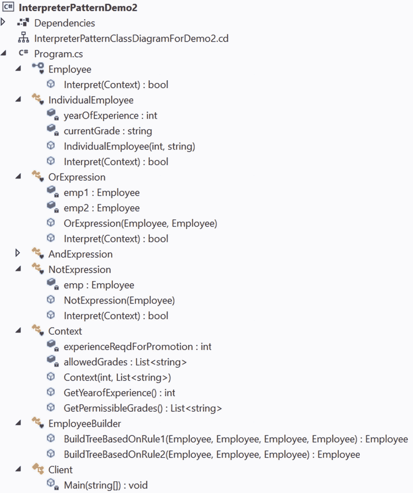

# 二十三、解释器模式

本章涵盖了解释器模式。

## GoF 定义

给定一种语言，为它的语法定义一个表示，以及一个使用该表示来解释该语言中的句子的解释器。

## 概念

这种模式扮演着翻译者的角色，它经常被用来*评估一种语言*中的句子。所以，你首先需要定义一个语法来表示这种语言。然后解释器处理语法。当语法简单时，这种模式是最好的。

Points to Note

为了更好地理解这种模式，熟悉自动机中的单词(或句子)、语法、语言等等是很有帮助的，这是一个很大的话题。对它的详细讨论超出了本书的范围。现在，你知道在正式语言中，字母表可能包含无限数量的元素，一个单词可以是有限的字母序列(简单地说是字符串)，由语法生成的所有字符串的集合称为语言生成的语法(G)。通常，语法由元组(V，T，S，P)表示，其中 V 是一组非终结符，T 是一组终结符，S 是开始符，P 是产生式规则。例如，如果你有一个语法 G = (V，T，S，P)其中

```cs
V={S},
T={a,b},
P={S->aSbS,S->bSaS,S->ε },
S={S};

```

ε表示空字符串。该语法可以生成相同数量的 a 和 b，如 ab、ba、abab、baab 等等。例如，以下步骤显示了获取 **abba 的推导过程。**

```cs
S
aSbS [since S->aSbS]
abS [since S->ε]
abbSaS [since S->bSaS]
abbaS [since S->ε]
abba [sinceS->ε]

```

同样的方法，可以生成 **baab** 。下面是推导步骤，作为快速参考。

```cs
S
bSaS [since S->bSaS]
baS [sinceS->ε]
baaSbS [since S->aSbS]
baabS [sinceS->ε]
baab [sinceS->ε]

```

这个模式中的每个类可能代表语言中的一个规则，它应该有一个解释表达式的方法。因此，为了处理更多的规则，您需要创建更多的类，这就是为什么解释器模式很少用于处理非常复杂的语法。

让我们考虑计算器程序中不同的算术表达式。虽然这些表达式是不同的，但它们都是使用一些基本规则构造的，并且这些规则是在语言的语法中定义的(这些算术表达式)。因此，如果您能够解释这些规则的一般组合，而不是将每个不同的规则组合视为单独的情况，这将是一个更好的想法。在这样的场景中可以使用解释器模式，当您看到演示 2 的细节时，就会明白这一点。但在此之前，我们先来看看演示 1 中一个相对简单的例子。

这种模式的典型结构通常用类似于图 [23-1](#Fig1) 的图表来描述。


图 23-1

典型解释器模式的结构

术语描述如下。

*   抽象表达式通常是一个带有解释器方法的接口。您需要向该方法传递一个上下文对象。

*   **终端表达式**用于终端表达式。终结表达式是不需要其他表达式来解释的表达式。它们是数据结构中的叶节点(即，它们没有子节点)。

*   **非终结符**用于非终结符表达式。它也称为交替表达式、重复表达式和顺序表达式。这就像可以包含终结和非终结表达式的组合。当您对此调用`Interpret()`方法时，您会对它的所有子对象调用`Interpret()`。在演示 2 中，您将看到它们的运行。

*   **上下文**保存解释器需要的全局信息。

*   **客户端**调用`Interpret()`方法。可选地，它可以基于语言的规则构建语法树。

Points to Remember

*   解释器用简单的语法规则处理语言。理想情况下，开发人员不想创建他们自己的语言，这就是他们很少使用这种模式的原因。

*   本章中有两个演示，它们互不相关。第一个相对简单，但是第二个比较复杂，涉及更多的代码。

*   在第一个演示中，您将一个三位数的数字转换成它的对等单词形式。这个程序是从这本书的前一版微调而来的。

*   第二个程序使用解释器模式作为规则验证器，并解释细节。我的书 *Java 设计模式* (Apress，2018)用多个例子讨论了同一个概念。

## 真实世界的例子

现实世界的例子包括翻译外语的翻译。音乐家扮演着音符解释者的角色，也就是“语法”

## 计算机世界的例子

Java 编译器将 Java 源代码解释成 Java 虚拟机能够理解的字节码。在 C# 中，源代码被转换为由公共语言运行库(CLR)解释的 MSIL 中间代码。在执行时，这个 MSIL 被实时(JIT)编译器转换成本机代码(二进制可执行代码)。

## 履行

一般来说，你用一个类来表示这些语法规则。让我们定义一个简单的规则，如下所示。

*   ***E::= E***<sub>T5】**1**</sub>***E***<sub>***2***</sub>***E***<sub>***3***</sub>

*   ***E***<sub>***1***</sub>***:=零百(s) |一百(s) |两百(s) |…|九百(s)***

*   ***E***<sub>***2***</sub>:***=零十(s) |一个十(s) | "两个十(s) | …|九十***

*   ***E***<sub>***3***</sub>:***=和零|和一|和二|和三|…|和九***

为了简单和更好的可读性，我用四个类来表示这个语法:`InputExpression`表示 E(一个抽象类)`HundredExpression`表示 E<sub>**1**</sub>`TensExpression`表示 E<sub>**2**</sub>`UnitExpression`表示 E <sub>**3**</sub> 。所以，在接下来的节目(演示 1)中，`789`被解释为`Seven hundred(s) Eight ten(s) and Nine.`

在演示 1 中，`Context`类非常容易理解。它有一个公共构造函数，接受一个名为`input,`的字符串参数，这个参数稍后会以 word 形式解释。该类还包含一个只读属性`Input`和一个名为`Output`的读写属性，定义如下。

```cs
    public class Context
    {
        private string input;
        public string Input {
            get
            {
                return input;
            }
        }
        public string Output { get; set; }

        // The constructor
        public Context(string input)
        {
            this.input = input;
        }

    }

```

抽象类`InputExpression`拥有抽象方法`Interpret(...)`，它被它的具体子类`HundredExpression`、`TensExpression`和`UnitExpression`覆盖。这个类还包含一个具体的方法`GetWord(string str)`，它在所有具体的子类中使用。我将这个方法放在这个抽象类中，这样我就可以简单地避免在具体的子类中重复这些代码。这个类如下。

```cs
    // The abstract class-will hold the common code.
    abstract class InputExpression
    {
        public abstract void Interpret(Context context);
        public string GetWord(string str)
        {
            switch (str)
            {
                case "1":
                    return "One";
                case "2":
                    return "Two";
                case "3":
                    return "Three";
                case "4":
                    return "Four";
                case "5":
                    return "Five";
                case "6":
                    return "Six";
                case "7":
                    return "Seven";
                case "8":
                    return "Eight";
                case "9":
                    return "Nine";
                case "0":
                    return "Zero";
                default:
                    return "*";
            }
        }
    }

```

在具体的子类中，您可以看到内置的`Substring`方法从输入中选择想要的数字。下面一行显示了这一点。

```cs
string hundreds = context.Input.Substring(0, 1);

```

最后，在客户端代码中，在给定的上下文中解释`input`之前，我使用了一个名为`EvaluateInputWithContext`的独立方法来构建解析树。所以，你会看到下面几行。

```cs
// Building the parse tree
List<InputExpression> expTree = new List<InputExpression>();
expTree.Add(new HundredExpression());
expTree.Add(new TensExpression());
expTree.Add(new UnitExpression());
// Interpret the input
foreach (InputExpression inputExp in expTree)
{
    inputExp.Interpret(context);
}
// some other code..

```

剩下的代码很容易理解，所以让我们继续。

### 类图

图 [23-2](#Fig2) 为类图。


图 23-2

类图

### 解决方案资源管理器视图

图 [23-3](#Fig3) 显示了程序各部分的高层结构。



图 23-3

解决方案资源管理器视图

### 演示 1

这是完整的演示。

```cs
using System;
using System.Collections.Generic;

namespace InterpreterPattern
{
    public class Context
    {
        private string input;
        public string Input {
            get
            {
                return input;
            }
        }
        public string Output { get; set; }

        // The constructor
        public Context(string input)
        {
            this.input = input;
        }

    }
    // The abstract class. It will hold the common code
    abstract class InputExpression
    {
        public abstract void Interpret(Context context);
        public string GetWord(string str)
        {

            switch (str)
            {
                case "1":
                    return "One";
                case "2":
                    return "Two";
                case "3":
                    return "Three";
                case "4":
                    return "Four";
                case "5":
                    return "Five";
                case "6":
                    return "Six";
                case "7":
                    return "Seven";
                case "8":
                    return "Eight";
                case "9":
                    return "Nine";
                case "0":
                    return "Zero";
                default:
                    return "*";
            }
        }
    }

    class HundredExpression : InputExpression
    {
        public override void Interpret(Context context)
        {
         string hundreds = context.Input.Substring(0,1);
         context.Output += GetWord(hundreds) + " hundred(s) ";
        }
    }
    class TensExpression : InputExpression
    {
        public override void Interpret(Context context)
        {
            string tens = context.Input.Substring(1,1);
            context.Output += GetWord(tens) + " ten(s) ";
        }
    }
    class UnitExpression : InputExpression
    {
        public override void Interpret(Context context)
        {
            string units = context.Input.Substring(2, 1);
            context.Output += "and "+GetWord(units);
        }
    }

    // Client Class
    class Client
    {
        public static void Main(String[] args)
        {
            Console.WriteLine("***Interpreter Pattern Demonstation-1.***\n");
            Console.WriteLine(" It will validate first three digit of a valid number.");
            string inputString="789";
            EvaluateInputWithContext(inputString);
            inputString = "456";
            EvaluateInputWithContext(inputString);
            inputString = "123";
            EvaluateInputWithContext(inputString);
            inputString = "075";
            EvaluateInputWithContext(inputString);
            inputString = "Ku79";//invalid input
            EvaluateInputWithContext(inputString);

            Console.ReadLine();
        }
        public static void EvaluateInputWithContext(string inputString)
        {
            Context context = new Context(inputString);
            //Building the parse tree
            List<InputExpression> expTree = new List<InputExpression>();
            expTree.Add(new HundredExpression());
            expTree.Add(new TensExpression());
            expTree.Add(new UnitExpression());
            // Interpret the input
            foreach (InputExpression inputExp in expTree)
            {
                inputExp.Interpret(context);
            }
            if (!context.Output.Contains("*"))
                Console.WriteLine($" {context.Input} is interpreted as {context.Output}");
            else
            {
                Console.WriteLine($" {context.Input} is not a valid input.");
            }
        }
    }
}

```

### 输出

这是输出。

```cs
***Interpreter Pattern Demonstation-1.***

It will validate first three digit of a valid number.
789 is interpreted as Seven hundred(s) Eight ten(s) and Nine
456 is interpreted as Four hundred(s) Five ten(s) and Six
123 is interpreted as One hundred(s) Two ten(s) and Three
075 is interpreted as Zero hundred(s) Seven ten(s) and Five
Ku79 is not a valid input.

```

## 另一个实现

让我们看看这种模式的另一种用法。当您考虑实现该模式时，有一些重要的步骤(在本例中遵循这些步骤)。这些如下。

*   第一步定义你想为之构建解释器的语言的规则。

*   **第二步**定义一个抽象类或者接口来表示一个表达式。它应该包含一个解释表达式的方法。
    *   **步 2A** 识别终结符和非终结符表达式。例如，在接下来的例子中，`IndividualEmployee`类是一个终端表达式类。

    *   **步 2B** 创建非终结符表达式类。他们每个人都在他们的子节点上调用解释方法。例如，在接下来的例子中，`OrExpression`和`AndExpression`类是非终结表达式类。

*   **步骤 3** 使用这些类构建抽象语法树。*您可以在客户端代码中完成这项工作，或者您可以创建一个单独的类来完成任务*。

*   客户现在使用这个树来解释一个句子。

*   **步骤 5** 将上下文传递给解释器。它通常有需要解释的句子。解释器也可以使用这个上下文执行一些额外的任务。

Points to Note

在接下来的程序中，我使用解释器模式作为规则验证器。

在这里，我用不同的员工的“经验年数”和当前的等级来举例说明。为了简单起见，有四个不同级别的员工:G1、G2、G3 和 G4。所以，你会看到下面几行。

```cs
   Employee emp1 = new IndividualEmployee(5, "G1");
   Employee emp2 = new IndividualEmployee(10, "G2");
   Employee emp3 = new IndividualEmployee(15, "G3");
   Employee emp4 = new IndividualEmployee(20, "G4");

```

我想在上下文中验证一个规则，它告诉你*要被提升，一个员工应该至少有 10 年的经验，并且他应该来自 G2 级或 G3 级。一旦这些表达式被解释，你会看到布尔值*的输出。您可以在`Main()`方法中看到下面几行代码。

```cs
// Minimum Criteria for promoton is:
// The year of experience is minimum 10 yrs. and
// Employee grade should be either G2 or G3
List<string> allowedGrades = new List<string> { "G2", "G3" };
Context context = new Context(10, allowedGrades);

```

可以看到，允许的成绩存储在一个列表中，并传递给了`Context`类构造函数。因此，`Context`类中的以下代码片段对您来说可能有意义。

```cs
private int experienceReqdForPromotion;
private List<string> allowedGrades;
public Context(int experience, List<string> allowedGrades)
{
    this.experienceReqdForPromotion = experience;
    this.allowedGrades = new List<string>();
    foreach (string grade in allowedGrades)
    {
        this.allowedGrades.Add(grade);
    }
}

```

`Employee`是与`Interpret(...)`方法的接口，如下所示。

```cs
interface Employee
{
    bool Interpret(Context context);
}

```

正如我之前告诉你的，在这个例子中,`IndividualEmployee`类充当叶节点。这个类如下实现了`Employee`接口方法。

```cs
public bool Interpret(Context context)
{
    if (this.yearOfExperience >= context.GetYearofExperience()
    && context.GetPermissibleGrades().Contains(this.currentGrade))
    {
        return true;
    }
    return false;
}

```

现在让我们来处理这个例子中一些复杂的规则或表达式。在客户端代码中，您可以看到第一个复杂的规则，如下所示。

```cs
Console.WriteLine("Is emp1 and any of emp2, emp3, emp4 is eligible for promotion?" + builder.BuildTreeBasedOnRule1(emp1, emp2, emp3, emp4).Interpret(context));
Console.WriteLine("Is emp2 and any of emp1, emp3, emp4 is eligible for promotion?"+ builder.BuildTreeBasedOnRule1(emp2, emp1, emp3, emp4).Interpret(context));
// and so on..

```

第二个复杂规则的形式如下。

```cs
Console.WriteLine("Is emp1 or (emp2 but not emp3) is eligible for promotion?"+ builder.BuildTreeBasedOnRule2(emp1, emp2, emp3).Interpret(context));
Console.WriteLine("Is emp2 or (emp3 but not emp4) is eligible for promotion?"+ builder.BuildTreeBasedOnRule2(emp2, emp3, emp4).Interpret(context));

```

所以，你可能会问这些规则是如何运作的？答案如下:另一个类`EmployeeBuilder`，有评估这些规则的方法。您将很快看到详细的实现，但是现在，让我们看一下形成第一个规则的一步一步的过程，如下所示，带有支持注释。

```cs
// Building the tree
//Complex Rule-1: emp1 and (emp2 or (emp3 or emp4))
public Employee BuildTreeBasedOnRule1(Employee emp1, Employee emp2, Employee emp3, Employee emp4)
{
    // emp3 or emp4
   Employee firstPhase = new OrExpression(emp3, emp4);
   // emp2 or (emp3 or emp4)
   Employee secondPhase = new OrExpression(emp2, firstPhase);
   // emp1 and (emp2 or (emp3 or emp4))
   Employee finalPhase = new AndExpression(emp1, secondPhase);
   return finalPhase;
}

```

`AndExpression`、`OrExpression,`和`NotExpression`是实现接口`Employee,`的三个具体类，因此它们都有自己的`Interpret(...)`方法。例如，`AndExpression`实现`Interpret(...)`方法如下。

```cs
public bool Interpret(Context context)
{
    return emp1.Interpret(context) && emp2.Interpret(context);
}

```

同样，`OrExpression`实现`Interpret(...)`方法如下。

```cs
public bool Interpret(Context context)
{
    return emp1.Interpret(context) || emp2.Interpret(context);
}

```

并且`NotExpression`实现了如下相同的方法。

```cs
public bool Interpret(Context context)
{
    return !emp.Interpret(context);
}

```

您可以看到每个复合表达式都在调用其所有子表达式的`Interpret()`方法。剩下的代码很容易理解，让我们继续。

Note

这种设计模式不会指导您如何构建语法树或如何解析句子。它给你自由，让你决定如何前进。

### 类图

图 [23-4](#Fig4) 为类图。


图 23-4

类图

### 解决方案资源管理器视图

图 [23-5](#Fig5) 显示了程序各部分的高层结构。



图 23-5

解决方案资源管理器视图

### 演示 2

下面是完整的实现。

```cs
using System;
using System.Collections.Generic;

namespace InterpreterPatternDemo2
{
    interface Employee
    {
        bool Interpret(Context context);
    }
    /// <summary>
    /// IndividualEmployee class
    /// </summary>
    class IndividualEmployee : Employee
    {
        private int yearOfExperience;
        private string currentGrade;
        public IndividualEmployee(int experience, string grade)
        {
            this.yearOfExperience = experience;
            this.currentGrade = grade;
        }
        public bool Interpret(Context context)
        {
            if (this.yearOfExperience >= context.GetYearofExperience()
                 && context.GetPermissibleGrades().Contains(this.currentGrade))
               {
                   return true;
               }
            return false;
        }
    }
    /// <summary>
    /// OrExpression class
    /// </summary>
    class OrExpression : Employee
    {
        private Employee emp1;
        private Employee emp2;
        public OrExpression(Employee emp1, Employee emp2)
        {
            this.emp1 = emp1;
            this.emp2 = emp2;
        }
        public bool Interpret(Context context)
        {
            return emp1.Interpret(context) || emp2.Interpret(context);
        }
    }
    /// <summary>
    /// AndExpression class
    /// </summary>
    class AndExpression : Employee
    {
        private Employee emp1;
        private Employee emp2;
        public AndExpression(Employee emp1, Employee emp2)
        {
            this.emp1 = emp1;
            this.emp2 = emp2;
        }
        public bool Interpret(Context context)
        {
            return emp1.Interpret(context) && emp2.Interpret(context);
        }
    }
    /// <summary>
    /// NotExpression class
    /// </summary>
    class NotExpression : Employee
    {
        private Employee emp;
        public NotExpression(Employee expr)
        {
            this.emp = expr;
        }
        public bool Interpret(Context context)
        {
            return !emp.Interpret(context);
        }
    }
    /// <summary>
    /// Context class
    /// </summary>
    class Context
    {
        private int experienceReqdForPromotion;
        private List<string> allowedGrades;
        public Context(int experience, List<string> allowedGrades)
        {
            this.experienceReqdForPromotion = experience;
            this.allowedGrades = new List<string>();
            foreach (string grade in allowedGrades)
            {
                this.allowedGrades.Add(grade);
            }
        }
        public int GetYearofExperience()
        {
            return experienceReqdForPromotion;
        }
        public List<string> GetPermissibleGrades()
        {
            return allowedGrades;
        }
    }
    /// <summary>
    /// EmployeeBuilder class
    /// </summary>
    class EmployeeBuilder
    {
        // Building the tree
        // Complex Rule-1: emp1 and (emp2 or (emp3 or emp4))
        public Employee BuildTreeBasedOnRule1(Employee emp1, Employee emp2, Employee emp3, Employee emp4)
        {
            // emp3 or emp4
            Employee firstPhase = new OrExpression(emp3, emp4);
            // emp2 or (emp3 or emp4)
            Employee secondPhase = new OrExpression(emp2, firstPhase);
            // emp1 and (emp2 or (emp3 or emp4))
            Employee finalPhase = new AndExpression(emp1, secondPhase);
            return finalPhase;
        }
        // Complex Rule-2: emp1 or (emp2 and (not emp3 ))
        public Employee BuildTreeBasedOnRule2(Employee emp1, Employee emp2, Employee emp3)
        {
            // Not emp3
            Employee firstPhase = new NotExpression(emp3);
            // emp2 or (not emp3)
            Employee secondPhase = new AndExpression(emp2, firstPhase);
            // emp1 and (emp2 or (not emp3 ))
            Employee finalPhase = new OrExpression(emp1, secondPhase);
            return finalPhase;
        }
    }
    public class Client
    {

        static void Main(string[] args)
        {
            Console.WriteLine("***Interpreter Pattern Demonstration-2***\n");

            // Minimum Criteria for promoton is:
            // The year of experience is minimum 10 yrs. and
            // Employee grade should be either G2 or G3
            List<string> allowedGrades = new List<string> { "G2", "G3" };
            Context context = new Context(10, allowedGrades);
            Employee emp1 = new IndividualEmployee(5, "G1");
            Employee emp2 = new IndividualEmployee(10, "G2");
            Employee emp3 = new IndividualEmployee(15, "G3");
            Employee emp4 = new IndividualEmployee(20, "G4");

            EmployeeBuilder builder = new EmployeeBuilder();

            // Validating the 1st complex rule
            Console.WriteLine("----- Validating the first complex rule.-----");
            Console.WriteLine("Is emp1 and any of emp2, emp3, emp4 is eligible for promotion?"
                + builder.BuildTreeBasedOnRule1(emp1, emp2, emp3, emp4).Interpret(context));
            Console.WriteLine("Is emp2 and any of emp1, emp3, emp4 is eligible for promotion?"
                + builder.BuildTreeBasedOnRule1(emp2, emp1, emp3, emp4).Interpret(context));
            Console.WriteLine("Is emp3 and any of emp1, emp2, emp3 is eligible for promotion?"
                + builder.BuildTreeBasedOnRule1(emp3, emp1, emp2, emp4).Interpret(context));
            Console.WriteLine("Is emp4 and any of emp1, emp2, emp3 is eligible for promotion?"
                + builder.BuildTreeBasedOnRule1(emp4, emp1, emp2, emp3).Interpret(context));

            Console.WriteLine("-----Validating the second complex rule now.-----");
            //Validating the 2nd complex rule
            Console.WriteLine("Is emp1 or (emp2 but not emp3) is eligible for promotion?"
                + builder.BuildTreeBasedOnRule2(emp1, emp2, emp3).Interpret(context));
            Console.WriteLine("Is emp2 or (emp3 but not emp4) is eligible for promotion?"
                + builder.BuildTreeBasedOnRule2(emp2, emp3, emp4).Interpret(context));
            Console.ReadKey();
        }
    }
}

```

### 输出

这是输出。

```cs
***Interpreter Pattern Demonstration-2***

----- Validating the first complex rule.-----
Is emp1 and any of emp2, emp3, emp4 is eligible for promotion?False
Is emp2 and any of emp1, emp3, emp4 is eligible for promotion?True
Is emp3 and any of emp1, emp2, emp3 is eligible for promotion?True
Is emp4 and any of emp1, emp2, emp3 is eligible for promotion?False
-----Validating the second complex rule now.-----
Is emp1 or (emp2 but not emp3) is eligible for promotion?False
Is emp2 or (emp3 but not emp4) is eligible for promotion?True

```

## 问答环节

23.1 什么时候应该使用这种模式？

说实话，日常编程中并不太需要。然而，在一些罕见的情况下，您可能需要使用您自己的编程语言，这可能会派上用场。但在你继续之前，你必须问自己，投资回报率(ROI)是多少？

23.2 使用解释器设计模式有什么好处？

以下是一些优点。

*   你参与了为一种语言定义语法以及如何表达和解释句子的过程。你也可以改变和扩展语法。

*   你有充分的自由去解释这些表达。

**23.3 与使用解释器设计模式相关的** **挑战** **有哪些？**

我相信工作量是最大的问题。此外，维护复杂的语法变得棘手，因为您可能需要创建(和维护)单独的类来处理不同的规则。

这是本书第一部分的结尾。我希望您喜欢所有 GoF 模式的所有详细实现。现在您可以转到本书的下一部分，这一部分涵盖了其他一些有趣的模式。