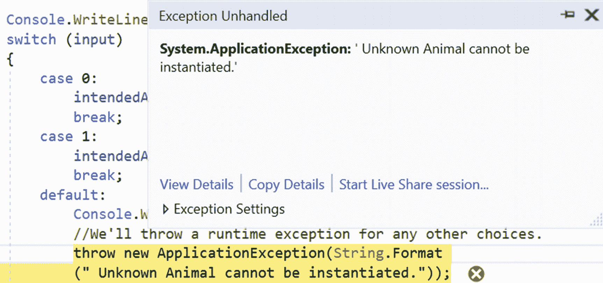

# 二十四、简单工厂模式

本章介绍简单工厂模式。

## 定义

简单工厂模式创建一个对象，而不向客户机公开实例化逻辑。

## 概念

在面向对象编程(OOP)中，工厂就是这样一种可以创建其他对象的对象。可以通过多种方式调用工厂，但最常见的是，它使用一种可以返回具有不同原型的对象的方法。任何帮助创建这些新对象的子程序都被认为是一个工厂。最重要的是，它帮助您从应用的消费者那里抽象出对象创建的过程。

## 真实世界的例子

在南印度餐馆，当你点你最喜欢的印度炒菜时，服务员可能会问你是否喜欢你的印度炒菜多加点香料，或者是否应该少加点香料。根据你的选择，厨师在主料中加入香料，为你做出合适的菜肴。

## 计算机世界的例子

简单工厂模式在软件应用中很常见，但是在继续之前，请注意以下几点。

*   在 GoF 的著名著作中，简单工厂模式没有被视为标准设计模式，但是这种方法对于您编写的任何应用来说都是常见的，在这些应用中，您希望将变化很大的代码与没有变化的代码部分分开。假设您在编写的所有应用中都遵循这种方法。

*   简单工厂模式被认为是工厂方法模式(和抽象工厂模式)的最简单形式。因此，您可以假设任何遵循工厂方法模式或抽象工厂模式的应用也遵循简单工厂模式的设计目标的概念。

在下面的实现中，我用一个常见的用例来讨论这个模式。让我们来看一下实现。

## 履行

这些是以下实现的重要特征。

*   在这个例子中，你正在处理两种不同类型的动物:狗和老虎。具体有两个类:`Dog.cs`和`Tiger.cs`。每个类都有一个共同的父类，`IAnimal.cs`。您会看到以下代码:

*   我将创建对象的代码放在不同的地方(特别是在工厂类中)。使用这种方法，当您创建一只狗或一只老虎时，您不需要在客户端代码中直接使用`new`操作符。因此，在客户端代码中，您会看到下面一行:

```cs
// IAnimal.cs
namespace SimpleFactory
{
    public interface IAnimal
    {
        void AboutMe();
    }
}
// Dog.cs

using System;
namespace SimpleFactory
{
    public class Dog : IAnimal
    {
        public void AboutMe()
        {
            Console.WriteLine("The dogs says: Bow-Wow.I prefer barking.");
        }
    }
}
//Tiger.cs
using System;

namespace SimpleFactory
{
    public class Tiger : IAnimal
    {
        public void AboutMe()
        {
            Console.WriteLine("The tiger says: Halum.I prefer hunting.");
        }
    }
}

```

*   在接下来的示例中，创建对象的过程取决于用户输入。我将可能变化的代码与最不可能变化的代码分开。这种机制可以帮助您消除系统中的紧密耦合。因此，在`Main()`中，您会看到下面的代码和支持性的注释:

    ```cs
    IAnimal preferredType = null;
    SimpleFactory simpleFactory = new SimpleFactory();
    #region The code region that can vary based on users preference
    /*
    * Since this part may vary, we're moving the
    * part to CreateAnimal() of SimpleFactory class.
    */
    preferredType = simpleFactory.CreateAnimal();
    #endregion
    #region The codes that do not change frequently.
    preferredType.AboutMe();
    #endregion

    ```

```cs
preferredType = simpleFactory.CreateAnimal();

```

Note

在某些地方，您可能会看到这种模式的变体，其中对象是通过参数化的构造函数(如`preferredType=simpleFactory.CreateAnimal("Tiger")`)创建的。

在接下来的例子中，我根据用户的输入选择动物，不需要参数化的构造函数。在本书的早期版本中，我使用了两种方法:`Speak()`和`Action()`。但是为了使这个例子简短，我选择了一个叫做`AboutMe()`的方法。我把前面的两个方法合并成一个方法。

### 类图

图 [24-1](#Fig1) 为类图。


图 24-1

类图

### 解决方案资源管理器视图

图 [24-2](#Fig2) 显示了程序的高层结构。


图 24-2

解决方案资源管理器视图

### 示范

下面是完整的实现。程序的所有部分都被分开并放在名称空间 SimpleFactory 中。因此，对于下面的代码段，您可能会多次看到命名空间声明。

```cs
//IAnimal.cs
namespace SimpleFactory
{
    public interface IAnimal
    {
        void AboutMe();
    }
}
//Dog.cs

using System;
namespace SimpleFactory
{
    public class Dog : IAnimal
    {
        public void AboutMe()
        {
            Console.WriteLine("The dog says: Bow-Wow.I prefer barking.");
        }
    }
}

//Tiger.cs
using System;

namespace SimpleFactory
{
    public class Tiger : IAnimal
    {
        public void AboutMe()
        {
            Console.WriteLine("The tiger says: Halum.I prefer hunting.");
        }
    }
}

//SimpleFactory.cs
using System;
namespace SimpleFactory
{
    public class SimpleFactory
    {
        public IAnimal CreateAnimal()
        {
            IAnimal intendedAnimal = null;
            Console.WriteLine("Enter your choice(0 for Dog, 1 for Tiger)");
            string b1 = Console.ReadLine();
            int input;
            if (int.TryParse(b1, out input))
            {
                Console.WriteLine("You have entered {0}", input);
                switch (input)
                {
                    case 0:
                        intendedAnimal = new Dog();
                        break;
                    case 1:
                        intendedAnimal = new Tiger();
                        break;
                    default:
                        Console.WriteLine("You must enter either 0 or 1");
                        //We'll throw a runtime exception for any other //choices.
                        throw new ApplicationException(String.Format
                        (" Unknown Animal cannot be instantiated."));
                }
            }
            return intendedAnimal;
        }
    }
}

//Program.cs(Client)
 using System;
namespace SimpleFactory
{
    /*
     * A client is interested to get an animal
     * who can tell something about it.
     */
    class Client
    {
        static void Main(string[] args)
        {
            Console.WriteLine("*** Simple Factory Pattern Demo.***\n");
            IAnimal preferredType = null;
            SimpleFactory simpleFactory = new SimpleFactory();
            #region The code region that can vary based on users preference
            /*
             * Since this part may vary,we're moving the
             * part to CreateAnimal() in SimpleFactory class.
             */
            preferredType = simpleFactory.CreateAnimal();
            #endregion

            #region The codes that do not change frequently.
            preferredType.AboutMe();
            #endregion

            Console.ReadKey();
        }
    }
}

```

### 输出

以下是情况 1，用户输入为 0。

```cs
*** Simple Factory Pattern Demo.***

Enter your choice(0 for Dog, 1 for Tiger)
0
You have entered 0
The dog says: Bow-Wow.I prefer barking.

```

下面是情况 2，用户输入 1。

```cs
*** Simple Factory Pattern Demo.***

Enter your choice(0 for Dog, 1 for Tiger)
1
You have entered 1
The tiger says: Halum.I prefer hunting.

```

下面是情况 3，用户输入 3。

```cs
*** Simple Factory Pattern Demo.***

Enter your choice(0 for Dog, 1 for Tiger)
3
You have entered 3
You must enter either 0 or 1

```

在这种情况下，您会得到以下异常:“未知动物无法实例化”(见图 [24-3](#Fig3) )。



图 24-3

由于输入无效，出现异常

## 问答环节

**24.1 在这个例子中，我看到客户通过简单的工厂模式委托** **对象的创建** **。但是他们可以用** `new` **操作符直接创建对象。这是正确的吗？**

不。这些是之前设计背后的主要原因。

*   面向对象设计的关键原则之一是将代码中最有可能发生变化的部分与其余部分分开。

*   在这种情况下，只有对象的创建过程会发生变化。您可以假设有代码片段来描述关于动物的一些事情，并且该部分代码不需要在客户端代码中变化。所以，在将来，如果在创建过程中需要任何更改，您只需要更改`SimpleFactory`类的`CreateAnimal()`方法。客户端代码不会因为这些更改而受到影响。

*   您不希望在客户端主体中放置大量的`if-else`块(或`switch`语句)。这使得你的代码笨拙。

*   客户端代码看不到您是如何创建对象的。这种抽象提高了安全性。

**24.2 与此模式相关的** **挑战** **有哪些？**

如果要添加新的动物或者删除已有的动物，需要修改`CreateAnimal()`方法。这个过程违反了 SOLID 原则的开放/封闭原则(即代码模块应该对扩展开放，但对修改关闭)。

Note

罗伯特·c·马丁提出了坚实的原则。有许多在线资源可用。如果你对快速介绍感兴趣，去 [`https://en.wikipedia.org/wiki/SOLID`](https://en.wikipedia.org/wiki/SOLID) 。

24.3 你能让工厂类成为静态的吗？

可以，但是必须记住与静态类相关的限制。例如，您不能继承它们，等等。当您处理一些没有实现类或单独接口的值对象时，这是有意义的。当您使用不可变的类时，它也很有用，并且您的工厂类不需要在每次使用它时都返回一个全新的对象。

简而言之，值对象是其相等性基于值而不是身份的对象。值对象最重要的特征是，没有身份，它是不可变的。

一个简单的现实生活中的例子可以用印度的五卢比纸币和五卢比硬币来给出。它们的货币价值是相同的，但它们是不同的实例。

一般来说，静态工厂类可以提升全局状态，这对于面向对象编程来说并不理想。