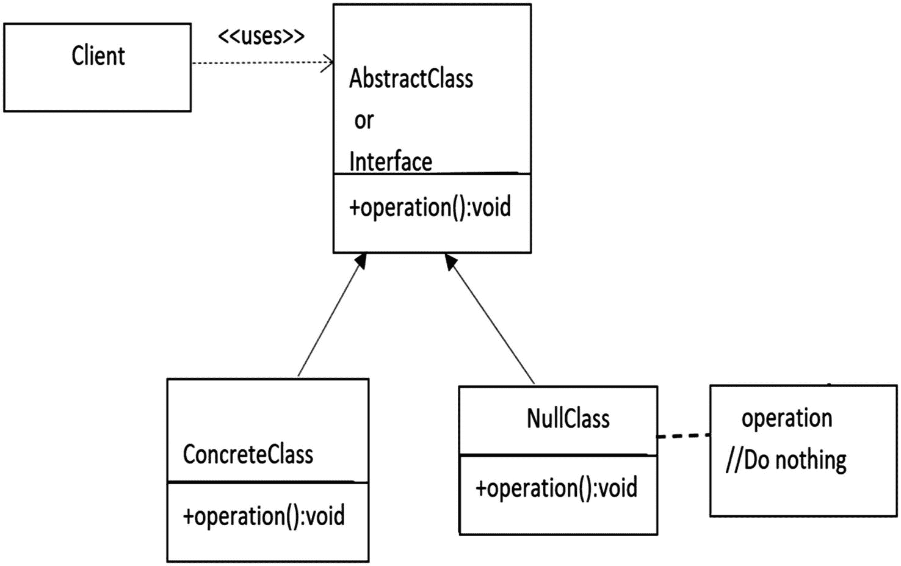
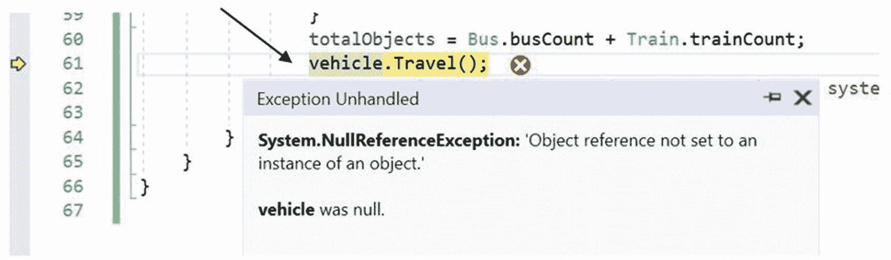
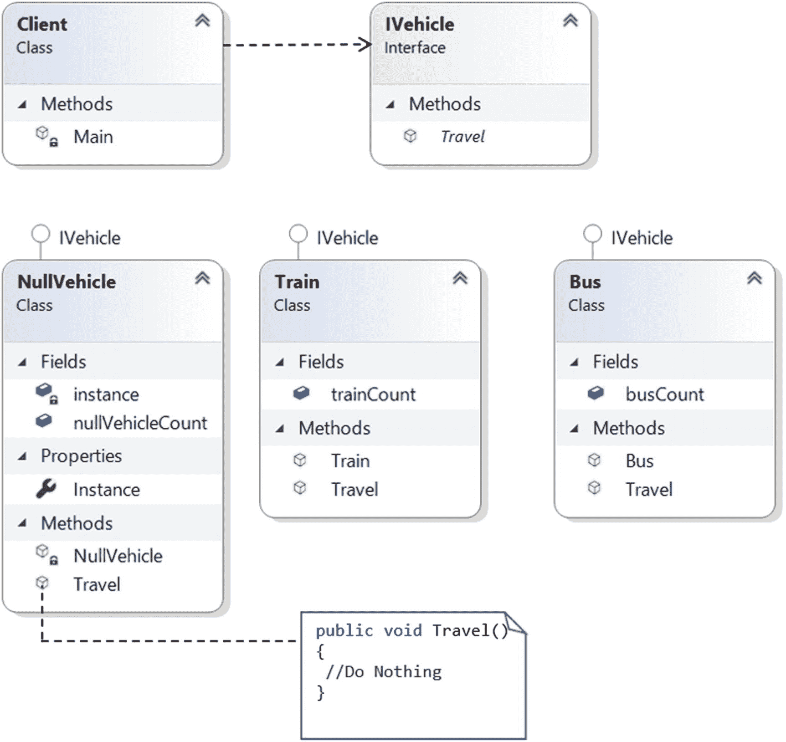
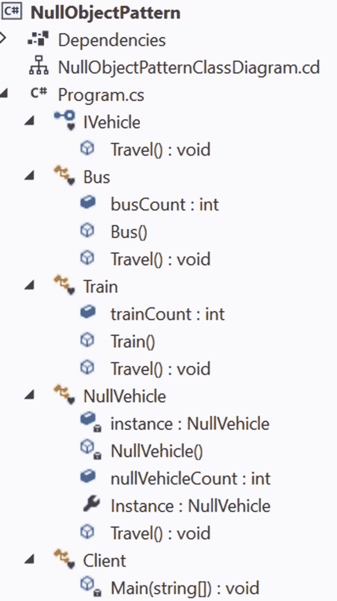

# 二十五、空对象模式

本章介绍了空对象模式。

## 定义

空对象模式不是 GoF 设计模式。我从维基百科上得到这个定义，它是这样说的。

> *在面向对象的计算机编程中，空对象是指没有引用值或具有已定义的中立(“空”)行为的对象。空对象设计模式描述了此类对象的用途及其行为(或缺乏行为)。它最初发表在程序设计的模式语言系列丛书中。*

## 概念

该模式可以实现“什么都不做”的关系，或者当应用遇到空对象而不是真实对象时，它可以提供默认行为。使用这种模式，我们的核心目标是通过`if`块避免“空对象检查”或“空协作检查”,并通过提供不做任何事情的默认行为来封装对象的缺失，从而制定一个更好的解决方案。该模式的基本结构如图 [25-1](#Fig1) 所示。



图 25-1

空对象模式的基本结构

本章从一个看似没问题的程序开始，但它有一个严重的潜在 bug。当您使用潜在的解决方案分析 bug 时，您会理解对空对象模式的需求。那么，让我们跳到下一节。

### 错误的程序

让我们假设您有两种不同类型的交通工具:`Bus`和`Train,`，并且一个客户端可以传递不同的输入(例如，`a`和`b`)来创建一个`Bus`对象或一个`Train`对象。下面的程序演示了这一点。当输入有效时，这个程序可以顺利运行，但是当您提供一个无效的输入时，一个潜在的错误就暴露出来了。这是有问题的程序。

```cs
using System;

namespace ProgramWithOnePotentialBug
{
    interface IVehicle
    {
        void Travel();
    }
    class Bus : IVehicle
    {
        public static int busCount = 0;
        public Bus()
        {
            busCount++;
        }
        public void Travel()
        {
            Console.WriteLine("Let us travel with Bus");
        }
    }
    class Train : IVehicle
    {
        public static int trainCount = 0;
        public Train()
        {
            trainCount++;
        }
        public void Travel()
        {
            Console.WriteLine("Let us travel with Train");
        }
    }

    class Program
    {
        static void Main(string[] args)

        {
            Console.WriteLine("***This program demonstrates the need of null object pattern.***\n");
            string input = String.Empty;
            int totalObjects = 0;

            while (input != "exit")
            {
                Console.WriteLine("Enter your choice(Type 'a' for Bus, 'b' for Train.Type 'exit' to quit application.");
                input = Console.ReadLine();
                IVehicle vehicle = null;
                switch (input)
                {
                    case "a":
                        vehicle = new Bus();
                        break;
                    case "b":
                        vehicle = new Train();
                        break;
                    case "exit":
                        Console.WriteLine("Creating one more bus and closing the application");
                        vehicle = new Bus();
                        break;
                }
                totalObjects = Bus.busCount + Train.trainCount;
                vehicle.Travel();
                Console.WriteLine($"Total objects created in the system ={totalObjects}");
            }
        }
    }
}

```

### 具有有效输入的输出

你可能有一个眼前的问题；当你输入`exit`时，你创建了一个不必要的对象。这是真的。我们以后再处理。现在，让我们关注另一个对我们来说更危险的 bug。下面是一些有效输入的输出。

```cs
***This program demonstrates the need of null object pattern.***

Enter your choice(Type 'a' for Bus, 'b' for Train.Type 'exit' to quit application.
a
Let us travel with Bus
Total objects created in the system =1
Enter your choice(Type 'a' for Bus, 'b' for Train.Type 'exit' to quit application.
b
Let us travel with Train
Total objects created in the system =2
Enter your choice(Type 'a' for Bus, 'b' for Train.Type 'exit' to quit application.
a
Let us travel with Bus
Total objects created in the system =3
Enter your choice(Type 'a' for Bus, 'b' for Train.Type 'exit' to quit application.

```

### 不需要输入的分析

让我们假设用户错误地提供了一个不同的字符，比如 *e* ，如下所示。

```cs
Enter your choice(Type 'a' for Bus, 'b' for Train.Type 'exit' to quit application.
e

```

这一次，你得到了一个名为`System.NullReferenceException`的运行时异常，如图 [25-2](#Fig2) 所示。



图 25-2

当用户提供无效输入时，会发生运行时异常

### 潜在的解决办法

您可能想到的直接补救方法是在调用操作之前进行空检查，如下所示。

```cs
if (vehicle != null)
{
  vehicle.Travel();
}

```

### 分析

先前的解决方案在这种情况下有效。但是请考虑一个企业应用。当您对每个场景进行空检查时，如果您在每个场景中都像这样放置`if`条件，那么您的代码就会变脏。同时，你可能会注意到维护困难的副作用。空对象模式的概念在类似的情况下很有用。

Point to Remember

在前面的例子中，当用户键入 *exit* 时，我可以避免创建不必要的对象，如果我使用如下的**空条件操作符**，也可以避免空检查:

```cs
vehicle?.Travel();

```

该运算符仅在 C# 6 和更高版本中可用。不过，研究一下空对象模式的实现细节对您还是有好处的。例如，当您使用空对象模式时，您可以为这些空对象提供默认行为(最适合您的应用),而不是什么都不做。

## 真实世界的例子

当有水供应而没有任何内部泄漏时，洗衣机就能正常工作。但是假设有一次，你忘记在开始洗衣服之前供水，但是你按下了开始洗衣服的按钮。在这种情况下，洗衣机不应损坏自身；所以，它可以发出警报声来引起你的注意，并指示此刻没有供水。

## 计算机世界的例子

假设在客户端-服务器架构中，服务器基于客户端输入进行计算。服务器需要足够智能，不会启动任何不必要的计算。在处理输入之前，它可能希望进行交叉验证，以确保是否需要开始计算，或者应该忽略无效的输入。在这种情况下，您可能会注意到带有空对象模式的命令模式。

基本上，在企业应用中，使用这种设计模式可以避免大量的 **null 检查和 if/else 阻塞**。下面的实现给出了这种模式的概述。

## 履行

让我们修改之前讨论过的有问题的程序。这次您通过一个`NullVehicle`对象处理无效输入。因此，如果用户错误地提供了任何无效数据(换句话说，除了本例中的 *a* 或 *b* 之外的任何输入)，应用什么都不做；也就是说，它可以通过一个`NullVehicle`对象忽略那些无效输入，这个对象什么也不做。该类定义如下。

```cs
/// <summary>
/// NullVehicle class
/// </summary>
class NullVehicle : IVehicle
{
 private static readonly NullVehicle instance = new NullVehicle();
 private NullVehicle()
 {
  nullVehicleCount++;
  }
 public static int nullVehicleCount;
 public static NullVehicle Instance
 {
  get
  {
    return instance;
  }
 }
 public void Travel()
{
   // Do Nothing
}
}

```

您可以看到，当我创建一个`NullVehicle`对象时，我应用了单体设计模式的概念。因为可能有无限多的无效输入，所以在下面的例子中，我不想重复创建`NullVehicle`对象。一旦有了一个`NullVehicle`对象，我想重用那个对象。

Note

对于空对象方法，您需要返回任何看起来合理的默认值。在我们的例子中，你不能乘坐一辆不存在的车辆。因此，对于`NullVehicle`类来说，`Travel()`方法什么也不做是有道理的。

### 类图

图 [25-3](#Fig3) 为类图。



图 25-3

类图

### 解决方案资源管理器视图

图 [25-4](#Fig4) 显示了程序的高层结构。



图 25-4

解决方案资源管理器视图

### 示范

下面是完整的实现。

```cs
using System;
namespace NullObjectPattern
{
    interface IVehicle
    {
        void Travel();
    }
    /// <summary>
    /// Bus class
    /// </summary>
    class Bus : IVehicle
    {
        public static int busCount = 0;
        public Bus()
        {
            busCount++;
        }
        public void Travel()
        {
            Console.WriteLine("Let us travel with Bus.");
        }
    }
    /// <summary>
    /// Train class
    /// </summary>
    class Train : IVehicle
    {
        public static int trainCount = 0;
        public Train()
        {
            trainCount++;
        }
        public void Travel()
        {
            Console.WriteLine("Let us travel with Train.");
        }
    }
    /// <summary>
    /// NullVehicle class
    /// </summary>
    class NullVehicle : IVehicle
    {
        private static readonly NullVehicle instance = new NullVehicle();
        private NullVehicle()
        {
            nullVehicleCount++;
        }

        public static int nullVehicleCount;
        public static NullVehicle Instance
        {
            get
            {
                return instance;
            }
        }
        public void Travel()
        {
            // Do Nothing
        }
    }
    /// <summary>
    /// Client code
    /// </summary>
    class Client
    {
        static void Main(string[] args)
        {
            Console.WriteLine("***Null Object Pattern Demonstration.***\n");
            string input = String.Empty;
            int totalObjects = 0;

            while (input != "exit")
            {
                Console.WriteLine("Enter your choice( Type 'a' for Bus, 'b' for Train.Type 'exit' to quit) ");
                input = Console.ReadLine();
                IVehicle vehicle = null;
                switch (input)
                {
                    case "a":
                        vehicle = new Bus();
                        break;
                    case "b":
                        vehicle = new Train();
                        break;
                    case "exit":
                        Console.WriteLine("Closing the application.");
                        vehicle = NullVehicle.Instance;
                        break;
                    default:
                        Console.WriteLine("Please supply the correct input(a/b/exit)");
                        vehicle = NullVehicle.Instance;
                        break;
                }
                totalObjects = Bus.busCount + Train.trainCount + NullVehicle.nullVehicleCount;
                // No need to do null check now.
                //if (vehicle != null)
                vehicle.Travel();
                //}
                Console.WriteLine("Total objects created in the system ={0}",
                totalObjects);

            }
            Console.ReadKey();
        }
    }
}

```

### 输出

这是输出。

```cs
***Null Object Pattern Demonstration.***

Enter your choice( Type 'a' for Bus, 'b' for Train.Type 'exit' to quit)
a
Let us travel with Bus.
Total objects created in the system =2
Enter your choice( Type 'a' for Bus, 'b' for Train.Type 'exit' to quit)
b
Let us travel with Train.
Total objects created in the system =3
Enter your choice( Type 'a' for Bus, 'b' for Train.Type 'exit' to quit)
c
Please supply the correct input(a/b/exit)
Total objects created in the system =3
Enter your choice( Type 'a' for Bus, 'b' for Train.Type 'exit' to quit)
d
Please supply the correct input(a/b/exit)
Total objects created in the system =3
Enter your choice( Type 'a' for Bus, 'b' for Train.Type 'exit' to quit)
b
Let us travel with Train.
Total objects created in the system =4
Enter your choice( Type 'a' for Bus, 'b' for Train.Type 'exit' to quit)
exit
Closing the application.
Total objects created in the system =4

```

### 分析

我提请你注意以下几点。

*   无效输入及其影响以粗体显示。

*   由于空车辆对象/无效输入，对象计数没有增加。

*   您没有执行任何空值检查。尽管如此，程序执行不会因为无效的用户输入而中断。

## 问答环节

25.1 在实现的开始，我看到创建了一个额外的对象。这是故意的吗？

为了节省一些计算机内存/存储，我在构造`NullVehicle`类时遵循了支持早期初始化的单例设计模式。您不希望为每个无效输入创建一个`NullVehicle`对象，因为您的应用可能会收到大量无效输入。如果您不防范这种情况，大量的`NullVehicle`对象可能会驻留在系统中(这是无用的)，它们会占用大量的计算机内存，这反过来会导致一些不必要的副作用。(例如，系统可能会变慢，应用响应时间可能会增加，等等。)

25.2 什么时候应该使用这种模式？

这种模式在下列情况下很有用。

*   您不希望遇到`NullReferenceException`(例如，如果您错误地试图调用一个空对象的方法)。

*   您喜欢忽略代码中的大量空检查。

*   你想让你的代码更干净，更容易维护。

Note

在这一章的最后，你会学到这种模式的另一种用法。

**25.3 与空对象模式相关的** **挑战** **有哪些？**

您需要注意以下情况。

*   大多数情况下，您可能希望找到并修复失败的根本原因。所以，如果你扔一个`NullReferenceException`，那对你来说会更好。您总是可以在`try` / `catch`块或`try` / `catch` / `finally`块中处理这些异常，并相应地更新日志信息。

*   当您无意中想要处理一个根本不存在的对象时，空对象模式可以帮助您实现一个默认行为。但是试图提供这样的默认行为可能并不总是合适的。

*   空对象模式的不正确实现会抑制程序执行中可能正常出现的真正错误。

25.4。看起来好像空对象像代理一样工作。这是正确的吗？

不会。一般来说，代理在某个时间点作用于真实对象，它们也可能提供一些行为。但是空对象不应该做这样的事情。

**25.5。空对象模式总是与** `NullReferenceException` **相关联。这是正确的吗？**

概念是相同的，但是异常名可以不同或特定于语言。例如，在 Java 中，您可以使用此模式来防范 java.lang.NullPointerException，但在 C# 这样的语言中，您使用它来防范 System.NullReferenceException。

最后，我想提请大家注意另一个有趣的点。空对象模式在另一个上下文中很有用。例如，考虑下面的代码段。

```cs
            //A case study in another context.
            List<IVehicle> vehicleList = new List<IVehicle>();
            vehicleList.Add(new Bus());
            vehicleList.Add(new Train());
            vehicleList.Add(null);
            foreach (IVehicle vehicle in vehicleList)
            {
                vehicle.Travel();
            }

```

当你使用前面的代码段时，你再次得到`System.NullReferenceException`。但是如果你用`vehicleList.Add(NullVehicle.Instance);`代替`vehicleList.Add(null);`，就没有运行时异常。因此，您可以轻松地循环，这是该模式的另一个重要用途。