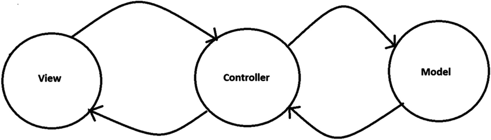
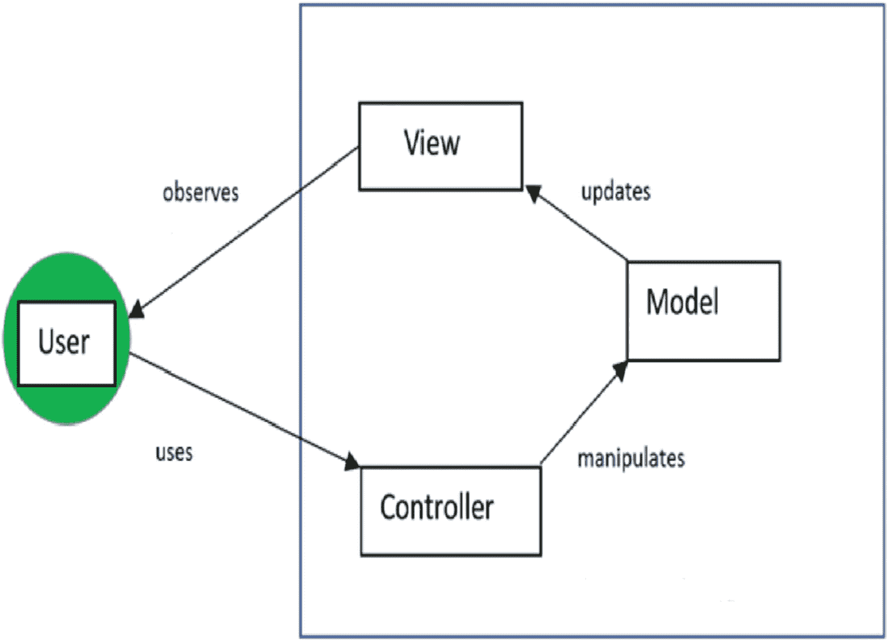
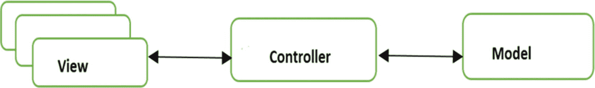
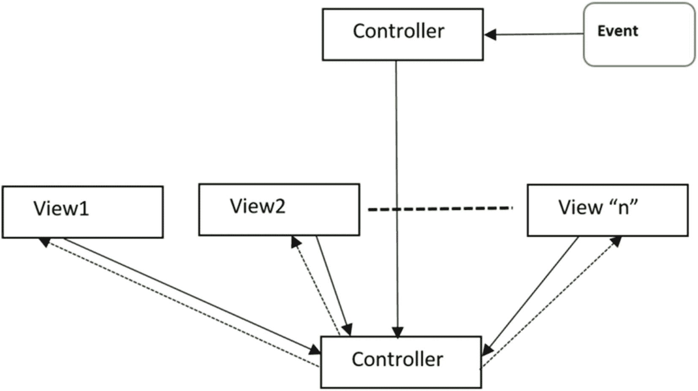
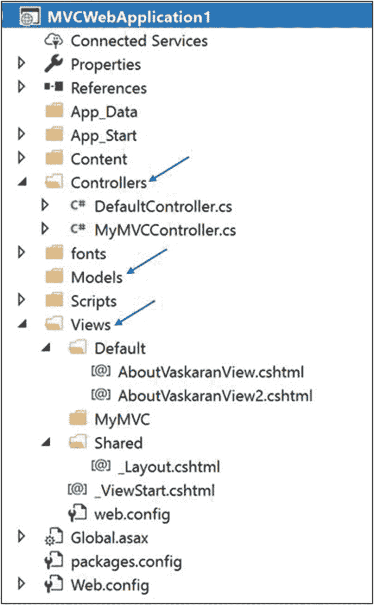
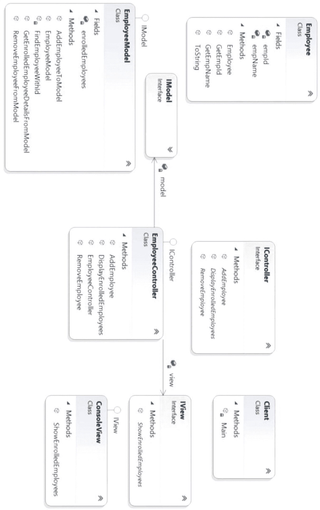
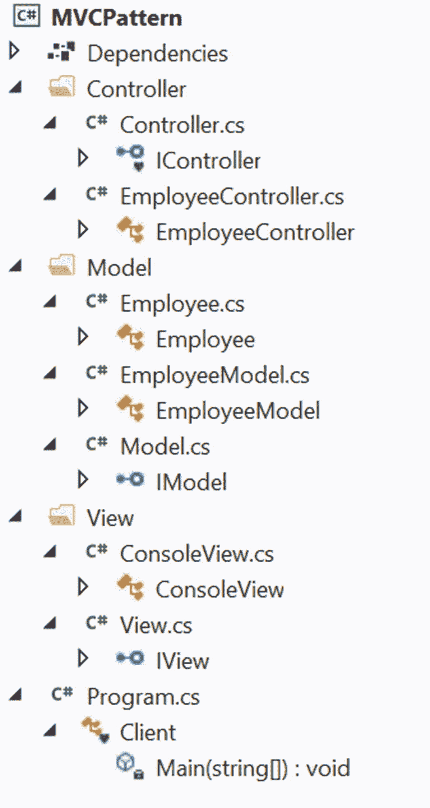
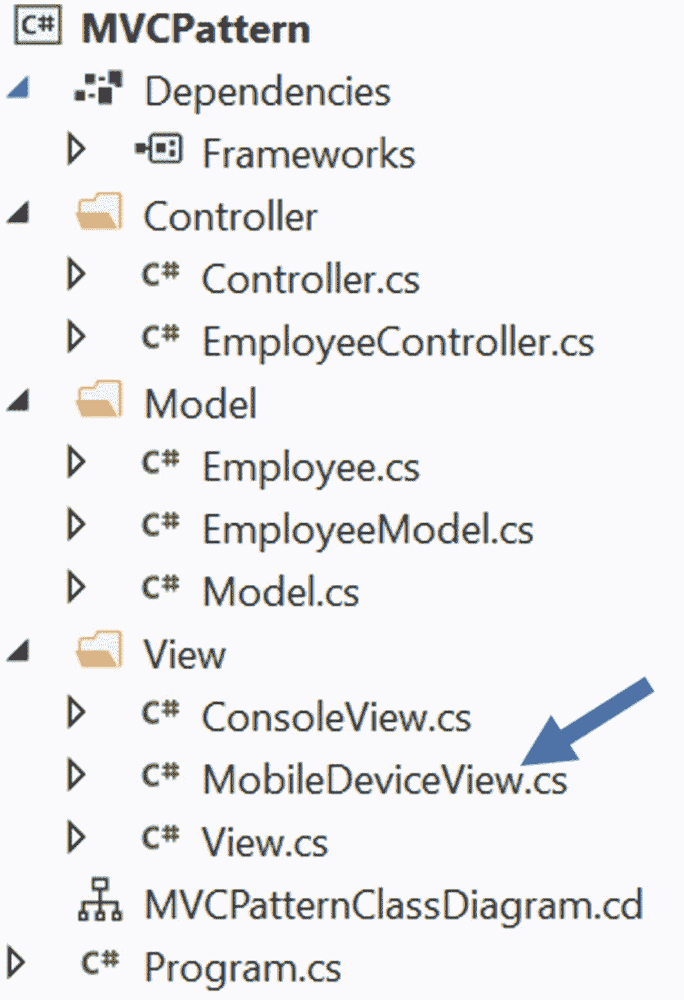

# 二十六、MVC 模式

本章涵盖了 MVC 模式。

## 定义

MVC(模型-视图-控制器)是一种架构模式。这种模式通常用于 web 应用和开发强大的用户界面。Trygve Reenskaug 于 1979 年在一篇题为“Smalltalk-80TM 中的应用编程:如何使用模型-视图-控制器”的论文中首次描述了 MVC，这篇论文是在万维网存在之前写的。所以，那时候还没有 web 应用的概念。但是现代的应用是最初概念的改编。一些开发人员宁愿称之为“MVC 架构”，而不是真正的设计模式

维基百科是这样定义的。

> *模型-视图-控制器(Model-view-controller，MVC)是一种通常用于开发用户界面的架构模式，它将应用分成三个相互连接的部分。这样做是为了将信息的内部表示与信息呈现给用户并被用户接受的方式分开。MVC 设计模式将这些主要组件解耦，允许高效的代码重用和并行开发。* ( [`https://en.wikipedia.org/wiki/Model-view-controller`](https://en.wikipedia.org/wiki/Model-view-controller) )

我最喜欢的关于 MVC 的描述来自 Connelly Barnes，他说，

> *理解 MVC 的一个简单方法:模型是数据，视图是屏幕上的窗口，控制器是两者之间的粘合剂。* ( [`http://wiki.c2.com/?ModelViewController`](http://wiki.c2.com/%253FModelViewController) )

## 概念

使用这种模式，您可以将用户界面逻辑与业务逻辑分离开来，并以一种可以有效重用的方式分离主要组件。这种方法促进了并行开发。

从定义中可以明显看出，模式由这些主要组件组成:模型、视图和控制器。控制器放置在视图和模型之间，使得它们只能通过控制器相互通信。该模型将数据显示机制与数据操作机制分开。图 [26-1](#Fig1) 显示了 MVC 模式。



图 26-1

典型的 MVC 架构

### 需要记住的要点

这些是对该模式中关键组件的简要描述。

*   视图表示最终输出。它还可以接受用户输入。它是表示层，你可以把它想象成一个图形用户界面(GUI)。你可以用各种技术来设计它。例如，在. NET 应用中，您可以使用 HTML、CSS、WPF 等等，而对于 Java 应用，您可以使用 AWT、Swing、JSF、JavaFX 等等。

*   模型管理数据和业务逻辑，它充当应用的实际大脑。它管理数据和业务逻辑。它知道如何存储、管理或操作数据，并处理来自控制器的请求。但是这个组件与视图组件是分离的。一个典型的例子是数据库、文件系统或类似的存储。它可以用 Oracle、SQL Server、DB2、Hadoop、MySQL 等等来设计。

*   控制器是中介。它接受来自视图组件的用户输入，并将请求传递给模型。当它从模型得到响应时，它将数据传递给视图。可以用 C# 设计。NET、ASP.NET、VB.NET、核心 Java、JSP、Servlets、PHP、Ruby、Python 等等。

您可能会注意到不同应用中的不同实现。这里有一些例子。

*   您可以有多个视图。

*   视图可以将运行时值(例如，使用 JavaScript)传递给控制器。

*   您的控制器可以验证用户的输入。

*   您的控制器可以通过多种方式接收输入。例如，它可以通过 URL 从 web 请求中获取输入，或者通过单击表单上的 Submit 按钮传递输入。

*   在某些应用中，您可能会注意到模型可以更新视图组件。

简而言之，您需要使用这个模式来支持您自己的需求。图 [26-2](#Fig2) 、 [26-3](#Fig3) 和 [26-4](#Fig4) 显示了 MVC 架构的已知变体。

### 变体 1

图 [26-2](#Fig2) 为变型 1。



图 26-2

典型的 MVC 框架

### 变体 2

图 [26-3](#Fig3) 为变型 2。



图 26-3

一个多视图的 MVC 框架

### 变体 3

图 [26-4](#Fig4) 为变型 3。



图 26-4

用观察者模式/基于事件的机制实现的 MVC 模式

对 MVC 最好的描述之一来自于 [wiki。c2。com](http://wiki.c2.com) ( [`http://wiki.c2.com/?ModelViewController`](http://wiki.c2.com/%253FModelViewController) )，上面写着，“我们需要*智能*模型、*轻薄*控制器、*哑*视图。”

## 真实世界的例子

考虑我们的模板方法模式的真实例子。但这一次，让我们换个角度来解读。我说在餐厅里，根据顾客的输入，一个厨师调整口味，做出最后一道菜。但是你知道顾客不会直接向厨师下订单。顾客看到菜单卡(视图)后，可能会咨询服务员，然后下订单。服务员将订单交给厨师，厨师从餐厅的厨房(类似于仓库或计算机数据库)收集所需的材料。准备好后，服务员把盘子端到顾客的桌子上。所以，你可以考虑一个服务员作为控制者，厨房里的厨师作为模型，食物准备材料作为数据。

## 计算机世界的例子

许多 web 编程框架使用 MVC 框架的概念。典型的例子包括 Django、Ruby on Rails、ASP.NET 等等。一个典型的 ASP.NET MVC 项目可以有如下图所示的视图 [26-5](#Fig5) 。



图 26-5

一个典型的 ASP.NET MVC 项目的解决方案浏览器视图

Points to Note

不同的技术遵循不同的结构，所以你不需要如图 [26-5](#Fig5) 所示的严格命名约定的文件夹结构。

## 履行

为了简单和符合我们的理论，我还将即将到来的实现分成三个主要部分:模型、视图和控制器。一旦注意到解决方案资源管理器视图，您就可以确定为完成此任务而创建的独立文件夹。以下是一些要点。

*   `IModel, IView,`和`IController`是三个接口，分别由具体的类`EmployeeModel, ConsoleView,`和`EmployeeController,`实现。看到这些名称，您可以假设它们是我们 MVC 架构的模型、视图和控制器层的代表。

*   在这个应用中，要求非常简单。一些员工需要在申请表上注册。最初，该应用有三个不同的注册员工:Amit、Jon 和 Sam。这些员工的 ID 是 E1、E2 和 E3。所以，你看到下面这个构造函数:

    ```cs
    public EmployeeModel()
    {
        // Adding 3 employees at the beginning.
        enrolledEmployees = new List<Employee>();
        enrolledEmployees.Add(new Employee("Amit", "E1"));
        enrolledEmployees.Add(new Employee("John", "E2"));
        enrolledEmployees.Add(new Employee("Sam", "E3"));
    }

    ```

*   在任何时间点，您都应该能够在系统中看到注册的员工。在客户端代码中，您调用控制器对象上的`DisplayEnrolledEmployees()`,如下所示:

```cs
controller.DisplayEnrolledEmployees();

```

然后，控制器将调用传递给视图层，如下所示:

```cs
view.ShowEnrolledEmployees(enrolledEmployees);

```

您会看到视图接口的具体实现者(ConsoleView.cs)对该方法的描述如下:

*   您可以在注册员工列表中添加新员工或删除员工。为此使用了`AddEmployeeToModel(Employee employee)`和`RemoveEmployeeFromModel(string employeeIdToRemove)`方法。让我们看看`RemoveEmployeeFromModel(...)`的方法签名。要删除一个雇员，您需要提供雇员 ID(它只不过是一个字符串)。但是如果没有找到雇员 ID，应用将忽略这个删除请求。

*   在 Employee 类中添加了一个简单的检查，以确保不会在应用中重复添加具有相同 ID 的雇员。

```cs
public void ShowEnrolledEmployees (List<Employee> enrolledEmployees)
{
        Console.WriteLine("\n ***This is a console view of currently enrolled employees.*** ");
        foreach (Employee emp in enrolledEmployees)
        {
                Console.WriteLine(emp);
        }
        Console.WriteLine("---------------------");
}

```

现在来看一下实现。是的，它很大，但是当你在前面的要点和支持图的帮助下一部分一部分地分析它时，你应该不会在理解代码上遇到任何困难。也可以考虑一下评论，供自己即时参考。

Points to Note

通常，您希望将 MVC 与提供内置支持并执行大量基础工作的技术结合使用。例如，当你使用 ASP.NET(或类似的技术)来实现 MVC 模式时，因为你有很多内置的支持。在这些情况下，你需要学习新的术语。

在本书中，我使用控制台应用来实现设计模式。让我们在即将到来的实现中继续使用同样的方法，因为我们的重点只放在 MVC 架构上。

### 类图

图 [26-6](#Fig6) 为类图。



图 26-6

类图

### 解决方案资源管理器视图

图 [26-7](#Fig7) 显示了程序的高层结构。



图 26-7

解决方案资源管理器视图

### 演示 1

这是完整的演示。

#### 模型文件夹中的内容

```cs
// Employee.cs

namespace MVCPattern.Model
{
    // The key "data" in this application
    public class Employee
    {
        private string empName;
        private string empId;
        public string GetEmpName()
        {
            return empName;
        }
        public string GetEmpId()
        {
            return empId;
        }
        public Employee(string empName, string empId)
        {
            this.empName = empName;
            this.empId = empId;
        }

        public override string ToString()
        {
            return  $"{empName} is enrolled with id : {empId}.";
        }
    }
}

```

```cs
// Model.cs
using System.Collections.Generic;

namespace MVCPattern.Model
{
    public interface IModel
    {

        List<Employee> GetEnrolledEmployeeDetailsFromModel();
        void AddEmployeeToModel(Employee employeee);
        void RemoveEmployeeFromModel(string employeeId);
    }
}

```

```cs
// EmployeeModel.cs
using System;
using System.Collections.Generic;

namespace MVCPattern.Model
{
    public class EmployeeModel : IModel
    {
        List<Employee> enrolledEmployees;

        public EmployeeModel()
        {
            // Adding 3 employees at the beginning.
            enrolledEmployees = new List<Employee>();
            enrolledEmployees.Add(new Employee("Amit", "E1"));
            enrolledEmployees.Add(new Employee("John", "E2"));
            enrolledEmployees.Add(new Employee("Sam", "E3"));
        }

        public List<Employee> GetEnrolledEmployeeDetailsFromModel()
        {
            return enrolledEmployees;
        }

        // Adding an employee to the model(registered employee list)
        public void AddEmployeeToModel(Employee employee)
        {
            Console.WriteLine($"\nTrying to add an employee to the registered list.The employee name is {employee.GetEmpName()} and id is {employee.GetEmpId()}.");

            if (!enrolledEmployees.Contains(employee))
            {
                enrolledEmployees.Add(employee);
                Console.WriteLine(employee + " [added recently.]");
            }
            else
            {
                Console.WriteLine("This employee is already added in the registered list.So, ignoring the request of addition.");
            }
        }
        // Removing an employee from model(registered employee list)

        public void RemoveEmployeeFromModel(string employeeIdToRemove)
        {
            Console.WriteLine($"\nTrying to remove an employee from the registered list.The employee id is {employeeIdToRemove}.");
            Employee emp = FindEmployeeWithId(employeeIdToRemove);
            if (emp != null)
            {
                Console.WriteLine("Removing this employee.");
                enrolledEmployees.Remove(emp);
            }
            else
            {
                Console.WriteLine($"At present, there is no employee with id {employeeIdToRemove}.Ignoring this request.");
            }
        }
        Employee FindEmployeeWithId(string employeeIdToRemove)
        {
            Employee removeEmp = null;
            foreach (Employee emp in enrolledEmployees)
            {
                if (emp.GetEmpId().Equals(employeeIdToRemove))
                {

                    Console.WriteLine($" Employee Found.{emp.GetEmpName()} has id: { employeeIdToRemove}.");
                    removeEmp = emp;
                }
            }
            return removeEmp;
        }
    }
}

```

#### 视图文件夹中的内容

```cs
// View.cs
using MVCPattern.Model;
using System.Collections.Generic;

namespace MVCPattern.View
{
    public interface IView
    {
        void ShowEnrolledEmployees(List<Employee> enrolledEmployees);
    }
}

```

```cs
// ConsoleView.cs
using System;
using System.Collections.Generic;
using MVCPattern.Model;

namespace MVCPattern.View
{
    public class ConsoleView : IView
    {
        public void ShowEnrolledEmployees(List<Employee> enrolledEmployees)
        {
            Console.WriteLine("\n ***This is a console view of currently enrolled employees.*** ");
            foreach (Employee emp in enrolledEmployees)
            {
                Console.WriteLine(emp);
            }
            Console.WriteLine("---------------------");
        }
    }
}

```

#### 控制器文件夹中的内容

```cs
// Controller.cs
using MVCPattern.Model;

namespace MVCPattern.Controller
{
    interface IController
    {
        void DisplayEnrolledEmployees();
        void AddEmployee(Employee employee);
        void RemoveEmployee(string employeeId);
    }

}

```

```cs
// EmployeeController.cs
using System.Collections.Generic;
using MVCPattern.Model;
using MVCPattern.View;

namespace MVCPattern.Controller
{
    public class EmployeeController : IController
    {
        IModel model;
        IView view;

        public EmployeeController(IModel model, IView view)
        {
            this.model = model;
            this.view = view;
        }

        public void DisplayEnrolledEmployees()
        {
            // Get data from Model
            List<Employee> enrolledEmployees = model.GetEnrolledEmployeeDetailsFromModel();
            // Connect to View
            view.ShowEnrolledEmployees(enrolledEmployees);
        }

        // Sending a request to model to add an employee to the list.
        public void AddEmployee(Employee employee)
        {
            model.AddEmployeeToModel(employee);
        }
        // Sending a request to model to remove an employee from the list.
        public void RemoveEmployee(string employeeId)
        {
            model.RemoveEmployeeFromModel(employeeId);

        }
    }
}

```

#### 客户代码

```cs
// Program.cs
using MVCPattern.Controller;
using MVCPattern.Model;
using MVCPattern.View;
using System;

namespace MVCPattern
{
    class Client
    {
        static void Main(string[] args)
        {
            Console.WriteLine("***MVC architecture Demo***\n");
            // Model
            IModel model = new EmployeeModel();

            // View
            IView view = new ConsoleView();

            // Controller
            IController controller = new EmployeeController(model, view);
            controller.DisplayEnrolledEmployees();

            // Add an employee
            Employee empToAdd = new Employee("Kevin", "E4");
            controller.AddEmployee(empToAdd);
            // Printing the current details
            controller.DisplayEnrolledEmployees();

            // Remove an existing employee using the employee id.
            controller.RemoveEmployee("E2");
            // Printing the current details
            controller.DisplayEnrolledEmployees();

            /* Cannot remove an  employee who does not belong to the list.*/
            controller.RemoveEmployee("E5");
            // Printing the current details
            controller.DisplayEnrolledEmployees();

            // Avoiding a duplicate entry
            controller.AddEmployee(empToAdd);
            // Printing the current details
            controller.DisplayEnrolledEmployees();

            /* This segment is added to discuss a question in "Q&A Session" and initially commented out. */
           // view = new MobileDeviceView();
           // controller = new EmployeeController(model, view);
           // controller.DisplayEnrolledEmployees();
            Console.ReadKey();
        }
    }
}

```

### 输出

这是输出。

```cs
***MVC architecture Demo***

 ***This is a console view of currently enrolled employees.***
Amit is enrolled with id : E1.
John is enrolled with id : E2.
Sam is enrolled with id : E3.
---------------------

Trying to add an employee to the registered list.The employee name is Kevin and id is E4.
Kevin is enrolled with id : E4\. [added recently.]

 ***This is a console view of currently enrolled employees.***
Amit is enrolled with id : E1.
John is enrolled with id : E2.
Sam is enrolled with id : E3.
Kevin is enrolled with id : E4.
---------------------

Trying to remove an employee from the registered list.The employee id is E2.
 Employee Found.John has id: E2.
Removing this employee.

 ***This is a console view of currently enrolled employees.***
Amit is enrolled with id : E1.
Sam is enrolled with id : E3.
Kevin is enrolled with id : E4.
---------------------

Trying to remove an employee from the registered list.The employee id is E5.
At present, there is no employee with id E5.Ignoring this request.

 ***This is a console view of currently enrolled employees.***
Amit is enrolled with id : E1.
Sam is enrolled with id : E3.
Kevin is enrolled with id : E4.
---------------------

Trying to add an employee to the registered list.The employee name is Kevin and id is E4.
This employee is already added in the registered list.So, ignoring the request of addition.

 ***This is a console view of currently enrolled employees.***
Amit is enrolled with id : E1.
Sam is enrolled with id : E3.
Kevin is enrolled with id : E4.
---------------------

```

## 问答环节

假设你有一名程序员、一名数据库管理员和一名图形设计师。你能预测他们在 MVC 架构中的角色吗？

图形设计师设计视图层，DBA 创建模型，程序员制作智能控制器。

使用 MVC 设计模式的主要优势是什么？

一些重要的优点如下。

*   高内聚和低耦合是 MVC 的好处。您可能已经注意到，在这种模式中，模型和视图之间的紧密耦合很容易消除。因此，应用可以很容易地扩展和重用。

*   该模式支持并行开发。

*   您还可以容纳多个运行时视图。

26.3 与 MVC 模式相关的挑战是什么？

这里有一些挑战。

*   它需要高度熟练的人员。

*   对于微小的应用来说，可能不太适合。

*   开发人员可能需要熟悉多种语言、平台和技术。

*   多工件一致性是一个大问题，因为您将整个项目分成三个主要部分。

26.4 你能在这个实现中提供多个视图吗？

当然可以。让我们在应用中添加一个名为 MobileDeviceView 的新的更短的视图。让我们将这个类添加到视图文件夹中，如下所示。

```cs
using System;
using System.Collections.Generic;
using MVCPattern.Model;
namespace MVCPattern.View
{
    public class MobileDeviceView:IView
    {

        public void ShowEnrolledEmployees(List<Employee> enrolledEmployees)
        {
            Console.WriteLine("\n +++This is a mobile device view of currently enrolled employees.+++ ");
            foreach (Employee emp in enrolledEmployees)
            {
                Console.WriteLine(emp.GetEmpId() + "\t" + emp.GetEmpName());
            }
            Console.WriteLine("+++++++++++++++++++++");
        }
    }
}

```

一旦添加了这个类，修改后的解决方案资源管理器视图应该类似于图 [26-8](#Fig8) 。



图 26-8

修改的解决方案资源管理器视图

现在，在客户端代码的末尾添加以下代码段(请参考注释以供参考)。

```cs
/* This segment is added to discuss a question in "Q&A Session and was
   initially commented out.Now I’m uncommenting the following three lines of code."
*/
view = new MobileDeviceView();
controller = new EmployeeController(model, view);
controller.DisplayEnrolledEmployees();

```

现在，如果您运行应用，您会看到修改后的输出。

### 修改输出

下面是修改后的输出。输出的最后一部分显示了新变化的效果。更改以粗体显示。

```cs
***MVC architecture Demo***

 ***This is a console view of currently enrolled employees.***
Amit is enrolled with id : E1.
John is enrolled with id : E2.
Sam is enrolled with id : E3.
---------------------

Trying to add an employee to the registered list.The employee name is Kevin and id is E4.
Kevin is enrolled with id : E4\. [added recently.]

 ***This is a console view of currently enrolled employees.***
Amit is enrolled with id : E1.
John is enrolled with id : E2.
Sam is enrolled with id : E3.
Kevin is enrolled with id : E4.
---------------------

Trying to remove an employee from the registered list.The employee id is E2.
 Employee Found.John has id: E2.
Removing this employee.

 ***This is a console view of currently enrolled employees.***
Amit is enrolled with id : E1.
Sam is enrolled with id : E3.
Kevin is enrolled with id : E4.
---------------------

Trying to remove an employee from the registered list.The employee id is E5.
At present, there is no employee with id E5.Ignoring this request.

 ***This is a console view of currently enrolled employees.***
Amit is enrolled with id : E1.
Sam is enrolled with id : E3.
Kevin is enrolled with id : E4.
---------------------

Trying to add an employee to the registered list.The employee name is Kevin and id is E4.
This employee is already added in the registered list.So, ignoring the request of addition.

 ***This is a console view of currently enrolled employees.***
Amit is enrolled with id : E1.
Sam is enrolled with id : E3.
Kevin is enrolled with id : E4.
---------------------
 +++This is a mobile device view of currently enrolled employees

.+++
E1      Amit
E3      Sam
E4      Kevin
+++++++++++++++++++++

```