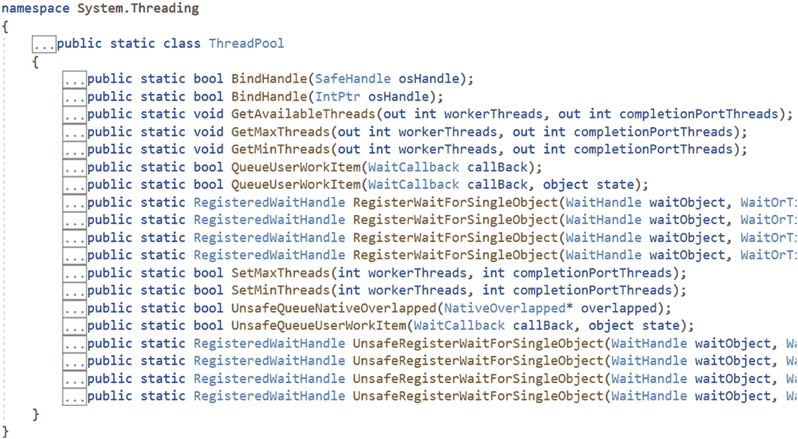
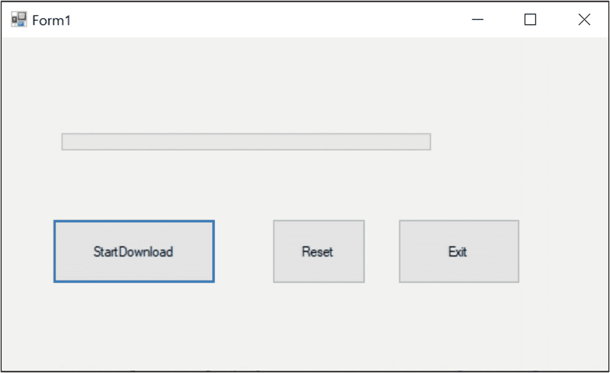
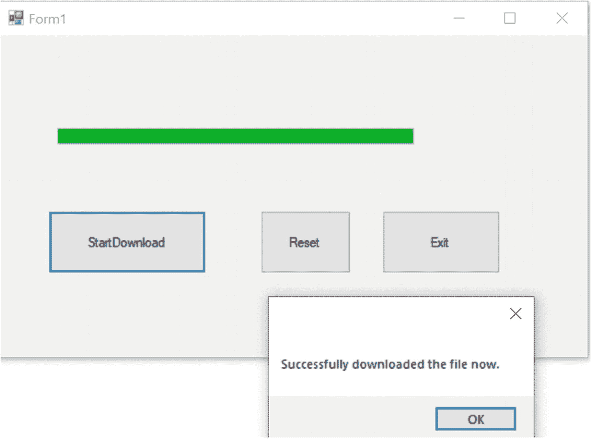
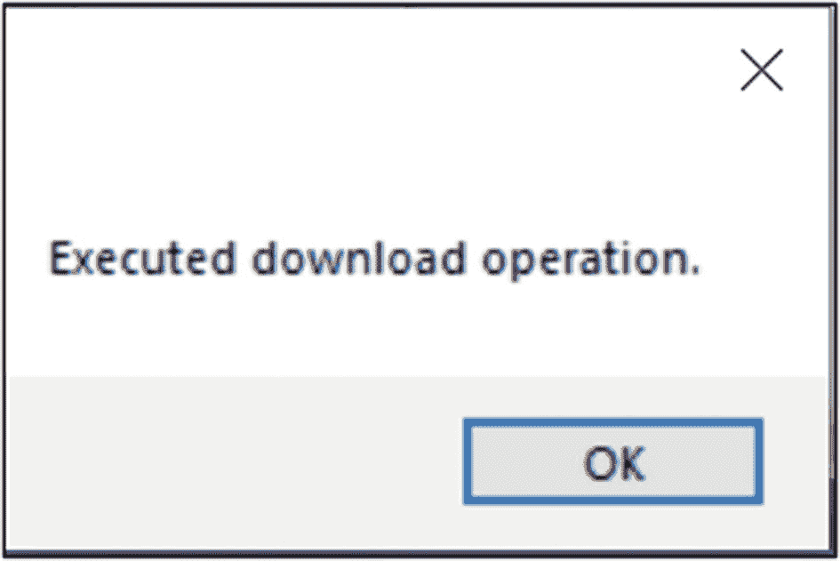

# 二十七、异步编程中的模式

你会在异步编程中看到许多有趣的模式，这很艰难，很有挑战性，但也很有趣。它通常被称为*异步*。整体概念不是一天进化出来的，这需要时间，而在 C# 5.0 中，你得到了`async`和`await`关键词让它变得更简单。在此之前，程序员用各种技术实现了这个概念。每种技术都有其优点和缺点。本章的目标是向你介绍不同的异步编程模式。

## 概观

首先，让我们讨论异步编程。简单地说，你在你的应用中取一个代码段，并在一个单独的线程上运行它。关键优势是什么？简单的答案是，您可以释放原始线程，让它继续执行剩余的任务，而在一个单独的线程中，您可以执行不同的任务。这种机制帮助您开发现代应用；例如，当您实现一个高度响应的用户界面时，这些概念非常有用。

Points to Remember

大体上，您会注意到异步编程中的三种不同模式，如下所示:

*   **IAsyncResult 模式** **:** 或者，它被称为异步编程模型(APM)。在这个模式中，在核心处，您可以看到支持异步行为的`IAsyncResult`接口。在同步模型中，如果您有一个名为 XXX()的同步方法，在异步版本中，您会看到对应同步方法的`BeginXXX()`和`EndXXX()`方法。比如在同步版本中，如果你有`Read()`方法支持读操作；在异步编程中，通常有`BeginRead()`和`EndRead()`方法来异步支持相应的读操作。使用这个概念，从演示 5 到演示 7，您会看到`BeginInvoke`和`EndInvoke`方法。但是对于即将到来的和新的开发，不推荐使用这种模式。

*   ****:**基于事件的异步模式。NET 框架 2.0。它基于事件机制。这里您可以看到带有*`Async`后缀的方法名，一个或多个事件，以及`EventArg`派生类型。这种模式仍在使用，但不推荐用于新的开发。***

****   **基于任务的异步模式(TAP)** **:** 它最早出现在 in.NET 框架 4 中；这是异步编程的推荐做法。在 C# 中，你经常会看到这种模式中的`async`和`await`关键字。*** 

 ***为了使这一章简短，我可以省略关于 APM 和 EAP 的讨论，但是我在这一章中讨论它们，以便你理解遗留代码。同时，您发现了异步编程持续发展的途径。

为了更好地理解异步编程，让我们从它的对应物开始讨论:同步编程。同步方法很简单，代码路径也很容易理解，但是在这种编程中，您需要等待从特定的代码段获得结果，直到您不能做任何有成效的事情。例如，当一段代码试图打开一个需要时间加载的网页时，或者当一段代码正在运行一个长时间运行的算法时，等等。在这些情况下，如果您遵循同步方法，您需要无所事事。因此，即使你的计算机速度超快，计算能力更强，你也没有充分发挥它的潜力，这不是一个好主意。因此，为了支持现代需求和构建高响应性的应用，对异步编程的需求与日俱增。因此，当您了解这一类别中不同的实现模式时，您会受益匪浅。

## 使用同步方法

在演示 1 中，我执行了一个简单的程序，从同步方法开始。这里有两个简单的方法叫做`ExecuteMethodOne()`和`ExecuteMethodTwo()`。在`Main()`方法内部，我同步调用这些方法(即，我先调用`ExecuteMethodOne()`，然后调用`ExecuteMethodTwo()`)。为了专注于关键的讨论，我把这些方法做得非常简单。我将简单的 sleep 语句放入其中，以确保这些方法执行的工作需要一定的时间来完成。一旦您运行应用并注意到输出，您会看到只有在`ExecuteMethodOne()`完成执行后，`ExecuteMethodTwo()`才能开始执行。在这种情况下，`Main()`方法不能完成，直到方法完成它们的执行。

Note

在本章中，你会看到这些方法略有不同。我试图维护类似的方法，以便您可以轻松地比较异步编程的不同技术。出于简单演示的目的，在这些例子中，我假设`ExecuteMethodOne()`需要更多的时间来完成，因为它将执行一些冗长的操作。所以，我强迫自己在里面睡了一个相对长的时间。相反，我假设`ExecuteMethodTwo()`执行一个小任务，所以我在里面放置了一个相对较短的睡眠。

### 演示 1

这是完整的演示。

```cs
using System;
using System.Threading;

namespace SynchronousProgrammingExample
{
    class Program
    {
        static void Main(string[] args)
        {
            Console.WriteLine("***A Synchronous Program Demonstration.***");
            Console.WriteLine("ExecuteMethodTwo() needs to wait for ExecuteMethodOne() to finish first.");
            ExecuteMethodOne();
            ExecuteMethodTwo();
            Console.WriteLine("End Main().");
            Console.ReadKey();
        }
        // First Method
        private static void ExecuteMethodOne()
        {
            Console.WriteLine("MethodOne has started.");
            // Some big task
            Thread.Sleep(1000);
            Console.WriteLine("MethodOne has finished.");
        }
        // Second Method
        private static void ExecuteMethodTwo()
        {
            Console.WriteLine("MethodTwo has started.");
            // Some small task
            Thread.Sleep(100);
            Console.WriteLine("MethodTwo has finished.");
        }
    }
}

```

#### 输出

这是输出。

```cs
***A Synchronous Program Demonstration.***
ExecuteMethodTwo() needs to wait for ExecuteMethodOne() to finish first.
MethodOne has started.
MethodOne has finished.
MethodTwo has started.
MethodTwo has finished.
End Main().

```

## 使用线程类

如果您仔细观察演示 1 中的方法，您会发现这些方法并不相互依赖。如果您可以并行执行它们，您的应用的响应时间将会得到改善，并且您可以减少总的执行时间。所以，让我们找到一些更好的方法。

在这种情况下，您可以实现多线程的概念。演示 2 是一个使用线程的简单解决方案。它展示了在一个新线程中替换`ExecuteMethodOne()`方法。

### 演示 2

```cs
using System;
using System.Threading;

namespace UsingThreadClass
{
    class Program
    {
        static void Main(string[] args)
        {
            Console.WriteLine("***Asynchronous Programming using Thread class.***");
            //ExecuteMethodOne();
            //Old approach.Creating a separate thread for the following //task(i.e. ExecuteMethodOne.)
            Thread newThread = new Thread(() =>
            {
                Console.WriteLine("MethodOne has started on a separate thread.");
                // Some big task
                Thread.Sleep(1000);
                Console.WriteLine("MethodOne has finished.");
            }
            );
            newThread.Start();
            /*
               Taking a small sleep to increase the probability of executing ExecuteMethodOne() before ExecuteMethodTwo().
             */
            Thread.Sleep(20);
            ExecuteMethodTwo();
            Console.WriteLine("End Main().");
            Console.ReadKey();
        }

        // Second Method
        private static void ExecuteMethodTwo()
        {
            Console.WriteLine("MethodTwo has started.");
            // Some small task
            Thread.Sleep(100);
            Console.WriteLine("MethodTwo has finished.");
        }
    }
}

```

#### 输出

下面是一个可能的输出。

```cs
***Asynchronous Programming using Thread class.***
MethodOne has started on a separate thread.
MethodTwo has started.
MethodTwo has finished.
End Main().
MethodOne has finished.

```

#### 分析

注意，尽管`ExecuteMethodOne()`开始得很早，但是`ExecuteMethodTwo()`并没有等待`ExecuteMethodOne()`完成它的执行。此外，由于`ExecuteMethodTwo()`做得很少(睡眠时间为 100 毫秒)，它能够在`ExecuteMethodOne()`完成执行之前完成。不仅如此，由于主线程没有被阻塞，它能够继续执行。

### 问答环节

**27.1 为什么在** `Main` **里面的** `Method2()` **执行之前放一个睡眠语句？**

接得好。这不是必须的，但是在某些情况下，您可能会注意到，即使您试图在当前线程中的`ExecuteMethodTwo`()之前启动`ExecuteMethodOne()`在一个单独的线程上执行，也不会发生这种情况。因此，您可能会注意到以下输出。

```cs
***Asynchronous Programming using Thread class.***
MethodTwo has started.
MethodOne has started in a separate thread.
MethodTwo has finished.
End Main().
MethodOne has finished.

```

在这个例子中，这个简单的 sleep 语句帮助你增加在`ExecuteMethodTwo()`之前开始`ExecuteMethodOne()`的概率。

## 使用线程池类

通常不鼓励在现实世界的应用中直接创建线程。这背后的一些关键原因如下。

*   维护太多的线程会导致困难和高成本的操作。

*   由于上下文切换，浪费了大量时间，而不是做真正的工作。

为了避免直接创建线程，C# 为您提供了使用内置`ThreadPool`类的便利。有了这个类，您可以使用现有的线程，这些线程可以重用以满足您的需要。`ThreadPool`类在维护应用中的最佳线程数量方面非常有效。因此，如果需要，您可以使用这个工具异步执行一些任务。

`ThreadPool`是包含一些`static`方法的静态类；他们中的一些人也有超载的版本。为了您的快速参考，图 [27-1](#Fig1) 是来自 Visual Studio IDE 的部分截图，显示了`ThreadPool`类中的方法。



图 27-1

Visual Studio 2019 IDE 中 ThreadPool 类的截图

在本节中，我们的重点是`QueueUserWorkItem`方法。图 [27-1](#Fig1) 显示该方法有两个重载版本。现在要了解这个方法的细节，让我们展开 Visual Studio 中的方法描述。例如，一旦展开此方法的第一个重载版本，您会注意到以下情况。

```cs
//
// Summary:
//     Queues a method for execution. The method executes when a thread //     pool thread becomes available.
//
// Parameters:
//   callBack:
//     A System.Threading.WaitCallback that represents the method to be //     executed.
//
// Returns:
//     true if the method is successfully queued; System.NotSupportedException
//     is thrown if the work item could not be queued.
//
// Exceptions:
//   T:System.ArgumentNullException:
//     callBack is null.
//
//   T:System.NotSupportedException:
//     The common language runtime (CLR) is hosted, and the host does not //     support this action.
[SecuritySafeCritical]
public static bool QueueUserWorkItem(WaitCallback callBack);

```

如果您进一步研究方法参数，您会发现`WaitCallBack`是一个具有以下描述的委托。

```cs
//
// Summary:
//     Represents a callback method to be executed by a thread pool thread.
//
// Parameters:
//   state:
//     An object containing information to be used by the callback method.
[ComVisible(true)]
public delegate void WaitCallback(object state);

```

第二个重载版本的`QueueUserWorkItem`可以接受一个名为`state`的额外的`object`参数。内容如下。

```cs
public static bool QueueUserWorkItem(WaitCallback callBack, object state);

```

它告诉我们，使用这个重载版本，您可以通过这个参数向您的方法传递一些有价值的数据。在接下来的演示中，我使用了两个重载版本，这就是为什么在接下来的例子中，除了`ExecuteMethodOne()`和`ExecuteMethodTwo()`(您在前面的演示中已经看到了)之外，我还引入了另一个名为`ExecuteMethodThree()`的方法，在这个方法中我传递了一个对象参数。

人们经常互换使用变量和形参这两个词。但是一个专业的程序员通常对此很挑剔。方法定义中使用的变量称为方法的参数。例如，如果您在一个类中看到如下所示的方法定义:

```cs
public void Sum(int firstNumber,int secondNumber)

```

你说 firstNumber 和 secondNumber 是方法 Sum 的参数。现在假设你有一个类的对象，比如 ob。因此，当您使用以下代码行调用该方法时:

```cs
ob.Sum(1,2)

```

你说 1 和 2 是传递给 Sum 方法的参数。

简而言之，你可以说我们将参数传递给一个方法，这些值被赋给方法参数。根据这些定义，我应该在我的注释中说，我已经将 10 作为参数传递给了`ExecuteMethodThree`。但是为了简单起见，程序员通常不会过多强调这些术语，而且你可能会看到这些术语可以互换使用。

### 演示 3

为了有效地使用`QueueUserWorkItem`方法，您需要使用一个匹配`WaitCallBack`委托签名的方法。在下面的演示中，我将两个方法放入一个`ThreadPool`中。在演示 1 和演示 2 中，`ExecuteMethodTwo()`没有接受任何参数。所以，如果你想按原样使用这个方法并把它传递给`QueueUserWorkItem`，你会得到下面的编译错误。

```cs
No overload for 'ExecuteMethodTwo' matches delegate 'WaitCallback'

```

因此，让我们用一个虚拟的`object`参数来修改`ExecuteMethodTwo()`方法，如下所示。(我保留了评论，供大家参考。)

```cs
/*
The following method's signature should match
the delegate WaitCallback.It is as follows:
public delegate void WaitCallback(object state)
*/
private static void ExecuteMethodTwo(object state)
{
  Console.WriteLine("--MethodTwo has started.");
  // Some small task
  Thread.Sleep(100);
  Console.WriteLine("--MethodTwo has finished.");
}

```

现在让我们介绍另一个名为`ExecuteMethodThree(...)`的方法，它真正使用了参数。该方法描述如下。

```cs
private static void ExecuteMethodThree(object number)
{
 Console.WriteLine("---MethodThree has started.");
 int upperLimit = (int)number;
 for (int i = 0; i < upperLimit; i++)
 {
  Console.WriteLine("---MethodThree prints 3.0{0}", i);
 }
 Thread.Sleep(100);
 Console.WriteLine("---MethodThree has finished.");
}

```

现在通过下面的演示和相应的输出。

```cs
using System;
using System.Threading;

namespace UsingThreadPool
{
    class Program
    {
        static void Main(string[] args)
        {
            Console.WriteLine("***Asynchronous Programming using ThreadPool class.***");

            // Using Threadpool
            // Not passing any argument to ExecuteMethodTwo
            ThreadPool.QueueUserWorkItem(new WaitCallback(ExecuteMethodTwo));
            /*
             Passing 10 as the argument to
             ExecuteMethodThree.
            */
            ThreadPool.QueueUserWorkItem(new WaitCallback(ExecuteMethodThree), 10);
            ExecuteMethodOne();

            Console.WriteLine("End Main().");
            Console.ReadKey();
        }

        private static void ExecuteMethodOne()
        {
            Console.WriteLine("-MethodOne has started.");
            // Some big task
            Thread.Sleep(1000);
            Console.WriteLine("-MethodOne has finished.");
        }

        /*
        The following method's signature should match
        the delegate WaitCallback.It is as follows:
        public delegate void WaitCallback(object state)
        */
        private static void ExecuteMethodTwo(object state)
        {
            Console.WriteLine("--MethodTwo has started.");
            // Some small task
            Thread.Sleep(100);
            Console.WriteLine("--MethodTwo has finished.");
        }
        /*
        The following method has a parameter.
        This method's signature also matches the WaitCallBack
        delegate signature.
        */
        private static void ExecuteMethodThree(object number)
        {
            Console.WriteLine("---MethodThree has started.");
            int upperLimit = (int)number;
            for (int i = 0; i < upperLimit; i++)
            {
                Console.WriteLine($"---MethodThree prints 3.0{i}");
            }
            Thread.Sleep(100);
            Console.WriteLine("---MethodThree has finished.");
        }
    }
}

```

#### 输出

下面是一个可能的输出。

```cs
***Asynchronous Programming using ThreadPool class.***
-MethodOne has started.
--MethodTwo has started.
---MethodThree has started.
---MethodThree prints 3.00
---MethodThree prints 3.01
---MethodThree prints 3.02
---MethodThree prints 3.03
---MethodThree prints 3.04
---MethodThree prints 3.05
---MethodThree prints 3.06
---MethodThree prints 3.07
---MethodThree prints 3.08
---MethodThree prints 3.09
--MethodTwo has finished.
---MethodThree has finished.
-MethodOne has finished.
End Main().

```

### 问答环节

27.2 使用简单的委托实例化技术，如果我使用下面的第一行而不是第二行，应用会编译并运行吗？

```cs
ThreadPool.QueueUserWorkItem(ExecuteMethodTwo);

```

thread pool . queue user work item(new waiting callback(executemethod two))；

是的，但是既然你现在正在学习使用`WaitCallback`委托，我使用了实例化的详细方法来引起你对它的特别注意。

## 将 Lambda 表达式与 ThreadPool 类一起使用

如果您喜欢 lambda 表达式，您可以在类似的上下文中使用它。例如，在前面的演示中，您可以使用 lambda 表达式替换`ExecuteMethodThree(...)`，如下所示。

```cs
// Using lambda Expression
// Here the method needs a parameter(input).
// Passing 10 as an argument to ExecuteMethodThree
ThreadPool.QueueUserWorkItem((number) =>
{
  Console.WriteLine("--MethodThree has started.");
  int upperLimit = (int)number;
  for (int i = 0; i < upperLimit; i++)
  {
   Console.WriteLine("---MethodThree prints 3.0{0}", i);
  }
  Thread.Sleep(100);
  Console.WriteLine("--MethodThree has finished.");
  }, 10

);

```

因此，在前面的演示中，您可以注释掉下面的行，并用前面介绍的 lambda 表达式替换`ExecuteMethodThree(...)`。

```cs
ThreadPool.QueueUserWorkItem(new WaitCallback(ExecuteMethodThree), 10);

```

如果您再次执行该程序，您会得到类似的输出。为了便于参考，我在演示 4 中展示了完整的实现。

### 演示 4

```cs
using System;
using System.Threading;

namespace UsingThreadPoolWithLambdaExpression
{
    class Program
    {
        static void Main(string[] args)
        {
            Console.WriteLine("***Asynchronous Programming Demonstration.***");
            Console.WriteLine("***Using ThreadPool with Lambda Expression.***");

            // Using Threadpool
            // Not passing any parameter for ExecuteMethodTwo
            ThreadPool.QueueUserWorkItem(ExecuteMethodTwo);
            // Using lambda Expression
            // Here the method needs a parameter(input).
            // Passing 10 as an argument to ExecuteMethodThree
            ThreadPool.QueueUserWorkItem((number) =>
            {
                Console.WriteLine("--MethodThree has started.");
                int upperLimit = (int)number;
                for (int i = 0; i < upperLimit; i++)
                {
                    Console.WriteLine("---MethodThree prints 3.0{0}", i);
                }
                Thread.Sleep(100);
                Console.WriteLine("--MethodThree has finished.");
            }, 10

          );

            ExecuteMethodOne();
            Console.WriteLine("End Main().");
            Console.ReadKey();
        }
        /// <summary>
        /// ExecuteMethodOne()
        /// </summary>
        private static void ExecuteMethodOne()
        {
            Console.WriteLine("-MethodOne has started.");
            // Some big task
            Thread.Sleep(1000);
            Console.WriteLine("-MethodOne has finished.");
        }

        /*
        The following method's signature should match
        the delegate WaitCallback.It is as follows:
        public delegate void WaitCallback(object state)
        */

        private static void ExecuteMethodTwo(Object state)
        {
            Console.WriteLine("--MethodTwo has started.");
            // Some small task
            Thread.Sleep(100);
            Console.WriteLine("--MethodTwo has finished.");
        }
    }
}

```

#### 输出

下面是一个可能的输出。

```cs
***Asynchronous Programming Demonstration.***
***Using ThreadPool with Lambda Expression.***
--MethodTwo has started.
-MethodOne has started.
--MethodThree has started.
---MethodThree prints 3.00
---MethodThree prints 3.01
---MethodThree prints 3.02
---MethodThree prints 3.03
---MethodThree prints 3.04
---MethodThree prints 3.05
---MethodThree prints 3.06
---MethodThree prints 3.07
---MethodThree prints 3.08
---MethodThree prints 3.09
--MethodTwo has finished.
--MethodThree has finished.
-MethodOne has finished.
End Main().

```

Note

这次，您看到了带有`ThreadPool`类的 lambda 表达式。在演示 2 中，您看到了带有`Thread`类的 lambda 表达式。

## 使用 IAsyncResult 模式

我提到过`IAsyncResult`接口帮助你实现异步行为。我还告诉你，在同步模型中，如果你有一个名为`XXX`的同步方法，在异步版本中，你会看到对应同步方法的`BeginXXX`和`EndXXX`方法。现在你可以看到这些细节了。

### 使用异步委托进行轮询

在演示 3 和演示 4 中，您看到了一个内置的`WaitCallBack`委托。通常，委托有许多不同的用途。在本节中，您将看到另一个重要的用法。让我们考虑一下*轮询*，这是一种重复检查条件的机制。在我们接下来的例子中，让我们检查一个委托实例是否完成了它的任务。

### 演示 5

这一次，我稍微修改了一下`ExecuteMethodOne(...)`和`ExecuteMethodTwo()`方法。这些方法可以打印线程 id。这次，我允许`ExecuteMethodOne(...)`接受一个提供睡眠时间的`int`参数，而不是盲目地睡眠 1000 毫秒。

和以前的情况一样，`ExecuteMethodTwo()`只休眠了 100 毫秒，但是与`ExecuteMethodTwo()`相比，`ExecuteMethodOne(...)`需要更多的时间来完成它的任务。为了实现这一点，在本例中，我在`ExecuteMethodOne(...)`中传递了 3000 毫秒作为方法参数。

让我们看看代码的重要部分。现在我的`ExecuteMethodOne`如下:

```cs
// First Method
private static void ExecuteMethodOne(int sleepTimeInMilliSec)
{
  Console.WriteLine("MethodOne has started.");
  Console.WriteLine($"Inside ExecuteMethodOne(),Thread id {Thread.CurrentThread.ManagedThreadId}.");
  // Some big task
  Thread.Sleep(sleepTimeInMilliSec);
  Console.WriteLine("\nMethodOne has finished.");
}

```

为了匹配签名，我如下声明委托`Method1Delegate`。

```cs
public delegate void Method1Delegate(int sleepTimeinMilliSec);

```

稍后我将它实例化如下。

```cs
Method1Delegate method1Del = ExecuteMethodOne;

```

到目前为止，一切都很简单。现在来看代码中最重要的一行，如下所示。

```cs
IAsyncResult asyncResult = method1Del.BeginInvoke(3000, null, null);

```

你还记得在委托的上下文中，你可以使用`Invoke()`方法吗？但是那一次你的代码遵循同步路径。现在你正在探索异步编程，所以你看到了`BeginInvoke`和`EndInvoke`方法。当 C# 编译器看到 delegate 关键字时，它为动态生成的类提供这些方法。

`BeginInvoke`方法的返回类型是`IAsyncResult`。如果您将鼠标悬停在`BeginInvoke`上或者注意它的结构，您会看到虽然`ExecuteMethodOne`只接受一个参数，但是`BeginInvoke`方法总是接受两个额外的参数:一个类型为`AsyncCallback`和一个类型为`object`。你很快就会看到对它们的讨论。在这个例子中，我只使用了第一个参数，并将 3000 毫秒作为`ExecuteMethodOne`的参数。但是对于`BeginInvoke`的后两个参数，我传了`null`值。

`BeginInvoke`返回的结果很重要，我将结果保存在一个`IAsyncResult`对象中。`IAsyncResult`具有以下只读属性。

```cs
public interface IAsyncResult
{
 bool IsCompleted { get; }
 WaitHandle AsyncWaitHandle { get; }
 object AsyncState { get; }
 bool CompletedSynchronously { get; }
}

```

目前，我关注的是`isCompleted`属性。如果您进一步扩展这些定义，您会看到`isCompleted`的定义如下。

```cs
//
// Summary:
//     Gets a value that indicates whether the asynchronous  operation has //     completed.
//
// Returns:
//     true if the operation is complete; otherwise, false.
bool IsCompleted { get; }

```

因此，很明显，您可以使用这个属性来验证代理是否已经完成了它的工作。

在下面的例子中，我检查其他线程中的委托是否完成了它的工作。如果工作没有完成，我会在控制台窗口中打印星号(*)，并强制主线程短暂休眠，这就是为什么您会在本演示中看到下面这段代码。

```cs
while (!asyncResult.IsCompleted)
{
    // Keep working in main thread
    Console.Write("*");
    Thread.Sleep(5);
}

```

最后，`EndInvoke`方法接受一个类型为`IAsyncResult`的参数。所以，我通过`asyncResult`作为这个方法中的一个参数。现在进行完整的演示。

```cs
using System;
using System.Threading;

namespace PollingDemoInDotNetFramework
{
    //WILL NOT WORK ON .NET CORE.
    //RUN THIS PROGRAM ON .NET FRAMEWORK.
    class Program
    {
        public delegate void Method1Delegate(int sleepTimeinMilliSec);
        static void Main(string[] args)
        {
            Console.WriteLine("***Polling Demo.Run it in .NET Framework.***");
            Console.WriteLine("Inside Main(),Thread id {0} .", Thread.CurrentThread.ManagedThreadId);
            // Synchronous call
            //ExecuteMethodOne(3000);

            Method1Delegate method1Del = ExecuteMethodOne;
            IAsyncResult asyncResult = method1Del.BeginInvoke(3000, null, null);
            ExecuteMethodTwo();
            while (!asyncResult.IsCompleted)
            {
                // Keep working in main thread
                Console.Write("*");
                Thread.Sleep(5);
            }

            method1Del.EndInvoke(asyncResult);
            Console.ReadKey();
        }
        // First Method
        private static void ExecuteMethodOne(int sleepTimeInMilliSec)
        {
            Console.WriteLine("MethodOne has started.");
            Console.WriteLine($"Inside ExecuteMethodOne(),Thread id {Thread.CurrentThread.ManagedThreadId}.");
            // Some big task
            Thread.Sleep(sleepTimeInMilliSec);
            Console.WriteLine("\nMethodOne has finished.");
        }
        // Second Method
        private static void ExecuteMethodTwo()
        {
            Console.WriteLine("MethodTwo has started.");
            Console.WriteLine($"Inside ExecuteMethodTwo(),Thread id {Thread.CurrentThread.ManagedThreadId}.");
            // Some small task
            Thread.Sleep(100);
            Console.WriteLine("MethodTwo has finished.");
        }

    }
}

```

#### 输出

下面是一个可能的输出。

```cs
***Polling Demo.Run it in .NET Framework.***
Inside Main(),Thread id 1 .
MethodTwo has started.
Inside ExecuteMethodTwo(),Thread id 1.
MethodOne has started.
Inside ExecuteMethodOne(),Thread id 3.
MethodTwo has finished.
*******************************************************************************************************************************************************************************************************************************************************************************************************************************************************************************************************************************************************************************
MethodOne has finished.

```

### 问答环节

**27.3 上一个案例中，** `ExecuteMethodOne(...)` **只带一个参数，** `BeginInvoke` **带三个参数。那么，我是不是可以简单的说，如果** `ExecuteMethodOne(...)` **接受** `n` **数量的参数，那么** `BeginInvoke` **就有** `n+2` **参数？**

是的，初始的参数集是基于您的方法的，但是对于最后两个参数，一个是类型`AsyncCallback,`的，最后一个是类型`object.`的

Points to Remember

*   这种类型的例子在。NET 框架 4.7.2。如果你在。NET Core 3.0，你会得到这个异常:System。PlatformNotSupportedException:“此平台上不支持操作。其中一个主要原因是异步委托实现依赖于中不存在的远程处理功能。NET 核心。关于这一点的详细论述可以在 [`https://github.com/dotnet/runtime/issues/16312`](https://github.com/dotnet/runtime/issues/16312) 中找到。

*   如果您不想在控制台窗口中检查和打印星号(*)，您可以在主线程完成执行后简单地调用委托类型的`EndInvoke()`方法。`EndInvoke()`本身等待直到代理完成它的工作。

*   如果你没有明确地检查代理是否完成了它的执行，或者你只是忘记调用`EndInvoke(),`代理的线程在主线程死亡后停止。例如，如果您注释掉前面示例中的以下代码段。

    ```cs
    //while (!asyncResult.IsCompleted)
    //{
    //    Keep working in main thread
    //    Console.Write("*");
    //    Thread.Sleep(5);
    //}
    //method1Del.EndInvoke(asyncResult);
    //Console.ReadKey();

    ```

*   `BeginInvoke`通过使用`EndInvoke.`帮助调用线程稍后获得异步方法调用的结果

```cs
And run the application again, you may NOT see the statement "MethodOne has finished."

```

### 使用 IAsyncResult 的 AsyncWaitHandle

你注意到了吗`WaitHandle``AsyncWaitHandle``IAsyncResult?`里面的`{ get; }`很重要，这一次，我向你展示了使用这个属性的另一种方法。如果你仔细观察，你会发现`AsyncWaitHandle`返回一个`WaitHandle,`，它有如下描述。

```cs
//
// Summary:
//     Gets a System.Threading.WaitHandle that is used to wait for an //     asynchronous operation to complete.
//
// Returns:
//     A System.Threading.WaitHandle that is used to wait for an //     asynchronous operation to complete.
WaitHandle AsyncWaitHandle { get; }

```

Visual Studio IDE 确认`WaitHandle`是一个等待对共享资源进行独占访问的抽象类。在`WaitHandle`中，你会看到有五个不同重载版本的`WaitOne()`方法，如下所示。

```cs
public virtual bool WaitOne(int millisecondsTimeout);
public virtual bool WaitOne(int millisecondsTimeout, bool exitContext);
public virtual bool WaitOne(TimeSpan timeout);
public virtual bool WaitOne(TimeSpan timeout, bool exitContext);
public virtual bool WaitOne();

```

在接下来的演示中，我使用了第一个重载版本，并提供了一个可选的超时值，单位为毫秒。如果您展开该方法，您会看到以下与之相关联的摘要。

```cs
// Summary:
// Blocks the current thread until the current System.Threading.WaitHandle // receives a signal, using a 32-bit signed integer to specify the time // interval in milliseconds.
//(Some other details omitted)
public virtual bool WaitOne(int millisecondsTimeout);

```

因此，很明显，通过使用`WaitHandle,`，你可以等待一个委托线程完成它的工作。在下面的程序中，如果等待成功，控制将从`while`循环中退出。但是如果发生超时，`WaitOne()`返回 false，并且`while`循环继续并在控制台中打印星号(*)。

### 演示 6

```cs
using System;
using System.Threading;
//RUN THIS PROGRAM ON .NET FRAMEWORK.

namespace UsingWaitHandleInDotNetFramework
{
    class Program
    {
        public delegate void Method1Delegate(int sleepTimeinMilliSec);
        static void Main(string[] args)
        {
            Console.WriteLine("***Polling and WaitHandle Demo.***");
            Console.WriteLine("Inside Main(),Thread id {0} .", Thread.CurrentThread.ManagedThreadId);
            // Synchronous call
            //ExecuteMethodOne(3000);
            // Asynchrous call using a delegate
            Method1Delegate method1Del = ExecuteMethodOne;
            IAsyncResult asyncResult = method1Del.BeginInvoke(3000, null, null);
            ExecuteMethodTwo();
            while (true)
            {
                // Keep working in main thread
                Console.Write("*");
                /*
                 There are 5 different overload method for WaitOne().Following method blocks the current thread until the
                 current System.Threading.WaitHandle receives a signal,using a 32-bit signed integer to specify the time interval in milliseconds.
                */
                if (asyncResult.AsyncWaitHandle.WaitOne(10))
                {
                    Console.Write("\nResult is available now.");
                    break;
                }
            }
            method1Del.EndInvoke(asyncResult);
            Console.WriteLine("\nExiting Main().");
            Console.ReadKey();
        }

        // First Method
        private static void ExecuteMethodOne(int sleepTimeInMilliSec)
        {
            Console.WriteLine("MethodOne has started.");
            // It will have a different thread id
            Console.WriteLine($"Inside ExecuteMethodOne(),Thread id {Thread.CurrentThread.ManagedThreadId}.");
            // Some big task
            Thread.Sleep(sleepTimeInMilliSec);
            Console.WriteLine("\nMethodOne has finished.");
        }

        // Second Method
        private static void ExecuteMethodTwo()
        {
            Console.WriteLine("MethodTwo has started.");
            Console.WriteLine($"Inside ExecuteMethodTwo(),Thread id {Thread.CurrentThread.ManagedThreadId}.");
            // Some small task
            Thread.Sleep(100);
            Console.WriteLine("MethodTwo has finished.");
        }
    }
}

```

#### 输出

这是一个可能的输出。

```cs
***Polling and WaitHandle Demo.***
Inside Main(),Thread id 1 .
MethodTwo has started.
Inside ExecuteMethodTwo(),Thread id 1.
MethodOne has started.
Inside ExecuteMethodOne(),Thread id 3.
MethodTwo has finished.
*******************************************************************************************************************************************************************************************************************************************************************
MethodOne has finished.
***
Result is available now.
Exiting Main().

```

#### 分析

如果您将这个演示与上一个进行比较，您将会看到异步操作以不同的方式完成。这次，你没有使用`IsCompleted`属性，而是使用了我向你展示的`IAsyncResult.`的`AsyncWaitHandle`属性，这两种属性可以在不同的应用中看到。

### 使用异步回调

回顾一下前面两个演示中使用的`BeginInvoke`方法。让我们回顾一下我是如何使用它的。

```cs
// Asynchrous call using a delegate
Method1Delegate method1Del = ExecuteMethodOne;
IAsyncResult asyncResult = method1Del.BeginInvoke(3000, null, null);

```

这段代码显示，在`BeginInvoke`方法中，我为最后两个方法参数传递了两个`null`参数。如果您将鼠标悬停在这些先前演示的行上，您会注意到`BeginInvoke`期望一个`IAsyncCallback`委托作为第二个参数，在本例中期望一个`object`作为第三个参数。

让我们调查一下`IAsyncCallback`代表。Visual Studio IDE 告诉我们这个委托是在`System`命名空间中定义的，它有如下描述。

```cs
//
// Summary:
//     References a method to be called when a corresponding asynchronous //     operation completes.
//
// Parameters:
//   ar:
//     The result of the asynchronous operation.
  [ComVisible(true)]
  public delegate void AsyncCallback(IAsyncResult ar);

```

你可以使用一个`callback`方法来执行一些有用的东西(比如一些内务工作)。`AsyncCallback`委托有一个`void`返回类型，它接受一个`IAsyncResult`参数。所以，让我们定义一个可以匹配这个委托签名的方法，并在`Method1Del`实例完成执行后调用这个方法。下面是一个示例方法(姑且称之为`ExecuteCallbackMethod`)，它将在接下来的演示中使用。

```cs
/*
It's a callback method.This method will be invoked
when Method1Delegate completes its work.
*/
private static void ExecuteCallbackMethod(IAsyncResult asyncResult)
{
 //if null you can throw some exception

    if (asyncResult != null)
    {
     Console.WriteLine("\nCallbackMethod has started.");
     Console.WriteLine($"Inside ExecuteCallbackMethod(...), Thread id {Thread.CurrentThread.ManagedThreadId} .");
     // Do some housekeeping work/ clean-up operation
     Thread.Sleep(100);
     Console.WriteLine("CallbackMethod has finished.");
    }
   }

```

### 演示 7

现在查看完整的实现。

```cs
using System;
using System.Threading;

namespace UsingAsynchronousCallback
{
    class Program
    {
        public delegate void Method1Delegate(int sleepTimeinMilliSec);
        static void Main(string[] args)
        {
            Console.WriteLine("***Using Asynchronous Callback.***");
            Console.WriteLine("Inside Main(),Thread id {0} .", Thread.CurrentThread.ManagedThreadId);

            // Asynchrous call using a delegate
            Method1Delegate method1Del = ExecuteMethodOne;
            IAsyncResult asyncResult = method1Del.BeginInvoke(3000, ExecuteCallbackMethod, null);

            ExecuteMethodTwo();
            while (!asyncResult.IsCompleted)
            {
                // Keep working in main thread
                Console.Write("*");
                Thread.Sleep(5);
            }

            method1Del.EndInvoke(asyncResult);
            Console.WriteLine("Exit Main().");
            Console.ReadKey();
        }
        // First Method
        private static void ExecuteMethodOne(int sleepTimeInMilliSec)
        {
            Console.WriteLine("MethodOne has started.");
            Console.WriteLine($"Inside ExecuteMethodOne(),Thread id {Thread.CurrentThread.ManagedThreadId}.");
            // Some big task
            Thread.Sleep(sleepTimeInMilliSec);
            Console.WriteLine("\nMethodOne has finished.");
        }

        // Second Method
        private static void ExecuteMethodTwo()
        {
            Console.WriteLine("MethodTwo has started.");
            Console.WriteLine($"Inside ExecuteMethodTwo(),Thread id {Thread.CurrentThread.ManagedThreadId}.");
            // Some small task
            Thread.Sleep(100);
            Console.WriteLine("MethodTwo has finished.");
        }

        /*
         It's a callback method.This method will be invoked
         when Method1Delegate instance completes its work.
         */
        private static void ExecuteCallbackMethod(IAsyncResult asyncResult)
        {
            if (asyncResult != null)//if null you can throw some exception
            {
                Console.WriteLine("\nCallbackMethod has started.");
                Console.WriteLine($"Inside ExecuteCallbackMethod(...),Thread id {Thread.CurrentThread.ManagedThreadId} .");
                // Do some housekeeping work/ clean-up operation
                Thread.Sleep(100);
                Console.WriteLine("CallbackMethod has finished.");
            }
        }
    }
}

```

#### 输出

下面是一个可能的输出。

```cs
***Using Asynchronous Callback.***
Inside Main(),Thread id 1 .
MethodTwo has started.
Inside ExecuteMethodTwo(),Thread id 1.
MethodOne has started.
Inside ExecuteMethodOne(),Thread id 3.
MethodTwo has finished.
**************************************************************************************************************************************************************************************************************************************************************************************************************************************************************************************************************************************************************************
MethodOne has finished.

CallbackMethod has started.
Inside ExecuteCallbackMethod(...),Thread id 3 .
Exit Main().
CallbackMethod has finished.

```

#### 分析

回调方法仅在`ExecuteMethodOne`完成执行后才开始工作。另外，注意`ExecuteMethodOne`和`ExecuteCallbackMethod`线程 id 是相同的。这是因为回调方法是从运行`ExecuteMethodOne`的线程中调用的。

### 问答环节

**27.4 什么是** **回调方法** **？**

通常，它是在特定操作完成后调用的方法。在异步编程中，当您不知道某个操作的确切完成时间，但希望在某个任务完成后开始一个新任务时，您经常会看到这种方法。例如，在前面的例子中，如果`ExecuteMethodOne`在其执行期间分配了一些资源，`ExecuteCallbackMethod`可以执行一些清理工作。

我发现回调方法不是从主线程调用的。是否在意料之中？

是的。在这个例子中，`ExecuteCallbackMethod`是回调方法，它只有在`ExecuteMethodOne`完成工作后才能开始执行。因此，从运行`ExecuteMethodOne`的同一个线程中调用`ExecuteCallbackMethod`是有意义的。

我可以在这个例子中使用 lambda 表达式吗？

接得好。为了获得类似的输出，在前面的演示中，没有创建一个新的`ExecuteCallbackMethod`方法并使用下面的代码行，

```cs
IAsyncResult asyncResult = method1Del.BeginInvoke(3000, ExecuteCallbackMethod, null);

```

您可以使用 lambda 表达式替换它，如下所示。

```cs
IAsyncResult asyncResult = method1Del.BeginInvoke(3000,
 (result) =>
{
    if (result != null)//if null you can throw some exception
    {
        Console.WriteLine("\nCallbackMethod has started.");
        Console.WriteLine($"Inside ExecuteCallbackMethod(),Thread id { Thread.CurrentThread.ManagedThreadId }.");
        // Do some housekeeping work/ clean-up operation
        Thread.Sleep(100);
        Console.WriteLine("CallbackMethod has finished.");
    }
 },
null);

```

**27.7 我看到你在** `BeginInvoke` **方法内部使用回调方法的时候，没有传递一个对象作为最终参数，而是传递了一个空值。这有什么具体原因吗？**

不，我没有在这些演示中使用该参数。因为它是一个对象参数，所以可以传递任何对你有意义的东西。使用回调方法时，可以传递委托实例本身。它可以帮助您的回调方法分析异步方法的结果。

但是为了简单起见，让我们修改前面的演示并传递一个字符串消息作为`BeginInvoke`中的最后一个参数。让我们假设现在您正在修改现有的代码行

```cs
IAsyncResult asyncResult = method1Del.BeginInvoke(3000,ExecuteCallbackMethod, null);

```

有了下面这个。

```cs
IAsyncResult asyncResult = method1Del.BeginInvoke(3000, ExecuteCallbackMethod, "Method1Delegate, Thank you for using me." );

To accommodate this change, lets modify the ExecuteCallbackMethod() method too.The newly added lines are shown in bold.
private static void ExecuteCallbackMethod(IAsyncResult asyncResult)
{
   if (asyncResult != null)//if null you can throw some exception
    {
     Console.WriteLine("\nCallbackMethod has started.");
     Console.WriteLine($"Inside ExecuteCallbackMethod(...),Thread id { Thread.CurrentThread.ManagedThreadId} .");
     // Do some housekeeping work/ clean-up operation
     Thread.Sleep(100);
     // For Q&A 27.7
     string msg = (string)asyncResult.AsyncState;
     Console.WriteLine($"Callback method says : ‘{msg}’");
     Console.WriteLine("CallbackMethod has finished.");
     }
  }
If you run the program again, this time you can see the following output which conforms the new string message:

***Using Asynchronous Callback.***
Inside Main(),Thread id 1 .
MethodTwo has started.
Inside ExecuteMethodTwo(),Thread id 1.
MethodOne has started.
Inside ExecuteMethodOne(),Thread id 3.
MethodTwo has finished.
********************************************************************************************************************************************************************************************************************************************************************************************************************************************************************************************************************************************************
MethodOne has finished.

CallbackMethod has started.
Exit Main().
Inside ExecuteCallbackMethod(...),Thread id 3 .
Callback method says : `Method1Delegate, Thank you for using me.'
CallbackMethod has finished.

```

Points to Remember

您已经看到了使用委托实现轮询、等待句柄和异步回调。这种编程模型可以在。NET 框架也有，比如`HttpWebRequest`类的`BeginGetResponse`、`BeginGetRequestStream`或者`SqlCommand`类的`BeginExecuteNonQuery(), BeginExecuteReader()`、`BeginExecuteXmlReader()`。这些方法也有重载版本。

## 使用基于事件的异步模式

在本节中，您将看到基于事件的异步模式的使用，这种模式最初很难理解。根据应用的复杂性，这种模式可以有多种形式。以下是这种模式的一些关键特征。

*   一般来说，异步方法可以是其同步版本的副本，但是当您调用它时，它在一个单独的线程上启动，然后立即返回。这种机制允许您调用一个线程来继续，而预期的操作在后台运行。这些操作的例子可以是长时间运行的过程，例如加载大图像、下载大文件、连接、建立到数据库的连接等等。基于事件的异步模式在这些情况下很有帮助。例如，一旦长时间运行的下载操作完成，就可以引发一个事件来通知信息。事件的订阅者可以根据该通知立即采取行动。

*   您可以同时执行多个方法，并在每个方法完成时收到通知。

*   使用这种模式，您可以利用多线程，但同时也隐藏了整体的复杂性。

*   在最简单的情况下，您的方法名有一个`Async`后缀，告诉其他人您正在使用该方法的异步版本。同时，您有一个带有`Completed`后缀的相应事件。在理想情况下，您应该有一个相应的 cancel 方法，并且它应该支持显示进度条/报告。支持取消操作的方法也可以命名为`MethodNameAsyncCancel`(或者简称为`CancelAsync`)。

*   SoundPlayer、PictureBox、WebClient 和 BackgroundWorker 等组件通常是这种模式的代表。

我使用 WebClient 制作了一个简单的应用。我们来看看。

### 演示 8

在程序的开始，您会看到我需要包含一些特定的名称空间。我用注释告诉你它们在这个演示中的重要性。

在本例中，我想将一个文件下载到我的本地系统中。但是我没有使用来自互联网的真实 URL，而是将源文件存储在本地系统中。这有两个主要好处。

*   运行此应用不需要互联网连接。

*   由于您没有使用互联网连接，下载操作相对较快。

现在，在看到完整的示例之前，请看下面的代码块。

```cs
WebClient webClient = new WebClient();
// File location
Uri myLocation = new Uri(@"C:\TestData\testfile_original.txt");
// Target location for download
string targetLocation = @"C:\TestData\downloaded_file.txt";
webClient.DownloadFileAsync(myLocation, targetLocation);
webClient.DownloadFileCompleted += new AsyncCompletedEventHandler(DownloadCompleted);

```

到目前为止，事情简单明了。但是我提请你注意下面几行代码。

```cs
webClient.DownloadFileAsync(myLocation, targetLocation);
webClient.DownloadFileCompleted += new AsyncCompletedEventHandler(DownloadCompleted);

```

你可以看到在第一行中，我使用了一个在`WebClient`中定义的叫做`DownloadFileAsync`的方法。在 Visual Studio 中，方法描述告诉我们以下内容。

```cs
// Summary:
//     Downloads, to a local file, the resource with the specified URI. This method does not block the calling thread.
//
// Parameters:
//   address:
//     The URI of the resource to download.
//
//   fileName:
//     The name of the file to be placed on the local computer.
//
// Exceptions:
//   T:System.ArgumentNullException:
//     The address parameter is null. -or- The fileName parameter is null.
//
//   T:System.Net.WebException:
//     The URI formed by combining System.Net.WebClient.BaseAddress and address is invalid.
//     -or- An error occurred while downloading the resource.
//
//   T:System.InvalidOperationException:
//     The local file specified by fileName is in use by another thread.
public void DownloadFileAsync(Uri address, string fileName);

```

使用此方法时，调用线程不会被阻塞。(实际上，`DownloadFileAsync`是`DownloadFile`方法的异步版本，也是在 WebClient `.`中定义的)

现在我们来看下一行代码。

```cs
webClient.DownloadFileCompleted += new AsyncCompletedEventHandler(DownloadCompleted);

```

Visual Studio 对`DownloadFileCompleted`事件描述如下。

```cs
/ Summary:
//     Occurs when an asynchronous file download operation completes.
public event AsyncCompletedEventHandler DownloadFileCompleted;

```

它对`AsyncCompletedEventHandler`进一步描述如下。

```cs
// Summary:
//     Represents the method that will handle the MethodNameCompleted event
//     of an asynchronous operation.
//
// Parameters:
//   sender:
//     The source of the event.
//
//   e:
//     An System.ComponentModel.AsyncCompletedEventArgs that contains the //     event data.
public delegate void AsyncCompletedEventHandler(object sender, AsyncCompletedEventArgs e);

```

您可以订阅`DownloadFileCompleted`事件来显示下载操作完成的通知。为此，我使用了以下方法。

```cs
private static void DownloadCompleted(object sender, AsyncCompletedEventArgs e)
{
    Console.WriteLine("Successfully downloaded the file now.");
}

```

Note

`DownloadCompleted`方法匹配`AsyncCompletedEventHandler`委托的签名。

我假设您在运行这个应用之前已经掌握了委托和事件的概念。你知道我可以替换这一行代码。

```cs
webClient.DownloadFileCompleted += new AsyncCompletedEventHandler(DownloadCompleted);

```

使用下面的代码行。

```cs
webClient.DownloadFileCompleted += DownloadCompleted;

```

但是为了更好的可读性，我喜欢保留长版本。现在查看完整的示例和输出。

```cs
using System;
// For AsyncCompletedEventHandler delegate
using System.ComponentModel;
using System.Net; // For WebClient
using System.Threading; // For Thread.Sleep() method

namespace UsingWebClient
{
    class Program
    {
        static void Main(string[] args)
        {
            Console.WriteLine("***Event Based Asynchronous Program Demo.***");
            // Method1();
            #region The lenghty operation(download)
            Console.WriteLine("Starting a download operation.");
            WebClient webClient = new WebClient();
            // File location
            Uri myLocation = new Uri(@"C:\TestData\OriginalFile.txt");
            // Target location for download
            string targetLocation = @"C:\TestData\DownloadedFile.txt";
            webClient.DownloadFileAsync(myLocation, targetLocation);
            webClient.DownloadFileCompleted += new AsyncCompletedEventHandler(DownloadCompleted);
            #endregion
            ExecuteMethodTwo();
            Console.WriteLine("End Main()...");
            Console.ReadKey();
        }
        // ExecuteMethodTwo
        private static void ExecuteMethodTwo()
        {
            Console.WriteLine("MethodTwo has started.");
            // Some very small task
            Thread.Sleep(10);
            Console.WriteLine("MethodTwo has finished.");
        }

        private static void DownloadCompleted(object sender, AsyncCompletedEventArgs e)
        {
            Console.WriteLine("Successfully downloaded the file now.");
        }
    }
}

```

#### 输出

下面是一个可能的输出。

```cs
***Event Based Asynchronous Program Demo.***
Starting a download operation.
MethodTwo has started.
MethodTwo has finished.
End Main()...
Successfully downloaded the file now.

```

#### 分析

您可以看到下载操作是在`ExecuteMethodTwo()`开始执行之前开始的。然而，`ExecuteMethodTwo()`在下载操作完成之前完成了它的任务。如果你对`Original.txt`的内容感兴趣，这里有。

```cs
Dear Reader,
This is my test file.It is originally stored at C:\TestData in my system.

```

您可以使用类似的文件和内容进行测试，以便在您的终端进行快速验证。

#### 附加说明

当你引入一个进度条时，你可以使这个例子更好。在这种情况下，您可以使用 Windows 窗体应用来获得对进度条的内置支持。我们暂且忽略`ExecuteMethodTwo()`，单独关注异步下载操作。你可以做一个基本的表单，如图 [27-2](#Fig2) 所示，包含三个简单的按钮和一个进度条。(你需要先将这些控件拖放到你的表单上，并将其命名为如图 [27-2](#Fig2) 所示。我假设你知道这些简单的活动。)



图 27-2

一个简单的 UI 应用，演示基于事件的异步

下面这段代码是不言自明的。

```cs
using System;
using System.ComponentModel;
using System.Net;
using System.Windows.Forms;

namespace UsingWebClentWithWinForm
{
    public partial class Form1 : Form
    {
        public Form1()
        {
            InitializeComponent();
        }

        private void StartDownload_Click(object sender, EventArgs e)
        {
         WebClient webClient = new WebClient();
         Uri myLocation = new Uri(@"C:\TestData\testfile_original.txt");
         string targetLocation = @"C:\TestData\downloaded_file.txt";
         webClient.DownloadFileAsync(myLocation, targetLocation);
         webClient.DownloadFileCompleted += new      AsyncCompletedEventHandler(DownloadCompleted);
         webClient.DownloadProgressChanged += new DownloadProgressChangedEventHandler(ProgressChanged);
         MessageBox.Show("Executed download operation.");
    }
    private void DownloadCompleted(object sender, AsyncCompletedEventArgs e)
    {
         MessageBox.Show("Successfully downloaded the file now.");
    }
    private void ProgressChanged(object sender, DownloadProgressChangedEventArgs e)
    {
         progressBar.Value = e.ProgressPercentage;
    }

    private void ResetButton_Click(object sender, EventArgs e)
    {
         progressBar.Value = 0;
    }

    private void ExitButton_Click(object sender, EventArgs e)
    {
        this.Close();
    }
    }
}

```

Note

您可以从 Apress 网站下载该应用的完整代码。

#### 输出

一旦你点击`StartDownloadButton`，你会得到如图 [27-3](#Fig3) 和图 [27-4](#Fig4) 所示的输出。



图 27-3

UI 应用的运行时屏幕截图

点击 OK 按钮后，你会看到如图 [27-4](#Fig4) 所示的消息框。



图 27-4

当您单击“确定”按钮时，会弹出另一个消息框

### 问答环节

**27.8 与基于事件的异步程序相关的******有哪些优点和缺点？****

 **以下是与这种方法相关的一些常见的优点和缺点。

赞成的意见

*   您可以调用一个长时间运行的方法并立即返回。当方法完成时，您可以得到一个通知，您可以有效地使用它。

骗局

*   因为你有分离的代码，所以理解、调试和维护通常很困难。

*   当您订阅了一个事件，但后来忘记取消订阅时，就会出现一个大问题。这个错误会导致应用中的内存泄漏，影响可能非常严重；例如，您的系统挂起或没有响应，您需要经常重新启动它。

## 了解任务

要理解基于任务的异步模式(TAP)，首先，你必须知道什么是任务。任务只是您想要执行的一个工作单元。您可以在同一个线程或不同的线程中完成这项工作。使用任务，您可以更好地控制线程；例如，您可以在特定任务完成后执行后续工作。父任务可以创建子任务，因此您可以组织层次结构。当你级联你的消息时，这种层次结构是很重要的。考虑一个例子。在您的应用中，一旦父任务被取消，子任务也应该被取消。

您可以用不同的方式创建任务。在下面的演示中，我用三种不同的方式创建了三个任务。以下代码段有支持注释。

```cs
#region Different ways to create and execute task
// Using constructor
Task taskOne = new Task(MyMethod);
taskOne.Start();
// Using task factory
TaskFactory taskFactory = new TaskFactory();
// StartNew Method creates and starts a task.
// It has different overloaded version.
Task taskTwo = taskFactory.StartNew(MyMethod);
// Using task factory via a task
Task taskThree = Task.Factory.StartNew(MyMethod);
#endregion

```

你可以看到所有三个任务(`taskOne, taskTwo, taskThree`)都试图做一个相似的操作:它们只是执行`MyMethod()`，描述如下。

```cs
private static void MyMethod()
{
    Console.WriteLine("Task.id={0} with Thread id {1} has started.", Task.CurrentId, Thread.CurrentThread.ManagedThreadId);
    // Some task
    Thread.Sleep(100);
    Console.WriteLine("MyMethod for Task.id={0} and Thread id {1} is completed.", Task.CurrentId,  Thread.CurrentThread.ManagedThreadId);
    }

```

你可以看到在`MyMethod()`里面，为了区分任务和线程，我在控制台里打印了它们对应的 id。除此之外，我将方法名作为参数传递给了`StartNew()`方法。这个方法有 16 个重载版本(在撰写本文时)，我使用的是如下定义的那个版本。

```cs
//
// Summary:
//     Creates and starts a task.
//
// Parameters:
//   action:
//     The action delegate to execute asynchronously.
//
// Returns:
//     The started task.
//
// Exceptions:
//   T:System.ArgumentNullException:
//     The action argument is null.
public Task StartNew(Action action);

```

因为在这种情况下,`MyMethod()`匹配`Action`委托的签名，所以我对`StartNew`使用这个方法没有问题。

Points to Remember

让我们回忆一下行动代表背后的理论，供你参考。下面代码的方法总结:

```cs
    public delegate void Action();

```

它封装了一个没有参数也不返回值的方法。

在接下来的例子(演示 9)中，你看到`MyMethod()`不接受任何参数，它的返回类型是 void 这就是为什么我可以在`StartNew()`中使用方法名。

但是需要注意的是，在高级编程中，您经常会看到通用版本的动作委托。我从我的书*高级 C#* 中选择了以下几行(2020 年出版):

动作委托可以接受 1 到 16 个输入参数，但没有返回类型。重载版本如下:

```cs
Action<in T>
Action<in T1,in T2>
Action<in T1,in T2, in T3>
....
Action<in T1, in T2, in T3,in T4, in T5, in T6,in T7,in T8,in T9,in T10,in T11,in T12,in T13,in T14,in T15,in T16>

```

例如，如果您有一个名为`CalculateSumOfThreeInts`的方法，它将三个 int 作为输入参数，其返回类型为 void，如下所示:

```cs
private static void CalculateSumOfThreeInts(int i1, int i2, int i3)
{
    int sum = i1 + i2 + i3;
    Console.WriteLine("Sum of {0},{1} and {2} is: {3}", i1, i2, i3, sum);
}

```

您可以使用动作委托来获取三个整数的和，如下所示:

```cs
Action<int, int, int> sum = new Action<int, int, int>( CalculateSumOfThreeInts);
sum(10, 3, 7);

```

否则，您可以使用如下简称:

```cs
Action<int, int, int> sum = CalculateSumOfThreeInts;
sum(10, 3, 7);

```

### 演示 9

现在进行完整的演示和输出。

```cs
using System;
using System.Threading;
using System.Threading.Tasks;

namespace DifferentWaysToCreateTask
{
    class Program
    {
        static void Main(string[] args)
        {
            Console.WriteLine("***Using different ways to create tasks.****");
            Console.WriteLine($"Inside Main().Thread ID:{Thread.CurrentThread.ManagedThreadId}");

            #region Different ways to create and execute task
            // Using constructor.
            Task taskOne = new Task(MyMethod);
            taskOne.Start();
            // Using task factory.
            TaskFactory taskFactory = new TaskFactory();
            // StartNew Method creates and starts a task.
            // It has different overloaded versions.
            Task taskTwo = taskFactory.StartNew(MyMethod);
            // Using task factory via a task.
            Task taskThree = Task.Factory.StartNew(MyMethod);
            #endregion
            Console.ReadKey();
        }

        private static void MyMethod()
        {
            Console.WriteLine($"Task.id={Task.CurrentId} with Thread id {Thread.CurrentThread.ManagedThreadId} has started.");
            Thread.Sleep(100);
            Console.WriteLine($"MyMethod for Task.id={Task.CurrentId} and Thread id {Thread.CurrentThread.ManagedThreadId} is completed.");
        }
    }
}

```

#### 输出

下面是一个可能的输出。

```cs
***Using different ways to create tasks.****
Inside Main().Thread ID:1
Task.id=3 with Thread id 6 has started.
Task.id=2 with Thread id 4 has started.
Task.id=1 with Thread id 5 has started.
MyMethod for Task.id=3 and Thread id 6 is completed.
MyMethod for Task.id=1 and Thread id 5 is completed.
MyMethod for Task.id=2 and Thread id 4 is completed.

```

Note

`ManagedThreadId`获取一个特定托管线程的唯一标识符 *only* 。在您的机器上运行应用时，您可能会注意到一个不同的值。所以，你不应该觉得既然你已经创建了 *n* 个线程，你应该只看到 1 到 *n* 之间的线程 id。可能有其他线程在后台运行。

#### 问答环节

**27.9** `StartNew()` **可用于匹配动作委托签名的方法。这是正确的吗？**

一点也不。我在一个接受参数的`StartNew`重载中使用了它，参数是匹配动作委托签名的方法的名称。但是，还有其他过载版本的`StartNew`；例如，考虑下面的例子，你可以看到`Func`代表。

```cs
public Task<TResult> StartNew<[NullableAttribute(2)]TResult>
(Func<TResult> function, TaskCreationOptions creationOptions);

```

或者，

```cs
public Task<TResult> StartNew<[NullableAttribute(2)]TResult>
(Func<TResult> function, CancellationToken cancellationToken);

```

**27.10 在之前的一个 Q & A 中，我看到了** `TaskCreationOptions` **。这是什么意思？**

这是一个`enum`。您可以使用它来设定任务的行为。这是它的细节。

```cs
public enum TaskCreationOptions
{
        None = 0,
        PreferFairness = 1,
        LongRunning = 2,
        AttachedToParent = 4,
        DenyChildAttach = 8,
        HideScheduler = 16,
        RunContinuationsAsynchronously = 64,
}

```

在接下来的演示中，您会看到另一个重要的叫做`TaskContinuationOptions`的`enum`，它也可以帮助您设置任务行为。

## 使用基于任务的异步模式(TAP)

基于任务的异步模式(TAP)来自 C# 4.0。它是 C# 5.0 中的`async/await`的基础。TAP 引入了`Task`类，当异步代码块的返回值不是大问题时，使用它的通用变体`Task<TResult>. Task`。但是当你真的关心这个返回值时，你应该使用通用版本，`Task<TResult>.`你已经对`Task`有了一个大概的了解。让我们使用这个概念，使用`ExecuteMethodOne()`和`ExecuteMethodTwo()` `.`实现一个基于任务的异步模式

### 演示 10

这是一个完整的演示。

```cs
using System;
using System.Threading;
using System.Threading.Tasks;

namespace UsingTAP
{
    class Program
    {
        static void Main(string[] args)
        {
            Console.WriteLine("***Using Task-based Asynchronous Pattern.****");
            Console.WriteLine($"Inside Main().The thread ID:{Thread.CurrentThread.ManagedThreadId}");
            Task taskForMethod1 = new Task(ExecuteMethodOne);
            taskForMethod1.Start();
            ExecuteMethodTwo();
            Console.ReadKey();
        }

        private static void ExecuteMethodOne()
        {
            Console.WriteLine("Method1 has started.");
            Console.WriteLine($"Inside ExecuteMethodOne(),Thread id {Thread.CurrentThread.ManagedThreadId}.");
            // Some big task
            Thread.Sleep(1000);
            Console.WriteLine("Method1 has completed its job now.");
        }

        private static void ExecuteMethodTwo()
        {
            Console.WriteLine("Method2 has started.");
            Console.WriteLine($"Inside ExecuteMethodTwo(),Thread id {Thread.CurrentThread.ManagedThreadId}.");
            Thread.Sleep(100);
            Console.WriteLine("Method2 is completed.");
        }
    }
}

```

#### 输出

下面是一个可能的输出。

```cs
***Using Task-based Asynchronous Pattern.****
Inside Main().The thread ID:1
Method2 has started.
Inside ExecuteMethodTwo(),Thread id 1.
Method1 has started.
Inside ExecuteMethodOne(),Thread id 4.
Method2 is completed.
Method1 has completed its job now.

```

您刚刚看到了一个基于任务的异步模式的示例演示。我不关心`ExecuteMethodOne().`的返回值，但是假设你对`ExecuteMethodOne()`是否成功执行感兴趣。为了简单起见，在接下来的例子中，我使用了一个`string`消息来表示成功完成。这次，你会看到`Task,`的一个通用变体，在这个例子中是`Task<string>`。对于 lambda 表达式爱好者，我在本例中用 lambda 表达式修改了`ExecuteMethodOne()`,为了满足关键需求，我调整了返回类型。

在这个例子中，我添加了另一个名为`ExecuteMethodThree()`的方法。为了比较，这个方法最初被注释掉；执行程序，并分析输出。稍后，我取消了对它的注释，并使用方法创建了一个任务层次结构。一旦完成，程序再次执行，你会注意到当`ExecuteMethodOne()`完成它的任务时`ExecuteMethodThree()`开始运行。我保留了这些评论来帮助你理解。

现在进行演示 11。

### 演示 11

这是一个完整的演示。

```cs
using System;
using System.Threading;
using System.Threading.Tasks;

namespace TAPDemonstration2
{
    class Program
    {
        static void Main(string[] args)
        {
            Console.WriteLine("***Using Task-based Asynchronous Pattern.Using lambda expression into it.****");
            Console.WriteLine("Inside Main().Thread ID:{0}", Thread.CurrentThread.ManagedThreadId);
            // Task taskForMethod1 = new Task(Method1);
            // taskForMethod1.Start();
            Task<string> taskForMethod1 = ExecuteMethodOne();
            /*
             Wait for task to complete.
             If you use Wait() method as follows, you'll not see the  asynchonous behavior.
             */
            // taskForMethod1.Wait();
            // Continue the task
            // The taskForMethod3 will continue once taskForMethod1 is // finished
            // Task taskForMethod3 = taskForMethod1.ContinueWith(ExecuteMethodThree, TaskContinuationOptions.OnlyOnRanToCompletion);
            ExecuteMethodTwo();
            Console.WriteLine($"Task for Method1 was a : {taskForMethod1.Result}");
            Console.ReadKey();
        }
        // Using lambda expression
        private static Task<string> ExecuteMethodOne()
        {
            return Task.Run(() =>
            {
                string result = "Failure";
                try
                {
                    Console.WriteLine("Method1 has started.");
                    Console.WriteLine($"Inside Method1(),Task.id={Task.CurrentId}");
                    Console.WriteLine($"Inside Method1(),Thread id {Thread.CurrentThread.ManagedThreadId}.");
                    //Some big task
                    Thread.Sleep(1000);
                    Console.WriteLine("Method1 has completed its job now.");
                    result = "Success";
                }
                catch (Exception ex)
                {
                    Console.WriteLine("Exception caught:{0}", ex.Message);
                }
                return result;
            }
            );
        }

        private static void ExecuteMethodTwo()
        {
            Console.WriteLine("Method2 has started.");
            Console.WriteLine($"Inside ExecuteMethodTwo(),Thread id {Thread.CurrentThread.ManagedThreadId}.");
            Thread.Sleep(100);
            Console.WriteLine("Method2 is completed.");
        }
        private static void ExecuteMethodThree(Task task)
        {
            Console.WriteLine("Method3 starts now.");
            Console.WriteLine($"Task.id is:{Task.CurrentId} with Thread id is:{Thread.CurrentThread.ManagedThreadId}");
            Thread.Sleep(20);
            Console.WriteLine($"Method3 with Task.id {Task.CurrentId} and Thread id {Thread.CurrentThread.ManagedThreadId} is completed.");
        }
    }
}

```

#### 输出

下面是一个可能的输出。

```cs
***Using Task-based Asynchronous Pattern.Using lambda expression into it.****
Inside Main().Thread ID:1
Method2 has started.
Inside ExecuteMethodTwo(),Thread id 1.
Method1 has started.
Inside Method1(),Task.id=1
Inside Method1(),Thread id 4.
Method2 is completed.
Method1 has completed its job now.
Task for Method1 was a : Success

```

#### 分析

你有没有注意到，这一次，我没有对`taskForMethod1`使用`Start()`方法？相反，我使用了`Task`类中的`Run()`方法来执行`Method1().`，我为什么要这么做呢？嗯，在`Task`类里面，`Run`是一个静态方法。Visual Studio 中的方法总结对这个`Run`方法做了如下陈述:`"Queues the specified work to run on the thread pool and returns a System.Threading.Tasks.Task`1 object that represents that work."`在编写的时候，这个方法有八个重载版本，如下。

```cs
public static Task Run(Action action);
public static Task Run(Action action, CancellationToken cancellationToken);
public static Task<TResult> Run<TResult>(Func<TResult> function);
public static Task<TResult> Run<TResult>(Func<TResult> function, CancellationToken cancellationToken);
public static Task Run(Func<Task> function);
public static Task Run(Func<Task> function, CancellationToken cancellationToken);
public static Task<TResult> Run<TResult>(Func<Task<TResult>> function);
public static Task<TResult> Run<TResult>(Func<Task<TResult>> function, CancellationToken cancellationToken);

```

现在检查这个例子中的另一个要点。如果取消对下面一行的注释，

```cs
// Task taskForMethod3 = taskForMethod1.ContinueWith(ExecuteMethodThree, TaskContinuationOptions.OnlyOnRanToCompletion);

```

并再次运行该应用，您会得到类似如下的输出。

```cs
***Using Task-based Asynchronous Pattern.Using lambda expression into it.****
Inside Main().Thread ID:1
Method2 has started.
Inside ExecuteMethodTwo(),Thread id 1.
Method1 has started.
Inside Method1(),Task.id=1
Inside Method1(),Thread id 4.
Method2 is completed.
Method1 has completed its job now.
Task for Method1 was a : Success
Method3 starts now.
Task.id is:2 with Thread id is:5
Method3 with Task.id 2 and Thread id 5 is completed.

```

你可以看到`ContinueWith()`方法有助于继续一项任务。您可能还会注意到以下内容。

```cs
TaskContinuationOptions.OnlyOnRanToCompletion

```

它只是声明当`taskForMethod1`完成它的工作时，任务将继续。同样，您可以使用`enum` `TaskContinuationOptions`选择其他选项，其描述如下。

```cs
public enum TaskContinuationOptions
{
    None = 0,
    PreferFairness = 1,
    LongRunning = 2,
    AttachedToParent = 4,
    DenyChildAttach = 8,
    HideScheduler = 16,
    LazyCancellation = 32,
    RunContinuationsAsynchronously = 64,
    NotOnRanToCompletion = 65536,
    NotOnFaulted = 131072,
    OnlyOnCanceled = 196608,
    NotOnCanceled = 262144,
    OnlyOnFaulted = 327680,
    OnlyOnRanToCompletion = 393216,
    ExecuteSynchronously = 524288
}

```

### 问答环节

27.11 我可以一次分配多项任务吗？

是的，你可以。例如，在前面修改的示例中，如果您有另一个名为 Execute `MethodFour`的方法，描述如下。

```cs
private static void ExecuteMethodFour(Task task)
{
    Console.WriteLine("Method4 starts now.");
    Console.WriteLine($"Task.id is:{ Task.CurrentId } with Thread id is :{ Thread.CurrentThread.ManagedThreadId } ");
            Thread.Sleep(10);
    Console.WriteLine($"Method4 with Task.id { Task.CurrentId } and Thread id { Thread.CurrentThread.ManagedThreadId } is completed."); ,
}

```

你可以写下面几行。

```cs
Task<string> taskForMethod1 = Method1();
Task taskForMethod3 = taskForMethod1.ContinueWith(ExecuteMethodThree, TaskContinuationOptions.OnlyOnRanToCompletion);
 taskForMethod3 = taskForMethod1.ContinueWith(ExecuteMethodFour, TaskContinuationOptions.OnlyOnRanToCompletion);

```

这意味着一旦`taskForMethod1`完成任务，你会看到`taskForMethod3,`的继续工作，它执行`ExecuteMethodThree`和`ExecuteMethodFour`。

还需要注意的是，一个延续作品可以有另一个延续作品。举个例子，如果你想要下面这样的东西。

*   一旦 taskForMethod1 完成，则继续 taskForMethod3 和

*   一旦 taskForMethod3 完成，就只能继续 taskForMethod4

你可以写类似下面的东西。

```cs
// Method1 starts
Task<string> taskForMethod1 = Method1();
// Task taskForMethod3 starts after taskForMethod1
Task taskForMethod3 = taskForMethod1.ContinueWith(ExecuteMethodThree,
TaskContinuationOptions.OnlyOnRanToCompletion);
// Task taskForMethod4 starts after taskForMethod3
Task taskForMethod4 = taskForMethod3.ContinueWith(ExecuteMethodFour, TaskContinuationOptions.OnlyOnRanToCompletion);

```

### 使用 async 和 await 关键字

`async`和`await`关键字使点击模式非常灵活。从本章开始，我使用了两种方法。第一种方法是长时间运行的方法，比第二种方法需要更多的时间来完成。在接下来的例子中，我将继续使用类似的方法进行案例研究。为简单起见，我们分别称它们为`Method1()`和`Method2(),`。

最初，我使用 *d* 一个非 lambda 版本*，*，但是在分析部分，我*使用了代码*的 lambda 表达式变体*。*首先，我们再来看看`Method1()`。

```cs
private static void Method1()
{
    Console.WriteLine("Method1 has started.");
    Console.WriteLine("Inside Method1(),Thread id {0} .", Thread.CurrentThread.ManagedThreadId);
    // Some big task
    Thread.Sleep(1000);
    Console.WriteLine("Method1 has completed its job now.");
}

```

当您使用 lambda 表达式并使用`async/await`对时，您的代码可能如下所示。

```cs
// Using lambda expression
private static async Task Method1()
{
    await Task.Run(() =>
    {
        Console.WriteLine("Method1 has started.");
        Console.WriteLine("Inside Method1(),Thread id {0} .", Thread.CurrentThread.ManagedThreadId);
        // Some big task
        Thread.Sleep(1000);
        Console.WriteLine("Method1 has completed its job now.");
    }
    );
}

```

你注意到一个有趣的事实了吗？同步版本和异步版本的方法体非常相似。但是许多早期实现异步编程的解决方案并不是这样的。(它们也很复杂。)

那么，`await`是做什么的呢？当你分析代码时，你会发现一旦你得到一个`await`，调用线程就会跳出这个方法，继续做别的事情。

在接下来的演示中，我使用了`Task.Run,`，它导致异步调用在一个单独的线程上继续。*这并不意味着延续工作应该总是在一个新的线程上完成，因为有时你并不担心不同的线程；例如，当您的呼叫等待通过网络建立连接以下载某些内容时。*

最后，在 nonlambda 版本(演示 12)中，我使用了下面的代码块。

```cs
private static async Task ExecuteTaskOne()
{
    await Task.Run(Method1);
}

```

而在`Main()`内部，我没有调用`Method1()`，而是用`ExecuteTaskOne()`异步执行`Method1()`。你可以看到我在`Run`方法中传递了方法名`Method1`。您可以看出我在这里使用了最短的重载版本的`Run`方法。因为`Method1`匹配`Action`委托的签名，所以您可以在`Task`类的`Run`方法中传递这个方法名作为参数。

### 演示 12

这是完整的演示。

```cs
using System;
using System.Threading;
using System.Threading.Tasks;

namespace UsingAsyncAwait
{
    class Program
    {
        static void Main(string[] args)
        {
            Console.WriteLine("***Exploring task-based asynchronous pattern(TAP) using async and await.****");
            Console.WriteLine("Inside Main().Thread ID:{0}", Thread.CurrentThread.ManagedThreadId);
            /*
             This call is not awaited.So,the current method
             continues before the call is completed.
             i.e., following async call is not awaited.
             */
            ExecuteTaskOne();
            Method2();
            Console.ReadKey();
        }

        private static async Task ExecuteTaskOne()
        {
            await Task.Run(Method1);
        }
        private static void Method1()
        {
            Console.WriteLine("Method1() has started.");
            Console.WriteLine("Inside Method1(),Thread id {0} .", Thread.CurrentThread.ManagedThreadId);
            // Some big task
            Thread.Sleep(1000);
            Console.WriteLine("Method1() has completed its job now.");
        }

        private static void Method2()
        {
            Console.WriteLine("Method2() has started.");
            Console.WriteLine("Inside Method2(),Thread id {0} .", Thread.CurrentThread.ManagedThreadId);
            //Some small task
            Thread.Sleep(100);
            Console.WriteLine("Method2() is completed.");
        }
    }
}

```

Note

我建议您在 Visual Studio 2019 的最新版本中执行基于任务的异步程序，以避免一些错误行为，这些行为在 Visual Studio 的旧版本中出现过。

#### 输出

下面是一个可能的输出。

```cs
***Exploring task-based asynchronous pattern(TAP) using async and await.****
Inside Main().Thread ID:1
Method1() has started.
Inside Method1(),Thread id 4 .
Method2() has started.
Inside Method2(),Thread id 1 .
Method2() is completed.
Method1() has completed its job now.

```

#### 分析

在前面的输出中，您可以看到`Method1()`被提前调用，但是`Method2()`的执行并没有因此而被阻塞。请注意，此输出可能会有所不同。所以，在某些情况下，你可能还会看到`Method2()`在`Method1()`之前开始。所以，如果你想让`Method1()`先开始，你可以在`Method2()`执行之前放一个小的`Sleep()`。您可以看到`Method2()`在主线程中运行，而`Method1()`在不同的线程中执行。

如果你喜欢使用 lambda 表达式，你可以替换下面的代码段

```cs
private static async Task ExecuteTaskOne()
{
        await Task.Run(Method1);
}

private static void Method1()
{
        Console.WriteLine("Method1() has started.");
        Console.WriteLine("Inside Method1(),Thread id {0} .", Thread.CurrentThread.ManagedThreadId);
        // Some big task
        Thread.Sleep(1000);
        Console.WriteLine("Method1() has completed its job now.");
}

```

用这个。

```cs
// Using lambda expression
private static async Task ExecuteMethod1()
{
    await Task.Run(() =>
    {
           Console.WriteLine("Method1() has started.");
           Console.WriteLine("Inside Method1(),Thread id {0} .", Thread.CurrentThread.ManagedThreadId);
           // Some big task
           Thread.Sleep(1000);
           Console.WriteLine("Method1() has completed its job now.");
        }
    );
}

```

现在在前面的演示中，您可以直接调用`ExecuteMethod1()`方法来获得类似的输出，而不是调用`ExecuteTaskOne()`。

Note

在前面的示例中，您会看到下面一行的警告消息:`ExecuteMethod1();`，它告诉您以下内容:

`Warning CS4014 Because this call is not awaited, execution of the current method continues before the call is completed. Consider applying the 'await' operator to the result of the call.`

如果您将鼠标悬停在此处，您会得到两个建议:其中一个建议告诉您应用丢弃，如下所示。

```cs
_ = ExecuteMethod1(); // applying discard

```

Note

从 C# 7.0 开始就支持丢弃。这些是应用中临时的、虚拟的和未使用的变量。因为这些变量可能不在已分配的存储上，所以它们可以减少内存分配。这些变量可以增强可读性和可维护性。使用下划线(_)来表示应用中的丢弃变量。

但是如果您遵循第二个建议，在该行之前插入`await`，如下所示。

```cs
await ExecuteMethod1();

```

编译器会引发另一个错误，内容如下。

```cs
Error CS4033 The 'await' operator can only be used within an async method. Consider marking this method with the 'async' modifier and changing its return type to 'Task'.

```

为了消除这个错误，你需要使包含`async`的方法(也就是说，现在你从下面一行开始。

```cs
static async Task Main(string[] args)

```

在应用了`async/await`对之后，`Main()`方法可能如下所示。

```cs
class Program
{
    // static void Main(string[] args)
    static async Task Main(string[] args)
    {
        Console.WriteLine("***Exploring task-based asynchronous pattern(TAP) using async and await.****");
        Console.WriteLine("Inside Main().Thread ID:{0}", Thread.CurrentThread.ManagedThreadId);
        await ExecuteMethod1();
        // remaining code

```

这个整体的讨论是为了提醒你，要把`async/await`一起应用，并适当放置。

我用最后一个演示结束了这一章，这一次，我稍微修改了应用的调用顺序。现在我介绍另一种叫做`Method3(),`的方法，类似于`Method2()`。这个新添加的方法可以从`ExecuteTaskOne(),`中调用，其结构如下。

```cs
private static async Task ExecuteTaskOne()
{
        Console.WriteLine("Inside ExecuteTaskOne(), prior to await() call.");
        int value=await Task.Run(Method1);
        Console.WriteLine("ExecuteTaskOne(), after await() call.");
        // Method3 will be called if Method1 executes successfully
        if (value = = 0)
        {
             Method3();
        }
}

```

看一下前面的代码段。它只是说我想从`Method1(),`获取返回值，并基于该值，我决定是否调用`Method3()`。所以，这一次，`Method1()`的返回类型不是`void`；相反，它返回一个`int` ( `0`表示成功完成，否则为`-1`)，这个方法用如下的`try-catch`块重新构造。

```cs
private static int Method1()
{
    int flag = 0;
    try
    {
           Console.WriteLine("Method1() has started.");
           Console.WriteLine("Inside Method1(),Thread id {0} .", Thread.CurrentThread.ManagedThreadId);
           // Some big task
           Thread.Sleep(1000);
           Console.WriteLine("Method1() has completed its job now.");
 }
 catch (Exception e)
 {
        Console.WriteLine("Caught Exception {0}", e);
        flag = -1;
 }
 return flag;
}

```

现在来看看下面的例子。

### 演示 13

这是完整的演示。

```cs
using System;
using System.Threading;
using System.Threading.Tasks;

namespace AsyncAwaitAlternateDemonstration
{
    class Program
    {
        static void Main(string[] args)
        {
            Console.WriteLine("***Exploring task-based asynchronous pattern(TAP) using async and await.****");
            Console.WriteLine("***This is a modified example with three methods.***");
            Console.WriteLine("Inside Main().Thread ID:{0}", Thread.CurrentThread.ManagedThreadId);
            /*
             This call is not awaited.So,the current method
             continues before the call is completed.
             i.e., following async call is not awaited.
             */
            _ = ExecuteTaskOne();
            Method2();
            Console.ReadKey();
        }

        private static async Task ExecuteTaskOne()
        {
            Console.WriteLine("Inside ExecuteTaskOne(), prior to await() call.");
            int value = await Task.Run(Method1);
            Console.WriteLine("Inside ExecuteTaskOne(), after await() call.");
            /*
            Method3() will be called if Method1()
            executes successfully(i.e. if it returns 0)
            */
            if (value == 0)
            {
                Method3();
            }
        }

        private static int Method1()
        {
            int flag = 0;
            try
            {
                Console.WriteLine("Method1() has started.");
                Console.WriteLine("Inside Method1(),Thread id {0} .", Thread.CurrentThread.ManagedThreadId);
                //Some big task
                Thread.Sleep(3000);
                Console.WriteLine("Method1() has completed its job now.");
            }
            catch (Exception e)
            {
                Console.WriteLine("Caught Exception {0}", e);
                flag = -1;
            }
            return flag;
        }
        private static void Method2()
        {
            Console.WriteLine("Method2() has started.");
            Console.WriteLine("Inside Method2(),Thread id {0} .", Thread.CurrentThread.ManagedThreadId);
            Thread.Sleep(100);
            Console.WriteLine("Method2() is completed.");
        }
        private static void Method3()
        {
            Console.WriteLine("Method3() has started.");
            Console.WriteLine("Inside Method3(),Thread id {0} .", Thread.CurrentThread.ManagedThreadId);
            Thread.Sleep(100);
            Console.WriteLine("Method3() is completed.");
        }
    }
}

```

#### 输出

下面是一个可能的输出。

```cs
***Exploring task-based asynchronous pattern(TAP) using async and await.****
***This is a modified example with three methods.***
Inside Main().Thread ID:1
Inside ExecuteTaskOne(), prior to await() call.
Method1() has started.
Inside Method1(),Thread id 4 .
Method2() has started.
Inside Method2(),Thread id 1 .
Method2() is completed.
Method1() has completed its job now.
Inside ExecuteTaskOne(), after await() call.
Method3() has started.
Inside Method3(),Thread id 4 .
Method3() is completed.

```

#### 分析

仔细看看输出。你可以看到`Method3()`需要等待`Method1()`的完成，但是`Method2()`可以在`Method1()`结束执行之前完成它的执行。这里，只有当`Method1()`返回的值为 0 时`Method3()`才能继续(如果`Method1()`内部出现任何异常，我将标志值设置为–1)。因此，这个场景类似于演示 11 中的`ContinueWith()`方法。

Point to Note

在演示 13 中，请注意`ExecuteTaskOne()`中的以下代码行。

```cs
int value=await Task.Run(Method1);

```

它简单地将代码段分为两部分:*前调用等待*和*后调用等待。*这个语法类似于任何同步调用，但是通过使用`await`(在一个`async`方法中)，您应用了一个暂停点并使用了异步编程的力量。

我用微软的一些有趣的笔记来结束这一章。当您进一步探索 async/await 关键字时，它们会很方便。记住以下几点。

*   `await`运算符不能出现在 lock 语句的正文中。

*   您可能会在一个`async`方法的主体中看到多个`await`操作符。但是如果它不存在，这不会引发任何编译时错误。相反，您会得到一个警告，并且该方法会同步执行。因此，您可能会在类似的上下文中注意到下面的警告:`Warning CS1998 This async method lacks 'await' operators and will run synchronously. Consider using the 'await' operator to await non-blocking API calls, or 'await Task.Run(...)' to do CPU-bound work on a background thread`。

一大章！希望我能够揭开异步编程中不同模式的神秘面纱。尽管 IAsyncResult 模式和基于事件的异步在接下来的章节中并不推荐，但我在本章中讨论了它们，因为它们有助于您理解遗留代码，它们向您展示了异步编程的发展。你可能会发现它们在将来很有用。

我对模式的讨论到此结束。我希望你喜欢学习这些模式。现在，您已经准备好使用各种模式跳入编程的汪洋大海。下面就来探讨一下剩下的边角案例，没有实践是无法掌握的。所以，继续编码吧。*****