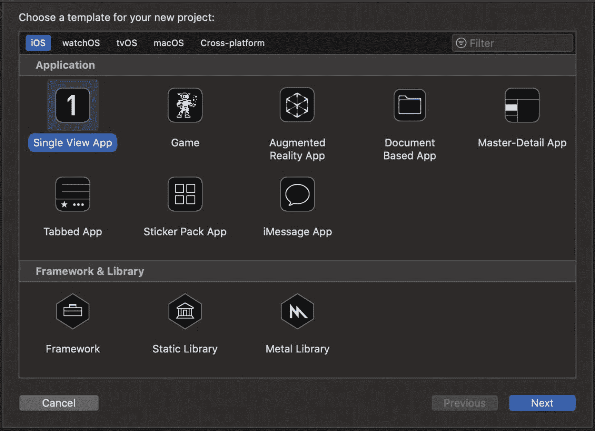
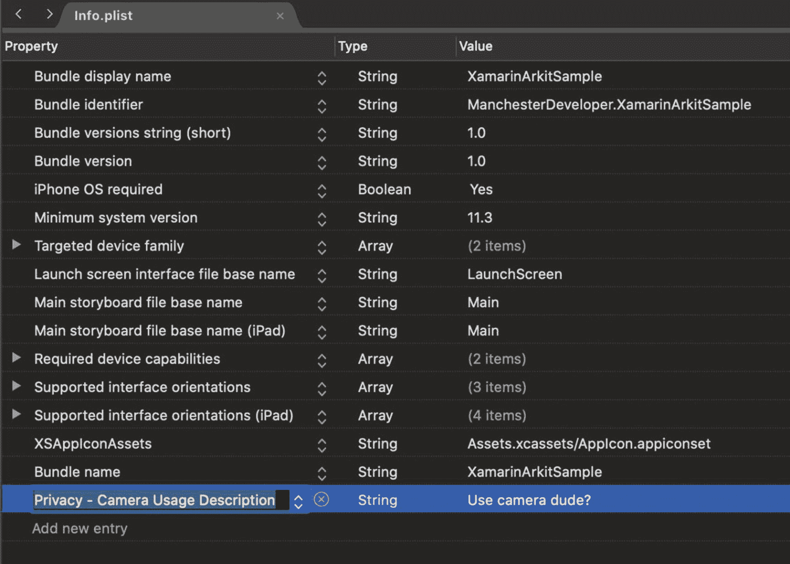

# 一、设置您的环境

首先，我们需要确保你已经安装了一些你需要的东西；之后，我们可以开始编写基本的增强现实应用并将其部署到您的 iOS 设备上。

这是你需要的东西的清单:

*   苹果身份证

*   合适的 iOS 设备

*   运行 macOS 的电脑

*   x mode(x mode)-x mode(x mode)-x mode(x mode)(x mode)(x mode)(x mode)(x mode)(x mode)(x mode)(x mode)

*   用于 Mac 的 Visual Studio

## 苹果 ID

好消息是，你不需要注册付费的苹果开发者计划来将应用部署到你的 iOS 设备上；你只需要你的 Apple ID 就可以开始了。然而，如果你希望最终将应用发布到 App Store，你需要加入苹果开发者计划并支付费用。你可以在 [`https://developer.apple.com/programs/`](https://developer.apple.com/programs/) 找到更多关于苹果开发者计划的信息。

## 合适的 iOS 设备

虽然 ARKit 自 iOS 11 以来就已经存在，但旧手机可能没有足够复杂的摄像头或 CPU 来使用 ARKit 的一些新功能，如身体遮挡。您至少需要一部 iPhone 6s 或更新的 iPhone 才能使用本书中的增强现实示例。

还值得一提的是，你需要合适的电缆将你的设备连接到你的 PC 或笔记本电脑，以便你可以从 Xcode 和 Visual Studio for Mac 部署应用。值得注意的是，经过一点设置后，还可以通过 Wi-Fi 从您的电脑上将您的应用部署到您的设备上，而无需线缆。

## 安装 Xcode

虽然我们将主要使用 Visual Studio for Mac 来创建本书中的增强现实应用，但由于其他原因，Xcode 也是必需的，以便在您的 iOS 设备上为我们的应用提供和安装代码签名证书。

如果你还没有安装 Xcode，可以从 App Store 安装(图 [1-1](#Fig1) )。

图 1-1

从 App Store 下载并安装 Xcode

## 安装 Visual Studio for Mac

你还需要最新版本的 Visual Studio for Mac，在撰写本文时是 2019 年，你会很高兴听到我们将花大部分时间在它上面。我发现，由于 Visual Studio for Mac 是一个相当新的产品，它一直在不断更新和改进。

如果你是 Windows 上的 Visual Studio 的用户，你会注意到，虽然 Mac 上的 Visual Studio 与 Windows 上的 Visual Studio 相似，但它确实有一些差异；它们不是 100%等同的。

Visual Studio for Mac 有很多要求，其中最主要的是 Xcode ( [`https://docs.microsoft.com/en-us/visualstudio/productinfo/vs2019-system-requirements-mac`](https://docs.microsoft.com/en-us/visualstudio/productinfo/vs2019-system-requirements-mac) )。

可以从 [`https://visualstudio.microsoft.com/vs/mac/`](https://visualstudio.microsoft.com/vs/mac/) 安装 Visual Studio for Mac，如图 [1-2](#Fig4) 所示。

图 1-2

下载并安装 Visual Studio for Mac

## 在 Xcode 中创建新项目

一旦你安装了 Xcode 和 Visual Studio for Mac，让我们开始创建我们的第一个项目。如果您想知道为什么我们要从 Xcode 中的项目开始，那是因为我们需要在 Xcode 中创建一个空白应用，并将其部署到我们的设备上，以便将相关的代码签名证书部署到设备上。

启动 Xcode，选择“新建 Xcode 项目”，如图 [1-3](#Fig3) 所示。

图 1-3

在 Xcode 中创建新项目

### 第一步。选择项目模板

在下一个名为“为您的新项目选择模板”的屏幕上，当您选择模板时，选择“单视图应用”，然后单击“下一步”，如图 [1-4](#Fig4) 所示。

图 1-4

选择“单一视图应用”作为项目模板

### 第二步。提供项目详情

在下一个名为“为您的新项目选择选项”的屏幕上，在“产品名称”字段中为您的应用提供一个名称。在图 [1-5](#Fig5) 中，你可以看到我已经编造了一些细节。

如果您在使用 Apple ID 之前已经登录 Xcode，则您可能已经在“团队”栏中有了一个(个人团队)条目。如果没有，也不用担心。我们稍后将登录以生成团队。

您可以将语言和用户界面保留为默认值；此外，我们不会使用单元测试或 UI 测试，所以你最好不要检查它们。

图 1-5

提供项目选项详细信息

Note

请特别注意创建的包标识符，因为我们在 Visual Studio for Mac 中创建增强现实应用时将需要它。

在本例中，它是 AwesomeCompany.HelloWorldAR。

单击下一步。

### 第三步。提供项目位置

为您的项目选择一个位置。我通常会为此创建一个新文件夹。

图 1-6

为您的项目选择一个位置

单击创建。

### 第四步。查看新项目

您应该会看到 Xcode 中新创建的 Swift 项目，如图 [1-7](#Fig7) 所示。这个不用太担心。我们不会更改任何 Swift 代码！

图 1-7

您新创建的 Swift 项目

但是，我们将把该项目部署到我们的设备上，以生成和部署我们稍后需要的代码签名证书。

您会很高兴地听到，这是在我们能够专注于使用 C# 代码在 Visual Studio for Mac 中工作之前所需的最后一步。

如果您单击“播放”按钮或立即运行项目，而没有提前提供团队，构建将会失败。所以我们去选一个队吧。

### 第五步。选择一个团队或使用 Apple ID 登录

双击项目名称以打开项目设置，然后转到签名和功能部分。

如果列表中没有团队，请选择“添加帐户…”然后用你的 Apple ID 登录，如图 [1-8](#Fig8) 所示。

图 1-8

选择开发团队

### 第六步。更改部署目标

如果您现在运行项目，它将启动设备模拟器。我们不希望这样，所以请确保您的计算机通过适当的电缆连接到您的设备，然后将部署目标更改为您的设备名称(如图 [1-9](#Fig9) 所示)并单击播放或运行(确保您的设备已解锁)。

图 1-9

更改部署目标

Note

可以通过 Wi-Fi 设置调试和部署，无需在电脑和设备之间使用电缆。

### 第七步。信任开发商

如果您现在运行项目，它会将应用部署到设备；但是，如果您之前没有部署到您的设备，您可能会看到如图 [1-10](#Fig10) 所示的以下消息。别担心。这只是意味着我们需要在您的设备上执行一个简单的安全步骤。

图 1-10

信托开发商

为了在您的 iOS 设备上信任开发者和您的应用，您必须前往设置➤通用➤设备管理并选择开发者应用。

按下信任按钮并确认，如图 [1-11](#Fig11) 所示。

图 1-11

信任设备管理中的开发人员

如果你现在从 Xcode 运行这个应用，一切都按计划进行，你应该会在手机上看到默认的 Hello world 屏幕。

### 第八步。完成的

恭喜你。对于一些人来说，这可能是你第一次在你的设备上部署应用。你会很高兴知道我们不会在这个项目上做任何其他事情。但是，您可能需要此项目将证书重新部署到您的设备，这样我就不会删除它。把它放在你的机器上。

Note

个人代码签名仅持续 7 天，之后你需要将你的应用重新部署到你的设备，以使其再次工作。

Reminder

请务必记下步骤 2 中的包标识符，因为当我们在 Visual Studio for Mac 中创建应用时将需要它。

## 在 Visual Studio for Mac 中创建新项目

接下来，我们将创建我们的应用，它将包含我们在 Visual Studio for Mac 中的增强现实实验，并将其部署到我们的 iOS 设备上。

启动 Visual Studio for Mac 并选择“新建项目”。

### 第一步。创建新项目并选择项目类型

从模板类别列表中选择 iOS，然后选择单视图 App，如图 [1-12](#Fig12) 所示。

图 1-12

选择项目类型

### 第二步。提供应用详细信息

您将希望使用与您在 Xcode 应用中使用的相同的应用名称和组织标识符，以便捆绑包标识符与 Xcode 相同，如图 [1-13](#Fig13) 所示。这样就可以使用相同的代码签名证书将应用配置和部署到您的 iOS 设备上。

图 1-13

提供应用详细信息

### 第三步。提供项目详情

现在您需要提供项目名称、解决方案名称以及项目的位置，如图 [1-14](#Fig14) 所示。这些可以是您想要的任何位置，但请确保您为 Xcode 应用提供了不同的位置。

图 1-14

提供项目详情

单击创建。

### 第四步。选择部署设备并运行

在前面的步骤中创建您的项目后，您应该看到新创建的项目框架，如图 [1-15](#Fig15) 所示。

图 1-15

查看新项目

确保将部署目标更改为连接的 iOS 设备，并且该设备已解锁，然后运行项目。该设备应该运行应用，这是一个相当无聊的空白白屏。

恭喜你！你已经部署了你的第一个。NET iOS 项目下载到您的设备上。

值得注意的是，这个应用还没有任何增强现实功能；我们还没有为此编写代码。您创建的项目和部署的应用将承载我们将在本书中介绍的所有增强现实功能。

### 设置相机权限

我们将用于增强现实的新应用将需要使用您的摄像头，因此您需要在 projects Info.plist 文件中显式声明此权限。

您可以从下拉列表中选择“隐私-相机使用说明”,并提供您喜欢的任何信息，如图 [1-16](#Fig16) 所示。首次运行应用时会显示此消息，要求用户授予应用使用摄像头的权限。

图 1-16

设置相机权限

## 摘要

现在，您应该已经设置好了本地环境，并准备好开始体验增强现实。这正是我们将要做的，但首先让我们在下一章讨论增强现实和 ARKit 的一些基本概念。