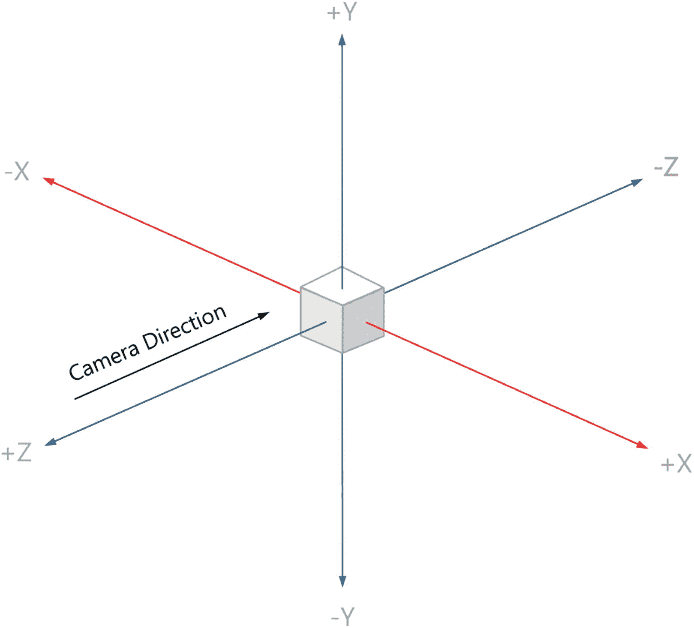
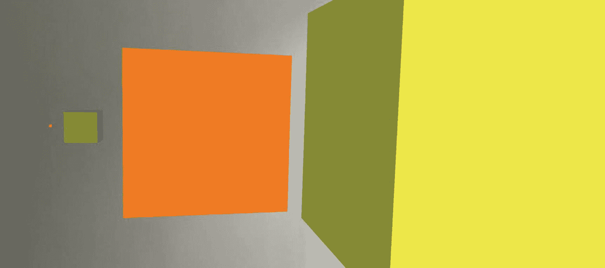

# 二、基本概念

在这一章中，我们看一些基本概念，这些概念使使用 ARKit 的移动增强现实体验成为可能，并且您将很快使用它们来构建您的增强现实应用。

在继续之前，很好地理解这些基础知识是很重要的，因为这将对你有很大的帮助，然后再继续本书中的进一步主题，在那里我们将回头参考这些基础知识。只有在理解了这些基本概念之后，我们才能继续探索更高级的概念。

## 场景视图

在 ARKit 中，增强现实场景视图(`ARSCNView`)是所有神奇事情发生的地方。当一个`ARSCNView`的会话运行时，它将摄像机设置为视图的背景，并显示我们添加到场景顶部的任何东西。

在清单 [2-1](#PC1) 中，您可以看到场景视图是在 ViewController 构造函数中创建的，并且可以设置一些初始属性(我们将在后面讨论)。然后这个场景视图被添加为当前视图的子视图。



图 2-1

坐标系统

在`ViewDidLoad`事件中，我们也将场景视图的框架设置为这个视图的框架。

您将在整本书的所有 AR 示例中使用这个基本的*设置/样板*代码。

```cs
private readonly ARSCNView sceneView;

public ViewController(IntPtr handle) : base(handle)
{
    this.sceneView = new ARSCNView();
    {
        AutoenablesDefaultLighting = true

    };

    this.View.AddSubview(this.sceneView);
}

public override void ViewDidLoad()
{
    base.ViewDidLoad();
    this.sceneView.Frame = this.View.Frame;
}

Listing 2-1Creating the Scene View

```

## 会议

在调用`Session.Run()`方法之前，SceneView 中不会发生任何事情。一旦会话开始运行，它会做很多事情。

首先，它将相机设置为视图的背景。

然后，当你四处移动设备/相机时，它开始尝试了解你的即时环境，记录兴趣点及其在相机帧之间的相对位置，同时使用设备的陀螺仪和加速度计来了解设备的方向。这个有趣的名字叫做视觉惯性里程计，这就是当我们移动相机时，它如何能够理解环境并保持我们放入场景中的东西的位置。

它开始将不可见的`Anchors`放置在它发现的感兴趣的点上，并在你放置它们的位置覆盖你已经放置到场景中的任何 3D 对象。锚点(我们将在第 3 章[T2，“节点、几何体、材质和锚点”中详细讨论)是我们 AR 场景中的参考点，可以自动检测或手动放置在场景中。](03.html)

当调用`Session.Run()`方法时，你必须提供一种类型的`ARConfiguration`，它定义了你想要在场景中使用的 AR 功能的类型，如清单 [2-2](#PC2) 所示。根据会话中使用的配置类型和设置，它可能会根据在场景中检测到的内容(如平面、图像或面)表现不同。

```cs
public override void ViewDidAppear(bool animated)

{
   base.ViewDidAppear(animated);

    this.sceneView.Session.Run(
      new ARWorldTrackingConfiguration());
}

Listing 2-2Starting the SceneView Session

```

## SceneKit

虽然 ARKit 使本书中提到的增强现实功能成为可能，但我们实际上将广泛使用 SceneKit(这是苹果的 3D 图形框架)，包括将对象放置到我们的 AR 场景中。接下来的“尺寸”和“定位”部分都来自 SceneKit，节点、几何体和材质将在下一章讨论，动画将在第 [5](05.html) 章“动画”中讨论

如果您想知道 ARKit 在哪里结束，SceneKit 在哪里开始，下面的内容可能会有所帮助。

您通常可以分辨出哪些代码类型来自 ARKit 或 SceneKit，因为它们通常分别以 AR 或 SCN 为前缀。比如`ARSCNView`来自 ARKit，`SCNNode`来自 SceneKit。

## 配置

了解坐标系在 SceneKit 中的工作方式非常重要，这样您就可以在 AR 场景中定位自己，并能够在三维空间中围绕您的环境放置多个对象。

有三个维度你需要记住并习惯，X，Y，Z 如图 [2-1](#Fig1) 所示。其中 X 是从左到右，Y 是从下到上，Z 是从前到后。幸运的是，有一个内置的功能，你可以打开它，在你的应用中显示坐标轴。我们将在第 4 章[的“内置增强现实指南”中介绍这一点](04.html)

在清单 [2-3](#PC3) 中，我们可以看到当设置一个对象的位置时，我们使用了一个`SCNVector3`的实例，并为 X、Y 和 Z 坐标提供浮点值，其中 1f 实际上是 1 米，0.1f 10 厘米，0.01f 1 厘米。

一旦我们创建了`SCNVector3`的实例，有效地声明了 3D 空间中的位置，我们就可以使用 nodes `Position`属性为它设置一个节点位置。

```cs
public override void ViewDidAppear(bool animated)
{
    base.ViewDidAppear(animated);

    this.sceneView.Session.Run(new
      ARWorldTrackingConfiguration());

    // Creates and assigns a position to a node
    // In this case it is setting it 1m above and 1m in front
    // of the devices initial position
    var position = new SCNVector3(0, 1f, -1f);
    var node = new SCNNode();
    node.Position = position;

    // Adds the node to the scene
    // (will be invisible as we haven't told it what
    // to look like yet)
   this.sceneView.Scene.RootNode.AddChildNode(node);
}

Listing 2-3Setting the position of an object in 3D space

```

可能值得注意的是，在将对象放置到场景中后，您可以随时更改对象的位置，只需用具有不同 X、Y 和 Z 坐标值的`SCNVector3`实例更新其`Position`属性即可。

Hint

我花了一段时间才想起来，要把一个物体放在我面前，我必须把它放在 Z 值为负的地方(也就是你面前)。把一个东西放在 Z 轴的正方向实际上是把它放在你的后面。多。很多次，我都在困惑地寻找一个我放在前面场景中的物体，而实际上它就在我后面！

## 世界起源

默认情况下，当您启动 AR 应用时，您的世界原点是应用启动时您的设备所在的点。默认世界原点的位置将是(0，0，0)，其中 X、Y 和 Z 都是 0。不管你将你的设备相对于世界原点移动到哪里，你放置在场景中的所有物体都将相对于世界原点，*而不是*你设备的当前位置。也就是说，如果需要，在应用启动后，可以通过编程方式更改世界原点的位置。

在你创建的 AR 体验中，世界原点的位置是如此准确，以至于你甚至会注意到不同的视角，这取决于你在启动应用时是坐着还是站着。

值得注意的是，如果您在将对象添加到场景时没有显式设置对象的位置，它将被放置在这个世界原点(0，0，0)。

Hint

如果你在世界原点放置一个相当大的物体，你可能看不到它，因为除非你改变了你的物理位置，否则你实际上占据了与虚拟物体相同的空间。在这种情况下，你可能需要后退一步才能看到放在世界原点的东西，因为它会在你面前。或者，当在场景中放置某物时，给它一个-Z 值，使它放在你面前。

可以想象，世界原点很重要，因为它几乎成为了你的场景或 AR 体验的系绳或中心参考点。

## 世界对齐

当您的`ARSession`启动时，它的`ARWorldTrackingConfiguration`将使用一个特定的`WorldAlignment`值来默认确定应用中轴的设置和行为，以及它的初始方向。

这很重要，因为它将决定哪个方向是向前的(-Z)，因此哪个方向是向左的(-X)和向右的(+X)，以及哪个方向是向上的(Y)，因此哪个方向是向下的(-Y)。

如果我们愿意，我们可以改变`ARWorldTrackingConfiguration`的默认属性`WorldAlignment`，也就是`WorldAlignment.Gravity`。

除了重力之外，还有三种不同的`WorldAlignment`设置可以让你的轴以不同的方式工作。

## 重力

Y 轴平行于重力，即直下；当应用启动时，其他轴与设备的初始方向对齐。也就是说，-Z 是应用启动时设备面对的方向，-X 在左边，X 在右边，而+Z 在后面。

例如，使用此选项并将一个对象放置在坐标为(0，0，-1f)的场景中，会将其放置在应用启动时所面对的方向上距离世界原点 1 米的位置。如果您关闭应用，转向您面对的方向，然后再次启动应用，并再次将一个对象放入场景中的(0，0，-1f)，它将出现在您现在面对的方向上距离世界原点 1 米处。

在大多数情况下，`WorldAlignment = ARWorldAlignment.Gravity`会给你的轴你想要的行为，所以我建议你暂时坚持使用它。

## 重力和航向

同样，Y 轴平行于重力，尽管这次 Z 轴对准南北，X 轴对准东西。也就是说，-Z 总是北，+Z 南，-X 西，+X 东的方向。

我想如果您正在构建某种导航功能，您可能会想要使用这个设置。使用这个设置可以有效地将你的轴变成一个指南针，使你的轴始终指向北、南、东、西。

例如，使用该选项并将一个对象放置在坐标为(0，0，-1f)的场景中，会将其放置在磁北方向距离世界原点 1 米处，因此将某个对象放置在(-1f，0，0)处会将其放置在当前位置以西 1 米处，依此类推。

对于`Gravity`和`GravityAndHeading`来说，沿 Y 轴的任何位置都与重力对齐，其中-Y 垂直向下朝向地球中心，而+Y 垂直向上远离地球中心。

## 照相机

该设置对`Gravity`和`GravityHeading`的作用非常不同。使用`WorldAlignment.` `Camera`设置场景的坐标系，以始终匹配摄像机的方向，因此使-Z 始终与您面对的方向对齐，-X 始终在您的左侧，Y 从摄像机向上。如何定位相机将对轴系产生影响，包括 Y 轴的对齐方向。

如果这些世界排列现在看起来很混乱，不要太担心。习惯它们的一个很好的方法是打开一个调试标志，该标志将 X、Y 和 Z 轴的视觉表示放置在场景的世界原点，这在您尝试第一次 AR 体验时非常有用。我们将在第 [4](04.html) 章“内置 AR 指南”中讨论如何做到这一点

## 大小

ARKit 中的尺寸(嗯，实际上 SceneKit 记得吗？)存储为浮点数据类型，其中 1f 值相当于 1 米，这意味着 0.1f 相当于 10 厘米，0.01f 相当于 1 厘米。记住这一点是很有用的，因为很容易把事情做得太大(你看不到它，因为你在里面！)或者太远。巧合的是，在 AR 场景中制作一些东西的大小和位置的动画可以产生很好的效果，我们将在第 [5](05.html) “动画”中学习如何做

在图 [2-2](#Fig2) 中，我们可以看到盒子的相对尺寸分别为 1 厘米、10 厘米、50 米和 1 米，以及在清单 [2-4](#PC4) 和 [2-5](#PC5) 中创建它们的代码。



图 2-2

不同大小的虚拟对象

这一次，如 ViewDidAppear 方法中的清单 [2-4](#PC4) 所示(我们将在本书中实现大部分 ar 代码)，我们创建了不同大小的四个不同的 CubeNode 实例(一个我们从 SCNNode 继承的自定义类，可以在清单 [2-5](#PC5) 中看到)，并使用名为`this.sceneView.Scene.RootNode.AddChildNode()`的重要方法将它们添加到场景中。

我们将在下一章“节点、几何图形、材质和锚点”中更详细地讨论节点

```cs
public class CubeNode : SCNNode
{
    public CubeNode(float size, UIColor color)
    {
        var material = new SCNMaterial();
        material.Diffuse.Contents = color;

        var geometry = SCNBox.Create(size, size, size,0);
        geometry.Materials = new[] { material };

        var rootNode = new SCNNode();
        rootNode.Geometry = geometry;

        AddChildNode(rootNode);
    }
}

Listing 2-5CubeNode class

```

```cs
public override void ViewDidAppear(bool animated)
{
     base.ViewDidAppear(animated);

     this.sceneView.Session.Run(
       new ARWorldTrackingConfiguration());

     // 1cm
     var cubeNode1 = new CubeNode(0.01f, UIColor.Red);
     cubeNode1.Position = new SCNVector3(0, 0, 0);

     // 10cm

     var cubeNode2 = new CubeNode(0.1f, UIColor.Green);
     cubeNode2.Position = new SCNVector3(0.1f, 0, 0);

     // 50cm (0.5m)
     var cubeNode3
      = new CubeNode(0.5f, UIColor.Orange);
     cubeNode3.Position = new SCNVector3(0.5f, 0, 0);

     // 100cm (1m)
     var cubeNode4 = new CubeNode(1f, UIColor.Yellow);
     cubeNode4.Position = new SCNVector3(1.5f, 0, 0);

     this.sceneView.Scene.RootNode
        .AddChildNode(cubeNode1);
     this.sceneView.Scene.RootNode
        .AddChildNode(cubeNode2);
     this.sceneView.Scene.RootNode
        .AddChildNode(cubeNode3);
     this.sceneView.Scene.RootNode
        .AddChildNode(cubeNode4);
}

Listing 2-4Adding objects of different sizes 

```

## 配置

当您用`ARSession.Run()`开始一个会话时，您提供了一个`ARConfiguration`的实例。你希望你的增强现实应用拥有的能力和你希望它如何表现将决定你使用的配置类型。

例如，如果您想进行人脸检测，您可以向它传递一个`ARFaceTrackingConfiguration`实例以及一些配置变量，比如要跟踪的人脸数量。

这是我们将在本书后面看到的配置列表。

*   启用世界跟踪，包括平面、图像和物体检测，我们在本书的大部分例子中都使用它。

*   `ARFaceTrackingConfiguration`启用面部跟踪，我们将在第 [11 章](11.html)“面部跟踪和表情检测”中了解这一点

*   启用身体追踪，我们将在第 [16 章](16.html)“身体追踪”中了解这一点

## 摘要

现在，您应该已经很好地理解了启动增强现实会话以设置 AR 场景所必需的基本概念，并理解了一旦场景运行后如何找到场景周围的路，包括大小调整和轴、坐标以及定位系统。

在下一章，我们将会看到你可以在场景中放置的东西，包括节点、几何图形、材质和锚点。