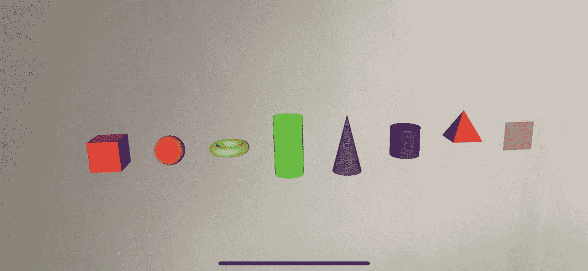
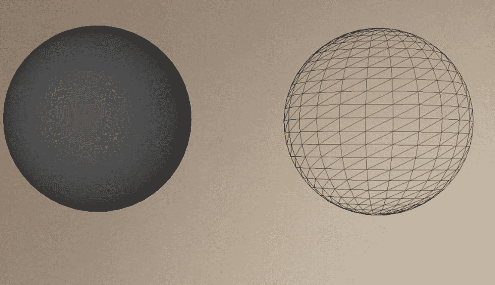

# 三、节点、几何图形、材质和锚

在这一章中，我们将看看在增强现实体验中共同创造我们可以看到和互动的一切的构建模块。让我们开始添加东西到我们的 AR 场景中。

## 节点

在您的 AR 场景中，您几乎肯定会有一个或多个节点(`SCNNode`的实例)。默认情况下，这些节点没有任何形状或形式，因此看起来不像任何东西。我们通过应用几何图形来赋予它们形状，通过将材质应用于几何图形来赋予它们视觉外观。

你想知道你会用节点做什么？嗯，几乎所有的事情。例如，它可以简单到将显示图像的彩色 3D 球体或 2D 平面放置到场景中。这两项都是节点。

我们可以使用`SCNVector3`来指定节点的`position`，就像我们在第 [2](02.html) “基本概念”中看到的那样；否则，当添加到场景中时，其默认位置将是世界原点(0，0，0)。

一个节点可以有许多子节点，这些子节点又有自己的子节点，依此类推。你想知道为什么要有子节点？嗯，如果你在一个场景中放置了 50 个节点，然后想改变所有 50 个节点的位置，你必须依次改变每个节点的位置。除非您创建一个节点，然后将这 50 个节点添加为该节点的子节点，然后您只需更改父节点的位置，子节点的相对位置就会相应地增加。

我喜欢把节点想象成乐高积木，每一块都有自己的形状、大小、外观和功能，它们本身是没用的，但是把它们放在一起，我们可以做出更好的东西，更复杂和有用的东西。

## 不透明

可以在一个节点上设置几个属性，包括`Opacity`，这是我喜欢使用的东西，即使只是微妙地使用。通过改变一个节点的不透明度，我们可以使它变得更不透明，反之亦然。

不透明度是一个浮动值，范围从 0f(完全透明)到 1f(完全不透明)，默认情况下，节点的不透明度值将为 1f(完全不透明)。

在清单 [3-1](#PC1) 中，你可以看到我们如何声明一个新的材质(`SCNMaterial`)，在这个例子中是一个纯蓝色。然后，我们创建一个新的几何体(一种 2D 或 3D 形状)，在本例中是一个高度、宽度和深度均为 1m 的盒子(`SCNBox`),并将材质分配给这个盒子，生成一个蓝色的盒子。然后我们创建一个新的节点(`SCNNode`)，并将其几何图形设置为新的盒子。之后，我们设置节点的`opacity`为 0.5f，有效地使其 50%不透明。最后，我们通过调用`this.sceneView.Scene.RootNode.AddChildNode()`将节点添加到场景中。

```cs
// Create the Material
var material = new SCNMaterial();
material.Diffuse.Contents = UIColor.Blue;

// Create the Box Geometry and set its Material
var geometry = SCNBox.Create(1f, 1f, 1f, 0);
geometry.Materials = new[] { material };

// Create the Node and set its Geometry
var cubeNode = new SCNNode();
cubeNode.Geometry = geometry;

// Make the cube 50% opaque
cubeNode.Opacity = 0.5f;

// Add the Node to the Scene
// Remember, as we are not explicitly setting a position,
// The Node will appear at the WorldOrigin (0,0,0)
this.sceneView.Scene.RootNode.AddChildNode(cubeNode);

Listing 3-1Creating a simple node with shape, size, and color

```

不用担心，材质和几何图形将在接下来的章节中讨论。

## 几何

几何体是一个节点可以拥有的形状或网格，没有它们，我们的场景会非常无聊；事实上，如果没有它们，我们将只有一堆看不见的无形节点。几何图形可以是简单的形状或复杂的网格。在下面的部分中，您可以看到可供我们使用的不同类型的基本内置几何图形。

## 内置几何形状

有许多内置几何体形状可用于节点。但别担心。你不受这些基本形状的约束；你可以提供一个自定义的几何图形，或者在另一个工具中构建一个 3D 模型，并将其导入到你的应用中，我们将在第 [13](13.html) 章“3D 模型”中对此进行讨论

清单 [3-2](#PC2) 中的以下代码为节点创建了一个简单的长方体几何体，宽、高、深均为 10 厘米，然后在添加到场景中之前为其赋予红色材质。

```cs
var material = new SCNMaterial();
material.Diffuse.Contents = UIColor.Red;

var boxNode = new SCNNode();
boxNode.Geometry = SCNBox.Create(0.1f, 0.1f, 0.1f, 0);
boxNode.Geometry.Materials = new SCNMaterial[] { material };
this.sceneView.Scene.RootNode.AddChildNode(boxNode);

Listing 3-2Creating a simple 10 cm red cube

```

以下是我们可以使用的内置几何图形:

*   这是一个 2D 的四边长方形或正方形；它们对于将图像放置在场景中的显示图像上或作为放置其他对象的表面非常有用。值得注意的是，您可以调整平面的`CornerRadius`属性，将那些尖角变成更柔和、更圆的角。

*   `SCNBox`–如果您选择使用相同的宽度、深度和高度值，您的箱子将像一个规则的立方体，或者通过使用不同的值，它可能更像一个扁平的邮政包裹。类似于一个`SCNPlane,`你可以把你的尖角变成更柔和、更圆的角，但是这次是通过改变盒子的`ChamferRadius`属性。

*   一个球体，用于描绘像行星这样的东西。

*   `SCNCylinder`–实心圆柱形。

*   圆环是甜甜圈或环形的一个花哨的词。

*   `SCNCone`–实心圆锥形，一端为圆形底座，另一端为一个点。

*   `SCNTube`–类似于`SCNCylinder`，除了这是一个空心管，像一根管子。

*   `SCNText`–您可以放置在场景中的 3D 文本，像大多数文本一样，您可以设置其字体和大小。

*   就像埃及人建造的一样。

当调用其`.Create()`方法来定义形状的不同方面时，每个几何图形需要一组不同的参数。例如，`SCNSphere.Create()`只接受一个参数，即球体的半径，而`SCNBox.Create()`接受三个参数来定义其宽度、高度和深度。

图 [3-1](#Fig1) 显示了我们可以使用的上述不同类型的几何图形。



图 3-1

不同类型的内置几何图形

但是，即使在创建几何体并将其指定给节点后，也只有在创建并指定材质后才能看到它。所以我们最好看看如何使用材质。

## 材质

您可以将一种或多种材质(`SCNMaterial`的实例)应用到一个几何图形中，为其提供视觉外观。我们将特别关注如何给一个项目一个纯色或者用图片包装它。

### 纯色材质

你可以给一个几何体一个最基本的材质是纯色，如清单 [3-3](#PC3) 所示，其中我们将材质的`Diffuse`属性的`Contents`属性设置为`UIColor.Red`。

```cs
// Create the Material
var material = new SCNMaterial();
material.Diffuse.Contents = UIColor.Red;

// Create the Box Geometry and set its Material
var geometry = SCNBox.Create(1f, 1f, 1f, 0);
geometry.Materials = new[] { material };

// Create the Node and set its Geometry
var cubeNode = new SCNNode();
cubeNode.Geometry = geometry;

Listing 3-3Setting a material to be a solid color

```

你可能想知道为什么一个几何体接受一组材质；这是因为我们可以在几何体的不同面使用不同的材质。例如，如果我们声明六种不同的材质，每种材质使用不同的颜色，并在长方体几何体的数组中提供这六种材质，那么我们将得到一个具有六个不同颜色边的长方体。

## 图像材质

另一种可以赋予几何体的材质是图像。如果我们想在一幅图像中包裹一个几何图形，或者把一幅图像放在一个 2D 平面上，这是很有用的。注意这一次，我们设置了一个`UIImage`给材质扩散内容属性，如清单 [3-4](#PC4) 所示。这个内容属性接受一些不同的类型，包括我们已经看到的`UIColor`和`UIImage`。

```cs
// Load the image
var image = UIImage.FromFile("img/pineapple.jpg");

// Create the Material
var material = new SCNMaterial();
material.Diffuse.Contents = image;
material.DoubleSided = true;

// Create the Plane Geometry and set its Material
var geometry = SCNPlane.Create(1f, 1f);
geometry.Materials = new[] { material };

// Create the Node and set its Geometry
var rootNode = new SCNNode();
rootNode.Geometry = geometry;

// Add the Node to the Scene
this.sceneView.Scene.RootNode.AddChildNode(rootNode);

Listing 3-4Setting a material to be an image

```

Hint

如果您不使用`material.DoubleSided = true`，那么您的几何图形可能只有在从某些角度查看时才可见。

值得一提的是，也可以使用包含透明度的 PNG 图像，并且会保持透明度。例如，如果您创建了一个包含一些文本的透明 PNG，并将该图像用作`SCNPlane`上的材质，您将只能看到浮动文本。这是一个非常有用和漂亮的效果。

## 材质填充模式

默认情况下，材质的填充模式是实心的。但是，您始终可以将填充模式更改为线条，以查看组成形状的网格。在清单 [3-5](#PC5) 和图 [3-2](#Fig2) 中，你可以看到球体几何体的填充模式可以是实线或线条。



图 3-2

不同的材质填充模式

```cs
var material = new SCNMaterial();
material.Diffuse.Contents = colour;
material.FillMode = SCNFillMode.Lines;

Listing 3-5Material fill modes

```

## 锚

锚点是自动检测或手动放置在场景中的参考点。例如，像我们在第 [10](10.html) 章“图像检测”中所做的那样进行图像检测时，ImageAnchor 会自动放置在场景中被检测图像的位置。它们有助于将我们的虚拟物体与现实世界联系起来。

我们将在本书中使用的锚包括

*   `ARPlaneAnchor`–代表场景中检测到的水平或垂直平面，我们将在第 [9 章](09.html)“平面检测”中使用，以帮助可视化墙壁、地板和表面。

*   `ARImageAnchor`–代表在场景中检测到的图像，我们将在第 [10 章](10.html)“图像检测”中使用，检测场景中预定义的图像。

*   `ARFaceAnchor`–代表场景中检测到的人脸，我们将在第 [11 章](11.html)“人脸跟踪和表情检测”中使用，在这里我们可以向检测到的人脸几何图形添加其他节点，甚至检测一系列的面部表情。

*   `ARObjectAnchor`–代表场景中检测到的物体，我们将在第 [15 章](15.html)“物体检测”中使用，在场景中检测到预定义的“扫描”3D 物体的形状。

*   `ARBodyAnchor`–代表场景中检测到的身体，我们将在第 [16 章](16.html)“身体跟踪”中使用它来跟踪场景中身体的位置和方向。

锚点对于跟踪我们 AR 体验中感兴趣点的存在和位置至关重要。

## 要尝试的事情

使用本章中讨论的概念，如节点、几何形状和材质，并将它们与第 [2](02.html) 章“基本概念”中讨论的内容相结合，如定位和尺寸，你现在应该能够自己尝试一些事情。

这里有一些让你开始的想法。

用基本的几何图形和材质制作雪人。

首先创建一个节点，然后添加其他具有不同位置、大小和材质的基本几何体的节点来创建一个基本雪人。你可以从白色球体作为身体和头部开始，黑色球体作为眼睛，棕色球体作为按钮，黑色圆柱体作为帽子。

看看你能在场景中不同的地方放置多少物品。

现在你知道了如何在不同的地方放置物品，看看你能用一个大的`for`或`do while`循环在场景的不同位置放置多少个。你甚至可以使用`Random`，将它们放置在任意位置。

在场景中放置不同大小的物品。

感受一下虚拟的 1 厘米、10 厘米和 1 米的物体在场景中有多大。

在场景中放置不同颜色和不透明度的物品。

使用不同颜色的材质，创建不同颜色的节点，看看它们在不同的`opacity`值下是什么样子。

创建透明的 png，并将其用作几何材质。

创建一个透明的 PNG，给它添加一些大的厚文本，并使用该图像作为`SCNPlane`的素材，看看以这种方式使用透明 PNG 有多有效。

看你能做多大或多小的节点。

看看你能在场景中放置多小的一个物体而仍然能看到它；然后看你能在一个场景中放置多大的物品(对于后者，你可能需要把它放置在离你很远的地方；否则，如果你占据了与项目相同的空间，你就有被项目内部的风险。

## 摘要

我们已经讨论了 ARKit 中作为增强现实的物理构建块的节点，我们将大量使用这些节点，如何利用内置的几何形状，如何为它们提供视觉外观，以及如何将它们放置在场景中。

在下一章，我们将看看一些*内置工具和指南*，我们可以用它们来帮助开发和理解我们的增强现实场景。