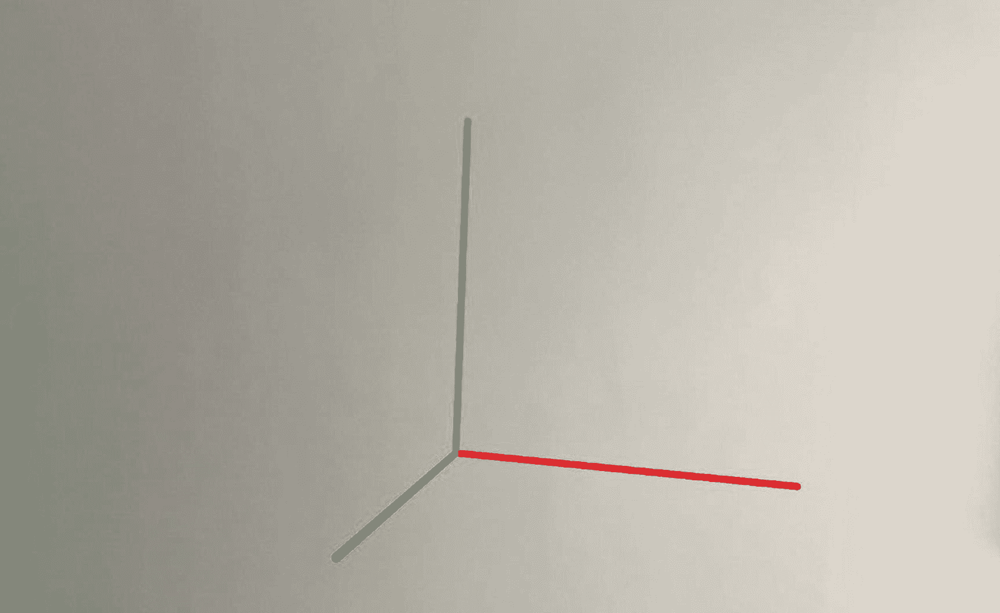
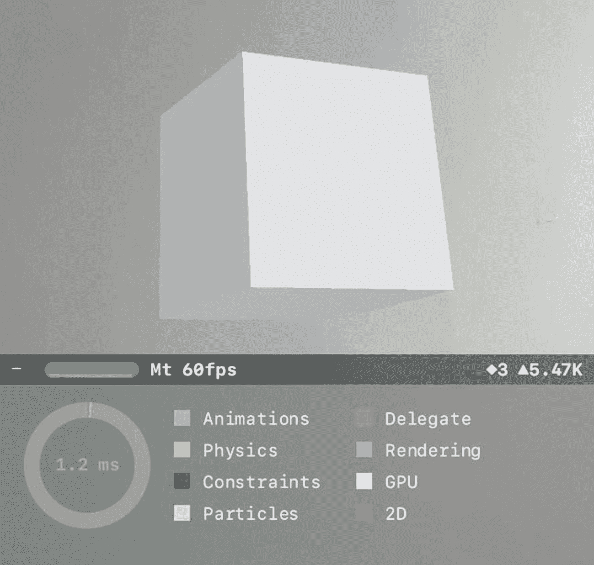
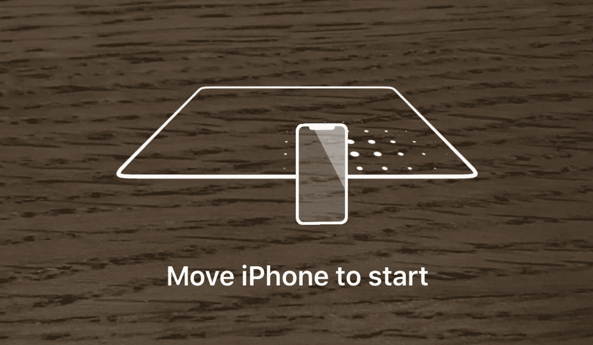

# 四、内置 AR 指南

ARKit 附带了一些有用的内置指南和工具，可以在开发您的第一次增强现实体验时提供帮助。我们可以在设置场景时通过在`SCNDebugOptions`中设置它们的标志来启用其中一些。

## 显示特征点

我建议你在创建第一个应用时，打开标志来显示功能点。它有助于向您展示应用和相机对照明条件和表面的依赖程度。但是，在以后的应用中，您将很少需要打开此功能。

您可以通过设置清单 [4-1](#PC1) 中所示的`DebugOptions`标志来启用它。

```cs
public ViewController(IntPtr handle) : base(handle)
{
    this.sceneView = new ARSCNView
    {
        DebugOptions = ARSCNDebugOptions.ShowFeaturePoints
    };

    this.View.AddSubview(this.sceneView);
}

Listing 4-1Enabling feature points in the code

```

当`ShowFeaturePoints`调试被激活时，你会看到黄色的点出现在你场景的表面上，如图 [4-1](#Fig1) 所示。丰富的特征点意味着 ARKit 可以检测场景中的许多特征点。这很好，因为 ARKit 使用特征点来帮助保持虚拟对象在场景中的位置。

你会注意到，当打开`ShowFeaturePoints`并在光线不好的环境中或对着毫无特色的表面(如普通的墙壁或玻璃表面)运行你的应用时，黄点会少得多。这有助于确认，为了让您的应用以最佳方式运行，它应该在光线充足、功能丰富的环境中使用。


图 4-1

显示场景中的特征点有助于我们理解应用如何在场景中寻找兴趣点

## 显示世界原点和坐标轴

正如我们在第 [2](02.html) 章“基本概念”中介绍位置概念时简要提到的，可以打开显示世界原点 X、Y 和 Z 坐标轴的指南，如清单 [4-2](#PC2) 所示。这可以帮助我们定位，提醒我们 X、Y 和 Z 轴在哪个方向，如图 [4-2](#Fig4) 所示。

由于轴显示在世界原点，它指示会话开始时设备的位置，即位置 0，0，0。请记住，添加到场景中的节点，如果没有给出具体的位置，将会出现在世界原点。

```cs
public ViewController(IntPtr handle) : base(handle)
{
    this.sceneView = new ARSCNView
    {
        DebugOptions = ARSCNDebugOptions.ShowWorldOrigin
    };

    this.View.AddSubview(this.sceneView);
}

Listing 4-2Enabling WorldOrigin helper

```



图 4-2

在世界原点显示坐标轴

请注意，您可以同时启用多个调试选项。例如，在清单 [4-3](#PC3) 中，您可以看到我们在场景中显示了特征点和世界原点/轴。

```cs
public ViewController(IntPtr handle) : base(handle)
{
    this.sceneView = new ARSCNView

    {
        DebugOptions
        = ARSCNDebugOptions.ShowFeaturePoints |
          ARSCNDebugOptions.ShowWorldOrigin
    };

    this.View.AddSubview(this.sceneView);
}

Listing 4-3Enabling multiple debug options

```

## 显示统计数据

通过打开清单 [4-4](#PC4) 中所示的`ShowStatistics`选项，并按下底部栏上的+按钮，当您的应用运行时，附加信息会显示在屏幕底部，如图 [4-3](#Fig3) 所示。统计视图显示了一些有用的信息，尤其是当你的应用运行缓慢或者不如你希望的那样流畅时。



图 4-3

显示统计数据提供了关于场景渲染所花费的工作量的信息

```cs
public ViewController(IntPtr handle) : base(handle)
{
    this.sceneView = new ARSCNView {
        ShowsStatistics = true
    };

    this.View.AddSubview(this.sceneView);
}

Listing 4-4Enabling Statistics in the code

```

统计视图以每秒帧数(fps)显示帧速率，以及视图的 GPU 使用情况。如果 fps 开始下降得太低，您将需要密切关注它；60 fps 是最大值，30 以上的值也是可以接受的。它还显示了场景中的节点数(菱形)和多边形数(三角形)。如果您的应用开始遇到性能问题，您可能希望显示统计数据来调查可能导致速度下降的原因。

## 教练覆盖

由于应用了解其周围环境以在场景中准确地运行和放置事物非常重要，因此，为了帮助实现这一点，您可以使用内置的指导覆盖，鼓励用户移动他们的相机，直到应用收集到足够的信息，以便能够准确地了解场景。您可以向您的应用添加一个教练覆盖图，如清单 [4-5](#PC5) 所示。

```cs
public partial class ViewController : UIViewController, IARCoachingOverlayViewDelegate
{
    private readonly ARSCNView sceneView;
    ARCoachingOverlayView coachingOverlay;

    public ViewController(IntPtr handle) : base(handle)
    {
        this.sceneView = new ARSCNView();
        this.View.AddSubview(this.sceneView);
    }

    public override void ViewDidLoad()

    {
        base.ViewDidLoad();
        this.sceneView.Frame = this.View.Frame;
    }

    public override void ViewDidAppear(bool animated)
    {
        base.ViewDidAppear(animated);

        this.sceneView.Session.Run(new
           ARWorldTrackingConfiguration {
           PlaneDetection = ARPlaneDetection.Horizontal,
        });

        coachingOverlay = new ARCoachingOverlayView();
        coachingOverlay.Session = sceneView.Session;
        coachingOverlay.Delegate = this;
        coachingOverlay.ActivatesAutomatically = true;
        coachingOverlay.Goal = ARCoachingGoal.HorizontalPlane;
        coachingOverlay.TranslatesAutoresizingMaskIntoConstraints = false;

        sceneView.AddSubview(coachingOverlay);

        // Keeps the coaching overlay in the center of the screen

        var layoutConstraints = new NSLayoutConstraint[]
        {
            coachingOverlay.CenterXAnchor.ConstraintEqualTo(
               View.CenterXAnchor),
            coachingOverlay.CenterYAnchor.ConstraintEqualTo(
               View.CenterYAnchor),
            coachingOverlay.WidthAnchor.ConstraintEqualTo(
               View.WidthAnchor),
            coachingOverlay.HeightAnchor.ConstraintEqualTo(
               View.HeightAnchor),
        };

        NSLayoutConstraint.ActivateConstraints(
           layoutConstraints);
    }

    public override void ViewDidDisappear(bool animated)
    {
        base.ViewDidDisappear(animated);
        this.sceneView.Session.Pause();
    }

    public override void DidReceiveMemoryWarning()
    {
        base.DidReceiveMemoryWarning();
    }
}

Listing 4-5Enabling coaching overlay in code

```

结果如图 [4-4](#Fig4) 所示；一个透明的动画图像覆盖在屏幕上，鼓励用户移动手机；在它充分理解了这个场景之后，它就消失了。



图 4-4

教练覆盖图可以帮助指导用户实现一个目标(例如检测一架飞机)

## 摘要

当你第一次开始创建和熟悉增强现实体验时，其中一些内置指南可能会很有用，但当你开始发布和分发你的应用时，你几乎肯定会想禁用它们。

在下一章中，我们将会看到我最喜欢的、令人印象深刻的创造引人入胜的体验的特性之一，那就是*动画*，它对于给你的体验一种动态的感觉至关重要。