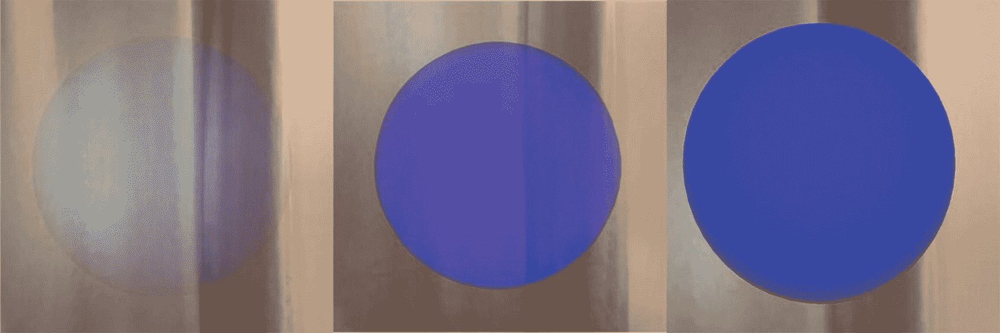
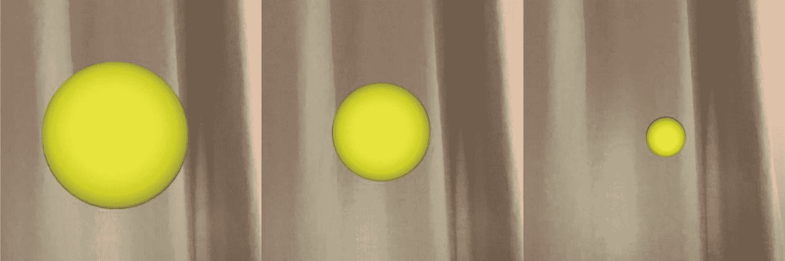
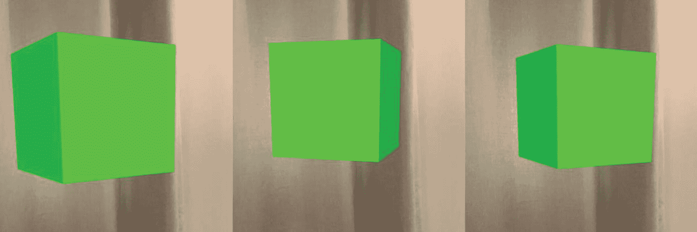

# 五、动画

让你的增强现实应用看起来令人印象深刻的一个简单方法是通过动画制作一个或多个节点来添加一点点运动。不然看起来会有点静态和做作。这可能就像淡入淡出节点或动画显示它们的位置或大小一样简单，幸运的是，这很容易做到。

从技术上讲，在 SceneKit 中，我们将使用一个叫做`SCNAction`的东西。但是因为我们要看的动作是激活我们的动画的，所以在本章中我将把动作称为动画。

## 动画不透明度

通过对场景中的一个或多个对象的不透明度进行动画处理，可以实现像淡入和淡出它们的外观这样的漂亮效果。清单 [5-1](#PC1) 展示了如何将一个节点的不透明度从 0f(零不透明度)设置为 1f(完全不透明度)。

```cs
var material = new SCNMaterial();
material.Diffuse.Contents = UIColor.Blue;

var geometry = SCNSphere.Create(0.5f);
geometry.Materials = new[] { material };

var opacityAction = SCNAction.FadeOpacityTo(1f, 3);
var sphereNode = new SCNNode();
sphereNode.Geometry = geometry;
sphereNode.Opacity = 0f;
sphereNode.RunAction(opacityAction);
this.sceneView.Scene.RootNode.AddChildNode(sphereNode);

Listing 5-1Fading in a node from 0% opacity to 100% opacity over 3 seconds

```

将一个物品制作成动画是将物品引入你的虚拟环境的好方法，如图 [5-1](#Fig1) 所示。感觉比一眨眼突然出现的东西自然多了。



图 5-1

在 3 秒钟内将不透明度从 0f 更改为 1f

## 动画缩放

虽然设置对象比例(大小)的动画是可能的，但我建议只使用比例的微小变化来达到所需的效果。可以在 X、Y 和 Z 轴(或所有方向)上设置对象缩放的动画。清单 [5-2](#PC2) 展示了如何在一秒钟内将一个节点的大小缩放到其原始大小的 10%。

```cs
var material = new SCNMaterial();
material.Diffuse.Contents = UIColor.Yellow;

var geometry = SCNSphere.Create(0.2f);
geometry.Materials = new[] { material };

var scaleAction = SCNAction.ScaleBy(0.1f, 1);
var sphereNode = new SCNNode();
sphereNode.Geometry = geometry;
sphereNode.RunAction(scaleAction);
this.sceneView.Scene.RootNode.AddChildNode(sphereNode);

Listing 5-2Decreasing a nodes size by 90% over a second

```

而图 [5-2](#Fig2) 显示的是收缩球体动画。



图 5-2

在 1 秒钟内将节点的比例更改为其原始大小的 10%

## 动画位置

可以将一个节点的位置从一个位置动画到另一个位置，这可以使用清单 [5-3](#PC3) 中的代码来实现。您可能希望使用此动画来使节点离您更近或更远。

```cs
var material = new SCNMaterial();
material.Diffuse.Contents = UIColor.Blue;

var geometry = SCNSphere.Create(0.5f);
geometry.Materials = new[] { material };

var positionAction = SCNAction.MoveBy(new SCNVector3(0, 0.5f, 0f), 3);
var sphereNode = new SCNNode();
sphereNode.Geometry = geometry;
sphereNode.RunAction(positionAction);
this.sceneView.Scene.RootNode.AddChildNode(sphereNode);

Listing 5-3Moving a node’s position 0.5 meter in the Y axis over 3 seconds

```

制作节点位置的动画有助于我们将它们从场景中枯燥的静态对象变成动态移动的对象。

## 动画定向

想要旋转一个节点？要么降低几度，要么让它旋转？嗯，可以，如清单 [5-4](#PC4) 所示。在我们的场景中旋转对象可以帮助显示它们具有一定的自由度，而不是完全静止的。

```cs
var material = new SCNMaterial();
material.Diffuse.Contents = UIColor.Green;

var geometry = SCNBox.Create(0.1f, 0.1f, 0.1f, 0);
geometry.Materials = new[] { material };

var rotateAction = SCNAction.RotateBy(
   0, (float)(Math.PI), 0, 3);

var cubeNode = new SCNNode();
cubeNode.RunAction(rotateAction);
this.sceneView.Scene.RootNode.AddChildNode(cubeNode);

Listing 5-4Rotating a node by 360 degrees over 3 seconds

```

结果是一个缓慢旋转的立方体，如图 [5-3](#Fig3) 所示。



图 5-3

在 3 秒内将立方体旋转 360 度

## 重复行为

在前面的例子中，动画默认运行一次。如果你愿意，很容易让它们运行预定的次数，如清单 [5-5](#PC5) 所示，或者重复运行，如清单 [5-6](#PC6) 所示。

```cs
var rotateAction = SCNAction.RotateBy(
   0, (float)(Math.PI), 0, 3);

var repeatRotationForever =
   SCNAction.RepeatActionForever(rotateAction);

sphereNode.RunAction(repeatRotationForever);

Listing 5-6Repeating a rotate action indefinitely

```

```cs
var rotateAction = SCNAction.RotateBy(
   0, (float)(Math.PI), 0, 3);

var repeatRotationFiveTimes =
   SCNAction.RepeatAction(rotateAction, 5);

sphereNode.RunAction(repeatRotationFiveTimes);

Listing 5-5Repeating a rotate action five times

```

## 动画放松

我喜欢把放松比作开车时的加速和减速。从静止状态开始，需要一段时间来达到你想要的速度，也需要一段时间来让车减速停下。这是放松。动画在不同的时间以不同的速度播放。缓动的替代方法是线性动画，其中动画的速度从头到尾都是恒定的。清单 [5-7](#PC7) 展示了如何在你的动画中使用缓动。

你可能想知道什么时候你可能想使用宽松。就我个人而言，我认为它让动画看起来比默认的线性更“自然”。缓和的选项有`EaseIn`、`EaseOut`、`EaseInEaseOut,`和`Linear`。

```cs
var opacityAction = SCNAction.FadeOpacityTo(1f, 3);
opacityAction.TimingMode = SCNActionTimingMode.EaseInEaseOut;
sphereNode.Opacity = 0f;
sphereNode.RunAction(opacityAction);

Listing 5-7Easing animations can make them look more natural than their linear counterparts

```

## 组合动画

要创建更有趣的动画，您可以用几种方式组合它们。例如，您可以淡入一个节点，同时将它向您移动(沿 Z 轴),同时使它增长(放大)。

您可以组合这些动画，使它们同时发生或按顺序发生，如清单 [5-8](#PC8) 所示。

```cs
var opacityAction = SCNAction.FadeOpacityTo(1f, 1);
var scaleAction = SCNAction.ScaleBy(1.2f, 1);
var positionAction = SCNAction.MoveBy(
   new SCNVector3(0, 0, -0.1f), 1);

// Would run the actions all at the same time
var simultaneousActions = SCNAction.Group(new SCNAction[] {
       opacityAction, scaleAction, positionAction });

sphereNode.RunAction(simultaneousActions);

// Would run the actions one after another
var sequentialActions = SCNAction.Sequence(new SCNAction[] {
      opacityAction, scaleAction, positionAction });

sphereNode.RunAction(sequentialActions);

Listing 5-8You can group animations to play simultaneously or sequentially

```

*因为 SCNAction。组()和操作。Sequence()返回 SCNAction，您可以继续将这些组和序列分组或排序到“其他”组和序列中。*

## 等待

如果你想在动画之前或动画之间等待一会儿，你可以使用`SCNAction.Wait(numberOfSeconds)`来延迟你的动画序列。代码很简单，如清单 [5-9](#PC9) 所示。

```cs
var waitAction = SCNAction.Wait(1);

Listing 5-9You can use wait actions to have even greater control over the timing of your animations

```

## 摘要

因此，到现在为止，您的思维应该已经在与移动、缩放和淡化场景中的节点的方式赛跑，以创建引人入胜、动态和有趣的 AR 体验。请记住，虽然巧妙使用动画是强大的，但太多的动画很容易让人不知所措。学会如何取得平衡取决于你。

在下一章中，我们将关注*约束*，它可以使节点更容易以特定的方式运行。听起来很神秘，对吧？好了，翻到下一页，让我们看看约束能为我们做些什么。