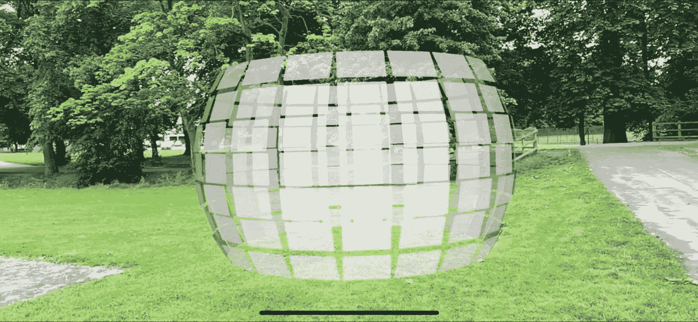

# 六、约束

在节点上使用约束允许我们以某种方式约束它们的行为。使用它们，您可以使节点，例如，总是面对摄像机或总是面对另一个节点，如果你愿意。

## 广告牌约束

我推测这种效应是以你作为一名汽车乘客在路过广告牌时看着它的经历命名的。

如果将该约束应用于节点，它将始终面向摄影机。如果你想知道为什么你可能需要它，想象一下如果你有一个标志或标签提供你想让用户总是能够看到的信息。这将是`SCNBillboardConstraint`的一个很好的用例。从清单 [6-1](#PC1) 中可以看出，向节点添加约束非常简单。

```cs
var rootNode = new SCNNode
{
    Geometry = CreateGeometry(),
    Constraints = new[] { new SCNBillboardConstraint() }
};

Listing 6-1Have a node always face the camera using a SCNBillboardConstraint

```

## 动画

`LookAtConstraint`在某些方面与`BillboardConstraint`相似；然而，这个约束告诉节点总是看着(面对)一个特定的节点。

之前，我已经用这个让一些周围的节点“看着”一个中心不可见的节点，效果很好，如图 [6-1](#Fig1) 所示。



图 6-1

您可以使用 LookAtConstraints 来指向节点以查看其他节点

这个效果是使用清单 [6-2](#PC2) 中所示的代码实现的。

```cs
var lookAtConstraint = SCNLookAtConstraint.Create(targetNode);
lookAtConstraint.GimbalLockEnabled = true;
imagePlaneNode.Constraints = new SCNConstraint[]
{
   lookAtConstraint
};

Listing 6-2Use “SCNLookAtConstraint” to make nodes always face another node

```

如果相机旋转，使用`GimbalLockEnabled=true`停止节点水平旋转。

## 其他约束

我们可以从 SceneKit 中使用许多其他更高级的约束；然而，它们超出了本入门书的范围。它们包括

*   SCNOrientationConstraint

*   SCNTransformConstraint

*   约束条件

*   scnavoidoccluderconstrait

*   SCNAccelerationConstraint

*   SCNSliderConstraint

*   SCNReplicatorConstraint

*   SCNIKConstraint

## 要尝试的事情

**玩 LookAtConstraint** 。在世界原点放置一个没有几何体(因此不可见)的节点。将多个 2D 平面添加到其节点设置为查看世界原点节点的场景中。

**玩广告牌约束**。将多个 2D 平面添加到其节点有一个`SCNBillboardConstraint`的场景中，并注意它们如何总是面向相机。

## 摘要

`SCNBillboardConstraint`和`SCNLookAtConstraint`约束是约束节点行为的有效方法，特别有用，因为它们意味着你不需要使用复杂的数学来计算达到相同效果所需的精确角度。

在下一章中，我们将看一下照明，乍看之下，它似乎并不那么重要，但如果不考虑到你的 AR 体验，它实际上可以使 AR 体验变得更好或更差。