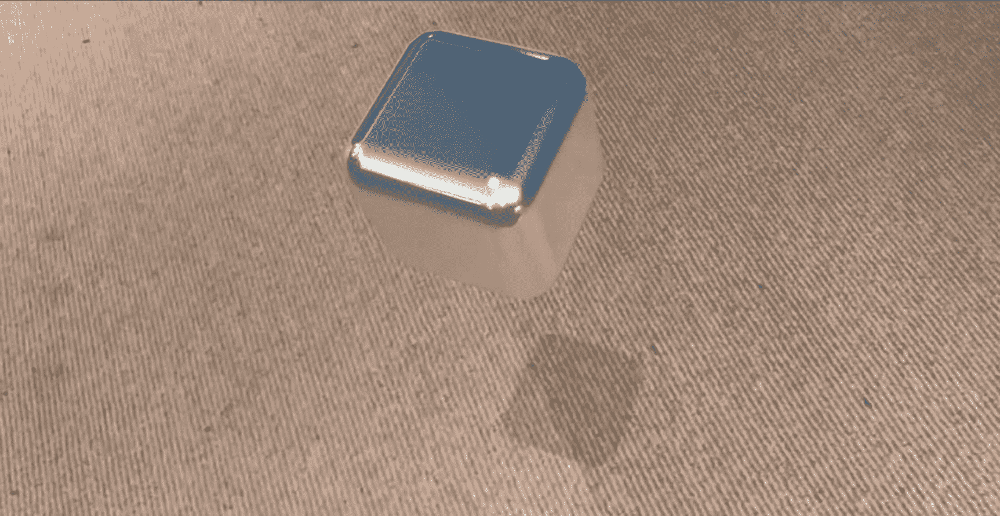

# 七、照明设备

事实证明，在让我们的 AR 场景看起来逼真的时候，照明是极其重要的。例如，如果是一个明亮的日子，但我们在场景中放置了一个黑暗的物体，它看起来非常人工；反过来，同样的道理也适用于将一个非常亮的物体放在黑暗的环境中。因此，在可能的情况下，我们希望在场景中考虑真实世界的光照条件。

创建逼真的 AR 体验的另一个考虑因素是阴影。

如果在场景中将对象放置在光源(如太阳)和表面(如地板)之间，您的大脑会看到阴影。我们可以创建这些假阴影，使我们的场景看起来像在现实世界中一样。

## 自动添加默认照明

默认情况下，当`ARSCNView.AutoenablesDefaultLighting`的默认值为真时，“默认”照明会添加到场景视图中。这将在场景中放置一个全向光源，指向与相机相同的方向。这对于您最初的 AR 创建来说可能是好的，但是如果您想要对特定的照明实例进行更多的控制，您可能希望通过设置`AutoenablesDefaultLighting=false`来关闭它。

## 自动更新默认照明

我们可以使用`ARSCNView.AutomaticallyUpdatesLighting`属性将默认照明添加到试图模拟真实世界照明条件的场景中。因此，如果真实世界的光照发生变化，人造光也会发生变化。同样，这在默认情况下是正确的，如果你希望对场景中的照明有更多的控制，你可以设置`AutomaticallyUpdatesLighting=false`，如清单 [7-1](#PC1) 所示。

```cs
public ViewController(IntPtr handle) : base(handle)
{
     this.sceneView = new ARSCNView
     {
          AutoenablesDefaultLighting = false,
          AutomaticallyUpdatesLighting = false
     };

     this.View.AddSubview(this.sceneView);
}

Listing 7-1A default light source is added to the scene, but you can turn it off if you want to have more control/add your own light sources

```

## 灯光类型

除了完全依赖默认照明，还可以通过向`SCNNode`添加一个`SCNLight`实例来在场景中放置一个或多个特定光源。

您可以使用以下不同类型的光源(`SCNLight.Type`):

*   **环境**–向各个方向均匀发光。

*   **方向性**–以均匀的强度向某个方向发射光线，因此其发射位置无关紧要。无论放在 10 厘米还是 1 米远的地方，看起来都一样。

*   泛光灯–类似于定向灯，但是它的位置可以决定光线的强度。如果光源的距离在场景中很重要，请使用此选项。

*   **聚光灯**–类似于泛光灯，但光的强度逐渐减弱，形成一个光锥。

在现实世界中，光线从多个表面反射，照亮一个区域。我们能模仿的最接近的方法是添加一个`Ambient`光源。那么为了更好的表现一些实际的光源，我们可以使用`Directional`灯。因此，向场景中添加多种类型的光源并不罕见。

清单 [7-2](#PC2) 中的例子显示了一个平行光被添加到一个`SCNNode`中，并指向正下方，有效地照亮了放置在它下面的任何节点的顶部。

```cs
var light = SCNLight.Create();
light.LightType = SCNLightType.Directional;
light.Intensity = 2000f;
light.ShadowColor = UIColor.Black.ColorWithAlpha(0.5f);
light.ShadowRadius = 4;
light.ShadowSampleCount = 4;
light.CastsShadow = true;

var lightNode = new SCNNode();
lightNode.Light = light;
lightNode.EulerAngles = new SCNVector3((float)-Math.PI / 2, 0, 0);

Listing 7-2You create a light source and add it to a SCNNode

```

Note

如果场景中唯一的虚拟光源是平行光，任何平行于光源方向的表面都将是黑色的。

如果我们愿意，我们可以做一些聪明的事情，将这种光放置在场景中的其他节点上，大致模拟太阳，并在地面上的平面上投射阴影，如下一节所示。

## 添加阴影

让你的物体看起来像在场景中投射阴影一样简单，只需在物体上方添加一个光源(`SCNLight`)并在物体下方添加一个透明平面，作为阴影投射的表面，如图 [7-1](#Fig1) 所示。



图 7-1

由虚拟光源投射在虚拟立方体下面的虚拟平面上显示的虚拟阴影

有阴影和没有阴影的体验相差十万八千里。没有阴影，虚拟立方体看起来仍然存在于场景中，但是我们了解它的位置以及它离地面有多高的唯一方法是四处移动。然而，包括阴影在内会立即给我们一个更清晰的指示，告诉我们立方体的位置和它离地面的高度。

在清单 [7-3](#PC3) 中，因为我们想要包含平面检测，所以我们使用了一个`ARSCNViewDelegate`，这一次，我们将让我们的 ViewController 实现它，并将我们的场景视图委托设置为类本身(`this`)。

在`ViewDidAppear`中，我们在`ARWorldTrackingConfiguration`中启用水平面检测。我们也在创建一个平行光的实例，设置它的属性，比如强度、方向等等，然后创建一个`SCNNode`来*保持*光线，然后将包含光线的节点放置在场景中。

然后，我们创建一个立方体形状的物体，并将其添加到场景中，确保将它放置在灯光节点的下方。

然后在`DidUpdateNode`方法中，我们确保探测到的飞机的光照模型的材质是`SCNLightingModel.ShadowOnly`，有效地使它对除了投射阴影之外的所有物体透明。

```cs
public partial class ViewController : UIViewController, IARSCNViewDelegate
    {
        private readonly ARSCNView sceneView;

        public ViewController(IntPtr handle) : base(handle)
        {
            this.sceneView = new ARSCNView
            {
                AutoenablesDefaultLighting = true,
                AutomaticallyUpdatesLighting = true,
                Delegate = this
            };

            this.View.AddSubview(this.sceneView);
        }

        public override void ViewDidLoad()
        {
            base.ViewDidLoad();
            this.sceneView.Frame = this.View.Frame;
        }

        public override void ViewDidAppear(bool animated)
        {
            base.ViewDidAppear(animated);

            var configuration
               = new ARWorldTrackingConfiguration
            {
                AutoFocusEnabled = true,
                PlaneDetection = ARPlaneDetection.Horizontal,
                LightEstimationEnabled = true,
                WorldAlignment = ARWorldAlignment.Gravity,
                EnvironmentTexturing =
                   AREnvironmentTexturing.Automatic
            };

            this.sceneView.Session.Run(configuration);

            var light = SCNLight.Create();
            light.LightType = SCNLightType.Directional;
            light.Intensity = 2000f;
            light.ShadowColor =
               UIColor.Black.ColorWithAlpha(0.5f);
            light.ShadowRadius = 4;
            light.ShadowSampleCount = 4;
            light.CastsShadow = true;

            var lightNode = new SCNNode();
            lightNode.Light = light;
            lightNode.EulerAngles

               = new SCNVector3((float)-Math.PI / 2, 0, 0);

            var cube = SCNBox.Create(0.1f, 0.1f, 0.1f, 0.02f);
            var metal = SCNMaterial.Create();
            metal.LightingModelName =
               SCNLightingModel.PhysicallyBased;
            metal.Roughness.Contents = new NSNumber(0.1);
            metal.Metalness.Contents = new NSNumber(1);
            cube.FirstMaterial = metal;

            var cubeNode = new SCNNode();
            cubeNode.Geometry = cube;
            cubeNode.CastsShadow = true;

       this.sceneView.Scene.RootNode
          .AddChildNode(lightNode);

       this.sceneView.Scene.RootNode
          .AddChildNode(cubeNode);
        }

        [Export("renderer:didUpdateNode:forAnchor:")]
        public void DidUpdateNode(ISCNSceneRenderer renderer,
           SCNNode node, ARAnchor anchor)
        {
            if (anchor is ARPlaneAnchor planeAnchor)
            {
                var plane =
                  ARSCNPlaneGeometry.Create(sceneView.Device);
                plane.Update(planeAnchor.Geometry);
                plane.FirstMaterial.LightingModelName =
                  SCNLightingModel.ShadowOnly;
                node.Geometry = plane;
                node.CastsShadow = false;
            }
        }
    }

Listing 7-3If you add a light source above other nodes in a scene, you can make them all cast a shadow, making the scene look more realistic

```

确保如果你在你的 ViewController 类上使用`IARSCNViewDelegate`而不是一个单独的类，你用`[Export("renderer:didUpdateNode:forAnchor:")]`来修饰`DidUpdateNode`方法，如清单 [7-3](#PC3) 所示。这很容易忘记，因为我有很多次，想知道为什么我的影子没有出现。

Note

如果看不到任何阴影，请确保场景中的节点的`CastsShadow`属性设置为`true`。

## 要尝试的事情

**尝试不同的光源类型和照明特性。**

尝试添加不同的光源到你的场景中(以及一些不同形状的节点),看看它们对它们有什么影响。尝试不同的光线强度和方向。尝试启用和禁用默认自动照明，以查看场景的效果。

**投下阴影。**

确保你能得到一个投射阴影的例子，最好是有多个物体，投射多个阴影，因为阴影确实能让场景看起来更真实。

## 摘要

虽然你可以创建增强现实体验而不考虑照明，事实上让 ARKit 甚至为你的场景添加默认照明，为了获得更真实的体验，你会想要自己手动控制场景中的照明。在指向不同方向的不同位置使用不同强度的不同类型的灯具。

正如我们所见，添加人工阴影为我们的体验增加了额外的可信度，因为我们希望现实世界中的物体能够投射阴影，所以让我们的虚拟物体在可能的情况下投射阴影是有意义的。

在下一章中，我们将会看到更多让用户参与到我们的体验中的方法，这次是使用视频和声音。