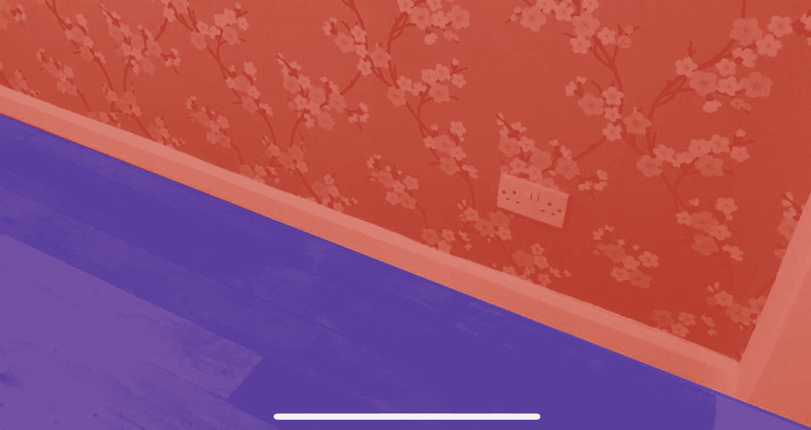
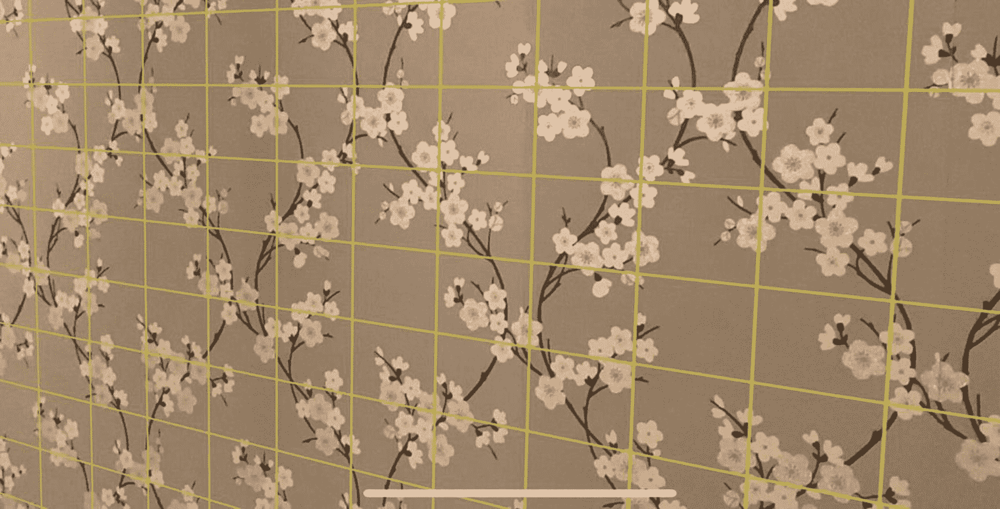

# 九、平面检测

检测表面(如地板、墙壁和表面)的能力非常重要，因为这些决定了我们场景环境的约束，也使我们能够在其上放置东西。

这种 AR 功能的商业应用很有趣。一些企业已经使用它来检测墙壁，并将墙纸或图片等产品放在墙上，让客户在购买前预览家中的物品。

## 探测飞机

可以将平面检测设置为仅检测水平、垂直或水平和垂直平面。

在平面检测期间，随着相机四处移动并检测其环境的更多部分，它可以检测新的平面或更新其对已经检测到的平面的理解。

当检测到一个新的平面时，一个`ARPlaneAnchor`被放置在检测到的位置。该锚点保存有关检测到的平面的详细信息，如其类型(水平或垂直)、位置、方向、宽度和长度，并自动赋予一个唯一的 ID，以便与其他平面区分开来。

请记住，低光照条件和无特色或反射表面将阻碍 ARKit 探测飞机的能力。例如，ARKit 将很难检测到普通的白墙或灯光昏暗的房间中的墙壁。

## 记住飞机

在你的应用中跟踪探测到的飞机通常是需要的和有用的。在清单 [9-2](#PC2) 以及检测平面的代码中，您将看到将检测到的平面存储在一个变量中的代码，以便于以后检索。

## ARSCNViewDelegate(场景视图代理)

一般来说，创建一个专用的类(`ARSCNViewDelegate`的实例)来处理当不同的锚点被检测到并放置在场景中时触发的事件，例如，当平面、图像或人脸被检测到时。我们将在关于平面和图像检测以及面部跟踪的章节中进一步讨论这一点。

因此，为了启用平面检测，您需要设置您的场景视图的场景视图委托，如清单 [9-1](#PC1) 和 [9-2](#PC2) 所示。

```cs
public ViewController(IntPtr handle) : base(handle)
{
    this.sceneView = new ARSCNView
    {
        AutoenablesDefaultLighting = true,
        Delegate = new SceneViewDelegate()
    };

    this.View.AddSubview(this.sceneView);
}

Listing 9-1Setting a Delegate for the ARSCNView

```

Note

不使用单独的类作为场景视图委托，可以让 ViewController 类实现`IARSCNViewDelegate`并将委托设置为`this`(本身)。

```cs
public class SceneViewDelegate : ARSCNViewDelegate
{
    private readonly IDictionary<NSUuid, PlaneNode> planeNodes = new Dictionary<NSUuid, PlaneNode>();

    public override void DidAddNode(
       ISCNSceneRenderer renderer,
        SCNNode node, ARAnchor anchor)
    {
        if (anchor is ARPlaneAnchor planeAnchor)
        {
            UIColor colour;

            if(planeAnchor.Alignment == ARPlaneAnchorAlignment.Vertical) {
                colour = UIColor.Red;
            }
            else {
                colour = UIColor.Blue;
            }

            var planeNode = new PlaneNode(
               planeAnchor, colour);

            var angle = (float)(-Math.PI / 2);
            planeNode.EulerAngles
               = new SCNVector3(angle, 0, 0);

            node.AddChildNode(planeNode);
            this.planeNodes.Add(anchor.Identifier, planeNode);
        }
    }

    public override void DidRemoveNode(
       ISCNSceneRenderer renderer, SCNNode node,
       ARAnchor anchor)
    {
        if (anchor is ARPlaneAnchor planeAnchor) {
            this.planeNodes[anchor.Identifier].RemoveFromParentNode();
            this.planeNodes.Remove(anchor.Identifier);
        }
    }

    public override void DidUpdateNode(ISCNSceneRenderer renderer,
        SCNNode node, ARAnchor anchor)
    {
        if (anchor is ARPlaneAnchor planeAnchor) {
           this.planeNodes[anchor.Identifier]
              .Update(planeAnchor);
        }
    }
}

Listing 9-2The instance of ARSCNViewDelegate will detect and respond to events that are fired when new planes are detected or existing planes are updated

```

当在场景中检测到一个新的平面时，触发`DidAddNode`方法(并且相应的`ARPlaneAnchor`被添加到场景中)。当 ARKit 对现有探测平面的理解改变时,`DidUpdateNode`方法启动。就是平面比原来想象的要大，或者朝向不一样。我们可以向这些方法中的任何一个添加我们自己的定制代码，用这些信息做一些有趣的事情。

## 平面检测示例

清单 [9-3](#PC3) 中显示了一个 ViewController 类的例子，它检测平面并根据平面是水平还是垂直在检测到的位置放置一个蓝色或红色的`SCNPlane`。

```cs
    public partial class ViewController : UIViewController
    {
        private readonly ARSCNView sceneView;

        public ViewController(IntPtr handle) : base(handle)
        {
            this.sceneView = new ARSCNView
            {
                AutoenablesDefaultLighting = true,
                Delegate = new SceneViewDelegate()
            };

            this.View.AddSubview(this.sceneView);
        }

        public override void ViewDidLoad()
        {
            base.ViewDidLoad();
            this.sceneView.Frame = this.View.Frame;
        }

        public override void ViewDidAppear(bool animated)
        {
            base.ViewDidAppear(animated);

            this.sceneView.Session.Run(new ARWorldTrackingConfiguration

            {
                PlaneDetection = ARPlaneDetection.Horizontal | ARPlaneDetection.Vertical,
                LightEstimationEnabled = true,
                WorldAlignment = ARWorldAlignment.GravityAndHeading
            }, ARSessionRunOptions.ResetTracking | ARSessionRunOptions.RemoveExistingAnchors);
        }

        public override void ViewDidDisappear(bool animated)
        {
            base.ViewDidDisappear(animated);
            this.sceneView.Session.Pause();
        }
    }

internal class PlaneNode : SCNNode
    {
        private readonly SCNPlane planeGeometry;

        public PlaneNode(ARPlaneAnchor planeAnchor, UIColor colour)
        {
            Geometry = (planeGeometry = CreateGeometry(planeAnchor, colour));
        }

        public void Update(ARPlaneAnchor planeAnchor)
        {
            planeGeometry.Width = planeAnchor.Extent.X;
            planeGeometry.Height = planeAnchor.Extent.Z;

            Position = new SCNVector3(
                planeAnchor.Center.X,
                planeAnchor.Center.Y,
                planeAnchor.Center.Z);
        }

        private static SCNPlane CreateGeometry(ARPlaneAnchor planeAnchor, UIColor colour)
        {
            var material = new SCNMaterial();
            material.Diffuse.Contents = colour;
            material.DoubleSided = true;
            material.Transparency = 0.8f;

            var geometry = SCNPlane.Create(planeAnchor.Extent.X, planeAnchor.Extent.Z);
            geometry.Materials = new[] { material };

            return geometry;
        }
    }

public class SceneViewDelegate : ARSCNViewDelegate
    {
        private readonly IDictionary<NSUuid, PlaneNode> planeNodes = new Dictionary<NSUuid, PlaneNode>();

        public override void DidAddNode(
           ISCNSceneRenderer renderer, SCNNode node,
           ARAnchor anchor)
        {
            if (anchor is ARPlaneAnchor planeAnchor)
            {
                UIColor colour;

                if(planeAnchor.Alignment == ARPlaneAnchorAlignment.Vertical)
                {
                    colour = UIColor.Red;
                }
                else {
                    colour = UIColor.Blue;
                }

                var planeNode
                   = new PlaneNode(planeAnchor, colour);
                var angle = (float)(-Math.PI / 2);
                planeNode.EulerAngles
                   = new SCNVector3(angle, 0, 0);

                node.AddChildNode(planeNode);
                this.planeNodes.Add(anchor.Identifier, planeNode);
            }
        }

        public override void DidRemoveNode(
           ISCNSceneRenderer renderer, SCNNode node,
           ARAnchor anchor)
        {
            if (anchor is ARPlaneAnchor planeAnchor)
            {
                this.planeNodes[anchor.Identifier]
                   .RemoveFromParentNode();
                this.planeNodes.Remove(anchor.Identifier);
            }
        }

        public override void DidUpdateNode(
           ISCNSceneRenderer renderer, SCNNode node,
            ARAnchor anchor)
        {
            if (anchor is ARPlaneAnchor planeAnchor)
            {
               this.planeNodes[anchor.Identifier]
                  .Update(planeAnchor);
            }
        }
    }

Listing 9-3A full end-to-end example of plane detection

```

结果如图 [9-1](#Fig1) 所示。在地板与墙壁相接的地方，您可以看到检测到的垂直和水平平面的材质是如何分别变为红色和蓝色的。使用了不透明度，以便您仍然可以看到平面(墙或地板)。



图 9-1

区分检测到的水平面和垂直面

当然，正如第 [3](03.html) 章“节点、几何体、材质和锚点”中所讨论的，除了纯色，几何体材质也可以是图像。通过使用一个正方形的透明 PNG，并在被检测的平面上重复/平铺图像，可以很容易地实现如下图 [9-2](#Fig2) 所示的网格效果。



图 9-2

检测平面上使用的网格图像

### 关闭平面检测

平面检测可能是 CPU 密集型的；建议您一旦确定了想要的平面，就关闭平面检测，如清单 [9-4](#PC4) 所示。

这可以通过简单地调用现有 SceneView 会话上的`.Run()`方法来完成，这一次将`ARWorldTrackingConfiguration`的`PlaneDetection`设置为`ARPlaneDetection.None`。

```cs
...

// Turn off plane detection
var configuration = new ARWorldTrackingConfiguration
{
    PlaneDetection = ARPlaneDetection.None,
    LightEstimationEnabled = true,
};

this.sceneView.Session.Run(configuration, ARSessionRunOptions.None)

;

...

Listing 9-4It is recommended to turn off plane detection when no longer needed

```

### 可能的应用

平面检测已经被许多企业成功使用。一些主要的家具零售商在其应用中使用它来检测地板，以允许用户在他们的客厅中放置他们家具的 3D 模型。一些壁纸和油漆零售商使用它来允许他们应用的用户预览特定壁纸或油漆在他们墙上的样子。

如果我们想让我们的虚拟物体在真实的表面上投射虚拟的阴影，就像我们在第 [7](07.html) 章“照明”中看到的那样，能够检测场景中的平面也很有用

就像 AR 的许多方面一样，你只需要发挥你的想象力，你应该有希望能够快速识别许多可能的应用。

### 要尝试的事情

现在您已经了解了平面检测的理论，您可以尝试以下方法来以不同的方式使用该功能。

**识别检测到的垂直和水平平面，并在视觉上区分它们。**

将检测到的水平和垂直平面设置为您选择的颜色，并调整不透明度。

**使用在检测平面上有图像的材质。**

与其给你检测到的平面几何体一个纯色，不如给它一个图像作为材质。我见过一个(平铺的)透明网格图像，用来给探测到的飞机一个有趣的外观。

**关闭平面探测。**

当不再需要时，练习关闭平面检测。如前所述，它是密集的，在你充分探测到你的飞机后，通常你不需要探测更多。

**为您检测到的平面添加触摸交互。**

阅读完第 [12](12.html) 章“触摸手势和交互”后，回来给你检测到的平面添加触摸手势。可能改变它们的颜色或其他方面？

## 摘要

平面检测是一个需要理解的重要概念，因为它让你能够做许多有趣的事情，比如将物体放置在被检测的表面上。

继续我们 ARKit 内置检测能力的主题，在下一章，我们将看看图像检测，它允许我们识别场景中的预定义图像，并对它们做一些有趣的事情。