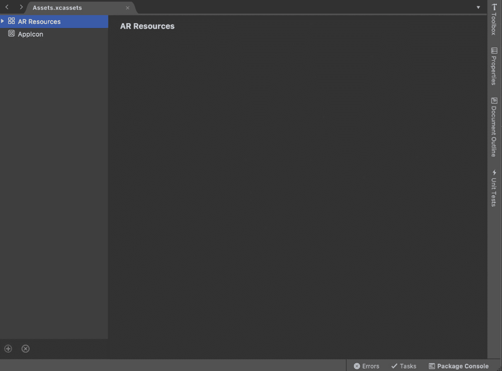
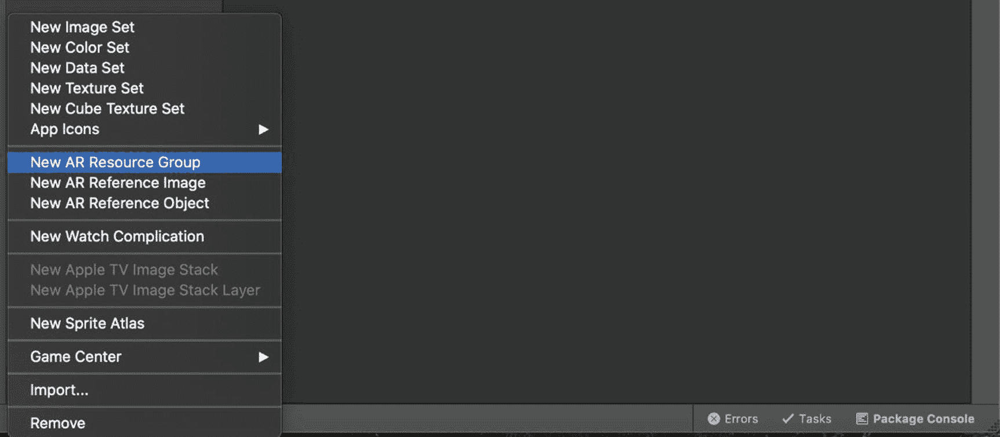
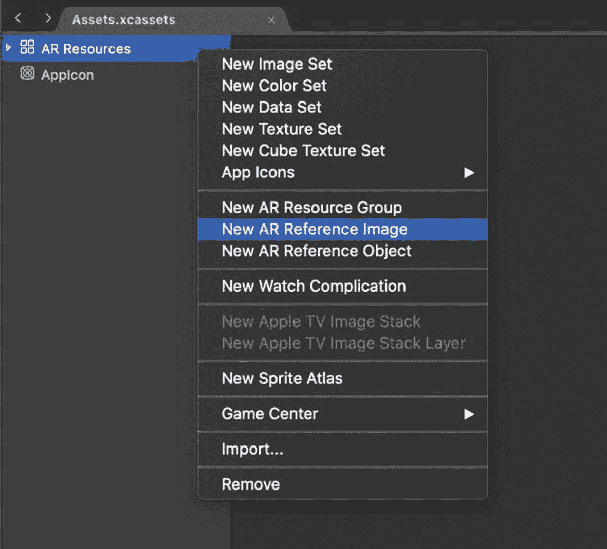
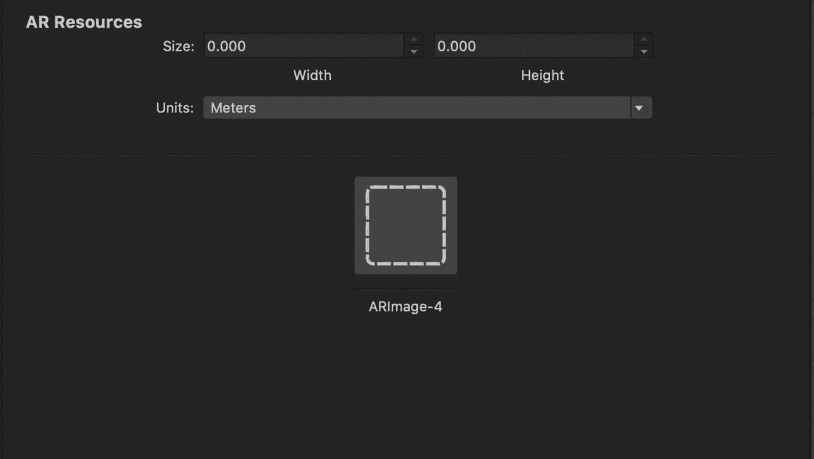
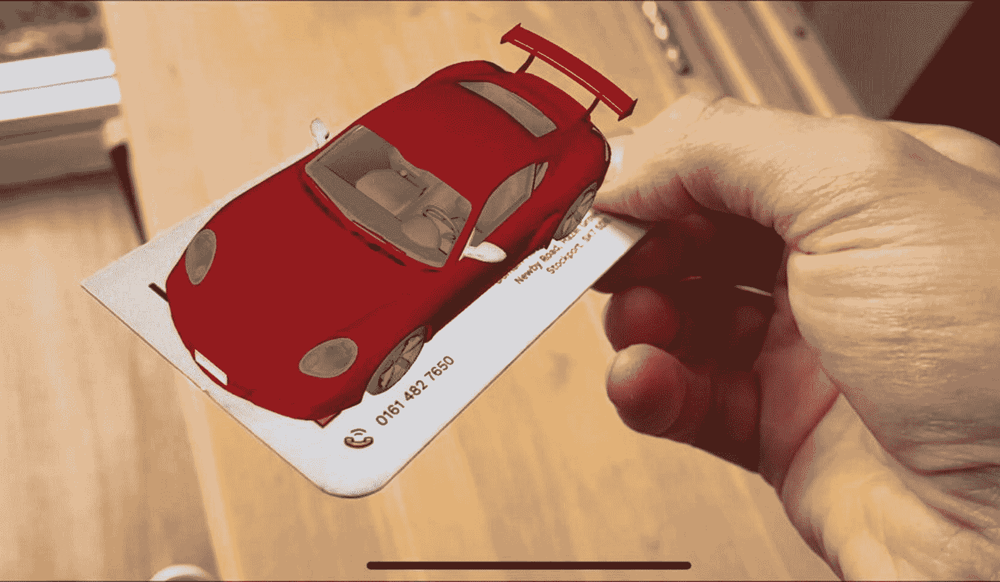

# 十、图像检测

图像检测是增强现实中最简单、有趣和有用的功能之一，ARKit 使它变得超级容易。

在这一章中，我们将看到如何使用 ARKit 来识别我们希望它检测的预定图像的位置。一旦我们确定了已识别图像的位置，我们就可以做额外的事情，如替换或添加它。以这种方式，图像通常被用作标记来识别 3D 空间中的位置。

## 将图像添加为应用资源

声明要检测的图像的一种方法是将它们与应用打包在一起。如果您在部署应用之前知道想要检测的图像，这将非常有用。

为此:

1.  Double-click the `Assets.xcassets` folder in Solution Explorer to see the following screen shown in Figure [10-1](#Fig1).

    

    图 10-1

    Assets.xcassets 文件夹

1.  Click the bottom right green plus icon to bring up the “add” context menu and select “New AR Resource Group” to add a new AR Resource Group as shown in Figure [10-2](#Fig2).

    

    图 10-2

    添加新的 AR 资源组

1.  Right-click the new AR Resource Group and choose “New AR Reference Image” as shown in Figure [10-3](#Fig3).

    

    图 10-3

    添加新的 AR 参考图像

1.  Choose the image, provide its dimensions, and optionally rename it as shown in Figure [10-4](#Fig4).

    

    图 10-4

    选择图像并提供尺寸

您在步骤 4 中指定的尺寸是图像在真实世界中显示的近似尺寸。您指定这些来帮助应用检测它。

### 检测图像

现在我们已经添加了我们想要在现实世界中检测的图像，我们需要编写代码来检测它们，并在我们的应用检测到它们时做一些有趣的事情。

正如你在清单 [10-1](#PC1) 的构造函数中看到的，我们告诉我们的场景视图使用场景视图委托。这个类可以在清单 [10-3](#PC3) 中看到，它有效地处理了图像检测事件。

```cs
public ViewController(IntPtr handle) : base(handle)
{
    this.sceneView = new ARSCNView
    {
        AutoenablesDefaultLighting = true,
        Delegate = new SceneViewDelegate()
    };

    this.View.AddSubview(this.sceneView);
}

Listing 10-1Setting a Scene View Delegate to use in the constructor

```

在清单 [10-2](#PC2) 中，我们正在检索之前添加到图 [10-4](#Fig4) 中“AR 资源 AR 参考组”的图像，并将它们设置为我们想要检测的图像。

```cs
public override void ViewDidAppear(bool animated)
{
    base.ViewDidAppear(animated);

    var detectionImages = ARReferenceImage.GetReferenceImagesInGroup("AR Resources", null);

    this.sceneView.Session.Run(new ARWorldTrackingConfiguration
    {
        LightEstimationEnabled = true,
        WorldAlignment = ARWorldAlignment.GravityAndHeading,
        DetectionImages = detectionImages,
        MaximumNumberOfTrackedImages = 1

    });
}

Listing 10-2Declaring which images we wish to detect in the scene

```

在清单 [10-3](#PC3) 中的 SceneViewDelegate 中，我们首先检查添加到场景中的锚点是否是一个`ARImageAnchor`。这将是我们的应用在相机视图中检测目标图像的结果。然后我们可以得到我们在图 [10-4](#Fig4) 中提供的参考图像的相应名称，这样我们就可以识别出*检测到了哪张*图像。

接下来，在本例中，我们要做的就是确定检测图像的尺寸，创建一个蓝色平面，并将其放置在检测图像的位置，有效地覆盖图像。

值得注意的是，一旦你在这个节点上放置了虚拟的东西，如果你改变了现实世界中检测到的图像的方向，你添加的平面的方向也会发生旋转。

这是一个非常酷的效果，显示了 ARKit 有多聪明；它能够识别检测到的图像的方向正在改变，并可以实时相应地改变虚拟节点的方向。

```cs
public class SceneViewDelegate : ARSCNViewDelegate
{
    public override void DidAddNode(
    ISCNSceneRenderer renderer, SCNNode node, ARAnchor anchor)
    {
        if (anchor is ARImageAnchor imageAnchor)
        {
            var detectedImage = imageAnchor.ReferenceImage;

            var width = detectedImage.PhysicalSize.Width;
            var length = detectedImage.PhysicalSize.Height;
            var planeNode = new PlaneNode(width, length, new SCNVector3(0, 0, 0), UIColor.Blue);

            float angle = (float)(-Math.PI / 2);
            planeNode.EulerAngles
               = new SCNVector3(angle, 0, 0);

            node.AddChildNode(planeNode);
        }
    }
}

Listing 10-3Scene View Delegate handles image detection events

```

在清单 [10-4](#PC4) 中，我们可以看到一个简单的类来封装我们在清单 [10-3](#PC3) 中使用的一个平面节点。

```cs
public class PlaneNode : SCNNode
{
    public PlaneNode(nfloat width, nfloat length,
       SCNVector3 position, UIColor colour)
    {
        var rootNode = new SCNNode
        {
            Geometry = CreateGeometry(width, length, colour),
            Position = position
        };

        AddChildNode(rootNode);
    }

    private static SCNGeometry CreateGeometry(
       nfloat width, nfloat length, UIColor colour)
    {
        var material = new SCNMaterial();
        material.Diffuse.Contents = colour;
        material.DoubleSided = false;

        var geometry = SCNPlane.Create(width, length);
        geometry.Materials = new[] { material };

        return geometry;
    }
}

Listing 10-4Our custom PlaneNode

```

### 动态添加要检测的图像

除了将您想要检测的图像与应用打包在一起之外，还可以在运行时动态添加要检测的图像。如果您不知道需要在编译时检测哪些图像，这尤其有用。

例如，您可以调用 Amazon API，返回畅销书籍封面的图像，并将这些图像添加到应用中进行检测。然后，当检测到那些书籍封面时，提供进一步的功能，例如在检测到的书籍旁边的 AR 中检索和显示评论信息。

### 要尝试的事情

既然您已经知道了如何检测场景中的预期图像，那么您可能希望尝试看看您可以使用该功能做些什么。这里有一些想法。

**用另一幅图像替换检测到的图像。**

检测到图像后，尝试将另一个图像放在检测到的图像上(显然是替换它)。

**用视频替换检测到的图像。**

检测到图像后，将视频放在检测到图像的位置并播放。参见第 [8](08.html) 章“视频和声音”，了解如何将视频添加到场景中。

**在检测到图像的位置放置一个 3D 模型。**

检测到图像后，在检测到图像的位置放置 3D 模型。参见第 [13](13.html) 章“3D 模型”，了解如何将 3D 模型添加到场景中。



图 10-5

将 3D 模型放置在检测到的图像上

图像检测可用于创建一些有趣的效果，如图 [10-5](#Fig5) 所示，其显示了放置在检测图像顶部的 3D 模型，以及图 [10-6](#Fig6) 所示，其显示了添加在检测图像顶部的浮动图像。


图 10-6

将浮动图像添加到检测到的图像

## 摘要

图像检测是增强现实中一个非常有用的功能，营销人员经常使用它来为他们的产品添加 AR 体验。

ARKit 的另一个惊人特性是，它不仅可以跟踪人脸，还可以跟踪面部表情。我们将在下一章“面部跟踪和表情检测”中探讨这个问题