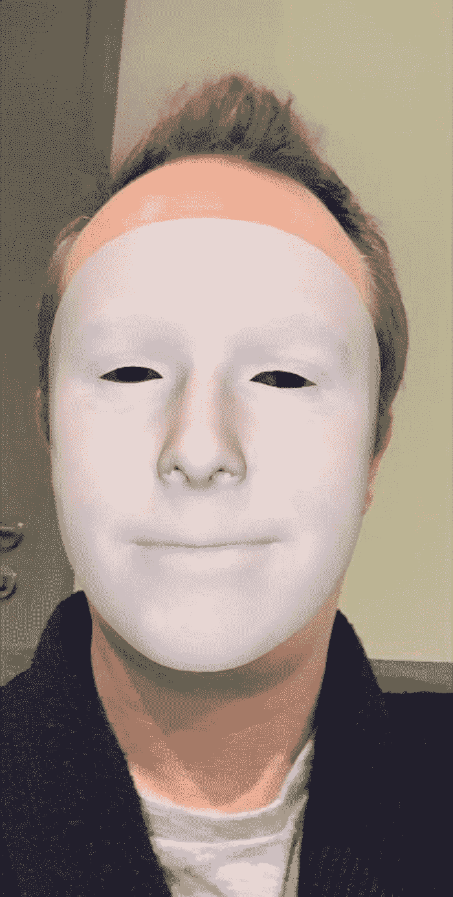
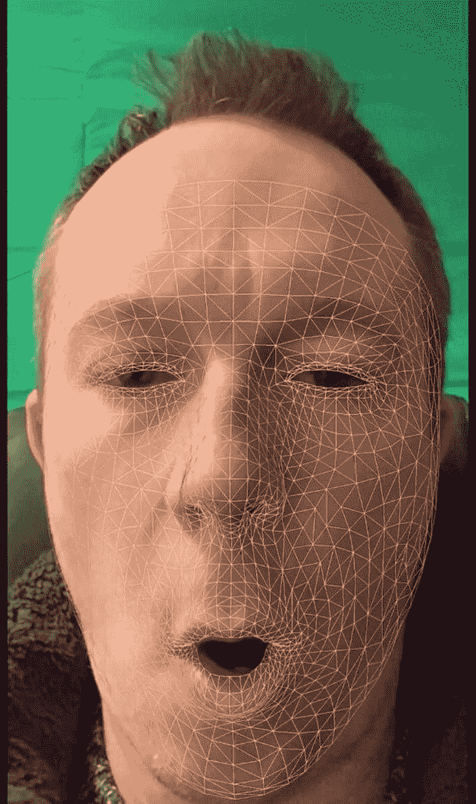

# 十一、人脸跟踪和表情检测

万一你认为 ARKit 提供的内置增强现实功能不够惊人，你不会相信你可以用面部跟踪和面部表情检测来做什么。通过使用前置摄像头，它可以跟踪多张脸，甚至是脸上的表情。

## 跟踪人脸

现成的 ARKit 让我们能够在一个场景中跟踪多达三张不同的脸。明确地说，这意味着检测人脸并在场景中跟随他们。

请注意，如果没有额外的编码，ARKit 无法识别这些面孔属于谁。ARKit 只能*检测到*有*在镜头前是*张脸，而不是*他们属于*谁。



图 11-1

一个场景中最多可以跟踪三个面，并且可以检索和操纵它们的几何体

值得注意的是，较旧的 iOS 设备可能不支持面部跟踪。建议您检查一下`ARFaceTrackingConfiguration`。`IsSupported`属性在尝试调用面部跟踪功能之前，如果您的设备不支持该功能，应用将在尝试调用该功能时崩溃并退出。如果不支持面部跟踪，您可能希望向用户显示一条消息，告诉他们这一点。

在清单 [11-1](#PC1) 中，我们正在运行我们的会话，这次使用的是`ARFaceTrackingConfiguration`，它默认使用手机上的前置摄像头，允许我们跟踪场景中的人脸，如图 [11-1](#Fig1) 所示。

然后，我们使用场景视图委托来处理当检测到、移动或更改人脸时触发的事件。更具体地说，在下面的代码示例中，当在场景中检测到一个新的面部时(在相关位置放置一个`ARFaceAnchor`)，我们将检索面部几何图形，并将其设置为放置在`ARFaceAnchor`位置的节点的几何图形，并将其设置为 80%不透明。

```cs
public partial class ViewController : UIViewController

{
    private readonly ARSCNView sceneView;

    public ViewController(IntPtr handle) : base(handle)
    {
        this.sceneView = new ARSCNView
        {
            AutoenablesDefaultLighting = true,
            Delegate = new SceneViewDelegate()
        };

        this.View.AddSubview(this.sceneView);
    }

    public override void ViewDidLoad()
    {
        base.ViewDidLoad();
        this.sceneView.Frame = this.View.Frame;
    }

    public override void ViewDidAppear(bool animated)
    {
        base.ViewDidAppear(animated);

        var faceTrackingConfiguration = new ARFaceTrackingConfiguration()
        {
                LightEstimationEnabled = true,
                MaximumNumberOfTrackedFaces = 1
        };

        this.sceneView.Session.Run(faceTrackingConfiguration);
    }

    public override void ViewDidDisappear(bool animated)
    {
        base.ViewDidDisappear(animated);
        this.sceneView.Session.Pause();
    }
}

public class SceneViewDelegate : ARSCNViewDelegate
{
    public override void DidAddNode(ISCNSceneRenderer renderer, SCNNode node, ARAnchor anchor)
    {
        if (anchor is ARFaceAnchor faceAnchor)
        {
            var faceGeometry = ARSCNFaceGeometry.Create(renderer.GetDevice());

            node.Geometry = faceGeometry;
            node.Opacity = 0.8f;
        }
    }

    public override void DidUpdateNode(ISCNSceneRenderer renderer, SCNNode node, ARAnchor anchor)
    {
        if (anchor is ARFaceAnchor)
        {
            var faceAnchor = anchor as ARFaceAnchor;
            var faceGeometry = node.Geometry as ARSCNFaceGeometry;
            faceGeometry.Update(faceAnchor.Geometry);
        }
    }
}

Listing 11-1Tracking people’s faces in the scene

```

如果我们愿意的话，我们可以用一张图片来代替面部几何图形，而不是使用平面纯色。例如，我们可以在某人的脸上放一张图片，让他们看起来像一个戴面具的超级英雄。

人们很容易怀疑这种功能在现实世界中的应用是否有用，而只是把它当成一种乐趣；然而，有一些成功的企业已经实施了这种类型的面部跟踪，并取得了很好的效果。例如，能够跟踪面部的方向，一些企业通过将不同风格的眼镜的 3D 模型添加到用户的面部几何形状上，来显示用户佩戴不同眼镜的样子。令人印象深刻的东西。

## 识别面部表情

除了跟踪场景中人脸的存在，我们还能够检测这些人脸上数量惊人的不同面部表情(事实上，超过 50 种不同的面部表情)。

在图 [11-2](#Fig2) 中，我使用了我们在第 [3](03.html) “节点、几何图形、材质和锚点”中首次提到的`material.FillMode = SCNFillMode.Lines`，默认颜色为白色，然后，当检测到*嘴部漏斗*时，将线条颜色改为黄色。



图 11-2

可以检测到 50 多种不同的面部表情

利用`SCNFillMode.Lines`，我们真的可以看到 ARKit 是如何检测人脸轮廓的。毫不奇怪，它可以推断出许多面部表情。

这里有一个完整的可检测面部表情列表(我告诉过你有很多):

*   左吊环，右吊环

*   左，右

*   eyeLookInLeft，eyeLookInRight

*   向左看，向右看

*   向上看，向上看

*   左眼睛，右眼睛

*   左睁大眼睛，右睁大眼睛

*   下巴向前

*   左颚，右颚

*   jawOpen

*   嘴巴闭上

*   漏斗嘴

*   噘嘴

*   向左，向右

*   嘴巴左，嘴巴右

*   左嘴巴，右嘴巴

*   左嘴巴，右嘴巴

*   左口拉伸，右口拉伸

*   下口辊，上口辊

*   口交怒视者，口交怒视者

*   口按左，口按右

*   左下下，右下下

*   左嘴巴，右嘴巴

*   浏览器左，浏览器右

*   浏览器升级

*   browOuterUpLeft

*   棕色直立

*   脸颊粉扑

*   左脸颊，右脸颊

*   鼻子左，鼻子右

*   伸出舌头

每个表情的描述可以在苹果官方文档这里找到: [`https://developer.apple.com/documentation/arkit/arfaceanchor/blendshapelocation`](https://developer.apple.com/documentation/arkit/arfaceanchor/blendshapelocation) 。

ARKit 甚至允许我们同时跟踪多个表情(例如，右眼闭上和舌头伸出)，以及跟踪这些表情的相对存在。例如，每个表达式都有一个介于 0 和 1 之间的浮点值，以表示该表达式完全不存在或完全存在，也就是说，跟踪舌头是完全不出来、有点出来还是完全不出来。

清单 [11-2](#PC2) 展示了当我们开始会话时，我们如何设置和使用 ARFaceTrackingConfiguration。

```cs
public partial class ViewController : UIViewController
{
    private readonly ARSCNView sceneView;

    public ViewController(IntPtr handle) : base(handle)
    {
        this.sceneView = new ARSCNView
        {
            AutoenablesDefaultLighting = true,
            Delegate = new SceneViewDelegate()
        };

        this.View.AddSubview(this.sceneView);
    }

    public override void ViewDidLoad()
    {
        base.ViewDidLoad();
        this.sceneView.Frame = this.View.Frame;
    }

    public override void ViewDidAppear(bool animated)
    {
        base.ViewDidAppear(animated);

        var faceTrackingConfiguration = new
           ARFaceTrackingConfiguration()
        {
            LightEstimationEnabled = true,
            MaximumNumberOfTrackedFaces = 1
        };

        this.sceneView.Session.Run(faceTrackingConfiguration);
    }

    public override void ViewDidDisappear(bool animated)
    {
        base.ViewDidDisappear(animated);
        this.sceneView.Session.Pause();
    }
}

public class SceneViewDelegate : ARSCNViewDelegate
{
    public override void DidAddNode(ISCNSceneRenderer renderer, SCNNode node, ARAnchor anchor)
    {
        if (anchor is ARFaceAnchor)
        {
            var faceGeometry = ARSCNFaceGeometry.Create(renderer.GetDevice());
            node.Geometry = faceGeometry;
            node.Geometry.FirstMaterial.FillMode =
               SCNFillMode.Lines;
        }
    }

    public override void DidUpdateNode(ISCNSceneRenderer renderer, SCNNode node, ARAnchor anchor)
    {
        if (anchor is ARFaceAnchor)
        {
            var faceAnchor = anchor as ARFaceAnchor;
            var faceGeometry = node.Geometry as
               ARSCNFaceGeometry;
            var expressionThreshold = 0.5f;

            faceGeometry.Update(faceAnchor.Geometry);

            if (faceAnchor.BlendShapes.EyeBlinkLeft > expressionThreshold
                || faceAnchor.BlendShapes.EyeBlinkRight > expressionThreshold)
            {
                ChangeFaceColour(node, UIColor.Blue);
                return;
            }

            if (faceAnchor.BlendShapes.MouthSmileLeft > expressionThreshold
                || faceAnchor.BlendShapes.MouthSmileRight > expressionThreshold)
            {
                ChangeFaceColour(node, UIColor.SystemPinkColor);
                return;
            }

            if (faceAnchor.BlendShapes.EyeLookOutLeft > expressionThreshold
                || faceAnchor.BlendShapes.EyeLookOutRight > expressionThreshold)
            {
                ChangeFaceColour(node, UIColor.Magenta);
                return;
            }

            if (faceAnchor.BlendShapes.TongueOut > expressionThreshold)
            {
                ChangeFaceColour(node, UIColor.Red);
                return;
            }

            if (faceAnchor.BlendShapes.CheekPuff > expressionThreshold)
            {
                ChangeFaceColour(node, UIColor.Orange);
                return;
            }

            ChangeFaceColour(node, UIColor.White);
        }
    }

    private void ChangeFaceColour(SCNNode faceGeometry, UIColor colour)
    {
        var material = new SCNMaterial();
        material.Diffuse.Contents = colour;
        material.FillMode = SCNFillMode.Lines;

        faceGeometry.Geometry.FirstMaterial = material;
    }
}

Listing 11-2Recognizing a few of the facial expressions

```

注意在清单 [11-2](#PC2) 中，我们使用`SCNFillMode.Lines`作为材质`FillMode`来更好地显示面部几何的轮廓。

## 要尝试的事情

向检测到的人脸添加新的节点和形状。

在 DidUpdateNode 方法中，为包含面部网格的节点创建并添加额外的节点(例如，形状或图像),例如，在某人的头上戴一顶基本的“帽子”,给他们留胡须，或显示包含此人信息的图像(在 2D 平面上)。

**区别对待不同的被跟踪人脸。**

如上所述，ARKit 可以同时跟踪多达三张脸。尝试为被跟踪的每张脸分配不同的颜色。

**使用图像作为面部材质。**

不要对检测到的面节点材质使用纯色，尝试对材质使用图像。有了正确的图像，你可以让用户的脸看起来像蜘蛛侠的面具或类似的东西。发挥你的想象力！

## 摘要

面部跟踪和面部表情检测允许我们通过在体验中涉及用户的面部来增强个性化。这种用例的范围可以从一点乐趣到预览可穿戴产品，这是增强现实应用的一个非常受欢迎的用例。

到目前为止，在本书中，我们已经看到了在场景中放置物品；在下一章中，当我们学习触摸手势和交互时，我们将看看我们如何与这些物体交互。