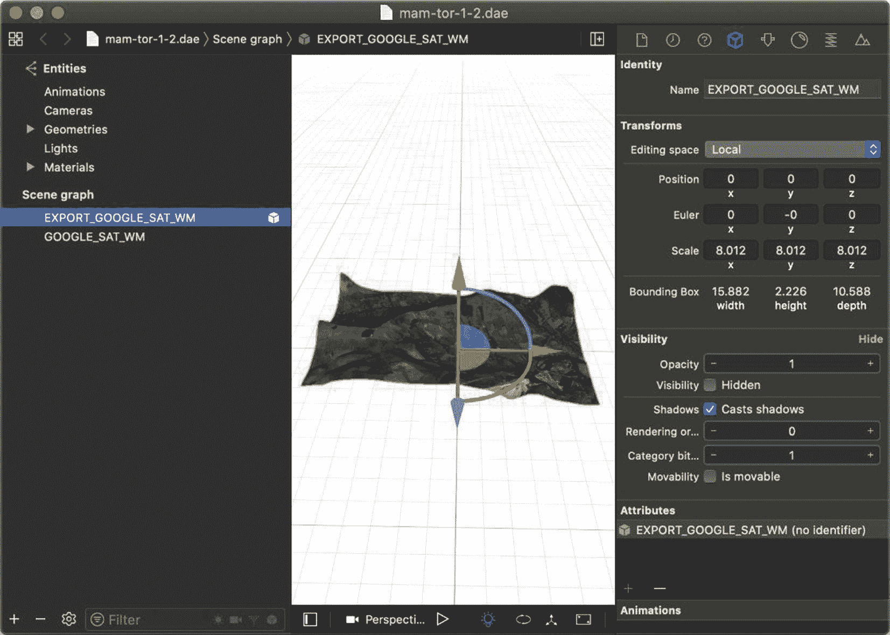
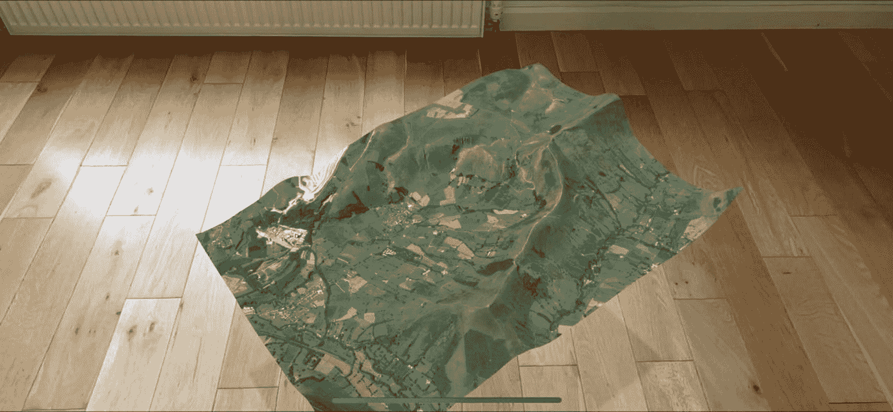

# 十三、三维模型

在这一章中，我们将看看如何在你的增强现实场景中使用现有的 3D 模型，并讨论流行的免费 3D 工具“Blender”以及如何使用它来创建你自己的 3D 模型。

我们已经看到，SceneKit 允许我们使用七八种不同的原始 3D 模型，如盒子、球体、圆柱体、平面等，但它们相当有限，也不令人兴奋。通过使用现有的 3D 模型，甚至创建我们自己的模型，我们可以使我们的增强现实体验更加令人印象深刻和迷人。

## 导入 3D 模型

幸运的是，很容易将现有的 3D 模型导入到场景中，并且 SceneKit/ARKit 支持几种 3D 文件格式。

我们的场景中可以使用以下 3D 模型格式:

*   。航空学博士（doctorofaeronautics 的缩写）

*   . usz

*   。美国农业部

*   。美元和。美国显示器联盟

*   。rcproject 和。现实

*   。obj 和。合并晶体管逻辑

*   。字母表

*   。使用

*   。标准模板库（Standard Template Library 的缩写）

*   。视交叉上核（Suprachiasmatic Nucleus 的缩写）

越来越多的网站和创作者专注于预制 3D 模型。我发现 free3d.com 是一个寻找免费和便宜的预制 3D 模型的好地方。

在清单 [13-1](#PC1) 中，我们可以看到将 3D 模型导入场景是多么简单。

值得注意的是，一旦 3D 模型作为`SCNNode`添加到场景中，它就像任何其他的`SCNNode`一样，因此我们可以更改它的位置、比例、方向、材质等等。事实上，有时导入的 3D 模型对于我们的场景来说太大了，所以我们需要在它们适合我们的场景之前改变节点的比例。

当然，你可以将我们在前面章节中提到的其他效果与你的 3D 模型结合起来。例如，您可以使用动画让 3D 模型缓慢旋转，或设置其不透明度，使其略微透明或淡入场景。

从文件中检索 3D 模型时，您必须记住的一件事是，您需要通过名称从文件中检索您希望检索的特定节点，如清单 [13-1](#PC1) 所示。幸运的是，Xcode 在确定你想要添加的节点名称时非常有用，如图 [13-1](#Fig1) 所示。



图 13-1

如果您不知道根节点的名称，Xcode 对于查找它非常有用

```cs
public override void ViewDidAppear(bool animated)
{
    base.ViewDidAppear(animated);

    this.sceneView.Session.Run(
       new ARWorldTrackingConfiguration());

    SCNScene sceneFromFile = SCNScene.FromFile(
        "art.scnassets/tree.dae");

    SCNNode model = sceneFromFile.RootNode.FindChildNode(
        childName:"SomeChildName", recursively: true);

    // How to scale or position the node model if needed
    model.Scale = new SCNVector3(0.2f, 0.2f, 0.2f);
    model.Position = new SCNVector3(0, -0.2f, 0);

    this.sceneView.Scene.RootNode.AddChildNode(model);
}

Listing 13-1Adding a 3D model to a scene

```

再次重申，如果您拥有 3D 模型文件，但不知道根节点的名称，那么如果您在 Xcode 中打开该文件，您应该能够在模型的各个部分周围单击，并导航场景图形以找到根节点名称。

## 在 Blender 中创建您自己的 3D 模型

如果你想在增强现实体验中创建自己的 3D 模型，我强烈建议你考虑学习如何使用一种叫做 Blender 的 3D 建模工具。这是我自己也在慢慢学习的东西。

首先，它是一个免费的工具，不仅功能强大，同时对于愿意花时间学习它的初学者来说也很容易使用，并且越来越受欢迎。事实上，许多电影工作室已经开始使用 Blender 来创建 3D 模型和效果，而不是使用昂贵的行业标准替代品。网上也有很多关于如何创建各种 3D 模型的教程，从甜甜圈到家具到城堡和汽车。

例如，如图 [13-2](#Fig2) 所示，使用 Blender 和一个名为“BlenderGIS”的插件，我们可以生成从谷歌地图返回的任何地形的 3D 模型，然后将其导出并在我们的 AR 体验中使用。



图 13-2

在我们的 AR 体验中使用 Blender 的 3D 模型会给人留下非常深刻的印象

你可以在图 [13-2](#Fig2) 中看到，这个例子也使用了阴影(来自第 [7 章](07.html)“照明”)来帮助用户理解它离地面有多高，让它看起来更真实。

Note

无论您是创建、导出和导入自己的 3D 模型，还是获取和使用预先制作的 3D 模型，如果该模型带有纹理(通常是一个或多个图像文件)，您都需要确保将其与 3D 模型一起打包。3D 模型文件通常会相对引用图像纹理文件的位置，因此它们通常需要存储在同一文件夹中，或者至少相对于 3D 模型文件所在的位置。

## 添加阴影，动画，并使互动

至此，我们已经介绍了一些可以与 3D 模型结合使用的其他概念。我们可以添加照明和阴影，使三维模型看起来更真实。我们可以使用动画来使 3D 模型更加动态。

## 要尝试的事情

你可以整天在你的增强现实场景中摆弄 3D 模型；然而，这里有一些你可以尝试的方法。

**将预先制作的 3D 模型添加到您的应用中。**

获取受支持的 3D 模型文件，将其添加到项目中，并将其放置在场景中。

在 Blender 中创建一个简单的模型，并在你的应用中使用它。

在 Blender 中创建一个基本模型；不一定要复杂。然后将其导出为支持的文件类型，添加到项目中，然后在场景中使用。

使用触摸手势与场景中的 3D 模型互动。

让您的 3D 模型响应第 [12](12.html) 章“触摸手势和交互”中讨论的触摸交互

向您的 3D 模型添加动画。

使用第 [5](05.html) 章“动画”中讨论的一些动画(动作)来制作场景中 3D 模型的比例、位置或不透明度的动画。

**使用带有图像检测的 3D 模型。**

尝试将 3D 模型添加到在场景中检测到的图像。您会注意到，如果您旋转检测到的图像的方向，3D 模型的方向也会发生类似的变化。

## 摘要

除了我们之前了解的基本 3D 形状，您现在应该知道如何在 AR 体验中添加和使用更复杂的 3D 模型。你可以获得预制的，甚至可以使用像 Blender 这样的 3D 建模工具来构建和使用你自己的。

现在我们的场景中有了各种各样的模型和形状，我们应该想办法让它们通过使用模拟物理来模拟彼此之间的交互以及它们的物理环境。如果你认为这听起来很复杂，不要担心。ARKit 有一些内置的物理能力，所以我们不必担心数学和复杂性，我们将在下一章“物理”中看到