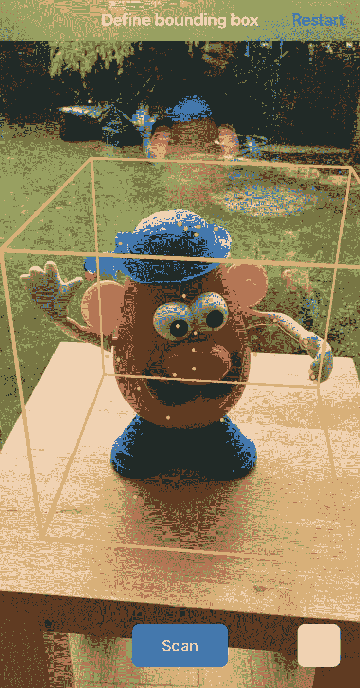
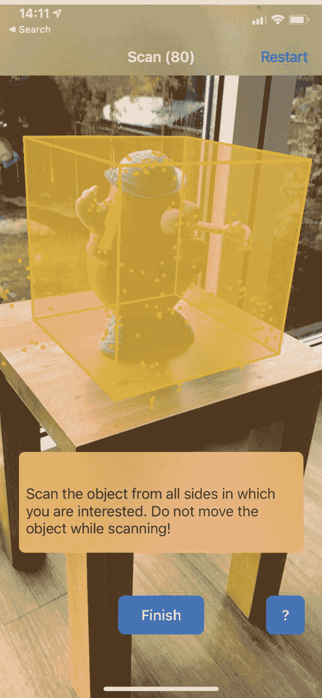
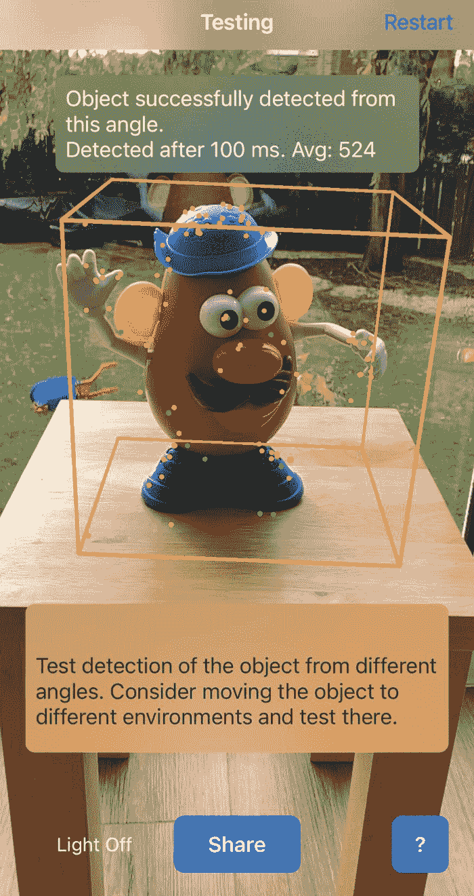

# 十五、目标检测

之前，在第 [10](10.html) 章“图像检测”中，我们讨论了如何让我们的 AR 移动应用在我们的场景中检测到预定义的 2D 图像时识别并做出响应。同样，我们可以让我们的应用响应预定义的 3D 对象。这是一个比 2D 图像识别更复杂的过程；然而，ARKit 使这成为可能。我们需要做的就是将功能整合在一起。

这个过程需要两个部分，第一部分是让用户能够使用应用扫描 3D 对象并存储其一些“空间数据”，第二部分是再次使用空间数据来检测场景中的对象。

虽然本章给出了这个概念的概述，但是演示这个概念所需的代码太长了，无法完整地包括进来。幸运的是，微软已经创建了一个开源的 Xamarin 身体检测样本应用，我们可以下载并试用。

本章中讨论和显示的示例应用和屏幕截图来自以下 Microsoft Xamarin.iOS 扫描应用示例:

[T2`https://docs.microsoft.com/en-us/samples/xamarin/ios-samples/ios12-scanninganddetecting3dobjects/`](https://docs.microsoft.com/en-us/samples/xamarin/ios-samples/ios12-scanninganddetecting3dobjects/)

## 扫描和保存对象空间数据

在扫描期间，会话使用了一个`ARObjectScanningConfiguration`配置实例，如清单 [15-1](#PC1) 所示。

```cs
var configuration = new ARObjectScanningConfiguration();
sceneView.Session.Run(configuration);

Listing 15-1Using ARObjectScanningConfiguration

```

运行示例应用时，您会看到在扫描阶段，一个边界框被用来表示我们希望扫描的 3D 对象应位于的区域，如图 [15-1](#Fig1) 所示。默认情况下，它会检测一个水平面，并将边界框的底部放在它的顶部。使用捏合和平移触摸手势可以增加边界框的大小和位置。



图 15-1

将边界框放置在要扫描的对象周围

如果您对 3D 对象位于边界框内感到满意，请按“扫描”按钮存储空间数据以备后用。在扫描过程中，该应用要求你在物体周围移动，以便从不同角度进行扫描和后续识别。这个从不同角度扫描的过程使得包围盒的壁变得坚固，如图 [15-2](#Fig2) 所示。当您对从足够多的不同角度扫描了对象感到满意时，请按“完成”。



图 15-2

从多个方向扫描物体

扫描完成后，扫描的对象将作为一个`ARReferenceObject`保存在应用中，供以后参考。

## 识别扫描的对象

为了识别场景中的 3D 对象，我们需要检索(或至少引用)之前扫描和保存的 3D 对象的空间数据，并使用它来允许应用检测任何与之匹配的对象。

当你准备好了，按下应用中的“测试”按钮，这将开始检测你在场景中扫描的 3D 对象。

如果在场景中检测到物体(使用清单 [15-2](#PC2) 中的代码)，应用会通知你并告诉你检测它花了多长时间(在我看来相当快)，如图 [15-3](#Fig3) 所示。

```cs
public override void DidAddNode(ISCNSceneRenderer renderer, SCNNode node, ARAnchor anchor)
{
    if (anchor != null && anchor is ARObjectAnchor)
    {
        var objectAnchor = anchor as ARObjectAnchor;
        if (objectAnchor.ReferenceObject == referenceObject)
        {
            // Successful detection, do something
        }
    }
}

Listing 15-2The code that fires when the object is detected

```

一旦成功检测到对象，我们可以做任何事情，我们可以显示如图 [15-3](#Fig3) 所示的消息，或者我们可以在检测到的对象上或旁边添加额外的节点。



图 15-3

成功检测到对象

### 要尝试的事情

这里有一些使用对象检测的想法。

**扫描并存储多个对象。**

看看你能否扫描和存储多个不同的对象。

**扫描产品，并在成功检测后检索/显示产品信息。**

扫描并保存产品(如毛绒玩具)的 3D 特征；然后，当检测到它时，在它旁边显示附加信息，如产品详细信息、描述、价格等。

扫描某人的头部，看看识别的准确度如何。

尝试扫描某人的头部，看看物体检测是否可以识别它。

看看你能扫描和探测多大/多小的物体。

尝试扫描非常小或非常大的对象，看看对象检测在处理非常小或非常大的对象时是否有约束。

**改变边框的颜色。**

尝试更改用于扫描和检测的边界框的颜色或其他方面。

## 摘要

ARKit 中内置的对象检测功能继续显示 ARKit 是多么多样和强大，并为我们之前看到的 2D 图像检测增加了另一个维度，打开了一系列有趣的用例。

继续在我们的场景中检测有趣的主题，在下一章，我们将看看身体检测，我们将看到 ARKit 如何确定一个人在场景中的位置和方向。