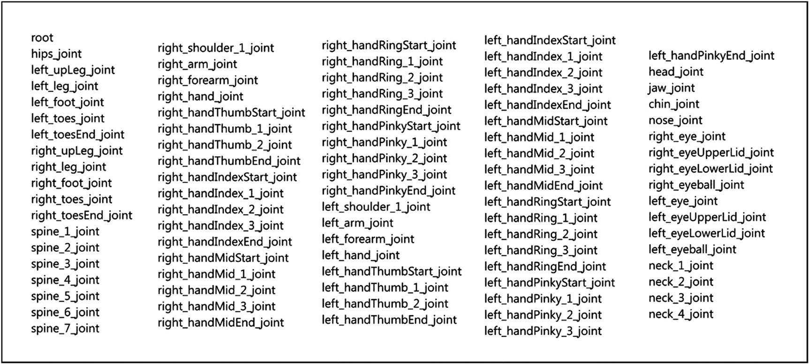
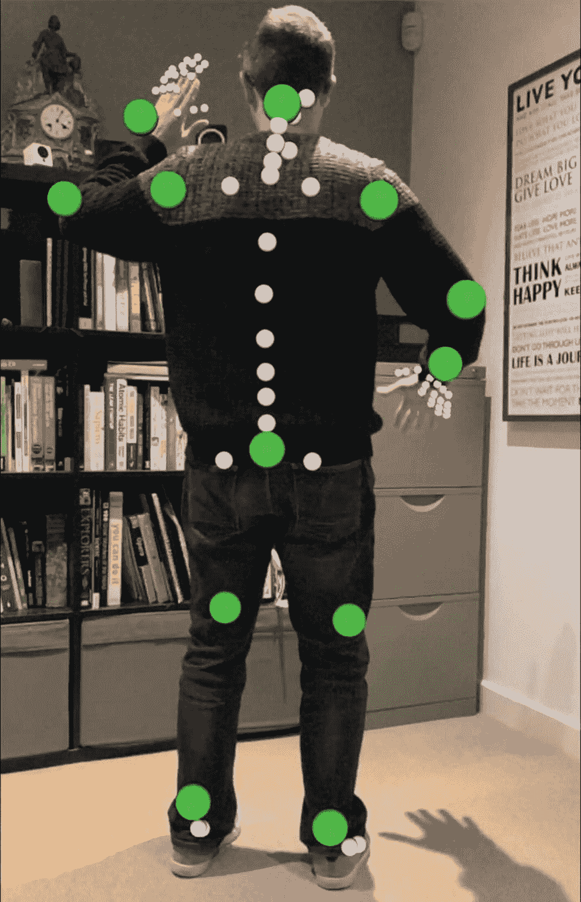
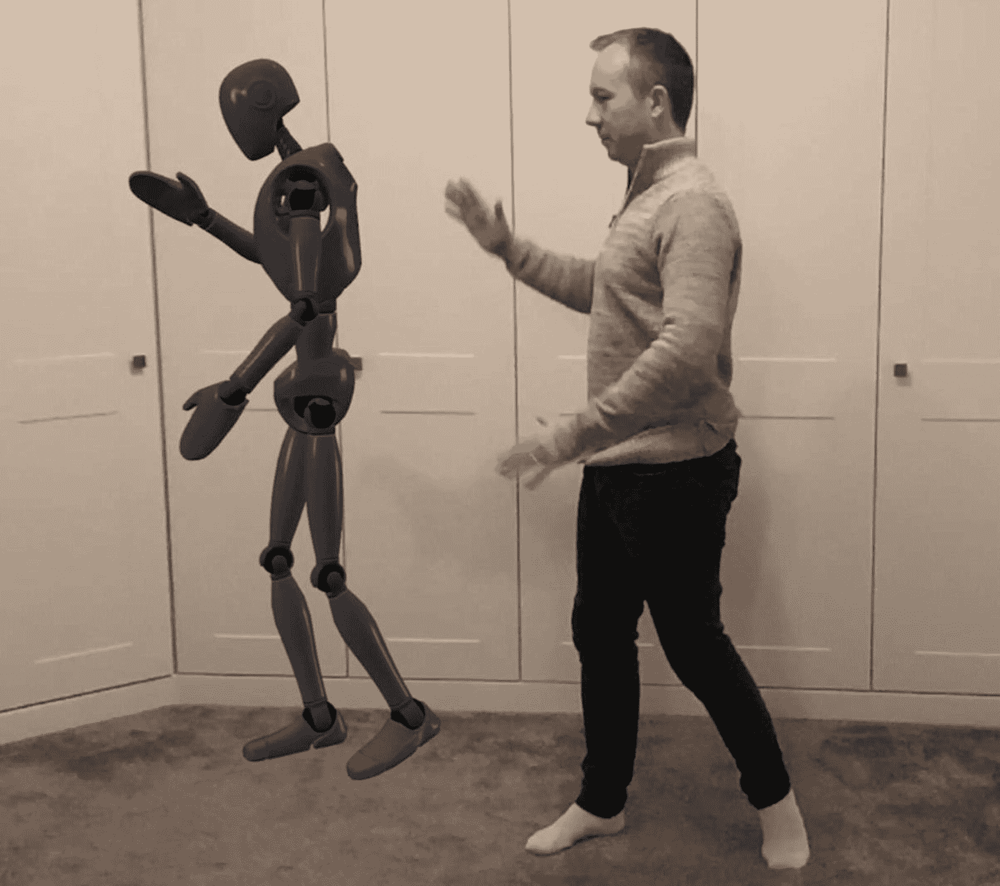

# 十六、身体跟踪

谈到人，以及我们在第 [11](11.html) 章“面部跟踪和表情检测”中看到的检测和跟踪面部，我们还可以使用 ARKit 实时检测场景中的身体，包括身体不同部位的方向。这被称为身体跟踪，它使我们能够不跟踪主要身体关节的位置，达到很高的精确度。

## 检测场景中的身体

我们将看看 ARKit 如何能够检测场景中人体及其各种关节的存在，然后将它们覆盖在 3D 空间中检测到的身体上。但是你问我们到底在追踪什么？

跟踪以下关节的位置:

*   根部(臀部中心)

*   头

*   左手

*   右手

*   勒弗福德

*   右脚

*   左肩膀

*   右肩

这些值来自枚举`ARSkeletonJointName`。

在被检测的`ARSkeleton3D`对象中可以引用许多其他关节(图 [16-1](#Fig1) 共显示 92 个)。但是，只跟踪前面的关节，因此其他关节是根据这些跟踪关节的位置推断出来的。

事实上，为了获得我们将迭代的所有 92 个联合名称的完整列表，我们将使用从调用`ARSkeletonDefinition.DefaultBody3DSkeletonDefinition.JointNames`返回的`string[]`。



图 16-1

组成一个骨骼的所有 92 个关节的名称

为了在我们的场景中启用身体跟踪，我们在运行 ARSession 时使用了一个`ARBodyTrackingConfiguration`，如清单 [16-1](#PC1) 所示。

Note

除了这些关节，如果我们愿意，我们还可以推断这些关节之间的路径，并绘制直线，从而创建一个骨骼的可视化。

```cs
public BodyDetectionViewController()
{
    this.sceneView = new ARSCNView
    {
        AutoenablesDefaultLighting = true,
        Delegate = new SceneViewDelegate()
    };

    this.View.AddSubview(this.sceneView);
}

...

public override void ViewDidAppear(bool animated)
{
    base.ViewDidAppear(animated);

    var bodyTrackingConfiguration
        = new ARBodyTrackingConfiguration()
    {
        WorldAlignment = ARWorldAlignment.Gravity

    };

    this.sceneView.Session.Run(bodyTrackingConfiguration);
}

Listing 16-1Using ARBodyTrackingConfiguration and declaring the SceneViewDelegate

```

当在场景中检测到尸体时，会在相关位置放置一个`ARBodyAnchor`。我们可以将我们的自定义代码添加到`ARSCNViewDelegate`上的`DidAddNode`和`DidUpdateNode`方法中，如清单 [16-2](#PC2) 所示。

正如你在清单 [16-2](#PC2) 中看到的，我们已经声明了一个从`SCNNode`继承而来的`JointNode`类来表示我们想要放置在场景中的关节节点。当我们在`DidAddNode`中检测到这些关节节点时，我们使用关节名称作为关键字将它们存储在字典中。当`DidUpdateNode`被解雇时，如果我们检测到他们的位置已经改变，我们就通过调用`.Update(SCNVector3 position)`来更新他们的位置。

我们有一个创建球体来表示关节的方法，叫做`MakeJoint(string jointName)`，这个方法非常简单，类似于我们之前看到的创建基本颜色形状的例子。

更复杂的方法`GetJointPosition(ARBodyAnchor bodyAnchor, string jointName)`是获取检测到的`ARBodyAnchor`并计算，然后返回 jointName 引用的关节的位置。它通过确定从身体锚点的根位置(始终是臀部的中心)偏移的请求关节来实现这一点。我们还使用了一个扩展方法，将一个`NMatrix4`转换成一个`SCNMatrix4`。

最终结果显示场景中有 92 个球体排列在与检测到的身体相同的方向上。这些球体的方向和位置随着被跟踪物体的方向和位置的实时变化而变化。

```cs
public class SceneViewDelegate : ARSCNViewDelegate
{
    Dictionary<string, JointNode> joints
       = new Dictionary<string, JointNode>();

        public override void DidAddNode(
           ISCNSceneRenderer renderer, SCNNode node,
           ARAnchor anchor)
        {
            if (!(anchor is ARBodyAnchor bodyAnchor))
                return;

            foreach (var jointName in ARSkeletonDefinition.DefaultBody3DSkeletonDefinition.JointNames)
            {
                JointNode jointNode = MakeJoint(jointName);

                var jointPosition = GetJointPosition(bodyAnchor, jointName);
                jointNode.Position = jointPosition;

                if (!joints.ContainsKey(jointName))
                {
                    node.AddChildNode(jointNode);
                    joints.Add(jointName, jointNode);
                }
            }
        }

        public override void DidUpdateNode(
           ISCNSceneRenderer renderer, SCNNode node,
              ARAnchor anchor)
        {
            if (!(anchor is ARBodyAnchor bodyAnchor))
                return;

            foreach (var jointName in ARSkeletonDefinition.DefaultBody3DSkeletonDefinition.JointNames)
            {
                var jointPosition = GetJointPosition(bodyAnchor, jointName);

                if (joints.ContainsKey(jointName))
                {
                    joints[jointName].Update(jointPosition);
                }
            }
        }

        private SCNVector3 GetJointPosition(
           ARBodyAnchor bodyAnchor, string jointName)
        {
            NMatrix4 jointTransform = bodyAnchor.Skeleton.GetModelTransform((NSString)jointName);
            return new SCNVector3(jointTransform.Column3);
        }

        private JointNode MakeJoint(string jointName)
        {
            var jointNode = new JointNode();

            var material = new SCNMaterial();
            material.Diffuse.Contents =
               GetJointColour(jointName);

            var jointGeometry =
               SCNSphere.Create(GetJointRadius(jointName));
            jointGeometry.FirstMaterial = material;
            jointNode.Geometry = jointGeometry;

            return jointNode;
        }

        private UIColor GetJointColour(string jointName)
        {
            switch (jointName)
            {
                case "root":
                case "left_foot_joint":
                case "right_foot_joint":
                case "left_leg_joint":
                case "right_leg_joint":
                case "left_hand_joint":
                case "right_hand_joint":
                case "left_arm_joint":
                case "right_arm_joint":
                case "left_forearm_joint":
                case "right_forearm_joint":
                case "head_joint":
                    return UIColor.Green;
            }

            return UIColor.White;
        }

        private float GetJointRadius(string jointName)
        {
            switch (jointName)
            {
                case "root":
                case "left_foot_joint":
                case "right_foot_joint":
                case "left_leg_joint":
                case "right_leg_joint":
                case "left_hand_joint":
                case "right_hand_joint":
                case "left_arm_joint":
                case "right_arm_joint":
                case "left_forearm_joint":
                case "right_forearm_joint":
                case "head_joint":
                    return 0.04f;
            }

            if (jointName.Contains("hand"))
                return 0.01f;

            return 0.02f;
        }
    }

public class JointNode : SCNNode
    {
        public void Update(SCNVector3 position)
        {
            this.Position = position;
        }
    }
}

Listing 16-2Detecting and updating body joint positions

```

结果如图 [16-2](#Fig2) 所示。被跟踪身体的主要关节被跟踪并显示为绿色球体，其他推断的次要关节显示为白色节点。

像往常一样，ARKit 在现实世界中跟踪事物的准确性取决于充足的照明。为了让 ARKit 有最好的机会跟踪场景中的尸体，请确保环境光线充足。



图 16-2

使用节点显示被跟踪实体的方向

## 捕捉身体动作

身体跟踪的一个用途是转换被跟踪身体的检测到的运动和位置，并在人形 3D 模型(称为装备)上模拟它们，以便如果您移动手臂，3D 模型的手臂也以相同的方式移动。这需要创建一个具有各种活动关节的 3D 模型，并将其导入到应用中，这超出了本书的范围，但可以在图 [16-3](#Fig3) 中看到。

要了解有关使用身体跟踪的模型装配的更多信息，请参见 Apple 的文档( [`https://developer.apple.com/documentation/arkit/rigging_a_model_for_motion_capture`](https://developer.apple.com/documentation/arkit/rigging_a_model_for_motion_capture) )。



图 16-3

身体跟踪示例的索具

## 潜在应用

因为我们可以检测主要关节的位置以及它们彼此之间的相对位置，所以我们可以推断场景中身体各个部分的角度。我见过这种技术用于自动检测用户坐在办公桌前时是否无精打采，以帮助防止脊椎受到不必要的压力，并帮助避免背痛。

能够检测重复的身体运动使身体检测成为跟踪俯卧撑和深蹲等运动的一种很好的方式。

## 要尝试的事情

这里有一些你可以在实施身体追踪时自己尝试的事情。

**改变代表关节的节点的颜色、大小和不透明度。**

尝试用不同的方式表示关节节点。

**添加触摸手势，帮助识别按压时的关节。**

使用你的触摸手势知识，这样当你触摸一个节点时，它会在屏幕上显示它的名称。

尝试装配一个 3D 模型来复制你的动作。

查找如何使用适当的 3D 骨架模型，并将其装配到被跟踪的身体上，使其模拟场景中身体的运动。

**向被跟踪的主体添加额外的节点。**

使用现成的几何形状、图像或 3D 模型的组合来将附加节点添加到被跟踪的身体。例如，你可以在头部节点的位置放置一个球形的表情头像。

**在关节间添加直线，打造骨架效果。**

当您知道主要关节和次要关节的位置和名称时，您可以尝试在它们之间创建线条(或细长的盒子/圆柱体)。

## 摘要

如果你已经做到了这一步，那么你现在可能已经知道如何利用 arKit 的大量增强现实功能，并能够做出一些相当出色的 AR 体验。

一旦你制作了你的杀手级 AR 应用，你可能希望通过应用商店与世界分享它，所以在下一章也是最后一章，我们将看看“发布到应用商店”