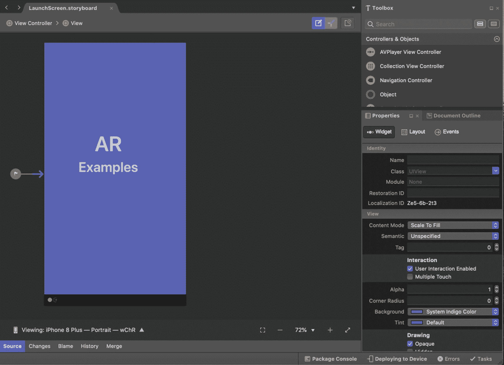

# 十七、发布到应用商店

正如一开始所承诺的，我们在本书中看到的一切都可以在没有苹果开发者帐户的情况下进行实验，并放入你的应用和部署到你的手机上。

也就是说，如果你创造的东西准备好与世界其他地方分享，你会想把它放在 App Store 里让其他人下载和安装。要做到这一点，你需要一个苹果开发者账户，你需要按照本章概述的步骤操作。

## App Store 提交待办事项列表

在这一章中，我们将介绍将您的应用放入 App Store 的过程。该过程由多个阶段组成:

*   为应用设置图标。

*   设置启动屏幕(可选)。

*   设置应用 ID 和授权。

*   创建并安装 App Store 预置描述文件。

*   更新内部版本配置。

*   构建您的应用并提交给 Apple。

## 为应用设置图标

因为您的应用的图标将在各种不同的地方使用，所以您需要提供几种不同大小的图标。

您的图标将以不同尺寸出现在以下位置:

*   应用商店

*   通知

*   设置

*   聚光灯

要提供不同大小的图标，打开`Assets.xcassets`并为 IconImage 资源提供图像。见图 [17-1](#Fig1) 。

图 17-1

为 Assets.xcassets 文件夹中的 AppIcon 资源提供图像

## 设置启动屏幕图像

应用的启动屏幕是在启动应用后立即看到的屏幕，但在您最初看到应用的主页之前，默认情况下它是一个空白的白色屏幕。幸运的是，如果你选择这样做，改变是非常容易的。这是我推荐的，因为它相对简单，可以帮助用户体验你的应用。

如上所述，你可以选择覆盖应用的默认空白启动屏幕(`LaunchScreen.storyboard`)。一旦你打开`LaunchScreen.storyboard`，你就可以改变它的背景颜色，给它添加标签和图像，如图 [17-2](#Fig2) 所示。如果您选择更改默认设置，当您的应用启动时，更新后的启动屏幕将显示在您的主应用之前。

图 17-2

您可以自定义应用的启动屏幕

## 设置应用 ID 和授权

在进一步操作之前，您需要为您的应用创建一个应用 ID。你可以在苹果开发者门户网站 [`https://developer.apple.com`](https://developer.apple.com) 上这样做，为了能够做到这一点，你需要一个苹果开发者账户，在撰写本文时这个账户的价格是 79 英镑。

此外，如果您还没有 Apple ID，您需要先在 [`https://appleid.apple.com/account`](https://appleid.apple.com/account) 创建一个。

当你登录你的苹果开发者账户时，你应该会看到如图 [17-3](#Fig3) 所示的页面。

图 17-3

您的 Apple 开发者帐户

好的，假设你现在已经有了你的苹果开发者账户并且已经登录，进入如图 [17-4](#Fig4) 所示的证书、id 和档案。

图 17-4

开发人员帐户的标识符部分

我们将以应用 ID 的形式为我们的应用创建一个新的标识符，因此单击标识符标题旁边的+按钮开始为我们的应用创建一个新的标识符。

如图 [17-5](#Fig5) 所示，从标识符列表中选择应用 id，然后按继续。

图 17-5

开始注册新的标识符

在下一个屏幕上，选择`–`的应用 ID，在我们的例子中是一个应用，因此从如图 [17-6](#Fig6) 所示的选项中选择应用，然后按继续。

图 17-6

选择我们使用应用 ID 的目的

在下一个屏幕中，提供*描述*和*捆绑包 ID* ，然后从列表中选择您的应用使用的任何设备功能，如图 [17-7](#Fig7) 所示，然后按继续。

图 17-7

提供您的应用 ID 信息

在下一个屏幕上，您有机会在注册前确认应用 ID 详情，如图 [17-8](#Fig8) 所示。准备就绪后，按继续，然后按注册。

图 17-8

注册前请确认您的应用 ID 详细信息

恭喜你！您已经创建了您的第一个应用！好吧，反正是 App ID。别担心。我们很快就会好好利用它。

## 创建并安装 App Store 预置描述文件

为了将您的应用发布到 App Store，您需要在电脑上创建、安装和使用适当的分发预置描述文件。这些预置描述文件包含用于签署您的应用的证书、应用 ID 及其安装位置的相关信息。

要为您的应用创建和安装预置描述文件，请再次前往 Apple Developer Portal 中的*证书、id&描述文件*部分。

这一次，转到*配置文件*部分。从这里，您将看到任何现有的开发或发布概要文件，并且可以创建新的。

在 Profiles 部分，点击 Profiles 标题旁边的+按钮，如图 [17-9](#Fig9) 所示。

图 17-9

开发和分布概况

然后在*注册一个新的预置描述文件*页面，在*分发*部分，选择如图 [17-10](#Fig10) 所示的 App Store，点击继续。

图 17-10

注册新的分发预置描述文件

在下一个屏幕上，从下拉列表中选择您的应用 ID，如图 [17-11](#Fig11) 所示，然后按继续。

图 17-11

选择预置描述文件适用的应用

如图 [17-12](#Fig12) 所示，从下一个屏幕中选择证书，然后按继续。

图 17-12

选择证书

如图 [17-13](#Fig13) 所示，在下一个屏幕上为配置文件提供一个名称，然后按生成。

图 17-13

提供预配概要文件的名称

最后，如图 [17-14](#Fig14) 所示，下载并双击您生成的预置描述文件，将其安装到您的电脑上。

图 17-14

下载并安装预置描述文件

唷，现在您已经成功地将一个分发预置描述文件安装到您的计算机上，该描述文件可用于将您的应用放入 App Store。

现在，让我们开始构建我们希望在下一部分中上传的应用版本。

## 更新内部版本发布配置

在我们构建提交到 App Store 的应用之前，我们还需要做一些事情，包括分配我们在上一节中创建的预置描述文件。

打开`Info.plist`文件并转到应用选项卡。它可能看起来有点像这样。如图 [17-15](#Fig15) 所示，确定*手动提供*作为*签约方案*。

图 17-15

确保签名使用手动设置

接下来，打开你的*项目选项*，进入*构建* ➤ *IOS 构建*。在此页面上，将*配置*更改为*发布*并将*平台*更改为*电话*，并确保所有其他设置如下图 [17-16](#Fig16) 所示。

图 17-16

设置 iOS 构建设置

接下来进入 *iOS 捆绑签名*部分，如图 [17-17](#Fig17) 所示。

图 17-17

设置 iOS 捆绑包签名设置

*   将*配置*设置为*发布*，将*平台*设置为 *iPhone* 。

*   *签约身份*应该是*分发(自动)*。

*   *配置文件*应该是您在上一步中创建的文件。

    **注意**您将只能在`Info.plist`文件中看到捆绑包 ID 与应用捆绑包 ID 相匹配的预置描述文件。

您的项目现在应该可以构建和发布了。但首先，我们需要准备好应用商店方面的东西，以接收应用的上传。

## 在 App Store Connect 中设置应用

您必须先在 App Store Connect 中配置应用，然后才能将应用提交给 Apple 进行审查。App Store Connect 是一个在线门户，用于管理您在 App Store 中的 iOS 应用，可在 [`https://appstoreconnect.apple.com/`](https://appstoreconnect.apple.com/) 找到。

我们需要在 App Store Connect 中做很多事情，包括

*   提供将出现在商店中的应用名称

*   选择捆绑 ID

*   提供描述、关键字、类别

*   提供截图

*   申报价格和供货情况

App Store Connect 的主屏幕如下图 [17-18](#Fig18) 所示。

图 17-18

应用商店连接

进入*我的应用*，点击应用标题旁边的蓝色圆圈+按钮创建一个新的应用，并提供你的应用的详细信息，如图 [17-19](#Fig19) 所示。

图 17-19

从应用部分创建新应用

一旦您在 App Store Connect 中创建了一个应用，您应该会看到如图 [17-20](#Fig20) 所示的屏幕，您可以在其中提供更多详细信息。

图 17-20

您未发布的应用草稿

在图 [17-21](#Fig21) 所示的*定价和可用性*部分，您可以设置您希望对您的应用收取多少费用。

图 17-21

提供定价信息

在*一般信息*部分，你应该提供你的应用的*主要类别*和*次要类别*以及*副标题*，以帮助人们搜索像你这样的应用，并给他们最好的机会偶然发现你的应用。参见图 [17-22](#Fig22) 。

您还需要为应用设置*内容权限*，确认您对应用中的任何内容拥有权限。

图 17-22

提供一般应用信息

但是不要按提交以供审查，因为您将需要创建和上传一个构建并将其与您的初始发布相关联。为此，我们需要回到 Visual Studio for Mac，我们将在下一节看到。

## 构建应用并提交给苹果

现在您已经在 App Store Connect 中设置了您的应用，您需要最终构建并提交您的应用。

在 Visual Studio for Mac 中选择发布版本配置，如图 [17-23](#Fig23) 所示。

图 17-23

发布生成配置的设置

然后从*构建*菜单中选择*归档发布*，如图 [17-24](#Fig24) 所示。这会将您的应用打包到一个归档文件中，以备上传。

图 17-24

存档您的应用以进行发布

一旦创建了档案，点击图 [17-25](#Fig25) 所示的*签署并分发*按钮。

图 17-25

归档创建后

在选择 iOS 分发渠道屏幕上，选择 App Store 并按下一步，如图 [17-26](#Fig26) 所示。

图 17-26

选择分销渠道

在下一个界面中，当选择目的地时，选择*上传*，然后下一步，如图 [17-27](#Fig27) 所示。

图 17-27

选择目的地

在如图 [17-28](#Fig28) 所示的下一个预置描述文件屏幕中，选择所需的预置描述文件(如果您有多个预置描述文件)，然后按下一步。

图 17-28

选择相关的预配配置文件

在下一个屏幕上，您将被要求提供一些凭证以启用与 App Store Connect 的通信，如图 [17-29](#Fig29) 所示。

图 17-29

提供 App Store 的通信细节

现在你可能想知道这个应用特定的密码到底是什么。我当然有。

原来你必须在 [`https://appleid.apple.com`](https://appleid.apple.com) 创建一个专用的 app 密码，如图 [17-30](#Fig30) 所示。

图 17-30

提供 App Store 的通信细节

生成特定于应用的密码后，输入您的 Apple ID 用户名和密码，然后按下一步。

之后，正如你可以从图 [17-31](#Fig31) 所示的下一个屏幕中猜到的，你*终于*准备好发布应用了。按下*出版*。

图 17-31

准备发布您的应用

点击发布后，系统会要求您选择保存 ipa 文件的位置，之后，您的应用将被上传到 App Store Connect，如果成功，系统会通知您发布成功，如图 [17-32](#Fig32) 所示。

图 17-32

成功将您的应用发布到应用商店

您会注意到您的应用的状态将变为“等待审查”你现在只需要等待苹果公司的审查团队对你的应用进行自动和手动检查。如果苹果有任何方式拒绝你的应用，如侵犯版权或不明确的许可请求，你的应用将被拒绝，你会得到反馈。如果发生这种情况，您将能够对您的应用进行相关更改，并重新提交以获得批准。

一旦苹果公司成功批准你的应用，它将很快出现在应用商店。

## 摘要

嗯，就是这样。现在，您已经拥有了所需的一切，不仅可以开发一些令人印象深刻且有用的增强现实体验，还可以与世界分享它们。接下来你选择做什么取决于你自己。

增强现实在未来几年将变得越来越受欢迎，arKit 允许我们利用开箱即用的丰富功能来提供令人惊叹的 AR 体验，这一点现在应该很明显。

你所能创造的经历只受到你想象力的约束。

祝你好运，玩得开心。