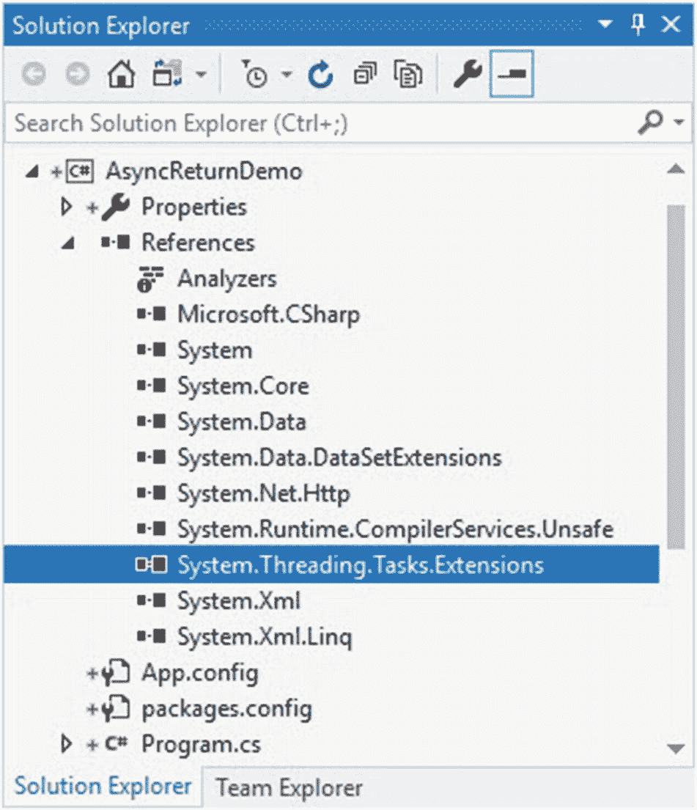
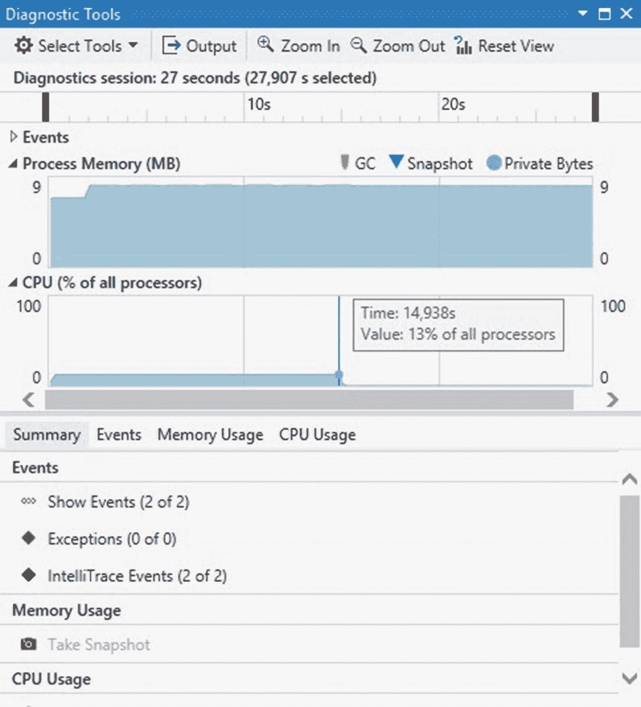

# 一、受关注的 C# 7

C# 7 于 2017 年 3 月发布，是 Visual Studio 2017 发布的一部分。如上所述。NET Blog 中，C# 7 专注于数据消费、简化代码和提高性能。C# 7 最大的特点是*元组*和*模式匹配*。

使用元组，开发人员可以从函数中返回多个值。传统上，C# 允许开发人员通过构建一个结构并返回该结构的一个实例，从一个函数返回多个值。

您还可以使用 out 参数，这些参数对函数返回的每个值使用 *out* 关键字。在 C# 7 中，元组提供了从函数中返回多个值的额外方法。

第二大特性是*模式匹配*，它可以测试一个值是否具有某种形状，然后对该数据做一些事情。在这一章中，我们将会看到这些概念以及更多。你可以从这一章中得到什么:

*   元组入门

*   模式匹配和解构

*   使用变量

*   使用本地函数

*   通用异步返回类型

*   抛出表达式

*   丢弃

C# 7 为开发人员提供了如此多的东西，绝对值得您花些时间来更好地了解这种新语言的特性。拿起一杯咖啡(如果你还没有的话)，让我们开始探索 C# 7 的旅程。

请注意，本书中的代码和截图我都使用了 Visual Studio Enterprise 2019 预览版。你可以从 [`https://visualstudio.microsoft.com`](https://visualstudio.microsoft.com) 下载一份。或者，您可以继续使用 Visual Studio 2017，但请注意，您将无法运行 C# 8.0 章节中的任何代码示例。

## 元组入门

到底是什么让元组如此伟大？如你所知，从一个函数返回多个值是你在 C# 中已经可以做到的。元组只是给了你另一种方法来做到这一点。

创建一个名为`TupleExample`的类。您的 Visual Studio 项目可能如图 [1-1](#Fig1) 所示。


图 1-1。

Visual Studio 解决方案

接下来，在名为`GetGuitarType`的类中添加一个元组返回函数。在其最简单的形式中，元组返回函数如下所示。

```cs
public (string, int) GetGuitarType()
{
    return ("Les Paul Studio", 6);
}

Listing 1-1Tuple-returning function

```

这个函数所做的就是向调用代码返回一个 tuple，它的吉他类型是一个字符串，字符串的数量是一个整数。因为这段代码在一个类中，您可以简单地如下调用它。

```cs
TupleExample te = new TupleExample();
var guitarResult = te.GetGuitarType();

Debug.WriteLine(guitarResult.Item1);
Debug.WriteLine(guitarResult.Item2);

Listing 1-2Calling tuple-returning function

```

因为我使用 Windows 窗体项目来演示元组的使用，所以我只是通过使用`Debug.WriteLine`将元组的结果写出到 Visual Studio 中的输出窗口。你可以用你喜欢的任何方式做这件事。

如果查看输出窗口，您会注意到显示了从函数返回的值。


图 1-2。

返回元组的输出

返回元组最简单的方法是使用一个隐式变量，这个变量是用关键字`var`声明的。不过需要注意的是`guitarResult`变量中*项目 1* 和*项目 2* 的使用。您将看到，默认情况下，元组中返回的值被赋予了位置名称(Item1、Item2、Item3 等。)取决于您要返回多少个值。

您会注意到，当您在 guitarResult 变量上点号时，Intellisense 会带回元组值的位置名称。


图 1-3。

元组变量的位置名称

### 更改元组值的默认位置名称

您可能想知道是否有可能更改元组值的默认位置名称。幸运的是，答案是响亮的是。可以将新的默认成员名作为元组函数的返回类型声明的一部分。

首先修改前面创建的 tuple 函数，并包含成员的逻辑名称，如下所示。

```cs
public (string GuitarType, int StringCount) GetGuitarType()
{
    return ("Les Paul Studio", 6);
}

Listing 1-3Adding member names to return type declaration

```

对于字符串返回类型，我指定它应该由成员名 GuitarType 来标识。对于整数返回类型，它将被标识为 StringCount。

这一次，如果您点击`guitarResult`变量，您将会注意到 *Item1* 和 *Item2* 位置名已经被我们在返回类型声明中定义的成员名所取代。


图 1-4。

成员名称取代位置名称

您仍然可以使用 *Item1* 、 *Item2* 等来引用元组值。这仍然有效，但是现在您可以显式地引用成员名，如下所示。

```cs
TupleExample te = new TupleExample();
var guitarResult = te.GetGuitarType();

Debug.WriteLine(guitarResult.GuitarType);
Debug.WriteLine(guitarResult.StringCount);

Listing 1-4Reference member names for tuple values

```

这使得引用 tuple 函数返回的值更加容易，并且消除了使用位置名可能导致的任何混淆(和可能的错误)。

### 在返回数据中创建本地元组变量

您可能会猜测，通过将元组成员名称作为默认成员名称，您也能够为它们定义本地相关的名称。这是百分之百正确的。让我澄清一下先前的说法。

您为元组值指定的成员名称只是建议的名称。也就是说，*吉他类型*和*琴弦计数*名称只是建议名称。当您处理返回值时，您可以指定本地相关的成员名称。这意味着如果我不想调用成员*吉他类型*和*弦计数*，那么我可以改变它。

通过将`var guitarResult`更改为`(string BrandType, int GuitarStringCount) guitarResult`，您可以覆盖元组返回类型声明中声明的建议默认成员名称。

当您点击`guitarResult`变量时，您会看到成员名称已经相应地改变了。


图 1-5。

元组值的本地成员名

这意味着我们的调用代码需要修改以引用本地相关的成员名，如下所示。

```cs
TupleExample te = new TupleExample();
(string BrandType, int GuitarStringCount) guitarResult = te.GetGuitarType();

Debug.WriteLine(guitarResult.BrandType);
Debug.WriteLine(guitarResult.GuitarStringCount);

Listing 1-5Local tuple variables

```

您不必绑定到 tuple 函数的返回类型声明中定义的默认成员名。创建自己的本地声明的名称在处理元组时会给你更多的灵活性。

### 作为离散变量的元组成员

C# 7 允许你使用元组成员作为离散变量。您将看到代码非常类似于创建本地元组变量。这里唯一的区别是省略了`guitarResult`变量。您会记得，我们的代码通过执行以下操作将函数返回的元组赋给了`guitarResult`变量。

```cs
(string BrandType, int GuitarStringCount) guitarResult = te.GetGuitarType();

Listing 1-6Returning local tuple variables

```

对于离散变量，我们可以简单地删除`guitarResult`变量来生成下面的代码。

```cs
(string BrandType, int GuitarStringCount) = te.GetGuitarType();

Listing 1-7Discrete tuple variables

```

将所有代码放在一起，您将会看到现在可以单独使用`BrandType`和`GuitarStringCount`。

```cs
TupleExample te = new TupleExample();
(string BrandType, int GuitarStringCount) = te.GetGuitarType();

Debug.WriteLine(BrandType);
Debug.WriteLine(GuitarStringCount);

Listing 1-8Using the discrete tuple variables

```

在 C# 中，我们称之为*解构*。您也不需要在括号中显式声明每个字段的类型。您可以使用`var`关键字为每个字段声明隐式类型变量。

```cs
TupleExample te = new TupleExample();
var (BrandType, GuitarStringCount) = te.GetGuitarType();

Debug.WriteLine(BrandType);
Debug.WriteLine(GuitarStringCount);

Listing 1-9Implicitly typed variables using var

```

在清单 [1-9](#PC9) 中，var 关键字在括号之外。您还可以将 var 关键字与括号中声明的任何或所有变量混合使用。考虑下面的代码示例。

```cs
TupleExample te = new TupleExample();
(string BrandType, var GuitarStringCount) = te.GetGuitarType();

Debug.WriteLine(BrandType);
Debug.WriteLine(GuitarStringCount);

Listing 1-10Using var with some of the variables

```

如果你认为离散变量很有趣，你应该看看元组变量的实例。接下来看看怎么做。

### 元组变量的实例

C# 7 允许你使用元组作为实例变量。这意味着您可以将变量声明为元组。为了说明这一点，首先创建一个名为`PlayInstrument`的方法，它接受一个元组作为参数。所有这些只是输出一行文本。

```cs
private void PlayInstrument((string, int) instrumentToPlay)
{
    Debug.WriteLine($"I am playing a {instrumentToPlay.Item1} with {instrumentToPlay.Item2} strings");
}

Listing 1-11The PlayInstrument method

```

您需要创建一个名为`InstrumentType`的`enum`，它有几个乐器。枚举只是简单的`public enum InstrumentType { guitar, cello, violin }`，用在你的类文件的顶部。然后，您可以在下面的代码中使用`enum`以及元组变量的实例。

```cs
string instrumentType = nameof(InstrumentType.guitar);
int strings = 12;
(string TypeOfInstrument, int NumberOfStrings) instrument = (instrumentType, strings);
PlayInstrument(instrument);

Listing 1-12Using tuples as instance variables

```

您会注意到，我将名为`instrument`的元组变量的实例传递给了`PlayInstrument`方法。在`PlayInstrument`方法中，我通过使用元组值的位置名来引用元组值。我也可以编写如下的`PlayInstrument`方法。

```cs
private void PlayInstrument((string instrument, int strings) instrumentToPlay)
{
    Debug.WriteLine($"I am playing a {instrumentToPlay.instrument} with {instrumentToPlay.strings} strings");
}

Listing 1-13PlayInstrument method using custom member names

```

这是引用元组值的更自然的方式。

#### 比较元组

还可以比较元组成员。为了说明这一点，让我们停留在乐器上，比较一下吉他和小提琴的弦数。

首先，使用您之前创建的 enum 并创建以下 tuple 类型变量。

```cs
string instrumentType1 = nameof(InstrumentType.guitar);
int stringsCount1 = 6;
(string TypeOfInstrument, int NumberOfStrings) instrument1 = (instrumentType1, stringsCount1);

string instrumentType2 = nameof(InstrumentType.violin);
int stringsCount2 = 4;
(string TypeOfInstrument, int NumberOfStrings) instrument2 = (instrumentType2, stringsCount2);

Listing 1-14Creating tuple type variables

```

小提琴和吉他的弦数不同。吉他有六个，而小提琴只有四个。检查计数的相等性就像使用一个`if`语句一样简单。

```cs
if (instrument1.NumberOfStrings != instrument2.NumberOfStrings)
{
   Debug.WriteLine($"A {instrument2.TypeOfInstrument} does not have the same number of strings as a {instrument1.TypeOfInstrument}");
}

Listing 1-15Comparing tuple members

```

还可以将整个元组变量相互比较。在 7.3 版本之前，检查元组相等性需要使用`Equals`方法。

```cs
if (!instrument1.Equals(instrument2))
{
    Debug.WriteLine("We are dealing with different instruments here.");
}

Listing 1-16Comparing tuples before C# 7.3

```

如果您尝试对 tuple 类型使用`==`或`!=`，您会看到一个错误。


图 1-6。

C# 7.0 中的元组相等错误

要使用`==`或`!=`测试元组相等，您需要 C# 7.3 或更高版本。要使用此版本的 C#，您需要执行以下操作:

1.  右键点击项目，点击*属性*。

2.  在*构建*选项卡上，点击*高级*按钮。

3.  在高级构建设置中，将语言版本设置为最新的次要版本。

这足以选择 C# 7.3(在我们的例子中)在项目中使用。


图 1-7。

选择 C# 语言版本

请注意，C# 8.0(测试版)在此列表中可用。这是因为我用的是 Visual Studio 2019 预览版。如果你用的是 Visual Studio 2017，就看不到 C# 8.0 了。

在你选择了你的 C# 语言版本之后，回到你的代码，看看我们之前看到错误的那一行。错误已经消失了。就我个人而言，我不太喜欢在 Equals 方法中使用`!`。这在某种程度上模糊了我的可读性。

对我来说,`if (instrument1 != instrument2)`比`if (!instrument1.Equals(instrument2))`读起来更自然。

### 推断元组元素名称

从 C# 7.1 开始，对 C# 语言做了一个小的改进，以推断元组元素名称。考虑下面的代码块。

```cs
string instrumentType = nameof(InstrumentType.guitar);
int stringsCount = 6;
var instrument = (instrumentType, stringsCount);

Listing 1-17Inferring tuple element names

```

当我点击`instrument`变量时，智能感知向我显示从用于初始化元组的变量中推断出的成员名称。


图 1-8。

推断的成员名称

从 7.1 版本开始，这是对 C# 7 的一个受欢迎的增强。

### 解构元组的方法

术语*tuple destruction*简单地说就是取出一个 tuple 中的所有条目，并在一次操作中将其拆分出来。事实上，本节中的代码清单已经做到了这一点。

您会经常听到这个术语，因为它指的是在处理元组时自然完成的事情。下图说明了元组解构发生的方式。


图 1-9。

解构元组

如您所见，本质上只有四种方法来执行元组解构。

其实只有三种方式，但是我统计了两种方式把推断作为一种单独的解构方式。

这些解构的方法是

*   显式声明每个字段的类型

*   用单个 var 关键字推断每个变量的类型

*   通过将 var 关键字与任何或所有变量声明混合来推断变量的类型

*   声明变量并将元组解构为先前声明的变量

对我来说，使用单个`var`关键字可能是解构元组最有效的方式。其他方法对我来说有点啰嗦。我想这完全取决于个人喜好。

无论您使用哪种方法来解构一个元组，我可以在单个解构操作中做到这一点的事实确实是一个受欢迎的特性。

### 关于元组的最后思考

元组在您的日常编码实践中肯定有一席之地。经常使用它们将有助于更好地理解它们。请注意，元组可以不只有我在代码示例中使用的两个成员。创建一个拥有如此多成员的元组可能并不是一个好主意，因为这样会使它变得难以管理和使用。

在 C# 中，`Tuple.Create`最多允许八项。实际上，这通常就足够了。但是，如果您发现自己在创建具有大量成员的元组，那么您可能需要考虑使用一个类或一个结构。令人难以置信的是，一些音乐家可以在几件弦乐器上取得成就。开发者用元组能达到的效果更是不可思议。

## 模式匹配

在 C# 7 中，我们现在有能力使用模式匹配。通过使用模式，我们可以测试一个值是否有某个*形状*，如果有，就使用匹配形状的信息。

事实上，当您使用`if`和`switch`语句测试值时，您已经在使用模式匹配算法了。如果语句匹配，则获取匹配的值并提取其信息。

在 C# 7 中，你可以使用新的语法元素来扩展你已经熟悉的`is`和`switch`语句。让我们首先创建一个名为`PatternMatchingExample`的新类，并将我们的代码添加到这个类中。


图 1-10。

PatternMatchingExample 示例类

我在 PatternMatchingExample 类中创建了以下枚举。

```cs
public enum UniversityCourses { Maths, Chemistry, Anatomy, LifeSkills }
public enum UniversityDegree { BA, BSc }

Listing 1-18
Class enums

```

我不打算详细讨论这个例子中使用的每个类。您可以下载本书的源代码，并根据需要使用示例。

现在，假设我们有以下对象:

*   人员类别

*   学生类(继承自 Person 类)

*   讲师类(继承自 Person 类)

*   校友类(继承自 Person 类)

*   ExchangeStudent 结构

这些类都是相似的，只是有一点点不同，我将在这里简要强调一下。我们还有一个用于`ExchangeStudent`的结构。

严格来说，`Lecturer`和`Alumnus`应该继承自`Student`而不是`Person class`，但我不想把事情复杂化。毕竟，这一章不是在讨论继承。

如前所述，`Student`类、`Lecturer`类和`Alumnus`类都继承自 Person 类。Person 类有以下代码。

```cs
public class Person
{
    public string FirstName { get; set; }
    public string LastName { get; set; }
    public int Age { get; set; }
}

Listing 1-19
Person class code

```

`Student`类具有学生注册的课程的属性。它还从`StudentDetails`方法中返回唯一的值。学生类有以下定义。

```cs
public class Student : Person
{
    public int StudentNumber { get; }
    public UniversityCourses CourseEnrolledFor { get; }
    public Student((string firstname, string lastname, int age) personDetails, int studentNumber, UniversityCourses courseEnrolled)
    {
        FirstName = personDetails.firstname;
        LastName = personDetails.lastname;
        Age = personDetails.age;
        StudentNumber = studentNumber;
        CourseEnrolledFor = courseEnrolled;
    }

    public (string fullName, int studentNum, string studentCourse) StudentDetails()
    {
        var studentDetails = ($"{FirstName} {LastName}", StudentNumber, CourseEnrolledFor.ToString());
        return studentDetails;
    }
}

Listing 1-20
Student class code

```

其他类从返回特定对象细节的方法返回不同的属性。例如，`Lecturer`类包含讲师教授的课程专门化的属性。然而，它的 details 方法计算并返回讲师被雇用的天数。这是`Lecturer`类的代码。

```cs
public class Lecturer : Person
{
    public int EmployeeNumber { get; }
    public string CourseSpecialization { get; }
    public DateTime DateEmployed { get; }
    public Lecturer((string firstname, string lastname, int age) personDetails, int employeeNumber, UniversityCourses courseSpecialization, DateTime dateEmployed)
    {
        FirstName = personDetails.firstname;
        LastName = personDetails.lastname;
        Age = personDetails.age;
        EmployeeNumber = employeeNumber;
        CourseSpecialization = courseSpecialization.ToString();
        DateEmployed = dateEmployed;
    }

    public (string fullName, int employeeNum, string courseSpecial, int totalDayesEmployed) LecturerDetails()
    {
        double lengthOfServiceInDays = DateTime.Now.Subtract(DateEmployed).TotalDays;
        var lecturerDetails = ($"{FirstName} {LastName}", EmployeeNumber, CourseSpecialization, Convert.ToInt32(lengthOfServiceInDays));
        return lecturerDetails;
    }
}

Listing 1-21
Lecturer class code

```

`Alumnus`已经完成了他们的学位，所以`Alumnus`类包含了他们获得的学位和他们完成学位的年份的属性。`Alumnus`类如下所示。

```cs
public class Alumnus : Person
{
    public int YearCompleted { get; }
    public UniversityDegree DegreeObtained { get; }
    public Alumnus((string firstname, string lastname, int age) personDetails, int yearStudiesCompleted, UniversityDegree degreeObtained)
    {
        FirstName = personDetails.firstname;
        LastName = personDetails.lastname;
        Age = personDetails.age;
        YearCompleted = yearStudiesCompleted;
        DegreeObtained = degreeObtained;
    }

    public (string fullName, int yearCompleted, string degreeObtained) AlumnusDetails()
    {
        var alumnusDetails = ($"{FirstName} {LastName}", YearCompleted, DegreeObtained.ToString());
        return alumnusDetails;
    }
}

Listing 1-22
Alumnus class code

```

最后，`ExchangeStudent`是一个结构，包含他们参加的短期课程和学生签证剩余天数的属性。`ExchangeStudent`结构如下所示。

```cs
public struct ExchangeStudent
{
    public string FirstName { get; }
    public string LastName { get; }
    public string ShortCourse { get; }
    public DateTime VisaExpiryDate { get; }

    public ExchangeStudent((string firstname, string lastname, int age) personDetails, UniversityCourses shortCourse, DateTime studentVisaExpiryDate)
    {
        FirstName = personDetails.firstname;
        LastName = personDetails.lastname;
        ShortCourse = shortCourse.ToString();
        VisaExpiryDate = studentVisaExpiryDate;
    }

    public (string fullName, string shortCourse, int daysLeftOnVisa) ExchangeStudentDetails()
    {
        double lenOfVisa = VisaExpiryDate.Subtract(DateTime.Now).TotalDays;

        var exchangeDetails = ($"{FirstName} {LastName}", ShortCourse, Convert.ToInt32(lenOfVisa));
        return exchangeDetails;
    }
}

Listing 1-23
ExchangeStudent struct code

```

如果我们有一个特定的对象，我们希望获得该对象的正确细节。您会注意到，我们从元组中的每个类返回信息。

我们的类的设计在这里并不重要。重要的是我们确定其形状的方式，然后在此基础上，提取数据进行处理。现在，我们将了解模式匹配如何作用于这些对象。

### 使用 Is 类型模式表达式

在 C# 7 之前，你必须使用一系列的`if`和`is`语句来测试对象的类型。这是一个典型的类型模式，你正在测试一个变量以确定它是什么类型。

根据变量的类型，您可以执行不同的操作。此类代码的示例可能如下所示。

```cs
// Before C# 7
if (someperson is Student)
{
    var student = (Student)someperson;
    return $"{student.StudentDetails().fullName} is enrolled for {student.StudentDetails().studentCourse} with student number {student.StudentDetails().studentNum}";
}
else if (someperson is Lecturer)

{
    var lecturer = (Lecturer)someperson;
    return $"{lecturer.LecturerDetails().fullName} teaches {lecturer.LecturerDetails().courseSpecial}";
}
else if (someperson is Alumnus)
{
    var alumnus = (Alumnus)someperson;
    return $"{alumnus.AlumnusDetails().fullName} has completed {alumnus.AlumnusDetails().degreeObtained} in {alumnus.AlumnusDetails().yearCompleted}";
}

Listing 1-24Pre-C# 7 type testing

```

快进到 C# 7，我们有一个更简单、更简洁的方法来做这件事。在下面的代码中，我们使用扩展的`is`表达式，如果测试成功，它将分配一个变量。代码如下所示。

```cs
// The is type pattern
if (someperson is Student student)
{
    return $"{student.StudentDetails().fullName} is enrolled for {student.StudentDetails().studentCourse} with student number {student.StudentDetails().studentNum}";
}
else if (someperson is Lecturer lecturer)
{
    return $"{lecturer.LecturerDetails().fullName} teaches {lecturer.LecturerDetails().courseSpecial}";
}
else if (someperson is Alumnus alumnus)
{
    return $"{alumnus.AlumnusDetails().fullName} has completed {alumnus.AlumnusDetails().degreeObtained} in {alumnus.AlumnusDetails().yearCompleted}";
}
else if (someperson is ExchangeStudent exchStudent)
{
    return $"{exchStudent.ExchangeStudentDetails().fullName} has {exchStudent.ExchangeStudentDetails().daysLeftOnVisa} days left on Student Visa";
}

Listing 1-25The is type pattern expression

```

我们现在有了一个使用`is`表达式的快捷方式。这是因为它做了两件事。它测试这个变量，并把它赋给一个新的变量。还要注意，我包含了一个结构类型`ExchangeStudent`。这意味着新的`is`表达式可以很好地处理值类型(结构)和引用类型(类)。

关于结构和类的补充说明:当创建一个结构时，分配给该结构的变量保存该结构的实际数据。当它被赋给一个新变量时，它被复制，这给了新变量一个单独的内存空间。原始变量和新变量现在包含相同数据的两个独立副本。这就是我们所说的值类型。

类是一种引用类型。引用类型包含指向保存数据的另一个内存位置的指针。

扩展的`is`表达式使得代码更短，可读性更好。需要注意的另一点是在每个`is`表达式后新创建的变量。这些只有在模式匹配表达式返回 true 结果时才在范围内分配。

### 使用开关模式匹配语句

在上一节中，我们看了一下`is`模式匹配表达式。它需要对您需要检查的每种类型使用`if`语句。这可能有点麻烦，因为它也只测试输入是否匹配单一类型。这就是`switch`表达派上用场的地方。

传统的`switch`语句只支持常量模式。它也只支持数字类型和`string`类型。在 C# 7 中，你现在可以使用类型模式。这意味着我们可以做以下事情。

```cs
// Using switch statements pattern matching
switch (someperson)
{
    case Student student:
        return $"{student.StudentDetails().fullName} is enrolled for {student.StudentDetails().studentCourse} with student number {student.StudentDetails().studentNum}";
    case Lecturer lecturer:
        return $"{lecturer.LecturerDetails().fullName} teaches {lecturer.LecturerDetails().courseSpecial}";
    case Alumnus alumnus:
        return $"{alumnus.AlumnusDetails().fullName} has completed {alumnus.AlumnusDetails().degreeObtained} in {alumnus.AlumnusDetails().yearCompleted}";
    case ExchangeStudent exchangeStudent:
        return $"{exchangeStudent.ExchangeStudentDetails().fullName} has {exchangeStudent.ExchangeStudentDetails().daysLeftOnVisa} days left on Student Visa";
}

Listing 1-26Switch pattern matching statements

```

每当 case 语句的计算结果为 true 时，就会运行它下面的代码。在 C# 7 中，变量类型的限制已经从`switch`表达式中删除，任何类型都可以使用。

### 在 Case 表达式中使用 When 子句

我们可以通过在`case`标签上使用`when`条款来满足特殊情况。让我们假设我们也想确定资深校友。这些人将在 1976 年之前完成他们的课程。

因此，我们可以在 case 标签上使用 when 子句来检查这种情况。然后考虑下面的代码清单。

```cs
// Using switch statements pattern matching
switch (someperson)
{
    case Student student:
        return $"{student.StudentDetails().fullName} is enrolled for {student.StudentDetails().studentCourse} with student number {student.StudentDetails().studentNum}";
    case Lecturer lecturer:
        return $"{lecturer.LecturerDetails().fullName} teaches {lecturer.LecturerDetails().courseSpecial}";
    case Alumnus alumnus when alumnus.YearCompleted <= 1975: // Note the when keyword here
        return $"{alumnus.AlumnusDetails().fullName} is a senior Alumnus";
    case Alumnus alumnus:
        return $"{alumnus.AlumnusDetails().fullName} has completed {alumnus.AlumnusDetails().degreeObtained} in {alumnus.AlumnusDetails().yearCompleted}";
    case ExchangeStudent exchangeStudent:
        return $"{exchangeStudent.ExchangeStudentDetails().fullName} has {exchangeStudent.ExchangeStudentDetails().daysLeftOnVisa} days left on Student Visa";
}

Listing 1-27Using a when clause

```

如果`YearCompleted`的值是`<= 1975,`,我们返回一个稍微不同的消息给调用代码。

如果代码有点难以理解，可以考虑下载本书的源代码，并在 Visual Studio 中学习。

另一个值得注意的有趣的事情是，多个`case`标签可以被组合在一个`switch`部分下。考虑下面的代码。

```cs
// Using multiple case labels in switch statements
switch (someperson)
{
    case Student student when student.CourseEnrolledFor == UniversityCourses.Chemistry:
    case Alumnus alumnus when alumnus.DegreeObtained == UniversityDegree.BSc:
        return "Chemistry and BSc excluded";
    case Student student:
        return $"{student.StudentDetails().fullName} is enrolled for {student.StudentDetails().studentCourse} with student number {student.StudentDetails().studentNum}";
    case Lecturer lecturer:
        return $"{lecturer.LecturerDetails().fullName} teaches {lecturer.LecturerDetails().courseSpecial}";
    case Alumnus alumnus when alumnus.YearCompleted <= 1975:
        return $"{alumnus.AlumnusDetails().fullName} is a senior Alumnus";
    case Alumnus alumnus:
        return $"{alumnus.AlumnusDetails().fullName} has completed {alumnus.AlumnusDetails().degreeObtained} in {alumnus.AlumnusDetails().yearCompleted}";
    case ExchangeStudent exchangeStudent:
        return $"{exchangeStudent.ExchangeStudentDetails().fullName} has {exchangeStudent.ExchangeStudentDetails().daysLeftOnVisa} days left on Student Visa";
}

Listing 1-28
Multiple case labels

```

在这里，您可以看到我们想要排除化学系学生和理学学士校友。根据注册的课程或获得的学位排除这些对象类型的例子是相当愚蠢的(即，可能不是一个很好的现实世界的例子)。但是，它强调了 switch 语句的一个重要特性:

*   我可以将多个机箱标签应用到单个交换机部分。

*   每个部分的顺序很重要。

那么，当我说这些部分的顺序很重要时，我的意思是什么呢？我们将考虑在`switch`语句中添加代码`case Student student`作为第一个`case`的影响。这将导致学生的带有`when`子句的`case`永远不会被评估。

事实上，清单 [1-28](#PC28) 中的代码已经将高级校友排除在外，因为根据获得的学位排除校友的第一个`case`标签将包括任何高级校友。因此，获得理学士学位的高年级校友将永远被排除在高年级校友评估之外`switch`。为了演示这一点，请考虑以下对象。

```cs
Alumnus alumnus = new Alumnus(("Gabby", "Salinger", 26), 2017, UniversityDegree.BSc);
Alumnus senalumnus = new Alumnus(("Frank", "Greer", 74), 1970, UniversityDegree.BSc);

Listing 1-29
Alumnus objects

```

运行代码并向其传递两个`Alumnus`类的实例将导致两个对象的`Chemistry and BSc excluded`输出。为了克服这个问题，我们可以添加条件逻辑 AND 运算符。

`&&`运算符也称为短路逻辑 AND 运算符。它计算`bool`操作数的逻辑与，如果`&&`的两端都计算为`true`，则运算结果为`true`。因此，如果第一个条件为假，表达式会立即短路。这意味着只有当第一个条件为真时，才会计算第二个条件。

为了说明这一点并允许高级校友仍然被评估，修改您的 switch 语句如下。

```cs
// Modified switch statement to cater for senior alumni
switch (someperson)
{
    case Student student when student.CourseEnrolledFor == UniversityCourses.Chemistry:
    case Alumnus alumnus when alumnus.DegreeObtained == UniversityDegree.BSc && alumnus.YearCompleted > 1975:
        return "Chemistry and BSc excluded";
    case Student student:
        return $"{student.StudentDetails().fullName} is enrolled for {student.StudentDetails().studentCourse} with student number {student.StudentDetails().studentNum}";
    case Lecturer lecturer:
        return $"{lecturer.LecturerDetails().fullName} teaches {lecturer.LecturerDetails().courseSpecial}";
    case Alumnus alumnus when alumnus.YearCompleted <= 1975:
        return $"{alumnus.AlumnusDetails().fullName} is a senior Alumnus";
    case Alumnus alumnus:
        return $"{alumnus.AlumnusDetails().fullName} has completed {alumnus.AlumnusDetails().degreeObtained} in {alumnus.AlumnusDetails().yearCompleted}";
    case ExchangeStudent exchangeStudent:
        return $"{exchangeStudent.ExchangeStudentDetails().fullName} has {exchangeStudent.ExchangeStudentDetails().daysLeftOnVisa} days left on Student Visa";
}

Listing 1-30Modified switch statement to cater for senior alumni

```

我们所做的只是将`&& alumnus.YearCompleted > 1975`添加到校友`case`标签的`when`子句中。本质上，我是说，只有当校友获得理学士学位并且获得该学位的年份是在 1975 年之后，才必须排除`Alumnus`对象。

如果我在清单 [1-29](#PC29) 中使用相同的`Alumnus`对象并运行我的代码，我会在输出窗口中看到不同的结果。

```cs
Chemistry and BSc excluded
Frank Greer is a senior Alumnus

Listing 1-31Output window results

```

当第一个`Alumnus`对象根据获得的学位被排除时，第二个对象通过`case`，因为不满足具有 1975 年之后获得的学位的条件。高年级校友因此仍被评估。

正如您将看到的，每个部分的顺序绝对很重要。一般的经验法则是将最具限制性的`case`标签放在`switch`语句的顶部，而将最通用的`case`标签放在最后。

### 检查 Switch 语句中的空值

我们可以通过添加一个`null`案例来检查`null`。这确保了传递给 switch 语句的参数不为空。考虑下面的代码。

```cs
// Cater for null
switch (someperson)
{
    case Student student:
        return $"{student.StudentDetails().fullName}";
    case Lecturer lecturer:
        return $"{lecturer.LecturerDetails().fullName}";
    case Alumnus alumnus:
        return $"{alumnus.AlumnusDetails().fullName}";
    case ExchangeStudent exchangeStudent:
        return $"{exchangeStudent.ExchangeStudentDetails().fullName}";
    case null:
        return $"{nameof(someperson)} cannot be null";
}

Listing 1-32
Null case

```

向这个`switch`语句传递一个`null`对象将导致对`null`案例进行评估，并返回消息*someone 不能为 null* 。

模式匹配是控制代码逻辑流程的一种非常好的方式。有些人认为这是句法上的甜言蜜语。无论你对模式匹配有什么想法，能够在 C# 7 中使用它肯定是很棒的。

## 使用变量

C# 中的`out`关键字已经有一段时间了。使用`out`通过引用传递参数。默认情况下，C# 中的所有参数都是通过值传递的，除非您显式地包含了一个`out`或`ref`修饰符。在过去，你必须声明一个变量作为`out`参数。

这在 C# 7 中已经改变了，你可以在你使用它的地方声明变量。假设我们想测试一个变量是否是一个有效的整数值。这是我们的代码在 C# 7 之前的样子。

```cs
string num = "123";
int numParsed;
if (int.TryParse(num, out numParsed))
{
    Debug.WriteLine($"{num} is a valid integer");
}
else
{
    Debug.WriteLine($"{num} is not a valid integer");
}

Listing 1-33Pre-C#7 code for out keyword

```

我们有一个叫做 numParsed 的整型变量，它就在附近。在 C# 7 中，我们现在可以做以下事情。

```cs
string num = "123";
if (int.TryParse(num, out int numParsed))
{
    Debug.WriteLine($"{num} is a valid integer");
}
else
{
    Debug.WriteLine($"{num} is not a valid integer");
}

Listing 1-34C# 7 code for out keyword

```

你看出区别了吗？眨眼，你可能会错过它。我们不再需要声明一个有趣的松散的固定变量，它在我们的`TryParse`检查之前一直存在。

对 C# 语言来说，这是一个微小但受欢迎的变化。另一点需要注意的是，编译器能够推断出`numParsed`变量的类型，这意味着我们也可以使用`var`关键字。

这只是意味着我们可以使用`out var`而不是使用`out int`，并获得相同的结果。考虑下面的代码清单。

```cs
string num = "123";
if (int.TryParse(num, out var numParsed))
{
    Debug.WriteLine($"{num} is a valid integer");
}
else
{
    Debug.WriteLine($"{num} is not a valid integer");
}

Listing 1-35Using var with out

```

然后，C# 7 中还有一个小的附加功能，可能会被一些开发人员忽略。那就是包含*弃*。现在讨论丢弃是有意义的，因为它在`out`参数的上下文中受到支持。

### 丢弃

在 C# 7 中，这种语言现在支持丢弃。请将这些视为临时的虚拟变量，不会在您的应用代码中使用。换句话说，你实际上并不关心赋值。使用丢弃与使用未赋值变量是一样的，因为变量本身不包含值。

这意味着丢弃变量甚至可能没有被分配存储空间，这反过来减少了内存分配。在 C# 7 的以下上下文中支持丢弃变量:

*   元组和对象解构

*   用`is`和`switch`进行模式匹配

*   方法调用中使用的`out`参数

*   范围内没有其他丢弃变量时的独立丢弃变量

为了表明一个变量是被丢弃的，你需要给它分配一个下划线字符作为它的变量名。以前面的 out 参数清单为例，我们可以做一点小小的改变，使用一个 discard 变量。考虑下面的代码清单。

```cs
string num = "123";
if (int.TryParse(num, out _))
{
    Debug.WriteLine($"{num} is a valid integer");
}
else
{
    Debug.WriteLine($"{num} is not a valid integer");
}

Listing 1-36Using discards with out parameters

```

我唯一改变的部分是我用`int.TryParse(num, out _)`代替了`int.TryParse(num, out var numParsed)`。这真的很好，完全取消了不必要的`numParsed`变量声明。

我将在本章的后面讨论弃牌，所以不要走开。接下来，我们将看看什么是局部函数，以及如何在 C# 7 中使用它们。

## 使用本地函数

局部函数是嵌套在另一个方法中的私有方法。局部函数的使用在函数式语言中相当普遍。这已经包含在 C# 7 中。

局部函数的使用实际上仅限于包含方法。这意味着只有包含方法可以调用本地函数。因此，局部函数的使用应该在包含成员的范围内有意义，并且实际上应该只在包含成员内有值。

出于这个原因，使用局部函数可以让读者更清楚地理解代码的意图。这是因为您将知道本地函数只能被包含成员调用，而不能被其他成员调用。可以从以下成员声明和调用局部函数:

*   方法、匿名方法和构造函数

*   属性访问器和事件访问器

*   λ表达式

*   终结器

*   其他本地功能

让我们来看一个局部函数的例子。在这个例子中，我将为不同的对象创建类。本地函数将被添加到我的类构造函数中，并将计算形状的体积。构造函数将负责确定对象描述。

首先，在项目中添加一个名为 LocalFunctionExample 的类。然后为这个类创建一个构造函数。我们将在这里添加所有的代码。


图 1-11。

LocalFunctionExample 类

继续为可以计算体积的对象创建类。我使用了以下对象:

*   立方

*   金字塔

*   范围

每个物体在形状上明显不同；因此，每个类都满足确定每个对象的体积所需的维度。下面是`Cube`类、`Pyramid`类和`Sphere`类的代码。

```cs
public class Cube
{
    public double Edge { get; }
    public Cube(double edgeLength)
    {
        Edge = edgeLength;
    }
}

public class Pyramid
{
    public double BaseLength { get; }
    public double BaseWidth { get; }
    public double Height { get; }
    public Pyramid(double triangleBaseLength, double triangleBaseWidth, double triangleHeight)
    {
        BaseLength = triangleBaseLength;
        BaseWidth = triangleBaseWidth;
        Height = triangleHeight;
    }
}

public class Sphere
{
    public double Radius { get; }
    public Sphere(double circleRadius)
    {
        Radius = circleRadius;
    }
}

Listing 1-37The object classes’ code

```

接下来，您需要为 LocalFunctionExample 类创建一个构造函数，该构造函数将包含确定对象描述和计算体积的本地函数所需的逻辑。

要快速创建构造函数，键入 *ctor* 并按两次 Tab 键。Visual Studio 将自动为您插入构造函数。

考虑下面的`LocalFunctionExample`构造函数代码。

```cs
public class LocalFunctionExample
{
    public double ObjectVolume { get; }
    public string ObjectType { get; }

    public LocalFunctionExample(object shapeObject)
    {

        double GetObjectVolume(object shape)
        {
            switch (shape)
            {
                case Cube square:
                    return Math.Pow(square.Edge, 3.00);
                case Pyramid triangle:
                    return (triangle.BaseLength * triangle.BaseWidth * triangle.Height) / 3;
                case Sphere sphere:
                    return 4 * Math.PI * Math.Pow(sphere.Radius, 3) / 3;
                case null:
                    return 0.0;
            }

            return 0.0;
        }

        ObjectVolume = GetObjectVolume(shapeObject);
        ObjectType = ObjectVolume == 0.0 ? "Invalid Object Shape" : shapeObject.GetType().Name;
    }
}

Listing 1-38The LocalFunctionExample class

```

你会注意到，我添加了一个名为`GetObjectVolume`的本地函数，它获取传递给构造函数的对象，并使用*模式匹配*来确定我们正在处理的对象的类型。

如果任何未识别的形状被传递给局部函数，局部函数将返回一个体积`0.0`，这将导致三元条件表达式显示*无效对象形状*作为`ObjectType`值。

为了测试本地函数，添加下面的代码并将对象传递给你的`LocalFunctionExample`类。只需使用`Debug.WriteLine`来显示来自`LocalFunctionExample`类的输出。

```cs
Cube cube = new Cube(5);
Pyramid pyramid = new Pyramid(5, 5, 5);
Sphere sphere = new Sphere(5);
Student student = new Student(("john", "doe", 22), 12345, UniversityCourses.Anatomy);

Listing 1-39Testing the local function

```

这将导致在输出窗口中显示以下行。

```cs
This is a Cube with a volume of 125
This is a Pyramid with a volume of 41,6666666666667
This is a Sphere with a volume of 523,598775598299
This is a Invalid Object Shape with a volume of 0

Listing 1-40
Output

```

您可以看到，当我们将一个无法识别的对象传递给构造函数时，该类通过删除 switch 语句并将音量设置为 0.0 来处理它。

这里还有一些关于局部函数的注意事项:

*   在包含成员中定义的所有局部变量都可以从局部函数中访问。

*   所有方法参数都可以从本地函数中访问。

*   局部函数是私有的；因此它们不能包含访问修饰符。

*   对于局部函数，不能包含`static`关键字。

*   不能将属性应用于局部函数或其参数。

当您想在整个方法中使用某些功能时，局部函数非常好，因为这些功能只适用于它的包含成员。您还会注意到，局部函数位于构造函数的顶部，引用它的代码(计算体积的代码)位于局部函数之后。

这个的位置不重要。您可以轻松地在本地函数代码之前调用`ObjectVolume = GetObjectVolume(shapeObject);`,并且仍然获得相同的输出。

## 通用异步返回类型

async/await 的功能被广泛用于避免性能瓶颈和提高应用的响应能力。尽管在某些情况下，从异步方法返回一个`Task`对象可能会引入性能问题，但还是有一个小问题。

当`async`方法返回缓存的结果或以同步方式完成时，这一点尤其明显。我们知道支持的返回类型是`Task<T>`、`Task`和`void`。在 C# 7 中，`ValueTask`类型已经被添加，以允许`async`方法返回除了我一分钟前提到的类型之外的其他类型。

这个特性最好用一个例子来说明。我将简单地使用一个控制台应用来说明`ValueTask`类型的用法。在我们开始编写代码之前，我们需要安装 NuGet 包`System.Threading.Tasks.Extensions`，这样我们就可以使用`ValueTask<TResult>`类型。


图 1-12。

NuGet 包管理器

一旦你安装了 NuGet 包，你就会看到这个系统。项目参考中列出了 Threading.Tasks.Extensions。



图 1-13。

控制台应用参考

现在我们可以开始写一些代码了。控制台应用是纳斯达克的一个虚拟股票报价器。对于股价，我显然将使用虚拟数据，但这应该说明使用`ValueTask`类型的性能收益。

该应用将循环 1 亿次，但只有在超过缓存期时才读取新的股票信息。首先创建一个保存股票信息的`StockListing`类。

```cs
public class StockListing
{
    public string NASDAQTickerSymbol { get; }
    public decimal Open { get; }
    public decimal High { get; }
    public decimal Low { get; }
    public string MarketCap { get; }
    public StockListing(string nasdaq, decimal open, decimal high, decimal low, string marketCap)
    {
        NASDAQTickerSymbol = nasdaq;
        Open = open;
        High = high;
        Low = low;
        MarketCap = marketCap;
    }
}

Listing 1-41The StockListing class

```

下一个类将简单地使用`Task<T>`来返回股票查询的结果。该类包含一个名为`GetShareDetails`的本地函数，用于读取最新的共享信息。

然而，如果缓存时间没有过期，则返回缓存的股票列表。类代码如下所示。

```cs
public class ShareService
{
    private readonly TimeSpan cacheTime = TimeSpan.FromSeconds(2);
    private DateTime lastRun = DateTime.Now;
    private IEnumerable<StockListing> cachedListings;

    public async Task<IEnumerable<StockListing>> GetStockDetails()
    {
        async Task<IEnumerable<StockListing>> GetShareDetails()
        {
            cachedListings = await Task.Run(() => new List<StockListing>
            {
                new StockListing("AAPL", 157.50m, 158.52m, 154.55m, "741,37B")
                ,new StockListing("AMZN", 1473.35m, 1513.47m, 1449.00m, "722,71B")
                ,new StockListing("QCOM", 56.33m, 57.53m, 56.24m, "68,86B")
            });

            lastRun = DateTime.Now;
            WriteLine($"Get share details - {lastRun}");
            return cachedListings;
        }

        if (DateTime.Now - lastRun < cacheTime)
        {
            return cachedListings;
        }

        return await GetShareDetails();
    }
}

Listing 1-42
ShareService class

```

在控制台应用中，我们以下列方式使用服务。

```cs
static void Main(string[] args)
{
    var shareListing = new ShareService();
    for (int i = 0; i < 100_000_000; i++)
    {
        var result = shareListing.GetStockDetails().Result;
    }

    WriteLine($"Garbage collection occurred {GC.CollectionCount(0)} times");
    ReadLine();
}

Listing 1-43Calling the service from the console application

```

这只是返回结果，然后输出垃圾收集发生的次数。

请注意，我已经将`using static System.Console`添加到我的`using`语句中。这允许我在`WriteLine`和`ReadLine`方法之前删除`Console`。

现在运行应用会产生以下结果。


图 1-14。

任务<t>诊断结果</t>

从诊断工具中可以明显看出以下情况:

*   进程内存在 12MB 左右。

*   完成该过程所需的时间为 27，071 秒。

控制台应用屏幕的输出还报告垃圾收集在第 0 代中发生了 1833 次。让我们改进 ShareService 类中的代码，并利用`ValueTask`类型。

```cs
public class ShareService
{
    private readonly TimeSpan cacheTime = TimeSpan.FromSeconds(2);
    private DateTime lastRun = DateTime.Now;
    private IEnumerable<StockListing> cachedListings;

    public ValueTask<IEnumerable<StockListing>> GetStockDetails()
    {
        async Task<IEnumerable<StockListing>> GetShareDetails()
        {
            cachedListings = await Task.Run(() => new List<StockListing>
            {
                new StockListing("AAPL", 157.50m, 158.52m, 154.55m, "741,37B")
                ,new StockListing("AMZN", 1473.35m, 1513.47m, 1449.00m, "722,71B")
                ,new StockListing("QCOM", 56.33m, 57.53m, 56.24m, "68,86B")
            });

            lastRun = DateTime.Now;
            WriteLine($"Get share details - {lastRun}");
            return cachedListings;
        }

        if (DateTime.Now - lastRun < cacheTime)
        {
            return new ValueTask<IEnumerable<StockListing>>(cachedListings);
        }

        return new ValueTask<IEnumerable<StockListing>>(GetShareDetails());
    }
}

Listing 1-44Improved ShareService class

```

你会注意到我已经用`ValueTask<IEnumerable<StockListing>>`替换了`Task<IEnumerable<StockListing>>`，并且我还删除了`async`关键字。去掉`async`关键字是有意义的，因为大多数时候结果会同步返回。使用改进的代码再次运行应用会产生以下改进的结果。



图 1-15。

值任务<t>诊断结果</t>

现在，从诊断工具中可以明显看出以下信息，并且肯定有所改进:

*   进程内存约为 9MB(低于 12MB)。

*   完成该过程所需的时间为 14，938 秒(低于上次运行的 27，071 秒)。

控制台应用屏幕的输出还报告垃圾回收在第 0 代中发生了 0 次。

`ValueTask`是值类型。这意味着通过返回缓存的股票列表，堆上不会发生分配。

### 那么，我为什么要使用任务<t>？</t>

异步方法的默认选择应该是返回一个`Task`或`Task<T>`。如果你想用`ValueTask<T>`来代替，你应该只考虑使用它，如果这样做可以提高性能的话。

## 抛出表达式

在 C# 7 之前，我们使用`throw`语句。不存在使用`throw`表达式的情况。这有点道理，因为使用`throw`作为表达式总是会导致异常。

不管不包含`throw`表达式的理由是什么，C# 的发展已经使得包含这个特性成为必要。在 C# 7 中，现在可以在有限的上下文中包含`throw`表达式。这些是

*   在一个表达式的主体中-主体成员

*   在 lambda 表达式的主体中

*   作为零合并的第二个操作数。？操作员

*   作为三元条件的第二个操作数？操作员

考虑下面的代码清单。

```cs
public class Square
{
    public int Side { get; }
    public string Description { get; }
    public Square(int side, string description)
    {
        if (description == null)
        {
            throw new ArgumentNullException(nameof(description));
        }

        Side = side;
        Description = description;
    }
}

Listing 1-45Null check in constructor

```

Visual Studio 现在为我们提出了一个代码改进，因为我们可以在这里使用 throw 表达式来简化代码。


图 1-16。

Visual Studio 提出简化代码

单击灯泡将建议使用投掷表达式。因此，代码被重构为如下所示。

```cs
public class Square
{
    public int Side { get; }
    public string Description { get; }
    public Square(int side, string description)
    {
        Side = side;
        Description = description ?? throw new ArgumentNullException(nameof(description));
    }
}

Listing 1-46
Null check extension method

```

随着扩展到 C# 7 中的构造函数的表达式主体成员的出现，当我们处理可以被改变为表达式主体定义的构造函数时，我们能够进一步简化代码。考虑这段代码。

```cs
public class Rectangle
{
    public string Description { get; set; }
    public Rectangle(string description)
    {
        if (description == null)
        {
            throw new ArgumentNullException(nameof(description));
        }
        Description = description;
    }
}

Listing 1-47A simple constructor

```

因为我们可以将表达式主体成员应用于构造函数，并且因为 throw 表达式可用于表达式主体成员，所以我们可以将代码简化如下。

```cs
public class Rectangle
{
    public string Description { get; set; }
    public Rectangle(string description) => Description = description ?? throw new ArgumentNullException(nameof(description));
}

Listing 1-48
Expression-bodied constructor

```

我们的`Rectangle`类的构造函数已经减少到只有一行代码。Throw 表达式是 C# 的必要组成部分，因为它已经发展到我们今天所拥有的程度。使用 throw 表达式不仅会使你的代码更容易理解，还会减少你要写的代码量。

## 丢弃

正如我前面指出的，在讨论`out`参数时，C# 7 引入了丢弃。这是一个非常受欢迎的新语言。它允许你告诉编译器你不关心一个特定变量的值。因此，丢弃是在应用中根本不会用到的虚拟或临时变量。

因此，丢弃是未赋值的并且不包含值也是有意义的，这反过来减少了内存分配。为了表明一个变量被丢弃，你使用下划线`_`作为变量名。

请注意，int _ example 仍然是一个有效的变量名，因此不能在与 discard 相同的范围内使用。

在以下情况下支持丢弃:

*   元组

*   模式匹配

*   输出参数

*   当范围内没有其他`_`时，独立为`_`

还要注意，当使用丢弃时，不能读取它的值，也不能在赋值中使用它。还记得我们前面提到过，丢弃变量根本没有赋值。让我们来看几个使用案例。

### 元组

在本章前面，我们已经了解了如何在 C# 7 中使用元组。我们了解到元组是从单个方法调用返回多个值的好方法。我们还看了一下本地函数。您会记得，有时代码的逻辑只与它的封闭方法相关。换句话说，将包含在局部函数中的代码放在独立的公共方法中是没有意义的。

现在让我们来看一个使用场景，在这个场景中，我们结合了 C# 7 的这两个特性，然后通过使用丢弃来增强它。该代码示例是一个局部函数，它检查给定值是否大于零且小于 20。然后它被标记为在范围内。考虑下面的代码。

```cs
private void UsingDiscards()
{
    // Local function
    (bool zeroCheck, bool maxCheck, bool inRangeCheck) DoSomething(int value)
    {
        bool blnAboveZero = false;
        bool blnBelowTwenty = false;
        bool blnInRange = false;
        if (value > 0)
            blnAboveZero = true;
        if (value <= 20)
            blnBelowTwenty = true;
        if (blnAboveZero && blnBelowTwenty)
            blnInRange = true;
        return (blnAboveZero, blnBelowTwenty, blnInRange);
    }

    var (isZero, isNotmax, inRange) = DoSomething(15);
}

Listing 1-49Using tuples without discards

```

本地函数返回一个元组，该元组包含三个布尔变量，分别用于零以上检查、20 以下检查和标记值是否在范围内的标志。

严格来说，局部函数的`inRangeCheck`值足够好地告诉我们零检查和最大值检查都为真。因此，我可以将代码修改如下。

```cs
private void UsingDiscards()
{
    // Local function
    (bool zeroCheck, bool maxCheck, bool inRangeCheck) DoSomething(int value)
    {
        bool blnAboveZero = false;
        bool blnBelowTwenty = false;
        bool blnInRange = false;
        if (value > 0)
            blnAboveZero = true;
        if (value <= 20)
            blnBelowTwenty = true;
        if (blnAboveZero && blnBelowTwenty)
            blnInRange = true;
        return (blnAboveZero, blnBelowTwenty, blnInRange);
    }

    var (_, _, blnValid) = DoSomething(15);
}

Listing 1-50Using discards in tuples

```

因此，我们可以通过在解构中使用`_`来丢弃零检查和最大检查值。这样做，我告诉编译器，我不关心元组返回的变量的前两个校验值是什么。

### 输出参数

C# 7 中对 out 参数的增强非常受欢迎。在本章的前面，我们已经了解了如何使用 out 参数。很明显，当使用 out 参数时，我们不再需要声明一个独立的变量。这一点在我们创建`TryParse`的时候就很明显了。

请注意，out 参数不仅作为 TryParse 的 out 参数有用。当在常规方法中使用它时，如果您希望返回一个额外的值，它也可以增加很多值，而使用元组有点大材小用。

特别是在`TryParse`中，out 参数在某些情况下可能有些无用。丢弃为这个问题提供了一个简洁的解决方案。考虑下面的代码清单。

```cs
// Out parameters
if (bool.TryParse("true", out _))
    Debug.WriteLine("The string value is a valid boolean");
else
    Debug.WriteLine("The string value is not a valid boolean");

Listing 1-51Using out parameters with discards

```

我根本不会使用 out 参数。我只想检查这个值是否是有效的布尔值。因此，我可以告诉编译器，我不关心 out 参数，它可以被丢弃。

### 独立丢弃

丢弃可以单独使用，表示您想要忽略该变量。您可能想知道这在什么时候有用。考虑下面对 ExecuteCommand 方法的调用。

请注意，SQL 查询和 SQL 连接字符串参数只是占位符。您需要在这里添加有效值，否则代码将抛出异常。

默认情况下，它返回受`UPDATE`、`INSERT`或`DELETE`语句影响的行数。

```cs
private void UsingDiscards()
{
    // Standalone discard
    _ = ExecuteCommand("[UPDATE table SQL]", "[sql connection string here]");
}

private int ExecuteCommand(string sql, string sqlConnectionString)
{
    using (SqlConnection conn = new SqlConnection(sqlConnectionString))
    {
        SqlCommand cmd = new SqlCommand(sql, conn);
        cmd.Connection.Open();
        return cmd.ExecuteNonQuery();
    }
}

Listing 1-52Standalone discard variable

```

在对 ExecuteCommand 方法的调用中，我使用了一个 discard 变量来忽略受影响的行数。我知道使用没有变量赋值的`ExecuteCommand("[UPDATE table SQL]", "[sql connection string here]");`不会返回任何东西(很明显)，但是我想说明使用丢弃变量`_`本质上做了同样的事情。

另一个例子是在下面的控制台应用代码清单中选择忽略从 async `DoSomethingAsync`方法返回的任务对象。

```cs
public static async Task DoSomethingAsync(int valueA, int valueB)
{
    WriteLine("Async started at: " + DateTime.Now);
    _ = Task.Run(() => valueA + valueB);

    await Task.Delay(5000);
    WriteLine("Async completed at: " + DateTime.Now);
}

Listing 1-53Ignoring the Task object returned with discard

```

如果您想提高代码的可读性和应用的性能，丢弃是非常有益的。不可否认，使用单个丢弃变量减少的内存分配很可能很小。对于大型应用，忽略不必要的变量确实会产生很大的影响。

### 模式匹配

如果你回想一下关于模式匹配的部分，你会记得我们使用了一个`is`表达式来检查我们是否正在处理一个`Student`、`Lecturer`、`Alumnus`或`ExchangeStudent`对象。

丢弃也可以和`is`表达式一起使用。考虑下面的代码清单。

```cs
// Using discard with is expression
if (someperson is Student student)
{
    return $"{student.StudentDetails().fullName} is enrolled for {student.StudentDetails().studentCourse} with student number {student.StudentDetails().studentNum}";
}
else if (someperson is Lecturer lecturer)
{
    return $"{lecturer.LecturerDetails().fullName} teaches {lecturer.LecturerDetails().courseSpecial}";
}
else if (someperson is Alumnus alumnus)
{
    return $"{alumnus.AlumnusDetails().fullName} has completed {alumnus.AlumnusDetails().degreeObtained} in {alumnus.AlumnusDetails().yearCompleted}";
}
else if (someperson is ExchangeStudent exchStudent)
{
    return $"{exchStudent.ExchangeStudentDetails().fullName} has {exchStudent.ExchangeStudentDetails().daysLeftOnVisa} days left on Student Visa";
}
else if (someperson is var _)
{
    return $"Invalid {nameof(someperson)} object passed.";
}

Listing 1-54Using discard with is expression

```

最后一句话基本上是说，如果我不能将类与任何东西相匹配，那么我真的不知道我在处理什么。在这里给一个变量赋值实际上没有意义，所以我只使用丢弃变量，并向调用代码返回一条消息。

我们可以用 switch 语句做完全相同的事情。

```cs
// Using discard with switch
switch (someperson)
{
    case Student student:
        return $"{student.StudentDetails().fullName}";
    case Lecturer lecturer:
        return $"{lecturer.LecturerDetails().fullName}";
    case Alumnus alumnus:
        return $"{alumnus.AlumnusDetails().fullName}";
    case ExchangeStudent exchangeStudent:
        return $"{exchangeStudent.ExchangeStudentDetails().fullName}";
    case var _:
        return $"Invalid {nameof(someperson)} object passed.";
}

Listing 1-55Using discard with a switch

```

同样的道理也适用于开关。如果我不知道我在处理什么，我可以使用一个 discard 变量向调用代码返回一条消息，指出传递的参数与任何预期的对象都不匹配。

## 包扎

我们已经学习了 C# 7 的很多特性。我们从查看元组以及如何更改元组值的默认位置名称开始。我们还看了比较元组以及元组如何推断元组元素名称。

然后我们看了一下模式匹配以及如何使用`is`类型模式和`switch`模式。我们还看到了如何在`case`表达式中使用`when`子句，以及如何检查`null`。

下一节简要介绍了 out 变量，在这里我引入了丢弃，并在 out 变量的上下文中对此进行了简要讨论。

接下来是局部函数，我向您展示了当您在局部函数中使用的代码仅适用于包含成员时，这是如何为您带来好处的。

对于通用异步返回类型，我们看到，如果使用正确，它肯定可以提高应用的性能。你会记得建议的做法是使用`Task`或`Task<T>`，只有在完成性能测试后，你才应该考虑使用`ValueTask<T>`。

然后讨论了抛出表达式，您了解到 C# 的发展需要在某些情况下使用抛出表达式。

最后，我们更详细地回顾了丢弃，因为它与元组、输出参数、模式匹配和独立丢弃有关。