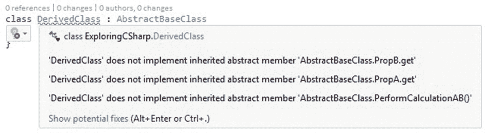
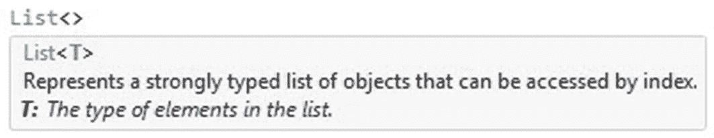
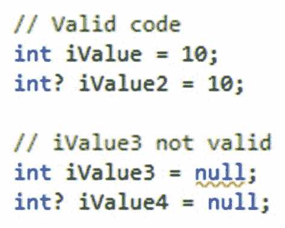

# 二、探索 C#

本章将介绍一些开发人员可能会忽略的 C# 特性。这是我在讨论特定功能时经常听到的一句话:“我听说过它，但以前没用过。”

抽象类和接口等特性。你知道这两者之间的区别吗？你会如何使用其中一个？lambda 表达式怎么样？你以前在日常编码中使用过这个特性吗？

这一章是关于进一步探索 C# 的。我们不会讨论 C# 7 特定的代码，而是讨论 C# 语言的一般特性。将讨论以下主题:

*   使用和实现抽象类

*   使用和实现接口

*   使用 async 和 await 的异步编程

*   利用扩展方法

*   泛型

*   可空类型

*   动态类型

如果不简要回顾一下 C# 的历史，讨论 C # 的特性是不完整的。让我们看看这一切是如何开始的。

## C# 的历史

1999 年 1 月，安德斯·海尔斯伯格和他的团队开始开发这种被称为“酷”的新语言。它代表类似于 C 的面向对象语言的 T2，但是在 2000 年 7 月举行的专业开发者大会上被重新命名为 C#。

有人表示，将名称从 *Cool* 改为 C# 的决定是出于某些商标限制。微软开始寻找另一个名字，但这个名字仍然与 c 有关。

众所周知，C# 中的`++`运算符用于将变量递增 1。鉴于已经有了一种叫做 C++的语言，微软的团队需要想出一些不同但相似的东西。称之为 C+++是行不通的，但是如果你观察四个`+`符号，`#`符号可以被看作是串在一起的四个`+`符号。

这意味着这种类 C 面向对象语言的下一个增量将被称为 C#。对音乐的引用也很有趣，尤其是当人们考虑到`#`是一种将音符提高半音的音乐符号时。表 [2-1](#Tab1) 列出了 C# 的版本以及这些版本中发布的特性。

表 2-1。

C# 这么多年来

<colgroup><col class="tcol1 align-left"> <col class="tcol2 align-left"> <col class="tcol3 align-left"> <col class="tcol4 align-left"> <col class="tcol5 align-left"></colgroup> 
| 

C# 版本

 | 

出厂日期

 | 

。NET 框架

 | 

可视化工作室

 | 

功能概述

 |
| --- | --- | --- | --- | --- |
| C# 1.0 | 2002 年 1 月 | One | 与 2002 年相比 | 类、结构、接口、事件、属性、委托、表达式、语句、属性、文字 |
| C# 1.2 | 2003 年 4 月 | One point one | 与 2003 年相比 | 小的增强，foreach 循环现在在 IEnumerator 上实现 IDisposable 时调用 Dispose |
| C# 2.0 | 2005 年 11 月 | Two | vs2005 | 泛型、分部类型、匿名方法、可空类型、迭代器、协变和逆变。对现有功能的增强，例如 getter 和 setter 的独立可访问性、静态类、委托接口 |
| C# 3.0 | 2007 年 11 月 | 3.0 和 3.5 | vs2008 | 自动实现的属性、匿名类型、查询表达式、lambda 表达式、表达式树、扩展方法、隐式类型化局部变量、分部方法、对象和集合初始值设定项 |
| C# 4.0 | 2010 年 4 月 | four | 与 2010 年相比 | 动态绑定、名称/可选参数、通用协变和逆变、嵌入式互操作类型 |
| C# 5.0 | 2012 年 8 月 | Four point five | 对比 2012 年和 2013 年 | 异步成员(异步和等待)，调用者信息属性 |
| C# 6.0 | 2015 年 7 月 | Four point six | 对比 2015 年 | 静态导入、异常过滤器、自动属性初始值设定项、表达式主体成员、空传播器、字符串插值、运算符名称、索引初始值设定项、catch/finally 中的 await、仅 getter 属性的默认值 |
| C# 7.0 | 2017 年 3 月 | 4.6.2 | VS 2017 | 输出变量、元组、丢弃、模式匹配、局部函数、抛出表达式、通用异步和返回类型、文字语法改进、引用局部变量和返回、更多表达式体成员 |
| C# 7.1 | 2017 年 8 月 | Four point seven | VS 2017 | 异步主方法、默认文字表达式、推断的元组元素名称 |
| C# 7.2 | 2017 年 11 月 | 4.7.1 | VS 2017 | 条件引用表达式、私有受保护访问修饰符、数字文本中的前导下划线、非尾随命名参数、编写安全高效代码的技术 |
| C# 7.3 | 2018 年 5 月 | 4.7.2 | VS 2017 | 重新分配 ref 局部变量，stackalloc 数组上的初始值设定项，对任何支持模式的类型使用 fixed 语句，使用== and 测试元组类型！=，在更多位置使用表达式变量 |

有关 C# 不同版本特性的更多信息，请参考位于 [`https://docs.microsoft.com`](https://docs.microsoft.com) 的微软文档。

既然我们已经看到了我们的进步，让我们来看看本章开始时概述的 C# 的一些具体特性。

## 使用和实现抽象类

在我们看抽象类之前，我们首先需要看一下`abstract`修饰符以及它的意思。`abstract`修饰符只是告诉你被修改的东西没有完整的实现。此修饰符可以与一起使用

*   班级

*   方法

*   性能

*   索引器

*   事件

当我们在类声明中使用`abstract`修饰符时，我们实际上是在说我们正在创建的类只是其他类的基本基类。

这意味着任何标记为抽象的成员或基类中包含的成员都必须由派生类(使用基类的类)实现。你还会听说抽象类也被称为蓝图。

### 抽象类特征

因此，抽象类具有以下重要特征:

*   您不能创建抽象类的实例。

*   抽象类可以包含抽象方法和访问器。

*   不能对抽象类使用`sealed`修饰符。

*   如果一个非抽象类是从一个抽象类派生的，那么派生类必须包含抽象方法和访问器的实现。

`sealed`修饰符不能用于抽象类的原因是因为`sealed`修饰符阻止类继承，而抽象修饰符要求类必须被继承。

### 抽象方法

在方法或属性声明中使用`abstract`修饰符只是简单地声明

*   抽象方法隐含地是一个虚方法。

*   只能在抽象类中使用抽象方法。

*   抽象方法没有实现；因此它没有方法体。

*   不允许在抽象方法声明中使用`static`或`virtual`修饰符。

当我们说一个抽象方法没有实现，因此没有方法体，这意味着什么？考虑下面的代码清单。

```cs
public abstract void MyAbstractMethod();

Listing 2-1Abstract method declaration

```

这基本上告诉我们，派生类需要实现这个方法，并为这个方法提供实现。

### 抽象属性

当考虑抽象方法时，你会注意到抽象属性的行为方式非常相似。真正的区别在于声明和调用语法:

*   不能在静态属性上使用`abstract`修饰符。

*   通过声明使用`override`修饰符的属性，可以在派生类中重写继承的抽象属性。

当查看一些代码示例时，所有这些将更有意义。接下来让我们来说明抽象类的用法。

### 使用抽象类

为了说明抽象类的使用，我将创建一个非常简单的抽象类。然后它将被继承并在派生类中使用。考虑下面的清单。

```cs
abstract class AbstractBaseClass
{
    protected int _propA = 100;
    protected int _propB = 200;
    public abstract int PropA { get; }
    public abstract int PropB { get; }
    public abstract int PerformCalculationAB();
}

Listing 2-2Abstract class

```

现在我们有了抽象类，让我们去实例化它。如图 [2-1](#Fig1) 所示，我们有一个错误。为什么我们会有错误？


图 2-1。

抽象类实例化时出错

啊哈！记得我之前说过我们不能实例化一个抽象类。编译器显示一个错误，指出您无法创建抽象类的实例。然而，我们可以创建一个新的类，并从抽象类中派生出来。考虑下面的代码清单。

```cs
class DerivedClass : AbstractBaseClass
{

}

Listing 2-3Inheriting from an abstract class

```

我们继承了名为`DerivedClass`的派生类中的抽象类。然后编译器给我们另一个警告，如图 [2-2](#Fig2) 所示。



图 2-2。

派生类实现

编译器告诉你你需要实现抽象类的成员。当你点击灯泡，点击*实现抽象类*时，Visual Studio 会自动为你提供实现结构。这样做之后，您的代码将如清单 [2-4](#PC4) 所示。

```cs
class DerivedClass : AbstractBaseClass
{
    public override int PropA => throw new NotImplementedException();

    public override int PropB => throw new NotImplementedException();

    public override int PerformCalculationAB()
    {
        throw new NotImplementedException();
    }
}

Listing 2-4Implementing the abstract class

```

您会注意到生成的代码将抛出一个`NotImplementedException`。这是有意义的，因为您实际上没有为代码提供任何实现，编译器无法猜测您想在派生类中做什么。让我们给我们的派生类添加一些代码，如清单 [2-5](#PC5) 所示。

```cs
class DerivedClass : AbstractBaseClass
{
    public override int PropA => _propA;

    public override int PropB => _propB;

    public override int PerformCalculationAB()
    {
        _propA += 50;
        _propB += 100;

        return _propA + _propB;
    }
}

Listing 2-5Code implementation added

```

在调用代码中，我们现在可以实例化派生类并写出值。

为此，我简单地使用了一个控制台应用，将`using static System.Console;`添加到`using`语句中。

```cs
static void Main(string[] args)
{
    DerivedClass d = new DerivedClass();
    WriteLine($"PropA before calculation {d.PropA}");
    WriteLine($"PropB before calculation {d.PropB}");
    WriteLine($"Perform calculation {d.PerformCalculationAB()}");
    WriteLine($"PropA after calculation {d.PropA}");
    WriteLine($"PropB after calculation {d.PropB}");
    ReadLine();
}

Listing 2-6Calling the derived class

```

检查我们编写的代码的输出，您将看到显示了两个属性的默认值。执行计算后，我们的属性值发生了变化。

```cs
PropA before calculation 100
PropB before calculation 200
Perform calculation 450
PropA after calculation 150
PropB after calculation 300

Listing 2-7Output from code in derived class

```

控制台应用的输出在这里并不重要。我想向您展示的是一个从您之前创建的抽象类继承而来的派生类的工作示例。

### 我什么时候使用抽象类？

上一节中的代码清单有点抽象(双关语)。为什么不把一个类定义为正常的呢？什么时候应该使用抽象类？

我认为这是许多开发人员可能会思考的问题，但是一旦理解了一个基本概念，使用抽象类的逻辑就非常简单了。

抽象类就像描述派生对象的普通名词。当我们考虑下面的描述时，这被清楚地说明。

轿车、SUV、皮卡、两厢都是车辆。尽管轿车与 SUV 或皮卡有很大不同，但它们都有作为车辆的共性。

因此，车辆必须有发动机、车辆识别号、前灯等等。这些(以及更多)将是车辆之间的共同特征。因此，我们可以声明一个名为`Vehicle`的抽象类，并赋予它这些派生类(轿车、SUV 等)的共同特征。)必须实现。

因此，由派生类将实现添加到抽象类，然后拥有仅特定于派生类的附加属性和方法。例如，皮卡将有一个装载区，而轿车将没有。轿车会有一个行李箱空间。

虽然这个例子相当简单，但它很好地说明了这个概念。一个更真实的例子是使用销售订单和采购订单的 ERP 系统。这两个都是订单，我们可以定义一个名为`Order`的抽象类，它定义了订单号、订单状态、订单行数等等。

派生类`SalesOrder`和`PurchaseOrder`必须都具有这些属性，但是只有销售订单可以包含客户信息，而采购订单将包含供应商信息。

因此，抽象类允许我们清楚地定义密切相关的派生对象之间的共性。

## 使用和实现接口

在上一节中，我们看了一下抽象类。你会记得我说过抽象类就像描述派生对象的普通名词。然而，当提到接口时，我们谈论的是接口包含了对相关功能进行分组的定义这一事实。这意味着实现一个接口的类或结构共享相同的功能。

回想一下我们抽象的车辆类例子。我们说轿车，SUV 等。都是交通工具。因此，抽象的`Vehicle`类告诉我们派生类必须实现什么共同的特征。然而，当提到接口时，我们是说一些或所有的派生类共享某种功能。因此，我们可以把接口看作描述动作的动词。

让我们假设所有的车辆都必须有一个 VIN。这是我们可以用来检查没有两辆车有相同的 VIN 的东西。

VIN 是汽车工业中用于识别机动车辆的唯一车辆识别号。

因此，可以肯定地说，我们可以创建一个名为`IComparable`的接口，它将增加比较车辆 vin 的能力。然后，我们知道不同的车辆有不同的特点。通常你在一辆车上花的越多，它的功能就越多。然而，某些功能只对某些车辆有意义。差速锁(或差速锁)只在某些车辆上才有意义，例如 SUV。

因此，我们可以有把握地说，创建一个名为`IDiffLockable`的接口将增加确定某些车辆是否可以自动差速锁的能力。

请注意，按照惯例，接口通常以 I 开头的名称创建。

接口具有以下属性:

*   这就像一个抽象类；因此，任何实现接口的类或结构都必须实现其成员。

*   您不能直接实例化接口。

*   接口成员由执行实现的类或结构来实现。

*   事件、索引器、属性和方法都可以包含在一个接口中。

*   接口不包含方法的实现。

*   允许在一个类或结构上实现多个接口。

*   您可以从基类继承，也可以实现多个接口。

让我们继续为我们的车辆类创建两个接口，并仔细看看我们将如何使用这些接口。

### 创建抽象和派生类

让我们继续创建一个名为`Vehicle`的抽象类，我们的派生类将继承它。

```cs
abstract class Vehicle
{
    protected int _wheelCount = 4;
    protected int _engineSize = 0;
    protected string _vinNumber = "";
    public abstract string VinNumber { get; }
    public abstract int EngineSize { get; }
    public abstract int WheelCount { get; }
}

Listing 2-8The Vehicle abstract class

```

这个抽象类本质上非常简单，但是它的目的是为我们将要创建的名为`Car`和`SUV`的派生类提供实现成员。

```cs
class Car : Vehicle
{
    public override string VinNumber => _vinNumber;

    public override int EngineSize => _engineSize;

    public override int WheelCount => _wheelCount;

    public Car(string vinNumber, int engineSize, int wheelCount)
    {
        _vinNumber = vinNumber;
        _engineSize = engineSize;
        _wheelCount = wheelCount;
    }
}

Listing 2-9Car class

```

```cs
class SUV : Vehicle
{
    public override string VinNumber => _vinNumber;

    public override int EngineSize => _engineSize;

    public override int WheelCount => _wheelCount;

    public SUV(string vinNumber, int engineSize, int wheelCount)
    {
        _vinNumber = vinNumber;
        _engineSize = engineSize;
        _wheelCount = wheelCount;
    }
}

Listing 2-10SUV class

```

现在我们已经创建了抽象的`Vehicle`类和派生的`Car`和`SUV`类，我们可以继续创建我们的接口了。

### 创建接口

如前所述，我们需要能够比较车辆的 vin，以确保它们确实是唯一的编号。为此，我们将使用`interface`关键字创建一个`IComparable`接口。

```cs
interface IComparable<T>
{
    bool VinNumberEqual(T obj);
}

Listing 2-11
IComparable interface

```

因此，该接口将要求实现该接口的任何类或结构为名为`VinNumberEqual`的方法提供定义，该方法与该接口指定的签名相匹配。

您会注意到在`IComparable`接口中使用了 *T* 类型参数。我们在这里使用一个通用接口，客户端代码决定我们比较的对象的类型。本章稍后将讨论泛型。

换句话说，任何实现 IComparable 的类都必须包含一个名为`VinNumberEqual`的方法。我们还希望能够指定车辆是否具有自动差速锁功能。为此，我们将创建一个名为`IDiffLockable`的接口。

```cs
interface IDiffLockable
{
    bool AutomaticDiff { get; }
}

Listing 2-12
IDiffLockable interface

```

因此，同样的逻辑也适用于这个接口。实现类必须提供一个名为`AutomaticDiff`的属性，该属性将启用或移除车辆的该特性。

### 实现接口

我们现在将在`Car`类上实现`IComparable`接口。`Car`类已经继承了`Vehicle`抽象类。为了实现`IComparable`，我们需要添加如下内容。

```cs
class Car : Vehicle, IComparable<Car>

Listing 2-13Implementing IComparable

```

Visual Studio 现在将提示您实现 IComparable 接口，如图 [2-3](#Fig3) 所示。


图 2-3。

Visual Studio 提示实现接口

当您单击灯泡并实现接口时，您的代码将如下所示。

```cs
class Car : Vehicle, IComparable<Car>
{
    public override string VinNumber => _vinNumber;

    public override int EngineSize => _engineSize;

    public override int WheelCount => _wheelCount;

    public Car(string vinNumber, int engineSize, int wheelCount)
    {
        _vinNumber = vinNumber;
        _engineSize = engineSize;
        _wheelCount = wheelCount;
    }

    public bool VinNumberEqual(Car car)
    {
        return VinNumber.Equals(car.VinNumber);
    }
}

Listing 2-14IComparable interface implemented on Car class

```

接口成员`VinNumberEqual`被添加到您的类中，默认抛出一个`NotImplementedException`。要实现接口方法，添加一些代码，以便在`Car`对象相等时返回一个布尔值。这允许我们通过使用以下代码来检查两辆车的 VIN 是否相等。

```cs
Car car1 = new Car("VIN12345", 2, 4);
Car car2 = new Car("VIN12345", 2, 4);
WriteLine(car1.VinNumberEqual(car2) ? "ERROR: Vin numbers equal" : "Vin numbers unique");

Listing 2-15Checking the VIN of two Car classes

```

这个简单的例子向我们展示了如何使用接口向类添加功能，因为类和结构必须实现接口成员。

但是`SUV`类呢？它需要实现`IComparable`和`IDiffLockable`接口。我们按如下方式做这件事。

```cs
class SUV : Vehicle, IComparable<SUV>, IDiffLockable
{

}

Listing 2-16Implementing IComparable and IDiffLockable

```

Visual Studio 现在还提示您在`SUV`类上实现接口。当我们完成了这些并添加了您实现的代码后，您的类将如下所示。

```cs
class SUV : Vehicle, IComparable<SUV>, IDiffLockable
{
    public override string VinNumber => _vinNumber;

    public override int EngineSize => _engineSize;

    public override int WheelCount => _wheelCount;

    public bool AutomaticDiff { get; } = false;

    public SUV(string vinNumber, int engineSize, int wheelCount, bool autoDiff)
    {
        _vinNumber = vinNumber;
        _engineSize = engineSize;
        _wheelCount = wheelCount;
        AutomaticDiff = autoDiff;
    }

    public bool VinNumberEqual(SUV suv)
    {
        return VinNumber.Equals(suv.VinNumber);
    }
}

Listing 2-17SUV class with implemented interfaces

```

我们正在实施 VIN 检查和自动 difflock 功能。

有时我们会遇到这样的情况，两个接口有相同的方法，但是有不同的实现。这很容易导致一个或两个接口的错误实现。正是因为这个原因，我们才能够显式地实现接口成员。

能够使用接口允许您从单个接口扩展几个类的功能。使用接口是因为它可以应用于一个或多个(但不是所有)类。很明显，事实上只有`IDiffLockable`在`SUV`类上实现，而`IComparable`在`Car`和`SUV`类上都实现了。

## 使用 Async 和 Await 的异步编程

异步编程将允许您编写能够执行长时间运行任务的代码，同时仍然保持应用的响应性。随着异步在。NET Framework 4.5，它简化了以前在应用中实现异步功能的复杂方法。

在这一节中，我们将看看如何使用 async 和 await，以及它们如何有利于您的开发工作。

### 如何编写异步方法？

要编写异步方法，使用`async`和`await`关键字是必要的。以下几点是异步方法的典型特征:

*   方法签名必须包括`async`修饰符。

*   该方法必须返回`Task<T>`、`Task`、`void`或`ValueTask<T>`。

*   方法语句必须包括至少一个`await`表达式。

*   按照惯例，你的方法名应该以 *Async* 结尾。

为了说明异步代码的概念，您将创建一个 Windows 窗体项目，该项目读取一个大文件，并在处理文件中的每行文本时计算它读取的行数。

为此，我下载了一个包含《战争与和平》文本的大型文本文件。然后，我将该文本复制了几次，创建了一个非常大的文本文件。

我们的应用将处理该文件，并更新 UI 上的标签，以通知用户已经读取了多少行。在整个过程中，应用将保持完全响应。

基本表单设计(图 [2-4](#Fig4) )包括一个标签，用于跟踪当前计算的行数，另一个标签将显示该过程完成后读取的总行数。它还有一个用于启动文件读取的按钮。


图 2-4。

响应式表单设计

在后面的代码中，您将添加一个名为`ReadFileAsync`的异步方法。在这里，我们将添加我们的异步文件读取逻辑。

```cs
private async Task<int> ReadFileAsync()
{
    var FileLines = new List<string>();
    int lineCount = 0;
    using (var reader = File.OpenText(@"C:\temp\big_file.txt"))
    {
        string line = string.Empty;
        while ((line = await reader.ReadLineAsync().ConfigureAwait(false)) != null)
        {
            FileLines.Add(line);
            lineCount += 1;

            if (lblLinesRead.InvokeRequired)
            {
                lblLinesRead.Invoke(new Action(() => lblLinesRead.Text = lineCount.ToString()));
            }
            else
            {
                lblLinesRead.Text = lineCount.ToString();
            }
        }
    }

    return lineCount;
}

Listing 2-18
ReadFileAsync async method

```

您会注意到，我在 label 控件上使用了`InvokeRequired`方法来更新 text 属性，因为我们与创建 label 控件的线程在不同的线程上。如果您试图在这里更新标签上的 text 属性而不使用`InvokeRequired`，您将收到一个跨线程冲突错误。

接下来，您需要将按钮点击事件更改为异步，并在`ReadFileAsync`方法上调用 await。代码将如下所示。

```cs
private async void btnReadBigFile_Click(object sender, EventArgs e)
{
    int linesInFile = await ReadFileAsync();
    lblCompletedLineCount.Text = linesInFile.ToString();
}

Listing 2-19
Button click event

```

运行您的应用，点击*读取大文件*按钮(图 [2-5](#Fig5) )开始文件读取过程。请注意，在整个文件读取过程中，您可以移动 Windows 窗体并调整其大小。


图 2-5。

响应文件读取应用

只有在文件读取过程完成时，才会更新*行计数*标签。这很棒，我们有一个非常简单的异步方法。但是后台发生了什么呢？编译器是如何做到这一切的呢？

### 在后台

让我们继续，使用一个反编译器来查看我们的异步`ReadFileAsync`方法生成的代码。

我用的是 Redgate 的试用版。NET Reflector 来看看编译器生成的代码。


图 2-6。

原始异步 ReadFileAsync 方法

回头看看我们最初的异步`ReadFileAsync`方法，你会注意到它实际上是一个非常简单的代码(图 [2-6](#Fig6) )。它符合前面详述的异步方法的特征。

```cs
[CompilerGenerated]
private sealed class <ReadFileAsync>d_ 3 : |AsyncStateMachine
{
   // Fields
    public int <>1_state;
    public AsyncTaskMethodBuilder<int> <>t_builder;
    public Form1 <>4_ this;
    private Form1.<>c_DisplayClass3_0 <>8_1;
    private List<string> <FileLines>5_2;
    private StreamReader <reader>5_3;
    private string <line>5_4;
    private string <>s_5;
    private ConfiguredTaskAwaitable< string>.ConfiguredTaskAwaiter <>u_1;

    // Methods
    public <ReadFileAsync>d_3();
    private void MoveNext();
    [DebuggerHidden]
    private void SetStateMachine(|AsyncStateMachine stateMachine);
}

Listing 2-20Compiler generated code for the async ReadFileAsync method

```

然而，编译器生成的代码完全不同。作为开始，编译器实际上生成了一个类。在原始代码中，我们创建了一个方法。这里我们看到编译器创建了一个实现`IAsyncStateMachine`接口的密封类。

然后，`ReadFileAsync`方法中的所有变量现在都是密封类中的字段。这意味着我们在方法中创建的变量被捕获为用于管理本地状态的状态机中的字段。如果我们的`ReadFileAsync`方法被传递了一个参数，它也会被捕获为密封类中的一个字段。

再往下看，你会注意到一个叫做`MoveNext`的方法。状态机被编码到一个`MoveNext`中，每个步骤都会调用它。它用一个名为`num`的变量跟踪一个整数状态，并用它来执行代码。

因此，每次我们的代码调用`await`，就会有另一个状态和`MoveNext`来管理我们的异步方法的状态。

```cs
private void MoveNext()
{
    int num = this.<>1__state;
    try
    {
        if (num != 0)
        {
            this.<>8__1 = new Form1.<>c_DisplayClass3_0();
            this.<>8__1.<>4_this = this.<>4_ this;
            this.<FileLines>5__2 = new List<string>();
            this.<>8__1.lineCount = 0;
            this.<reader>5__3 = File.OpenText(@"C:\temp\big_file.txt");
        }
        try
        {
            ConfiguredTaskAwaitable<string>.ConfiguredTaskAwaiter awaiter;
            if (num == 0)
            {
                awaiter = this.<>u__1;
                this.<>u__1 = new ConfiguredTaskAwaitable<string>.ConfiguredTaskAwaiter();
                this.<>1__state = num = -1;
            }

            else
            {
                this.<line>5__4 = string.Empty;
                goto TR_0014;
            }
        TR_0010:
            this.<>s__5 = awaiter.GetResult();
            if ((this.<line>5__4 = this.<>s__5) != null)
            {
                this.<FileLines>5__2.Add(this.<line>5__4);
                this.<>8__1.lineCount++;
                if (!this.<>4__this.lblLinesRead.InvokeRequired)
                {
                    this.<>4__this.lblLinesRead.Text = this.<>8__1.lineCount.ToString();
                }
                else
                {
                   Action method = this.<>8__1.<>9__0;
                    if (this.<>8__1.<>9__0 == null)
                    {
                        Action local1 = this.<> 8__1.<>9__0;
                        method = this.<>8__1.<>9__0 = new Action(this.<>8__1.<ReadFileAsync>b__0);
                    }
                    this.<>4__this.lblLinesRead.Invoke(method);
                }

                goto TR_0014;
            }
            else
            {
               this.<>s__5 = null;
               this.<line>5__4 = null;
            }
            goto TR_0003;
        TR_0014:
            while (true) 

            {
                awaiter = this.<reader>5__3.ReadLineAsync().ConfigureAwait(false).GetAwaiter();
                if (awaiter.lsCompleted)
                {
                    goto TR_0010;
                }
                else
                {
                    this.<>1__state = num = 0;
                    this.<>u__1 = awaiter;
                    Form1.<ReadFileAsync>d__3 stateMachine = this;
   this.<>t__builder.AwaitUnsafeOnCompleted<ConfiguredTaskAwaitable<string>.Configured
                }
                break;
            }
            return;
        }
        finally
        {
            if ((num < 0) && (this.<reader>5__3 != null))
            {
                this.<reader>5__3.Dispose();
            }
        }

    TR_0003:
        this.<reader>5__3 = null;
        int lineCount = this.<>8__1.lineCount;
        this.<>1__state = -2;
        this.<>t_builder.SetResult(lineCount);
    }
    catch (Exception exception)
    {
        this.<>1__state = -2;
        this.<>t_builder.SetException(exception);
    }
}

Listing 2-21MoveNext method for state machine

```

整个`MoveNext`方法被包装在一个`try / catch`块中。这意味着即使你的异步方法没有`try / catch`处理程序，任何异常仍然会被捕获。这就是`await`能够在调用代码中重新抛出异常的方式。

### 一些最后的提示

async 和 await 的话题很大，要学的东西很多。这种学习的大部分将通过编写代码和犯错误来完成。这里有一些可能有助于缓解学习曲线的提示。

#### 避免使用 Wait()

通常认为在以下情况下避免使用`Wait`是最佳做法。请看下面的伪代码清单。

```cs
async Task PerformSomeLongRunningOperation()
{
    DoSomeWork(false).Wait();
}

async Task DoSomeWork(bool blnToggleIsOn)
{
    // Some work is done here
}

Listing 2-22Using Wait

```

在我们的异步`PerformSomeLongRunningOperation`方法中，我们有一个对`DoSomeWork`的调用，它传递一个布尔值作为参数并调用`Wait`。这样做对我们使用 async 和 await 没有任何好处，因为`Wait`正在阻塞代码。

因为`DoSomeWork`异步方法返回一个任务，我们应该使用 await。然后，我们的代码需要进行如下更改。

```cs
async Task PerformSomeLongRunningOperation()
{
    await DoSomeWork(false);
}

Listing 2-23Using await

```

如果出于某种原因我们必须同步运行`DoSomeWork`异步方法，我们需要使用`GetAwaiter`和`GetResult`，如下面的代码清单所示。

```cs
async Task PerformSomeLongRunningOperation()
{
    DoSomeWork(false).GetAwaiter().GetResult();
}

Listing 2-24Using GetAwaiter and GetResult

```

从本质上来说，`GetAwaiter GetResult`做的事情和 Wait(也就是 block)一样，但是唯一的区别是`GetAwaiter GetResult`将解开任何在`DoSomeWork`方法中抛出的异常。

#### 必要时使用 configurewait(false)

当使用 Windows 窗体应用时，应用使用 UI 线程。这意味着该上下文是一个 UI 上下文。对于 web 应用来说也是如此。当响应 ASP.NET 请求时，上下文是 ASP.NET 请求上下文。如果既不使用 UI 也不使用请求上下文，则使用线程池。

如果你的代码没有接触 UI，那么使用`ConfigureAwait(false)`告诉异步方法不要在上下文中继续。然后，它将在线程池中的一个线程上继续。如果设置为 true，则代码会尝试将延续封送回原始上下文。

## 利用扩展方法

从 C# 3.0 开始，扩展方法已经对我使用代码的方式产生了巨大的影响。我能够在不创建新的派生类型的情况下向现有类型添加方法。《C# 编程指南》将扩展方法描述为一种特殊的静态方法。唯一的区别是，它们被调用时就好像它们是被扩展的类型上的实例方法一样(即，通过使用实例方法语法来调用)。

但是到底什么才是有用的扩展方法呢？让我们看一个扩展方法的例子。

### 检查字符串是否是有效的整数

我将使用的例子非常简单。您将检查一个字符串值是否是一个有效的整数。首先创建一个包含静态扩展方法的静态类。

请注意，括号中的第一个参数是对正在扩展的内容的引用。换句话说，`this String`指的是这个扩展方法作用的类型。它作用于琴弦。

这就是这个扩展方法的全部内容。它接受被扩展类型的值，并检查它是否可以被解析为整数。然后将 true 或 false 返回给调用代码。考虑下面的代码清单。

```cs
public static class ExtensionMethods
{
    public static bool IsValidInt(this String value)
    {
        bool blnValidInt = false;
        if (int.TryParse(value, out int result))
        {
            blnValidInt = true;
        }
        return blnValidInt;
    }
}

Listing 2-25Extension method example

```

在字符串变量上调用扩展方法`IsValidInt`时，您会注意到智能感知将其标记为一个带有向下箭头的正方形(图 [2-7](#Fig7) )。这表示智能感知窗口中的扩展方法。在智能感知窗口打开时按下 *Alt+X* ，将只显示扩展方法。令人惊讶的是有这么多扩展方法。


图 2-7。

扩展方法智能感知

另一件要注意的事情是，因为您指定了 extension 方法只扩展 string 类型，所以它显然不能用于 Boolean 等其他类型。您可以通过向扩展方法参数添加`this String value`来实现这一点。

如果您希望这个扩展方法扩展另一个类型，您需要在扩展方法的签名中指定这一点。

```cs
string strInt = "123";
if (strInt.IsValidInt())
{
    WriteLine("Valid Integer");
}
else
{
    WriteLine("Not an Integer");
}

Listing 2-26Calling IsValidInt

```

还可以向扩展方法传递附加参数。在下一个示例中，如果整数值是有效的整数，我们将返回它。这可以很容易地用 out 参数来完成，如下所示。

```cs
public static bool IsValidInt(this String value, out int integerValue)
{
    bool blnValidInt = false;
    integerValue = 0;
    if (int.TryParse(value, out int result))
    {
        blnValidInt = true;
        integerValue = result;
    }
    return blnValidInt;
}

Listing 2-27Passing argument to an extension method

```

这允许您非常灵活地使用扩展方法。

### 扩展方法的优先级低于实例方法

不过要注意的一点是，扩展方法的优先级低于类型本身中定义的实例方法。扩展方法将扩展一个类或接口，但不会覆盖它们。

当遇到方法调用时，编译器将总是在类型的实例方法中寻找匹配。此后，它将搜索为该类型定义的任何扩展方法。

有时，您可能会看到一个错误，指出某个类型不包含您调用的方法的定义，并且找不到接受该类型作为第一个参数的可访问扩展方法。这是编译器试图找到你调用的东西，但是找不到。最后提到扩展方法也很有意思。

最好用一个例子来说明这一点。继续创建下面的类。

```cs
public class WorkerClass
{
    public void DoSomething()
    {
        Console.WriteLine("I am a method of the WorkerClass");
    }
}

Listing 2-28Class with DoSomething method

```

接下来，创建一个名为`DoSomething`的扩展方法。

```cs
public static void DoSomething(this Car value)
{
    Console.WriteLine("I am an extension method");
}

Listing 2-29Extension method DoSomething

```

创建该类的一个实例并运行代码将显示文本*我是 WorkerClass* 的一个方法。

```cs
WorkerClass worker = new WorkerClass();
worker.DoSomething();

Listing 2-30Calling the DoSomething method

```

这意味着永远不会调用扩展方法，因为类的`DoSomething`方法比扩展方法具有更高的优先级，并且两个方法的签名是相同的。

如果你必须改变`DoSomething`扩展方法的签名，扩展方法将被调用。考虑下面的代码清单。

```cs
public static void DoSomething(this WorkerClass value, int iValue)
{
    Console.WriteLine($"I am an extension method with parameter {iValue}");
}

Listing 2-31DoSomething method with changed signature

```

如果你用`worker.DoSomething(5);`调用扩展方法，控制台应用将输出文本*我是一个带参数 5* 的扩展方法。这是因为类上的`DoSomething`方法和`DoSomething`扩展方法的签名是不同的。

## 泛型

从 C# 2 开始，泛型就伴随着我们。目标是允许开发人员在维护类型安全的同时重用代码。请将泛型视为一个蓝图，它允许您定义类型安全的数据结构，而无需实际定义类型。

例如，对于泛型，调用代码在实例化泛型类时决定类型。稍后您将看到，我们创建的泛型类将允许收集混合类型。

您可能不知道，但是您实际上一直在使用泛型。泛型用于 LINQ、列表(图 [2-8](#Fig8) )、字典等等。这些结构中的代码专注于管理代码，而不必担心类型。



图 2-8。

T 列表

回想一下你创建`List<>`的时候。这使用泛型，并允许您在创建列表时指定类型。你可以创建一个整数列表，就像创建一个双精度列表或者你自己定制的类列表一样简单。

按照惯例，T 在泛型中用来表示使用泛型类型参数。

当创建一个泛型类时，我们可以给它一个泛型类型参数，如下所示。

```cs
public class VehicleCarrier<T>

Listing 2-32VehicleCarrier of T

```

`T`用在尖括号之间，您可以定义多个类型参数。`T`因此被用作你的类定义的一个参数。我们也可以说`T`参数化了你将在类中使用的类型。

你可以对数组做同样的事情。

```cs
private T[] _loadbay;

Listing 2-33Array of T

```

您没有定义整数数组，而是定义了一个`T`数组。如果在我的类内部使用，`T`将是在类型参数中传递给类的类型。

### 非通用运载工具类别

让我来说明使用泛型的好处。在下面的代码清单中，我有一个用于保存一组`Car`对象的类。

想想汽车工业中用来运输车辆的卡车。

在我的`VehicleCarrier`类中，我有一个`_capacity`，它只允许我将特定数量的`Car`对象添加到`_loadbay`数组中。我不能添加超过容量变量中定义的最大数量的车辆。

```cs
public class VehicleCarrier
{
    private Car[] _loadbay;
    private int _capacity;

    public VehicleCarrier(int capacity)
    {
        _loadbay = new Car[capacity];
        _capacity = capacity;
    }

    public void AddVehicle(Car vehicle)
    {
        var loaded = _loadbay.Where(x => x != null).Count();
        if (loaded == _capacity)
        {
            Console.WriteLine($"Vehicle Carrier filled to capacity {_capacity}.");
        }
        else
        {
            _loadbay[loaded] = vehicle;
        }
    }

    public void GetAllVehicles()
    {
        foreach (Car vehicle in _loadbay)
        {
            Console.WriteLine($"Vehicle with VIN number {vehicle.VinNumber} loaded");
        }
    }
}

Listing 2-34Non-generic VehicleCarrier class

```

这个`VehicleCarrier`类所做的就是包含汽车的集合，并将它传递到我代码中的其他地方。当我需要检查载体时，我可以输出所有包含在`VehicleCarrier`类中的汽车的 vin。为了使用这个类，我可以创建一些`Car`对象并将它们添加到一个列表中。

注意，如前所述，通过在代码中使用 T 列表，您已经在这里使用泛型了。在这种情况下，您正在创建一个汽车列表。

然后这个列表被添加到我的车辆承运人类别中。

```cs
//Without Generics
Car car1 = new Car("123", 2, 4);
Car car2 = new Car("456", 3, 4);
Car car3 = new Car("789", 2, 4);

List<Car> carList = new List<Car>(new Car[] { car1, car2, car3 });

VehicleCarrier carrier = new VehicleCarrier(3);
foreach (var vehicle in carList) 

{
    carrier.AddVehicle(vehicle);
}

carrier.GetAllVehicles();

Listing 2-35Using non-generic VehicleCarrier class

```

当我调用`GetAllVehicles`方法时，该类的输出只是包含在`VehicleCarrier`类中的每个`Car`对象的 vin。

```cs
Vehicle with VIN number 123 loaded
Vehicle with VIN number 456 loaded
Vehicle with VIN number 789 loaded

Listing 2-36Console window output from non-generic VehicleCarrier class

```

`VehicleCarrier`类(图 [2-9](#Fig9) )是收集和移动`Car`对象的好方法，但不幸的是，我只能用它来处理`Car`对象。


图 2-9。

错误

我将无法使用我的`VehicleCarrier`类来传输`SUV`对象。这样做会导致编译器错误。因此，我们的`VehicleCarrier`类的功能非常有限。我们不能灵活使用它，因为它只接受`Car`对象。

### 将车辆承运人类别更改为通用类别

让我们对`VehicleCarrier`类做一些修改，使它更加灵活。我将从向我的类添加一个泛型类型参数开始。这里我告诉编译器我的类将使用一种类型的`T`。

我现在能够将我的`_loadbay`定义为一个`T`的数组。事实上，在我的`VehicleCarrier`类中，我可以用`T`替换`Car`类型。

下面的代码清单是修改过的`VehicleCarrier`类，也包含了一个使用模式匹配的活跃的`GetAllVehicles`方法。

```cs
public class VehicleCarrier<T>
{
    private T[] _loadbay;
    private int _capacity;

    public VehicleCarrier(int capacity)
    {
        _loadbay = new T[capacity];
        _capacity = capacity;
    }

    public void AddVehicle(T vehicle)
    {
        var loaded = _loadbay.Where(x => x != null).Count();
        if (loaded == _capacity)
        {
            Console.WriteLine($"Vehicle Carrier filled to capacity {_capacity}.");
        }

        else
        {
            _loadbay[loaded] = vehicle;
        }
    }

    public void GetAllVehicles()
    {
        foreach (T vehicle in _loadbay)
        {
            switch (vehicle)
            {
                case Car car:
                    Console.WriteLine($"{car.GetType().Name} with VIN number {car.VinNumber} loaded");
                    break;
                case SUV suv:
                    Console.WriteLine($"{suv.GetType().Name} with VIN number {suv.VinNumber} loaded");
                    break;
                default:
                    Console.WriteLine($"Vehicle not determined");
                    break;
            }
        }
    }
}

Listing 2-37Generic VehicleCarrier class

```

这允许我创建一个`SUV`对象的列表，并将其传递给我的`VehicleCarrier`类。我不再局限于只在我的`VehicleCarrier`类中使用`Car`对象。

```cs
// With Generics
SUV suv1 = new SUV("123", 2, 4, false);
SUV suv2 = new SUV("456", 3, 4, false);
SUV suv3 = new SUV("789", 2, 4, false);

List<SUV> carList = new List<SUV>(new SUV[] { suv1, suv2, suv3 });

VehicleCarrier<SUV> carrier = new VehicleCarrier<SUV>(3);
foreach (var vehicle in carList) 

{
    carrier.AddVehicle(vehicle);
}

carrier.GetAllVehicles();

Listing 2-38Using generic VehicleCarrier class

```

调用方法`GetAllVehicles`返回包含在我的类中的`SUV`对象的 vin。

```cs
SUV with VIN number 123 loaded
SUV with VIN number 456 loaded
SUV with VIN number 789 loaded

Listing 2-39Console window output from generic VehicleCarrier class

```

这意味着我可以使用同一个`VehicleCarrier`类创建一个`Car`的`VehicleCarrier`和一个`SUV`的`VehicleCarrier`。看到好处了吗？

#### 混合搭配

我还能够通过指定我的`VehicleCarrier`类与类型`object`一起使用来混合和匹配。这允许我创建一个由`Car`和`SUV`对象组成的`List`，并将其添加到我的`VehicleCarrier`类中。

```cs
SUV suv1 = new SUV("123", 2, 4, false);
Car car1 = new Car("456", 3, 4);
SUV suv3 = new SUV("789", 2, 4, false);

List<object> carList = new List<object>(new object[] { suv1, car1, suv3 });

VehicleCarrier<object> carrier = new VehicleCarrier<object>(3);
foreach (var vehicle in carList)
{
    carrier.AddVehicle(vehicle);
}

carrier.GetAllVehicles();

Listing 2-40Loading SUV and Car classes

```

我现在可以调用`GetAllVehicles`方法，该方法使用 switch 语句和模式匹配来输出它正在处理的特定对象的 VIN。

```cs
SUV with VIN number 123 loaded
Car with VIN number 456 loaded
SUV with VIN number 789 loaded

Listing 2-41Generic VehicleCarrier class of object output

```

我的`T`的泛型`VehicleCarrier`现在完全是泛型和高性能的。它减少了代码重复，并允许我在应用中有更多的灵活性。

### 概述和更多关于泛型的内容

当我们用尖括号`<>`结束一个类时，我们称之为泛型类。然而，泛型并没有就此止步。我们也可以有泛型结构、泛型接口和泛型委托。如前所述，`T`代表类型参数。它定义了一个泛型类(例如)将处理什么类型的数据。

只是一个习惯用法，但是你可以使用任何你想用的名字。无论如何，坚持`T`的惯例可能是个好主意。

因此，t 就像一个占位符，可以在整个类中需要定义类型的地方使用。这可以是字段、局部变量、传递给方法的参数或方法的返回类型。

因此，使用泛型类的调用代码负责通过传递类型参数来定义将在整个类中使用的类型。在我们的例子中，这是代码的`VehicleCarrier<Car>`部分。

### 泛型和集合

C# 中的集合管理和组织数据。你肯定知道 List，如果你还记得前面，我们看到 List 是通用的。因此，我们可以考虑如下列表。

```cs
public class List<T>
{
    public void Add(T listItem);
}

Listing 2-42List of T

```

我们需要知道何时使用哪个集合来管理我们的数据。如果我们想尽可能提高效率，这是有意义的。下面是泛型集合及其用途的摘要。

#### 列表

`List<T>`保存数据类型的集合。当达到列表的容量时，它会将容量翻倍以容纳更多数据。因此`List<T>`可以根据需要增长。

#### 队列〔t0〕

把`Queue<T>`想象成你站在银行里的一个队列。如果有人在你之后进入银行，但在你之前得到帮助，你可能会有点不安。这是因为你是第一个，而且等待的时间更长。`Queue<T>`完全一样。它提供了对条目进行排队的`Enqueue`方法和按照添加顺序删除条目的`Dequeue`方法。我们称之为*先进先出*或 FIFO 集合。

#### 堆栈

当想到`Stack<T>`时，想象一罐品客薯片。打开盖子首先看到的酥脆是最后加入罐头的酥脆。堆栈< T >也是如此，因为它使用*后进先出*或 LIFO。为此，它公开了方法`Push`和`Pop`。你把一个项目推到堆栈上，然后从顶部弹出堆栈。

#### 哈希集

如果您需要一个集合只包含唯一的项目，您可以使用一个`HashSet<T>`。它将只允许独特的项目。为了做到这一点，无论添加成功与否，`Add`方法都会返回一个`true`或一个`false`。一个`HashSet<T>`可以很好地处理值类型。然而，它对于对象和引用类型来说并不太好，除非您创建一个对象的实例并添加它。

#### 链接列表〔t0〕

`LinkedList<T>`将会给你更多的控制来管理链表中的条目。它通过公开一个`Next`和一个`Previous`方法来做到这一点。还提供了`AddFirst`、`AddLast`、`AddBefore`、`AddAfter`等灵活的插入方式。

#### 字典

这是另一个你可能习惯使用的集合。字典通过使用一个键来提供数据的快速查找。因此，字典有一个`Key`和一个`Value`，我们称之为键值对。

#### 分类字典

如果你需要一个有序的数据集合，那么考虑一下`SortedDictionary<TKey, TValue>`。这个通用集合知道如何对它包含的现成数据进行排序。项目按关键字排序。如果你的键是一个字符串，那么它将按字母顺序排列你的数据。如果你经常查阅资料，你需要使用分类词典。它针对数据的添加和删除进行了优化。

#### 排〔t0〕

如果您需要一个高效的通用集合，它还提供存储在其中的排序项，那么可以考虑使用一个`SortedList<TKey, TValue>`。排序列表被优化以使用尽可能少的内存。

#### 排序集

如果您需要一个只允许唯一项目的排序集合，您将需要使用一个`SortedSet<T>`。像我们之前看到的`HashSet<T>`一样，它只允许唯一的条目，但是是按顺序排序的。

### 通用接口

泛型还允许你创建泛型接口。您会记得在关于接口的章节中，我们创建了一个`IComparable`通用接口。这一次，我们将创建一个接口来定义`VehicleCarrier`类的功能。如果我们需要创建在功能上略有不同的其他类型的载体，这是很有用的。

想象一下，我们需要一个可以动态添加车辆并且没有固定容量的车辆承运商。基于上一节关于*泛型和集合*的内容，您可能记得`List<T>`可以在这里帮助我们。我们的通用接口将如下所示。

```cs
public interface ICarrier<T>
{
    void AddVehicle(T value);
    void GetAllVehicles();
}

Listing 2-43Generic ICarrier interface

```

您会注意到泛型接口也接受泛型类型参数。这里我们说这个接口必须要求任何实现它的类有一个`GetAllVehicles`方法和一个接受值`T`的`AddVehicle`方法。现在我们能够修改现有的`VehicleCarrier`类来实现`ICarrier<T>`。

```cs
public class VehicleCarrier<T> : ICarrier<T>
{

}

Listing 2-44Modifying VehicleCarrier class

```

我们还可以创建一个新的 DynamicCarrier 类，随着更多车辆的加入，该类将调整其容量。考虑下面的代码。

```cs
public class DynamicCarrier<T> : ICarrier<T>
{
    private List<T> _loadbay;

    public DynamicCarrier()
    {
        _loadbay = new List<T>();
    }

    public void AddVehicle(T vehicle) 

    {
        _loadbay.Add(vehicle);
    }

    public void GetAllVehicles()
    {
        foreach (T vehicle in _loadbay)
        {
            switch (vehicle)
            {
                case Car car:
                    Console.WriteLine($"{car.GetType().Name} with VIN number {car.VinNumber} loaded");
                    break;
                case SUV suv:
                    Console.WriteLine($"{suv.GetType().Name} with VIN number {suv.VinNumber} loaded");
                    break;
                default:
                    Console.WriteLine($"Vehicle not determined");
                    break;
            }
        }
    }
}

Listing 2-45DynamicCarrier<T> class implements ICarrier<T>

```

因为`DynamicCarrier<T>`实现了`ICarrier<T>`，所以它必须有`AddVehicle`和`GetAllVehicles`方法。我现在可以自由地向所有实现`ICarrier<T>`的类添加逻辑，只需简单地添加到接口本身。虽然`VehicleCarrier<T>`和`DynamicCarrier<T>`都服务于相同的目的(运输车辆)，但其中包含的逻辑却大不相同。

有关接口的概述，请参考本章开头的接口部分。

## 可空类型

在 C# 中，所有引用类型(如字符串和程序定义的对象)都是可空的。实际上，`null`是引用类型变量的默认值。这意味着虽然它们可以是`null`，但我们实际上需要将`null`关键字视为表示`null`引用的文字。换句话说，不引用。NET 框架。

随着 C# 2.0 的发布，我们引入了可空值类型。如果你看一下`System.Nullable`名称空间(图 [2-10](#Fig10) ，你会注意到我们在这里处理的是一个泛型类型。


图 2-10。

系统。可空

这意味着我们现在可以创建一个`Nullable<int>`并将从`MinValue`到`MaxValue`的任意整数值赋给它，包括`null`。其余的值类型也是如此。

### 可空类型的一些特征

当我们谈论 C# 中的可空类型时，以下是正确的:

*   因为引用类型已经支持 null，所以可为 null 的类型只适用于值类型。

*   `Nullable<T>`也可以简称为`T?`

*   因为值类型可以为空，所以可以使用`HasValue` readonly 属性来测试`null`，然后使用 readonly `Value`属性来获取它的值。

*   您可以对可空类型使用`==`和`!=`运算符。

*   C# 7.0 允许使用模式匹配来检查`null`并获取值。

*   您可以使用 null-coalescing 操作符来检查`null`，如果是`null`，则为底层类型赋值。

虽然我们已经定义了什么是可空类型，但是我们到底如何使用它们呢？更重要的是，我们为什么要使用它们？有时你可能会期望在某些情况下将`null`赋值给值类型。能够将值类型定义为可空允许您编写更好、更安全的代码。考虑下面的代码清单。

### 使用可空类型

在下图中(图 [2-11](#Fig11) ，你会看到我可以给`iValue`整数赋值，也可以给可空的`iValue2`整数赋值。试图将`null`赋给`iValue3`整数给我一个编译器错误。



图 2-11。

iValue4 可空类型允许空值

当使用 int 的可空值类型时，请考虑以下逻辑。它检查`iValue2`变量是否有值，如果有，将值赋给变量`iValue`。

```cs
// Valid code
int iValue = 10;
int? iValue2 = null;

if (iValue2.HasValue)
{
    iValue = iValue2.Value;
}
else
{
    iValue = -1;
}

Listing 2-46Checking a nullable type with HasValue

```

在前面的代码清单中，控制台应用将返回一个`-1`，因为`iValue2`变量的值是`null`。使用零合并操作符，我们可以通过编写如下代码块来极大地简化代码。

```cs
int? iValue2 = null;
int iValue = iValue2 ?? -1;

Listing 2-47Using a null-coalescing operator

```

多时髦啊。我们的代码已经减少到两行代码，它做的事情与清单 [2-46](#PC46) 中的完全一样。有了 C# 7.0，我们现在也能使用模式匹配了。因此，我们可以做到以下几点。

```cs
int iValue = 10;
int? iValue2 = null;
if (iValue2 is int value)
{
    iValue = value;
}
else
{
    iValue = -1;
}

Listing 2-48Use pattern matching

```

如果变量`iValue2`是`null`(在本例中是这样的)，应用将返回`-1`。然而，如果该值不是`null`，变量`iValue`将被设置为`iValue2`的值。

### 窥视可空的内部

在前面的章节中，我们已经了解了`Nullable<T>`的一些特征以及如何使用`Nullable<T>`。但究竟是什么让它(因为找不到更好的词)运转呢？

在引擎盖下窥视，我们看到`Nullable<T>`是一个`struct`(图 [2-12](#Fig12) )。我们还看到了之前讨论过的预期的`HasValue`和`Value`属性。


图 2-12。

可空的引擎盖下

此外，你会注意到我们在与 LINQ 合作时经常看到的`GetValueOrDefault`方法。从图 [2-12](#Fig12) 中的图像，你会注意到这是一个重载的方法。

您可以检索当前`Nullable<T>`对象的值，或者如果我的`Nullable<T>`对象确实是`null`，您可以提供一个默认值。但是如果`Nullable<T>`对象为空，但是您没有提供默认值，会发生什么呢？

在这种情况下，将返回基础类型的默认值。为了演示这一点，请考虑下面的代码。

```cs
int iValue = 10;
int? iValue2 = null;
iValue = iValue2.GetValueOrDefault(-1);
WriteLine($"The value of iValue = {iValue}");

Listing 2-49GetValueOrDefault

```

清单 [2-49](#PC49) 中的代码将返回我们提供的默认值-1。如果`Nullable<T>`对象确实是`null`，我们将为其提供需要返回的默认值。现在删除默认值并再次运行代码。

```cs
int iValue = 10;
int? iValue2 = null;
iValue = iValue2.GetValueOrDefault();
WriteLine($"The value of iValue = {iValue}");

Listing 2-50Default value of the underlying type

```

清单 [2-50](#PC50) 中的代码将返回底层类型的默认值。因为基础类型是整数，所以默认值为 0。表 [2-2](#Tab2) 显示了值类型的默认值。

表 2-2。

值类型的默认值

<colgroup><col class="tcol1 align-left"> <col class="tcol2 align-left"></colgroup> 
| 

默认

 | 

值类型

 |
| --- | --- |
| Zero | int，byte，sbyte，short，uint，ulong，ushort |
| 错误的 | 弯曲件 |
| '\0' | 茶 |
| 0M | 小数 |
| 0.0D | 两倍 |
| 0.0F | 漂浮物 |
| 0L | 长的 |

通过将所有值类型字段设置为该特定类型的默认值并将所有引用类型字段设置为`null`来产生`struct`的默认值。

从 C# 7.1 开始，您可以使用`default`文字表达式用特定于其类型的默认值初始化变量。

```cs
bool? blnValue = default;
int? iVal = default;
double? dblValue = default;
decimal? decVal = default;

WriteLine($"The default values are " +
    $"- blnValue = {blnValue.GetValueOrDefault()} " +
    $"- iVal = {iVal.GetValueOrDefault()} " +
    $"- dblValue = {dblValue.GetValueOrDefault()} " +
    $"- decVal = {decVal.GetValueOrDefault()}");

ReadLine();

Listing 2-51Using the default literal

```

作为开发人员，在 C# 中使用可空类型无疑会给你带来一些好处。能够为基础类型提供默认值也使得避免意外变得非常容易。当处理来自数据库的数据时尤其如此。

## 动态类型

随着 C# 4.0 的发布，开发人员被引入了一种新的`dynamic`类型。它是静态类型，但是`dynamic`对象绕过了静态类型检查。想象它有一个类型`object`。最好用一些代码示例来解释。

```cs
dynamic dObject = "I am dynamic";
WriteLine($"dObject = {dObject}");

dObject = 1;
WriteLine($"dObject = {dObject}");

dObject = false;
WriteLine($"dObject = {dObject}");

dObject = 1.1;
WriteLine($"dObject = {dObject}");

Listing 2-52The dynamic type

```

编译器在编译时不知道变量是什么类型。在`dynamic`类型上没有可用的智能感知也是很符合逻辑的。因此，`dynamic`变量的类型将在运行时确定。清单 [2-52](#PC52) 中的代码将产生以下输出。

```cs
dObject = I am dynamic
dObject = 1
dObject = False
dObject = 1,1

Listing 2-53Dynamic output

```

可以想象，模式匹配与`dynamic`变量配合得相当好。它可以是一个简单的`if (dObject is int iValue) {}`或更复杂的`case`陈述。

```cs
switch (dObject)
{
    case int iObject:
        WriteLine($"dObject is an Integer {iObject}");
        break;
    case bool blnObject:
        WriteLine($"dObject is a bool {blnObject}");
        break;
    case string strObject:
        WriteLine($"dObject is a string {strObject}");
        break;
    case double dblObject:
        WriteLine($"dObject is a double {dblObject}");
        break;
    default:
        WriteLine($"dObject type can't be determined");
        break;
}

Listing 2-54Pattern matching with dynamic variable

```

有趣的是，`dynamic`类型只在编译时存在。在运行时，`dynamic`类型的变量被编译成`object`类型的变量。

您可以在中使用动态

*   菲尔茨

*   性能

*   因素

*   返回类型

*   局部变量

您也可以使用`dynamic`作为转换的目标类型。考虑下面的代码清单。

```cs
dynamic dObj;
bool blnFalse = false;
dObj = (dynamic)blnFalse;

WriteLine($"dObj = {dObj}");

Listing 2-55Conversion to dynamic

```

名为*动态语言运行时(DLR)* 的新 API 被添加到。NET 框架 4。这个 API 支持 C# 中的`dynamic`类型，也支持动态编程语言的实现，例如 IronRuby。

## 包扎

C# 是一种在过去几年中发展很快的语言。对于 C# 7，我们已经看到了更快的点版本，引入了新的特性和改进，您可以在日常开发中使用。

作为一名开发人员，保持与时俱进仍然是一个挑战。微软在 [`https://docs.microsoft.com`](https://docs.microsoft.com) 有在线文档形式的极好资源。

这一章永远不会完整，因为 C# 语言中有太多的内容需要介绍。试图在一章中做到这一点的局限性在页数上是显而易见的。我们看了一下抽象类和什么是接口。然后我们看了 async 和 await，以及它们如何帮助您创建响应性应用。我们还通过查看 async 和 wait 创建的状态机，了解了它们是如何神奇地工作的。

然后我举例说明了扩展方法的使用，以及这个特性可以为您的开发做些什么。我们也看到了泛型在 C# 中扮演了一个重要的角色，并且你很可能一直在使用泛型(想想`List<T>`)。

最后，我们稍微深入地研究了一下`Nullable<T>`以及它是如何组合在一起的，并对`dynamic`类型进行了简单的解释。在下一章，我们将看看 C# 8.0 的新特性。