# 三、C# 8.0 的新特性

C# 的设计过程是开源的。你可以前往位于 [`https://github.com/dotnet/csharplang`](https://github.com/dotnet/csharplang) 的知识库，看看围绕语言设计的一些讨论。事实上，*会议*文件非常吸引人。

一旦你进入了 GitHub repo，就可以在 dotnet/csharplang/meetings 上查看按年份组织的文档集合。

第一件让我印象深刻的事情是，围绕 C# 语言的思维是非常结构化和深思熟虑的。在整个存储库中，您会看到最后提交日期总是很近。因此，这证明了您正在查看的存储库是一个动态文档，您可以跟随它并保持更新。

C# 8.0 呢？事实是，即使 C# 团队发布了 C# 7 的增量点版本(C# 7.1 到 C# 7.3)，他们也在开发 C# 8.0。

本章将介绍 C# 8.0 的以下新特性:

*   可为空的引用类型

*   递归模式

*   范围和指数

*   切换表达式

*   目标类型的新表达式

*   异步流

*   使用声明

为了按照我将在本章中演示的代码清单编写代码，您需要一份 Visual Studio 2019。在撰写本章时，Visual Studio 2019 预览版(版本 16.0.0 预览版 2.0)已经可供下载。

确保如果使用的是 Visual Studio 2019 的预览版，已经从*高级构建设置*中选择了 C# 8.0 (beta)(图 [3-1](#Fig1) )。为此，右击项目并选择*属性*。然后选择*构建*选项卡，然后点击*高级*按钮。

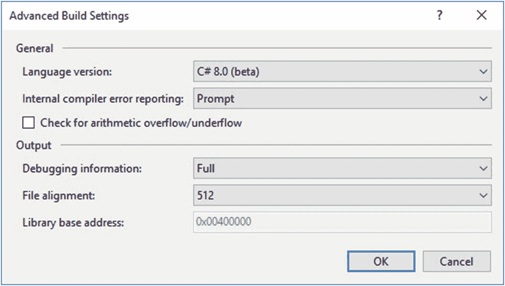

图 3-1。

高级构建设置

请注意，以下文本中说明的一些功能在 C# 8.0 的预览版和最终版本之间可能会有细微的变化。在写这本书的时候，本章的代码在语法上是正确的。

首先，让我们看看什么是可空引用类型。

## 可为空的引用类型

如果你回想一下第 2 章，我们讨论过可空类型。我们说过所有引用类型(比如字符串)都是可空的，引用类型的默认值是`null`。随着 C# 2.0 的发布，微软引入了可空值类型。

我不打算重复引用类型和值类型之间的区别。如果你不确定，我会让你自己去阅读。引用类型现在可以为空这一事实(在我看来)是开发人员长期以来所需要的。使引用类型可空背后的思想是帮助开发人员避免`NullReferenceException`异常。

你应该还记得上一章的内容，为了将一个变量标记为可空，你需要在声明一个变量时使用类型和`?`。例如，`int?`代表一个可空的`int`。现在你可以对引用类型做同样的事情，比如`string?`来声明一个可空的`string`。

这一增加的好处是，你现在可以更清楚地表达你的设计意图。我可以说，一些变量可能有值，而另一些必须有值。

### 启用可为空的引用类型

在 C# 8.0 中，默认情况下不启用此功能。即使您正在创建 C# 8.0 应用，也必须选择可空引用类型特性。打开可空引用类型特性后，所有引用变量声明都将变成*不可空的*引用类型。因此，在启用可空引用类型时，您需要注意这一点。

即使启用了可空引用类型，Visual Studio 也只会在遇到设置为`null`的不可空引用类型时显示警告。

这意味着如果您创建一个引用类型(例如一个`string`变量声明)而没有启用可空引用类型，您将不会看到任何警告。请考虑以下情况。

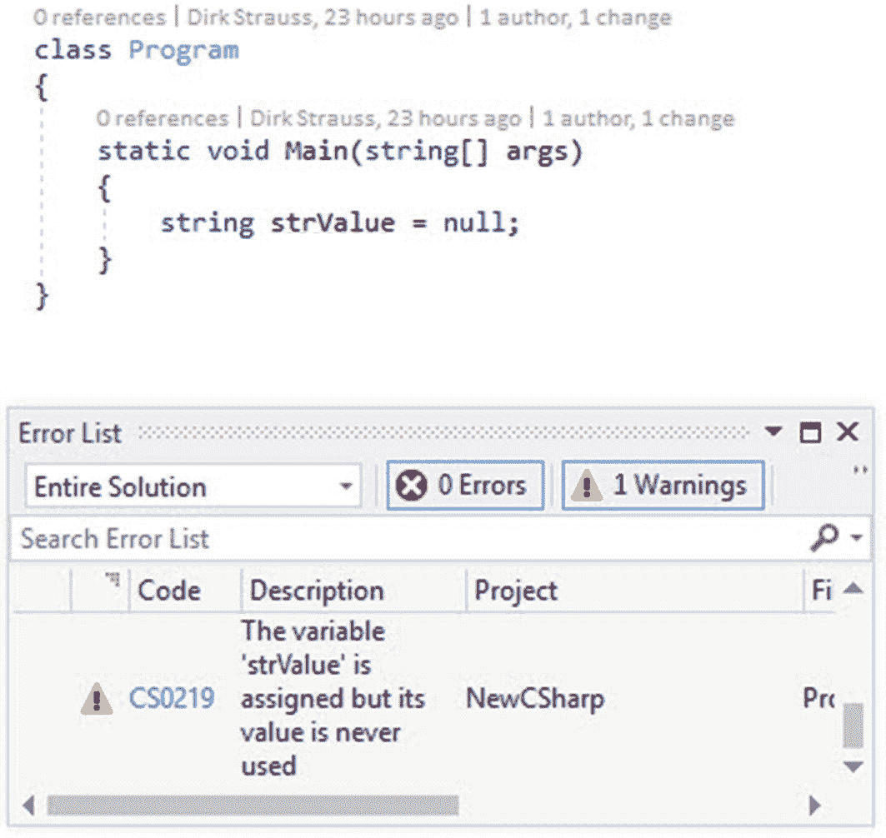

图 3-2。

没有可为空的引用类型警告

图 [3-2](#Fig2) 中显示的警告是已分配的*变量，但从未使用过*警告。要在应用中启用可空引用类型特性，需要在源文件中的任意位置添加一个新的 pragma `#nullable enable`。这将打开可空引用类型特性。

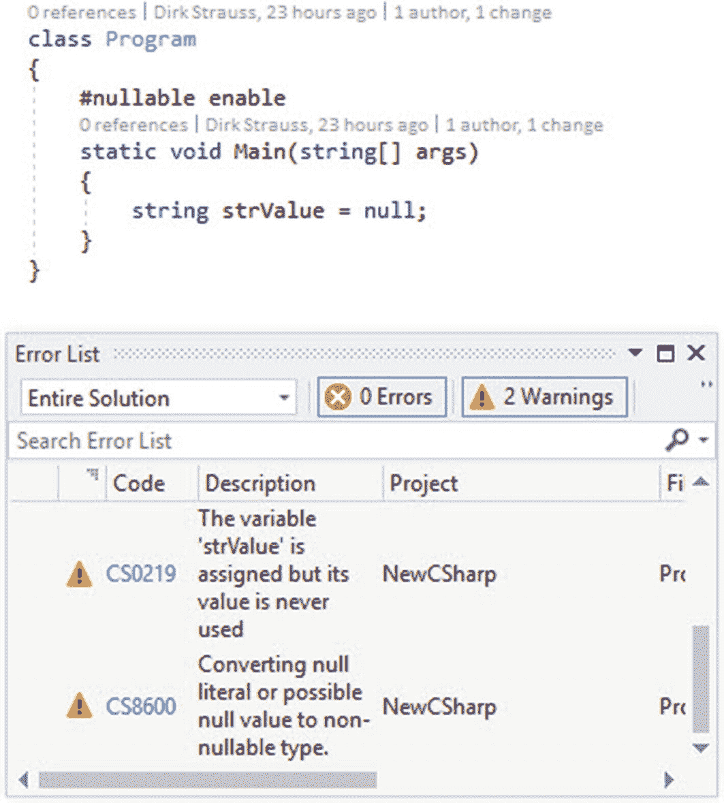

图 3-3。

可空引用类型已打开

该警告显示在*错误列表*中(图 [3-3](#Fig3) )。如果在现有项目上启用此功能，您可能会遇到一些这样的警告。

pragma `#nullable enable`还支持`disable`关闭可空引用类型特性。

如果您需要为整个项目启用可空引用类型，请打开您的`.csproj`文件并查找`LangVersion`元素。

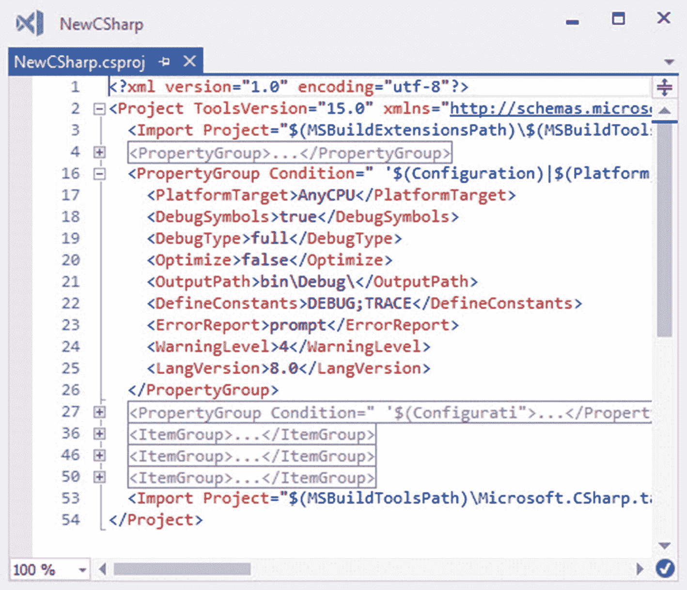

图 3-4。

为项目启用可为空的引用类型

然后你需要在`LangVersion`元素后面添加`<NullableReferenceTypes>true</NullableReferenceTypes>`，如图 [3-4](#Fig4) 所示。

### 概述

概括地说，在 C# 8.0 中，我们现在有可空的引用类型和不可空的引用类型。这些使您能够告诉编译器您使用引用类型变量的确切意图。

为了在 C# 8.0 中启用可空引用类型变量，您需要使用一个新的 pragma `#nullable`。编译器将以两种方式之一解释您的意图。这些如下。

#### 引用类型变量不能为空

如果引用类型变量不应该是`null`，编译器将强制执行该规则，以确保在不检查变量是否为`null`的情况下使用变量是安全的。这意味着变量必须初始化为非空值。因此，变量永远不会被赋予一个`null`值。

#### 引用类型可能为空

当我们声明一个可空的引用类型变量时，我们是在告诉编译器变量值有可能是`null`。编译器现在将强制执行不同的规则，以确保您已经检查了空引用。因此，您可以用默认的`null`来初始化这些变量。

## 递归模式

递归模式是 C# 的一个受欢迎的补充。你会记得在 C# 7 中，我们看到了模式匹配的引入。C# 8.0 更进一步，允许模式包含其他模式。考虑下面的类。

```cs
public class Person
{
    public int Age { get; }
    public string Name { get; }
    public bool RegisteredToVote { get; set; }

    public Person(string name, int age, bool registered)
    {
        Name = name;
        Age = age;
        RegisteredToVote = registered;
    }
}

Listing 3-1Person class

```

该类包含一个布尔值，表明该人是否已注册投票。递归模式将允许我们通过以下操作提取那些没有注册投票的人。

```cs
foreach (var person in personList)
{
    if (person is Person { RegisteredToVote: false })
    {
        WriteLine($"{person.Name} has not registered.");
    }
}

Listing 3-2Recursive pattern

```

我们在这里说的是，如果列表中的一个对象属于类型`Person`，并且这个人的属性`RegisteredToVote`被设置为`false`，那么显示这个人的名字。

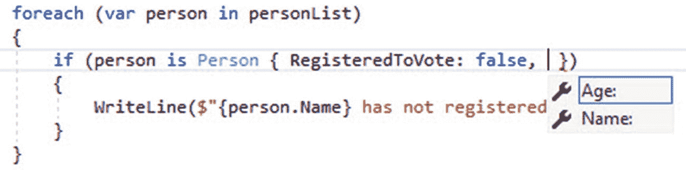

图 3-5。

智能感知可用

您还会注意到，如果您需要向模式添加另一个条件，Intellisense 是可用的(图 [3-5](#Fig5) )。将以下资格属性添加到您的类中。

```cs
public class Person
{
    public int Age { get; }
    public string Name { get; }
    public bool RegisteredToVote { get; set; }
    public bool EligibleToVote { get => Age > 18; }

    public Person(string name, int age, bool registered)
    {
        Name = name;
        Age = age;
        RegisteredToVote = registered;
    }
}

Listing 3-3Person class with eligibility property

```

我们现在可以检查一个人是否没有注册投票，但是只返回那些有资格投票的人。

```cs
foreach (var person in personList)
{
    if (person is Person { RegisteredToVote: false, EligibleToVote: true })
    {
        WriteLine($"{person.Name} has not registered.");
    }
}

Listing 3-4Returning only eligible people not registered

```

递归模式允许您更加灵活，并允许更具表现力的代码。

## 范围和指数

范围和指数是在 2018 年的前几个月设计的。C# 8.0 允许我们对索引数据结构做的是抓取数组、字符串或跨度的一部分。

```cs
string[] names = { "Dirk", "Jane", "James", "Albert", "Sally" };
foreach (var name in names)
{
    // do something
}

Listing 3-5An array of names

```

考虑一个标准的名称数组，我们可以像前面的代码清单一样在一个`foreach`中迭代这个数组。然而，在 C# 8.0 中，我们现在可以轻松地只取出数组的一部分，如下所示。

```cs
string[] names = { "Dirk", "Jane", "James", "Albert", "Sally" };
foreach (var name in names[1..4])
{
    // do something
}

Listing 3-6Pulling out a part of the array

```

这允许我们迭代数组中的一部分名字。1..4 实际上是一个范围表达式。

请注意，前面示例中的端点 4 是排他的，这意味着元素 4 不包含在[1..4].

C# 对数组采用了 C 风格的方法，所以端点的唯一性与这种方法是一致的。这意味着在[1..4]，我们想要的切片长度是 4-1 = 3。

需要注意的另一点是，范围表达式不必构成索引操作的一部分。可以用自己的类型`Range`拉出来放到自己的变量里。这将允许以下代码有效。

```cs
string[] names = { "Dirk", "Jane", "James", "Albert", "Sally" };
Range range = 1..4;
foreach (var name in names[range])
{
    // do something
}

Listing 3-7Using the Range type

```

在前面的代码示例中，范围表达式是一个`integer` 1..4.事实上，他们不必如此。实际上，它们属于一种叫做`Index`的类型。非负整数值转换为`Index`。

因为范围表达式的类型是`Index`，所以您可以通过使用新的`^`操作符来创建一个`Index`。

有时新的`^`操作员也被称为*帽子*操作员。当提到`^`操作符时，时间会告诉你什么会被粘住。

新的`^`运算符表示从末端开始的*，因此`1..^1`表示从末端开始的 1。因此，您可以拥有以下内容。*

```cs
string[] names = { "Dirk", "Jane", "James", "Albert", "Sally" };
foreach (var name in names[1..^1])
{
    // do something
}

Listing 3-8Using the “from-end” operator

```

`^1`实际上是删除数组末尾的一个元素，返回一个包含中间元素的数组。

*   简

*   詹姆斯

*   艾伯特

有一些开发者认为，用`^`来表示从始至终的*是令人困惑的，尤其是因为在 regex 中`^`从一开始就表示*。但是正如 Mads Torgersen(c# 的设计负责人)所评论的，他们决定在使用*从开始*和*从结束*算法时遵循 Python。**

 **范围表达式可以用几种方式编写。这些解释如下:

*   表达式`..^1`与`0..^1`相同

*   表达式`1..`与`1..^0`相同

*   表达式`..`与`0..^0`相同

表达式`0..^0`从头到尾返回数组中的所有内容(例如)。您可以将`^0`视为最右边的元素。

## 切换表达式

在 C# 7.0 中，我们看到 switch 语句中包含了模式。你应该还记得，我们在第 [1](1.html) 章中看到了模式匹配。考虑下面的类示例。

```cs
public class Human : Species
{
    public string Name { get; }
    public bool RegisteredToVote { get; set; }
    public bool EligibleToVote { get => Age > 18; }

    public Human(string name, bool registered)
    {
        Name = name;
        RegisteredToVote = registered;
    }
}

public class Mammal : Species
{
    public string Name { get; }
    public Mammal(string name)
    {
        Name = name;
    }
}

public class Reptile : Species
{
    public string Name { get; }
    public bool LaysEggs { get; }
    public Reptile(string name, bool laysEggs)
    {
        Name = name;
        LaysEggs = laysEggs;
    }
}

public class Species
{
    public int Age { get; set; }
}

Listing 3-9Class examples

```

这些类是非常基本的，如果我们想在 switch 语句中使用模式匹配，我们通常会做以下事情。

```cs
Species species = new Reptile("Snake", true);
species.Age = 2;

switch (species)
{
    case Human h:
        WriteLine($"{h.Name} is a {nameof(Human)}");
        break;
    case Mammal m:
        WriteLine($"{m.Name} is a {nameof(Mammal)}");
        break;
    case Reptile r:
        WriteLine($"{r.Name} is a {nameof(Reptile)}");
        break;
    default:
       WriteLine("Species could not be determined");
       break;
}

Listing 3-10C# 7.0 switch statement

```

这是一段有效的代码，但是写起来有些麻烦。在 C# 8.0 中，您将能够重写前面清单中的代码，如下所示。

```cs
var result = species switch
{
    Human h => $"{h.Name} is a {nameof(Human)}",
    Mammal m => $"{m.Name} is a {nameof(Mammal)}",
    Reptile r => $"{r.Name} is a {nameof(Reptile)}",
    _ => "Species could not be determined"
};

WriteLine(result);

Listing 3-11Switch expression

```

C# 8.0 引入了开关表达式，其中事例是表达式。可以把它看作 switch 语句的轻量级版本。

您会注意到,`default`案例使用了一个丢弃`_`变量。如果你需要回顾一下，弃牌在这本书的第 [1](1.html) 章已经讨论过了。

你会注意到`case`关键字和`:`已经被λ`=>`箭头所取代。另一件要注意的事情是，主体现在是一个表达式，并且选定的主体成为开关表达式的结果。

### 我应该使用开关表达式吗？

就我个人而言，我发现开关表达式更好读和写，尤其是如图 [3-6](#Fig6) 所示的格式。更集中和简洁的代码的结果是显而易见的，我们将 15 行 case 语句减少到只有 7 行代码。

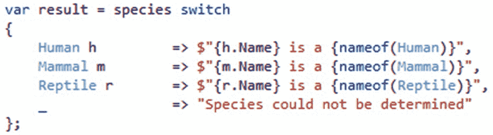

图 3-6。

更可读的代码

如果您希望使用更少的代码编写开关，并且更具表达性，请考虑使用开关表达式。

### 属性模式

让我们扩展我们的开关表达式，来区分产卵的爬行动物和产下幼仔的爬行动物。

是的，你会看到胎生的蛇，它们会生出活的幼蛇，例如绿色水蟒和大蟒蛇。

在`switch`语句中包含一个案例，该案例将检查爬行动物的属性`LayEggs`何时等于`true`，并基于此输出不同的结果。

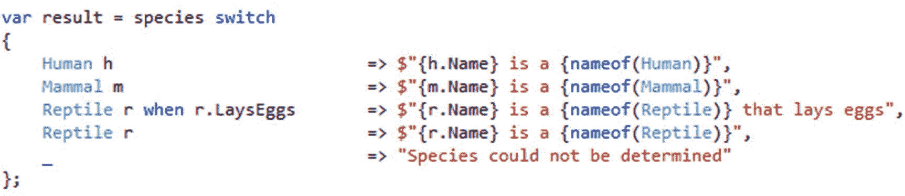

图 3-7。

检查胎生爬行动物

C# 8.0 现在允许模式更深入地挖掘模式匹配的值。这意味着作为开发人员，您可以通过添加花括号将其应用于值的属性或字段，从而使其成为属性模式。因此，您可以将图 [3-7](#Fig7) 中的开关表达式重写如下。

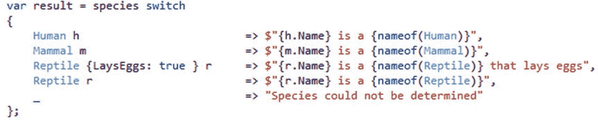

图 3-8。

使用属性模式切换表达式

C# 8.0 也允许更多可选的类型模式元素。如果我们在和一只产卵的`Reptile`打交道，那么我们想要它的年龄。这里我们可以将`var`模式应用于`Age`属性。

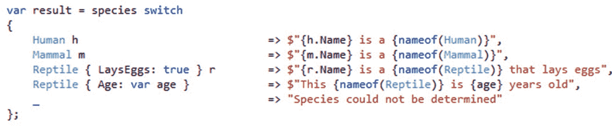

图 3-9。

省略爬行动物 r

记住`var`总是会成功，并声明一个新变量来保存该值(图 [3-9](#Fig9) )。因此，变量`age`开始包含`r.Age`的值，我们可以删除`r`，因为它从未被使用过(图 [3-10](#Fig10) )。

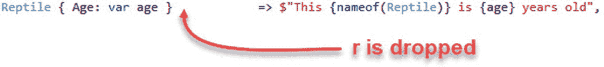

图 3-10。

r 可以被丢弃，因为它没有被使用

包括属性模式在内的所有模式都要求该值非空。用`{}`和`null`替换回退情况将处理非空模式和空值(图 [3-11](#Fig11) )。

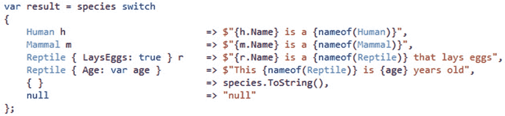

图 3-11。

迎合非空对象和空

空属性模式由`{}`处理，而`null`将捕捉所有的空值。

## 目标类型的新表达式

微软已经走了很长一段路，从他们所在的地方开始拥抱开发者社区。C# 8.0 中引入的以下特性完美地展示了开发人员的思维过程以及他们对开发人员社区的意义。

这个特性的实现实际上是由社区成员 Alireza Habibi 贡献的。

例如，在过去，当创建一个数组`Point`时，您需要添加类型。

```cs
Point[] ps = { new Point(1, 4), new Point(3, 2), new Point(9, 5) };

Listing 3-12Point array before C# 8.0

```

在 C# 8.0 中，您现在可以简单地修改前面清单中的代码，如下所示。

```cs
Point[] ps = { new (1, 4), new (3, 2), new (9, 5) };

Listing 3-13Point array in C# 8.0

```

该类型已从上下文中给定。因此，在这些情况下，C# 将允许您省略类型。

## 异步流

让我们回想一下第 [2](2.html) 章中讨论的异步。异步编程将允许您编写能够执行长时间运行任务的代码，同时仍然保持应用的响应性。

基本的想法是我们把这些东西叫做任务。NET，它代表着对未来结果的承诺。我们可能有一个如下的异步方法。

```cs
static async Task Main(string[] args)
{
    var result = await GetSomethingAsync();

    WriteLine(result);
    ReadLine();
}

static async Task<int> GetSomethingAsync()
{
    await Task.Delay(1000);
    return 0;
}

Listing 3-14Async method

```

你会注意到我用 async 修饰符创建了`Main`方法。

Async Main 是在 C# 7.1 中引入的，现在它允许你用`async`修饰符为你的应用创建入口点。如果你的程序返回一个退出代码，你可以声明一个返回一个`Task<int>`的`Main`方法。

这里需要注意的是`await`操作符。这允许您在代码的执行中插入一个暂停点，直到等待的任务完成它正在处理的任务。因此，这个任务代表了一些正在进行的工作，并且只有在用`async`关键字修改方法时才能使用`await`。

我们称这样一个包含一个或几个`await`表达式的方法(使用`async`修饰符)为*异步方法*。前面清单中的代码对于单个结果很好，但是对于连续的结果流呢？

设想一个数据库，它被查询的数据不能一次全部返回。所以，它需要对它进行流式处理，数据会以一定的间隔到达调用代码。但是，您的代码希望在自己的时间内处理这些数据。正是因为这个原因，C# 8.0 引入了`IAsyncEnumerable<T>`，它是`IEnumerable<T>`的异步版本。这样，您就可以编写下面的代码了。

```cs
static IAsyncEnumerable<int> GetLotsAsync()
{
    await foreach(var item in GetSomethingAsync())
    {
        if (item > 8)
           yield return item;
    }
}

Listing 3-15IAsyncEnumerable<T>

```

代码执行普通的`await`，但是您可以使用普通的语言结构(例如，`foreach`)来消费数据。

当到达迭代器方法内部的`yield return`时，`expression`被返回并保留代码中的当前位置。如果再次运行这段代码，那么下次调用迭代器时，代码将从该位置重新开始执行。要结束迭代，请调用`yield break`。

可以把它想象成一个`async`迭代器，它结合了`async`方法和迭代器方法，允许你在其中使用`await`和`yield return`。

### 可观测量与异步流

在与 Mads Torgersen 的一次访谈中，有人提到异步流感觉类似于可观察的或反应式的扩展。Mads Torgersen 解释说，异步流基本上是一种拉模型，在这种模型中，作为开发人员，你需要一些东西，然后得到它。另一方面，当观察对象有数据时，它们使用推模型。

有了 observables，生产者决定了数据传递给消费者的时间。在异步流中，消费者决定何时准备好接收数据。

## 使用声明

C# 8.0 的另一个好的补充是简化使用语句的特性。传统上，using 语句引入了一定程度的嵌套。就我个人而言，我喜欢它，因为它总是让人觉得 using 语句清楚地显示了资源何时被清理。当代码执行越过右花括号时，就会发生这种情况。

然而，对于简单的情况，我们现在在 C# 8.0 中有了`using`声明。考虑下面的代码清单，它在使用 SQL 连接时有一个`using`语句。

```cs
string tsql = "[SQL QRY]";
string sqlConnStr = "[SQL Connection String]";
using (var con = new SqlConnection(sqlConnStr))
{
    SqlCommand cmd = new SqlCommand(tsql, con);
    //..
}

Listing 3-16using statement pre-C# 8.0

```

`using`语句将清理连接等。一旦代码执行移出 using 块。然而，使用 C# 8.0，我们可以做到以下几点。

```cs
string tsql = "[SQL QRY]";
string sqlConnStr = "[SQL Connection String]";
using var con = new SqlConnection(sqlConnStr);
SqlCommand cmd = new SqlCommand(tsql, con);

Listing 3-17Using declaration in C# 8.0

```

`using`声明只是局部变量声明。唯一不同的是，它现在前面有一个`using`关键字。因此，内容在当前语句块的末尾被释放。

## 包扎

C# 8.0 引入的语言特性确实令人兴奋。我确信随着时间的推移，C# 团队将会完善这些并添加更多的内容。另一个激动人心的发展是 C# 中点释放的速度。这在我们在 C# 7 中看到的点发布中是显而易见的。这是一个好主意，以保持与这些版本的更新，以防他们决定偷偷在一些非常酷的东西。

我们看了一下现在可用的可空引用类型，例如，它允许您使用`string?`来指示字符串的可空性。然后我们看了一下允许模式包含其他模式的递归模式。接下来讨论了范围和索引，它们允许您抓取数组、字符串或跨度的一部分。然后，我向您展示了 switch 表达式是如何工作的，这可以看作是轻量级的 switch 语句。目标类型的新表达式允许您在创建一个`Point`数组时省略类型，因为类型是从上下文中给定的。然后讨论了异步流，它允许你使用一个叫做`IAsyncEnumerable`的`IEnumerable`的异步版本。最后，我们看了一下通过不引入嵌套层来简化语句使用的声明。

在下一章，我们将看看如何使用 ASP.NET MVC、Bootstrap、jQuery 和 SCSS 创建响应式 web 应用。**