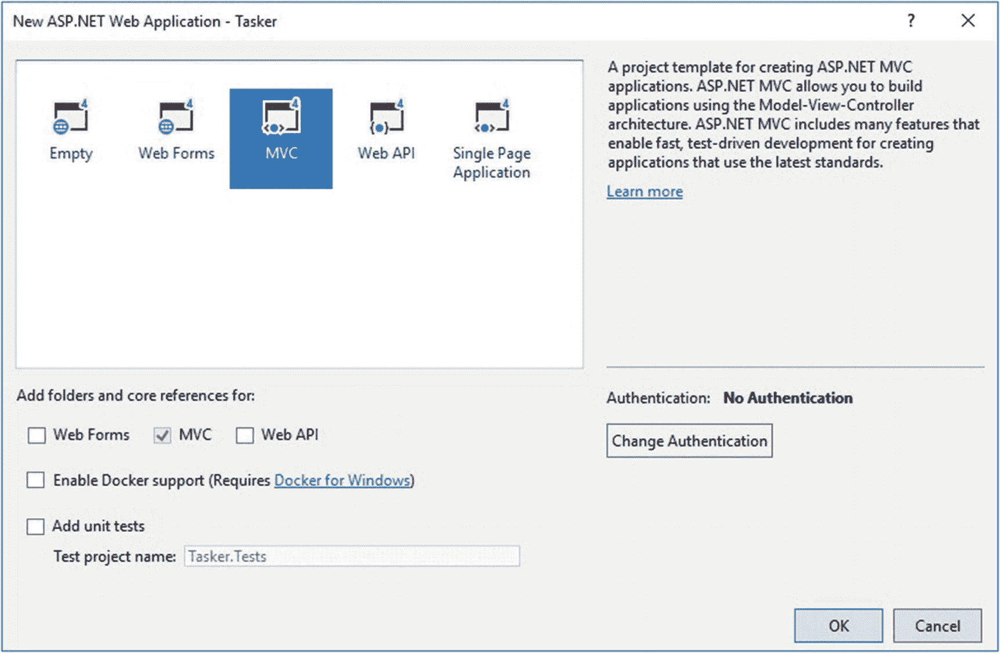
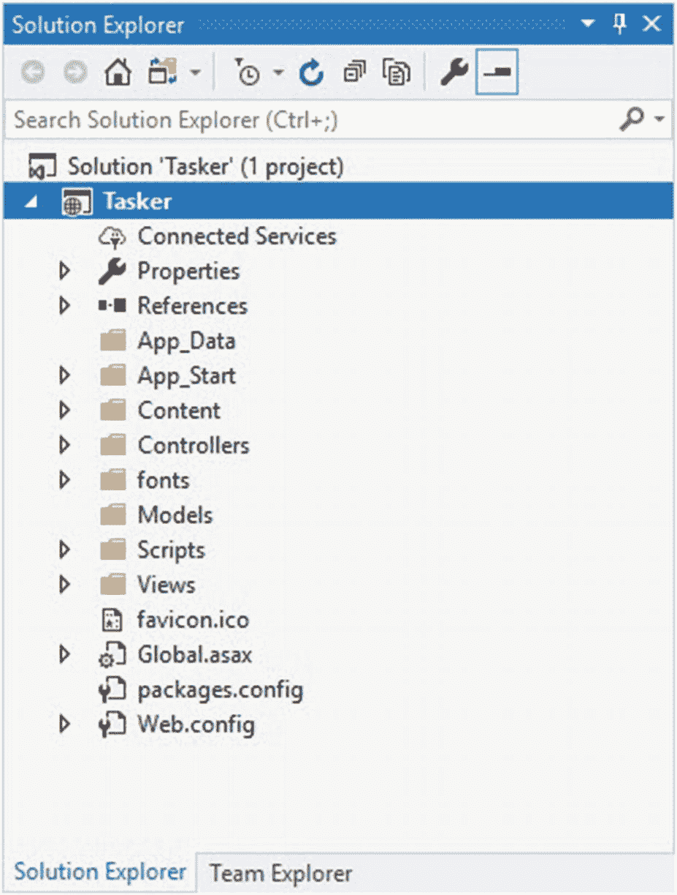
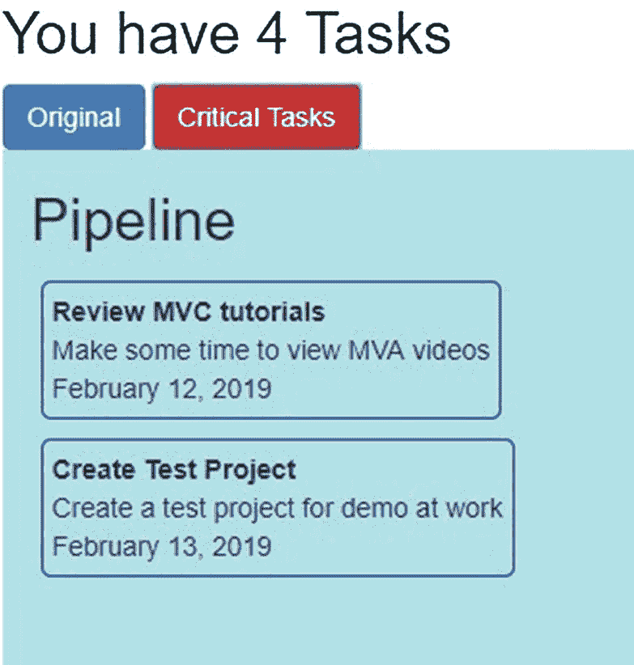

# 四、使用 ASP.NET MVC 的响应式 Web 应用

响应式 web 应用在现代应用开发中至关重要。用户需要能够在任何设备上查看您的 web 应用的内容。这意味着 web 应用需要根据查看它的设备来调整自己的大小。

在这一章中，你将创建一个简单的任务管理系统，它使用引导代码框架来保持响应。我们将了解以下内容:

*   创建您的 ASP.NET MVC 应用

*   引用 jQuery 和引导

*   设置和使用 SCSS

*   创建模型、控制器、视图和使用 Razor

*   添加插件

*   使用 Chrome 测试你的响应式布局

*   使用 Chrome 开发工具调试 jQuery

我将使用编写本章时可用的最新版本的 Visual Studio 2019。

## 创建您的 ASP.NET MVC 应用

Visual Studio 2019 中的新开始窗口看起来确实有点不同。你会注意到它现在有五个主要部分。这些是

*   打开最近的

*   克隆或签出代码

*   打开项目或解决方案

*   打开本地文件夹

*   创建新项目

将您最近的项目放在左侧，锁定或取消锁定是非常方便的，这将告诉您一些关于新开始窗口的信息。

我将在后面的章节中更深入地介绍 Visual Studio 2019 的这一功能和其他新功能，请密切关注。

Visual Studio 团队使用新的“开始”窗口的目的是让您能够快速访问访问代码的最常用方式。对大多数人来说，这可能是从一个存储库克隆或者打开一个现有的项目，如图 4-1 所示。


图 4-1。

Visual Studio 2019 新项目屏幕

现在，您将创建一个新的项目，因此单击该选项即可开始。


图 4-2。

选择项目模板

创建新项目可能是您非常熟悉的事情。新项目对话框(如图 [4-2](#Fig2) 所示)已经被清理了一点，不再包括节点和子节点的目录样式。

它现在包括一个*最近的项目模板*部分，类似于开始窗口中的*打开最近的*。对于这个项目，我们将使用选择一个 ASP.NET Web 应用。NET 框架。


图 4-3。

配置您的项目

选择项目模板后，您可以配置您的新项目(图 [4-3](#Fig3) )。我们将创建一个简单的任务管理应用，它将管理任务，并根据我们稍后将定义的一些状态对它们进行颜色编码。另请注意，您可以选择。最后一个组合菜单中的. NET Framework 版本。



图 4-4。

选择一个 MVC 项目

接下来您将看到熟悉的项目配置屏幕，在这里您可以选择想要创建的 web 应用的类型(图 [4-4](#Fig4) )。在这里选择 MVC，不用担心启用 Docker 支持或添加单元测试。在这个项目中，我们也不需要任何身份验证。



图 4-5。

解决方案资源管理器中创建的项目

Visual Studio 现在继续用所有默认的样板代码创建您的 ASP.NET MVC 应用。完成后，您应该会看到解决方案资源管理器，其中包含如图 [4-5](#Fig5) 所示的项目。如果您看到这个，那么您就准备好开始创建您的应用了。

构建您的项目并按下 *F5* 运行您的项目。


图 4-6。

运行您的 ASP.NET MVC 应用

如果一切设置正确，您将看到默认的 web 应用在浏览器中启动。

## 引用 jQuery 和引导

在你的*解决方案浏览器*中，如果你展开 *App_Start* 文件夹，你会看到一个名为`BundleConfig`的类。在这里，您将看到对 CSS 和 JavaScript 文件的引用。

捆绑和缩小缩短了请求加载时间。他们通过减少对服务器的请求数量来做到这一点，并通过这样做来减少所请求的资产的大小。

您会注意到,`RegisterBundles`方法包含对存储在 Scripts 文件夹中的 jQuery 和引导文件的引用。它还包括内容文件夹中包含的样式表。

```cs
public static void RegisterBundles(BundleCollection bundles)
{
    bundles.Add(new ScriptBundle("~/bundles/jquery")
        .Include("~/Scripts/jquery-{version}.js"));

    bundles.Add(new ScriptBundle("~/bundles/jqueryval")
        .Include("~/Scripts/jquery.validate*"));

    // Use the development version of Modernizr to develop
    // with and learn from. Then, when you're ready for
    // production, use the build tool at
    // https://modernizr.com to pick only the tests you need.
    bundles.Add(new ScriptBundle("~/bundles/modernizr")
        .Include("~/Scripts/modernizr-*"));

    bundles.Add(new ScriptBundle("~/bundles/bootstrap")
        .Include("~/Scripts/bootstrap.js"));

    bundles.Add(new StyleBundle("~/Content/css")
        .Include("~/Content/bootstrap.css",
              "~/Content/site.css"));
}

Listing 4-1The BundleConfig class

```

您会注意到我们有一个用于 js 文件的`ScriptBundle`和一个用于 css 文件的`StyleBundle`。在这里的`ScriptBundle`中，我们将添加另一个对 *jquery-ui.min.js* 文件的引用。

jQuery UI 是构建在 jQuery JavaScript 库之上的 UI 控件、资产、小部件和主题的集合。如果您需要包含某种形式的用户交互，请使用此选项。

在你的浏览器中，进入 [`http://jqueryui.com/download/`](http://jqueryui.com/download/) ，在*核心*、*交互*、*小部件*和*效果*类别中进行选择。


图 4-7。

下载的 jQuery UI 文件

我希望允许用户在网页上拖动元素(特别是任务项)。因此，我只需要包含可拖动的交互，但是我将继续包含所有内容，以防以后需要使用其他交互。

我感兴趣的两个文件是 *jquery-ui.js* 和 *jquery-ui.min.js* 。将这两个文件添加到项目的*脚本*文件夹中。


图 4-8。

添加 jQuery UI 文件

添加完文件后，您需要通过添加一个带有缩小文件路径的`Include`来更新`BundleConfig`类中的`RegisterBundles`方法。

```cs
bundles.Add(new ScriptBundle("~/bundles/jquery")
    .Include("~/Scripts/jquery-{version}.js")
    .Include("~/Scripts/jquery-ui.min.js"));

Listing 4-2Modified RegisterBundles method

```

这将创建一个名为`~/bundles/jquery`的包，它将包含您指定的所有适当的文件以及匹配通配符`{version}`字符串的文件。

### 创建捆绑包

我们可以通过在`Include`方法中指定一个字符串数组来创建包。每个字符串都是资源的虚拟路径。下面是一个 StyleBundle 的例子，它指定了几个 CSS 文件的虚拟路径。

```cs
bundles.Add(new StyleBundle("~/Content/css").Include(
    "~/Content/themes/base/jquery.ui.code.css",
    "~/Content/themes/base/jquery.ui.button.css",
    "~/Content/themes/base/jquery.ui.slider.css",
    "~/Content/themes/base/jquery.ui.tabs.css",
    "~/Content/themes/base/jquery.ui.datepicker.css",
    "~/Content/themes/base/jquery.ui.theme.css"));

Listing 4-3A StyleBundle

```

注意所有这些 CSS 文件都在同一个目录中吗？`Bundle`类还提供了一个名为`IncludeDirectory`的方法。这允许你修改你的`StyleBundle`，使其更加简洁。

```cs
bundles.Add(new StyleBundle("~/Content/css").IncludeDirectory(
    "~/Content/themes/base/"
    , "*.css"
    ,false));

Listing 4-4A StyleBundle using IncludeDirectory

```

我已经指定了一个虚拟目录路径，还指定了一个只匹配 CSS 文件的搜索模式。设置为`false`的最后一个参数指定从搜索中排除子目录。

### 在视图中引用束

我们将在本章的下一节更仔细地研究视图。然而，我需要在这里提到，在视图中使用`Render`方法引用包。对于 CSS 我们使用`Styles.Render`，对于 JavaScript 我们使用`Scripts.Render`。在 shared _ *Layout.cshtml* 视图中查看样式表和脚本是如何呈现的。 *_Layout.cshtml* 视图在所有其他视图之间共享(在旧的 ASP。网)。因此，此处引用的这些脚本和样式表包含在网站的所有页面中。

## 设置和使用 SCSS

现在我已经引用了 jQuery UI 文件，我想为我的应用创建一个定制样式表。为此，我将创建一个. scss 样式表。在您的项目中创建一个名为 *scss* 的文件夹，并将一个名为 *customstyles.scss* 的新 scss 文件添加到该文件夹中。


图 4-9。

添加新的 SCSS 样式表

将文件夹和文件添加到项目后，您的解决方案应该如下图所示。


图 4-10。

添加了 scss 文件夹和自定义样式文件

你会注意到*内容*文件夹包含了我们的 CSS 文件。从逻辑上讲，这就是我们想要放置 *customstyles.css* 文件的地方。这个 CSS 文件将从我们在 *s CSS* 文件夹下创建的 scss 文件中生成。为此，我们需要安装一个由 Mads Kristensen 创建的名为 *Web 编译器*的工具。前往 Visual Studio 2019 中的*扩展*菜单，点击*扩展和更新*。


图 4-11。

扩展和更新

下载工具后，Visual Studio 2019 将安排安装 Web 编译器。

在开始安装 Web 编译器之前，您需要关闭 Visual Studio。


图 4-12。

Web 编译器安装

安装 Web 编译器后，启动 Visual Studio 2019。看看我们之前创建的 customstyles.scss 文件。它只包含以下代码。

```cs
body {
}

Listing 4-5Contents of customstyles.scss file

```

我们稍后将向该文件添加一些样式代码，但首先右键单击该文件，然后单击 *Web 编译器➤编译文件*或按住 *Shift+Alt+Q* 将该文件编译成 CSS。

我们之前安装的 Web 编译器开始工作，为我们创建名为 *customstyles.css* 和 *customstyles.min.css* 的 CSS 文件。只有一个问题，生成的 CSS 文件不在正确的文件夹中。我们希望生成的 CSS 文件放在项目的 Content 文件夹中。


图 4-13。

生成的 CSS 文件

这很容易解决。当 Web 编译器生成 CSS 文件时，它还会在项目根目录中为您创建一个名为 *compilerconfig.json* 的文件。继续打开 *compilerconfig.json* 文件。

```cs
[
  {
    "outputFile": "scss/customstyles.css",
    "inputFile": "scss/customstyles.scss"
  }
]

Listing 4-6Compiler configuration for the scss file

```

您会注意到，该文件包含一个为生成的 CSS 文件设置的输出路径。该路径与输入文件路径相同。修改您的`outputFile`路径，如下面的代码清单所示。

```cs
[
  {
    "outputFile": "Content/customstyles.css",
    "inputFile": "scss/customstyles.scss"
  }
]

Listing 4-7Modified Compiler configuration for the scss file

```

当您保存 *compilerconfig.json* 文件时，另一个编译会自动完成。


图 4-14。

生成的 CSS 文件

这将在正确的*内容*文件夹中创建 CSS 文件。你可以删除 *scss* 文件夹下的 CSS 文件。当我们修改 scss 文件时，这些将永远不会更新。

### SCSS 到底是什么？

SCSS 是 SASS(语法上很棒的样式表)的一个实现。事实上，SASS 支持两种类型的语法，即 SCSS 和 SASS。SCSS 和萨斯的主要区别是 SCSS 使用的大括号和分号。习惯了 C#，用 SCSS 更有意义。

SCSS 完全符合 CSS，所以你现有的所有代码仍然可以工作。SCSS 的好处是

*   能够使用变量

*   允许嵌套语法

*   允许使用混合

*   允许使用分部来模块化代码

*   能够使用@extend 来继承和扩展类

*   允许使用函数

这允许您拆分代码来设计应用的样式，并分离应用中关于特定样式的关注点。继续添加另一个名为 *_variables.scss* 的 scss 文件到你的 *scss* 文件夹中。请注意，您必须在文件名前包含下划线，以将其标记为部分 scss 文件。


图 4-15。

_variables.scss 文件

将以下代码添加到 _variables.scss 文件中。

```cs
/* Header Colors */
$h2-color: #9DB941;

Listing 4-8The color variable for H2 tags

```

这只是一个为标记中的`H2`元素设置值的变量(由一个`$`符号表示)。接下来，如下修改您的 *customstyles.scss* 文件。

```cs
@import "_variables.scss";

h2{
    color: $h2-color;
}

Listing 4-9Custom styling for H2 elements

```

这里我们导入了 *_variables.scss* 部分文件，然后将`H2`元素颜色设置为`$h2-color`变量的值。保存你的 scss 文件，看看 *Content* 文件夹里的 *customstyles.css* 文件。

```cs
/* Header Colors */
h2 {
  color: #9DB941; }

Listing 4-10The customstyles.css file

```

编译后的 CSS 包含`H2`元素的`$h2-color`变量值。这就是 SCSS 为您的 Visual Studio web 应用项目带来的强大功能。

你会注意到 Web 编译器没有创建一个*变量. css* 文件。这是因为它被标记为部分文件，文件名前带有下划线字符。我们用`customstyles.scss`文件中的`@import`关键字将它包含在编译后的 CSS 文件中。

### 将我们的自定义 CSS 文件添加到 BundleConfig

我们需要在`BundleConfig`类中包含自定义的 CSS 文件。继续编辑`RegisterBundles`方法并包含 *customstyles.css* 文件。我们的方法目前引用了 *site.css* 文件。

```cs
bundles.Add(new StyleBundle("~/Content/css")
                .Include("~/Content/bootstrap.css",
                      "~/Content/site.css"));

Listing 4-11StyleBundle referencing site.css

```

通过移除 *site.css* 引用并添加我们的 *customstyles.css* 引用，将其改为引用我们的自定义 CSS 文件。

```cs
bundles.Add(new StyleBundle("~/Content/css")
                .Include("~/Content/bootstrap.css",
                      "~/Content/customstyles.css"));

Listing 4-12StyleBundle referencing customstyles.css

```

现在，我们已经成功地引用了样式表，我们将在整个应用中根据需要使用该样式表来设置元素的样式。

## 创建模型、控制器、视图和使用 Razor

在我们创建视图之前，我们首先需要为我们的任务应用创建一个模型和一个控制器。MVC 的整个前提是根据应用每个部分的角色来分离关注点。你可能知道，MVC 代表 *M* 模型、 *V* 视图、 *C* 控制器。让我们回顾一下 MVC 每个部分的职责。

### 什么是控制器？

当用户向浏览器发出请求时，控制器决定向用户返回什么响应。它负责控制 ASP.NET MVC 应用中的逻辑流。您会注意到我们的应用默认包含一个 *HomeController* 。它仅仅是一个 C# 类，最初包含一些名为`Index`、`About`和`Contact`的方法。如果您必须输入 URL *Home/Index* ，那么控制器将调用`Index`方法。在这里，您可以添加额外的方法(或操作)来匹配您的视图。

### 什么是视图？

如果你看一下 *HomeController* ，你会注意到每个方法都返回一个视图。在您的*解决方案浏览器*中展开*视图*文件夹，您会注意到它包含一个 *Home* 文件夹，其中有三个视图匹配 *HomeController* 类中的方法。因此，当 URL *Home/Index* 请求`Index`方法时， *HomeController* 将寻找名为 *Index* 的视图。因此，在正确的位置创建视图非常重要。调用 *Home/Index* 将查找位于*Views \ Home \ Index . cs html*的 *Index* 视图。这些视图包含网页的标记。

### 什么是模型？

模型也只是一个 C# 类，包含应用的所有业务逻辑、任何需要的验证以及所有数据库逻辑。例如，使用实体框架作为数据库，它的逻辑将包含在 Models 文件夹中。这意味着您的视图必须只包含在网页中显示数据所需的代码。您的控制器必须只包含最少量的代码，以便选择正确的视图并将用户重定向到其他操作。模型应该包含代码逻辑的其余部分。一个通用的经验法则是，如果您的控制器变得太复杂或者包含大量代码，那么您需要考虑将该逻辑转移到一个模型中。在大多数情况下，你应该争取瘦控制器和脂肪模型。

### 什么是路由？

你们当中来自 ASP.NET 的人会记得，创建一个 ASP.NET 网页意味着你需要在用户输入的 URL 和被请求的页面之间有一对一的匹配。我的意思是，如果用户请求一个名为 *DisplayTasks.aspx* 的页面，该页面必须存在。

在 ASP.NET MVC，这不是真的。用户键入的 URL 与应用中的文件不对应。使用 MVC，用户输入的 URL 与控制器中的动作(前面提到的方法之一)相匹配。在我们应用的 *HomeController* 中，我们有动作*索引*、*关于*，以及*联系人*。


图 4-16。

MVC 设计模式

这种浏览器请求到控制器动作的映射在 ASP.NET MVC 中被称为路由。传入的请求被路由到控制器动作。这意味着如果用户请求 *Home/Contact* ，那么 *HomeController* 上的 *Contact* 动作将会运行。这也不意味着返回了*联系人*视图。还记得我们说过控制器的工作是决定应用中的逻辑流程吗？您可以有不同的联系人视图，控制器将根据某种逻辑(例如，原籍国)决定返回哪个视图。如果原籍国的母语不是英语，则控制器可以用不同的联系方式和不同的语言返回不同的视图。

### 路由的工作原理

ASP.NET 通过应用首次启动时创建的路由表处理传入的请求。您可以在项目根目录下的 *Global.asax.cs* 文件中看到这一点。


图 4-17。

路由表创建

它是在一个名为`Application_Start`的方法中创建的，您还会注意到这也是包注册的地方。

您应该还记得我们在上一节中说过，捆绑和缩小可以改善请求加载时间。

如果你看一下 *App_Start* 文件夹中的 *RouteConfig.cs* 文件，你会看到我们的路由表只包含一条默认路由。


图 4-18。

RegisterRoutes 方法

所有传入的请求都被分成三个部分。您会注意到这些片段是正斜杠之间的部分。


图 4-19。

路线段

默认路线还为您的应用提供了三个路段的默认值。这意味着，默认情况下，当您的应用启动时，它将转到默认的 *Home/Index* 路径。第三部分`id`被标记为可选。

如果您必须在您的*任务/显示*浏览器中输入一个 URL，那么基于您的默认路线的组成，您将需要一个名为`TaskController`的控制器，它包含一个名为`Display`的动作(方法)。简而言之，这就是路由的工作方式。

### 创建您的模型

让我们开始添加任务应用的内容。我们将从添加模型开始，然后创建控制器，最后设计视图。这将给我们一个可行的应用，我们可以扩展它来满足设计规范的需要。

如果您的解决方案中没有名为 *Models* 的文件夹，那么创建一个，并在该文件夹中创建一个名为 *Task* 的类。


图 4-20。

创建任务模型

当您创建了您的*任务*模型后，将下面的代码添加到您的模型中。

```cs
public class Task
{
    public int TaskID { get; set; }
    public string TaskTitle { get; set; }
    public string TaskBody { get; set; }
    public DateTime DueDate { get; set; }
}

Listing 4-13The Task model code

```

我们将通过在一个名为`GetTasks`的方法中插入数据来模拟数据库查询，该方法返回一个`List<Task>`对象。将以下代码添加到您的任务模型中。

```cs
public List<Task> GetTasks()
{
    return new List<Task>()
    {
        new Task ()
        {
            TaskID = 1
            , TaskTitle = "Review MVC tutorials"
            , TaskBody = "Make some time to view MVA videos"
            , DueDate = DateTime.Now
        },
        new Task ()
        {
            TaskID = 2
            , TaskTitle = "Create Test Project"
            , TaskBody = "Create a test project for demo at work"
            , DueDate = DateTime.Now.AddDays(1)
        },
        new Task ()
        {
            TaskID = 3
            , TaskTitle = "Lunch with Mary"
            , TaskBody = "Remember to make lunch reservations"
            , DueDate = DateTime.Now.AddDays(2)
        },
        new Task ()
        {
            TaskID = 4
            , TaskTitle = "Car Service"
            , TaskBody = "Have the car serviced before trip to HQ"
            , DueDate = DateTime.Now.AddDays(3)
        }
    };
}

Listing 4-14GetTasks method

```

现在，我们将依靠这个方法返回我们的`Task`对象，就好像它们是从数据库中读取的一样。我们现在需要添加负责我们任务的控制器。让我们接下来做那件事。

### 创建控制器

如果您展开*控制器*文件夹，您将会看到默认的`HomeController`，这是在我们创建应用时为我们添加的。我们所有的控制器都将存放在这个*控制器*文件夹中。右键单击文件夹并为任务添加新的控制器。现在，只需选择添加一个空控制器。按照控制器的 MVC 惯例调用类`TaskController`，并单击*添加*按钮。

```cs
namespace Tasker.Controllers
{
    public class TaskController : Controller
    {
        // GET: Task
        public ActionResult Index()
        {
            return View();
        }
    }
}

Listing 4-15The default TaskController code

```

控制器是用`Index`动作的默认代码创建的。在这一点上，它实际上并没有做太多，但是它是一个很好的脚手架，您可以从它开始工作。

正是在这个搭建过程中，我们看到了一些有趣的事情发生。如果您展开您的*视图*文件夹，您会注意到一个名为*任务*的新文件夹。


图 4-21。

创建的模型、视图和控制器

这是 Visual Studio 告诉你，你为你的`TaskController`创建的视图应该存在于*视图*下的*任务*文件夹中。你还会注意到 MVC 的构造方式，在我看来这是一个非常符合逻辑的方式。`TaskController`需要更多一点的代码，我们稍后会谈到。现在，我们的应用需要一个视图来显示来自控制器的数据。让我们现在创建一个。

### 创建您的视图

为了显示我们从控制器收到的数据，我们将添加一个视图。正是为了这个视图，我们将为我们的应用添加标记。右键点击*视图*文件夹下的*任务*文件夹，点击*添加*，然后点击*视图*。


图 4-22。

添加视图

我们将把这个视图称为`Index`，这样`TaskController`就可以正确地映射到这个视图。如果控制器中的动作被称为其他名称，那么这个视图名称必须与控制器中的动作名称相匹配。

我们也不会选择模板，但是如果您愿意，您可以选择。如果您选择了一个模板，那么您需要选择我们之前创建的`Task`模型，并将其输入到*模型类*字段中。

使用以下标记创建了一个非常基本的视图。

```cs
@{
    ViewBag.Title = "Index";
}

<h2>Index</h2>

Listing 4-16Basic view markup

```

我们需要稍微扩展一下这段代码，这样我们就可以以一种逻辑的方式显示我们的任务。我们需要对模型中的任务进行计数。如下修改您的代码。

```cs
@model IEnumerable<Tasker.Models.Task>
@{
    ViewBag.Title = "Index";

    var iTaskCount = 0;
    iTaskCount = Model.Count();
}

Listing 4-17Modified multi-statement block

```

您会注意到第一行表明我们的`Index`视图被强类型化为我们的`Task`类。Razor 视图引擎现在能够理解`Index`视图已经被传递了一个`Task`对象。这样做的好处是，我们现在可以访问模型的所有属性。更重要的是，我们可以在网页的标记中使用智能感知来做到这一点。

接下来我们要做的是为我们的视图编写 HTML 代码。在这里，你可以比我更有创造力。我有一个 Trello 类型的页面的想法，在那里你可以自由地在列之间移动任务项。

我们将创建三列，分别称为*管道*、*进行中*和*已完成*。我们的第一列将包含任务，如下所示。


图 4-23。

第一个任务列

如前所述，您可以按照自己喜欢的任何方式设置标记的样式。我选择使用三列布局，所以这就是我所做的。考虑下面的图像。


图 4-24。

任务的索引视图

我使用`col-md-4`创建了三列，并且只在第一列添加了 Razor 逻辑。

我假设对 Bootstrap 有一些最起码的了解。如果您想了解更多关于引导网格布局的信息，请在 [`https://getbootstrap.com`](https://getbootstrap.com) 上搜索引导网格示例。

我还为其中一个名为`inprogress`的元素添加了一个惟一的 ID。当我们在网页上添加一些脚本时，我们将需要它。最后，我添加了 Razor 语法。让我们详细介绍一下它是什么以及它是如何工作的。

### 剃刀是什么？

我想在这里暂停一下，解释一下剃刀是什么。它基于 C# 语言，但也支持 Visual Basic。它是一种编程语法，允许您在网页中嵌入基于服务器的代码。从前面的图像中，您可以看到我们留下了一个包含两种内容的页面。这些是客户端内容和服务器代码。客户端内容是您习惯在网页中看到的所有标记。这是所有的 HTML 元素、JavaScript、CSS 和纯文本。

我们的 CSS 将被提取到 SCSS 文件中，该文件将编译成我们的 *customstyles* CSS 样式表。

使用 Razor 将服务器代码添加到客户机内容之间。服务器代码(顾名思义)在页面发送到浏览器之前运行。这非常强大，因为这意味着您可以根据服务器代码中的条件动态创建客户端内容。考虑以下逻辑。


图 4-25。

使用 Razor 动态创建客户端内容

在这里，您可以看到我们正在根据我们的任务数量动态创建页面标题。

如果你的标题没有显示，考虑暂时删除位于项目的*共享*文件夹中的`_Layout.cshtml`文件中定义的`navbar`元素。

我们将任务计数存储在一个名为`iTaskCount`的变量中。这个变量很容易在我们的页面中使用。我们可以将它混合在 HTML 语法和其他 Razor 语法之间。当变量单独使用时，必须在变量前加上`@`符号。

### 剃刀怎么写

以下是在网页中使用 Razor 语法的真实情况。当你想在页面上添加 Razor 代码时，你需要使用`@`字符。`@`字符可用于开始一个内联表达式、多语句块或单个语句块。

```cs
@{ var iTotal = 3; }

Listing 4-18Single statement block

```

这个语句块可以用在网页标记中的任何地方。接下来，如果您需要定义一个内联表达式，您需要执行以下操作。

```cs
<h2>You have @iTaskCount Tasks</h2>

Listing 4-19Inline expression

```

如果您需要在网页中显示变量值，这非常有用。在代码示例中，它用于显示任务的数量。最后，您可以使用多语句块。

```cs
@{
    ViewBag.Title = "Index";

    var iTaskCount = 0;
    iTaskCount = Model.Count();
}

Listing 4-20Multi-statement block

```

这是我们在清单 [4-17](#PC17) 中修改的代码。如果您需要在页面中包含几个代码语句，多语句块是一个不错的选择。

请记住，在`@{ }`块中，代码语句仍然必须以分号结束。唯一不需要包含分号的时候是添加内联表达式的时候。

Razor 的强大之处在于，它允许您直接在 web 页面上使用变量，并在其他 HTML 标记之间混合使用变量。

### 将一切联系在一起

在运行我们的任务应用之前，我们需要将我们编写的片段链接在一起。我们已经创建了一个模型、一个控制器和一个视图。

您创建的完整的`Index`视图需要包含以下代码。

```cs
@model IEnumerable<Tasker.Models.Task>
@{
    ViewBag.Title = "Index";

    var iTaskCount = 0;
    iTaskCount = Model.Count();
}

@if (iTaskCount > 1)
{
    <h2>You have @iTaskCount Tasks</h2>
}
else if (iTaskCount > 0)
{
    <h2>You only have @iTaskCount Task</h2>
}
else
{
    <h2>You have no Tasks</h2>
}

<div class="container">
    <div class="row">
        <div class="col-md-4 task-pipeline">
            <div><h2>Pipeline</h2></div>
            @foreach (var item in Model)
            {
                <div class="task">
                    <div class="task-id">
                        @item.TaskID
                    </div>
                    <div class="task-title">
                        @item.TaskTitle
                    </div>
                    <div class="task-body">
                        @item.TaskBody
                    </div>
                    <div class="task-date">
                        @item.DueDate.ToString("MMMM dd, yyyy")
                    </div>
                </div>
            }
        </div>
        <div class="col-md-4 task-in-progress" id="inprogress">
            <div><h2>In progress</h2></div>
        </div>
        <div class="col-md-4 task-completed">
            <div><h2>Completed</h2></div>
        </div>
    </div>

</div>

Listing 4-21The Index view code

```

让我们回到我们的`TaskController`类，修改那里的代码，将`Task`模型传递给我们的视图。

```cs
public class TaskController : Controller
{
    // GET: Task
    public ActionResult Index()
    {
        Task task = new Task();
        List<Task> tasks = task.GetTasks();
        return View(tasks);
    }
}

Listing 4-22Modified TaskController class

```

接下来，我想告诉我的应用，当我的应用启动时，需要运行我的`TaskController`的`Index`动作。这将显示我们刚刚完成的`Index`视图。为此，我们需要更改默认路由。在你的解决方案中展开 *App_Start* 文件夹。


图 4-26。

RouteConfig 类

在这里，您将看到以下代码。

```cs
routes.MapRoute(
    name: "Default",
    url: "{controller}/{action}/{id}",
    defaults: new
    {
        controller = "Home"
        , action = "Index"
        , id = UrlParameter.Optional
    });

Listing 4-23Default routing

```

这里我们声明默认控制器是`HomeController`，而`HomeController`中的默认动作需要是`Index`。我们想改变默认值，所以修改您的代码，使用`TaskController`作为默认值。

```cs
routes.MapRoute(
   name: "Default",
   url: "{controller}/{action}/{id}",
   defaults: new
   {
       controller = "Task"
       , action = "Index"
       , id = UrlParameter.Optional
   });

Listing 4-24Modified default routing

```

完成这些之后，就可以运行应用了。按 F5 将启动您的应用，并显示`Index`视图。它目前是未样式化的，看起来有点难看，所以我们接下来需要修复它。

### 添加样式

为了给我们的应用添加一些样式，我们将修改之前添加的 *customstyles.scss* 文件。您还记得，这个文件被编译成应用中使用的 CSS 文件。编辑 customstyles.scss 文件，并向其中添加以下代码。

```cs
.task {
    border: 1px solid blue;
    border-radius: 5px;
    padding: 5px;
    margin: 5px;

    .task-id {
        display: none;
    }

    .task-title {
        font-weight: bold;
    }
}

.task-pipeline, .task-in-progress, .task-completed {
    min-height: 500px;
}

.task-pipeline {
    background-color: powderblue;
}

.task-in-progress {
    background-color: thistle;
    z-index: -1;
}

.task-completed {
    background-color: plum;
    z-index: -1;
}

Listing 4-25Custom styling

```

您会注意到这些是我们在任务条目的`Index`视图中添加的类名。保存该文件以确保它可以编译并再次运行您的应用。这一次，您将看到应用了样式，并且页面看起来更好了。

因此，使用这种方法来设计应用是合乎逻辑的。如前一节所述，SCSS 提供了一些您可以使用的非常强大的特性。

### 添加一些 jQuery

在上一节中，我们向应用添加了 *jQuery UI* 脚本文件。我这样做是因为我希望允许用户在网页上拖动任务项。要添加代码，打开任务的`Index`视图，并向代码添加一个脚本部分。

```cs
@section scripts {
    <script type="text/javascript">
        $(function () {
            $(".task").draggable();
        });
    </script>
}

Listing 4-26Scripts section in Index view

```

构建您的项目并再次运行它。现在，您可以单击任务项并在网页上拖动它们。


图 4-27。

四处拖动任务项目

这为您的 web 应用打开了一个全新的局面。能够向您的网页添加脚本部分使您能够向您的应用添加现成可用的附加功能。

但是让我们仔细看看我们添加到索引页面的这个`@section scripts`块。回到 *_Layout.cshtml* 页面，向下滚动到页面底部。您将看到下面的代码。

```cs
@RenderSection("scripts", required: false)

Listing 4-27Rendering sections

```

方法`RenderSection`、`RenderBody`和`RenderPage`告诉 ASP.NET 在哪里添加特定的页面元素。您将看到我们已经设置了一个参数来告诉 ASP.NET 脚本部分是可选的。


图 4-28。

部分名称必须匹配

最后，您必须记住在 *_Layout.cshtml* 共享视图中指定的部分名称必须与在 *Index.cshtml* 视图中包含您的脚本的部分名称相匹配。如果名称不匹配，您将在运行应用时收到一个错误。

### 包扎

本节采取了一种迂回的方式来解释视图、模型、控制器和 Razor，但是我觉得这样做是必要的，以便给你一个我们正在讨论的更完整的视图(注意双关语)。

## 添加插件

有时，您可能希望向 web 应用添加额外的功能。当然，你可以自己开发，但是如果功能存在于插件中，为什么要重新发明轮子呢？让我们假设我们想要过滤我们的事件，以便只显示关键任务。关键任务是在 1 天内到期的任务。为了提供这个功能，我们将看看一个名为*同位素*的插件，它可以从 [`https://isotope.metafizzy.co/`](https://isotope.metafizzy.co/) 获得。

### 安装同位素

该插件允许您提供过滤和排序，以及为您的项目指定布局模式。它尤其适用于项目组。假设您有一个显示博客文章的页面。你可能想按日期或类型(文章、播客、视频等)过滤这些内容。).也许你需要为你的项目指定一个特殊的布局。这就是同位素真正能够提供你所需要的功能的地方。

在添加同位素之前，我想分离出我的`div`列中的`Task`项。我还需要提供一些东西来触发过滤器。为此，我将只添加两个按钮。这意味着我需要修改我的页面标记以及 *customstyles.scss* 文件。

我们需要做到以下几点:

*   添加两个按钮来筛选关键任务和原始任务。

*   将列标题移到单独的行中。

*   为标题指定新的 CSS 类。

*   修改 customstyles.scss 文件以设置标题样式。

说明这些对*索引*视图的改变的最简单的方法是在一个图形中总结它们。您将看到添加的按钮是标准的引导按钮。每个按钮都有一个 ID，因此我们可以在 jQuery 中将一个 click 事件附加到这些按钮上，以过滤我们的任务。

我已经将标题移到了它们自己的行中，因为我希望任务项在单独的`div`中。最后，我在标题中添加了三个新的 CSS 类。这些是

*   任务管道标题

*   进行中的任务标题

*   任务完成标题

这些允许我专门针对标题，并对它们应用样式。修改你的索引视图，看起来如图 [4-29](#Fig29) 所示。


图 4-29。

修改的 HTML

接下来我们要做的是更改 customstyles.scss 文件，以适应标题的新类。我会让它非常简单，只是让颜色相同。

我们只需将新的类名添加到实现背景色的现有类中就可以做到这一点。在 scss 中，我们可以“链接”将相同样式应用于页面元素的类。您会看到类名由逗号分隔(参见`task-pipeline`和`task-pipeline-heading`)。

```cs
.task {
    border: 1px solid blue;
    border-radius: 5px;
    padding: 5px;
    margin: 5px;

    .task-id {
        display: none;
    }

    .task-title {
        font-weight: bold;
    }
}

.task-pipeline, .task-in-progress, .task-completed {
    min-height: 500px;
}

.task-pipeline, .task-pipeline-heading {
    background-color: powderblue;
}

.task-in-progress, .task-in-progress-heading {
    background-color: thistle;
    z-index: -1;
}

.task-completed, .task-completed-heading {
    background-color: plum;
    z-index: -1;
}

Listing 4-28Modified customstyles.scss

```

一旦我们做到了这一点，我们需要一种识别关键任务的方法。如前所述，关键任务应在 1 天内完成。这里我们可以使用 Razor 执行一些条件逻辑来创建动态客户端代码。我们将在这里动态生成的客户端代码是 CSS 类。

关键任务将添加一个类别`critical`。这将允许同位素插件识别我们想要过滤的项目。

请注意，您过滤的类别可以是您想要的任何类别。它可以是日期、名称、颜色、类型或您需要的任何其他分类。您将告诉 Isotope jQuery 中的过滤器是什么。

在*索引*页面的`foreach`循环中，我们将添加一个条件，如果任务项在一天之内到期，则需要将其归类为`critical`。如果没有，它只是不添加类。按如下方式修改 foreach 循环。

```cs
@foreach (var item in Model)
{
    <div class="task @(item.DueDate <= DateTime.Now.AddDays(1) ? "critical" : "")">
        <div class="task-id">
            @item.TaskID
        </div>
        <div class="task-title">
            @item.TaskTitle
        </div>
        <div class="task-body">
            @item.TaskBody
        </div>
        <div class="task-date">
            @item.DueDate.ToString("MMMM dd, yyyy")
        </div>
    </div>
}

Listing 4-29Modified foreach loop

```

这个逻辑的关键在于给某些任务项增加了`critical`分类。既然我们已经添加了正确设置任务类型和分类所需的代码，我们需要添加同位素插件。转到同位素网站，下载*同位素. pkgd.min.js* 文件。将这个文件添加到你的*脚本*文件夹中。

接下来，修改`BundleConfig`类的`RegisterBundles`方法，为同位素增加一个`ScriptBundle`。

```cs
bundles.Add(new ScriptBundle("~/bundles/isotope")
    .Include("~/Scripts/isotope.pkgd.min.js"));

Listing 4-30Adding Isotope ScriptBundle

```

最后，要在应用运行时添加这个包，需要修改 *_Layout.cshtml* 文件。就在 Bootstrap 的`@Scripts.Render`下面，修改您的代码以包含同位素包。


图 4-30。

添加同位素包

我们现在准备向任务的索引视图添加一点 jQuery。

### 让同位素发挥作用

我们将在文档就绪部分添加一些 jQuery。在 jQuery 中，我们可以通过简单地输入`$(function() { //code });`来使用传统`$(document).ready(function(){ //code });`的简写代码。因此，我们的`script`部分将如下所示。

```cs
<script type="text/javascript">

    var $grid;

    $(function () {
        $(".task").draggable();

        $grid = $('.task-pipeline').isotope({
            // options
            itemSelector: '.task'
        });

        $("#btn-order-default").click(function () {
            $grid = $grid.isotope({ filter: '*' });
        });

        $("#btn-order-name").click(function () {
            $grid = $grid.isotope({ filter: '.critical' });
        });
    });
</script>

Listing 4-31Modified script section

```

代码一开始可能看起来有点混乱，但是一旦我们把它分解成功能部分，就很容易理解了。


图 4-31。

同位素逻辑

我们需要为同位素网格指定一个容器。这是包含我们的`Task`项的`div`的类。包含我们的`Task`项目的`div`类是`.task-pipeline`类。

接下来，我们需要告诉同位素它将包含的每个项目类是什么。在我们的标记中，我们的`.task-pipeline` div 包含多个`.task`类 div。告诉同位素我们的包含类和项目类本质上是什么，实例化同位素网格。

我称之为网格，因为从逻辑上讲，这对我有意义。

然后我需要为我的两个按钮添加点击事件。第一个按钮`#btn-order-default`将告诉同位素网格根据它包含的所有项目进行过滤。

您会注意到一些元素是通过类名来引用的(例如，`.task`和`.task-pipeline`)，而另一些元素是通过它们的 id 来引用的(例如，`#btn-order-default`)。在 jQuery 中，如果引用元素的 ID，可以使用#[ID]符号。如果您引用该类，请使用句点[classname]。

第二个按钮`#btn-order-name`将只显示也有`critical`类的`.task`项。查看生成的 HTML，我们可以看到只有两个任务被标记为关键任务。


图 4-32。

生成的 HTML

运行您的应用，您将看到显示了四个任务项。如果您单击*关键任务*按钮，您将看到项目过滤器，仅显示关键任务。



图 4-33。

按关键任务筛选

当您点击*原始*按钮时，任务列表被重置并显示所有任务。


图 4-34。

显示的原始任务

Isotope 插件为您的 web 应用提供了丰富的附加功能。在这里，我们只看了过滤，但它在排序项目方面同样出色，甚至有特定的方式为您的项目提供流畅的布局。

一般来说，这就是插件的力量。您可以通过使用支持良好、设计良好的插件来为您的 web 应用添加功能，这些插件可以省去您自己编写功能代码的麻烦。

## 使用 Chrome 测试你的响应式布局

谷歌 Chrome 浏览器无疑已经成为当今世界上最受欢迎的浏览器之一。能够用扩展向浏览器添加功能的能力允许用户将它变成他们自己的。对于开发者来说，它还以 Chrome 的开发者工具的形式提供了许多功能。在这一节中，我们将看到它的一部分，称为设备工具栏。这有助于开发人员跨多种设备测试 web 应用布局的响应性。

### 从开发人员工具开始

要开始使用开发者工具，按住 *Ctrl+Shift+I* 或右键单击您的网页并从上下文菜单中选择 *Inspect* 。


图 4-35。

Chrome DevTools(铬 DevTools)

在左上角，您将看到设备工具栏切换图标。单击此按钮将显示您的网页，就像在移动设备上查看一样。


图 4-36。

设备工具栏

设备工具栏允许我们选择特定的移动设备来查看页面。它的另一个很棒的特性是能够旋转你的网页，就像在移动设备上以旋转的方式被浏览一样。

这可能是您能够在多个设备上呈现您的网页，而不使用物理设备来呈现您的页面的最接近的方式。

### 使用 SCSS 的断点和媒体查询

既然我们已经看到了如何在多种设备上呈现我们的 web 页面，那么是时候看看我们的 web 应用如何在移动设备上呈现了。对于这个例子，我只是选择使用 iPhone X。

当我们将设备工具栏中的设备更改为 iPhone X 时，我们会发现有问题。多个移动设备(不包括平板电脑)可能都存在同样的问题。


图 4-37。

不正确的移动布局

我之前创建的标题 div 堆叠不正确。事实上，堆叠是 100%正确的，因为这就是引导系统的工作方式。然而，这并不是我们想要的 web 应用。

我们可以解决这个问题的方法是使用断点和媒体查询。这些允许我们在生成的 CSS 中为特定的移动设备指定特定的样式。

我不打算解决这个问题，我只是打算在移动设备上查看时隐藏标题。这将说明断点和媒体查询的使用以及它们是如何工作的。首先在你的 *scss* 文件夹中创建一个名为 *_mixins.scss* 的新文件。


图 4-38。

Add _mixins.scss 文件

在 your _variables.scss 文件中，添加一个名为$screen-mobile-max 的新变量，并将其设置如下。

```cs
$screen-mobile-max: 414px;

Listing 4-32New variable

```

现在编辑新的 *_mixins.scss* 文件，并向其中添加以下代码。

```cs
@import "_variables.scss";

@mixin mobile {
    @media (max-width: #{$screen-mobile-max}) {
        @content;
    }
}

Listing 4-33Add mixin

```

因为我们在 mixin 中使用我们的新变量，我们需要导入 *_variables.scss* 文件。现在保存项目以编译代码。然后编辑 customstyles.scss 文件，并将以下媒体查询添加到该文件中，以针对移动设备。

```cs
@include mobile {
    .task-pipeline-heading, .task-in-progress-heading, .task-completed-heading {
        display: none;
    }
}

Listing 4-34Target mobile devices

```

这是针对移动设备，最大宽度为`414px`，然后将`display: none`样式应用于列标题。这将隐藏移动设备上的列标题。如果屏幕宽度超过`414px`，则列标题将再次显示。

这使您可以随意处理媒体查询，并针对特定的移动设备应用特定的样式。

## 使用 Chrome 开发工具调试 jQuery

能够调试 jQuery 和 JavaScript 让您可以完全控制自己编写的代码。不用再猜测和试错调试错误了(看看你的 SYSPRO VbScript 开发人员)。你可以完全放心地编写你的 jQuery 并使用 Chrome 开发工具来调试你的代码。

我想做的是允许用户检查某些任务，并将其标记为已完成。为此，我需要在我的任务上有一个复选框，上面有文本*标记已完成*。当用户选中此复选框时，文本必须更改为*已完成*，并且页面上的任务元素应更改为绿色。这一切都可以通过 jQuery 实现。我想做的第一件事是将所有的`.task`元素设置为`transparent`背景色。我希望能够取消选中该任务，并在取消选中时，将颜色设置为`transparent`。修改 *customstyles.scss* 文件，给`.task`类添加一个`background-color: transparent`属性。

```cs
.task {
    border: 1px solid blue;
    border-radius: 5px;
    padding: 5px;
    margin: 5px;
    background-color: transparent;

    .task-id {
        display: none;
    }

    .task-title {
        font-weight: bold;
    }
}

Listing 4-35Customstyles for Task element

```

接下来我想做的是给我的任务添加一个复选框，并给它一个惟一的 ID。

```cs
@{ var iCount = 0; }
@foreach (var item in Model)
{
    iCount += 1;
    <div class="task @(item.DueDate <= DateTime.Now.AddDays(1) ? "critical" : "")">
        <div class="task-id">
            @item.TaskID
        </div>
        <div class="task-title">
            @item.TaskTitle
        </div>
        <div class="task-body">
            @item.TaskBody
        </div>
        <div class="task-date">
            @item.DueDate.ToString("MMMM dd, yyyy")
        </div>
        <div class="form-check">
            <input type="checkbox" class="form-check-input" id="chkCompleted@(iCount)">
            <label class="form-check-label" for="chkCompleted@(iCount)" id="chkLabel@(iCount)">Mark completed</label>
        </div>
    </div>
}

Listing 4-36Modified task item

```

我所做的是声明一个名为`iCount`的计数器，它在每次迭代中递增。然后，我将这个值连接到复选框 ID，以确保复选框元素的 ID 是惟一的。我对`label`元素做了同样的事情。


图 4-39。

设置唯一的 id

保存您的更改，运行您的应用并查看任务项。它们都有添加了文本标记已完成的复选框。


图 4-40。

带有复选框的任务项目

如果我们查看为我们的任务项生成的代码，我们会发现 id 确实是惟一的。


图 4-41。

为任务生成的客户端代码

我们现在准备编写一些 jQuery。这是我们面临的第一个挑战。我们不知道我们将有多少任务。因此，我们不知道复选框的 id 是什么。当用户选中一个复选框时，我们需要添加一个事件，但是为了做到这一点，我们需要知道该复选框的 ID。我们使用`iCount`变量动态添加的那些 id。

在这里，我们将使用一些 jQuery 选择器和奇特的技巧来获得我们想要的元素。

请注意，我将要添加的代码包含一个 bug。本节的目的是演示如何使用 DevTools 进行调试。

继续将下面的 jQuery 添加到索引视图的脚本部分。

```cs
$('[id^="chkCompleted"]').click(function () {
    var $div = $(this).closest('div');

    if (this.checked) {
        $("label[for='" + this.id + "']")["0"].innerText = "Completed";
        $div.css("background-color","#89ea31");
    }
    else {
        $("label[for='" + this.id + "']")["0"].innerText = "Mark completed";
        $div.css("background-color","transparent");
    }
});

Listing 4-37jQuery code to mark completed items

```

让我们分开来解释一下。图 [4-42](#Fig42) 中图像的代码与清单 [4-37](#PC37) 中的代码完全相同。


图 4-42。

jQuery 逻辑

该逻辑对应于上图中的步骤，如下所示:

1.  对于 ID 以文本 *chkCompleted* 开始的所有元素，添加一个`click`事件。

2.  找到对最近的`div`元素的引用。

3.  如果复选框已被选中…

4.  获取`for`属性等于复选框 ID 的`label`元素，并将其文本设置为*已完成*。

5.  使用我们之前找到的`div`引用，设置背景颜色为绿色。

6.  如果复选框未被选中，则将具有与复选框 ID 相等的`for`属性的`label`元素重置回原始文本。

7.  使用我们之前找到的`div`引用，设置背景色为`transparent`。

我们似乎已经开始工作了，所以让我们运行我们的应用并测试我们的 jQuery。


图 4-43。

选中任务项目复选框

不幸的是，我们遇到了障碍。当 check 事件起作用并且 checkbox 标签的文本被正确更改时，整个任务项的背景色没有被设置为绿色。要查看发生了什么，按住 *Ctrl+Shift+I* 或右键单击您的网页并从上下文菜单中选择 *Inspect* 。选择*源*选项卡，并滚动到您的*索引*页面上的 jQuery 代码。


图 4-44。

在 jQuery 代码上添加断点

添加断点后，选中和取消选中您的任务项复选框。您将看到，在每个选中和取消选中操作中，断点被命中，并且您的网页进入暂停状态。

当代码暂停时，找到*手表*窗口，通过单击 *+* 图标并将表达式粘贴到提供的文本框中，将表达式`$(this).closest('div')`添加到新手表中。


图 4-45。

chrome devtools watch(chrome devtools 观察)

我马上就能看出问题出在哪里。我们的 jQuery 指向了错误的`div`元素。


图 4-46。

正确和不正确 div 的位置

我们的目标是最近的`div`元素，而不是保存任务项的`div`。如下修改您的 jQuery。

```cs
$('[id^="chkCompleted"]').click(function () {
    var $div = $(this).closest('div[class^="task"]');

    if (this.checked) {
        $("label[for='" + this.id + "']")["0"]
            .innerText = "Completed";
        $div.css("background-color","#89ea31");
    }
    else {
        $("label[for='" + this.id + "']")["0"]
            .innerText = "Mark completed";
        $div.css("background-color","transparent");
    }
});

Listing 4-38Correct jQuery code

```

变化在于我们找到任务项`div`的方式。我们不是只查找最近的`div`元素，而是告诉 jQuery 查找最近的`div`元素，该元素也有一个以文本“`task`开头的类。保存四个更改并刷新您的网页。这一次，如果您检查您的任务项，它将完成并且任务项变为绿色。

Chrome Developer Tools 提供了一系列调试工具，这一章甚至没有提到。你绝对可以写一整本书来介绍使用 Chrome DevTools 的好处。然而，我们已经用完了空间，我鼓励你仔细看看 Google Chrome 为开发者提供的功能。

## 包扎

唷，这是一个很长的章节。我们对创建 ASP.NET MVC 应用以及 MVC 如何工作有了一个高层次的看法(相信我，MVC 有比本章所讨论的更多的东西)。

然而，这一章的重点并不是通常的 MVC 主题。我想带您更进一步，探索围绕开发响应式 web 应用和轻松设计这些应用的鲜为人知的特性。

在了解如何设置和使用 scss 来设计网页风格之前，我们先了解了如何引用 jQuery 和 Bootstrap。我们看到 scss 向下编译为 css，并且 scss 在语法上类似于 C#。

然后我们简单看了一下什么是模型、控制器和视图，以及如何在视图中使用 Razor。Razor 的强大之处显而易见，例如，我们可以基于来自数据库的逻辑动态创建客户端代码。

我们看了看如何通过添加一个名为 Isotope 的插件来扩展 web 应用的功能。它为我们提供了开箱即用的过滤，让我们不必自己动手。

最后，我们看了一下在各种移动设备上测试 web 应用的响应布局。更重要的是，我们是在谷歌 Chrome 开发者工具中这样做的。我们还看到了如何使用 DevTools 控制台中的监视窗口调试 jQuery 代码。

在下一章，我们将会看到。NET Core 并弄清楚所有这些大惊小怪的到底是什么，所以请继续关注。