# 五、开始使用 .NET Core 3.0

如今，很难在没有听说过这个词的情况下使用微软技术栈进行编码 .NET Core。这可能会让一些人想知道它到底是什么。嗯，。NET Core 是一个开源开发平台，由微软和。网络社区。它允许开发人员编写支持 Windows、Linux 和 macOS 的应用。事实上.NET Core 可以概括为以下特征:

*   它是跨平台的，可以在 macOS、Windows 和 Linux 上运行。

*   它是开源的，使用 MIT 和 Apache 2 许可证，也是一个. NET 基础项目( [`https://dotnetfoundation.org/About`](https://dotnetfoundation.org/About) )。

*   它在包括 x86、x64 和 ARM 在内的多种架构上执行代码完全相同。

*   它允许使用命令行工具进行本地开发。

*   它可以与 Docker 容器一起使用，并排安装或包含在您的应用中，使 .NET Core 部署非常灵活。

*    .NET Core 兼容性扩展到 Mono、Xamarin 和。NET Framework 通过。净标准。

*   它由微软公司提供支持。净核心支持( [`https://dotnet.microsoft.com/platform/support/policy/dotnet-core`](https://dotnet.microsoft.com/platform/support/policy/dotnet-core) )。

我们还需要看一看 .NET Core。它由以下部分组成:

*   那个。NET Core 运行时(可在 GitHub 上 [`https://github.com/dotnet/coreclr`](https://github.com/dotnet/coreclr) )下载。它包括垃圾收集、JIT 编译器、原语类和低级类。

*   ASP.NET 运行时(可在 GitHub 上的 [`https://github.com/aspnet/AspNetCore`](https://github.com/aspnet/AspNetCore) 获得)。这允许您在 Windows、Mac 或 Linux 上构建基于云的 web 应用。

*   那个。NET Core CLI 工具(可在 GitHub[`https://github.com/dotnet/cli`](https://github.com/dotnet/cli)获得)。

*   启动的点网工具 .NET Core 应用和 CLI 工具。

在这一章中，我们将看一看创建和运行 .NET Core 应用。NET Core 3.0 预览版 2 和 Visual Studio 2019 预览版。我们将讨论

*   创造。Visual Studio 2019 中的. NET 核心应用

*   中的新内容.NET Core 3.0

*   正在安装。带有 Snap 的 Linux 上的 NET Core 3.0 预览版

*   在 Linux 上创建和运行 ASP.NET MVC 应用

*   使用 Visual Studio 代码在 Linux 上编辑 ASP.NET 核心 MVC 应用

*   用 Visual Studio 代码调试 ASP.NET 核心 MVC 项目

在我们开始之前，您需要确保您已经下载并安装了。NET Core 3.0 安装在您的系统上。点击这个网址，下载你的平台的安装程序: [`https://dotnet.microsoft.com/download/dotnet-core/3.0`](https://dotnet.microsoft.com/download/dotnet-core/3.0)

## 创造。Visual Studio 2019 中的. NET 核心应用

一旦你安装了。NET Core 3.0，我们就可以开始创建应用了。我刚刚创建了一个简单的 .NET Core 控制台应用。创建项目时，确保您的目标是。NET Core 3.0 framework 从项目属性页(图 [5-1](#Fig1) )。

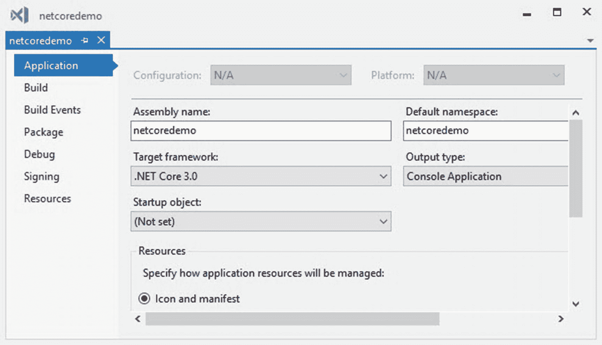

图 5-1。

目标.NET Core 3.0

我不打算详细介绍如何创建. NET 核心控制台应用。这里的重点是告诉你如何瞄准。网芯 3.0。

创建 ASP.NET 核心应用时，确保从下拉列表中选择 ASP.NET 核心 3.0(图 [5-2](#Fig2) )。

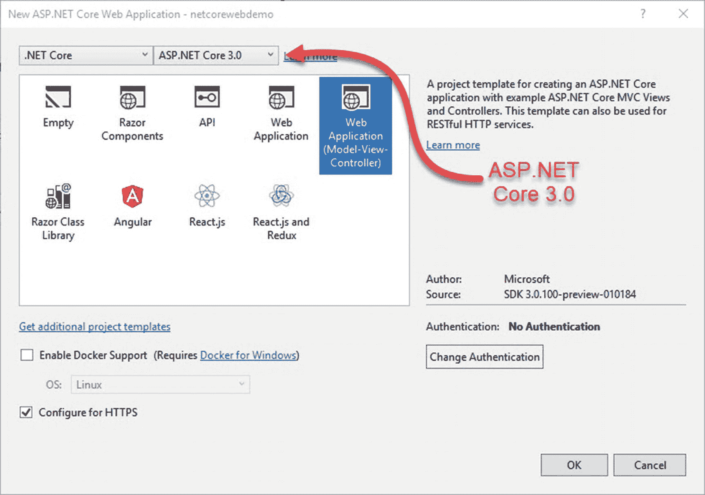

图 5-2。

创建 ASP.NET 核心 3.0 应用

我在 Visual Studio 中的解决方案现在包含两个项目，如图 [5-3](#Fig3) 所示。这是一个. NET 核心控制台应用和一个 ASP.NET 核心 MVC 应用。

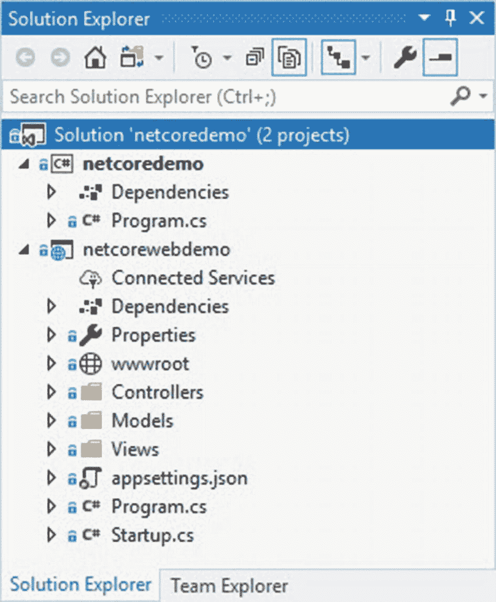

图 5-3。

解决方案浏览器

创建了两个应用模板之后，让我们来看看。网芯 3.0 可以为开发者提供。

## 中的新内容.NET Core 3.0

中有许多新功能。网芯 3.0，有些我就不讨论了。然而，我将强调一些更有趣的特性。

### Windows 桌面

随着的发布。NET Core 3.0，您现在可以使用 Windows 窗体和 WPF 创建 Windows 桌面应用，如图 [5-4](#Fig4) 所示。如果向解决方案中添加一个新项目，并按。NET Core，你会注意到你有两个新的模板可以选择。

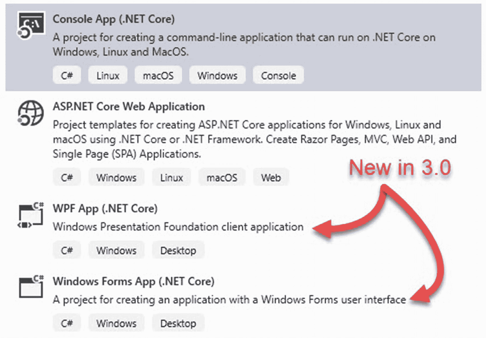

图 5-4。

新的 .NET Core 项目模板

的前两个版本迭代。NET Core 支持的 web 应用和 API、物联网和控制台应用。

请注意即使。NET Core 3.0 增加了对使用 WinForms 和 WPF 构建 Windows 桌面应用的支持，但你仍然只能在 Windows 上运行这些应用。

因为实体框架被很多桌面 app 使用，。NET Core 3.0 也支持实体框架 6。Visual Studio 2019 让你能够创建 WinForm 和 WPF 应用，但你可以在命令行中使用`dotnet new`做同样的事情。创建一个新的 .NET Core 应用的 WPF 和 WinForms，您可以从命令行运行以下命令。

```cs
dotnet new wpf
dotnet new winforms

Listing 5-1Using dotnet new in the command line

```

看到多简单了吗？事实上，看一下命令行就会看到图 [5-5](#Fig5) 中的截图。

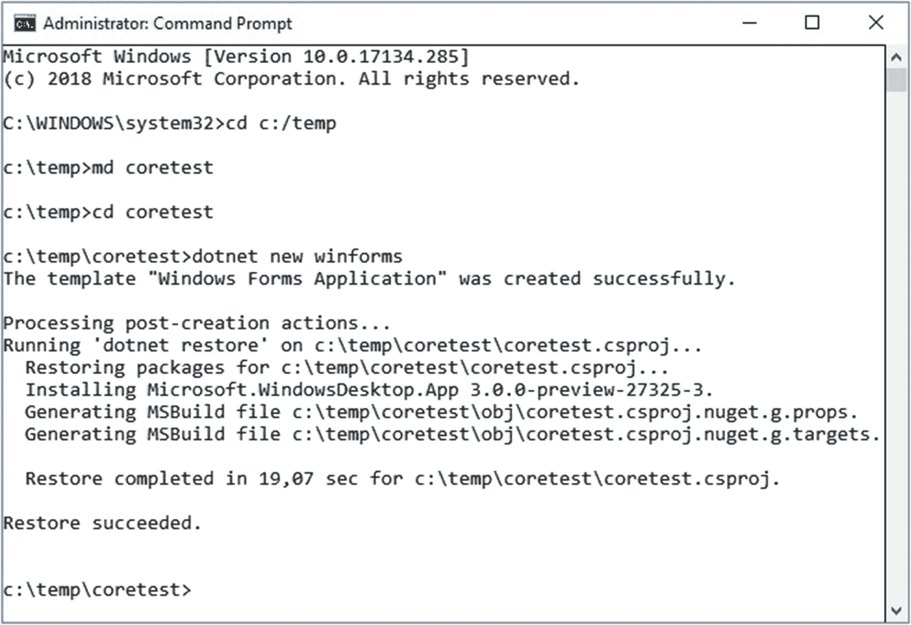

图 5-5。

带 dotnet 的新 WinForms 应用新

如果我们现在将鼠标悬停在我们创建的文件夹上，我们可以看到由`dotnet new`创建的解决方案文件(图 [5-6](#Fig6) )。

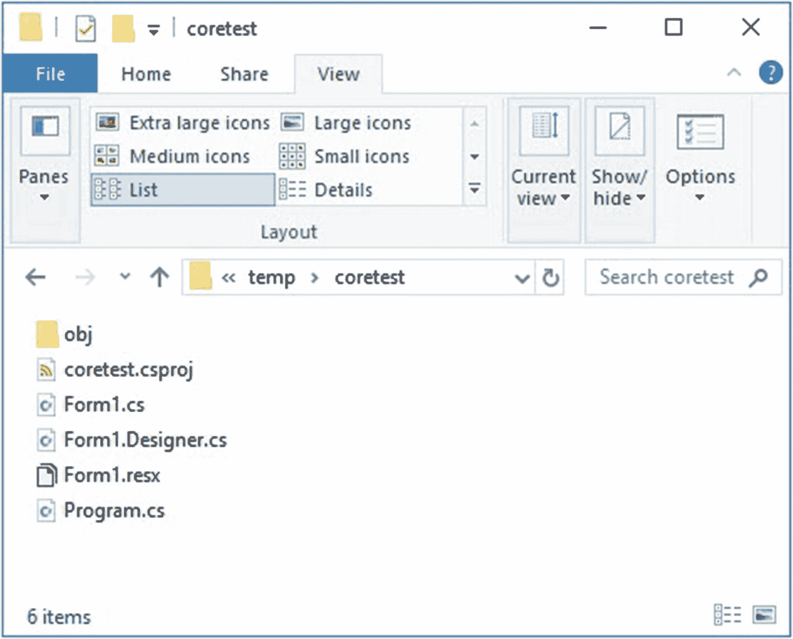

图 5-6。

的文件。NET Core WinForm app

现在，您可以通过在命令行中键入`dotnet run`来运行新的 WinForms 应用。编译和显示您的应用可能需要几秒钟的时间，但是很快您就会看到。NET Core WinForm app 如图 [5-7](#Fig7) 所示。

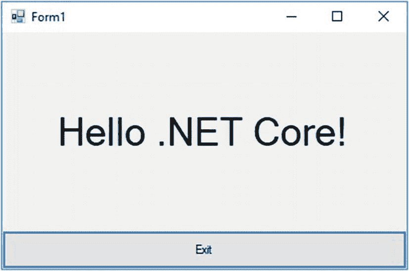

图 5-7。

运行。NET Core WinForms 应用

如果您查看用于创建应用的文件夹，您会注意到现在添加了一个 bin 文件夹。创作的时候 .NET Core 控制台应用，该项目的目标是`Microsoft.NET.Sdk` SDK。如果您查看的 *netcoredemo.csproj* 文件，您会看到这一点 .NET Core 控制台应用。

```cs
<Project Sdk="Microsoft.NET.Sdk">

  <PropertyGroup>
    <OutputType>Exe</OutputType>
    <TargetFramework>netcoreapp3.0</TargetFramework>
  </PropertyGroup>

</Project>

Listing 5-2.NET Core Console csproj file

```

那个。NET Core WinForms 应用使用不同的 SDK(WPF 应用也顺便使用)，但也声明它使用哪个 UI 框架。

那个。NET Core WPF 应用将在 csproj 文件中声明一个`<UseWPF>true</UseWPF>`属性，而。NET Core WinForms app 会在 csproj 文件中声明一个`<UseWindowsForms>true</UseWindowsForms>`属性。

```cs
<Project Sdk="Microsoft.NET.Sdk.WindowsDesktop">

  <PropertyGroup>
    <OutputType>WinExe</OutputType>
    <TargetFramework>netcoreapp3.0</TargetFramework>
    <UseWindowsForms>true</UseWindowsForms>
  </PropertyGroup>

</Project>

Listing 5-3.NET Core WinForms csproj file

```

我敢肯定，随着微软宣布推出 WinForms 和 WPF 桌面应用，你们中的一些人可能会期待它们能在 Linux 或 macOS 上运行。网芯 3.0。开发者社区对此似乎有些失望。然而使用的好处是。NET Core for Windows 应用意味着我们拥有

*   提高性能

*   开源带来的好处

*   能够安装多个 .NET Core 版本并行

*   发布独立应用的能力

*   获得。仅网络核心功能(如`Span<T>`)

是的，他们让我在*改进性能*。如你所知。NET Core 是开源的，但是 *WPF* 、 *Windows Forms* 、 *WinUI* 也都是开源的。在 GitHub 上找到它们:

*   WPF: [`https://github.com/dotnet/wpf`](https://github.com/dotnet/wpf)

*   Windows 窗体: [`https://github.com/dotnet/winforms`](https://github.com/dotnet/winforms)

*   Windows UI: [`https://github.com/Microsoft/microsoft-ui-xaml`](https://github.com/Microsoft/microsoft-ui-xaml)

作为。NET Core 的发展，我们肯定会看到对 Windows 桌面应用中常用的 API 的更多支持。

### 支持 C# 8.0

回想一下我们讨论 C# 8.0 的第 3 章。开发人员可以使用的功能现在可以在中使用。网芯 3.0。随着每个新预览版的发布，更多的 C# 8.0 特性被引入。

这样做是有意义的，因为 C# 8.0 在别处可用，而在。NET Core 会有些令人沮丧。通读第 3 章(如果还没有通读的话)，看看 C# 8.0 在语言改进方面为你提供了什么。

### 默认可执行文件

对于使用全局安装版本的应用 .NET Core，它们是用默认的 exe 文件构建的。在此之前，您只有一个自带应用的 exe。这意味着您可以双击 exe 或从命令行启动它，而无需使用 dotnet 工具。

#### 在窗口上

在 Windows 上，您可以执行以下操作在 *c:\temp* 文件夹中创建一个新目录，创建一个新的 .NET Core 控制台应用并运行它。

```cs
cd c:\temp
md coreconsoletest
cd c:\temp\coreconsoletest
c:\temp\coreconsoletest>dotnet new console
dotnet build
cd c:\temp\coreconsoletest\bin\debug\netcoreapp3.0
coreconsoletest.exe

Listing 5-4Creating a .NET Core Console app on Windows

```

如果你运行你的 exe，你会看到文本 *Hello World！*在控制台窗口输出，如图 [5-8](#Fig8) 所示。通过*点网*运行 dll 会产生相同的结果。

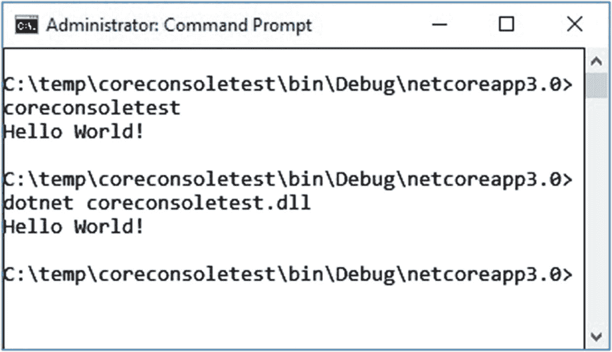

图 5-8。

运行默认的 exe 和 dll

#### 在 macOS 上

我们可以在 macOS 上做同样的事情。一定要下载。NET Core 3.0 预览版，安装在 macOS 上。接下来，打开终端。

在终端中，我在桌面上创建了一个名为 *netcoremac* 的文件夹，然后切换到该目录。然后我创建一个新的 .NET Core 控制台应用中的目录并构建它。然后我把目录换到可执行文件所在的位置，也就是 *netcoreapp3.0* 目录。

```cs
mkdir ~/Desktop/netcoremac
cd ~/Desktop/netcoremac
dotnet new console
dotnet build
cd ~/Desktop/netcoremac/bin/Debug/netcoreapp3.0

Listing 5-5Creating a .NET Core Console app on macOS

```

然后我就可以用`./netcoremac`运行 *netcoremac* 可执行文件，也可以用`dotnet`命令运行 netcoremac.dll，如图 [5-9](#Fig9) 所示。

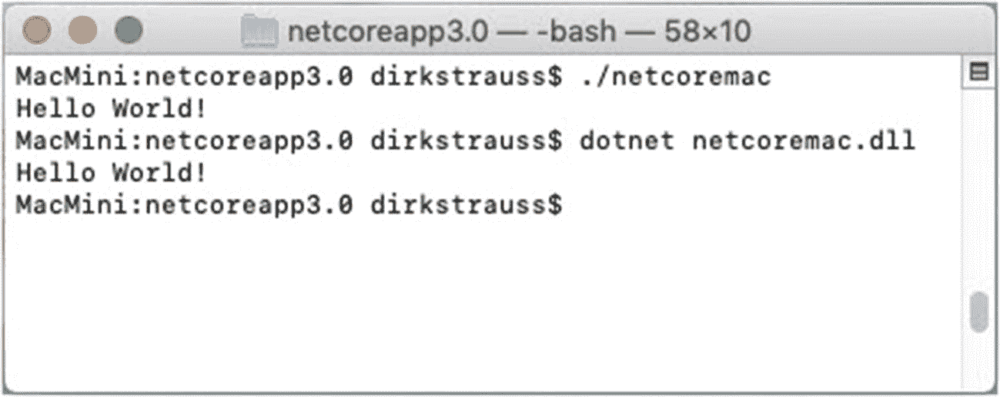

图 5-9。

在 macOS 上运行默认的可执行文件和 dll

#### 在 Linux 上

在 Linux 上，对于新的 .NET Core 控制台应用。打开终端，在桌面上创建一个名为 *netcorelinux* 的目录。在那个目录中，我创建了一个新的 .NET Core 控制台应用。

```cs
cd ~/Desktop
mkdir netcorelinux
cd netcorelinux
dotnet new console
dotnet build
cd ~/Desktop/netcorelinux/bin/Debug/netcoreapp3.0

Listing 5-6Creating a .NET Core Console app on Linux

```

我可以使用在 macOS 上使用的相同命令来运行默认的可执行文件。运行命令`./netcorelinux`运行默认的可执行文件，然后运行命令`dotnet netcorelinux.dll`运行 dll。输出如图 [5-10](#Fig10) 所示。

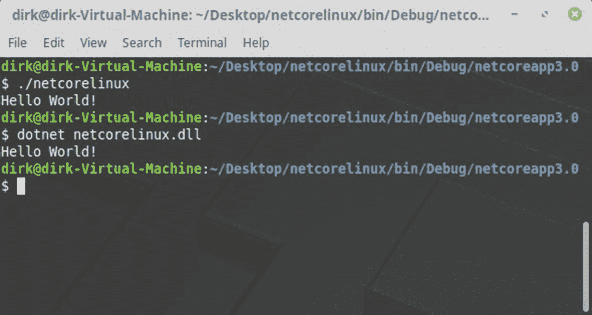

图 5-10。

在 Linux 上运行默认的可执行文件和 dll

### 快速内置 JSON 支持

JSON 已经成为现代社会的一部分。网络开发。首选图书馆是 Json.Net。从……开始。NET Core 3.0 中，`System.Text.Json`名称空间中添加了三种主要的 JSON 相关类型，以提供内置的 JSON 支持。这些是

*   系统。Text.Json.Utf8JsonReader

*   系统。Text.Json.Utf8JsonWriter

*   系统。text . JSON . JSON 文档

这意味着新的内置 JSON 支持提供了高性能和低分配，并且基于`Span<byte>`。你可以在这里阅读更多关于`Span<T>`的内容: [`https://docs.microsoft.com/en-us/dotnet/api/system.span-1`](https://docs.microsoft.com/en-us/dotnet/api/system.span-1)

### 密码系统

`System.Security.Cryptography.AesGcm`和`System.Security.Cryptography.AesCcm`名称空间增加了对 AES-GCM 和 AES-CCM 密码的支持。这些是添加到中的第一批经过身份验证的加密算法 .NET Core。让我们看看我们之前创建的 *netcoredemo* 控制台应用。我们将添加基本的加密和解密方法。确保您已经添加了`System.Security.Cryptography`名称空间。

```cs
public static byte[] Encrypt(out byte[] key, out byte[] nonce, out byte[] tag, byte[] dataToEncrypt)
{
    key = new byte[16];
    nonce = new byte[12];
    RandomNumberGenerator.Fill(key);
    RandomNumberGenerator.Fill(nonce);

    tag = new byte[16];
    byte[] ciphertext = new byte[dataToEncrypt.Length];

    using (AesGcm aes = new AesGcm(key))
        aes.Encrypt(nonce, dataToEncrypt, ciphertext, tag);

    return ciphertext;
}

Listing 5-7
AES-GCM encryption method

```

我们使用 out 参数将`key`、`nonce`和`tag`值传递回调用代码。

使用加密技术时，我们会创建一个随机数，它是一个随机值，用于防止重放攻击。这是如果有人拦截了第一条消息并试图第二次发送该消息。每条消息的随机数必须是唯一的。如果接收应用收到重复的 nonce，它知道需要丢弃该消息。

加密的数据被返回给调用代码，并传递给 Decrypt 方法。

```cs
public static void Decrypt(byte[] key, byte[] nonce, byte[] tag, byte[] ciphertext)
{
    byte[] decryptedData = new byte[ciphertext.Length];
    using (AesGcm aes = new AesGcm(key))
        aes.Decrypt(nonce, ciphertext, tag, decryptedData);

    string decryptedText = Encoding.UTF8.GetString(decryptedData);
    Console.WriteLine(decryptedText);
}

Listing 5-8
AES-GCM decryption method

```

调用代码将调用`Encrypt`和`Decrypt`方法，如下所示。

```cs
byte[] dataToEncrypt = Encoding.UTF8.GetBytes("String to encrypt");

var encrData = Encrypt(out byte[] key, out byte[] nonce, out byte[] tag, dataToEncrypt);
Decrypt(key, nonce, tag, encrData);
Console.ReadLine();

Listing 5-9Calling Encrypt and Decrypt

```

运行应用，您将看到解密的文本显示在`decryptedText`变量中。见图 [5-11](#Fig11) 我检查过的变量。

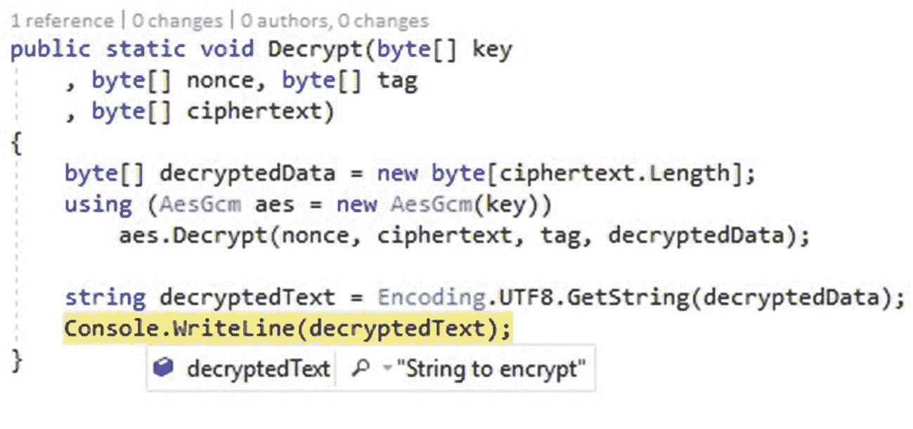

图 5-11。

解密文本

如果您想实现 AES-CCM 密码，您基本上可以做同样的事情，只是使用不同的类名(`AesCcm`)。

## 正在安装。带有 Snap 的 Linux 上的 NET Core 3.0 预览版

推荐的安装方式。Linux 上的 NET Core 3.0 预览版是通过 Snap 实现的。在写本章的时候，下列 Linux 发行版支持 Snap:

*   Arch Linux

*   一种自由操作系统

*   深度

*   基本操作系统

*   一种男式软呢帽

*   加利亚姆斯

*   KDE 霓虹灯

*   库班图

*   Linux 作为

*   卢班图

*   manjaro

*   大蜥蜴

*   Parrot 安全操作系统

*   Raspbian

*   Solus

*   人的本质

*   徐邦图

*   佐伦·OS

出于我的目的，我使用了 Linux Mint。在 Linux 系统上配置 Snap 之后，运行以下命令来安装。网芯 3.0 预览版。

```cs
sudo snap install dotnet-sdk --beta --classic

Listing 5-10Install .NET Core 3.0 Preview with Snap

```

这是现在的默认设置。通过 Snap 安装时的 NET Core 命令`dotnet-sdk.dotnet`。这是一个命名空间命令，不会与全局安装的冲突。您可能在 Linux 系统上安装了. NET Core 版本。我更喜欢使用默认的`dotnet`命令，因为这只是我使用的 Linux 的一个测试安装。

为此，您可以在终端中运行以下命令，为您的`dotnet-sdk.dotnet`命令创建一个别名。

```cs
sudo snap alias dotnet-sdk.dotnet dotnet

Listing 5-11Creating the dotnet alias

```

有关设置的更多信息。Linux 上的 NET Core，参考以下链接: [`https://github.com/dotnet/core/blob/master/Documentation/linux-setup.md`](https://github.com/dotnet/core/blob/master/Documentation/linux-setup.md) 。

## 在 Linux 上创建并运行 ASP.NET MVC 应用

在 Linux 桌面上创建一个新文件夹。出于我的目的，我使用 Linux Mint。打开“终端”并导航到您创建的新文件夹。若要查看哪些模板可供您使用，请在“终端”中键入以下命令。

```cs
dotnet new -l

Listing 5-12Listing the dotnet new templates

```

现在这里列出了所有可用的项目模板，您可以使用`dotnet new`命令创建这些模板。

请注意，在安装之后，我通过键入`sudo snap alias dotnet-sdk.dotnet dotnet`将我的`dotnet-sdk.dotnet`命令别名为`dotnet`。NET Core 3.0 预览版。

列出的模板之一是 ASP.NET 核心 MVC 应用。要创建此项目类型，请在之前在桌面上创建的目录中，在终端中运行以下命令。

```cs
dotnet new mvc

Listing 5-13Create a .NET Core MVC app on Linux

```

这将在我们之前创建的文件夹中创建您的 ASP.NET 核心 MVC 应用。

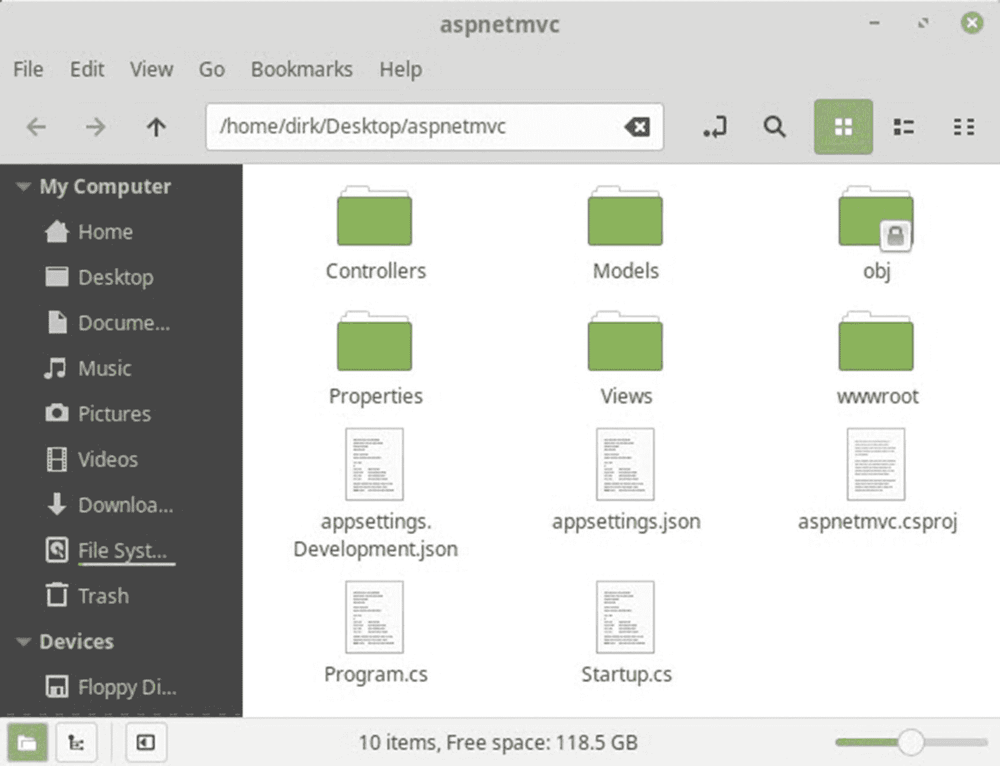

图 5-12。

ASP.NET 核心 MVC 项目

打开文件夹，您会注意到我们有所有我们通常在 Visual Studio 中看到的熟悉文件(图 [5-12](#Fig12) )。

如果在*上遇到*访问路径*错误。创建 MVC 应用时，nuget/packages* 文件夹或 *csproj* 文件上的*权限被拒绝*错误，运行`sudo dotnet restore`并在提示时键入您的密码。

要运行新的 ASP.NET 核心 MVC 应用，请在终端中键入以下命令。

```cs
dotnet run

Listing 5-14Running your ASP.NET Core MVC app

```

您将看到终端显示一些信息消息。其中一条消息应该是*正在监听:* `https://localhost:[port]`，其中【端口】是一个有效的端口号。在你的浏览器中输入那个 URL(我用的是 Firefox)，你会看到你的 ASP.NET 核心 MVC 应用运行在 Linux 上，如图 [5-13](#Fig13) 所示。

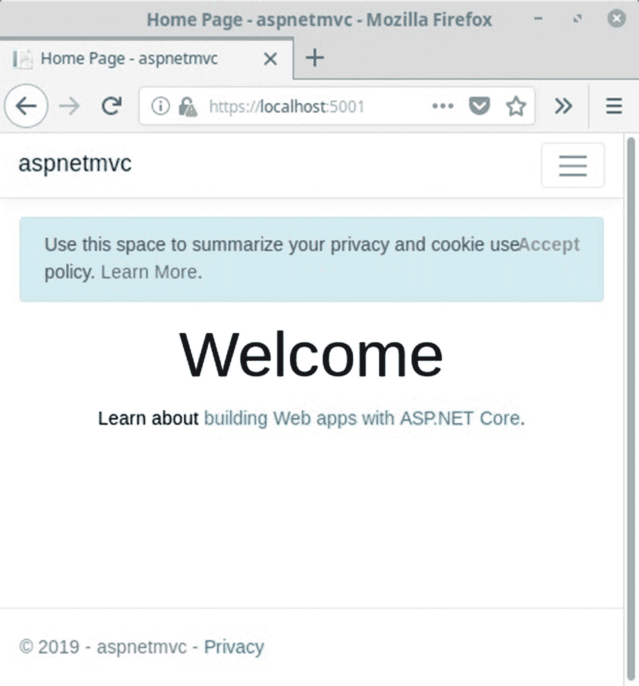

图 5-13。

Linux 上 Firefox 中的 ASP.NET 核心 MVC 应用

整个过程甚至不需要我们花 2 分钟来创建一个项目并在 Linux 上运行它。

## 使用 Visual Studio 代码在 Linux 上编辑您的 ASP.NET 核心 MVC 应用

微软做了大量的工作将 Visual Studio 带到所有平台上。Visual Studio 代码为开发人员在 Linux 和 macOS 上创建应用提供了一个极好的 IDE。如果我需要快速处理一个文件，我甚至每天都在我的 Windows 机器上使用它。

Visual Studio 代码可以从以下网址下载: [`https://code.visualstudio.com/`](https://code.visualstudio.com/) 。使用 Visual Studio 代码的好处是

*   这是一个免费的 IDE，对于想要尝试新事物的开发人员来说是完美的。

*   它也是开源的。你可以在 GitHub 上查看这里的资源库: [`https://github.com/Microsoft/vscode`](https://github.com/Microsoft/vscode) 。

*   它可以在 Windows、macOS 和 Linux 上运行。

这意味着我可以在 Linux 的 Visual Studio 代码中编辑我的 ASP.NET 核心 MVC 项目。

### 编辑您的项目

我已经下载了 Visual Studio 代码并安装在我的 Linux Mint 安装上。让我们用它来打开我们的 ASP.NET 核心 MVC 应用，并为 *HomeController* 修改 *Index.cshtml* 文件。首先打开 Visual Studio 代码并点击 Explorer 或者按下 *Ctrl+Shift+E* 。图 [5-14](#Fig14) 显示了在 Visual Studio 代码中可以找到资源管理器的地方。

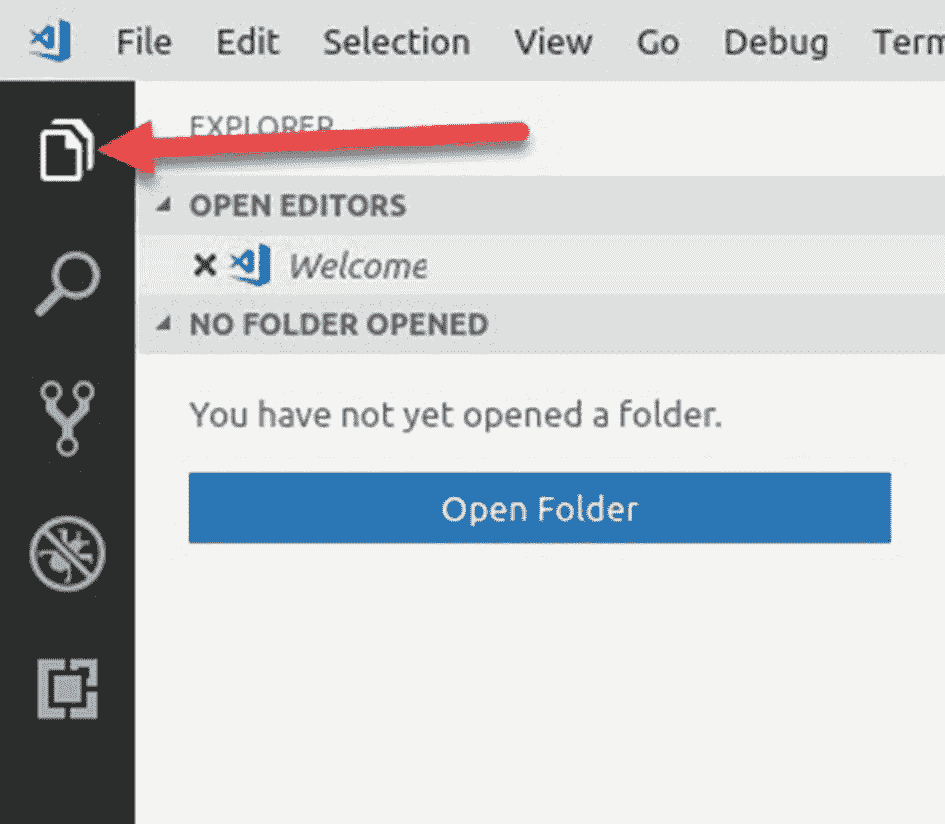

图 5-14。

开启 Visual Studio 程式码总管

单击“打开文件夹”，然后打开项目的顶层文件夹。您将看到如图 [5-15](#Fig15) 所示的项目文件。

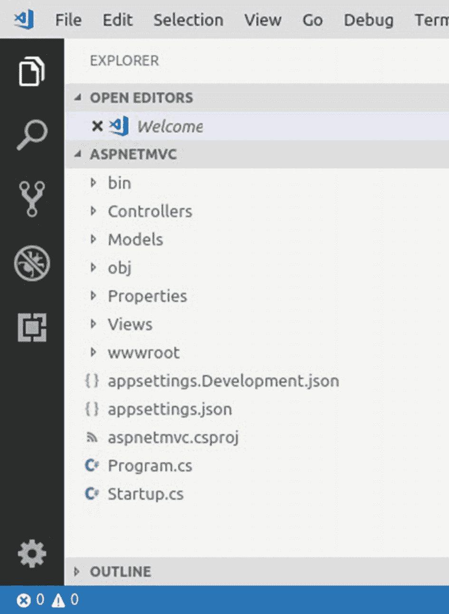

图 5-15。

在 Visual Studio 代码中打开项目

在*视图*文件夹中，选择*主页*文件夹，点击 *Index.cshtml* 。这将在代码编辑器中打开文件。如下修改您的代码。

```cs
@{
    ViewData["Title"] = "Home Page";
    var longAgoDate = DateTime.Today.AddYears(-100);
    var longDayOfWeek = longAgoDate.DayOfWeek;
}

<div class="text-center">
    <h1 class="display-4">Welcome</h1>
    <h2 class="display-4">100 Years ago was @longDayOfWeek, @longAgoDate.ToString("MMMM dd, yyyy")</h2>
</div>

Listing 5-15The Index.cshtml view

```

将更改保存到文件中，然后在终端中键入`dotnet build`命令，然后键入`dotnet run`。在 Firefox 中运行你的应用(图 [5-16](#Fig16) )。

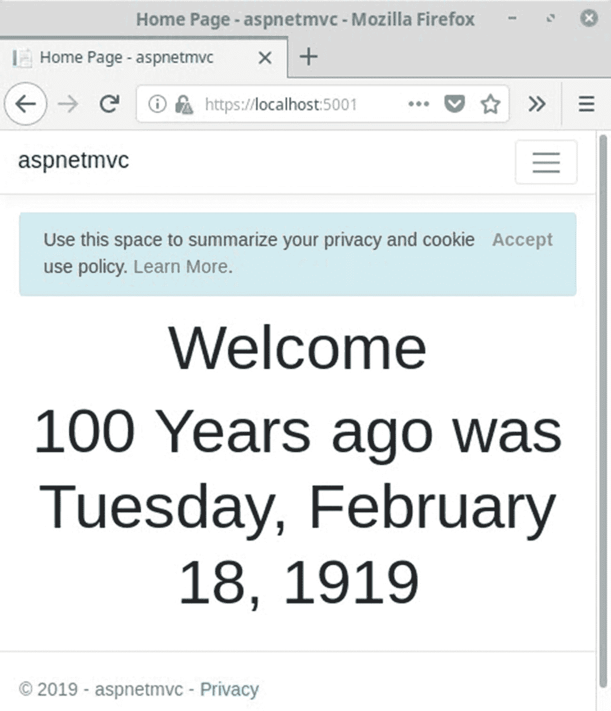

图 5-16。

修改的 ASP.NET 核心 MVC 项目

## 用 Visual Studio 代码调试您的 ASP.NET 核心 MVC 项目

Visual Studio 代码允许您调试代码。你需要做一点繁重的工作来完成所有的设置，但是一旦你完成了这些，你就一切顺利了。

我在 Linux 上设置了这个例子，所以如果您不在 Linux 上工作，这些步骤可能会与您的系统不同。我用的是 Linux Mint。

为此，打开 Visual Studio 代码，查看一下*扩展*窗格，或者按住 *Ctrl+Shift+X* 。搜索由 OmniSharp 驱动的 C# 扩展(图 [5-17](#Fig17) )。

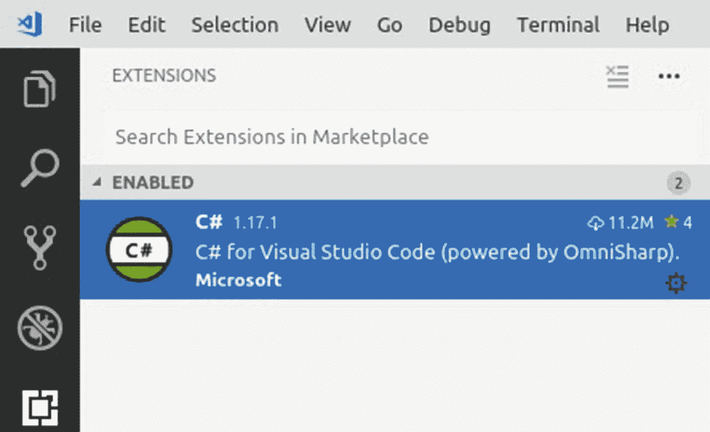

图 5-17。

Visual Studio 代码扩展的 C#

在 Visual Studio 代码中，打开您之前在其中创建项目的 *aspnetmvc* 文件夹。当你这样做的时候，你应该看到下面的消息显示:*‘aspnet MVC’中缺少构建和调试所需的资产。加他们？*

当您单击“是”时，Visual Studio 代码将添加一个*。vscode* (图 [5-18](#Fig18) )文件夹到你的项目中。

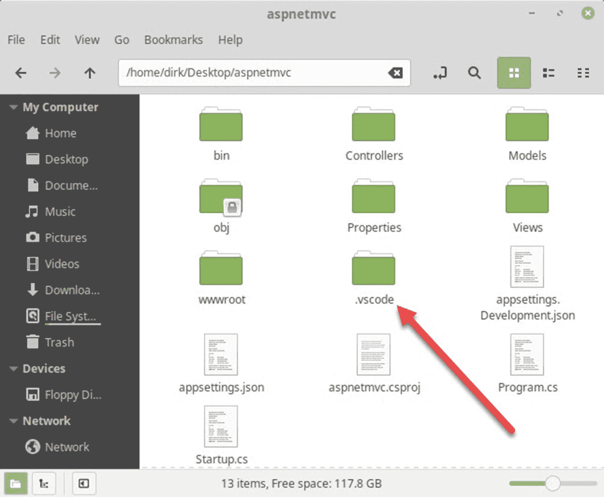

图 5-18。

确保. vscode 文件夹存在

在这个*里面。vscode* 文件夹，你会看到应该有两个 Visual Studio 代码创建的文件。这些文件是

*   launch.json

*   tasks.json

您将需要这些文件(图 [5-19](#Fig19) )来调试您的 ASP.NET 核心 MVC 应用。如果这些文件不存在，删除*。vscode* 文件夹，重启 Visual Studio 代码，再次打开 *aspnetmvc* 项目文件夹。

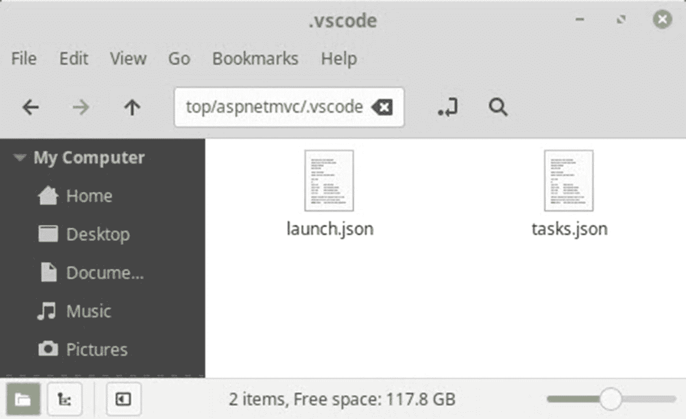

图 5-19。

确保启动和任务文件存在

打开 *launch.json* 文件，检查其中的内容。注意，需要为 bin 文件夹中的【aspnetcore.dll】文件*设置正确的路径。launch.json 文件配置并保存所有调试设置细节。调试项目时会用到这些调试配置信息。*

```cs
   "version": "0.2.0",
   "configurations": [
       {
           "name": ".NET Core Launch (console)",
           "type": "coreclr",
           "request": "launch",
           "preLaunchTask": "build",
           "program": "${workspaceFolder}/bin/Debug/netcoreapp3.0/aspnetmvc.dll",
           "args": [],
           "cwd": "${workspaceFolder}",
           "stopAtEntry": false,
           "console": "internalConsole"
       },
        {
            "name": ".NET Core Launch (web)",
            "type": "coreclr",
            "request": "launch",
            "preLaunchTask": "build",
            // If you have changed target frameworks, make sure to update the program path.
            "program": "${workspaceFolder}/bin/Debug/netcoreapp3.0/aspnetmvc.dll",
            "args": [],
            "cwd": "${workspaceFolder}",
            "stopAtEntry": false,
            "internalConsoleOptions": "openOnSessionStart",
            "launchBrowser": {
                "enabled": true,
                "args": "${auto-detect-url}",
                "windows": {
                    "command": "cmd.exe",
                    "args": "/C start ${auto-detect-url}"
                },
                "osx": {
                    "command": "open"
                },
                "linux": {
                    "command": "xdg-open"
                }
            },
            "env": {
                "ASPNETCORE_ENVIRONMENT": "Development"

            },
            "sourceFileMap": {
                "/Views": "${workspaceFolder}/Views"
            }
        },
        {
            "name": ".NET Core Attach",
            "type": "coreclr",
            "request": "attach",
            "processId": "${command:pickProcess}"
        }
    ,]
}

Listing 5-16The launch.json file contents

```

我们看到的下一个文件是 tasks.json 文件。这将在您的 ASP.NET 核心 MVC 项目上运行构建任务。它可以包含其他几个任务，但目前这是我们所需要的。

```cs
{
    "version": "2.0.0",
    "tasks": [
        {
            "label": "build",
            "command": "dotnet build",
            "type": "shell",
            "group": "build",
            "presentation": {
                "reveal": "silent"
            },
            "problemMatcher": "$msCompile"
        }
    ]
}

Listing 5-17The tasks.json file contents

```

接下来，展开*视图* ➤ *主页*文件夹，打开 *Index.cshtml* 文件。点击空白处，在图 [5-20](#Fig20) 第 4 行放置一个断点。

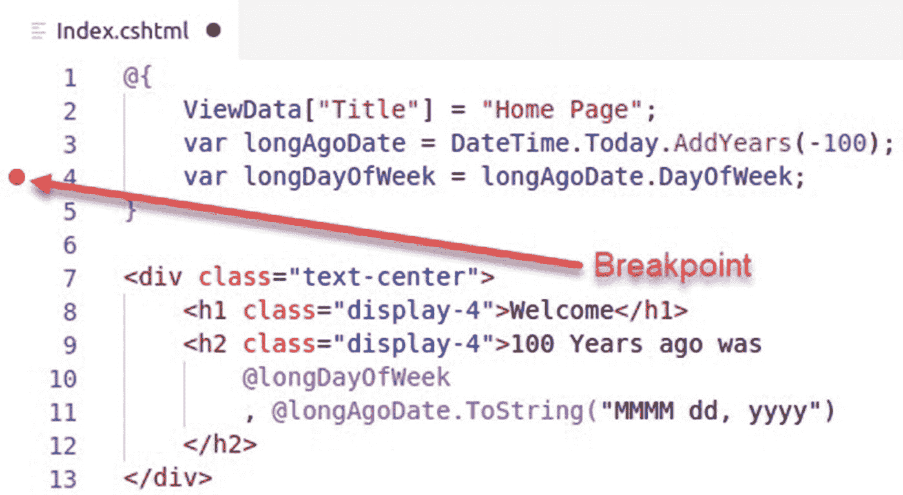

图 5-20。

放置断点

我们现在需要按住 *Ctrl+Shift+D* 来调出调试窗格，如图 [5-21](#Fig21) 所示。首先，您会注意到您可以访问熟悉的变量、观察和调用堆栈。您还会看到断点组，当前设置的断点显示在 *Index.cshtml* 文件上。

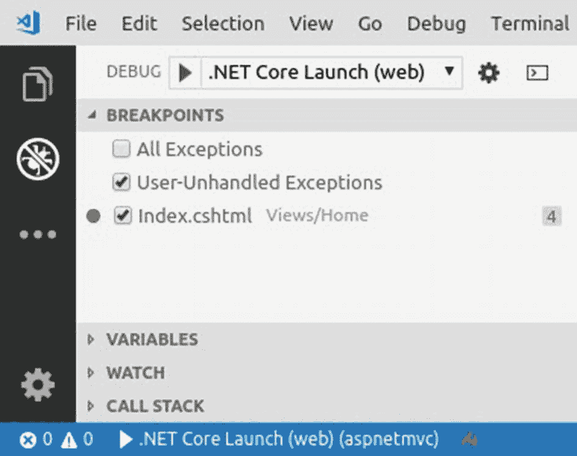

图 5-21。

调试窗格

从调试组合框中，选择*。NET Core Launch (web)* 点击绿色播放按钮(图 [5-22](#Fig22) )。

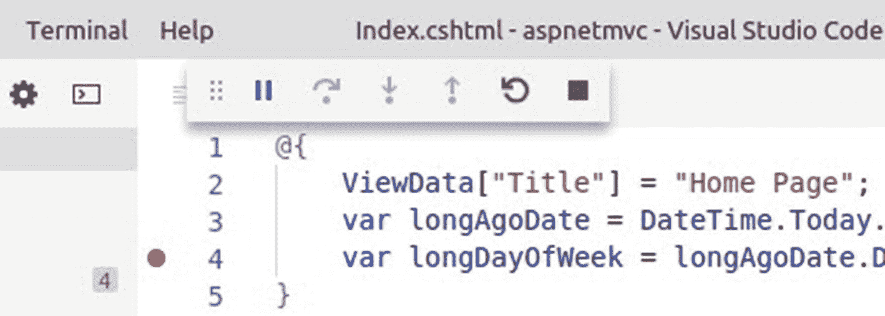

图 5-22。

调试开始

项目将通过一个生成过程，如果成功，调试栏将显示在 Visual Studio 代码 IDE 窗口的顶部。现在你要打开*调试控制台*。你可以通过*视图* ➤ *调试控制台*菜单或者按住 *Ctrl+Shift+Y* 来实现。您将看到我们之前看到的熟悉的输出，并且您会注意到它表明`Microsoft.Hosting.Lifetime` web 主机正在本地主机上侦听(图 [5-23](#Fig23) )。

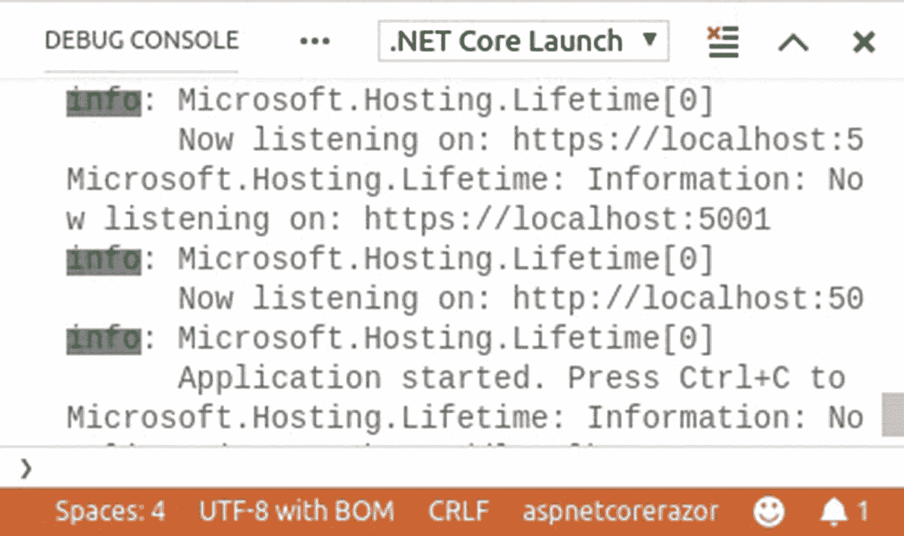

图 5-23。

调试控制台

回到浏览器(我用的是 Firefox ),输入调试控制台中指定的 URL。

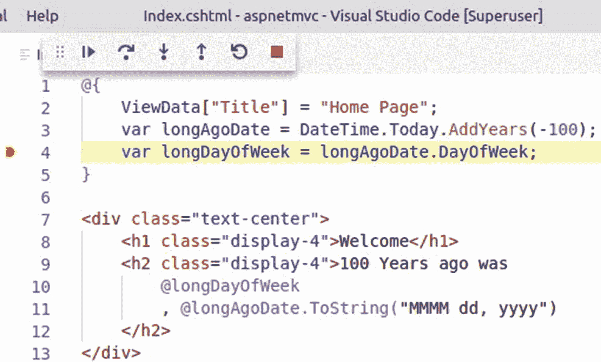

图 5-24。

断点命中

当你的网页加载时，你的断点将被点击，如图 [5-24](#Fig24) 所示。现在，您可以像平常一样逐句通过代码、查看变量、使用"监视"窗口以及执行所有正常的调试任务。您还可以在单步执行代码行时，通过将鼠标悬停在编辑器中的变量上来检查变量。

## 包扎

我们以微软文档( [`https://docs.microsoft.com`](https://docs.microsoft.com) )的形式提供了丰富的在线信息，这些信息正是您所需要的。我希望这一章至少激起了你对。网芯 3.0。随着框架的发展，我们将会在每个版本中看到更多的特性。

这一章看了一下创造 .NET Core 应用。我们看到现在可以在上创建一个 Windows 桌面应用 .NET Core，但这些仅在 Windows 上受支持。

然后我们看了一些更有趣的新特性。网芯 3.0。我们看到我们支持 C# 8、快速内置 JSON 支持和加密技术。

我们看到我们可以安装。NET Core 3.0 在 Linux 上使用 Snap。继续使用 Linux，我们创建了一个 ASP.NET 核心 MVC 应用，并在 Linux 上运行。使用 Visual Studio 代码，我们看到可以编辑我们的项目文件，最后，我们看到可以使用 Visual Studio 代码在 Linux 上调试我们的应用。

如果您喜欢 Visual Studio 代码的灵活性，请继续关注。在下一章中，我们将浏览 Visual Studio 2019，并了解这款世界级 IDE 即将发布的新功能。你兴奋吗？我知道我是。