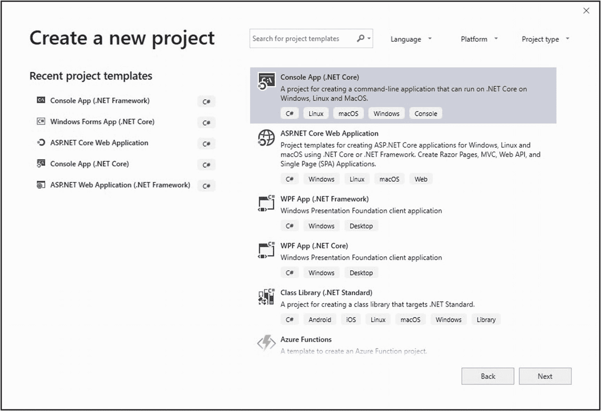
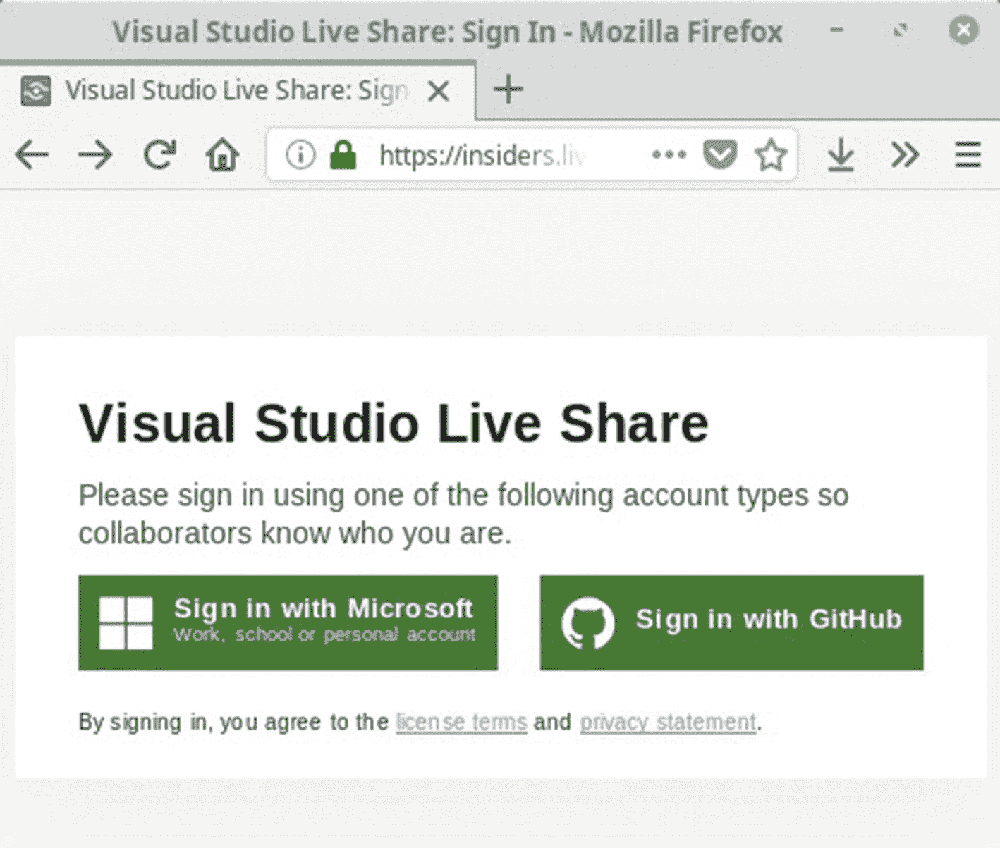
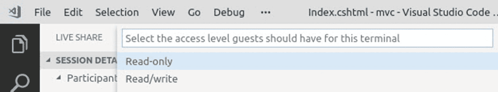

# 六、在 Visual Studio 中提高工作效率

自 20 多年前作为 Visual Studio 97 首次发布以来，Visual Studio 已经走过了漫长的道路。就我个人而言，我从 2003 年开始使用 IDE，并且很高兴看到它发展成今天的样子。然而，问题是开发人员陷入了编写代码的日常事务中，以至于他们往往会错过新版本的新功能和生产率的提高。

在某种程度上，我认为这是因为开发人员专注于完成工作。我们确实生活和工作在一个快节奏、以截止日期为导向的行业。因此，更好地了解新版本是很容易的，因为你需要完成工作。我经常听到开发人员说“我不知道你可以这样做！”。

事实上，许多开发人员非常专注于学习 C# 的新特性(举例来说)，这是理所当然的。让我们在我们的老朋友，可信赖的 IDE 的脚下停顿片刻(或一章)，它使这一切成为可能。

本章将看看新版本(目前在预览版中)在生产力改进和特性方面为我们提供了什么。

在撰写本章时，Visual Studio 2019 处于预览版 3 中。在最终发布之前，它可能会稍有变化，但是本章讨论的大部分内容应该保持不变。

我还将介绍一些现有的特性和好处，它们可以让您的日常开发工作变得更加轻松。我们将会看到

*   Visual Studio 2019 中的新功能

*   Visual Studio 实时共享

*   重构和代码修复

*   在 ASP.NET 项目中启用 JavaScript 调试

*   导出编辑器设置

*   使用 AI 的 Visual Studio IntelliCode

*   常规 Visual Studio 提示

这将变得更加令人兴奋，所以让我们开始使用 Visual Studio 2019。

## Visual Studio 2019 中的新功能

Visual Studio 2019 通过提供 UI 的全新视角，以更简洁和专注的方式为开发人员带来了最重要的内容。

### UI 改进

关于 Visual Studio 2019，你可能会注意到的第一件事是新的开始屏幕，如图 [6-1](#Fig1) 所示。


图 6-1。

Visual Studio 2019 开始菜单

微软将开发人员最常用的任务放在了开始菜单的最前面。在 Visual Studio 中，开始做最重要的事情真的很容易，那就是编写代码。

说到编写代码，new project 对话框还提供了对选择项目模板方式的改进。除了允许您从最近的项目类型列表中进行选择之外，您还可以通过从下拉菜单中进行选择来过滤项目模板，该下拉菜单可以根据语言、平台或项目类型进行过滤，如图 [6-2](#Fig2) 所示。



图 6-2。

“新建项目”对话框

这允许您快速搜索和选择项目模板，并开始编写代码。转到 IDE 本身，Visual Studio 2019 比 Visual Studio 2017 更能最大限度地减少混乱，只需最小化 chrome 和压缩菜单。这给了你更多的空间来写代码。对比 Visual Studio 2017 和 Visual Studio 2019 中的 IDE chrome 和菜单栏。

图 [6-3](#Fig3) 是我们目前在 Visual Studio 2017 中习惯看到的。


图 6-3。

Visual Studio 2017

图 [6-4](#Fig4) 展示了 Visual Studio 2019 的变化。你会注意到图标变了，Visual Studio 2019 IDE 看起来更紧凑了。


图 6-4。

Visual Studio 2019

事实上，请注意 Visual Studio 2017 的图像不包括*开始*按钮，而 Visual Studio 2019 的图像包括。这部分是由于缩短了解决方案配置和解决方案平台下拉菜单。

### 搜索改进

在 Visual Studio 2019 中，你可以点击菜单中的搜索栏(图 [6-5](#Fig5) )或者按住 Ctrl+Q 将光标从代码编辑器跳转到搜索文本框。


图 6-5。

Visual Studio 2019 搜索栏

这允许您立即开始输入并搜索您需要的内容，如图 [6-6](#Fig6) 所示。


图 6-6。

Visual Studio 2019 中的搜索结果

搜索结果显示得很快，这给 IDE 一种更快的感觉(特别是当您专注于代码时)。你会注意到我打错了搜索词*类*，但是 Visual Studio 2019 仍然使用模糊搜索为我返回了相关结果。

搜索结果包括您正在寻找的菜单路径。但是，使用 Visual Studio search 为您提供了进入这些菜单的快捷方式，因此您可以将手放在键盘上。另一个需要注意的要点是，现在可以直接从 Visual Studio 2019 搜索结果中创建新项目。在前面的例子中，您可以看到我可以从我的搜索结果中添加一个新的类。

最后，如果你没有看到你要找的结果，你可以点击搜索结果底部的链接在网上搜索。

这些对搜索的改进使 Visual Studio 2019 更容易导航，并在一个真正功能丰富的 IDE 中找到自己的路。快，找到 *C# 互动*！走吧。

### 清理您的代码

Visual Studio 2019 为您提供了对代码以及如何格式化代码的大量控制。一个很好的方法是通过代码清理。

Visual Studio 允许您配置您的代码清理，所以让我们这样做。使用搜索栏查找单词*清理*，如图 [6-7](#Fig7) 所示。


图 6-7。

搜索代码清理配置屏幕

您将看到搜索结果包括*配置代码清理*。也可以按住 Ctrl+K，Ctrl+Q 打开配置画面。


图 6-8。

配置代码清理

图 [6-8](#Fig8) 中的配置屏幕允许您启用您想要在代码中应用的修复程序。请注意，我已经将*应用内联‘输出’变量首选项*添加到我的*启用修复程序*列表中。您也可以将这些偏好设置应用到另一个配置文件。

如果我们可以添加/重命名配置文件，那不是很好吗？提示提示 Visual Studio 团队。

回到我的代码编辑器，你会看到我可以点击一个小画笔图标(图 [6-9](#Fig9) )来执行代码清理。


图 6-9。

代码清理前的代码

我还可以单击向下箭头来查看更多选项，例如运行与特定概要文件相关的代码清理，如图 [6-10](#Fig10) 所示。我也可以从这里访问代码清理配置。


图 6-10。

运行代码清理

现在，我只想应用内联‘out’变量首选项。点击画笔图标或按住 *Ctrl+K，Ctrl+E* ，你的代码将根据你的代码清理偏好被清理。你可以在图 [6-11](#Fig11) 中看到结果。


图 6-11。

代码已清理

除了配置代码清理配置文件之外，为了提高代码质量，我什么都不用做。这是新的 Visual Studio 2019 令人难以置信的强大功能和增值。

### 调试改进

当您调试代码时，您会注意到单步执行更快了。您还会注意到，现在您可以通过内置的搜索栏搜索您的*汽车*、*本地*和*手表*窗口(图 [6-12](#Fig12) )。


图 6-12

监视窗口包括搜索功能

这真的很方便，尤其是当你的橱窗里有很多东西需要浏览的时候。您还会看到默认的搜索深度设置为 3。您可以更改这一点，但这意味着在搜索停止之前，您的结果只会深入到树的三个层次。

### 每台显示器感知渲染

如果您使用配置了不同显示比例因子的多个监视器，Visual Studio 可能会稍微模糊或缩放不正确。Visual Studio 2019 为 Visual Studio 成为完全基于显示器的应用奠定了基础。

为了尝试新的 PMA 功能，您需要安装 Windows 10 版本 1803(图 [6-13](#Fig13) )或更高版本，以及。已安装. NET Framework 4.8 或更高版本。


图 6-13

Windows 10 要求

您可以通过转至工具➤选项并单击环境➤预览功能来启用预览功能，如图 [6-14](#Fig14) 所示。


图 6-14

预览功能

您会注意到，用于选择优化呈现的选项对我来说是灰色的，因为我没有。已安装. NET Framework 4.8。

### 免费/付费/试用扩展

在 Visual Studio 2017 之前，没有明确的方法来查看一个扩展是标记为免费、付费还是试用。有了 Visual Studio 2019，*扩展和更新*对话框会明确标记扩展是试用还是付费扩展。这种变化在图 [6-15](#Fig15) 中清晰可见。


图 6-15

免费/付费/试用扩展

免费扩展没有任何标签，而付费和试用扩展则明确标有蓝色标签。

## Visual Studio 实时共享

Visual Studio Live Share 是一项非常棒的服务，它允许您“给朋友打电话”。您可以与同事共享您的代码库及其上下文，并直接在 Visual Studio 中与他们协作。

您的同事可以阅读您的代码、浏览代码、编辑和调试您通过 Visual Studio Live Share 与他们共享的任何项目。最棒的是，Visual Studio 2019 中默认包含了 Visual Studio Live Share。

要了解有关 Visual Studio Live Share 的更多信息，或者下载 Visual Studio 代码或 Visual Studio 2017，请访问 [`https://visualstudio.microsoft.com/services/live-share/`](https://visualstudio.microsoft.com/services/live-share/)

是的，你没听错。它可用于 Visual Studio 代码。该服务在两个开发人员之间工作得非常好，不管项目类型、编程语言或您正在使用的操作系统如何。

Visual Studio Live Share 的巨大优势在于，它不需要开发人员专门为了帮助同事而停止回购或设置他们的环境。

在过去，不得不建立一个项目来协助另一个开发人员的痛苦，由于协助的人可能没有安装项目所需的依赖关系而变得更加复杂。

它为参与代码评审打开了方便之门。想象一下，给学生上编程课的讲师意味着什么。就我个人而言，我认为讲师可能会得到更少的锻炼，因为他们不必在计算机实验室里走来走去，帮助学生。

因此，您可能想知道 Visual Studio Live Share 到底有多棒？让我给你量化一下。这是与一位同事分享一个运行在 Linux 上的 Visual Studio 代码项目，使用运行在 Windows 10 上的 Visual Studio 2019 有点酷。

### 共享您的代码

我的朋友贾森·威廉姆斯住在纽约。他刚刚开始学习编程的诀窍，并想开始编写 ASP.NET 核心 MVC 应用。他在使用剃须刀时遇到了一点麻烦，需要我的帮助来告诉他如何在 HTML 中添加一个 C# 变量。

他使用 Visual Studio 代码作为他的 IDE，已经建立了他的项目并添加了一些代码。让我们看看如何使用 Visual Studio Live Share 来解决他的问题。

在 Visual Studio 代码中，Jason 已经安装了 VS Live Share 扩展并启用了它。

在本例中，Jason 已经通过他的 GitHub 帐户登录到 Live Share。有时，Live Share 无法识别 VS 代码中的浏览器登录。在这之后的部分，我会告诉你如果遇到问题，如何通过用户代码登录。

Jason 单击实时共享图标(步骤 1)打开实时共享面板。然后点击*会话详情*部分下的*开始协作会话*(图 [6-16](#Fig16) )。


图 6-16

Linux 上 Visual Studio 代码的实时共享

从图 [6-17](#Fig17) 中，您可以看到会话详细信息现在变为显示

*   参与者

*   共享服务器

*   共享终端

我还没有加入会话，因为 Jason 需要向我发送邀请链接。


图 6-17

实时共享会话已开始

在 Visual Studio 代码中，弹出一个通知(图 [6-18](#Fig18) )告诉 Jason 邀请链接已经被复制到剪贴板。


图 6-18

带邀请链接的通知

这是他通过即时消息或电子邮件发给我的链接。不管什么效果最好。


图 6-19

粘贴到 Windows 浏览器中的邀请链接

在我的办公室里，我刚坐下来开始我的一天，Skype 上就出现了一条带有 Jason 邀请链接的消息(是的，Jason 在纽约很晚才睡)。我将链接粘贴到我的浏览器中(图 [6-19](#Fig19) )，并获得在 Visual Studio 2019 中打开会话的选项。


图 6-20

加入 Visual Studio 2019 中的实时共享会话

Visual Studio 2019 的一个新实例启动，显示*加入*状态，如图 [6-20](#Fig20) 所示，带有下载云图标。


图 6-21

已加入实时共享会话

一旦我成功连接到实时共享会话，我的状态就会变为*已加入*，如图 [6-21](#Fig21) 所示，我可以看到 Jason 的图标显示出来。


图 6-22

Visual Studio 代码中的实时共享状态

回到 Jason 的 Linux 机器上(图 [6-22](#Fig22) ，他可以看到我正在加入会话，并且正在查看第 11 行的 *Index.cshtml* 文件。


图 6-23

在 Visual Studio 2019 中识别 Jason 的光标

回到我的 Windows PC 上(图 [6-23](#Fig23) ，我可以看到 Jason 当前将光标放在代码的第 4 行末尾，因为一个带有他名字的标签会立即弹出。


图 6-24

在 Visual Studio 代码中标识 Dirk 的光标

在 Jason 的 Visual Studio 代码中，他可以看到我选择了文本 *Welcome* ，这是通过一个带有我名字的标签瞬间弹出的(图 [6-24](#Fig24) )。在整个会话中，当我们在代码中导航时，带有我们名字的标签会暂时显示在彼此的代码编辑器中。但是总会有一个光标，标识我们的光标相对于彼此的位置。


图 6-25

向参与者发送焦点请求

如果我需要将 Jason 的注意力集中到某一行代码上，我可以向他发送一个焦点通知(图 [6-25](#Fig25) )。


图 6-26

在 Visual Studio 2019 中编辑 Jason 的代码

Jason 遇到的问题是在他的页面的 HTML 中插入一个变量。在我的会话中，在 Visual Studio 2019 上，我修改了他的代码，如图 [6-26](#Fig26) 所示，并将`today`变量添加到`H1`标签中。

请注意，Index.cshtml 文件在 Visual Studio 2019 中被标记为未保存。


图 6-27

Jason 的代码在 Visual Studio 代码中编辑

Jason 现在立即看到了我所做的代码更改(图 [6-27](#Fig27) ，并且明白了将变量添加到他的 HTML 中的方法是在变量前面加上`@`符号。杰森现在落后我 7 个小时。他在挑灯夜战，我能够快速有效地帮助他。

*   例如，我不必求助于 Skype 中笨重低效的屏幕共享。

*   我不需要从 GitHub 下载他的项目，也不需要在我的机器上以任何方式设置它。

*   我不需要安装 Linux 虚拟机，也不需要安装 Visual Studio 代码。

Jason 为了与我共享他的代码，没有改变他的环境，我也没有为了帮助他而改变我的环境。Visual Studio Live Share 非常好用。这几乎就像魔术一样。

### 当您无法登录时

有许多关于 Visual Studio Live Share 的文档。只需直接点击 [`https://docs.microsoft.com/en-us/visualstudio/liveshare/`](https://docs.microsoft.com/en-us/visualstudio/liveshare/) 就能看到正在讨论的话题。我遇到的一个问题是登录。我在 Linux 上运行 Visual Studio 代码，启动 Live Share 时浏览器登录表单没有弹出。

这是这个问题的解决方案。进入以下网址(图 [6-28](#Fig28) )并登录: [`https://insiders.liveshare.vsengsaas.visualstudio.com/auth/login`](https://insiders.liveshare.vsengsaas.visualstudio.com/auth/login)



图 6-28

Visual Studio 实时共享登录

我用我的 GitHub (Jason 的 GitHub)账户登录。您也可以使用 Microsoft 帐户登录。


图 6-29

选择用户代码方向

一旦看到图 [6-29](#Fig29) 中的*准备协作*画面，点击有问题的*？*链接。


图 6-30

复制生成的用户代码

复制屏幕上显示的用户代码(图 [6-30](#Fig30) )并返回到 Visual Studio 代码(如果您在那里登录有问题，也可以返回到 Visual Studio)。在 Visual Studio 代码中按 *F1* 显示*命令面板*并输入文本“用户代码”。选择“实时共享:使用用户代码登录”选项，并输入您之前复制的用户代码。您现在应该能够成功登录到实时共享。

### 共享终端

Jason 的另一个问题是，他如何用运行在 Linux 上的 Visual Studio 代码构建他的项目。


图 6-31

Visual Studio 代码中的共享终端

事实证明，Jason 可以在实时共享会话期间轻松地与我共享他的终端(图 [6-31](#Fig31) )。在*共享终端*部分，他只需点击*共享终端*选项。



图 6-32

共享终端访问级别

然后他需要选择他想给我的访问级别，如图 [6-32](#Fig32) 所示。他决定需要给我读/写权限。


图 6-33

Visual Studio 2019 中的新终端通知

回到我的会话(图 [6-33](#Fig33) )，Visual Studio 2019 向我显示一个通知，告知我一个新的终端正在协作会话中共享。它为我提供了安装集成终端或始终使用外部终端的选项。


图 6-34

在 Windows 中打开的外部终端窗口

外部终端窗口在我的电脑上打开(图 [6-34](#Fig34) ，我可以看到我通常在 Linux 上看到的熟悉的提示符。

我提醒 Jason，以根用户身份运行 Visual Studio 代码通常不是一个好主意。我还需要告诉他不要再用我的名字命名他的虚拟机。

然后，我在机器的终端窗口中输入命令`dotnet build`。


图 6-35

终端在 Linux 上的 Visual Studio 代码中打开

回到纽约，Jason 可以看到我在 Visual Studio 代码中的终端上输入的命令(图 [6-35](#Fig35) )。


图 6-36

Windows 中终端的成功构建结果

然后我按下 Enter 键，构建结果显示在我电脑的终端窗口中(图 [6-36](#Fig36) )。


图 6-37

Visual Studio 代码终端中的成功生成结果

成功的编译结果反映在 Visual Studio 代码终端窗口中(图[6-37](#Fig37)), Jason 现在知道如何使用终端窗口来执行编译。

### 关于实时共享的一些注意事项

需要注意的是，您的代码决不会存储在 Microsoft 服务器上。共享代码只存在于共享代码的机器上。它也不会以任何方式上传到云中。实时共享在您和您共享代码的人之间创建了一个安全的端到端加密连接。

使用 Live Share 的唯一真正要求是稳定的互联网连接。Azure 中继促进了在实时共享会话期间建立的安全通信。

在撰写本书时，除了发起实时共享会话的开发人员之外，实时共享还支持五个并发来宾。这意味着在任何给定时间，一个实时共享会话可以有六个开发人员参与。若要使用实时共享，您需要安装 Visual Studio 2017 (15.6+)、Visual Studio 2019 或 Visual Studio 代码。

Live Share 只与协作者分享需要的内容。例如，当您编辑一个文件时，只有该文件的内容被共享。调试时，调试操作(如单步执行)和状态(如调用、堆栈和局部变量)是共享的。

对于在分布式环境中工作的开发人员来说，Visual Studio Live Share 是一个不可或缺的工具。越来越多的公司意识到远程开发者的好处。微软现在给了我们做我们所做的事情的工具，不管同事之间的距离有多远。尝试一下 Live Share。我知道你会和我一样喜欢它。

## 重构和代码修复

在本书的这一部分，我们将学习一些通用的 Visual Studio 技巧。您可以在 Visual Studio 中使用这些来改进您的代码，并在您的日常编码中变得更加高效。作为开发人员，我们不得不从事遗留代码的工作，这是一项不值得羡慕的任务。从来都不好玩。这几乎就像用别人的球杆打高尔夫球。有时候感觉不太对。让我们看看如何在 Visual Studio 中完善你的挥杆。

### 将 foreach 转换为 LINQ(仅限 VS2019)

你知道在 Visual Studio 2019 中可以重构一个`foreach`到 LINQ 吗？肯德拉·海文斯是。NET 团队，不久前在推特上发布了这个提示。

顺便提一下，我建议关注 Twitter 上的相关用户，如 *@gotheap* 、 *@MadsTorgersen* 、 *@terrajobst* 等。随着 C# 和 Visual Studio 的不断发展，你真的可以从他们那里学到一些很棒的技巧。

让我们来看一个非常简单的`foreach`到 LINQ 的例子。你会在图 [6-38](#Fig38) 中看到我们想要重构`foreach`部分。


图 6-38

简单 foreach 循环

通过将光标放在`foreach`前面并单击出现的灯泡，可以将 foreach 循环重构为 LINQ。也可以按住 *Ctrl+。*或 *Alt+Enter* ，将显示重构菜单。


图 6-39

皈依 LINQ 教

点击*转换为 LINQ* 将使用查询表达式重构您的代码，如图 [6-40](#Fig40) 所示。


图 6-40

重构的 foreach 循环

如果你喜欢流畅的语法，你也可以选择重构它，点击 *LINQ(调用自)*重构前面的代码，如图 [6-41](#Fig41) 所示。


图 6-41

LINQ(电话来自)

无论您喜欢哪一种，能够将`foreach`转换为 LINQ 是对 Visual Studio 中代码重构选项的一个很好的补充。

注意，这种重构只在 Visual Studio 2019 中可用。

那么，用哪个比较好呢？这里有没有 LINQ fluent vs. query 语法的争论？让我们暂停一下。

#### LINQ 流利与查询语法

基本上有两种方法可以使用代码创建 LINQ 查询。您可以使用流畅的语法，它对查询操作符中的参数使用 lambda 表达式。也感觉更现代。另一种方法是使用查询表达式，感觉类似于 SQL 查询。

一个不比另一个好。这真的取决于你的偏好和你将如何查询。如果使用`let`关键字、进行连接或者有多个`from`子句，查询语法可能是最佳选择。

`let`子句允许您存储子表达式的结果，然后可以在后续子句中使用。

下面是一个使用查询语法和`let`关键字的 LINQ 的例子。

```cs
var lstStockCode =
    new List<string>()
    { "A100-341", "B101-754", "A100-197", "C201-341", "B102-774", "C101-111", "A100-774", "C105-191" };

var classAStockCodes =
    from aclass in lstStockCode
    let a = (aclass.StartsWith("A100") ? (aclass.Replace("A100-", "")) : "0")
    where Convert.ToInt32(a) > 200
    && Convert.ToInt32(a) > 0
    select aclass;

foreach(var cl in classAStockCodes)
{
    WriteLine($"{cl} is a class A stock code in the 200 plus range");
}

Listing 6-1Query syntax using let

```

代码列表说明了如何查找破折号后的数字等于或大于 200 的所有 A 级股票代码。这里使用查询语法是有意义的，因为如果三元条件语句评估为 true，我们必须使用`let`关键字来存储股票代码的数字部分。如果为假，我们就返回零。然后我们可以提取出符合我们的`where`条件的股票代码。

### 转换为插值字符串

以下提示在 Visual Studio 2017 中可用，但我觉得值得一提，尤其是当您使用遗留代码时，它可以大大简化代码。考虑下面的代码。

```cs
string FirstName = "Dirk";
string LastName = "Strauss";
string FullName = string.Format("My name is {0} {1}", FirstName, LastName);

Listing 6-2String.Format string

```

使用`string.Format`是很多开发人员都会遇到(甚至编写)的代码。现在有一个重构代码的选项。单击灯泡(您可以按 Ctrl+。或者 Alt+Enter)将显示代码重构菜单。


图 6-42

转换为插值字符串

这允许你将代码转换成插值字符串(图 [6-42](#Fig42) )。结果代码如下。

```cs
string FirstName = "Dirk";
string LastName = "Strauss";
string FullName = $"My name is {FirstName} {LastName}";

Listing 6-3Formatted to interpolated string

```

这种编写包含变量的字符串的方式可读性更好，尤其是如果您很好地命名了变量的话。

### 将匿名类型转换为类

在 C# 中，匿名类型用于将只读属性封装到单个对象中，而不必先定义类型。编译器推断每个属性的类型。有了 Visual Studio 2019，现在可以将匿名类型(图 [6-43](#Fig43) )转换为类。


图 6-43

记录器匿名类型

将光标放在`new`关键字前，点击灯泡，按住 *Ctrl+。*或 *Alt+Enter* ，选择*转换为类*(图 [6-44](#Fig44) )。


图 6-44

选择转换为类别

重命名窗口弹出并高亮显示它自动为你插入的`NewClass`名(图 [6-45](#Fig45) )。


图 6-45

重命名新的类名

为您想要创建的类提供一个更合理的名称，然后点击 Enter 按钮。


图 6-46

默认类名重命名为 LoggerClass

我调用了我的类`LoggerClass`(图 [6-46](#Fig46) ，如果我向下滚动到我的代码文件的底部，我会看到 Visual Studio 2019 已经为我插入了新的类。

```cs
internal class LoggerClass
{
    public string Flag { get; }
    public int Priority { get; }
    public string LogLevel { get; }

    public LoggerClass(string flag,
                       int priority,
                       string logLevel)
    {
        Flag = flag;
        Priority = priority;
        LogLevel = logLevel;
    }

    public override bool Equals(object obj)
    {
        return obj is LoggerClass other &&
               Flag == other.Flag &&
               Priority == other.Priority &&
               LogLevel == other.LogLevel;
    }

    public override int GetHashCode()
    {
        var hashCode = -1332235279;
        hashCode = hashCode * -1521134295 + System.Collections.Generic.EqualityComparer<string>.Default.GetHashCode(Flag);
        hashCode = hashCode * -1521134295 + Priority.GetHashCode();
        hashCode = hashCode * -1521134295 + System.Collections.Generic.EqualityComparer<string>.Default.GetHashCode(LogLevel);
        return hashCode;
    }
}

Listing 6-4The generated LoggerClass

```

这不是很时髦吗？

### 将局部函数转换为方法

让我们继续使用我们从匿名类型创建的`LoggerClass`。我将在这个类中添加一个名为`AddLogEntry`的方法。该方法将包含一个名为`DetermineLogLevelPriority`的本地函数，该函数只接受`LogLevel`属性值并为其返回一个整数值。


图 6-47

DetermineLogLevelPriority 局部函数

局部函数使用一个开关返回传递给类的`LogLevel`值的整数值(图 [6-47](#Fig47) )。

如果`switch`的陈述对你来说看起来有点滑稽，看看本书第 [3](3.html) 章中的 switch 表达式。开关表达式是 C# 8 的一个新的语言特性。

我个人真的很喜欢局部函数。让我们假设`DetermineLogLevelPriority`方法现在不再作为本地函数使用。这可能是因为需要本地函数提供的逻辑，在类的其他地方。在 Visual Studio 2019 中，我们可以通过将光标放在局部函数名前面，按住 *Ctrl+来将局部函数转换为方法。*或 *Alt+Enter* 选择*转换为方法*选项(图 [6-48](#Fig48) )。


图 6-48

转换为方法

Visual Studio 将本地函数重构为一个方法，您现在可以从类中的任何位置调用该方法。


图 6-49

转换为方法的局部函数

像这样的代码重构节省了你大量的重写代码和复制粘贴代码的时间。

## 在 ASP.NET 项目中启用 JavaScript 调试

如果您为 ASP.NET 项目在 *Browse With* 菜单中创建新的浏览器配置，Visual Studio 2019 将在您启动调试会话时为您的项目启用 JavaScript 调试。继续创建一个新的 ASP.NET MVC 应用。


图 6-50

新 ASP.NET Web 应用对话框

你会从图 [6-50](#Fig50) 中看到，这个对话框也有了很好的修改。我们将坚持这里的默认设置，只需点击*创建*按钮。当您的项目被创建时，右键单击*视图*下 *Home* 文件夹中的 *Index.cshtml* 文件，并选择 Browse With。


图 6-51

添加新的浏览设置

选择 Google Chrome 的路径并传递`--incognito`参数，如图 [6-51](#Fig51) 所示。然后给它一个友好的名称，并单击确定。将 Chrome Incognito 设置为默认设置，然后退出浏览界面。

双击 *Index.cshtml* 页面并查看代码。添加一个变量来保存当前的日期和时间值(图 [6-52](#Fig52) )。


图 6-52

为今天的日期添加变量

在页面的底部，添加一个脚本部分，只将该值记录到控制台窗口中。然后在包含您的`dateTime`变量的这行代码上放置一个断点。断点如图 [6-53](#Fig53) 所示。


图 6-53

在 JavaScript 代码中添加断点

您现在可以开始调试了。

确保您的 *Index.cshtml* 页面上的部分的名称“脚本”与您的 *_Layout.cshtml* 文件中的`@RenderSection`代码的名称相匹配。

点击*IIS Express(Chrome incognity)*开始按钮，启动你的调试会话(图 [6-54](#Fig54) )。


图 6-54

用 Chrome 匿名调试

Visual Studio 现在检测到我在一些 JavaScript 代码中添加了断点，并显示如下 JavaScript 调试警告消息，如图 [6-55](#Fig55) 所示。


图 6-55

JavaScript 调试警告

如果您在这里选择了*启用 JavaScript 调试*，Visual Studio 会在*工具*、*选项*、*调试*、*常规，启用 ASP.NET(Chrome、Edge 和 IE)的 JavaScript 调试*中为您设置此选项，如图 [6-56](#Fig56) 所示。


图 6-56

选项中启用的 JavaScript 调试

转到这个选项，您会看到它现在已被选中。

## 导出编辑器设置

如果你在一个团队中工作，你可以使用一个名为 *EditorConfig* 的文件来为你的项目实施某些编码风格。一个 *EditorConfig* 文件的好处在于，你可以将它签入到源代码控制中，并让它随着每次新的回购而移动。

在 Visual Studio 2019 中，您现在可以将您的代码样式设置导出到一个 *EditorConfig* 文件中，如图 [6-57](#Fig57) 所示。你可以在*工具* ➤ *选项* ➤ *文本编辑器* ➤ *C#* ➤ *代码样式* ➤ *通用*中找到这个选项。


图 6-57

生成。来自设置的编辑器配置文件

您会注意到，我指定了我对‘var’的偏好，并将严重性配置为显示为警告。点击*生成。editorconfig 文件从设置*按钮将所有这些代码风格偏好导出到*。editorconfig* 文件如图 [6-58](#Fig58) 所示。


图 6-58

已生成。编辑器配置文件

该文件现在决定代码的样式，因为该文件优先于全局 Visual Studio 文本编辑器设置。您仍然可以在 Visual Studio *选项*对话框中设置自己的样式首选项，但是这些样式首选项将只应用于不包含*的项目中。editorconfig* 文件或*中的样式。editorconfig* 文件不会取代您设置的样式首选项。


图 6-59

记录健康指标

同*。editorconfig* 文件应用到我的项目时，我立即根据我设置的首选项看到一些警告(图 [6-59](#Fig59) )。从事同一项目的其他开发人员也会看到这些警告。

如果我查看我的代码，我会看到在显式类型下出现一些弯弯曲曲的线条(图 [6-60](#Fig60) )。


图 6-60

出现弯曲的线条

图 [6-61](#Fig61) 还显示了一些在*中根据我的喜好显示的警告。编辑器配置*文件。


图 6-61

为显式类型显示的警告

正在打开。editorconfig 文件，我可以看到我设置并导出的样式首选项(图 [6-62](#Fig62) )。


图 6-62

那个。编辑器配置文件

另一件需要注意的事情是，Visual Studio 会通过状态栏清楚地通知您它正在使用一个*。用户偏好的 editorconfig* 文件(图 [6-63](#Fig63) )。


图 6-63

状态显示。编辑器配置正在使用中

能够导出您的代码样式首选项允许您和您的团队轻松地共享代码样式首选项，并在您的几个或所有项目中保持一致的编码样式。

## 使用 AI 的 Visual Studio IntelliCode

在 2018 年的 Build 期间，微软宣布了人工智能驱动的 Visual Studio IntelliCode。它旨在通过提供关于上下文代码完成、推断样式规则和代码格式的建议来提高开发人员的生产力。它可用于 Visual Studio 2017、Visual Studio 2019 和 Visual Studio 代码，作为可选扩展，如图 [6-64](#Fig64) 所示。


图 6-64

Visual Studio IntelliCode 扩展

IntelliCode 的建议是基于成千上万的开源回购的学习模式。在 Visual Studio 中安装了该扩展后，您将看到 IntelliCode 的基本模型为 IntelliSense 提供了一些建议。这不同于通常显示的字母顺序。


图 6-65

IntelliCode 带星号的建议

有趣的是，建议可能是您最有可能对字符串执行的操作。IntelliCode 知道这一点，因为它已经在其基本模型中收集了这些信息。

然而，如果我想从我的`Human`类中得到同样的功能，很遗憾我没有看到任何带星号的推荐(图 [6-66](#Fig66) )。这个类不是一个开源类，它只存在于我的项目中。


图 6-66

没有关于人类阶级的建议

这是因为 IntelliCode 没有构建任何自定义模型来提供建议。为了构建这些自定义模型，您需要打开 IntelliCode 窗口，并在您的代码基础上对其进行训练。它目前在*视图* ➤ *其他窗口* ➤ *IntelliCode* 下，但我预计这将在 Visual Studio 2019 即将发布的版本中发生变化。找到 IntelliCode 窗口最简单的方法可能是使用 Visual Studio 2019 中优秀的搜索功能。

点击 *Ctrl+Q* 开始打字(图 [6-67](#Fig67) )。然后单击第一个结果打开 IntelliCode 窗口。


图 6-67

搜索并打开 IntelliCode 窗口

一旦 IntelliCode 窗口打开(图 [6-68](#Fig68) )，您将会注意到没有为当前解决方案训练任何模型。训练所做的是分析你的代码，上传你的元数据到云端，学习你的代码模式。

代码分析发生在您的机器上，并提取有关您的代码的信息，这些信息被发送到 IntelliCode 的模型服务。然后，它被上传到云中，在那里生成一个模型，该模型被发送回您机器上的 IntelliCode。

需要注意的是，您的任何代码都不会上传到 IntelliCode 云服务。只有元数据被发送到云端，所以你所有的源代码都在你的机器上。

随着自定义模型的生成，IntelliCode 现在可以为您的自定义类和类型提供带星号的建议。


图 6-68

智能代码窗口

根据代码库的大小，培训过程可能需要几分钟才能完成。一旦培训完成(图 [6-69](#Fig69) ，您将在 IntelliCode 窗口中看到以下信息。


图 6-69

代码培训已完成

训练自定义模型时会显示日期。如果需要，您可以共享或删除模型。您也可以随时重新训练您的 IntelliCode。另一个有趣的细节是，IntelliCode 窗口为您提供了模型细节部分中培训内容的要点。


图 6-70

使用自定义模型的 IntelliCode 建议

回到你的代码，如果你看一下带星号的建议，你会看到`FullName`方法是带星号的(图 [6-70](#Fig70) )。它现在知道了这一点，因为它已经分析了我是如何编写代码的，以及我的类和类型是什么样子的。

微软已经启用了智能代码

*   Visual Studio 中的 XAML

*   Visual Studio 中的 C++

*   Visual Studio 代码中的 JavaScript/TypeScript

*   Visual Studio 代码中的 Java

IntelliCode 是一个优秀的生产力工具，它基于您自己的代码来提高您的生产力。人工智能在 Visual Studio 中的力量。

## 常规 Visual Studio 提示

Visual Studio 为您提供了极大的灵活性。在我看来，这是 IDEs 的黄金标准。正如本章前面提到的，一些更好的技巧和特性可能会被忽略。在我们工作的快节奏行业中尤其如此。以下提示并不特定于 Visual Studio 2019(尽管围绕我详述的功能的一些细节可能是)，并为开发人员提供了很多价值。

### 使用实时单元测试

单元测试在你的代码中是非常重要的。使用单元测试可以确保您编写的代码在您更改和改进代码时继续工作。之所以称之为单元测试，是因为您将代码的较小部分分解并作为单独的单元进行测试。

因此，单元测试的好处可以定义如下:

*   防止回归(当您的代码改变时)

*   查看方法结果(可执行文件)

*   单元测试迫使你分离你的代码

Visual Studio 包含测试资源管理器，通过该窗口可以查看单元测试的结果并再次运行失败的测试。

当我们谈论解耦代码时，我们的意思是说如果你的测试很复杂或者很难写，那么就简化被测试的代码。

为代码增值的单元测试的特征如下:

*   即使在大型项目中，测试也会运行得很快。

*   您的测试应该能够独立运行，没有任何外部依赖性，比如文件或数据库。

*   您可以多次运行相同的测试，如果您不更改任何代码，则返回相同的结果。

当然，单元测试还有许多其他方面，但这本身就可以写满一本书。让我们看看使用 Visual Studio 在一些简单的代码中如何使用单元测试。考虑下面的代码清单。

```cs
public static void PrintDate(string date)
{
    WriteLine($"The date is {date}");
}

Listing 6-5Method to test

```

如您所见，该方法所做的只是将传递给该方法的日期打印到控制台窗口。

考虑这样一种可能性:在将日期打印到控制台窗口之前，您需要确保日期采用特定的格式。


图 6-71

创建单元测试

为此，我们可以通过右击方法并从上下文菜单中选择*创建单元测试*来创建单元测试(图 [6-71](#Fig71) )。

Visual Studio 随后会显示一个对话框窗口(图 [6-72](#Fig72) ，您可以在其中配置正在创建的单元测试。在下面的例子中，你会看到我使用 MSTestv2 作为测试框架。


图 6-72

单元测试选项

您可以安装并选择其他单元测试框架来与您的单元测试一起使用。安装完其他框架后，只需重启 Visual Studio，就可以从下拉菜单中选择它们了。

还要注意，如果您有依赖于外部依赖项的方法，您可以创建存根来模拟外部依赖项的功能。

Visual Studio Enterprise 允许使用 Microsoft Fakes 为外部依赖项创建替代类。

配置完单元测试属性后，单击“确定”按钮。这将在您的解决方案浏览器中创建一个新的测试项目，如图 [6-73](#Fig73) 所示。


图 6-73

测试项目已创建

您会注意到现在已经添加了一些样板代码，其中包含了您想要测试的方法。

```cs
[TestClass()]
public class ProgramTests
{
    [TestMethod()]
    public void PrintDate ()
    {
        Assert.Fail();
    }
}

Listing 6-6Created Test Class

```

当您迭代您的代码库时，您可以扩展您创建的测试方法并更改被测试的代码。

用`PrintDate`方法测试的代码一点也不复杂，你肯定会在测试方法上做更多的扩展，而不是简单地把`Assert.Fail`留在那里。

正是在这里，您通常能够确定被测试的代码是否过于复杂或者过于紧密耦合。然后，您就能够简化被测试的方法，并且您会发现为您的代码创建单元测试变得更加容易。


图 6-74

开始实时单元测试

Visual Studio 包含了*实时单元测试*特性，允许您在后台运行测试。这意味着当你修改和添加代码时，测试结果会实时呈现给你(图 [6-74](#Fig74) )。

如果您添加了额外的代码(例如，一个新方法)，Visual Studio 将通知您该方法是否被单元测试覆盖。这是一个很好的提醒，提醒你在进行过程中要编写单元测试。

您可以通过进入*工具* ➤ *选项* ➤ *现场单元测试* ➤ *常规*来配置现场单元测试的常规设置。在这里，您可以限制用于实时单元测试的内存使用，定义测试进程的最大数量，输入测试用例的超时值，等等。


图 6-75

从 VS2019 中的解决方案资源管理器运行测试

从 Visual Studio 2019 开始，您现在可以直接从解决方案资源管理器中运行单元测试，如图 [6-75](#Fig75) 所示。这确实是对 Visual Studio 的一个坚实的补充，因为它在运行测试时为您提供了更多的灵活性。

### 从 XML 和 JSON 生成类

Visual Studio 的另一个经常被忽略的特性是从 XML 或 JSON 代码创建类。这意味着您可以复制以下 XML(例如)并将其粘贴为 Visual Studio 创建的类。

```cs
<restaurant>
  <food>
    <name>Hamburger</name>
    <price>$5.95</price>
    <description>160g patty</description>
    <calories>875</calories>
  </food>
  <food>
    <name>Farmhouse Breakfast</name>
    <price>$6.95</price>
    <description>Two eggs, bacon or sausage, toast, and hash brown. Bottomless coffee</description>
    <calories>820</calories>
  </food>
</restaurant>

Listing 6-7Sample XML

```

为此，直接进入*编辑* ➤ *选择性粘贴* ➤ *将 XML 粘贴为类*或*将 JSON 粘贴为类*菜单(图 [6-76](#Fig76) )。这将自动输出一个映射到您之前复制的 XML 或 JSON 代码的类。


图 6-76

选择性粘贴

对于任何使用大量 XML 或 JSON 的人来说，这是一个非常好的时间节省器。下面我们再来看看 SYSPRO 的开发者们。

### C# 交互式

有多少次你正在编写还没有准备好运行的代码，但是你真的需要测试一些功能？仅仅为了测试代码的一小部分而注释掉代码可能会很痛苦。启动一个完整的调试会话也是一件痛苦的事情，尤其是当您在一个带有登录页面的 web 应用上工作，并且您想要测试的代码位于几层深的子菜单中时。调试五次。

在登录、导航到需要调试的页面并等待断点命中的最初几次迭代之后，世界似乎变得不那么明亮了。再加上一点冗长的编译，你就有了一些令人沮丧的东西。

这才是 C# Interactive 真正大放异彩的地方。假设我有一些想要调试的小代码。考虑图 [6-77](#Fig77) 中的例子。


图 6-77

一些要测试的代码

代码并不复杂，但我想确保我的代码正确地重写了字符串，将*改为*而不是*主要是*。

选择想要运行的代码，点击右键，在上下文菜单中点击*执行交互*(图 [6-78](#Fig78) )。


图 6-78

以交互方式执行

你也可以按住 *Ctrl+E，Ctrl+E* 来做同样的事情。

您选择的代码将显示在 C# 交互窗口中，如图 [6-79](#Fig79) 所示，并将运行以产生输出。


图 6-79

C# 交互式

如你所见，我的代码中有一个 bug。单词*主要是*没有被替换，我的文本中没有空格。


图 6-80

找到窃听器

我现在需要找到我的 bug 并修复它，你能相信吗……它就在那里(图 [6-80](#Fig80) )。我忘了给`newText`变量加上`textToAppend`变量值。我需要重写我的代码，如下所示:`newText += $"{textToAppend} ";`

修复代码很快，然后我可以在 C# 交互中再次运行代码，以检查它是否正常工作(图 [6-81](#Fig81) ): [`https://docs.microsoft.com/en-us/visualstudio/ide/using-intellisense?view=vs-2017`](https://docs.microsoft.com/en-us/visualstudio/ide/using-intellisense%253Fview%253Dvs-2017) 。


图 6-81

测试错误修复

这一次，输出是我所期望的。

有更好的方式来编写这个逻辑，但我只是在这里说明一点。

C# Interactive 是一个调试工具，它允许快速、迭代地运行代码，而无需求助于完整的调试会话来测试一小部分代码。

## 包扎

Visual Studio 是一个功能丰富的 IDE，这一点毋庸置疑。我可以没完没了地谈论 Visual Studio 中的技巧和诀窍、特性和精华。在本章中，我们了解了 Visual Studio 2019 中可供开发人员使用的新功能。

我们讨论了 Visual Studio Live Share，并了解了如何在不同的 ide 和不同的平台上协作完成一个项目。我们看到了如何执行一些有用的重构和代码修复。然后我们看了看如何定义代码的样式规则，并将它们导出到一个*。编辑器配置*文件。我们还看到了 Visual Studio IntelliCode 如何为开发人员带来人工智能的力量。

Visual Studio 2019 的发布为开发者的工具带带来了更多的生产力特性。我们能够更快更准确地编写代码。我们可以更容易地与团队成员合作，更清楚地表达我们的意图。对于开发人员来说，未来看起来非常光明，而 Visual Studio 让它更加光明。